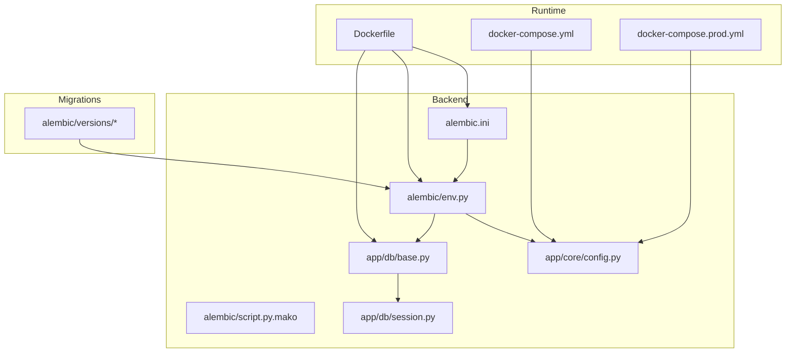
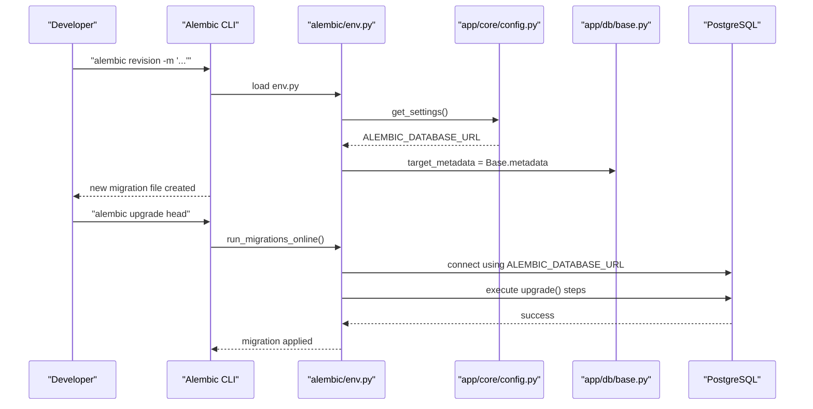
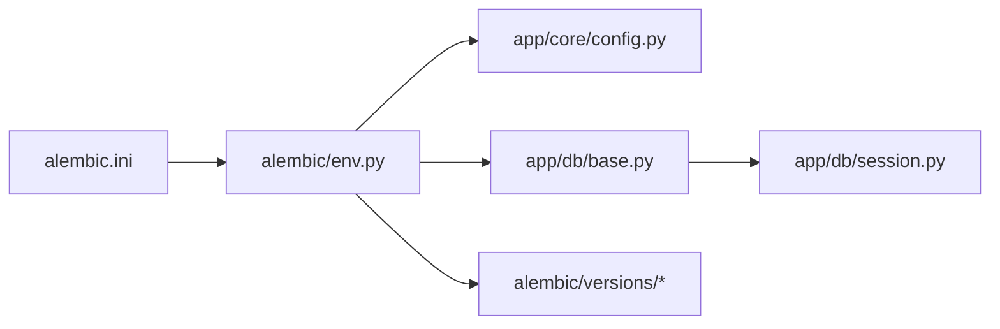

# Migration Management

<cite>
**Referenced Files in This Document**
- [alembic.ini](file://backend/alembic.ini)
- [env.py](file://backend/alembic/env.py)
- [script.py.mako](file://backend/alembic/script.py.mako)
- [base.py](file://backend/app/db/base.py)
- [session.py](file://backend/app/db/session.py)
- [config.py](file://backend/app/core/config.py)
- [20260617_0001_initial_users_properties.py](file://backend/alembic/versions/20260617_0001_initial_users_properties.py)
- [20260620_0002_pgvector_embedding.py](file://backend/alembic/versions/20260620_0002_pgvector_embedding.py)
- [20260623_0008_deposit_contract_payment_poi.py](file://backend/alembic/versions/20260623_0008_deposit_contract_payment_poi.py)
- [5ac4aa5f38f4_merge_migration_heads_after_ui_branch_.py](file://backend/alembic/versions/5ac4aa5f38f4_merge_migration_heads_after_ui_branch_.py)
- [docker-compose.yml](file://docker-compose.yml)
- [docker-compose.prod.yml](file://docker-compose.prod.yml)
- [Dockerfile](file://backend/Dockerfile)
</cite>

## Table of Contents
1. [Introduction](#introduction)
2. [Project Structure](#project-structure)
3. [Core Components](#core-components)
4. [Architecture Overview](#architecture-overview)
5. [Detailed Component Analysis](#detailed-component-analysis)
6. [Dependency Analysis](#dependency-analysis)
7. [Performance Considerations](#performance-considerations)
8. [Troubleshooting Guide](#troubleshooting-guide)
9. [Conclusion](#conclusion)
10. [Appendices](#appendices)

## Introduction
This document explains how Alembic is used for database migration management and version control in the project. It covers the end-to-end workflow: creating migrations, applying them across environments, handling conflicts, understanding revision history and dependencies, environment-specific configuration, best practices for idempotent changes, data transformations, rollback procedures, common scenarios (adding columns, modifying constraints, schema changes), and backup and disaster recovery strategies.

## Project Structure
The Alembic setup lives under backend/alembic with a single-database configuration. The runtime application uses SQLAlchemy async engine and declarative base; Alembic reads settings from the same configuration module to target the correct database URL per environment.

**Diagram sources**
- [alembic.ini:1-43](file://backend/alembic.ini#L1-L43)
- [env.py:1-51](file://backend/alembic/env.py#L1-L51)
- [script.py.mako:1-26](file://backend/alembic/script.py.mako#L1-L26)
- [base.py:1-35](file://backend/app/db/base.py#L1-L35)
- [session.py:1-14](file://backend/app/db/session.py#L1-L14)
- [config.py:1-167](file://backend/app/core/config.py#L1-L167)
- [Dockerfile:1-61](file://backend/Dockerfile#L1-L61)
- [docker-compose.yml:1-53](file://docker-compose.yml#L1-L53)
- [docker-compose.prod.yml:1-217](file://docker-compose.prod.yml#L1-L217)

**Section sources**
- [alembic.ini:1-43](file://backend/alembic.ini#L1-L43)
- [env.py:1-51](file://backend/alembic/env.py#L1-L51)
- [script.py.mako:1-26](file://backend/alembic/script.py.mako#L1-L26)
- [base.py:1-35](file://backend/app/db/base.py#L1-L35)
- [session.py:1-14](file://backend/app/db/session.py#L1-L14)
- [config.py:1-167](file://backend/app/core/config.py#L1-L167)
- [Dockerfile:1-61](file://backend/Dockerfile#L1-L61)
- [docker-compose.yml:1-53](file://docker-compose.yml#L1-L53)
- [docker-compose.prod.yml:1-217](file://docker-compose.prod.yml#L1-L217)

## Core Components
- alembic.ini: Default Alembic configuration including script location and logging. The default sqlalchemy.url is overridden at runtime by env.py.
- env.py: Loads application settings, sets the effective database URL for Alembic, configures metadata via Base.metadata, and runs migrations in online or offline mode.
- script.py.mako: Template for generated migration files, defining revision identifiers, dependency links, and upgrade/downgrade stubs.
- app/db/base.py: Aggregates all ORM models so Alembic can detect schema changes through Base.metadata.
- app/db/session.py: Defines the async engine and DeclarativeBase used by the application; Alembic targets the same metadata.
- app/core/config.py: Provides Settings with separate DATABASE_URL (async driver) and ALEMBIC_DATABASE_URL (sync driver) fields, sourced from environment variables.

Key responsibilities:
- Environment-driven database targeting via ALEMBIC_DATABASE_URL.
- Single-metadata model discovery for automatic diffing and safe upgrades.
- Clear separation between runtime DB connection (asyncpg) and migration connection (psycopg).

**Section sources**
- [alembic.ini:1-43](file://backend/alembic.ini#L1-L43)
- [env.py:1-51](file://backend/alembic/env.py#L1-L51)
- [script.py.mako:1-26](file://backend/alembic/script.py.mako#L1-L26)
- [base.py:1-35](file://backend/app/db/base.py#L1-L35)
- [session.py:1-14](file://backend/app/db/session.py#L1-L14)
- [config.py:1-167](file://backend/app/core/config.py#L1-L167)

## Architecture Overview
Alembic integrates with the application’s configuration and metadata to apply migrations consistently across environments.

**Diagram sources**
- [env.py:1-51](file://backend/alembic/env.py#L1-L51)
- [config.py:1-167](file://backend/app/core/config.py#L1-L167)
- [base.py:1-35](file://backend/app/db/base.py#L1-L35)

## Detailed Component Analysis

### Alembic Configuration and Runtime Integration
- env.py overrides sqlalchemy.url with ALEMBIC_DATABASE_URL from Settings, ensuring migrations use the intended sync driver and credentials.
- Offline vs online modes are supported; both configure context with Base.metadata and run within a transactional context where applicable.

Best practice implications:
- Always set ALEMBIC_DATABASE_URL per environment to avoid accidental writes to dev databases.
- Keep Base.metadata up to date by importing all models in base.py so Alembic can infer schema accurately.

**Section sources**
- [env.py:1-51](file://backend/alembic/env.py#L1-L51)
- [config.py:1-167](file://backend/app/core/config.py#L1-L167)
- [base.py:1-35](file://backend/app/db/base.py#L1-L35)

### Migration File Structure and Revision History
- Each migration defines revision, down_revision, branch_labels, depends_on, and implements upgrade() and downgrade().
- The template script.py.mako provides these fields and function stubs.
- Example patterns:
  - Initial schema creation with tables, indexes, enums, and constraints.
  - Adding pgvector extension and embedding column with IVFFlat index.
  - Adding multiple tables and columns together (e.g., contracts, payments, property_pois).
  - Merge migration to reconcile multiple heads after branching.

Revision chain highlights:
- 0001 initial users and properties.
- 0002 adds pgvector extension and embedding vector field.
- 0008 introduces deposit-related columns, contracts, payments, and POI table.
- A merge revision reconciles two heads after UI branch integration.

**Section sources**
- [script.py.mako:1-26](file://backend/alembic/script.py.mako#L1-L26)
- [20260617_0001_initial_users_properties.py:1-94](file://backend/alembic/versions/20260617_0001_initial_users_properties.py#L1-L94)
- [20260620_0002_pgvector_embedding.py:1-40](file://backend/alembic/versions/20260620_0002_pgvector_embedding.py#L1-L40)
- [20260623_0008_deposit_contract_payment_poi.py:1-119](file://backend/alembic/versions/20260623_0008_deposit_contract_payment_poi.py#L1-L119)
- [5ac4aa5f38f4_merge_migration_heads_after_ui_branch_.py:1-26](file://backend/alembic/versions/5ac4aa5f38f4_merge_migration_heads_after_ui_branch_.py#L1-L26)

### Dependency Management and Branching
- Linear chains are expressed via down_revision pointing to the previous revision.
- Multiple heads are merged using a tuple in down_revision to converge divergent branches into a single line.

Operational guidance:
- When merging, ensure no conflicting changes exist on overlapping objects. If needed, adjust one branch before merging.
- Use descriptive messages and keep each migration focused on a single logical change.

**Section sources**
- [5ac4aa5f38f4_merge_migration_heads_after_ui_branch_.py:1-26](file://backend/alembic/versions/5ac4aa5f38f4_merge_migration_heads_after_ui_branch_.py#L1-L26)

### Environment-Specific Configurations
- Development: docker-compose.yml provisions PostgreSQL with pgvector and Redis; ALEMBIC_DATABASE_URL should point to this instance.
- Production: docker-compose.prod.yml sets ALEMBIC_DATABASE_URL to the internal Postgres service name and enforces non-debug mode.
- Dockerfile copies alembic.ini and alembic/ into the image, enabling migration commands inside containers.

Environment variable usage:
- ALEMBIC_DATABASE_URL: Sync driver URL for migrations.
- DATABASE_URL: Async driver URL for application runtime.

**Section sources**
- [docker-compose.yml:1-53](file://docker-compose.yml#L1-L53)
- [docker-compose.prod.yml:1-217](file://docker-compose.prod.yml#L1-L217)
- [Dockerfile:1-61](file://backend/Dockerfile#L1-L61)
- [config.py:1-167](file://backend/app/core/config.py#L1-L167)

### Common Migration Scenarios
- Add a column with a default value: demonstrated by adding deposit_amount and service_fee_rate to existing tables.
- Create new tables with foreign keys and indexes: shown by contracts, payments, and property_pois.
- Enable extensions and add vector columns with specialized indexes: shown by pgvector extension and IVFFlat index.
- Merge divergent histories: shown by the merge migration reconciling multiple heads.

Implementation references:
- Column additions and defaults.
- New table creation with constraints and indexes.
- Extension activation and vector indexing.
- Multi-head merge.

**Section sources**
- [20260623_0008_deposit_contract_payment_poi.py:1-119](file://backend/alembic/versions/20260623_0008_deposit_contract_payment_poi.py#L1-L119)
- [20260620_0002_pgvector_embedding.py:1-40](file://backend/alembic/versions/20260620_0002_pgvector_embedding.py#L1-L40)
- [5ac4aa5f38f4_merge_migration_heads_after_ui_branch_.py:1-26](file://backend/alembic/versions/5ac4aa5f38f4_merge_migration_heads_after_ui_branch_.py#L1-L26)

### Idempotency and Data Transformations
- Prefer safe operations like CREATE EXTENSION IF NOT EXISTS to make migrations re-runnable without errors.
- For data updates, consider conditional logic or check-first patterns to avoid duplicate work.
- Use server_default for new columns when appropriate to backfill safely.

Examples in codebase:
- Conditional extension creation for pgvector.
- Server-side defaults for new numeric and boolean columns.

**Section sources**
- [20260620_0002_pgvector_embedding.py:1-40](file://backend/alembic/versions/20260620_0002_pgvector_embedding.py#L1-L40)
- [20260623_0008_deposit_contract_payment_poi.py:1-119](file://backend/alembic/versions/20260623_0008_deposit_contract_payment_poi.py#L1-L119)

### Rollback Procedures
- Every migration should implement downgrade() that reverses upgrade() changes in reverse order (indexes before tables, columns before tables).
- Test rollbacks locally before promoting to higher environments.

References:
- Downgrade implementations drop indexes and tables in reverse order.

**Section sources**
- [20260617_0001_initial_users_properties.py:1-94](file://backend/alembic/versions/20260617_0001_initial_users_properties.py#L1-L94)
- [20260623_0008_deposit_contract_payment_poi.py:1-119](file://backend/alembic/versions/20260623_0008_deposit_contract_payment_poi.py#L1-L119)

### Creating and Applying Migrations Across Environments
- Create a new migration: generate a revision file with a descriptive message.
- Apply to development: run upgrade against the local database configured via ALEMBIC_DATABASE_URL.
- Promote to staging/production: ensure ALEMBIC_DATABASE_URL points to the target environment and run upgrade head.
- Verify health: confirm application startup and critical endpoints succeed post-migration.

Operational notes:
- In production, migrations are executed outside the web process or as a pre-deploy step to minimize downtime.
- Ensure the container image includes alembic.ini and alembic/ directory if running migrations inside containers.

**Section sources**
- [env.py:1-51](file://backend/alembic/env.py#L1-L51)
- [docker-compose.prod.yml:1-217](file://docker-compose.prod.yml#L1-L217)
- [Dockerfile:1-61](file://backend/Dockerfile#L1-L61)

### Handling Migration Conflicts
- Symptoms: Alembic detects multiple heads or inconsistent revision graphs.
- Resolution: create a merge migration that points to multiple down_revisions to unify the graph.
- Validation: run alembic current and alembic history to verify a single head.

Reference:
- Merge migration example reconciling two heads.

**Section sources**
- [5ac4aa5f38f4_merge_migration_heads_after_ui_branch_.py:1-26](file://backend/alembic/versions/5ac4aa5f38f4_merge_migration_heads_after_ui_branch_.py#L1-L26)

## Dependency Analysis
Alembic depends on:
- Application configuration for database URLs.
- Declarative base metadata for schema detection.
- Versioned migration scripts for state transitions.

**Diagram sources**
- [alembic.ini:1-43](file://backend/alembic.ini#L1-L43)
- [env.py:1-51](file://backend/alembic/env.py#L1-L51)
- [config.py:1-167](file://backend/app/core/config.py#L1-L167)
- [base.py:1-35](file://backend/app/db/base.py#L1-L35)
- [session.py:1-14](file://backend/app/db/session.py#L1-L14)

**Section sources**
- [alembic.ini:1-43](file://backend/alembic.ini#L1-L43)
- [env.py:1-51](file://backend/alembic/env.py#L1-L51)
- [config.py:1-167](file://backend/app/core/config.py#L1-L167)
- [base.py:1-35](file://backend/app/db/base.py#L1-L35)
- [session.py:1-14](file://backend/app/db/session.py#L1-L14)

## Performance Considerations
- Large data migrations:
  - Break into smaller batches to avoid long locks.
  - Use temporary indexes or disable indexes during bulk loads, then recreate.
- Vector indexes:
  - IVFFlat index creation can be expensive; schedule during low-traffic windows.
- Concurrency:
  - Avoid concurrent migrations; ensure only one process applies migrations at a time.

[No sources needed since this section provides general guidance]

## Troubleshooting Guide
Common issues and resolutions:
- Wrong database targeted:
  - Confirm ALEMBIC_DATABASE_URL is set correctly for the environment.
- Missing models in metadata:
  - Ensure all models are imported in base.py so Alembic sees them.
- Driver mismatch:
  - Use a synchronous driver for migrations (psycopg) via ALEMBIC_DATABASE_URL; async drivers are for runtime.
- Extension not available:
  - Ensure the database supports required extensions (e.g., pgvector) and enable them in migrations conditionally.
- Multiple heads:
  - Create a merge migration to unify the revision graph.

Operational checks:
- Inspect current revision and history to validate state.
- Run migrations in offline mode to preview SQL statements.

**Section sources**
- [env.py:1-51](file://backend/alembic/env.py#L1-L51)
- [config.py:1-167](file://backend/app/core/config.py#L1-L167)
- [base.py:1-35](file://backend/app/db/base.py#L1-L35)

## Conclusion
The project uses a clean, single-database Alembic setup driven by centralized configuration. Migrations follow clear revision chaining, support branching and merging, and integrate seamlessly with Dockerized environments. By adhering to idempotent design, careful rollback planning, and robust environment configuration, teams can evolve the schema safely across development, staging, and production.

[No sources needed since this section summarizes without analyzing specific files]

## Appendices

### Backup Strategies Before Migrations
- Logical backups:
  - Use pg_dump to export schemas and data prior to major migrations.
- Point-in-time recovery:
  - Ensure WAL archiving is enabled for PITR restore capability.
- Snapshot-based backups:
  - For managed databases, take snapshots before deploying schema changes.
- Verification:
  - Validate backups by restoring to a test instance and confirming integrity.

[No sources needed since this section provides general guidance]

### Disaster Recovery Procedures
- Restore from snapshot or logical backup.
- Reapply migrations to reach desired state if necessary.
- Validate application connectivity and critical endpoints.
- Monitor error rates and performance metrics post-recovery.

[No sources needed since this section provides general guidance]