# Supporting Data Models

<cite>
**Referenced Files in This Document**
- [contract.py](file://backend/app/models/contract.py)
- [payment.py](file://backend/app/models/payment.py)
- [notification.py](file://backend/app/models/notification.py)
- [chat.py](file://backend/app/models/chat.py)
- [poi.py](file://backend/app/models/poi.py)
- [mixins.py](file://backend/app/models/mixins.py)
- [contract_service.py](file://backend/app/services/contract_service.py)
- [payment_service.py](file://backend/app/services/payment_service.py)
- [notification_service.py](file://backend/app/services/notification_service.py)
- [poi_service.py](file://backend/app/services/poi_service.py)
- [contracts.py](file://backend/app/api/v1/routes/contracts.py)
- [payments.py](file://backend/app/api/v1/routes/payments.py)
- [notifications.py](file://backend/app/api/v1/routes/notifications.py)
- [pois.py](file://backend/app/api/v1/routes/pois.py)
- [contract.py](file://backend/app/schemas/contract.py)
- [payment.py](file://backend/app/schemas/payment.py)
- [notification.py](file://backend/app/schemas/notification.py)
- [poi.py](file://backend/app/schemas/poi.py)
</cite>

## Table of Contents
1. Introduction
2. Project Structure
3. Core Components
4. Architecture Overview
5. Detailed Component Analysis
6. Dependency Analysis
7. Performance Considerations
8. Troubleshooting Guide
9. Conclusion

## Introduction
This document describes the supporting data models and their usage patterns: Contract, Payment, Notification, Chat, and POI entities. It explains how these models integrate with core domain entities (Booking, User, Property), how they are exposed via APIs, and how services orchestrate business logic such as contract signing, payment processing, multi-channel notifications, AI chat sessions, and location-based point-of-interest generation.

## Project Structure
The supporting models live under backend/app/models and are paired with Pydantic schemas under backend/app/schemas and service implementations under backend/app/services. API routes under backend/app/api/v1/routes expose CRUD and workflow endpoints for each model.

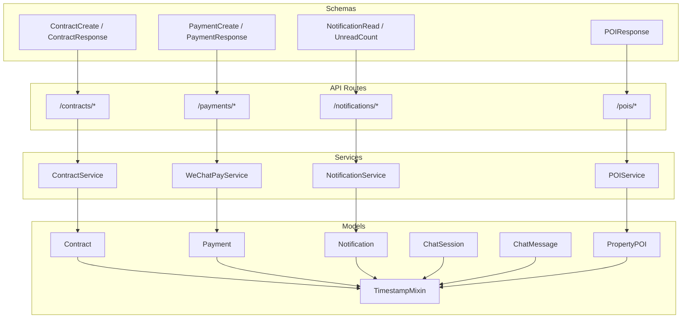

**Diagram sources**
- [contract.py:1-37](file://backend/app/models/contract.py#L1-L37)
- [payment.py:1-34](file://backend/app/models/payment.py#L1-L34)
- [notification.py:1-36](file://backend/app/models/notification.py#L1-L36)
- [chat.py:1-62](file://backend/app/models/chat.py#L1-L62)
- [poi.py:1-28](file://backend/app/models/poi.py#L1-L28)
- [mixins.py:1-19](file://backend/app/models/mixins.py#L1-L19)
- [contract_service.py:1-96](file://backend/app/services/contract_service.py#L1-L96)
- [payment_service.py:1-445](file://backend/app/services/payment_service.py#L1-L445)
- [notification_service.py:1-164](file://backend/app/services/notification_service.py#L1-L164)
- [poi_service.py:1-311](file://backend/app/services/poi_service.py#L1-L311)
- [contracts.py:1-88](file://backend/app/api/v1/routes/contracts.py#L1-L88)
- [payments.py:1-85](file://backend/app/api/v1/routes/payments.py#L1-L85)
- [notifications.py:1-50](file://backend/app/api/v1/routes/notifications.py#L1-L50)
- [pois.py:1-32](file://backend/app/api/v1/routes/pois.py#L1-L32)
- [contract.py:1-23](file://backend/app/schemas/contract.py#L1-L23)
- [payment.py:1-23](file://backend/app/schemas/payment.py#L1-L23)
- [notification.py:1-23](file://backend/app/schemas/notification.py#L1-L23)
- [poi.py:1-16](file://backend/app/schemas/poi.py#L1-L16)

**Section sources**
- [contract.py:1-37](file://backend/app/models/contract.py#L1-L37)
- [payment.py:1-34](file://backend/app/models/payment.py#L1-L34)
- [notification.py:1-36](file://backend/app/models/notification.py#L1-L36)
- [chat.py:1-62](file://backend/app/models/chat.py#L1-L62)
- [poi.py:1-28](file://backend/app/models/poi.py#L1-L28)
- [mixins.py:1-19](file://backend/app/models/mixins.py#L1-L19)
- [contract_service.py:1-96](file://backend/app/services/contract_service.py#L1-L96)
- [payment_service.py:1-445](file://backend/app/services/payment_service.py#L1-L445)
- [notification_service.py:1-164](file://backend/app/services/notification_service.py#L1-L164)
- [poi_service.py:1-311](file://backend/app/services/poi_service.py#L1-L311)
- [contracts.py:1-88](file://backend/app/api/v1/routes/contracts.py#L1-L88)
- [payments.py:1-85](file://backend/app/api/v1/routes/payments.py#L1-L85)
- [notifications.py:1-50](file://backend/app/api/v1/routes/notifications.py#L1-L50)
- [pois.py:1-32](file://backend/app/api/v1/routes/pois.py#L1-L32)
- [contract.py:1-23](file://backend/app/schemas/contract.py#L1-L23)
- [payment.py:1-23](file://backend/app/schemas/payment.py#L1-L23)
- [notification.py:1-23](file://backend/app/schemas/notification.py#L1-L23)
- [poi.py:1-16](file://backend/app/schemas/poi.py#L1-L16)

## Core Components
- Contract: Represents a rental agreement tied to a Booking, Tenant (User), and Property. Supports lifecycle states (draft, signed), optional file storage path, and timestamping.
- Payment: Tracks deposit or rent payments linked to a Booking and User, including transaction identifiers, status, method, and timestamps.
- Notification: Stores user-targeted messages with typed categories and read/unread state; integrates with multi-channel delivery via Celery tasks.
- Chat: Manages conversational sessions and messages with roles (user, assistant, system) and JSON metadata for context.
- POI: Associates generated points-of-interest content and structured category data with a Property, including review flags and generation timestamps.

All models inherit TimestampMixin for created_at and updated_at fields.

**Section sources**
- [contract.py:1-37](file://backend/app/models/contract.py#L1-L37)
- [payment.py:1-34](file://backend/app/models/payment.py#L1-L34)
- [notification.py:1-36](file://backend/app/models/notification.py#L1-L36)
- [chat.py:1-62](file://backend/app/models/chat.py#L1-L62)
- [poi.py:1-28](file://backend/app/models/poi.py#L1-L28)
- [mixins.py:1-19](file://backend/app/models/mixins.py#L1-L19)

## Architecture Overview
The supporting models are accessed through FastAPI routes that delegate to service classes. Services perform database operations, external integrations (e.g., WeChat Pay, AMap geocoding, OpenAI), and orchestration across related entities. Notifications use asynchronous task dispatch for email, SMS, and WeChat channels.

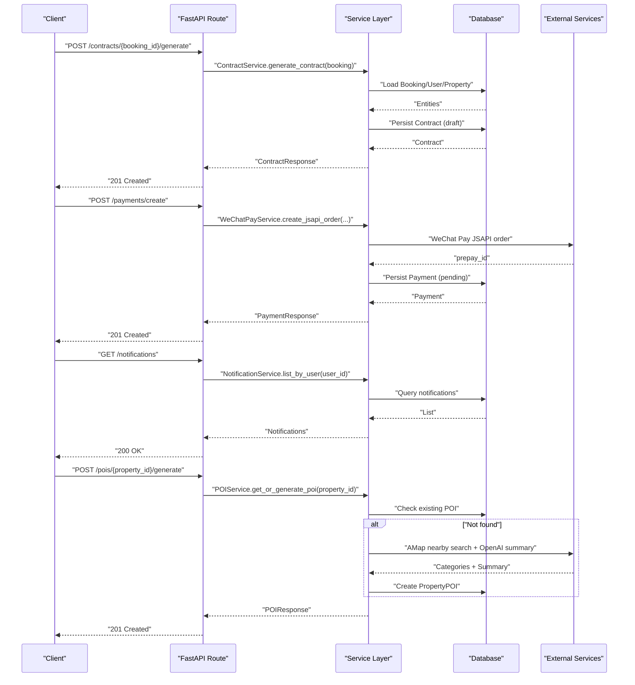

**Diagram sources**
- [contracts.py:1-88](file://backend/app/api/v1/routes/contracts.py#L1-L88)
- [contract_service.py:1-96](file://backend/app/services/contract_service.py#L1-L96)
- [payments.py:1-85](file://backend/app/api/v1/routes/payments.py#L1-L85)
- [payment_service.py:1-445](file://backend/app/services/payment_service.py#L1-L445)
- [notifications.py:1-50](file://backend/app/api/v1/routes/notifications.py#L1-L50)
- [notification_service.py:1-164](file://backend/app/services/notification_service.py#L1-L164)
- [pois.py:1-32](file://backend/app/api/v1/routes/pois.py#L1-L32)
- [poi_service.py:1-311](file://backend/app/services/poi_service.py#L1-L311)

## Detailed Component Analysis

### Contract Model
- Purpose: Store legal rental agreements per booking with template name, content, status, signature time, and optional file path.
- Relationships:
  - booking_id -> Bookings (unique)
  - tenant_id -> Users
  - property_id -> Properties
- Lifecycle:
  - Draft creation from booking details
  - Signing by tenant updates status and signed_at
- Digital Signature Support:
  - The model includes signed_at and file_path fields suitable for storing signature artifacts and signed documents.
  - The sign endpoint enforces tenant-only signing and prevents double-signing.
- Template Management:
  - template_name field supports selecting different contract templates.
  - Generation populates content based on booking and property data.

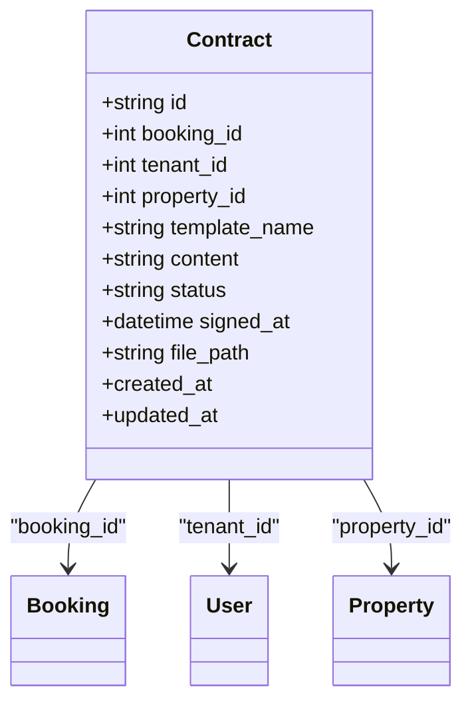

**Diagram sources**
- [contract.py:1-37](file://backend/app/models/contract.py#L1-L37)

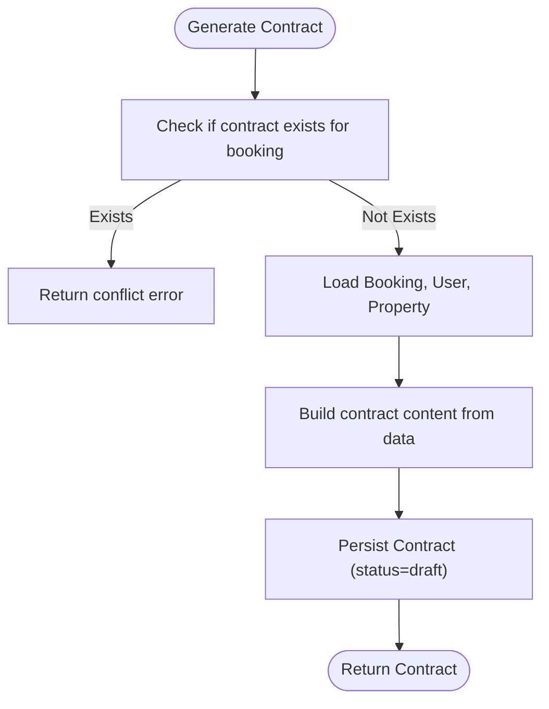

**Diagram sources**
- [contract_service.py:1-96](file://backend/app/services/contract_service.py#L1-L96)
- [contracts.py:1-88](file://backend/app/api/v1/routes/contracts.py#L1-L88)

**Section sources**
- [contract.py:1-37](file://backend/app/models/contract.py#L1-L37)
- [contract_service.py:1-96](file://backend/app/services/contract_service.py#L1-L96)
- [contracts.py:1-88](file://backend/app/api/v1/routes/contracts.py#L1-L88)
- [contract.py:1-23](file://backend/app/schemas/contract.py#L1-L23)

### Payment Model
- Purpose: Track financial transactions for bookings, including amount, method, status, and timestamps.
- Relationships:
  - booking_id -> Bookings
  - user_id -> Users
- Transaction Tracking:
  - transaction_id links to external payment provider records.
  - status transitions from pending to success upon callback confirmation.
- Payment Method Integration:
  - Default method is wechat_pay; WeChat Pay V3 integration handles order creation, signature verification, decryption, and refund flows.
- Financial Reconciliation:
  - Callbacks update payment.paid_at and booking.deposit_status to confirmed.
  - Query endpoints support reconciliation by out_trade_no or transaction_id.

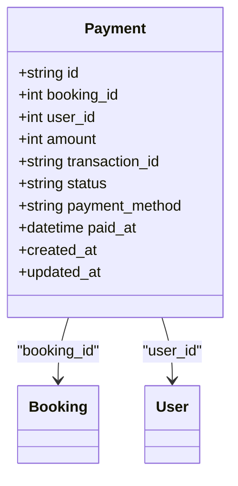

**Diagram sources**
- [payment.py:1-34](file://backend/app/models/payment.py#L1-L34)

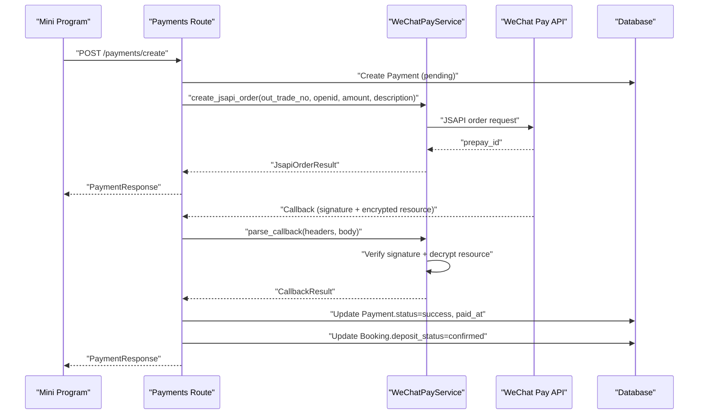

**Diagram sources**
- [payments.py:1-85](file://backend/app/api/v1/routes/payments.py#L1-L85)
- [payment_service.py:1-445](file://backend/app/services/payment_service.py#L1-L445)

**Section sources**
- [payment.py:1-34](file://backend/app/models/payment.py#L1-L34)
- [payment_service.py:1-445](file://backend/app/services/payment_service.py#L1-L445)
- [payments.py:1-85](file://backend/app/api/v1/routes/payments.py#L1-L85)
- [payment.py:1-23](file://backend/app/schemas/payment.py#L1-L23)

### Notification Model
- Purpose: Deliver system and event-driven messages to users with typed categories and read/unread tracking.
- Multi-channel Delivery:
  - Channels include WeChat template messages, SMS, and Email.
  - Dispatch uses Celery tasks; failures are logged without blocking DB writes.
- User Preferences:
  - Channel selection can be specified per notification; defaults to all channels.
- Read State Management:
  - Mark single or all notifications as read; provide unread count.

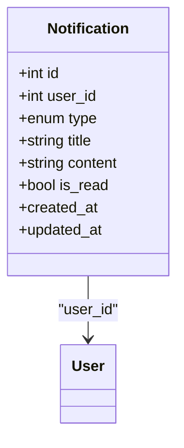

**Diagram sources**
- [notification.py:1-36](file://backend/app/models/notification.py#L1-L36)

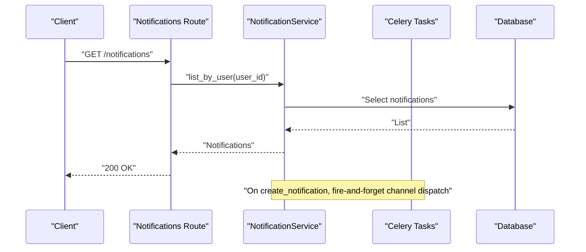

**Diagram sources**
- [notifications.py:1-50](file://backend/app/api/v1/routes/notifications.py#L1-L50)
- [notification_service.py:1-164](file://backend/app/services/notification_service.py#L1-L164)

**Section sources**
- [notification.py:1-36](file://backend/app/models/notification.py#L1-L36)
- [notification_service.py:1-164](file://backend/app/services/notification_service.py#L1-L164)
- [notifications.py:1-50](file://backend/app/api/v1/routes/notifications.py#L1-L50)
- [notification.py:1-23](file://backend/app/schemas/notification.py#L1-L23)

### Chat Model
- Purpose: Manage AI assistant conversations with session scoping and message history.
- Context Management:
  - ChatSession groups messages and tracks status (active/closed).
  - ChatMessage stores role (user/assistant/system), content, and JSON metadata for context.
- Usage Patterns:
  - Create a new session per conversation thread.
  - Append messages with role and optional metadata (e.g., tool calls, references).
  - Close sessions when appropriate to free resources.

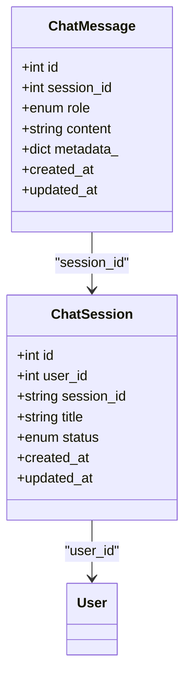

**Diagram sources**
- [chat.py:1-62](file://backend/app/models/chat.py#L1-L62)

**Section sources**
- [chat.py:1-62](file://backend/app/models/chat.py#L1-L62)

### POI Model
- Purpose: Provide location-based insights for properties, including summarized descriptions and categorized nearby facilities.
- Features:
  - Content summary and structured poi_data (categories like transport, dining, shopping).
  - generated_at timestamp and reviewed flag for moderation workflows.
- Generation Logic:
  - Uses AMap geocoding and nearby search to collect facilities.
  - Optional OpenAI summarization to produce natural language summaries.
  - Fallback to mock data when external services fail.

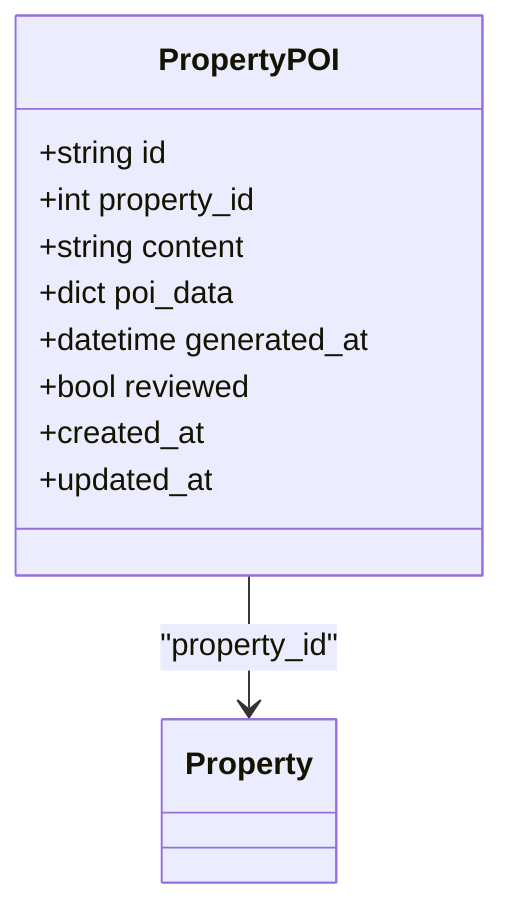

**Diagram sources**
- [poi.py:1-28](file://backend/app/models/poi.py#L1-L28)

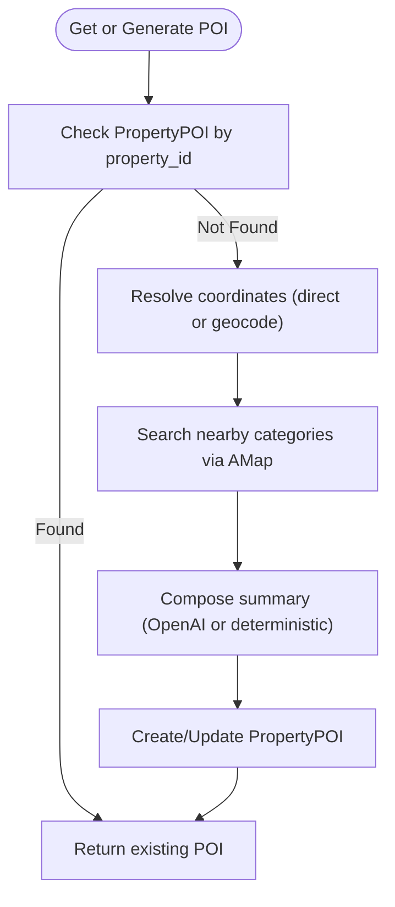

**Diagram sources**
- [poi_service.py:1-311](file://backend/app/services/poi_service.py#L1-L311)
- [pois.py:1-32](file://backend/app/api/v1/routes/pois.py#L1-L32)

**Section sources**
- [poi.py:1-28](file://backend/app/models/poi.py#L1-L28)
- [poi_service.py:1-311](file://backend/app/services/poi_service.py#L1-L311)
- [pois.py:1-32](file://backend/app/api/v1/routes/pois.py#L1-L32)
- [poi.py:1-16](file://backend/app/schemas/poi.py#L1-L16)

## Dependency Analysis
- Model Dependencies:
  - All models depend on TimestampMixin for auditability.
  - Contract depends on Booking, User, Property.
  - Payment depends on Booking, User.
  - Notification depends on User.
  - ChatSession depends on User; ChatMessage depends on ChatSession.
  - PropertyPOI depends on Property.
- Service Dependencies:
  - ContractService orchestrates Booking/User/Property reads and Contract persistence.
  - WeChatPayService integrates with WeChat Pay V3 for order creation, callbacks, refunds.
  - NotificationService dispatches async tasks for multiple channels.
  - POIService integrates AMap geocoding and optional OpenAI summarization.

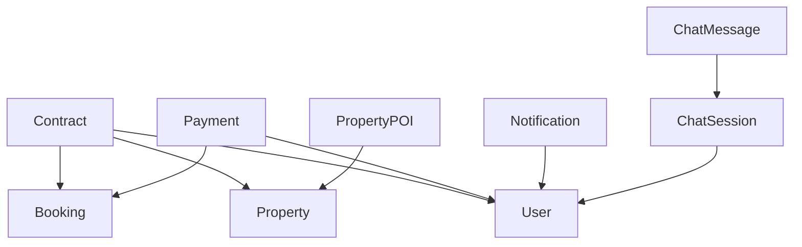

**Diagram sources**
- [contract.py:1-37](file://backend/app/models/contract.py#L1-L37)
- [payment.py:1-34](file://backend/app/models/payment.py#L1-L34)
- [notification.py:1-36](file://backend/app/models/notification.py#L1-L36)
- [chat.py:1-62](file://backend/app/models/chat.py#L1-L62)
- [poi.py:1-28](file://backend/app/models/poi.py#L1-L28)

**Section sources**
- [contract.py:1-37](file://backend/app/models/contract.py#L1-L37)
- [payment.py:1-34](file://backend/app/models/payment.py#L1-L34)
- [notification.py:1-36](file://backend/app/models/notification.py#L1-L36)
- [chat.py:1-62](file://backend/app/models/chat.py#L1-L62)
- [poi.py:1-28](file://backend/app/models/poi.py#L1-L28)

## Performance Considerations
- Indexing:
  - Contracts and Payments index foreign keys for efficient lookups.
  - Notifications index user_id and id for listing and marking read.
  - ChatSession indexes user_id and session_id for session retrieval.
- Eager Loading:
  - ChatSession relationship uses selectin loading to reduce N+1 queries when fetching messages.
- Asynchronous Operations:
  - Notification channel dispatch is fire-and-forget via Celery to avoid blocking response times.
- External Integrations:
  - POI generation may involve multiple AMap calls and optional OpenAI requests; fallback mechanisms ensure resilience.
- Payment Callbacks:
  - Signature verification and AES-GCM decryption should be optimized; consider caching platform certificates and minimizing redundant I/O.

[No sources needed since this section provides general guidance]

## Troubleshooting Guide
- Contract Issues:
  - Duplicate contract generation: Ensure generate endpoint checks for existing contracts per booking.
  - Unauthorized signing: Verify tenant ownership before updating status and signed_at.
- Payment Issues:
  - Callback signature verification: Confirm headers and payload structure; ensure APIv3 key and private key paths are correct.
  - Order query mismatches: Validate out_trade_no and transaction_id mapping to Payment records.
- Notification Issues:
  - Channel dispatch failures: Inspect Celery worker logs; verify task imports and credentials for SMS/email/WeChat.
  - Read state inconsistencies: Ensure mark_read and mark_all_read operate within proper authorization boundaries.
- POI Issues:
  - Geocoding failures: Fall back to district-based mock data; log warnings and retry strategies.
  - OpenAI summarization errors: Use deterministic summary fallback; validate JSON response parsing.

**Section sources**
- [contracts.py:1-88](file://backend/app/api/v1/routes/contracts.py#L1-L88)
- [contract_service.py:1-96](file://backend/app/services/contract_service.py#L1-L96)
- [payments.py:1-85](file://backend/app/api/v1/routes/payments.py#L1-L85)
- [payment_service.py:1-445](file://backend/app/services/payment_service.py#L1-L445)
- [notifications.py:1-50](file://backend/app/api/v1/routes/notifications.py#L1-L50)
- [notification_service.py:1-164](file://backend/app/services/notification_service.py#L1-L164)
- [pois.py:1-32](file://backend/app/api/v1/routes/pois.py#L1-L32)
- [poi_service.py:1-311](file://backend/app/services/poi_service.py#L1-L311)

## Conclusion
The supporting data models provide robust foundations for legal agreements, financial transactions, user notifications, AI-assisted conversations, and location-based insights. Their design emphasizes clear relationships, extensibility, and operational resilience through asynchronous processing and fallback strategies. Proper indexing, eager loading, and secure integrations ensure performance and reliability at scale.

[No sources needed since this section summarizes without analyzing specific files]