# Security & Authentication

<cite>
**Referenced Files in This Document**
- [main.py](file://backend/app/main.py)
- [config.py](file://backend/app/core/config.py)
- [security.py](file://backend/app/core/security.py)
- [security_audit.py](file://backend/app/core/security_audit.py)
- [deps.py](file://backend/app/api/deps.py)
- [auth.py](file://backend/app/api/v1/routes/auth.py)
- [wechat.py](file://backend/app/api/v1/routes/wechat.py)
- [auth_service.py](file://backend/app/services/auth_service.py)
- [audit_service.py](file://backend/app/services/audit_service.py)
- [user.py](file://backend/app/models/user.py)
- [auth.py](file://backend/app/schemas/auth.py)
- [logging.py](file://backend/app/core/logging.py)
</cite>

## Table of Contents
1. [Introduction](#introduction)
2. [Project Structure](#project-structure)
3. [Core Components](#core-components)
4. [Architecture Overview](#architecture-overview)
5. [Detailed Component Analysis](#detailed-component-analysis)
6. [Dependency Analysis](#dependency-analysis)
7. [Performance Considerations](#performance-considerations)
8. [Troubleshooting Guide](#troubleshooting-guide)
9. [Conclusion](#conclusion)
10. [Appendices](#appendices)

## Introduction
This document explains the security architecture and authentication system for the backend service. It covers JWT-based authentication with access tokens, password hashing using bcrypt, role-based access control (RBAC), middleware for CORS and rate limiting backed by Redis, request validation, user permission management, WeChat Mini Program integration, audit logging, and operational security practices such as input sanitization, SQL injection prevention, and XSS protection. It also provides guidance on implementing protected endpoints and custom authorization decorators.

## Project Structure
The security-related components are organized across core utilities, API dependencies, routes, services, models, schemas, and application wiring:

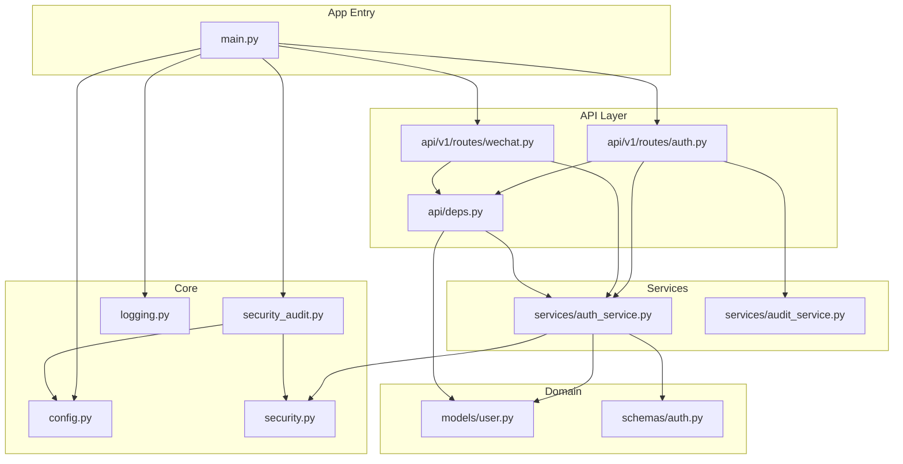

**Diagram sources**
- [main.py:17-78](file://backend/app/main.py#L17-L78)
- [config.py:7-167](file://backend/app/core/config.py#L7-L167)
- [security.py:1-34](file://backend/app/core/security.py#L1-L34)
- [security_audit.py:1-150](file://backend/app/core/security_audit.py#L1-L150)
- [logging.py:1-231](file://backend/app/core/logging.py#L1-L231)
- [deps.py:1-58](file://backend/app/api/deps.py#L1-L58)
- [auth.py:1-94](file://backend/app/api/v1/routes/auth.py#L1-L94)
- [wechat.py:1-82](file://backend/app/api/v1/routes/wechat.py#L1-L82)
- [auth_service.py:1-77](file://backend/app/services/auth_service.py#L1-L77)
- [audit_service.py:1-55](file://backend/app/services/audit_service.py#L1-L55)
- [user.py:1-48](file://backend/app/models/user.py#L1-L48)
- [auth.py:1-63](file://backend/app/schemas/auth.py#L1-L63)

**Section sources**
- [main.py:17-78](file://backend/app/main.py#L17-L78)
- [config.py:7-167](file://backend/app/core/config.py#L7-L167)

## Core Components
- Password hashing and verification: bcrypt via passlib context.
- JWT access token creation and decoding with HS256 and configurable expiry.
- Refresh token support with type enforcement and rotation.
- Rate limiting middleware using Redis sorted sets per client IP and endpoint prefix.
- CORS configuration with environment-aware origins.
- Request validation via Pydantic schemas and global exception handlers.
- RBAC via dependency injectors that enforce roles.
- Audit logging for sensitive actions like registration and login.
- WeChat Mini Program login flow exchanging a code for an access token.

Key implementation references:
- Password hashing and JWT helpers: [security.py:1-34](file://backend/app/core/security.py#L1-L34)
- Refresh tokens and rate limiter: [security_audit.py:1-150](file://backend/app/core/security_audit.py#L1-L150)
- CORS and middleware wiring: [main.py:17-78](file://backend/app/main.py#L17-L78)
- Validation and error handling: [logging.py:170-231](file://backend/app/core/logging.py#L170-L231)
- RBAC dependencies: [deps.py:19-57](file://backend/app/api/deps.py#L19-L57)
- Auth routes and audit logs: [auth.py:14-94](file://backend/app/api/v1/routes/auth.py#L14-L94)
- WeChat login route: [wechat.py:19-38](file://backend/app/api/v1/routes/wechat.py#L19-L38)
- User model and roles: [user.py:11-42](file://backend/app/models/user.py#L11-L42)
- Auth schemas: [auth.py:8-63](file://backend/app/schemas/auth.py#L8-L63)

**Section sources**
- [security.py:1-34](file://backend/app/core/security.py#L1-L34)
- [security_audit.py:1-150](file://backend/app/core/security_audit.py#L1-L150)
- [main.py:17-78](file://backend/app/main.py#L17-L78)
- [logging.py:170-231](file://backend/app/core/logging.py#L170-L231)
- [deps.py:19-57](file://backend/app/api/deps.py#L19-L57)
- [auth.py:14-94](file://backend/app/api/v1/routes/auth.py#L14-L94)
- [wechat.py:19-38](file://backend/app/api/v1/routes/wechat.py#L19-L38)
- [user.py:11-42](file://backend/app/models/user.py#L11-L42)
- [auth.py:8-63](file://backend/app/schemas/auth.py#L8-L63)

## Architecture Overview
High-level security architecture:

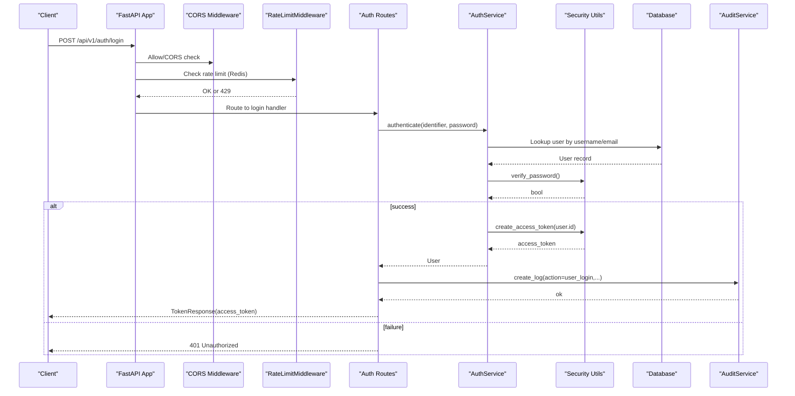

**Diagram sources**
- [main.py:27-57](file://backend/app/main.py#L27-L57)
- [auth.py:37-60](file://backend/app/api/v1/routes/auth.py#L37-L60)
- [auth_service.py:29-38](file://backend/app/services/auth_service.py#L29-L38)
- [security.py:16-28](file://backend/app/core/security.py#L16-L28)
- [audit_service.py:11-32](file://backend/app/services/audit_service.py#L11-L32)

## Detailed Component Analysis

### JWT Access Tokens and Refresh Tokens
- Access tokens: short-lived, signed with HS256 using a secret from settings; subject is the user ID.
- Refresh tokens: longer-lived, include a type claim to prevent misuse; rotation issues new pairs on refresh.
- Decoding validates signature and expiration; invalid/expired tokens return 401.

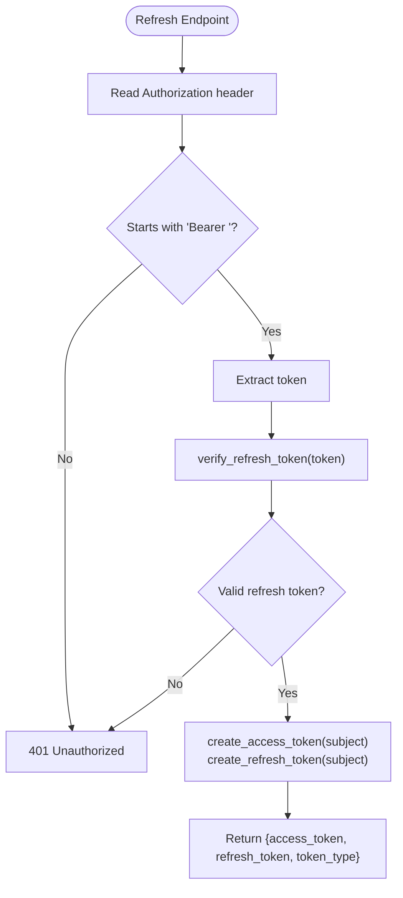

**Diagram sources**
- [auth.py:63-89](file://backend/app/api/v1/routes/auth.py#L63-L89)
- [security_audit.py:102-149](file://backend/app/core/security_audit.py#L102-L149)
- [security.py:22-33](file://backend/app/core/security.py#L22-L33)

**Section sources**
- [security.py:22-33](file://backend/app/core/security.py#L22-L33)
- [security_audit.py:102-149](file://backend/app/core/security_audit.py#L102-L149)
- [auth.py:63-89](file://backend/app/api/v1/routes/auth.py#L63-L89)

### Password Hashing with bcrypt
- Uses passlib CryptContext configured for bcrypt.
- Registration hashes passwords before persisting.
- Login verifies plain password against stored hash.

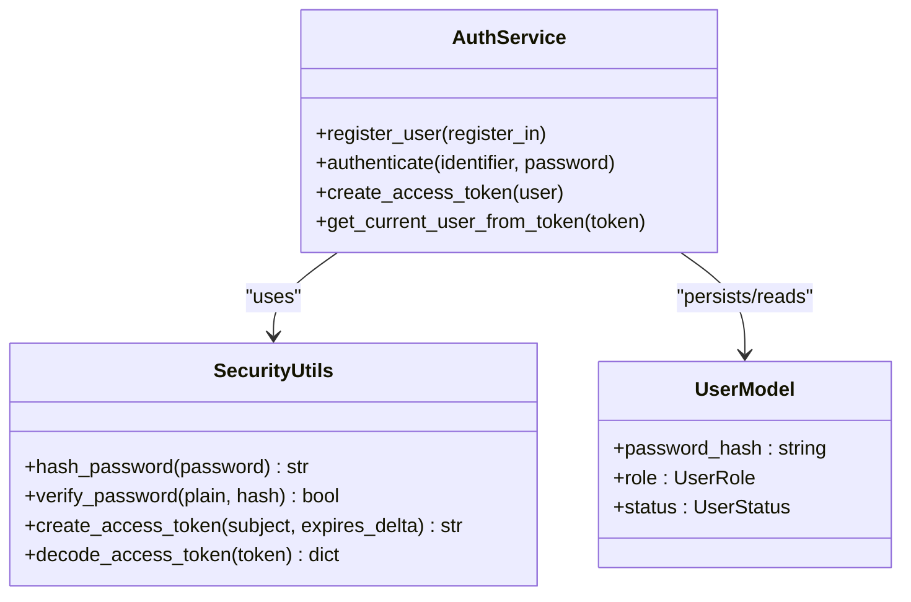

**Diagram sources**
- [auth_service.py:19-38](file://backend/app/services/auth_service.py#L19-L38)
- [security.py:9-19](file://backend/app/core/security.py#L9-L19)
- [user.py:24-42](file://backend/app/models/user.py#L24-L42)

**Section sources**
- [security.py:9-19](file://backend/app/core/security.py#L9-L19)
- [auth_service.py:19-38](file://backend/app/services/auth_service.py#L19-L38)
- [user.py:24-42](file://backend/app/models/user.py#L24-L42)

### Role-Based Access Control (RBAC)
- Roles defined as enum values: tenant, landlord, bd_manager, admin.
- Dependency injectors enforce roles: require_landlord, require_tenant, require_admin.
- Protected endpoints depend on these injectors to restrict access.

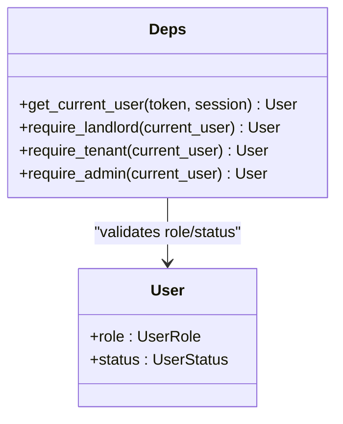

**Diagram sources**
- [user.py:11-42](file://backend/app/models/user.py#L11-L42)
- [deps.py:19-57](file://backend/app/api/deps.py#L19-L57)

**Section sources**
- [user.py:11-42](file://backend/app/models/user.py#L11-L42)
- [deps.py:19-57](file://backend/app/api/deps.py#L19-L57)

### Middleware: CORS and Rate Limiting
- CORS: allow_origins controlled by environment; credentials allowed; methods and headers wildcarded.
- Rate limiting: Redis-backed sliding window per client IP and path prefix; returns 429 with Retry-After when exceeded; disabled in debug development.

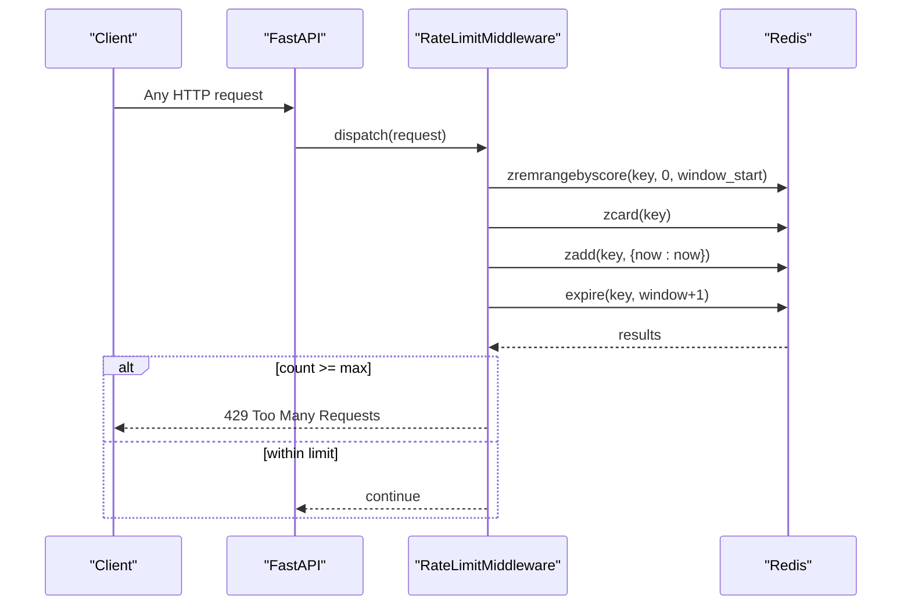

**Diagram sources**
- [main.py:27-57](file://backend/app/main.py#L27-L57)
- [security_audit.py:49-94](file://backend/app/core/security_audit.py#L49-L94)
- [config.py:40-44](file://backend/app/core/config.py#L40-L44)
- [config.py:153-161](file://backend/app/core/config.py#L153-L161)

**Section sources**
- [main.py:27-57](file://backend/app/main.py#L27-L57)
- [security_audit.py:49-94](file://backend/app/core/security_audit.py#L49-L94)
- [config.py:40-44](file://backend/app/core/config.py#L40-L44)
- [config.py:153-161](file://backend/app/core/config.py#L153-L161)

### Request Validation and Error Handling
- Input validated via Pydantic schemas for auth flows.
- Global exception handlers normalize errors and log structured details.
- Sensitive fields masked in logs to avoid leaks.

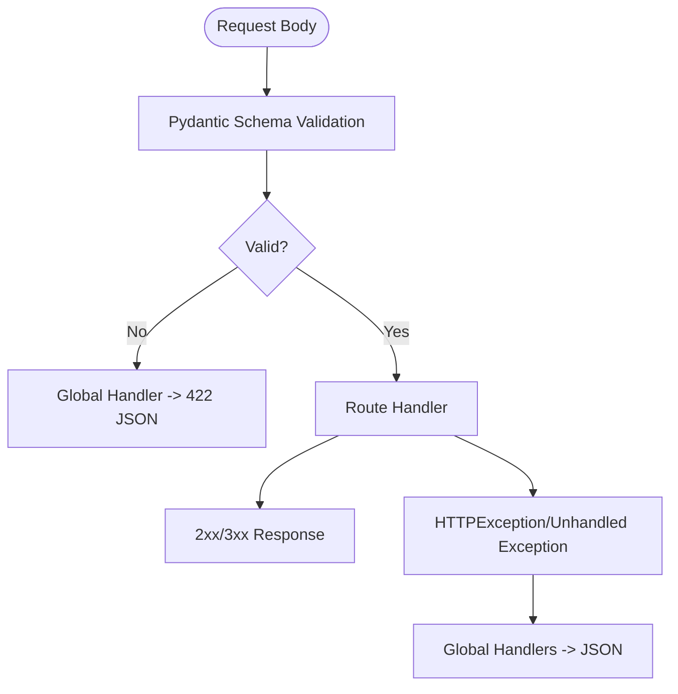

**Diagram sources**
- [auth.py:8-32](file://backend/app/schemas/auth.py#L8-L32)
- [logging.py:170-231](file://backend/app/core/logging.py#L170-L231)

**Section sources**
- [auth.py:8-32](file://backend/app/schemas/auth.py#L8-L32)
- [logging.py:170-231](file://backend/app/core/logging.py#L170-L231)

### User Permission Management
- Current user resolved from Bearer token via dependency injector.
- Role checks enforced at route level using require_* injectors.
- Status checks ensure only active users can authenticate.

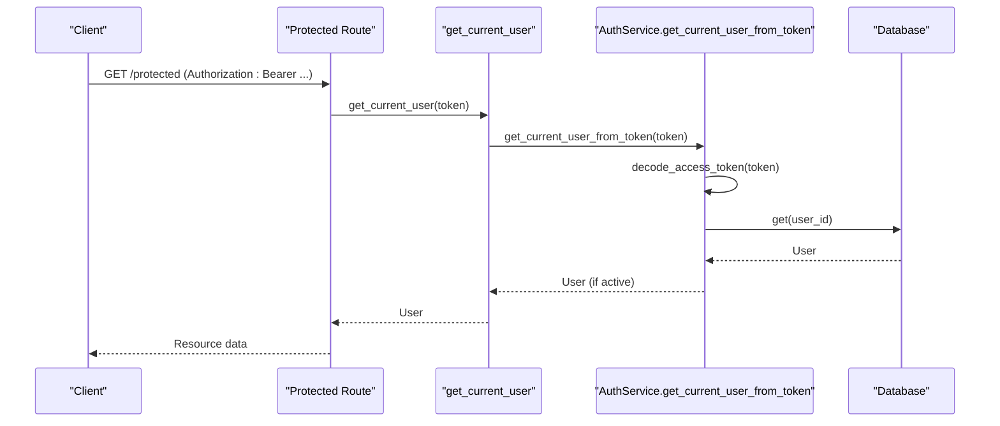

**Diagram sources**
- [deps.py:19-30](file://backend/app/api/deps.py#L19-L30)
- [auth_service.py:40-51](file://backend/app/services/auth_service.py#L40-L51)
- [security.py:31-33](file://backend/app/core/security.py#L31-L33)

**Section sources**
- [deps.py:19-30](file://backend/app/api/deps.py#L19-L30)
- [auth_service.py:40-51](file://backend/app/services/auth_service.py#L40-L51)
- [security.py:31-33](file://backend/app/core/security.py#L31-L33)

### API Key Authentication
- The current codebase does not implement a dedicated API key authentication mechanism.
- For server-to-server integrations, consider adding an API key scheme alongside JWT:
  - Add a new dependency to extract and validate an API key header.
  - Store hashed API keys in a secure table and bind them to scopes/roles.
  - Integrate with existing RBAC injectors to authorize requests.

[No sources needed since this section proposes enhancements not present in the code]

### WeChat Mini Program Integration
- Flow: exchange wx.login() code for openid/session_key, find or create user, then issue an access token.
- Phone binding uses WeChat’s business API to retrieve phone number and update the user profile.
- Configuration endpoint exposes appid for frontend initialization.

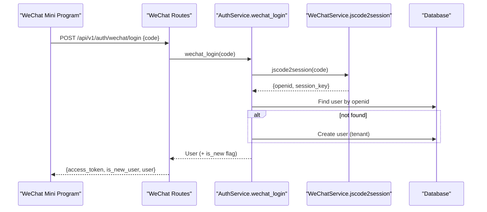

**Diagram sources**
- [wechat.py:19-38](file://backend/app/api/v1/routes/wechat.py#L19-L38)
- [auth_service.py:53-76](file://backend/app/services/auth_service.py#L53-L76)

**Section sources**
- [wechat.py:19-38](file://backend/app/api/v1/routes/wechat.py#L19-L38)
- [auth_service.py:53-76](file://backend/app/services/auth_service.py#L53-L76)

### Audit Logging
- Registration and login events are logged with user context and IP address.
- Audit entries persisted via AuditService and queryable by action/user.

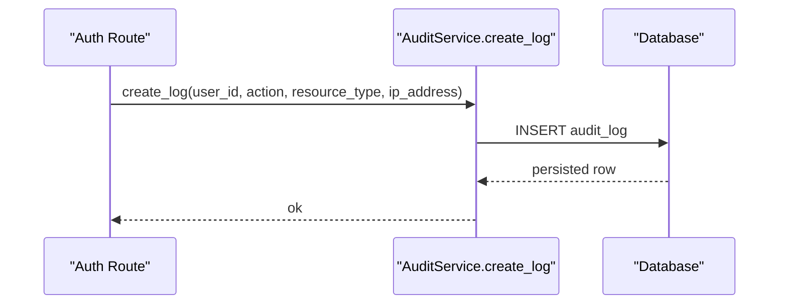

**Diagram sources**
- [auth.py:22-28](file://backend/app/api/v1/routes/auth.py#L22-L28)
- [auth.py:52-58](file://backend/app/api/v1/routes/auth.py#L52-L58)
- [audit_service.py:11-32](file://backend/app/services/audit_service.py#L11-L32)

**Section sources**
- [auth.py:22-28](file://backend/app/api/v1/routes/auth.py#L22-L28)
- [auth.py:52-58](file://backend/app/api/v1/routes/auth.py#L52-L58)
- [audit_service.py:11-32](file://backend/app/services/audit_service.py#L11-L32)

### Security Headers and XSS Protection
- The application does not currently add explicit security headers (e.g., Content-Security-Policy, X-Frame-Options).
- Recommendation: add a middleware to set standard security headers globally.

[No sources needed since this section provides general guidance]

### Input Sanitization and SQL Injection Prevention
- Input validation enforced via Pydantic schemas.
- Database interactions use SQLAlchemy parameterized queries, preventing SQL injection.
- Logs mask sensitive fields and patterns to reduce leakage risk.

**Section sources**
- [auth.py:8-32](file://backend/app/schemas/auth.py#L8-L32)
- [logging.py:103-121](file://backend/app/core/logging.py#L103-L121)

### Vulnerability Scanning and OWASP Checks
- An OWASP Top 10 compliance snapshot utility exists to report current controls.
- Use it to integrate into CI pipelines and track remediation status.

**Section sources**
- [security_audit.py:25-41](file://backend/app/core/security_audit.py#L25-L41)

## Dependency Analysis
Security-related dependencies and relationships:

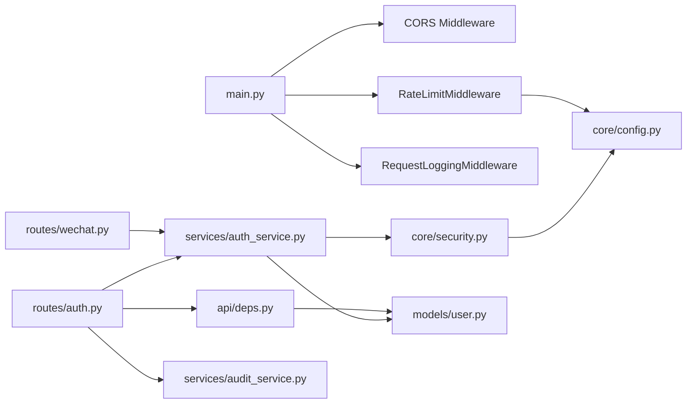

**Diagram sources**
- [main.py:27-57](file://backend/app/main.py#L27-L57)
- [auth.py:1-94](file://backend/app/api/v1/routes/auth.py#L1-L94)
- [wechat.py:1-82](file://backend/app/api/v1/routes/wechat.py#L1-L82)
- [deps.py:1-58](file://backend/app/api/deps.py#L1-L58)
- [auth_service.py:1-77](file://backend/app/services/auth_service.py#L1-L77)
- [audit_service.py:1-55](file://backend/app/services/audit_service.py#L1-L55)
- [security.py:1-34](file://backend/app/core/security.py#L1-L34)
- [user.py:1-48](file://backend/app/models/user.py#L1-L48)
- [config.py:7-167](file://backend/app/core/config.py#L7-L167)

**Section sources**
- [main.py:27-57](file://backend/app/main.py#L27-L57)
- [auth.py:1-94](file://backend/app/api/v1/routes/auth.py#L1-L94)
- [wechat.py:1-82](file://backend/app/api/v1/routes/wechat.py#L1-L82)
- [deps.py:1-58](file://backend/app/api/deps.py#L1-L58)
- [auth_service.py:1-77](file://backend/app/services/auth_service.py#L1-L77)
- [audit_service.py:1-55](file://backend/app/services/audit_service.py#L1-L55)
- [security.py:1-34](file://backend/app/core/security.py#L1-L34)
- [user.py:1-48](file://backend/app/models/user.py#L1-L48)
- [config.py:7-167](file://backend/app/core/config.py#L7-L167)

## Performance Considerations
- Rate limiting uses Redis sorted sets with pipeline transactions to minimize round-trips and ensure atomicity.
- Short-lived access tokens reduce exposure windows; refresh tokens rotate on each use.
- Avoid heavy operations in middleware; keep rate-limit checks lightweight.
- Ensure Redis availability; graceful fallback is implemented by skipping rate limiting if Redis is unavailable.

[No sources needed since this section provides general guidance]

## Troubleshooting Guide
Common issues and resolutions:
- Invalid or expired token: ensure correct Bearer token and that the token has not expired; use refresh endpoint to obtain a new pair.
- Rate limit exceeded: observe Retry-After header; adjust limits via settings if legitimate traffic spikes occur.
- WeChat login failures: check appid/secret configuration and network connectivity to WeChat APIs.
- Validation errors: inspect normalized 422 responses for field-specific messages.

Operational references:
- Token decode and user resolution: [deps.py:19-30](file://backend/app/api/deps.py#L19-L30), [auth_service.py:40-51](file://backend/app/services/auth_service.py#L40-L51)
- Rate limit behavior: [security_audit.py:66-94](file://backend/app/core/security_audit.py#L66-L94)
- WeChat login error mapping: [wechat.py:26-32](file://backend/app/api/v1/routes/wechat.py#L26-L32)
- Validation error handling: [logging.py:193-201](file://backend/app/core/logging.py#L193-L201)

**Section sources**
- [deps.py:19-30](file://backend/app/api/deps.py#L19-L30)
- [auth_service.py:40-51](file://backend/app/services/auth_service.py#L40-L51)
- [security_audit.py:66-94](file://backend/app/core/security_audit.py#L66-L94)
- [wechat.py:26-32](file://backend/app/api/v1/routes/wechat.py#L26-L32)
- [logging.py:193-201](file://backend/app/core/logging.py#L193-L201)

## Conclusion
The system implements a robust foundation for authentication and authorization: bcrypt password hashing, JWT access tokens, optional refresh tokens, Redis-backed rate limiting, strict input validation, and RBAC via dependency injectors. Audit logging captures critical security events, and OWASP checks provide a compliance snapshot. To further harden the system, consider adding explicit security headers, API key authentication for server-to-server scenarios, and integrating automated vulnerability scanning into CI.

[No sources needed since this section summarizes without analyzing specific files]

## Appendices

### Implementing Protected Endpoints
- Require authentication: depend on get_current_user.
- Enforce roles: depend on require_landlord, require_tenant, or require_admin.
- Example pattern:
  - Define route handler with Depends(get_current_user) or Depends(require_admin).
  - Return appropriate responses based on authorization decisions.

**Section sources**
- [deps.py:19-57](file://backend/app/api/deps.py#L19-L57)

### Custom Authorization Decorators
- Create additional dependency functions similar to require_* to encapsulate policy checks (e.g., resource ownership, feature flags).
- Compose multiple dependencies to layer permissions.

[No sources needed since this section provides general guidance]