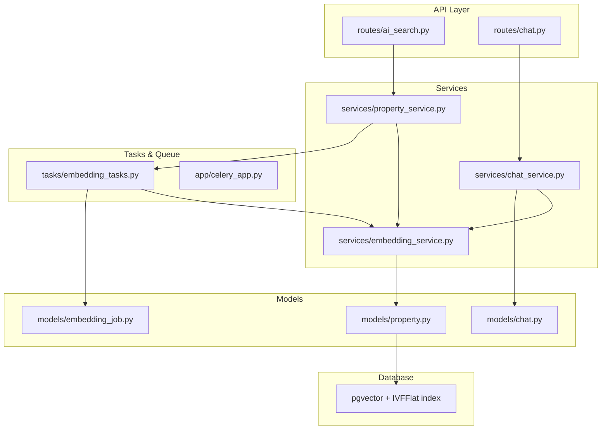
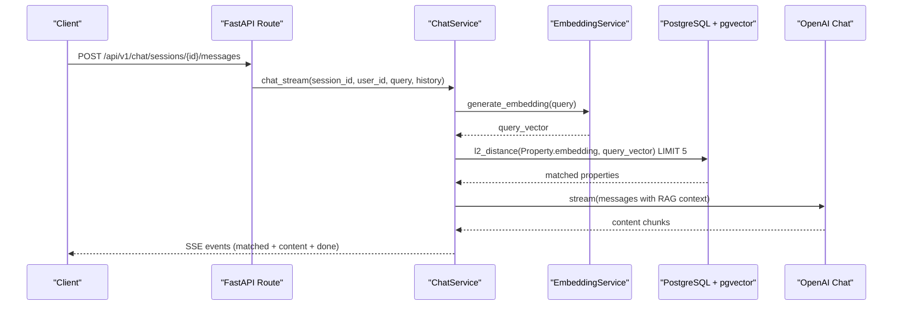
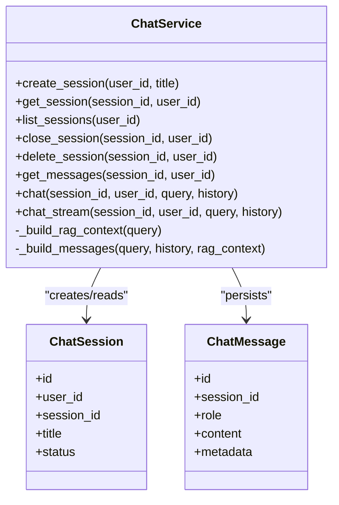
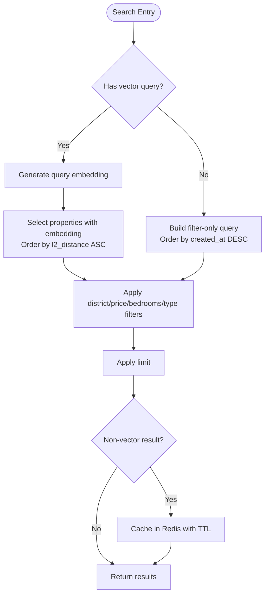
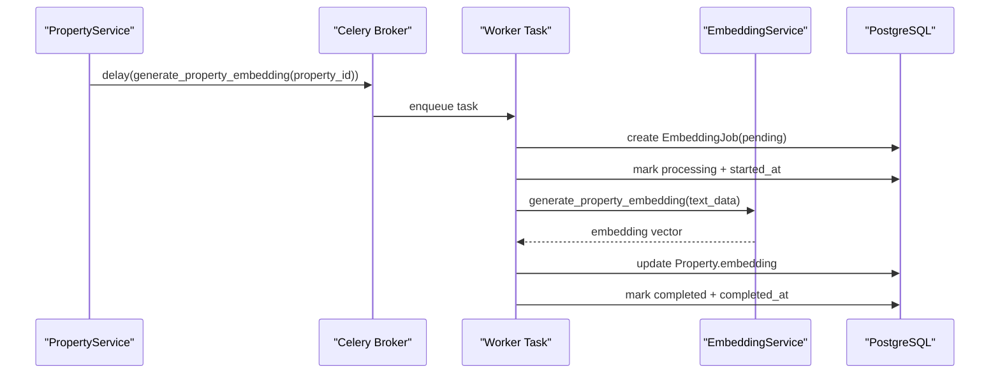
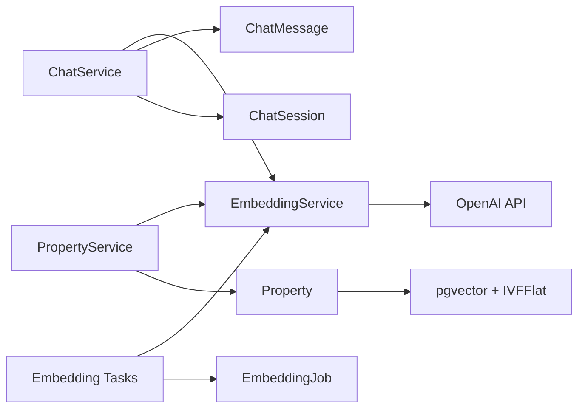

# AI Services (Embedding & Chat)

<cite>
**Referenced Files in This Document**
- [embedding_service.py](file://backend/app/services/embedding_service.py)
- [chat_service.py](file://backend/app/services/chat_service.py)
- [ai_search.py](file://backend/app/api/v1/routes/ai_search.py)
- [chat.py](file://backend/app/api/v1/routes/chat.py)
- [property_service.py](file://backend/app/services/property_service.py)
- [embedding_tasks.py](file://backend/app/tasks/embedding_tasks.py)
- [celery_app.py](file://backend/app/celery_app.py)
- [property.py](file://backend/app/models/property.py)
- [chat.py](file://backend/app/models/chat.py)
- [embedding_job.py](file://backend/app/models/embedding_job.py)
- [indexes.py](file://backend/app/db/indexes.py)
- [20260620_0002_pgvector_embedding.py](file://backend/alembic/versions/20260620_0002_pgvector_embedding.py)
- [00-enable-vector.sql](file://docker/pg-init/00-enable-vector.sql)
- [config.py](file://backend/app/core/config.py)
- [test_embedding.py](file://backend/tests/test_embedding.py)
- [test_chat.py](file://backend/tests/test_chat.py)
</cite>

## Table of Contents
1. [Introduction](#introduction)
2. [Project Structure](#project-structure)
3. [Core Components](#core-components)
4. [Architecture Overview](#architecture-overview)
5. [Detailed Component Analysis](#detailed-component-analysis)
6. [Dependency Analysis](#dependency-analysis)
7. [Performance Considerations](#performance-considerations)
8. [Troubleshooting Guide](#troubleshooting-guide)
9. [Conclusion](#conclusion)
10. [Appendices](#appendices)

## Introduction
This document explains the AI-powered services that power semantic property search and a chat assistant with Retrieval-Augmented Generation (RAG). It covers:
- Embedding generation using OpenAI API to convert property descriptions into vector embeddings stored in PostgreSQL via pgvector.
- RAG implementation for the chat assistant, including context retrieval from pgvector, prompt engineering, and response streaming.
- Vector similarity search algorithms and indexing strategies.
- Asynchronous embedding job queuing with Celery and Redis.
- Performance optimization techniques for large datasets.
- Examples of natural language property search and chat conversation flows.
- Error handling patterns for AI service failures.

## Project Structure
The AI features are implemented across services, routes, tasks, models, and database configuration:
- Services: EmbeddingService and ChatService encapsulate OpenAI interactions and RAG logic.
- Routes: FastAPI endpoints expose AI search and chat APIs.
- Tasks: Celery workers generate embeddings asynchronously and track jobs.
- Models: Property stores vectors; ChatSession and ChatMessage persist conversations; EmbeddingJob tracks background work.
- Database: pgvector extension and IVFFlat indexes enable efficient similarity search.

**Diagram sources**
- [ai_search.py:1-160](file://backend/app/api/v1/routes/ai_search.py#L1-L160)
- [chat.py:1-143](file://backend/app/api/v1/routes/chat.py#L1-L143)
- [embedding_service.py:1-32](file://backend/app/services/embedding_service.py#L1-L32)
- [chat_service.py:1-302](file://backend/app/services/chat_service.py#L1-L302)
- [property_service.py:1-239](file://backend/app/services/property_service.py#L1-L239)
- [embedding_tasks.py:1-112](file://backend/app/tasks/embedding_tasks.py#L1-L112)
- [celery_app.py:1-31](file://backend/app/celery_app.py#L1-L31)
- [property.py:1-86](file://backend/app/models/property.py#L1-L86)
- [chat.py:1-62](file://backend/app/models/chat.py#L1-L62)
- [embedding_job.py:1-35](file://backend/app/models/embedding_job.py#L1-L35)

**Section sources**
- [embedding_service.py:1-32](file://backend/app/services/embedding_service.py#L1-L32)
- [chat_service.py:1-302](file://backend/app/services/chat_service.py#L1-L302)
- [ai_search.py:1-160](file://backend/app/api/v1/routes/ai_search.py#L1-L160)
- [chat.py:1-143](file://backend/app/api/v1/routes/chat.py#L1-L143)
- [property_service.py:1-239](file://backend/app/services/property_service.py#L1-L239)
- [embedding_tasks.py:1-112](file://backend/app/tasks/embedding_tasks.py#L1-L112)
- [celery_app.py:1-31](file://backend/app/celery_app.py#L1-L31)
- [property.py:1-86](file://backend/app/models/property.py#L1-L86)
- [chat.py:1-62](file://backend/app/models/chat.py#L1-L62)
- [embedding_job.py:1-35](file://backend/app/models/embedding_job.py#L1-L35)

## Core Components
- EmbeddingService: Wraps AsyncOpenAI to generate 1536-dimensional embeddings for text or structured property data.
- ChatService: Implements session management, RAG context building via pgvector similarity search, prompt assembly, and both non-streaming and streaming chat responses.
- PropertyService: Provides unified search combining vector similarity and filters; dispatches embedding tasks on create/update; caches non-vector results in Redis.
- Embedding Tasks: Celery tasks generate embeddings per property, track job lifecycle, and handle retries.
- Models: Property includes a vector column; ChatSession and ChatMessage store conversational state; EmbeddingJob records background processing status.

Key responsibilities:
- EmbeddingService: OpenAI client initialization, text-to-vector conversion, property text composition.
- ChatService: Session CRUD, message persistence, RAG context retrieval, system prompt injection, SSE streaming.
- PropertyService: Query construction, pgvector similarity ordering, Redis caching, async task dispatch.
- Embedding Tasks: Job creation, status transitions, error capture, retry/backoff.

**Section sources**
- [embedding_service.py:1-32](file://backend/app/services/embedding_service.py#L1-L32)
- [chat_service.py:1-302](file://backend/app/services/chat_service.py#L1-L302)
- [property_service.py:1-239](file://backend/app/services/property_service.py#L1-L239)
- [embedding_tasks.py:1-112](file://backend/app/tasks/embedding_tasks.py#L1-L112)
- [property.py:1-86](file://backend/app/models/property.py#L1-L86)
- [chat.py:1-62](file://backend/app/models/chat.py#L1-L62)
- [embedding_job.py:1-35](file://backend/app/models/embedding_job.py#L1-L35)

## Architecture Overview
The system integrates FastAPI routes with services, OpenAI LLMs, PostgreSQL+pgvector, and Celery/Redis for background processing.

**Diagram sources**
- [chat.py:106-130](file://backend/app/api/v1/routes/chat.py#L106-L130)
- [chat_service.py:227-302](file://backend/app/services/chat_service.py#L227-L302)
- [embedding_service.py:23-32](file://backend/app/services/embedding_service.py#L23-L32)
- [property.py:78-78](file://backend/app/models/property.py#L78-L78)

**Section sources**
- [chat.py:106-130](file://backend/app/api/v1/routes/chat.py#L106-L130)
- [chat_service.py:87-143](file://backend/app/services/chat_service.py#L87-L143)
- [embedding_service.py:17-32](file://backend/app/services/embedding_service.py#L17-L32)

## Detailed Component Analysis

### Embedding Service
Responsibilities:
- Initialize AsyncOpenAI client with configured model and key.
- Generate embeddings for raw text or composed property text.
- Compose property text from title, description, address, district, and type.

Data flow:
- Input: dict with property fields or plain text.
- Output: list[float] of dimensionality defined by the embedding model (e.g., 1536).

Error handling:
- Relies on OpenAI client exceptions; callers should catch and log.

**Section sources**
- [embedding_service.py:1-32](file://backend/app/services/embedding_service.py#L1-L32)
- [test_embedding.py:1-61](file://backend/tests/test_embedding.py#L1-L61)

### Chat Service (RAG)
Responsibilities:
- Manage chat sessions and messages.
- Build RAG context by embedding the user query and performing vector similarity search over available properties.
- Assemble messages with a system prompt and retrieved context.
- Provide both full-response and streaming endpoints.

RAG context retrieval:
- Uses l2_distance between Property.embedding and query embedding.
- Filters to available properties and limits top matches.
- Formats matched properties into a context string and metadata for UI.

Prompt engineering:
- System prompt instructs the assistant to be a rental advisor, use provided context, avoid fabrication, and guide users when no matches exist.

Streaming:
- Emits SSE events: matched properties first, then content chunks, then completion markers.

Persistence:
- Saves user and assistant messages with metadata (e.g., matched_properties).

**Section sources**
- [chat_service.py:17-302](file://backend/app/services/chat_service.py#L17-L302)
- [chat.py:1-143](file://backend/app/api/v1/routes/chat.py#L1-143)
- [chat.py:1-62](file://backend/app/models/chat.py#L1-L62)

#### Class Diagram: ChatService and Related Models

**Diagram sources**
- [chat_service.py:17-143](file://backend/app/services/chat_service.py#L17-L143)
- [chat.py:23-62](file://backend/app/models/chat.py#L23-L62)

### Property Search (Vector Similarity + Filters)
Responsibilities:
- Unified search supporting optional vector query and additional filters (district, price range, bedrooms, type).
- When a vector query is present, computes similarity using l2_distance and orders by proximity.
- Caches non-vector filter-only queries in Redis for performance.
- Dispatches embedding tasks asynchronously on property create/update.

Algorithm:
- If query is provided:
  - Generate embedding for query.
  - Select properties with non-null embeddings.
  - Order by l2_distance ascending (closer = more similar).
- Else:
  - Apply filters and order by created_at desc.
  - Cache results in Redis with TTL.

**Section sources**
- [property_service.py:91-195](file://backend/app/services/property_service.py#L91-L195)
- [ai_search.py:98-160](file://backend/app/api/v1/routes/ai_search.py#L98-L160)

#### Flowchart: Property Search Logic

**Diagram sources**
- [property_service.py:102-195](file://backend/app/services/property_service.py#L102-L195)

### Embedding Job Queuing with Celery
Responsibilities:
- Background tasks generate embeddings for individual properties or batch reindex missing embeddings.
- Track job lifecycle (pending → processing → completed/failed) with timestamps and error messages.
- Use Redis as broker/backend and route tasks to dedicated queues.

Workflow:
- On property create/update, a thread dispatches an embedding task.
- Worker creates pending job, marks processing, generates embedding, updates property, marks completed.
- On failure, records error_message and retries with backoff up to max_retries.

**Section sources**
- [embedding_tasks.py:1-112](file://backend/app/tasks/embedding_tasks.py#L1-L112)
- [celery_app.py:1-31](file://backend/app/celery_app.py#L1-L31)
- [property_service.py:225-239](file://backend/app/services/property_service.py#L225-L239)
- [embedding_job.py:1-35](file://backend/app/models/embedding_job.py#L1-L35)

#### Sequence Diagram: Embedding Task Lifecycle

**Diagram sources**
- [embedding_tasks.py:22-80](file://backend/app/tasks/embedding_tasks.py#L22-L80)
- [embedding_service.py:30-32](file://backend/app/services/embedding_service.py#L30-L32)
- [property.py:78-78](file://backend/app/models/property.py#L78-L78)
- [embedding_job.py:17-35](file://backend/app/models/embedding_job.py#L17-L35)

### Natural Language Property Search (AI Search)
Endpoints:
- Parse: Converts natural language into structured parameters and completeness report.
- Search: Executes unified search (vector + filters), returns results and an AI summary for top matches.

Flow:
- Parse step uses an LLM to extract search intent.
- Search step builds a combined query string and calls PropertyService.search.
- Top results are summarized by an LLM if available; otherwise, a fallback summary is generated.

**Section sources**
- [ai_search.py:80-160](file://backend/app/api/v1/routes/ai_search.py#L80-L160)
- [property_service.py:91-195](file://backend/app/services/property_service.py#L91-L195)

### Chat Conversation Flows
Endpoints:
- Create/List/Delete sessions.
- Get messages for a session.
- Send message with streaming SSE response.

Flow:
- Client sends a message within a session.
- Server loads existing history, builds RAG context, streams matched properties and assistant content via SSE.
- Assistant reply is persisted with metadata.

**Section sources**
- [chat.py:47-143](file://backend/app/api/v1/routes/chat.py#L47-L143)
- [chat_service.py:171-302](file://backend/app/services/chat_service.py#L171-L302)

## Dependency Analysis
Key dependencies and relationships:
- EmbeddingService depends on OpenAI client and settings.
- ChatService depends on EmbeddingService, SQLAlchemy models, and OpenAI chat completions.
- PropertyService depends on EmbeddingService and optionally Redis for caching.
- Embedding tasks depend on Celery app, settings, and async DB engine.
- Models define schema for properties (with vector column), chat sessions/messages, and embedding jobs.
- Database setup enables pgvector and IVFFlat indexes for performance.

**Diagram sources**
- [embedding_service.py:17-32](file://backend/app/services/embedding_service.py#L17-L32)
- [chat_service.py:17-302](file://backend/app/services/chat_service.py#L17-L302)
- [property_service.py:1-239](file://backend/app/services/property_service.py#L1-L239)
- [embedding_tasks.py:1-112](file://backend/app/tasks/embedding_tasks.py#L1-L112)
- [property.py:1-86](file://backend/app/models/property.py#L1-L86)
- [chat.py:1-62](file://backend/app/models/chat.py#L1-L62)
- [embedding_job.py:1-35](file://backend/app/models/embedding_job.py#L1-L35)

**Section sources**
- [config.py:46-57](file://backend/app/core/config.py#L46-L57)
- [20260620_0002_pgvector_embedding.py:21-35](file://backend/alembic/versions/20260620_0002_pgvector_embedding.py#L21-L35)
- [00-enable-vector.sql:1-3](file://docker/pg-init/00-enable-vector.sql#L1-L3)

## Performance Considerations
- Indexing:
  - IVFFlat index on Property.embedding with lists tuned to sqrt(row_count); exact scan preferred for small datasets (<1000 rows).
  - Composite indexes for common filters (district, status).
- Caching:
  - Non-vector search results cached in Redis with TTL to reduce DB load.
- Streaming:
  - SSE streaming reduces perceived latency for long responses.
- Concurrency:
  - Celery workers process embedding tasks asynchronously; auto-retry with backoff improves resilience.
- Query Optimization:
  - Limit top matches in RAG context to control prompt size and cost.
  - Combine vector similarity with filters to narrow candidate sets early.

Operational tips:
- Monitor pgvector index health and adjust lists parameter as dataset grows.
- Ensure Redis availability; degrade gracefully if unavailable.
- Tune OpenAI model parameters (temperature, max_tokens) based on use case.

**Section sources**
- [indexes.py:16-48](file://backend/app/db/indexes.py#L16-L48)
- [property_service.py:102-195](file://backend/app/services/property_service.py#L102-L195)
- [chat_service.py:227-302](file://backend/app/services/chat_service.py#L227-L302)
- [embedding_tasks.py:16-21](file://backend/app/tasks/embedding_tasks.py#L16-L21)

## Troubleshooting Guide
Common issues and resolutions:
- OpenAI API failures:
  - Symptoms: HTTP errors or timeouts during embedding or chat calls.
  - Actions: Check OPENAI_API_KEY and model names; implement retries at caller level; log detailed errors.
- Missing embeddings:
  - Symptoms: RAG returns no matches.
  - Actions: Verify embedding jobs completed; trigger reindex_all_properties or batch_embedding_new_properties; check EmbeddingJob status.
- Slow similarity search:
  - Symptoms: High latency for vector queries.
  - Actions: Ensure pgvector extension enabled; verify IVFFlat index exists and lists parameter is appropriate; run EXPLAIN ANALYZE on queries.
- Redis cache misses:
  - Symptoms: Increased DB load for filter-only searches.
  - Actions: Confirm Redis connectivity; inspect cache keys and TTL; handle cache read/write failures gracefully.
- Streaming interruptions:
  - Symptoms: SSE stream stops prematurely.
  - Actions: Validate server headers (no-cache, keep-alive); ensure client handles partial chunks and errors; review worker logs for exceptions.

**Section sources**
- [embedding_tasks.py:70-76](file://backend/app/tasks/embedding_tasks.py#L70-L76)
- [indexes.py:91-118](file://backend/app/db/indexes.py#L91-L118)
- [property_service.py:170-195](file://backend/app/services/property_service.py#L170-L195)
- [chat.py:122-130](file://backend/app/api/v1/routes/chat.py#L122-L130)

## Conclusion
The AI services integrate OpenAI embeddings and chat capabilities with PostgreSQL+pgvector to deliver semantic property search and a RAG-powered chat assistant. The design emphasizes asynchronous processing, robust indexing, and streaming responses for scalability and responsiveness. Proper configuration, monitoring, and tuning of indexes and caches will ensure reliable performance as the dataset grows.

## Appendices

### Configuration Keys
- OPENAI_API_KEY: API key for OpenAI.
- OPENAI_EMBEDDING_MODEL: Model used for embeddings (e.g., text-embedding-3-small).
- OPENAI_CHAT_MODEL: Model used for chat completions (e.g., gpt-4o).
- DATABASE_URL: PostgreSQL connection string for async operations.
- REDIS_URL: Redis URL for Celery broker/backend and caching.

**Section sources**
- [config.py:46-57](file://backend/app/core/config.py#L46-L57)
- [config.py:15-24](file://backend/app/core/config.py#L15-L24)

### Example Usage Scenarios
- Natural language property search:
  - Call parse endpoint to extract structured parameters from free-text query.
  - Call search endpoint to retrieve results and AI-generated summary.
- Chat conversation:
  - Create a session, send messages, receive streamed responses with matched properties and assistant replies.

**Section sources**
- [ai_search.py:80-160](file://backend/app/api/v1/routes/ai_search.py#L80-L160)
- [chat.py:47-143](file://backend/app/api/v1/routes/chat.py#L47-L143)