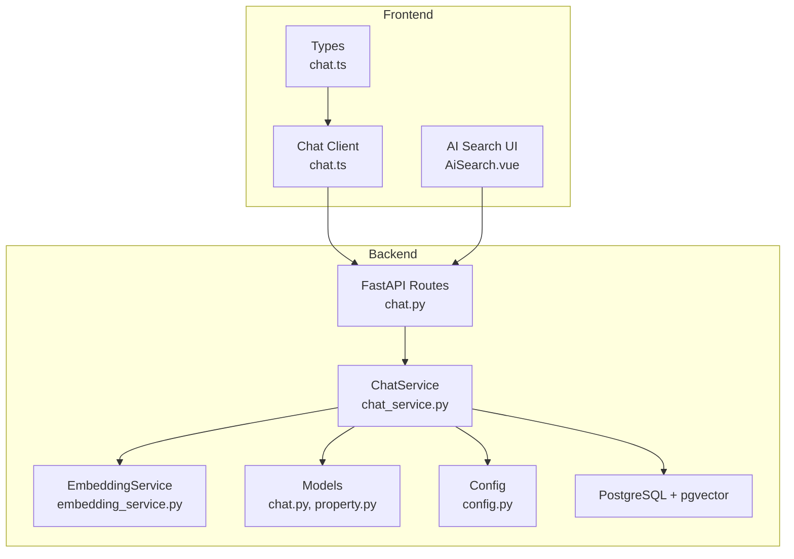
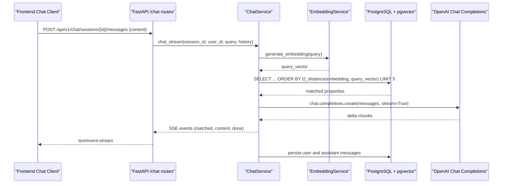
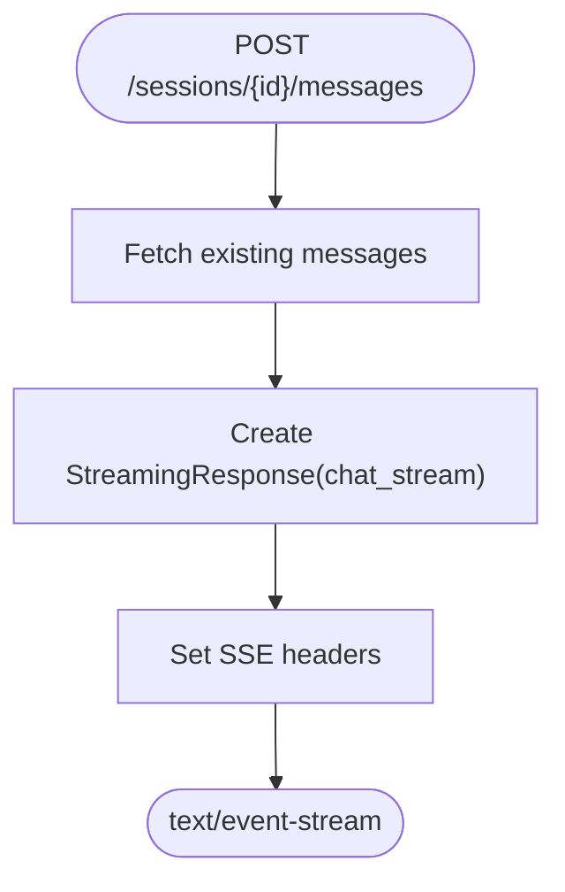
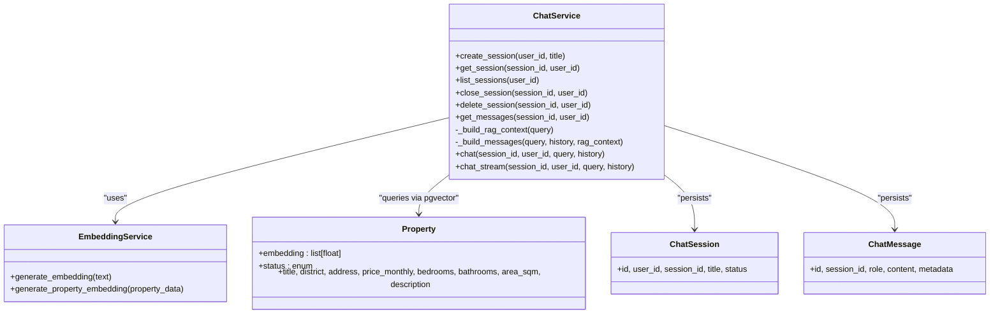
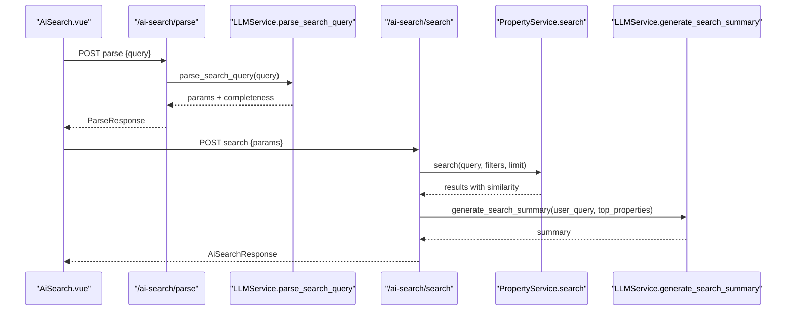
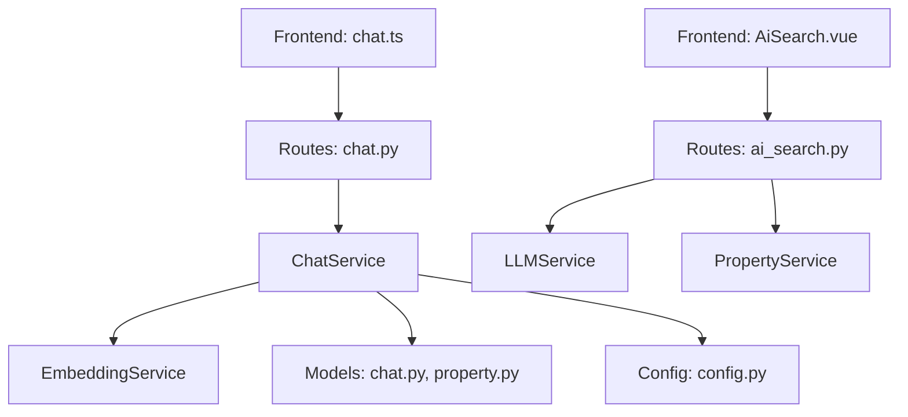

# Chat Service (RAG)

<cite>
**Referenced Files in This Document**
- [chat.py](file://backend/app/api/v1/routes/chat.py)
- [chat_service.py](file://backend/app/services/chat_service.py)
- [embedding_service.py](file://backend/app/services/embedding_service.py)
- [property.py](file://backend/app/models/property.py)
- [chat.py (models)](file://backend/app/models/chat.py)
- [ai_search.py](file://backend/app/api/v1/routes/ai_search.py)
- [ai_search.py (schemas)](file://backend/app/schemas/ai_search.py)
- [llm_service.py](file://backend/app/services/llm_service.py)
- [config.py](file://backend/app/core/config.py)
- [chat.ts (frontend service)](file://frontend/src/services/chat.ts)
- [chat.ts (frontend types)](file://frontend/src/types/chat.ts)
- [AiSearch.vue](file://frontend/src/views/AiSearch.vue)
</cite>

## Table of Contents
1. [Introduction](#introduction)
2. [Project Structure](#project-structure)
3. [Core Components](#core-components)
4. [Architecture Overview](#architecture-overview)
5. [Detailed Component Analysis](#detailed-component-analysis)
6. [Dependency Analysis](#dependency-analysis)
7. [Performance Considerations](#performance-considerations)
8. [Troubleshooting Guide](#troubleshooting-guide)
9. [Conclusion](#conclusion)
10. [Appendices](#appendices)

## Introduction
This document explains the Retrieval-Augmented Generation (RAG)-enabled Chat Service that combines semantic search with conversational AI to provide property recommendations. The system:
- Embeds user queries and property records into vectors using an embedding model.
- Retrieves top matching properties from a PostgreSQL database with pgvector via vector similarity.
- Builds prompts with retrieved context and calls a chat model for natural language responses.
- Streams assistant replies to the frontend using Server-Sent Events (SSE).
- Persists conversation sessions and messages, including matched property metadata.
- Integrates with a dedicated AI Search flow for structured parsing and summary generation.

The goal is to deliver real-time, context-aware property recommendations grounded in actual data while maintaining scalability and robust error handling.

## Project Structure
Key backend components:
- API routes define REST endpoints for chat sessions, messages, and streaming responses.
- ChatService orchestrates RAG context building, prompt assembly, LLM calls, and persistence.
- EmbeddingService generates embeddings for queries and properties.
- Property model includes a vector column for similarity search.
- Chat models define session and message schemas.
- Configuration centralizes OpenAI keys and model names.

Frontend integration:
- A chat client service wraps HTTP calls for sessions and messages.
- Types define SSE event shapes and message structures.
- An AI Search UI demonstrates natural-language parsing and result presentation.

**Diagram sources**
- [chat.py:1-143](file://backend/app/api/v1/routes/chat.py#L1-L143)
- [chat_service.py:1-302](file://backend/app/services/chat_service.py#L1-L302)
- [embedding_service.py:1-32](file://backend/app/services/embedding_service.py#L1-L32)
- [property.py:1-86](file://backend/app/models/property.py#L1-L86)
- [chat.py (models):1-62](file://backend/app/models/chat.py#L1-L62)
- [config.py:1-167](file://backend/app/core/config.py#L1-L167)
- [chat.ts (frontend service):1-24](file://frontend/src/services/chat.ts#L1-L24)
- [chat.ts (frontend types):1-41](file://frontend/src/types/chat.ts#L1-L41)
- [AiSearch.vue:1-593](file://frontend/src/views/AiSearch.vue#L1-L593)

**Section sources**
- [chat.py:1-143](file://backend/app/api/v1/routes/chat.py#L1-L143)
- [chat_service.py:1-302](file://backend/app/services/chat_service.py#L1-L302)
- [embedding_service.py:1-32](file://backend/app/services/embedding_service.py#L1-L32)
- [property.py:1-86](file://backend/app/models/property.py#L1-L86)
- [chat.py (models):1-62](file://backend/app/models/chat.py#L1-L62)
- [config.py:1-167](file://backend/app/core/config.py#L1-L167)
- [chat.ts (frontend service):1-24](file://frontend/src/services/chat.ts#L1-L24)
- [chat.ts (frontend types):1-41](file://frontend/src/types/chat.ts#L1-L41)
- [AiSearch.vue:1-593](file://frontend/src/views/AiSearch.vue#L1-L593)

## Core Components
- Chat API Routes: Provide endpoints to create/list/delete sessions, list messages, and stream responses.
- ChatService: Implements RAG context retrieval, prompt construction, LLM invocation, and message persistence.
- EmbeddingService: Generates embeddings for text inputs and property descriptions.
- Property Model: Includes a vector column for similarity search over available properties.
- Chat Models: Define sessions and messages with roles and metadata.
- Configuration: Centralizes API keys and model names for OpenAI and DeepSeek.
- Frontend Chat Client: Wraps HTTP calls for sessions and messages; types define SSE events.
- AI Search Flow: Parses natural language into structured parameters and generates summaries.

**Section sources**
- [chat.py:1-143](file://backend/app/api/v1/routes/chat.py#L1-L143)
- [chat_service.py:1-302](file://backend/app/services/chat_service.py#L1-L302)
- [embedding_service.py:1-32](file://backend/app/services/embedding_service.py#L1-L32)
- [property.py:1-86](file://backend/app/models/property.py#L1-L86)
- [chat.py (models):1-62](file://backend/app/models/chat.py#L1-L62)
- [config.py:1-167](file://backend/app/core/config.py#L1-L167)
- [chat.ts (frontend service):1-24](file://frontend/src/services/chat.ts#L1-L24)
- [chat.ts (frontend types):1-41](file://frontend/src/types/chat.ts#L1-L41)
- [ai_search.py:1-160](file://backend/app/api/v1/routes/ai_search.py#L1-L160)
- [ai_search.py (schemas):1-74](file://backend/app/schemas/ai_search.py#L1-L74)
- [llm_service.py:1-209](file://backend/app/services/llm_service.py#L1-L209)
- [AiSearch.vue:1-593](file://frontend/src/views/AiSearch.vue#L1-L593)

## Architecture Overview
The RAG-enabled Chat Service follows a clear pipeline:
- User sends a message to the chat endpoint.
- Backend retrieves existing conversation history.
- Query is embedded and used to find similar properties via pgvector.
- Retrieved properties are formatted into context and appended to the system prompt.
- The chat model streams token-by-token responses back as SSE events.
- Assistant reply and matched properties are persisted with metadata.

**Diagram sources**
- [chat.py:106-130](file://backend/app/api/v1/routes/chat.py#L106-L130)
- [chat_service.py:227-301](file://backend/app/services/chat_service.py#L227-L301)
- [embedding_service.py:23-28](file://backend/app/services/embedding_service.py#L23-L28)
- [property.py:78-86](file://backend/app/models/property.py#L78-L86)

## Detailed Component Analysis

### Chat API Routes
Responsibilities:
- Create, list, and delete chat sessions.
- Retrieve message history for a session.
- Stream assistant responses using SSE.

Key behaviors:
- Authentication and DB session dependencies ensure secure access.
- Streaming response sets appropriate headers for SSE.
- Error handling returns 404 when session not found.

**Diagram sources**
- [chat.py:106-130](file://backend/app/api/v1/routes/chat.py#L106-L130)

**Section sources**
- [chat.py:1-143](file://backend/app/api/v1/routes/chat.py#L1-L143)

### ChatService (RAG Orchestration)
Responsibilities:
- Session management (create, list, close, delete).
- Message retrieval.
- RAG context builder: embed query, perform vector similarity search, format context.
- Prompt assembly with system instructions and matched properties.
- Non-streaming and streaming chat flows.
- Persist user and assistant messages with metadata.

RAG Context Builder:
- Uses EmbeddingService to generate query embedding.
- Executes SQL with pgvector distance ordering and limits results.
- Formats matched properties into readable context blocks.

Streaming Implementation:
- Yields SSE-formatted JSON events: matched properties first, then content chunks, then done.
- Saves user message before streaming to ensure persistence even if LLM fails mid-stream.
- Catches exceptions and yields error events.

**Diagram sources**
- [chat_service.py:17-301](file://backend/app/services/chat_service.py#L17-L301)
- [embedding_service.py:17-32](file://backend/app/services/embedding_service.py#L17-L32)
- [property.py:38-86](file://backend/app/models/property.py#L38-L86)
- [chat.py (models):23-62](file://backend/app/models/chat.py#L23-L62)

**Section sources**
- [chat_service.py:1-302](file://backend/app/services/chat_service.py#L1-L302)
- [embedding_service.py:1-32](file://backend/app/services/embedding_service.py#L1-L32)
- [property.py:1-86](file://backend/app/models/property.py#L1-L86)
- [chat.py (models):1-62](file://backend/app/models/chat.py#L1-L62)

### EmbeddingService
Responsibilities:
- Generate embeddings for arbitrary text or property data.
- Compose property text from fields like title, description, address, district, type.

Integration points:
- Used by ChatService to embed user queries for similarity search.
- Can be used during indexing jobs to precompute property embeddings.

**Section sources**
- [embedding_service.py:1-32](file://backend/app/services/embedding_service.py#L1-L32)

### Property Model and Vector Column
Highlights:
- Custom VectorColumn maps to pgvector on PostgreSQL and falls back to text on other dialects.
- Properties include status filtering to only consider available listings.
- Indexes support efficient querying by district and status.

**Section sources**
- [property.py:1-86](file://backend/app/models/property.py#L1-L86)

### Chat Models (Sessions and Messages)
Highlights:
- Sessions track user association, unique session identifiers, titles, and statuses.
- Messages store role, content, and optional metadata (e.g., matched properties).
- Relationships cascade deletes and use selectin loading for performance.

**Section sources**
- [chat.py (models):1-62](file://backend/app/models/chat.py#L1-L62)

### Configuration
Highlights:
- Centralized settings for OpenAI API key, embedding model, and chat model.
- Optional DeepSeek configuration for alternative provider.
- Environment variables loaded from .env file.

**Section sources**
- [config.py:1-167](file://backend/app/core/config.py#L1-L167)

### AI Search Flow (Natural Language Parsing and Summary)
Responsibilities:
- Parse natural language into structured search parameters and completeness report.
- Execute unified search across multiple filters and keywords.
- Generate concise AI summary for top results.

Frontend integration:
- AiSearch.vue drives a three-phase UX: input, form completion, results display.
- aiSearch.ts provides typed services for parse and search endpoints.

**Diagram sources**
- [ai_search.py:80-160](file://backend/app/api/v1/routes/ai_search.py#L80-L160)
- [ai_search.py (schemas):1-74](file://backend/app/schemas/ai_search.py#L1-L74)
- [llm_service.py:106-198](file://backend/app/services/llm_service.py#L106-L198)
- [AiSearch.vue:269-336](file://frontend/src/views/AiSearch.vue#L269-L336)

**Section sources**
- [ai_search.py:1-160](file://backend/app/api/v1/routes/ai_search.py#L1-L160)
- [ai_search.py (schemas):1-74](file://backend/app/schemas/ai_search.py#L1-L74)
- [llm_service.py:1-209](file://backend/app/services/llm_service.py#L1-L209)
- [AiSearch.vue:1-593](file://frontend/src/views/AiSearch.vue#L1-L593)

### Frontend Chat Integration
Highlights:
- chat.ts wraps HTTP calls for creating sessions, listing sessions, fetching messages, and deleting sessions.
- chat.ts types define SSEEvent shape with matched, content, done, and error variants.
- The chat UI can consume SSE events to render matched properties and streaming text.

**Section sources**
- [chat.ts (frontend service):1-24](file://frontend/src/services/chat.ts#L1-L24)
- [chat.ts (frontend types):1-41](file://frontend/src/types/chat.ts#L1-L41)

## Dependency Analysis
Component relationships:
- FastAPI routes depend on ChatService for business logic.
- ChatService depends on EmbeddingService for vectorization and SQLAlchemy models for persistence.
- ChatService uses OpenAI AsyncClient configured via Settings.
- AI Search routes depend on LLMService and PropertyService.
- Frontend chat client depends on backend chat routes and consumes SSE events.

**Diagram sources**
- [chat.py:1-143](file://backend/app/api/v1/routes/chat.py#L1-L143)
- [chat_service.py:1-302](file://backend/app/services/chat_service.py#L1-L302)
- [embedding_service.py:1-32](file://backend/app/services/embedding_service.py#L1-L32)
- [property.py:1-86](file://backend/app/models/property.py#L1-L86)
- [chat.py (models):1-62](file://backend/app/models/chat.py#L1-L62)
- [config.py:1-167](file://backend/app/core/config.py#L1-L167)
- [ai_search.py:1-160](file://backend/app/api/v1/routes/ai_search.py#L1-L160)
- [llm_service.py:1-209](file://backend/app/services/llm_service.py#L1-L209)
- [chat.ts (frontend service):1-24](file://frontend/src/services/chat.ts#L1-L24)
- [AiSearch.vue:1-593](file://frontend/src/views/AiSearch.vue#L1-L593)

**Section sources**
- [chat.py:1-143](file://backend/app/api/v1/routes/chat.py#L1-L143)
- [chat_service.py:1-302](file://backend/app/services/chat_service.py#L1-L302)
- [embedding_service.py:1-32](file://backend/app/services/embedding_service.py#L1-L32)
- [property.py:1-86](file://backend/app/models/property.py#L1-L86)
- [chat.py (models):1-62](file://backend/app/models/chat.py#L1-L62)
- [config.py:1-167](file://backend/app/core/config.py#L1-L167)
- [ai_search.py:1-160](file://backend/app/api/v1/routes/ai_search.py#L1-L160)
- [llm_service.py:1-209](file://backend/app/services/llm_service.py#L1-L209)
- [chat.ts (frontend service):1-24](file://frontend/src/services/chat.ts#L1-L24)
- [AiSearch.vue:1-593](file://frontend/src/views/AiSearch.vue#L1-L593)

## Performance Considerations
- Vector similarity search:
  - Use pgvector indexes (e.g., IVFFlat/HNSW) on the embedding column to reduce latency for large catalogs.
  - Limit top matches to a small number (e.g., 5) to minimize prompt size and LLM cost.
- Streaming responses:
  - SSE enables immediate rendering of tokens; avoid buffering on proxies (headers set appropriately).
  - Persist user messages before streaming to ensure durability even if LLM fails mid-stream.
- Concurrency:
  - AsyncOpenAI and async SQLAlchemy sessions allow concurrent requests; ensure connection pool sizing is adequate.
  - Rate limiting at the API layer protects against bursts and external API quotas.
- Prompt engineering:
  - Keep system prompt concise and focused on rental domain rules.
  - Include only necessary property fields to reduce token usage.
- Fallback strategies:
  - For AI Search, summarize without LLM when unavailable; for chat, yield error events and stop streaming gracefully.

[No sources needed since this section provides general guidance]

## Troubleshooting Guide
Common issues and resolutions:
- Chat session not found:
  - Ensure session exists and belongs to the current user; route returns 404 if missing.
- LLM service interruptions:
  - Chat stream catches exceptions and emits error events; frontend should handle and notify users.
  - AI Search handles missing LLM configuration by returning fallback summaries.
- Database connectivity:
  - Verify DATABASE_URL and pgvector extension enabled; check connection pooling and timeouts.
- CORS and proxy buffering:
  - Ensure CORS origins include frontend origin; disable proxy buffering for SSE.

**Section sources**
- [chat.py:133-143](file://backend/app/api/v1/routes/chat.py#L133-L143)
- [chat_service.py:298-301](file://backend/app/services/chat_service.py#L298-L301)
- [ai_search.py:136-152](file://backend/app/api/v1/routes/ai_search.py#L136-L152)
- [config.py:15-22](file://backend/app/core/config.py#L15-L22)

## Conclusion
The RAG-enabled Chat Service integrates semantic search with conversational AI to deliver precise, context-aware property recommendations. It leverages pgvector for fast similarity retrieval, constructs focused prompts with retrieved context, and streams responses for a responsive user experience. Robust error handling, clear separation of concerns, and scalable patterns make it suitable for production deployments.

[No sources needed since this section summarizes without analyzing specific files]

## Appendices

### Example Natural Language Queries
- “I need a two-bedroom apartment near Suzhou Industrial Park with a monthly budget between 3000 and 5000.”
- “Looking for a quiet studio close to the subway in Shanghai Pudong, under 4000 per month.”
- “Find shared rooms in Nanjing with good transport links and around 2000 yuan monthly.”

[No sources needed since this section provides conceptual examples]

### Conversation Flows and Context Building
- First message auto-titles the session based on user input.
- Each turn builds context by embedding the latest query and retrieving top properties.
- Matched properties are sent as a “matched” SSE event before streaming content.
- Assistant reply and matched properties are persisted with metadata for replay and analytics.

**Section sources**
- [chat_service.py:171-225](file://backend/app/services/chat_service.py#L171-L225)
- [chat_service.py:227-301](file://backend/app/services/chat_service.py#L227-L301)

### SSE Event Schema
- matched: contains array of matched properties with similarity scores.
- content: incremental text chunk from the assistant.
- done: signals end of streaming.
- error: indicates failure details.

**Section sources**
- [chat.ts (frontend types):35-41](file://frontend/src/types/chat.ts#L35-L41)
- [chat_service.py:254-296](file://backend/app/services/chat_service.py#L254-L296)