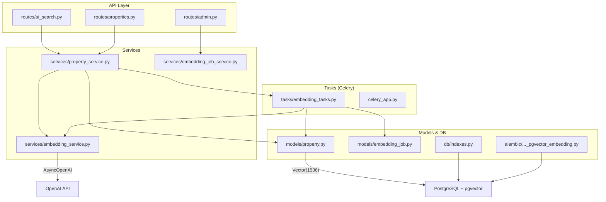
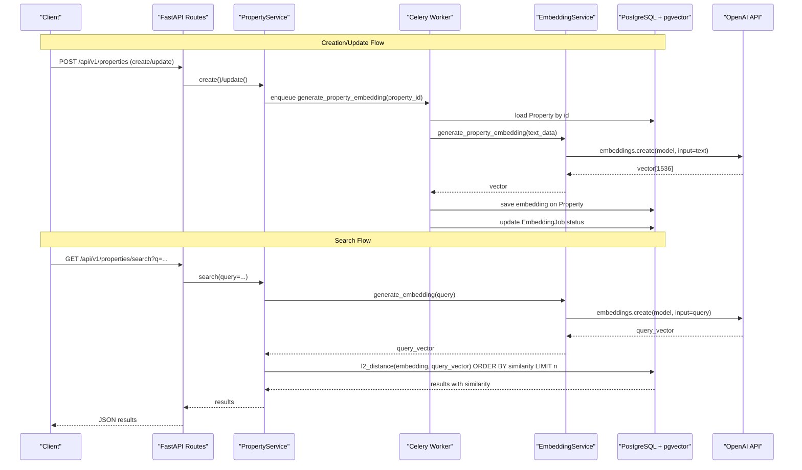
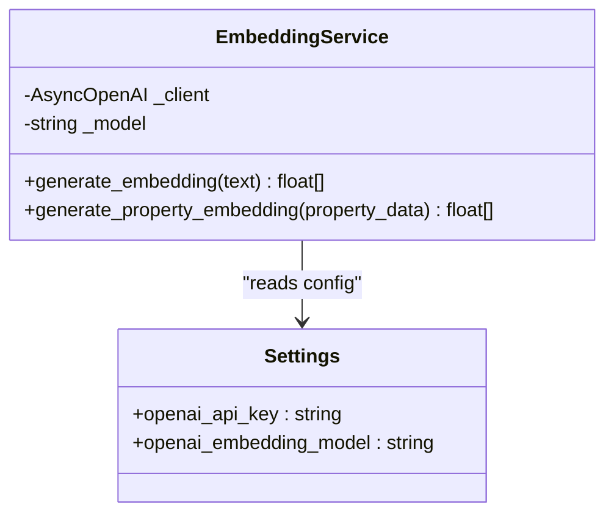
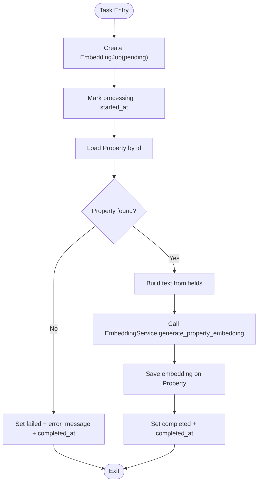
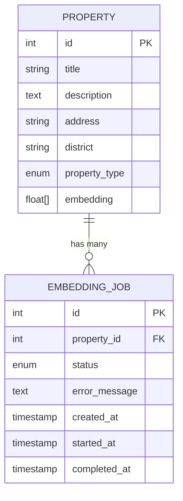
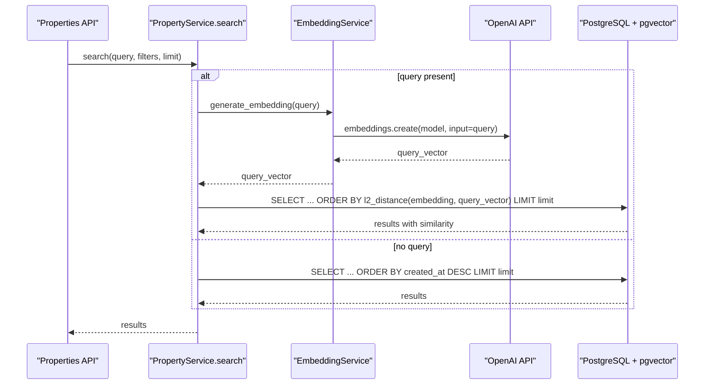
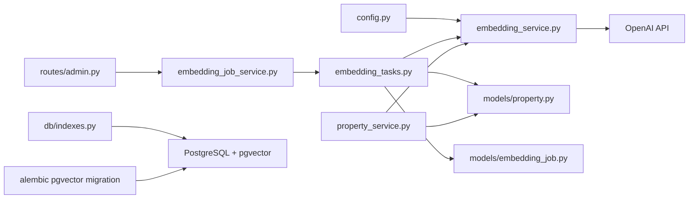

# Embedding Service

<cite>
**Referenced Files in This Document**
- [embedding_service.py](file://backend/app/services/embedding_service.py)
- [embedding_tasks.py](file://backend/app/tasks/embedding_tasks.py)
- [embedding_job.py](file://backend/app/models/embedding_job.py)
- [property.py](file://backend/app/models/property.py)
- [config.py](file://backend/app/core/config.py)
- [celery_app.py](file://backend/app/celery_app.py)
- [indexes.py](file://backend/app/db/indexes.py)
- [20260620_0002_pgvector_embedding.py](file://backend/alembic/versions/20260620_0002_pgvector_embedding.py)
- [property_service.py](file://backend/app/services/property_service.py)
- [ai_search.py](file://backend/app/api/v1/routes/ai_search.py)
- [properties.py](file://backend/app/api/v1/routes/properties.py)
- [admin.py](file://backend/app/api/v1/routes/admin.py)
- [embedding_job_service.py](file://backend/app/services/embedding_job_service.py)
- [test_embedding.py](file://backend/tests/test_embedding.py)
- [test_pgvector.py](file://backend/tests/test_pgvector.py)
</cite>

## Table of Contents
1. [Introduction](#introduction)
2. [Project Structure](#project-structure)
3. [Core Components](#core-components)
4. [Architecture Overview](#architecture-overview)
5. [Detailed Component Analysis](#detailed-component-analysis)
6. [Dependency Analysis](#dependency-analysis)
7. [Performance Considerations](#performance-considerations)
8. [Troubleshooting Guide](#troubleshooting-guide)
9. [Conclusion](#conclusion)
10. [Appendices](#appendices)

## Introduction
This document explains the Embedding Service component that converts property data into vector embeddings using OpenAI’s embedding API and stores them with pgvector for semantic search. It covers text construction from property fields, AsyncOpenAI client configuration, model selection, embedding generation workflow, Celery-based batch processing, error handling, and performance optimization strategies for large datasets.

## Project Structure
The embedding feature spans services, tasks, models, database migrations, and admin APIs:
- Service layer builds text and calls OpenAI to generate embeddings
- Tasks queue and execute embedding jobs asynchronously via Celery
- Models define the Property embedding column and EmbeddingJob tracking
- Migrations enable pgvector and create IVFFlat indexes
- Admin endpoints expose stats and reindex triggers
- Tests validate behavior and integration with pgvector

**Diagram sources**
- [ai_search.py:98-160](file://backend/app/api/v1/routes/ai_search.py#L98-L160)
- [properties.py:36-91](file://backend/app/api/v1/routes/properties.py#L36-L91)
- [admin.py:112-132](file://backend/app/api/v1/routes/admin.py#L112-L132)
- [property_service.py:91-195](file://backend/app/services/property_service.py#L91-L195)
- [embedding_service.py:17-32](file://backend/app/services/embedding_service.py#L17-L32)
- [embedding_tasks.py:16-80](file://backend/app/tasks/embedding_tasks.py#L16-L80)
- [celery_app.py:9-30](file://backend/app/celery_app.py#L9-L30)
- [property.py:12-22](file://backend/app/models/property.py#L12-L22)
- [embedding_job.py:17-35](file://backend/app/models/embedding_job.py#L17-L35)
- [indexes.py:16-48](file://backend/app/db/indexes.py#L16-L48)
- [20260620_0002_pgvector_embedding.py:21-35](file://backend/alembic/versions/20260620_0002_pgvector_embedding.py#L21-L35)

**Section sources**
- [embedding_service.py:1-32](file://backend/app/services/embedding_service.py#L1-L32)
- [embedding_tasks.py:1-112](file://backend/app/tasks/embedding_tasks.py#L1-L112)
- [embedding_job.py:1-35](file://backend/app/models/embedding_job.py#L1-L35)
- [property.py:1-86](file://backend/app/models/property.py#L1-L86)
- [config.py:46-57](file://backend/app/core/config.py#L46-L57)
- [celery_app.py:1-31](file://backend/app/celery_app.py#L1-L31)
- [indexes.py:1-118](file://backend/app/db/indexes.py#L1-L118)
- [20260620_0002_pgvector_embedding.py:1-40](file://backend/alembic/versions/20260620_0002_pgvector_embedding.py#L1-L40)
- [property_service.py:1-239](file://backend/app/services/property_service.py#L1-L239)
- [ai_search.py:1-160](file://backend/app/api/v1/routes/ai_search.py#L1-L160)
- [properties.py:1-162](file://backend/app/api/v1/routes/properties.py#L1-L162)
- [admin.py:112-132](file://backend/app/api/v1/routes/admin.py#L112-L132)
- [embedding_job_service.py:1-54](file://backend/app/services/embedding_job_service.py#L1-L54)
- [test_embedding.py:1-61](file://backend/tests/test_embedding.py#L1-L61)
- [test_pgvector.py:1-40](file://backend/tests/test_pgvector.py#L1-L40)

## Core Components
- EmbeddingService: Configures AsyncOpenAI with settings and provides methods to generate embeddings for arbitrary text or a constructed property text.
- Text Construction: Combines title, description, address, district, and property_type into a single string for embedding.
- Celery Tasks: Asynchronous workers that fetch properties, call EmbeddingService, persist embeddings, and track job status.
- Database Integration: Uses a custom VectorColumn mapped to pgvector’s Vector type; migration enables extension and creates IVFFlat index.
- Admin APIs: Expose embedding job statistics and trigger reindexing for single or all properties.

Key responsibilities:
- Build semantically meaningful text from property fields
- Call OpenAI embeddings API with configured model
- Persist vectors in PostgreSQL via pgvector
- Queue and manage background jobs with retries and logging
- Provide admin controls for monitoring and reindexing

**Section sources**
- [embedding_service.py:6-32](file://backend/app/services/embedding_service.py#L6-L32)
- [embedding_tasks.py:16-112](file://backend/app/tasks/embedding_tasks.py#L16-L112)
- [property.py:12-22](file://backend/app/models/property.py#L12-L22)
- [20260620_0002_pgvector_embedding.py:21-35](file://backend/alembic/versions/20260620_0002_pgvector_embedding.py#L21-L35)
- [admin.py:112-132](file://backend/app/api/v1/routes/admin.py#L112-L132)

## Architecture Overview
End-to-end flow for generating and querying embeddings:

**Diagram sources**
- [properties.py:16-33](file://backend/app/api/v1/routes/properties.py#L16-L33)
- [property_service.py:48-60](file://backend/app/services/property_service.py#L48-L60)
- [embedding_tasks.py:22-80](file://backend/app/tasks/embedding_tasks.py#L22-L80)
- [embedding_service.py:17-32](file://backend/app/services/embedding_service.py#L17-L32)
- [property_service.py:135-168](file://backend/app/services/property_service.py#L135-L168)
- [ai_search.py:98-160](file://backend/app/api/v1/routes/ai_search.py#L98-L160)

## Detailed Component Analysis

### EmbeddingService
Responsibilities:
- Initialize AsyncOpenAI client using settings
- Generate embeddings for raw text or constructed property text
- Use configured model name from settings

Text construction:
- Concatenates title, description, address, district, and property_type
- Skips None values and joins non-empty parts with spaces

Configuration:
- Reads OPENAI_API_KEY and OPENAI_EMBEDDING_MODEL from environment via Settings

Error handling:
- Propagates exceptions from OpenAI API; callers should handle failures

**Diagram sources**
- [embedding_service.py:17-32](file://backend/app/services/embedding_service.py#L17-L32)
- [config.py:46-57](file://backend/app/core/config.py#L46-L57)

**Section sources**
- [embedding_service.py:6-32](file://backend/app/services/embedding_service.py#L6-L32)
- [config.py:46-57](file://backend/app/core/config.py#L46-L57)
- [test_embedding.py:32-61](file://backend/tests/test_embedding.py#L32-L61)

### Celery Tasks and Job Tracking
Responsibilities:
- generate_property_embedding: Create pending job, mark processing, fetch property, build text, call EmbeddingService, persist embedding, mark completed or failed
- reindex_all_properties: Find properties without embeddings and enqueue individual jobs
- Error handling: Update job status and error_message, log exceptions, retry with backoff

Job model:
- Tracks status transitions: pending → processing → completed/failed
- Stores timestamps and error messages

**Diagram sources**
- [embedding_tasks.py:16-80](file://backend/app/tasks/embedding_tasks.py#L16-L80)
- [embedding_job.py:17-35](file://backend/app/models/embedding_job.py#L17-L35)

**Section sources**
- [embedding_tasks.py:16-112](file://backend/app/tasks/embedding_tasks.py#L16-L112)
- [embedding_job.py:1-35](file://backend/app/models/embedding_job.py#L1-L35)
- [celery_app.py:9-30](file://backend/app/celery_app.py#L9-L30)

### Database Integration with pgvector
- Custom VectorColumn maps to pgvector.sqlalchemy.Vector(1536) on PostgreSQL
- Migration enables vector extension and adds embedding column with IVFFlat index
- Index creation utility adapts lists parameter based on row count

**Diagram sources**
- [property.py:78](file://backend/app/models/property.py#L78)
- [embedding_job.py:17-35](file://backend/app/models/embedding_job.py#L17-L35)
- [20260620_0002_pgvector_embedding.py:21-35](file://backend/alembic/versions/20260620_0002_pgvector_embedding.py#L21-L35)
- [indexes.py:16-48](file://backend/app/db/indexes.py#L16-L48)

**Section sources**
- [property.py:12-22](file://backend/app/models/property.py#L12-L22)
- [20260620_0002_pgvector_embedding.py:21-35](file://backend/alembic/versions/20260620_0002_pgvector_embedding.py#L21-L35)
- [indexes.py:16-48](file://backend/app/db/indexes.py#L16-L48)

### Search Integration
- PropertyService.search constructs a query vector when a natural language query is provided
- Uses l2_distance to rank properties by similarity
- Non-vector searches are cached in Redis when available

**Diagram sources**
- [property_service.py:135-168](file://backend/app/services/property_service.py#L135-L168)
- [embedding_service.py:23-28](file://backend/app/services/embedding_service.py#L23-L28)

**Section sources**
- [property_service.py:91-195](file://backend/app/services/property_service.py#L91-L195)
- [ai_search.py:98-160](file://backend/app/api/v1/routes/ai_search.py#L98-L160)

### Admin Controls and Monitoring
- Stats endpoint returns counts by job status
- Reindex endpoint can trigger single-property or full reindex
- Frontend integrates these endpoints for admin UI

**Section sources**
- [admin.py:112-132](file://backend/app/api/v1/routes/admin.py#L112-L132)
- [embedding_job_service.py:21-54](file://backend/app/services/embedding_job_service.py#L21-L54)

## Dependency Analysis
- EmbeddingService depends on OpenAI SDK and Settings
- Tasks depend on SQLAlchemy async engine/session, models, and EmbeddingService
- PropertyService orchestrates search and dispatches embedding tasks
- Admin routes depend on EmbeddingJobService for stats and reindex triggers
- Database layer uses pgvector types and indexes

**Diagram sources**
- [config.py:46-57](file://backend/app/core/config.py#L46-L57)
- [embedding_service.py:17-32](file://backend/app/services/embedding_service.py#L17-L32)
- [embedding_tasks.py:16-112](file://backend/app/tasks/embedding_tasks.py#L16-L112)
- [property_service.py:48-60](file://backend/app/services/property_service.py#L48-L60)
- [admin.py:112-132](file://backend/app/api/v1/routes/admin.py#L112-L132)
- [embedding_job_service.py:1-54](file://backend/app/services/embedding_job_service.py#L1-L54)
- [indexes.py:16-48](file://backend/app/db/indexes.py#L16-L48)
- [20260620_0002_pgvector_embedding.py:21-35](file://backend/alembic/versions/20260620_0002_pgvector_embedding.py#L21-L35)

**Section sources**
- [embedding_service.py:1-32](file://backend/app/services/embedding_service.py#L1-L32)
- [embedding_tasks.py:1-112](file://backend/app/tasks/embedding_tasks.py#L1-L112)
- [property_service.py:1-239](file://backend/app/services/property_service.py#L1-L239)
- [admin.py:112-132](file://backend/app/api/v1/routes/admin.py#L112-L132)
- [embedding_job_service.py:1-54](file://backend/app/services/embedding_job_service.py#L1-L54)
- [indexes.py:1-118](file://backend/app/db/indexes.py#L1-L118)
- [20260620_0002_pgvector_embedding.py:1-40](file://backend/alembic/versions/20260620_0002_pgvector_embedding.py#L1-L40)

## Performance Considerations
- IVFFlat indexing: The migration and index utilities create an IVFFlat index on embeddings with adaptive lists parameter based on row count. For small datasets (<1000), exact scans are preferred.
- Query caching: Non-vector searches are cached in Redis with TTL to reduce DB load.
- Batch processing: Celery tasks process embeddings asynchronously with retries and backoff, preventing request timeouts.
- Dimensionality: Embeddings are 1536-dimensional; ensure consistent model selection and storage schema.
- Index tuning: Adjust IVFFlat lists parameter as dataset grows to balance recall and latency.

[No sources needed since this section provides general guidance]

## Troubleshooting Guide
Common issues and resolutions:
- Missing OPENAI_API_KEY or incorrect model name: Ensure environment variables are set correctly; default model is configurable.
- Property not found during task execution: Task marks job as failed with error message; verify property exists before triggering.
- API failures: Tasks catch exceptions, log details, and mark jobs failed; check logs and job error_message.
- pgvector extension not enabled: Confirm migration ran and extension is created; use startup SQL to enable extension if needed.
- Slow semantic search: Verify IVFFlat index exists and lists parameter is tuned; consider EXPLAIN ANALYZE on queries.

Operational checks:
- Use admin stats endpoint to monitor job counts by status
- Trigger reindex for specific or all properties via admin API
- Inspect EmbeddingJob records for detailed errors and timestamps

**Section sources**
- [embedding_tasks.py:70-76](file://backend/app/tasks/embedding_tasks.py#L70-L76)
- [embedding_job.py:24-35](file://backend/app/models/embedding_job.py#L24-L35)
- [indexes.py:16-48](file://backend/app/db/indexes.py#L16-L48)
- [admin.py:112-132](file://backend/app/api/v1/routes/admin.py#L112-L132)

## Conclusion
The Embedding Service integrates OpenAI embeddings with pgvector to enable semantic property search. It constructs meaningful text from key property fields, persists vectors efficiently, and manages background jobs with robust error handling. Admin tools provide visibility and control for maintenance and scaling.

[No sources needed since this section summarizes without analyzing specific files]

## Appendices

### Examples

- Individual property embedding generation:
  - Trigger via admin API for a single property ID
  - Or rely on automatic dispatch on create/update

- Bulk processing workflow:
  - Use admin reindex endpoint without property_id to enqueue all missing embeddings
  - Monitor progress via stats endpoint and job records

- Performance optimization strategies:
  - Enable and tune IVFFlat index based on dataset size
  - Cache non-vector search results in Redis
  - Scale Celery workers for high throughput
  - Periodically review and adjust lists parameter for optimal recall/performance

**Section sources**
- [admin.py:120-132](file://backend/app/api/v1/routes/admin.py#L120-L132)
- [embedding_tasks.py:83-112](file://backend/app/tasks/embedding_tasks.py#L83-L112)
- [indexes.py:16-48](file://backend/app/db/indexes.py#L16-L48)
- [property_service.py:170-194](file://backend/app/services/property_service.py#L170-L194)