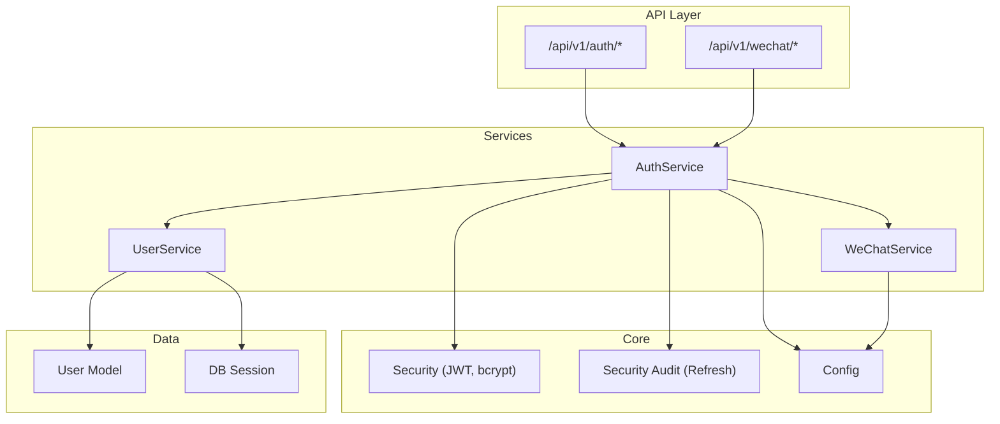
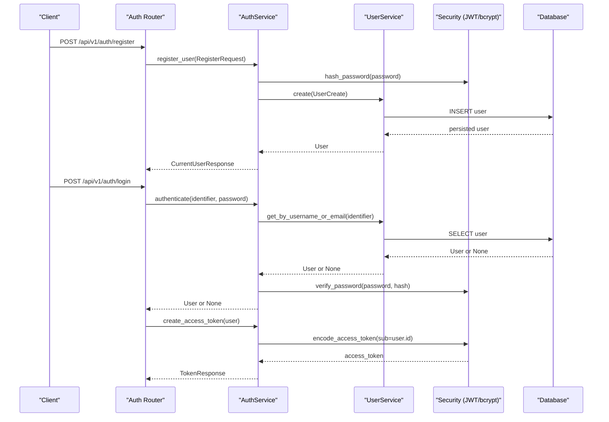
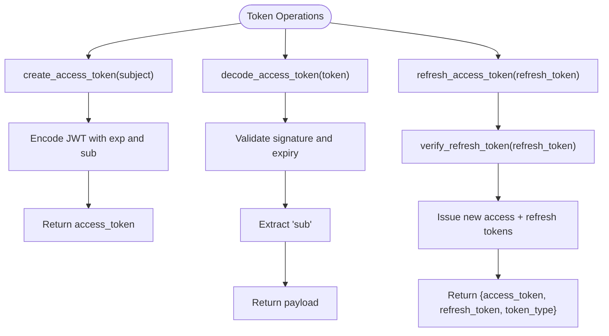
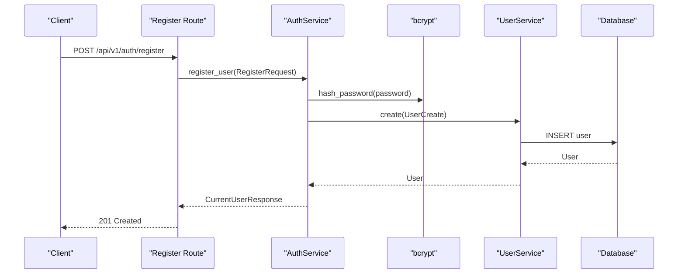
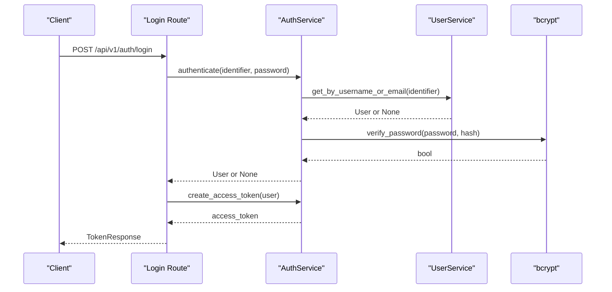
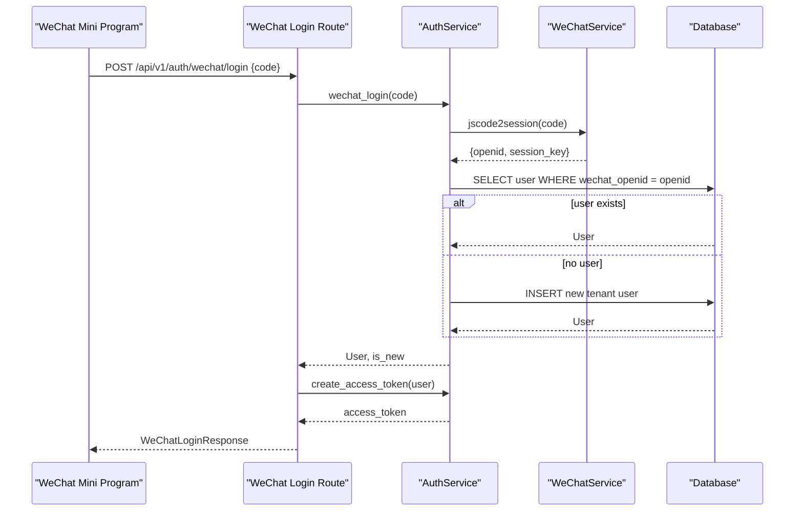
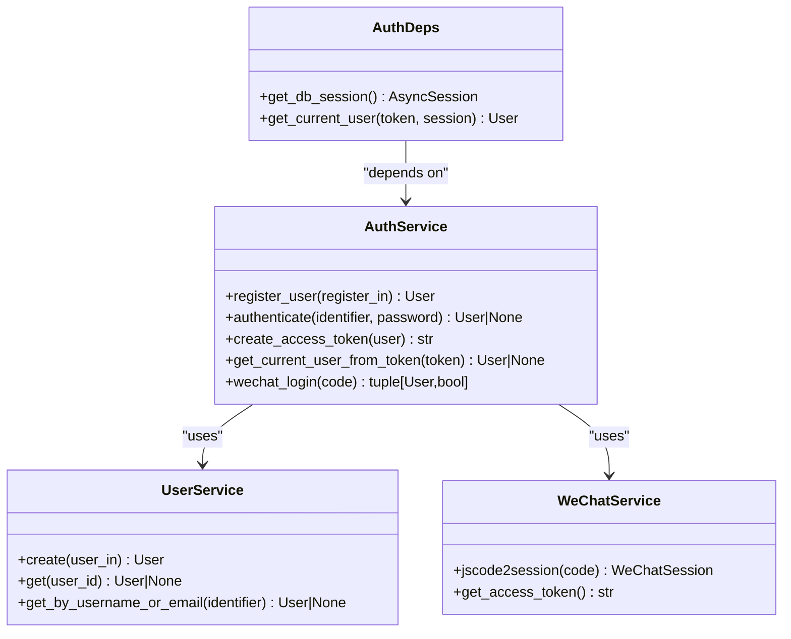
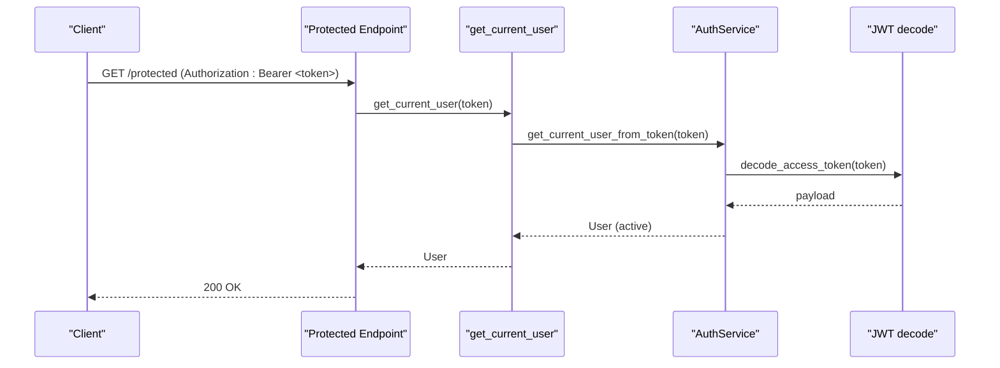
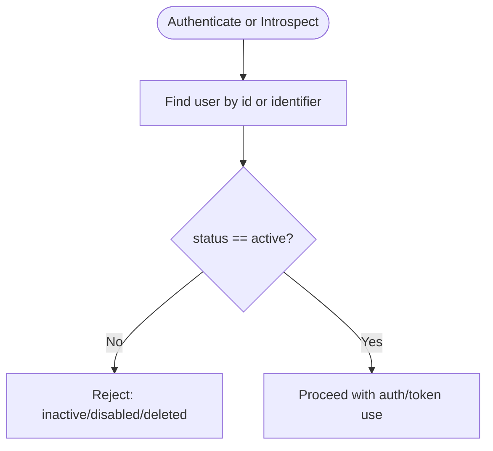
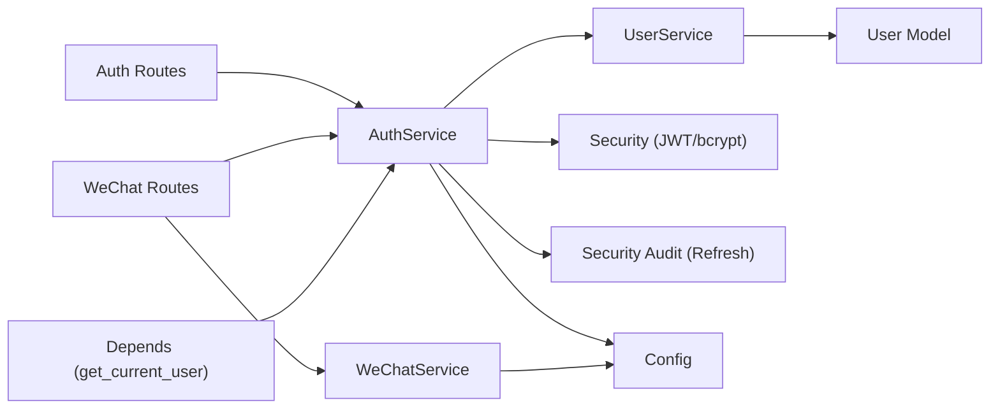

# Authentication Service

<cite>
**Referenced Files in This Document**
- [auth_service.py](file://backend/app/services/auth_service.py)
- [auth.py](file://backend/app/api/v1/routes/auth.py)
- [security.py](file://backend/app/core/security.py)
- [security_audit.py](file://backend/app/core/security_audit.py)
- [user_service.py](file://backend/app/services/user_service.py)
- [wechat_service.py](file://backend/app/services/wechat_service.py)
- [wechat.py](file://backend/app/api/v1/routes/wechat.py)
- [deps.py](file://backend/app/api/deps.py)
- [config.py](file://backend/app/core/config.py)
- [user.py](file://backend/app/models/user.py)
- [auth.py (schemas)](file://backend/app/schemas/auth.py)
- [test_auth.py](file://backend/tests/test_auth.py)
- [test_wechat.py](file://backend/tests/test_wechat.py)
</cite>

## Table of Contents
1. [Introduction](#introduction)
2. [Project Structure](#project-structure)
3. [Core Components](#core-components)
4. [Architecture Overview](#architecture-overview)
5. [Detailed Component Analysis](#detailed-component-analysis)
6. [Dependency Analysis](#dependency-analysis)
7. [Performance Considerations](#performance-considerations)
8. [Troubleshooting Guide](#troubleshooting-guide)
9. [Conclusion](#conclusion)
10. [Appendices](#appendices)

## Introduction
This document explains the Authentication Service implementation, focusing on JWT token management (access tokens and refresh), user registration with bcrypt password hashing, authentication via username/email lookup, and WeChat Mini Program social login integration. It also details dependency injection patterns using UserService and WeChatService, provides examples for token-based access and user status validation, and outlines error handling for invalid tokens, expired sessions, and account status checks.

## Project Structure
The authentication feature spans API routes, services, core security utilities, schemas, models, and tests:
- API routes expose endpoints for register, login, refresh, me, and WeChat flows.
- Services encapsulate business logic for auth, user operations, and WeChat integration.
- Core modules provide cryptographic primitives, JWT helpers, and refresh token utilities.
- Schemas define request/response contracts.
- Models represent persistent entities.
- Tests validate behavior across auth and WeChat flows.

**Diagram sources**
- [auth.py:1-94](file://backend/app/api/v1/routes/auth.py#L1-L94)
- [wechat.py:1-82](file://backend/app/api/v1/routes/wechat.py#L1-L82)
- [auth_service.py:1-77](file://backend/app/services/auth_service.py#L1-L77)
- [user_service.py:1-57](file://backend/app/services/user_service.py#L1-L57)
- [wechat_service.py:1-146](file://backend/app/services/wechat_service.py#L1-L146)
- [security.py:1-34](file://backend/app/core/security.py#L1-L34)
- [security_audit.py:1-150](file://backend/app/core/security_audit.py#L1-L150)
- [config.py:1-167](file://backend/app/core/config.py#L1-L167)
- [user.py:1-48](file://backend/app/models/user.py#L1-L48)

**Section sources**
- [auth.py:1-94](file://backend/app/api/v1/routes/auth.py#L1-L94)
- [wechat.py:1-82](file://backend/app/api/v1/routes/wechat.py#L1-L82)
- [auth_service.py:1-77](file://backend/app/services/auth_service.py#L1-L77)
- [user_service.py:1-57](file://backend/app/services/user_service.py#L1-L57)
- [wechat_service.py:1-146](file://backend/app/services/wechat_service.py#L1-L146)
- [security.py:1-34](file://backend/app/core/security.py#L1-L34)
- [security_audit.py:1-150](file://backend/app/core/security_audit.py#L1-L150)
- [config.py:1-167](file://backend/app/core/config.py#L1-L167)
- [user.py:1-48](file://backend/app/models/user.py#L1-L48)

## Core Components
- AuthService: Orchestrates registration, authentication, token creation, current user extraction from JWT, and WeChat login flow.
- UserService: Provides CRUD and lookup operations for users.
- Security utilities: bcrypt hashing/verification and JWT encode/decode.
- Security audit utilities: Refresh token creation, verification, and access token refresh.
- WeChatService: Exchanges login codes for openid/session_key, manages platform access tokens, and supports messaging APIs.
- API routes: Register, login, refresh, me, and WeChat endpoints.
- Dependency injection: FastAPI Depends for DB session and current user extraction.

Key responsibilities and interactions are illustrated below.

**Section sources**
- [auth_service.py:1-77](file://backend/app/services/auth_service.py#L1-L77)
- [user_service.py:1-57](file://backend/app/services/user_service.py#L1-L57)
- [security.py:1-34](file://backend/app/core/security.py#L1-L34)
- [security_audit.py:1-150](file://backend/app/core/security_audit.py#L1-L150)
- [wechat_service.py:1-146](file://backend/app/services/wechat_service.py#L1-L146)
- [auth.py:1-94](file://backend/app/api/v1/routes/auth.py#L1-L94)
- [deps.py:1-58](file://backend/app/api/deps.py#L1-L58)

## Architecture Overview
The system uses a layered architecture:
- Routes receive HTTP requests and delegate to services.
- Services coordinate domain logic and external integrations.
- Core modules provide reusable security and configuration.
- Data layer persists and retrieves user data.

**Diagram sources**
- [auth.py:14-60](file://backend/app/api/v1/routes/auth.py#L14-L60)
- [auth_service.py:19-38](file://backend/app/services/auth_service.py#L19-L38)
- [user_service.py:12-30](file://backend/app/services/user_service.py#L12-L30)
- [security.py:12-28](file://backend/app/core/security.py#L12-L28)

## Detailed Component Analysis

### JWT Token Management
- Access token creation: Encodes subject (user id) with expiration configured by settings.
- Access token decoding: Decodes and validates signature and expiry; extracts subject.
- Refresh token support: Long-lived refresh tokens with type claim; refresh endpoint issues new access and refresh tokens.

**Diagram sources**
- [security.py:22-33](file://backend/app/core/security.py#L22-L33)
- [security_audit.py:102-149](file://backend/app/core/security_audit.py#L102-L149)
- [auth.py:63-89](file://backend/app/api/v1/routes/auth.py#L63-L89)

**Section sources**
- [security.py:1-34](file://backend/app/core/security.py#L1-L34)
- [security_audit.py:1-150](file://backend/app/core/security_audit.py#L1-L150)
- [auth.py:63-89](file://backend/app/api/v1/routes/auth.py#L63-L89)

### User Registration Flow with Password Hashing
- Input validation via Pydantic schema.
- Password hashed with bcrypt before persistence.
- Conflict handling for duplicate username/email/phone.

**Diagram sources**
- [auth.py:14-34](file://backend/app/api/v1/routes/auth.py#L14-L34)
- [auth_service.py:19-27](file://backend/app/services/auth_service.py#L19-L27)
- [security.py:12-13](file://backend/app/core/security.py#L12-L13)
- [user_service.py:12-17](file://backend/app/services/user_service.py#L12-L17)

**Section sources**
- [auth.py:14-34](file://backend/app/api/v1/routes/auth.py#L14-L34)
- [auth_service.py:19-27](file://backend/app/services/auth_service.py#L19-L27)
- [security.py:12-13](file://backend/app/core/security.py#L12-L13)
- [user_service.py:12-17](file://backend/app/services/user_service.py#L12-L17)
- [auth.py (schemas):8-14](file://backend/app/schemas/auth.py#L8-L14)

### Authentication Process with Username/Email Lookup
- Accepts identifier (username or email) and password.
- Looks up user by username or email.
- Validates active status and verifies password.
- Returns access token upon success.

**Diagram sources**
- [auth.py:37-60](file://backend/app/api/v1/routes/auth.py#L37-L60)
- [auth_service.py:29-38](file://backend/app/services/auth_service.py#L29-L38)
- [user_service.py:22-30](file://backend/app/services/user_service.py#L22-L30)
- [security.py:16-19](file://backend/app/core/security.py#L16-L19)

**Section sources**
- [auth.py:37-60](file://backend/app/api/v1/routes/auth.py#L37-L60)
- [auth_service.py:29-38](file://backend/app/services/auth_service.py#L29-L38)
- [user_service.py:22-30](file://backend/app/services/user_service.py#L22-L30)
- [security.py:16-19](file://backend/app/core/security.py#L16-L19)

### WeChat Mini Program Integration for Social Login
- Exchanges wx.login() code for openid/session_key.
- Finds existing user by openid or creates a new tenant user.
- Returns access token and flags whether the user is new.
- Supports phone binding via WeChat API.

**Diagram sources**
- [wechat.py:19-38](file://backend/app/api/v1/routes/wechat.py#L19-L38)
- [auth_service.py:53-76](file://backend/app/services/auth_service.py#L53-L76)
- [wechat_service.py:45-65](file://backend/app/services/wechat_service.py#L45-L65)

**Section sources**
- [wechat.py:19-38](file://backend/app/api/v1/routes/wechat.py#L19-L38)
- [auth_service.py:53-76](file://backend/app/services/auth_service.py#L53-L76)
- [wechat_service.py:45-65](file://backend/app/services/wechat_service.py#L45-L65)

### Dependency Injection Pattern
- DB session provided via FastAPI Depends(get_db_session).
- Current user extracted via OAuth2PasswordBearer and AuthService.get_current_user_from_token.
- Role guards enforce access control.

**Diagram sources**
- [auth_service.py:14-51](file://backend/app/services/auth_service.py#L14-L51)
- [user_service.py:8-30](file://backend/app/services/user_service.py#L8-L30)
- [wechat_service.py:23-65](file://backend/app/services/wechat_service.py#L23-L65)
- [deps.py:14-30](file://backend/app/api/deps.py#L14-L30)

**Section sources**
- [deps.py:14-30](file://backend/app/api/deps.py#L14-L30)
- [auth_service.py:14-51](file://backend/app/services/auth_service.py#L14-L51)
- [user_service.py:8-30](file://backend/app/services/user_service.py#L8-L30)
- [wechat_service.py:23-65](file://backend/app/services/wechat_service.py#L23-L65)

### Token-Based Authentication Examples
- Example: Protect an endpoint by requiring a valid bearer token.
- Example: Retrieve current user profile after successful login.
- Example: Refresh access token using a long-lived refresh token.

**Diagram sources**
- [deps.py:19-30](file://backend/app/api/deps.py#L19-L30)
- [auth_service.py:40-51](file://backend/app/services/auth_service.py#L40-L51)
- [security.py:31-33](file://backend/app/core/security.py#L31-L33)

**Section sources**
- [deps.py:19-30](file://backend/app/api/deps.py#L19-L30)
- [auth_service.py:40-51](file://backend/app/services/auth_service.py#L40-L51)
- [security.py:31-33](file://backend/app/core/security.py#L31-L33)

### User Status Validation
- Active status required for login and token-based access.
- Disabled or deleted accounts are rejected during authentication and token introspection.

**Diagram sources**
- [auth_service.py:29-35](file://backend/app/services/auth_service.py#L29-L35)
- [auth_service.py:48-51](file://backend/app/services/auth_service.py#L48-L51)
- [user.py:18-22](file://backend/app/models/user.py#L18-L22)

**Section sources**
- [auth_service.py:29-35](file://backend/app/services/auth_service.py#L29-L35)
- [auth_service.py:48-51](file://backend/app/services/auth_service.py#L48-L51)
- [user.py:18-22](file://backend/app/models/user.py#L18-L22)

### Security Best Practices
- Use bcrypt for password hashing with appropriate cost.
- Store secrets securely via environment variables and settings.
- Enforce short-lived access tokens and long-lived refresh tokens.
- Validate token types and signatures strictly.
- Apply role-based access control via dependency guards.
- Rate limit sensitive endpoints to mitigate brute-force attacks.

**Section sources**
- [security.py:9-19](file://backend/app/core/security.py#L9-L19)
- [config.py:26-38](file://backend/app/core/config.py#L26-L38)
- [security_audit.py:49-94](file://backend/app/core/security_audit.py#L49-L94)
- [deps.py:33-57](file://backend/app/api/deps.py#L33-L57)

## Dependency Analysis
The following diagram shows key dependencies among components involved in authentication.

**Diagram sources**
- [auth.py:1-94](file://backend/app/api/v1/routes/auth.py#L1-L94)
- [wechat.py:1-82](file://backend/app/api/v1/routes/wechat.py#L1-L82)
- [auth_service.py:1-77](file://backend/app/services/auth_service.py#L1-L77)
- [user_service.py:1-57](file://backend/app/services/user_service.py#L1-L57)
- [wechat_service.py:1-146](file://backend/app/services/wechat_service.py#L1-L146)
- [security.py:1-34](file://backend/app/core/security.py#L1-L34)
- [security_audit.py:1-150](file://backend/app/core/security_audit.py#L1-L150)
- [config.py:1-167](file://backend/app/core/config.py#L1-L167)
- [user.py:1-48](file://backend/app/models/user.py#L1-L48)
- [deps.py:1-58](file://backend/app/api/deps.py#L1-L58)

**Section sources**
- [auth.py:1-94](file://backend/app/api/v1/routes/auth.py#L1-L94)
- [wechat.py:1-82](file://backend/app/api/v1/routes/wechat.py#L1-L82)
- [auth_service.py:1-77](file://backend/app/services/auth_service.py#L1-L77)
- [user_service.py:1-57](file://backend/app/services/user_service.py#L1-L57)
- [wechat_service.py:1-146](file://backend/app/services/wechat_service.py#L1-L146)
- [security.py:1-34](file://backend/app/core/security.py#L1-L34)
- [security_audit.py:1-150](file://backend/app/core/security_audit.py#L1-L150)
- [config.py:1-167](file://backend/app/core/config.py#L1-L167)
- [user.py:1-48](file://backend/app/models/user.py#L1-L48)
- [deps.py:1-58](file://backend/app/api/deps.py#L1-L58)

## Performance Considerations
- Keep access tokens short-lived to reduce exposure window.
- Cache WeChat platform access tokens to minimize external calls.
- Use parameterized queries through SQLAlchemy to avoid overhead and ensure safety.
- Consider adding Redis-backed rate limiting for login and refresh endpoints in production.

## Troubleshooting Guide
Common errors and resolutions:
- Invalid or expired token: Ensure Authorization header contains a valid Bearer token; check token expiry and secret configuration.
- Incorrect credentials: Verify username/email and password; confirm user status is active.
- Duplicate registration: Handle unique constraint violations for username/email/phone.
- WeChat login failures: Validate appid/secret and code; handle WeChat error responses gracefully.
- Refresh token misuse: Ensure token type is refresh and not expired; re-authenticate if needed.

**Section sources**
- [auth.py:45-50](file://backend/app/api/v1/routes/auth.py#L45-L50)
- [auth.py:30-34](file://backend/app/api/v1/routes/auth.py#L30-L34)
- [auth.py:69-84](file://backend/app/api/v1/routes/auth.py#L69-L84)
- [wechat.py:28-32](file://backend/app/api/v1/routes/wechat.py#L28-L32)
- [deps.py:24-29](file://backend/app/api/deps.py#L24-L29)
- [security_audit.py:113-136](file://backend/app/core/security_audit.py#L113-L136)

## Conclusion
The Authentication Service provides a robust foundation for secure user management and access control. It integrates JWT-based access tokens with refresh mechanisms, enforces user status checks, and supports WeChat Mini Program social login. The design leverages dependency injection for clean separation of concerns and includes comprehensive error handling and security best practices.

## Appendices

### API Endpoints Summary
- POST /api/v1/auth/register: Create a new user account.
- POST /api/v1/auth/login: Authenticate and return access token.
- POST /api/v1/auth/refresh: Exchange refresh token for new access token.
- GET /api/v1/auth/me: Get current authenticated user.
- POST /api/v1/auth/wechat/login: WeChat Mini Program login.
- POST /api/v1/auth/wechat/phone: Bind phone number via WeChat.
- GET /api/v1/wechat/config: Retrieve WeChat appid for frontend.

**Section sources**
- [auth.py:14-94](file://backend/app/api/v1/routes/auth.py#L14-L94)
- [wechat.py:19-82](file://backend/app/api/v1/routes/wechat.py#L19-L82)

### Request/Response Schemas
- RegisterRequest, LoginRequest, TokenResponse, CurrentUserResponse, WeChatLoginRequest, WeChatPhoneRequest, WeChatLoginResponse, WeChatConfigResponse.

**Section sources**
- [auth.py (schemas):8-63](file://backend/app/schemas/auth.py#L8-L63)

### Test Coverage Highlights
- Registration success and conflict handling.
- Login success and failure scenarios.
- Protected route requires valid token.
- WeChat login new/existing user flows and config retrieval.

**Section sources**
- [test_auth.py:1-92](file://backend/tests/test_auth.py#L1-L92)
- [test_wechat.py:1-183](file://backend/tests/test_wechat.py#L1-L183)