# Booking Service

<cite>
**Referenced Files in This Document**
- [booking.py](file://backend/app/models/booking.py)
- [property.py](file://backend/app/models/property.py)
- [notification.py](file://backend/app/models/notification.py)
- [payment.py](file://backend/app/models/payment.py)
- [audit_log.py](file://backend/app/models/audit_log.py)
- [bookings.py](file://backend/app/api/v1/routes/bookings.py)
- [payments.py](file://backend/app/api/v1/routes/payments.py)
- [booking_service.py](file://backend/app/services/booking_service.py)
- [notification_service.py](file://backend/app/services/notification_service.py)
- [payment_service.py](file://backend/app/services/payment_service.py)
- [notification_tasks.py](file://backend/app/tasks/notification_tasks.py)
- [audit_service.py](file://backend/app/services/audit_service.py)
- [20260620_0004_booking_and_notification.py](file://backend/alembic/versions/20260620_0004_booking_and_notification.py)
- [test_bookings.py](file://backend/tests/test_bookings.py)
</cite>

## Table of Contents
1. [Introduction](#introduction)
2. [Project Structure](#project-structure)
3. [Core Components](#core-components)
4. [Architecture Overview](#architecture-overview)
5. [Detailed Component Analysis](#detailed-component-analysis)
6. [Dependency Analysis](#dependency-analysis)
7. [Performance Considerations](#performance-considerations)
8. [Troubleshooting Guide](#troubleshooting-guide)
9. [Conclusion](#conclusion)
10. [Appendices](#appendices)

## Introduction
This document explains the Booking Service that manages rental booking workflows end-to-end. It covers the complete lifecycle from initial tenant request through landlord approval, payment confirmation, and completion. It documents status transitions, business rules, landlord approval workflow, tenant notifications, conflict handling for overlapping bookings, validation and date range checks, integration with payment processing, concurrency considerations, transaction management, and audit logging for compliance.

## Project Structure
The Booking Service is implemented as a FastAPI application with clear separation between API routes, domain services, data models, and asynchronous tasks:
- API layer exposes endpoints for creating, listing, updating, and canceling bookings; and for initiating payments and handling callbacks.
- Domain service encapsulates business logic for booking creation, status transitions, and notification dispatch.
- Data models define persistent entities for bookings, properties, notifications, payments, and audit logs.
- Tasks handle asynchronous delivery of WeChat template messages, SMS, and email notifications.
- Payment service integrates with WeChat Pay V3 for order creation, callback parsing, query, close, and refund operations.

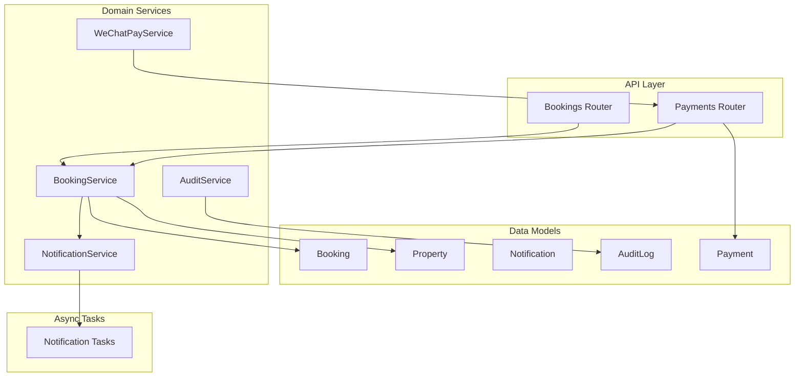

**Diagram sources**
- [bookings.py:1-112](file://backend/app/api/v1/routes/bookings.py#L1-L112)
- [payments.py:1-85](file://backend/app/api/v1/routes/payments.py#L1-L85)
- [booking_service.py:1-164](file://backend/app/services/booking_service.py#L1-L164)
- [notification_service.py:1-164](file://backend/app/services/notification_service.py#L1-L164)
- [payment_service.py:1-445](file://backend/app/services/payment_service.py#L1-L445)
- [audit_service.py:1-55](file://backend/app/services/audit_service.py#L1-L55)
- [booking.py:1-47](file://backend/app/models/booking.py#L1-L47)
- [property.py:1-86](file://backend/app/models/property.py#L1-L86)
- [notification.py:1-36](file://backend/app/models/notification.py#L1-L36)
- [payment.py:1-34](file://backend/app/models/payment.py#L1-L34)
- [audit_log.py:1-25](file://backend/app/models/audit_log.py#L1-L25)
- [notification_tasks.py:1-217](file://backend/app/tasks/notification_tasks.py#L1-L217)

**Section sources**
- [bookings.py:1-112](file://backend/app/api/v1/routes/bookings.py#L1-L112)
- [payments.py:1-85](file://backend/app/api/v1/routes/payments.py#L1-L85)
- [booking_service.py:1-164](file://backend/app/services/booking_service.py#L1-L164)
- [notification_service.py:1-164](file://backend/app/services/notification_service.py#L1-L164)
- [payment_service.py:1-445](file://backend/app/services/payment_service.py#L1-L445)
- [audit_service.py:1-55](file://backend/app/services/audit_service.py#L1-L55)
- [booking.py:1-47](file://backend/app/models/booking.py#L1-L47)
- [property.py:1-86](file://backend/app/models/property.py#L1-L86)
- [notification.py:1-36](file://backend/app/models/notification.py#L1-L36)
- [payment.py:1-34](file://backend/app/models/payment.py#L1-L34)
- [audit_log.py:1-25](file://backend/app/models/audit_log.py#L1-L25)
- [notification_tasks.py:1-217](file://backend/app/tasks/notification_tasks.py#L1-L217)

## Core Components
- Booking model defines the core entity with status enum (pending, approved, rejected, cancelled, completed), scheduling fields, deposit and fee tracking, and relationships to tenant, property, and landlord.
- Property model provides pricing, deposit amount, and service fee rate used to compute booking costs.
- Notification model and service persist notifications and dispatch them via WeChat, SMS, and Email using Celery tasks.
- Payment model and routes manage deposit payment records and link to bookings; payment callback updates deposit status.
- Audit log model and service record user actions for compliance.

Key responsibilities:
- Create booking with validation and duplicate prevention.
- Landlord approves or rejects pending bookings.
- Tenant cancels pending bookings.
- Payment initiation and callback update deposit status.
- Notifications sent to relevant parties on state changes.
- Optional audit logging for critical actions.

**Section sources**
- [booking.py:1-47](file://backend/app/models/booking.py#L1-L47)
- [property.py:1-86](file://backend/app/models/property.py#L1-L86)
- [notification.py:1-36](file://backend/app/models/notification.py#L1-L36)
- [payment.py:1-34](file://backend/app/models/payment.py#L1-L34)
- [audit_log.py:1-25](file://backend/app/models/audit_log.py#L1-L25)
- [booking_service.py:1-164](file://backend/app/services/booking_service.py#L1-L164)
- [notification_service.py:1-164](file://backend/app/services/notification_service.py#L1-L164)
- [payments.py:1-85](file://backend/app/api/v1/routes/payments.py#L1-L85)
- [audit_service.py:1-55](file://backend/app/services/audit_service.py#L1-L55)

## Architecture Overview
The system follows a layered architecture:
- API routes validate inputs and enforce authorization.
- BookingService orchestrates business logic and persists changes within database transactions.
- NotificationService writes DB notifications and triggers async tasks for push channels.
- PaymentService handles WeChat Pay V3 integrations for order creation and callback processing.
- AuditService can be used to record compliance events.

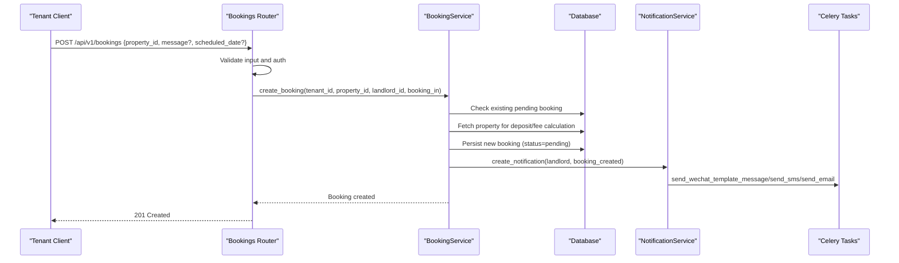

**Diagram sources**
- [bookings.py:14-41](file://backend/app/api/v1/routes/bookings.py#L14-L41)
- [booking_service.py:15-79](file://backend/app/services/booking_service.py#L15-L79)
- [notification_service.py:43-69](file://backend/app/services/notification_service.py#L43-L69)
- [notification_tasks.py:53-97](file://backend/app/tasks/notification_tasks.py#L53-L97)

## Detailed Component Analysis

### Booking Lifecycle and Status Transitions
Statuses:
- pending: Initial state after tenant creates a booking.
- approved: Landlord approves the booking.
- rejected: Landlord rejects the booking.
- cancelled: Tenant cancels the booking.
- completed: End-of-lifecycle state (e.g., after visit or process completion).

Business rules:
- Only tenants can create bookings.
- Duplicate pending bookings for the same tenant and property are prevented.
- Only landlords (or admins) can approve/reject pending bookings.
- Only tenants (or admins) can cancel their own bookings.
- Deposit and service fee are computed from property settings at creation time.
- Notifications are sent to appropriate users upon key events.

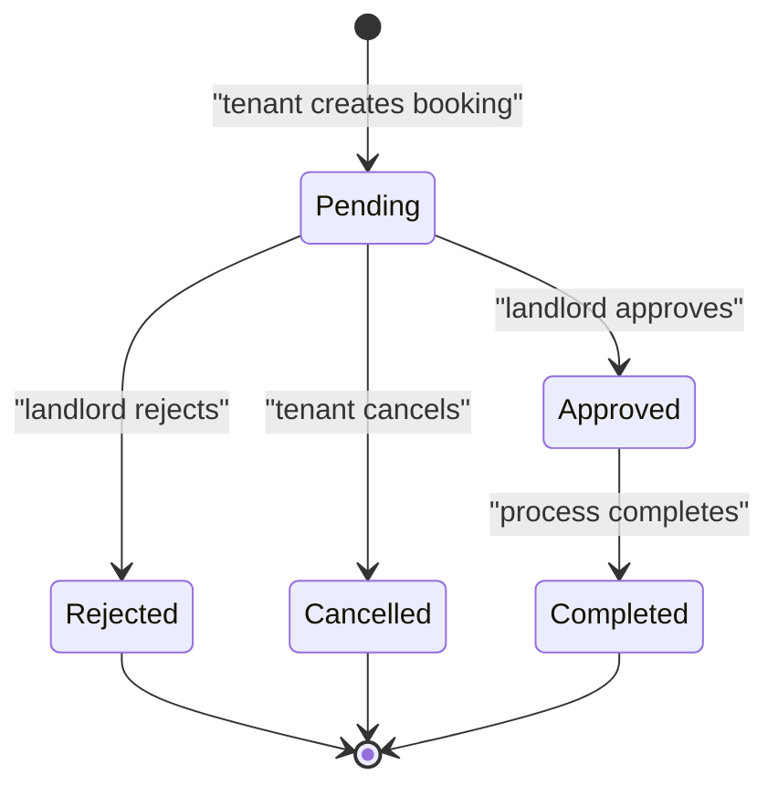

**Diagram sources**
- [booking.py:10-16](file://backend/app/models/booking.py#L10-L16)
- [bookings.py:71-93](file://backend/app/api/v1/routes/bookings.py#L71-L93)
- [booking_service.py:81-142](file://backend/app/services/booking_service.py#L81-L142)

**Section sources**
- [booking.py:10-16](file://backend/app/models/booking.py#L10-L16)
- [bookings.py:14-41](file://backend/app/api/v1/routes/bookings.py#L14-L41)
- [bookings.py:71-93](file://backend/app/api/v1/routes/bookings.py#L71-L93)
- [bookings.py:96-111](file://backend/app/api/v1/routes/bookings.py#L96-L111)
- [booking_service.py:15-79](file://backend/app/services/booking_service.py#L15-L79)
- [booking_service.py:81-142](file://backend/app/services/booking_service.py#L81-L142)

### Landlord Approval Workflow
- Landlord calls PATCH /api/v1/bookings/{id}/status with status approved or rejected.
- Authorization ensures only the landlord (or admin) can perform this action.
- On success, BookingService updates status and sends notifications to the tenant.

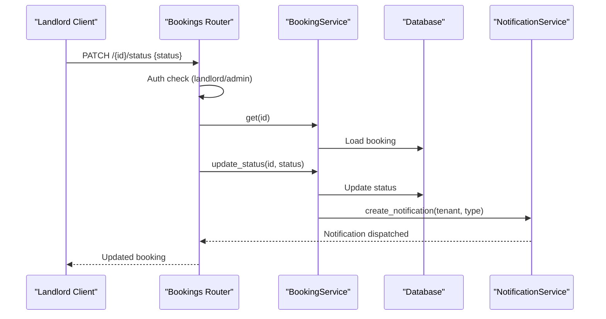

**Diagram sources**
- [bookings.py:71-93](file://backend/app/api/v1/routes/bookings.py#L71-L93)
- [booking_service.py:81-142](file://backend/app/services/booking_service.py#L81-L142)
- [notification_service.py:43-69](file://backend/app/services/notification_service.py#L43-L69)

**Section sources**
- [bookings.py:71-93](file://backend/app/api/v1/routes/bookings.py#L71-L93)
- [booking_service.py:81-142](file://backend/app/services/booking_service.py#L81-L142)
- [notification_service.py:43-69](file://backend/app/services/notification_service.py#L43-L69)

### Tenant Cancellation Flow
- Tenant calls PATCH /api/v1/bookings/{id}/cancel.
- Authorization ensures only the tenant (or admin) can cancel.
- BookingService sets status to cancelled and notifies the landlord.

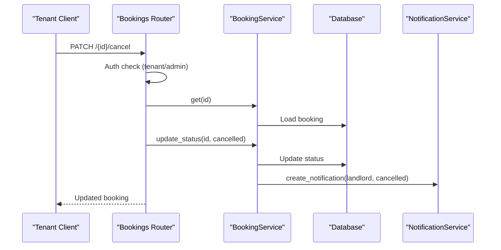

**Diagram sources**
- [bookings.py:96-111](file://backend/app/api/v1/routes/bookings.py#L96-L111)
- [booking_service.py:81-142](file://backend/app/services/booking_service.py#L81-L142)
- [notification_service.py:43-69](file://backend/app/services/notification_service.py#L43-L69)

**Section sources**
- [bookings.py:96-111](file://backend/app/api/v1/routes/bookings.py#L96-L111)
- [booking_service.py:81-142](file://backend/app/services/booking_service.py#L81-L142)
- [notification_service.py:43-69](file://backend/app/services/notification_service.py#L43-L69)

### Payment Integration and Deposit Confirmation
- Tenant initiates payment for deposit via POST /api/v1/payments/create.
- Payment record is created and linked to booking; deposit_status updated to paid.
- Payment callback endpoint simulates success and updates deposit_status to confirmed.
- WeChat Pay service supports JSAPI order creation, callback parsing, query, close, and refund.

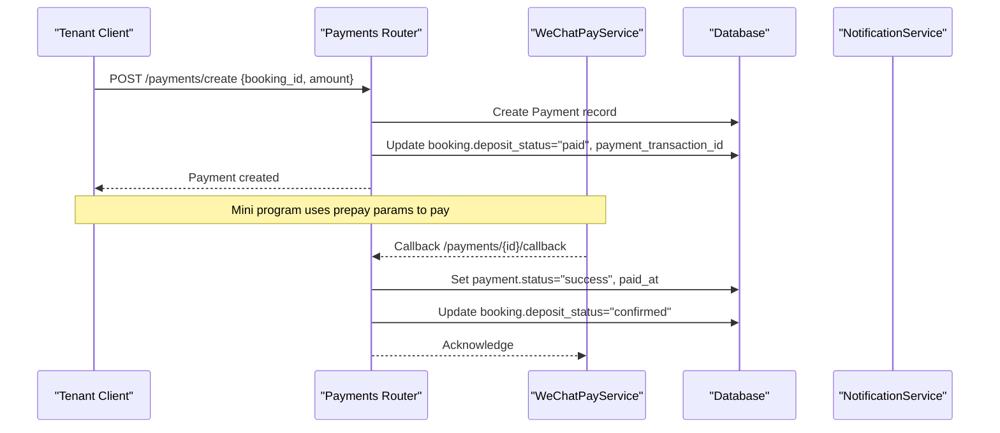

**Diagram sources**
- [payments.py:15-69](file://backend/app/api/v1/routes/payments.py#L15-L69)
- [payment_service.py:245-377](file://backend/app/services/payment_service.py#L245-L377)

**Section sources**
- [payments.py:15-69](file://backend/app/api/v1/routes/payments.py#L15-L69)
- [payment_service.py:245-377](file://backend/app/services/payment_service.py#L245-L377)

### Conflict Resolution for Overlapping Bookings
Current implementation prevents duplicate pending bookings for the same tenant and property by checking existing pending bookings before creation. There is no explicit overlap detection across different tenants or dates; additional constraints would be needed to prevent time conflicts.

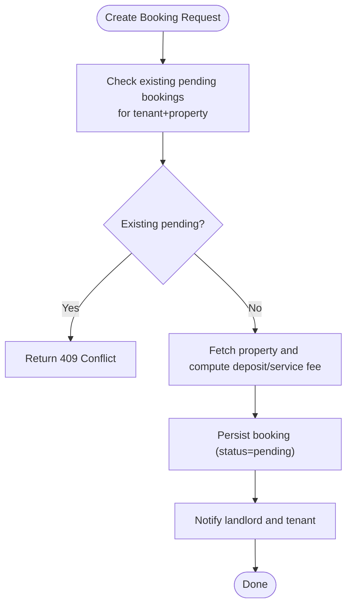

**Diagram sources**
- [booking_service.py:15-79](file://backend/app/services/booking_service.py#L15-L79)
- [bookings.py:14-41](file://backend/app/api/v1/routes/bookings.py#L14-L41)

**Section sources**
- [booking_service.py:15-79](file://backend/app/services/booking_service.py#L15-L79)
- [bookings.py:14-41](file://backend/app/api/v1/routes/bookings.py#L14-L41)

### Validation and Date Range Checking
- Input validation requires at least one of message or scheduled_date when creating a booking.
- scheduled_date is stored as a string; no server-side date format validation is present in the route.
- Additional validation (e.g., future dates, non-overlapping ranges per property) should be added to ensure business integrity.

**Section sources**
- [bookings.py:20-24](file://backend/app/api/v1/routes/bookings.py#L20-L24)
- [booking.py:37-37](file://backend/app/models/booking.py#L37-L37)

### Tenant Notification System
- Unified notifications are persisted and dispatched via WeChat, SMS, and Email.
- Specific flows:
  - Booking created: notify landlord.
  - Booking approved/rejected: notify tenant.
  - Booking cancelled: notify landlord.
  - Booking completed: notify tenant and landlord.
- Celery tasks handle channel-specific sending with retries.

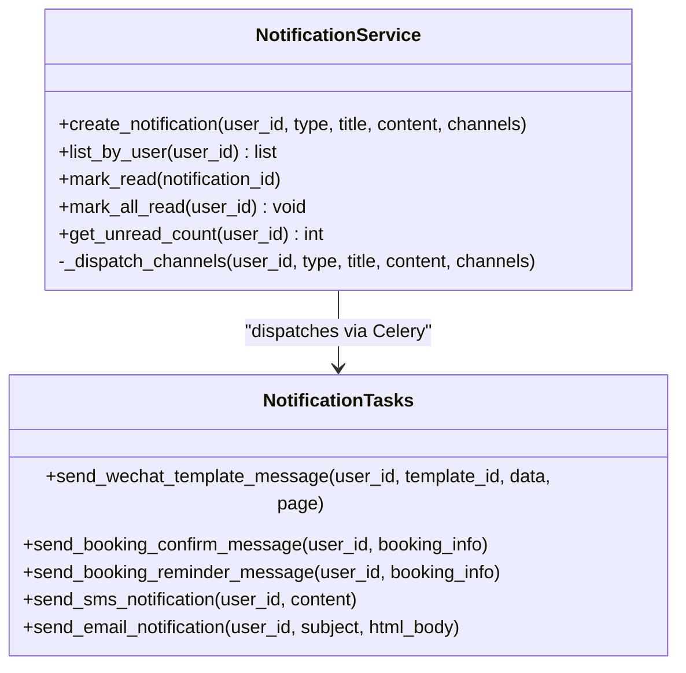

**Diagram sources**
- [notification_service.py:43-164](file://backend/app/services/notification_service.py#L43-L164)
- [notification_tasks.py:53-217](file://backend/app/tasks/notification_tasks.py#L53-L217)

**Section sources**
- [notification_service.py:43-164](file://backend/app/services/notification_service.py#L43-L164)
- [notification_tasks.py:53-217](file://backend/app/tasks/notification_tasks.py#L53-L217)

### Concurrency Handling and Transaction Management
- Database-level uniqueness constraints are not enforced for pending bookings; duplicate prevention relies on application checks.
- To avoid race conditions under concurrent requests, consider:
  - Adding a unique index on (tenant_id, property_id) where status = 'pending'.
  - Using row-level locking or optimistic concurrency control during create/update.
- Current service commits changes within session scope; wrapping multiple mutations (e.g., payment + booking updates) in a single transaction is recommended.

**Section sources**
- [booking_service.py:23-53](file://backend/app/services/booking_service.py#L23-L53)
- [payments.py:28-45](file://backend/app/api/v1/routes/payments.py#L28-L45)

### Audit Logging for Compliance
- AuditLog model captures user actions, resource types, IDs, details, IP address, and timestamps.
- AuditService provides methods to create logs and list them with filters.
- Integrate audit logging into critical booking and payment flows to maintain compliance trails.

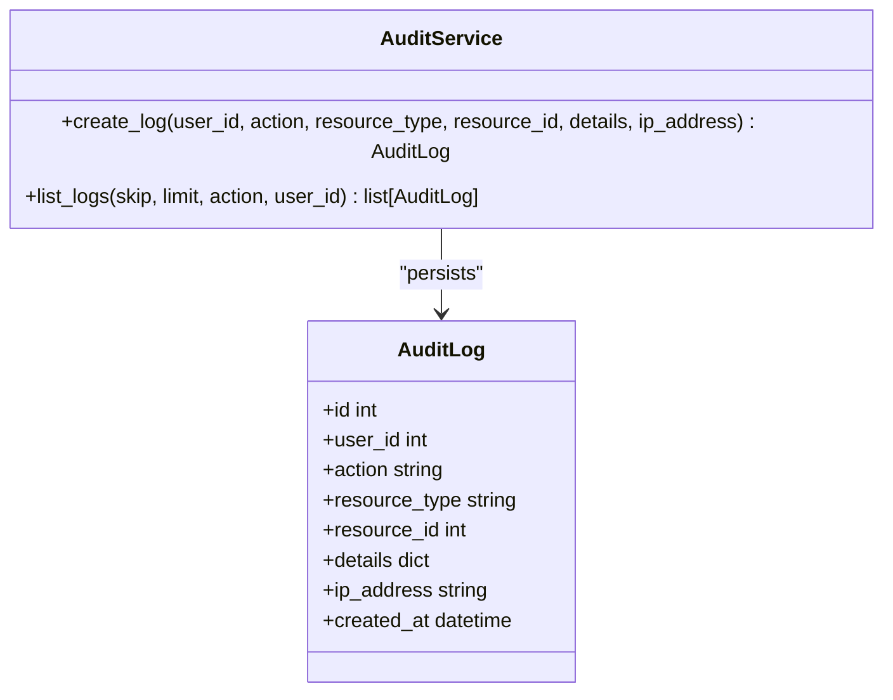

**Diagram sources**
- [audit_service.py:11-55](file://backend/app/services/audit_service.py#L11-L55)
- [audit_log.py:10-25](file://backend/app/models/audit_log.py#L10-L25)

**Section sources**
- [audit_service.py:11-55](file://backend/app/services/audit_service.py#L11-L55)
- [audit_log.py:10-25](file://backend/app/models/audit_log.py#L10-L25)

## Dependency Analysis
High-level dependencies among components:
- Routes depend on services for business logic and models for persistence.
- BookingService depends on NotificationService for cross-channel notifications.
- Payments router depends on BookingService to link payments to bookings.
- NotificationService depends on Celery tasks for async delivery.
- PaymentService depends on configuration and external WeChat Pay APIs.

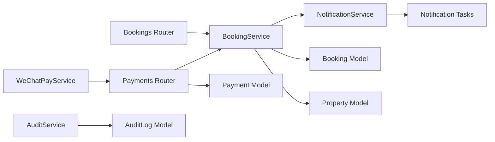

**Diagram sources**
- [bookings.py:1-112](file://backend/app/api/v1/routes/bookings.py#L1-L112)
- [payments.py:1-85](file://backend/app/api/v1/routes/payments.py#L1-L85)
- [booking_service.py:1-164](file://backend/app/services/booking_service.py#L1-L164)
- [notification_service.py:1-164](file://backend/app/services/notification_service.py#L1-L164)
- [payment_service.py:1-445](file://backend/app/services/payment_service.py#L1-L445)
- [audit_service.py:1-55](file://backend/app/services/audit_service.py#L1-L55)
- [booking.py:1-47](file://backend/app/models/booking.py#L1-L47)
- [property.py:1-86](file://backend/app/models/property.py#L1-L86)
- [payment.py:1-34](file://backend/app/models/payment.py#L1-L34)
- [audit_log.py:1-25](file://backend/app/models/audit_log.py#L1-L25)
- [notification_tasks.py:1-217](file://backend/app/tasks/notification_tasks.py#L1-L217)

**Section sources**
- [bookings.py:1-112](file://backend/app/api/v1/routes/bookings.py#L1-L112)
- [payments.py:1-85](file://backend/app/api/v1/routes/payments.py#L1-L85)
- [booking_service.py:1-164](file://backend/app/services/booking_service.py#L1-L164)
- [notification_service.py:1-164](file://backend/app/services/notification_service.py#L1-L164)
- [payment_service.py:1-445](file://backend/app/services/payment_service.py#L1-L445)
- [audit_service.py:1-55](file://backend/app/services/audit_service.py#L1-L55)
- [booking.py:1-47](file://backend/app/models/booking.py#L1-L47)
- [property.py:1-86](file://backend/app/models/property.py#L1-L86)
- [payment.py:1-34](file://backend/app/models/payment.py#L1-L34)
- [audit_log.py:1-25](file://backend/app/models/audit_log.py#L1-L25)
- [notification_tasks.py:1-217](file://backend/app/tasks/notification_tasks.py#L1-L217)

## Performance Considerations
- Use database indexes on frequently filtered columns (already present for tenant_id, property_id, landlord_id).
- Avoid unnecessary object loading; fetch only required fields when possible.
- Offload heavy I/O (notifications, payments) to background tasks to keep API latency low.
- Consider caching property metadata (deposit_amount, service_fee_rate) if accessed frequently.
- Implement idempotency keys for payment creation and callback processing to handle retries safely.

[No sources needed since this section provides general guidance]

## Troubleshooting Guide
Common issues and resolutions:
- Duplicate pending booking error: Ensure tenant does not already have a pending booking for the same property.
- Unauthorized access: Verify user roles and ownership checks in routes.
- Payment callback failures: Validate signature and decrypt resource properly; ensure correct configuration of keys and URLs.
- Notification delivery failures: Check Celery worker health and channel credentials; review task logs for errors.
- Missing scheduled_date or message: Provide at least one field when creating a booking.

**Section sources**
- [bookings.py:20-24](file://backend/app/api/v1/routes/bookings.py#L20-L24)
- [bookings.py:65-66](file://backend/app/api/v1/routes/bookings.py#L65-L66)
- [payment_service.py:325-377](file://backend/app/services/payment_service.py#L325-L377)
- [notification_tasks.py:53-97](file://backend/app/tasks/notification_tasks.py#L53-L97)

## Conclusion
The Booking Service implements a robust workflow for managing rental bookings with clear status transitions, landlord approvals, tenant cancellations, payment integration, and multi-channel notifications. While current validations and concurrency controls are adequate for basic scenarios, enhancements such as database-level constraints, comprehensive date overlap checks, and stronger transaction boundaries will improve reliability and compliance.

[No sources needed since this section summarizes without analyzing specific files]

## Appendices

### API Endpoints Summary
- POST /api/v1/bookings: Create a booking (tenant only). Requires property_id and at least one of message or scheduled_date.
- GET /api/v1/bookings: List bookings for current user (tenant or landlord/admin).
- GET /api/v1/bookings/{id}: Get booking details (owner or admin).
- PATCH /api/v1/bookings/{id}/status: Approve or reject (landlord/admin only).
- PATCH /api/v1/bookings/{id}/cancel: Cancel booking (tenant/admin only).
- POST /api/v1/payments/create: Initiate deposit payment (tenant/admin only).
- POST /api/v1/payments/{id}/callback: Payment callback (simulated success).
- GET /api/v1/payments/{id}: Get payment details (owner or admin).

**Section sources**
- [bookings.py:14-111](file://backend/app/api/v1/routes/bookings.py#L14-L111)
- [payments.py:15-85](file://backend/app/api/v1/routes/payments.py#L15-L85)

### Data Model Relationships
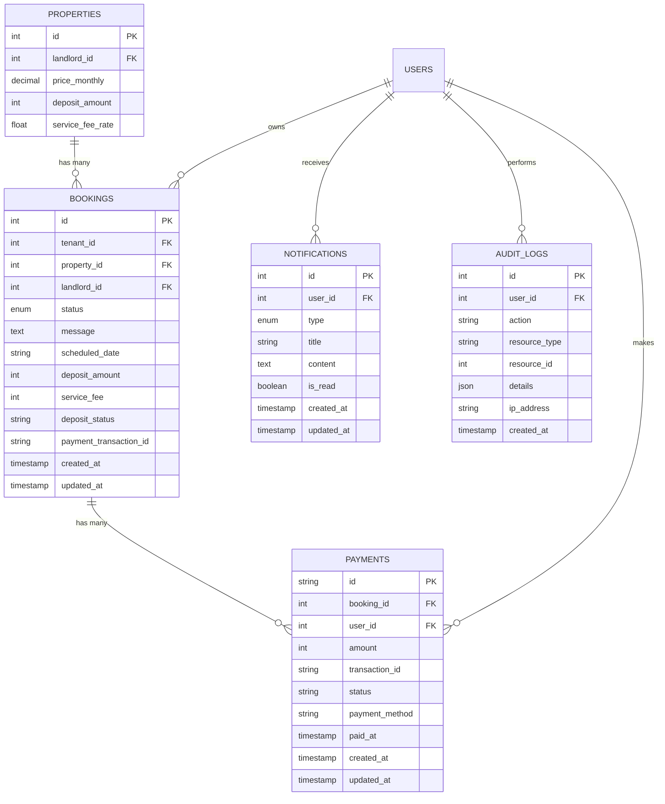

**Diagram sources**
- [booking.py:18-47](file://backend/app/models/booking.py#L18-L47)
- [property.py:38-86](file://backend/app/models/property.py#L38-L86)
- [notification.py:20-36](file://backend/app/models/notification.py#L20-L36)
- [payment.py:11-34](file://backend/app/models/payment.py#L11-L34)
- [audit_log.py:10-25](file://backend/app/models/audit_log.py#L10-L25)

### Migration Notes
- Initial migration creates bookings and notifications tables with enums and indexes.
- Subsequent migrations extend notifications and add audit logs and payment-related fields.

**Section sources**
- [20260620_0004_booking_and_notification.py:18-72](file://backend/alembic/versions/20260620_0004_booking_and_notification.py#L18-L72)

### Test Coverage Highlights
- Creating and listing bookings.
- Preventing duplicate pending bookings.
- Landlord approving and rejecting bookings.
- Tenant cancelling bookings.
- Unauthenticated access denied.

**Section sources**
- [test_bookings.py:6-66](file://backend/tests/test_bookings.py#L6-L66)
- [test_bookings.py:69-117](file://backend/tests/test_bookings.py#L69-L117)
- [test_bookings.py:121-199](file://backend/tests/test_bookings.py#L121-L199)
- [test_bookings.py:203-252](file://backend/tests/test_bookings.py#L203-L252)
- [test_bookings.py:256-263](file://backend/tests/test_bookings.py#L256-L263)