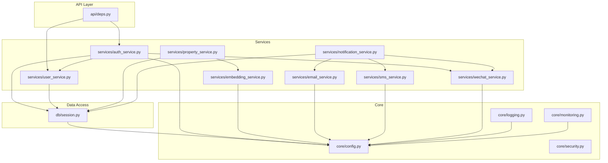
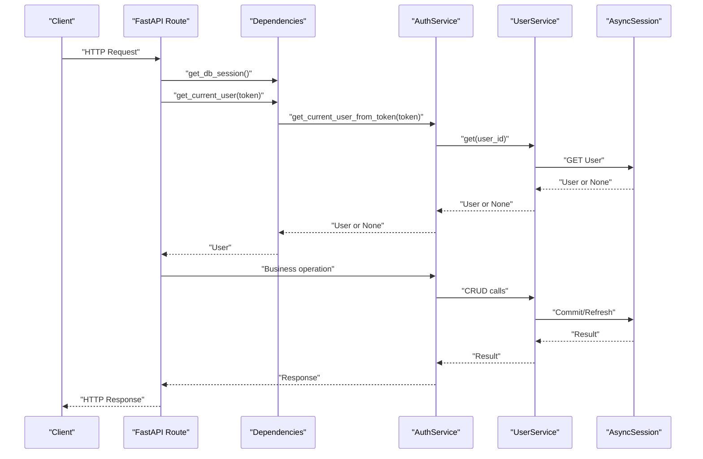
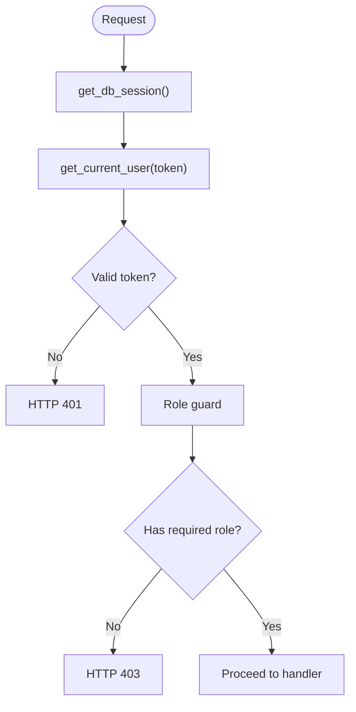
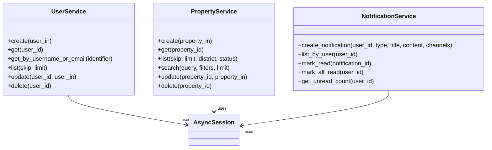
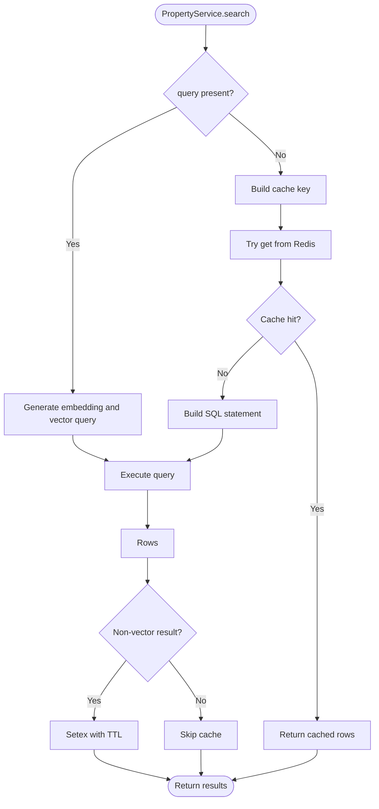
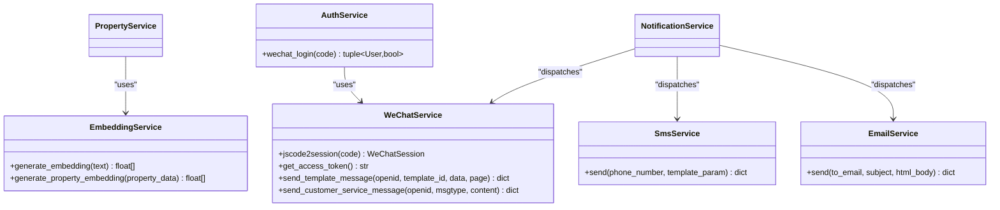
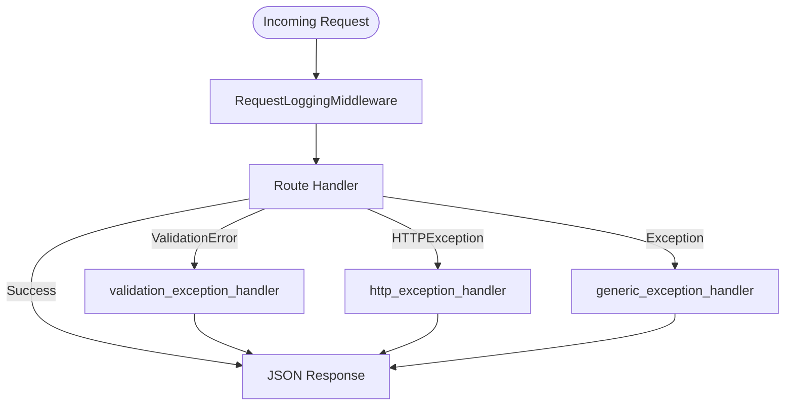
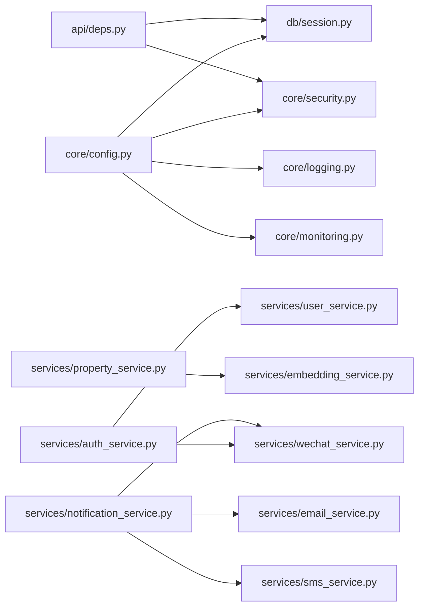

# Common Service Patterns

<cite>
**Referenced Files in This Document**
- [deps.py](file://backend/app/api/deps.py)
- [session.py](file://backend/app/db/session.py)
- [config.py](file://backend/app/core/config.py)
- [logging.py](file://backend/app/core/logging.py)
- [security.py](file://backend/app/core/security.py)
- [monitoring.py](file://backend/app/core/monitoring.py)
- [auth_service.py](file://backend/app/services/auth_service.py)
- [user_service.py](file://backend/app/services/user_service.py)
- [property_service.py](file://backend/app/services/property_service.py)
- [notification_service.py](file://backend/app/services/notification_service.py)
- [embedding_service.py](file://backend/app/services/embedding_service.py)
- [email_service.py](file://backend/app/services/email_service.py)
- [sms_service.py](file://backend/app/services/sms_service.py)
- [wechat_service.py](file://backend/app/services/wechat_service.py)
</cite>

## Table of Contents
1. [Introduction](#introduction)
2. [Project Structure](#project-structure)
3. [Core Components](#core-components)
4. [Architecture Overview](#architecture-overview)
5. [Detailed Component Analysis](#detailed-component-analysis)
6. [Dependency Analysis](#dependency-analysis)
7. [Performance Considerations](#performance-considerations)
8. [Troubleshooting Guide](#troubleshooting-guide)
9. [Conclusion](#conclusion)

## Introduction
This document describes common patterns and utilities used across the service layer, focusing on dependency injection, async database operations, transaction management, error handling, logging, caching, composition, interface design, testing approaches, configuration management, external integrations, performance, memory management, and scalability. It synthesizes practices observed in the backend services and supporting modules to provide a consistent guide for building robust business logic.

## Project Structure
The service layer is organized by feature with clear separation between API dependencies, core infrastructure (configuration, security, logging, monitoring), data access via SQLAlchemy async sessions, and domain services that orchestrate business workflows and integrate with external systems.

**Diagram sources**
- [deps.py:1-58](file://backend/app/api/deps.py#L1-L58)
- [session.py:1-14](file://backend/app/db/session.py#L1-L14)
- [config.py:1-167](file://backend/app/core/config.py#L1-L167)
- [logging.py:1-231](file://backend/app/core/logging.py#L1-L231)
- [security.py:1-34](file://backend/app/core/security.py#L1-L34)
- [monitoring.py:1-227](file://backend/app/core/monitoring.py#L1-L227)
- [auth_service.py:1-77](file://backend/app/services/auth_service.py#L1-L77)
- [user_service.py:1-57](file://backend/app/services/user_service.py#L1-L57)
- [property_service.py:1-239](file://backend/app/services/property_service.py#L1-L239)
- [notification_service.py:1-164](file://backend/app/services/notification_service.py#L1-L164)
- [embedding_service.py:1-32](file://backend/app/services/embedding_service.py#L1-L32)
- [email_service.py:1-76](file://backend/app/services/email_service.py#L1-L76)
- [sms_service.py:1-96](file://backend/app/services/sms_service.py#L1-L96)
- [wechat_service.py:1-146](file://backend/app/services/wechat_service.py#L1-L146)

**Section sources**
- [deps.py:1-58](file://backend/app/api/deps.py#L1-L58)
- [session.py:1-14](file://backend/app/db/session.py#L1-L14)
- [config.py:1-167](file://backend/app/core/config.py#L1-L167)

## Core Components
- Dependency Injection: FastAPI dependencies provide AsyncSession and authenticated user context; role-based guards enforce authorization.
- Database Access: Async SQLAlchemy engine and session factory configured from centralized settings.
- Configuration Management: Pydantic Settings loaded from environment with validation aliases and defaults.
- Security: Password hashing and JWT token creation/decoding using settings-driven algorithm and secret.
- Logging: Structured JSON logs in production, colored console in development; request middleware adds correlation IDs and masks sensitive fields.
- Monitoring: Optional Prometheus metrics for HTTP requests, Celery tasks, and DB pool gauges.

Key responsibilities and interactions are implemented across the files listed above.

**Section sources**
- [deps.py:14-57](file://backend/app/api/deps.py#L14-L57)
- [session.py:1-14](file://backend/app/db/session.py#L1-L14)
- [config.py:7-167](file://backend/app/core/config.py#L7-L167)
- [security.py:12-34](file://backend/app/core/security.py#L12-L34)
- [logging.py:77-101](file://backend/app/core/logging.py#L77-L101)
- [monitoring.py:126-176](file://backend/app/core/monitoring.py#L126-L176)

## Architecture Overview
The service layer follows a layered architecture:
- API layer uses FastAPI dependencies to inject DB sessions and current user context.
- Services encapsulate business logic, compose other services, and interact with models via AsyncSession.
- External integrations (OpenAI, WeChat, Alibaba Cloud SMS, SMTP) are isolated in dedicated services.
- Background work is dispatched via Celery tasks where appropriate.

**Diagram sources**
- [deps.py:14-30](file://backend/app/api/deps.py#L14-L30)
- [auth_service.py:40-51](file://backend/app/services/auth_service.py#L40-L51)
- [user_service.py:19-20](file://backend/app/services/user_service.py#L19-L20)
- [session.py:8-9](file://backend/app/db/session.py#L8-L9)

## Detailed Component Analysis

### Dependency Injection and Authorization
- Session lifecycle: A generator dependency yields an AsyncSession per request, ensuring isolation and automatic cleanup.
- Authentication: Bearer token extraction and decoding; invalid tokens raise HTTP 401.
- Role guards: Require landlord, tenant, or admin roles; unauthorized roles raise HTTP 403.

**Diagram sources**
- [deps.py:14-30](file://backend/app/api/deps.py#L14-L30)
- [deps.py:33-57](file://backend/app/api/deps.py#L33-L57)

**Section sources**
- [deps.py:14-57](file://backend/app/api/deps.py#L14-L57)

### Database Operations and Transactions
- AsyncSession usage: All services receive an AsyncSession via constructor injection.
- Transaction boundaries: Each method performs add/commit/refresh or execute/commit within its scope.
- Read paths: Use scalars/get to fetch entities efficiently.
- Write paths: Add objects, commit, then refresh to ensure consistency.

**Diagram sources**
- [user_service.py:8-57](file://backend/app/services/user_service.py#L8-L57)
- [property_service.py:44-239](file://backend/app/services/property_service.py#L44-L239)
- [notification_service.py:37-104](file://backend/app/services/notification_service.py#L37-L104)

**Section sources**
- [user_service.py:12-57](file://backend/app/services/user_service.py#L12-L57)
- [property_service.py:48-239](file://backend/app/services/property_service.py#L48-L239)
- [notification_service.py:43-104](file://backend/app/services/notification_service.py#L43-L104)

### Caching Patterns
- Redis integration: Lazy import to avoid hard dependency; graceful degradation when unavailable.
- Cache keys: Deterministic keys built from normalized parameters.
- TTL strategy: Short-lived cache for filter-only searches; vector search results bypass cache.
- Error resilience: Cache read/write failures are logged and do not block primary flow.

**Diagram sources**
- [property_service.py:25-41](file://backend/app/services/property_service.py#L25-L41)
- [property_service.py:91-195](file://backend/app/services/property_service.py#L91-L195)

**Section sources**
- [property_service.py:25-41](file://backend/app/services/property_service.py#L25-L41)
- [property_service.py:91-195](file://backend/app/services/property_service.py#L91-L195)

### External Service Integration
- OpenAI Embeddings: Async client initialized from settings; generates embeddings for text or prebuilt property text.
- WeChat Mini Program: Code-to-session exchange, access token caching, template messages, and customer service messaging.
- Alibaba Cloud SMS: HMAC-SHA1 signature generation and HTTP call with timeout and error handling.
- Email via SMTP: Async wrapper around synchronous smtplib using executor to avoid blocking event loop.

**Diagram sources**
- [embedding_service.py:17-32](file://backend/app/services/embedding_service.py#L17-L32)
- [wechat_service.py:23-146](file://backend/app/services/wechat_service.py#L23-L146)
- [sms_service.py:15-96](file://backend/app/services/sms_service.py#L15-L96)
- [email_service.py:11-76](file://backend/app/services/email_service.py#L11-L76)
- [auth_service.py:53-76](file://backend/app/services/auth_service.py#L53-L76)
- [notification_service.py:108-164](file://backend/app/services/notification_service.py#L108-L164)

**Section sources**
- [embedding_service.py:17-32](file://backend/app/services/embedding_service.py#L17-L32)
- [wechat_service.py:45-88](file://backend/app/services/wechat_service.py#L45-L88)
- [sms_service.py:41-96](file://backend/app/services/sms_service.py#L41-L96)
- [email_service.py:17-76](file://backend/app/services/email_service.py#L17-L76)
- [auth_service.py:53-76](file://backend/app/services/auth_service.py#L53-L76)
- [notification_service.py:108-164](file://backend/app/services/notification_service.py#L108-L164)

### Error Handling Conventions
- Global handlers: Validation errors, HTTP exceptions, and unhandled exceptions return structured JSON responses.
- Sensitive data masking: Recursive mask for known sensitive fields and regex patterns.
- Request logging: Middleware records method, path, status, duration, client, and optional user_id.

**Diagram sources**
- [logging.py:124-167](file://backend/app/core/logging.py#L124-L167)
- [logging.py:193-231](file://backend/app/core/logging.py#L193-L231)

**Section sources**
- [logging.py:103-121](file://backend/app/core/logging.py#L103-L121)
- [logging.py:124-167](file://backend/app/core/logging.py#L124-L167)
- [logging.py:193-231](file://backend/app/core/logging.py#L193-L231)

### Logging Standards
- Production: JSON formatter with timestamp, level, logger, module, function, exception stack, request_id, user_id, and extra fields.
- Development: Colored console output with request_id prefix.
- Quiet third-party loggers in production to reduce noise.

**Section sources**
- [logging.py:33-54](file://backend/app/core/logging.py#L33-L54)
- [logging.py:77-101](file://backend/app/core/logging.py#L77-L101)

### Monitoring and Metrics
- Prometheus middleware tracks request counts, latency, and in-flight requests.
- Celery task signals record task count and latency.
- DB pool gauges expose pool size, overflow, and checked-out connections.

**Section sources**
- [monitoring.py:126-176](file://backend/app/core/monitoring.py#L126-L176)
- [monitoring.py:183-208](file://backend/app/core/monitoring.py#L183-L208)
- [monitoring.py:216-227](file://backend/app/core/monitoring.py#L216-L227)

### Service Composition Techniques
- Composition over inheritance: Services instantiate collaborators (e.g., AuthService composes UserService and WeChatService).
- Lazy imports: External clients (Redis, Celery tasks, OpenAI) imported inside methods to avoid hard dependencies at startup.
- Fire-and-forget dispatch: NotificationService triggers Celery tasks for multiple channels without blocking DB writes.

**Section sources**
- [auth_service.py:14-17](file://backend/app/services/auth_service.py#L14-L17)
- [property_service.py:225-239](file://backend/app/services/property_service.py#L225-L239)
- [notification_service.py:108-164](file://backend/app/services/notification_service.py#L108-L164)

### Interface Design Principles
- Constructor injection of AsyncSession ensures testability and explicit dependencies.
- Methods accept Pydantic schemas for input validation and immutability.
- Return types are typed and include optional outcomes for safe handling.

**Section sources**
- [user_service.py:8-17](file://backend/app/services/user_service.py#L8-L17)
- [property_service.py:44-60](file://backend/app/services/property_service.py#L44-L60)
- [notification_service.py:37-69](file://backend/app/services/notification_service.py#L37-L69)

### Testing Approaches for Business Logic
- Use FastAPI TestClient with overridden dependencies to supply mock AsyncSession and users.
- Replace external services with stubs or mocks (e.g., WeChatService, SmsService, EmailService).
- Assert DB state changes via session queries after calling service methods.
- Validate error paths by injecting exceptions into dependencies or external clients.

[No sources needed since this section provides general guidance]

### Reusable Service Methods
- Generic CRUD patterns: create/get/list/update/delete with consistent commit/refresh flows.
- Search with optional filtering and caching: deterministic cache keys and graceful fallback.
- Channel dispatchers: notification channel selection with per-channel try/catch and logging.

**Section sources**
- [user_service.py:12-57](file://backend/app/services/user_service.py#L12-L57)
- [property_service.py:75-195](file://backend/app/services/property_service.py#L75-L195)
- [notification_service.py:108-164](file://backend/app/services/notification_service.py#L108-L164)

### Configuration Management
- Centralized Settings with env_file support and validation aliases.
- Feature toggles and timeouts (e.g., geocoding timeout, rate limits).
- Secure secrets for auth, external APIs, and providers.

**Section sources**
- [config.py:7-167](file://backend/app/core/config.py#L7-L167)

### External Service Integration Patterns
- Async HTTP clients with timeouts and response validation.
- Token caching with expiration checks (WeChat access token).
- Signature generation for provider APIs (Alibaba Cloud SMS).
- Non-blocking I/O for synchronous libraries (SMTP via executor).

**Section sources**
- [wechat_service.py:67-88](file://backend/app/services/wechat_service.py#L67-88)
- [sms_service.py:25-39](file://backend/app/services/sms_service.py#L25-L39)
- [email_service.py:44-58](file://backend/app/services/email_service.py#L44-L58)

## Dependency Analysis

**Diagram sources**
- [config.py:1-167](file://backend/app/core/config.py#L1-L167)
- [session.py:1-14](file://backend/app/db/session.py#L1-L14)
- [security.py:1-34](file://backend/app/core/security.py#L1-L34)
- [logging.py:1-231](file://backend/app/core/logging.py#L1-L231)
- [monitoring.py:1-227](file://backend/app/core/monitoring.py#L1-L227)
- [deps.py:1-58](file://backend/app/api/deps.py#L1-L58)
- [auth_service.py:1-77](file://backend/app/services/auth_service.py#L1-L77)
- [user_service.py:1-57](file://backend/app/services/user_service.py#L1-L57)
- [property_service.py:1-239](file://backend/app/services/property_service.py#L1-L239)
- [notification_service.py:1-164](file://backend/app/services/notification_service.py#L1-L164)
- [embedding_service.py:1-32](file://backend/app/services/embedding_service.py#L1-L32)
- [email_service.py:1-76](file://backend/app/services/email_service.py#L1-L76)
- [sms_service.py:1-96](file://backend/app/services/sms_service.py#L1-L96)
- [wechat_service.py:1-146](file://backend/app/services/wechat_service.py#L1-L146)

**Section sources**
- [deps.py:1-58](file://backend/app/api/deps.py#L1-L58)
- [auth_service.py:1-77](file://backend/app/services/auth_service.py#L1-L77)
- [property_service.py:1-239](file://backend/app/services/property_service.py#L1-L239)
- [notification_service.py:1-164](file://backend/app/services/notification_service.py#L1-L164)

## Performance Considerations
- Async I/O: Prefer async clients and await all DB/network calls to keep the event loop responsive.
- Connection pooling: Tune SQLAlchemy async engine pool sizes based on concurrency and DB capacity.
- Caching: Use short TTLs for volatile data; invalidate caches on writes if necessary.
- Task offloading: Dispatch long-running work (embeddings, notifications) to background workers.
- Rate limiting: Configure request windows to protect downstream services.
- Memory management: Avoid loading large result sets; paginate and stream where possible.

[No sources needed since this section provides general guidance]

## Troubleshooting Guide
- Authentication failures: Check token validity and secret/algorithm settings; verify user status.
- Database issues: Inspect connection strings and pool metrics; confirm migrations applied.
- External service errors: Review logs for provider-specific messages; validate credentials and endpoints.
- Logging gaps: Ensure request_id propagation and check masked fields for sensitive data leaks.
- Metrics missing: Confirm prometheus-client installed and /metrics endpoint mounted.

**Section sources**
- [auth_service.py:40-51](file://backend/app/services/auth_service.py#L40-L51)
- [monitoring.py:167-176](file://backend/app/core/monitoring.py#L167-L176)
- [logging.py:193-231](file://backend/app/core/logging.py#L193-L231)

## Conclusion
The service layer demonstrates a cohesive set of patterns: constructor-injected dependencies, async-first database operations, resilient caching, structured logging, global error handling, and modular external integrations. These practices improve maintainability, observability, and scalability while keeping business logic focused and testable.