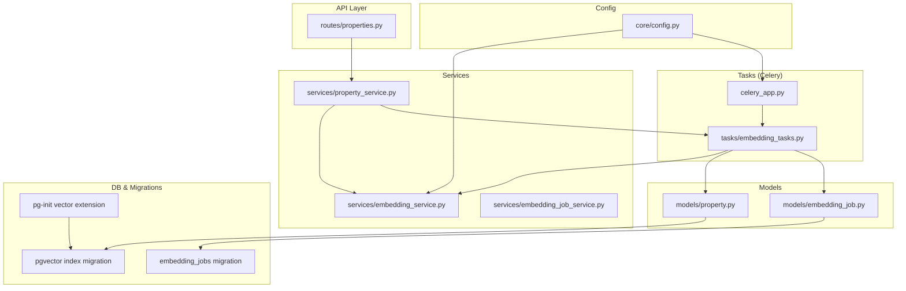
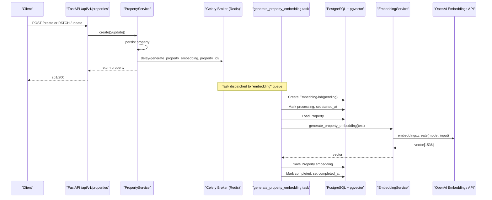
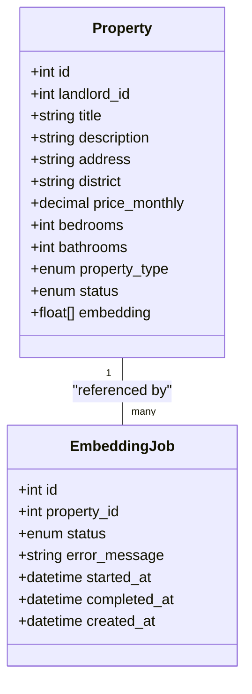
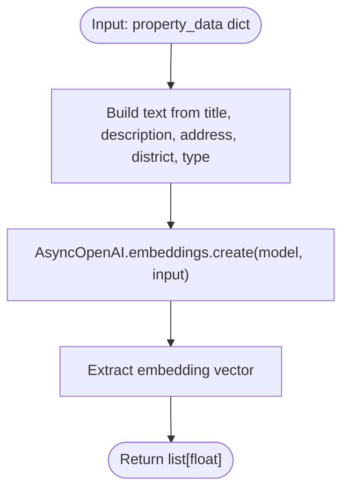
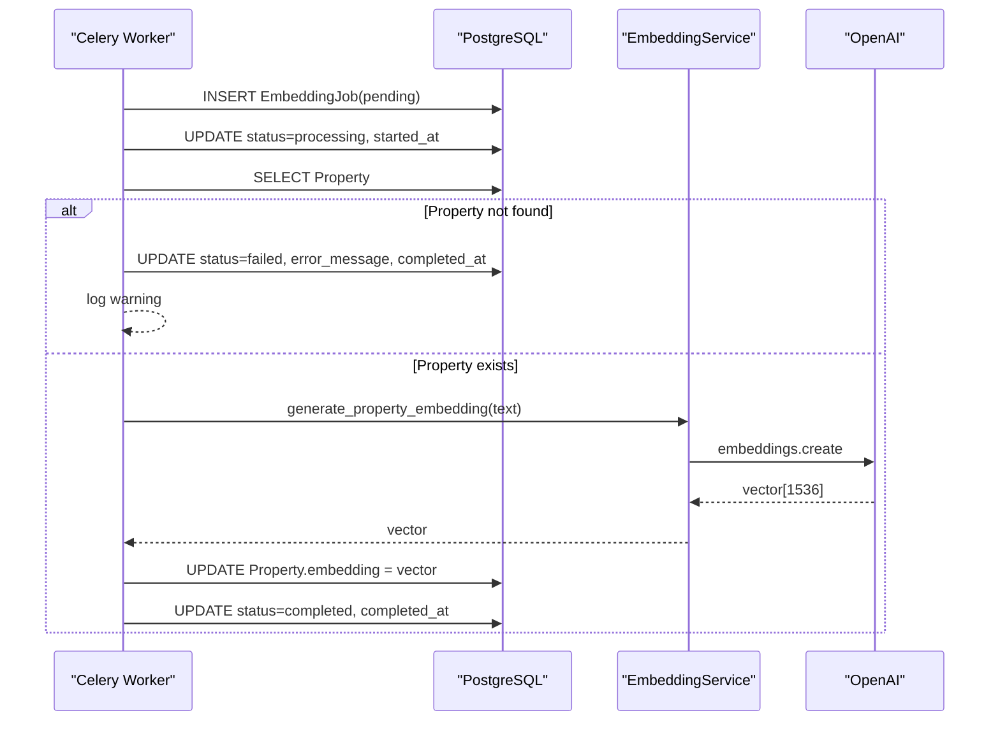
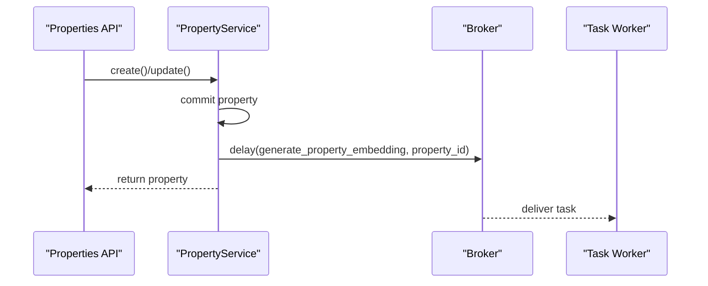
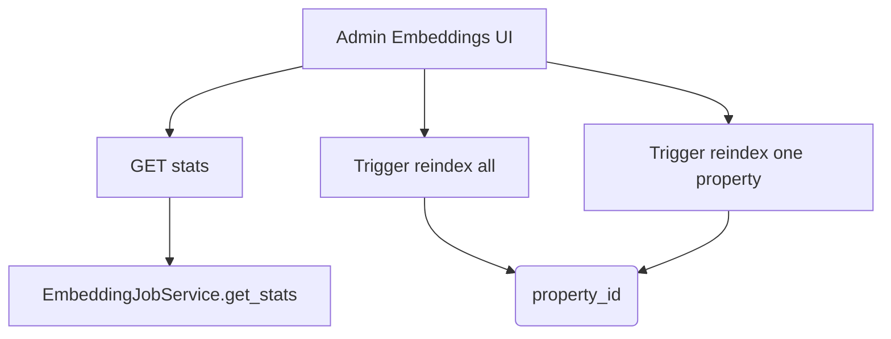
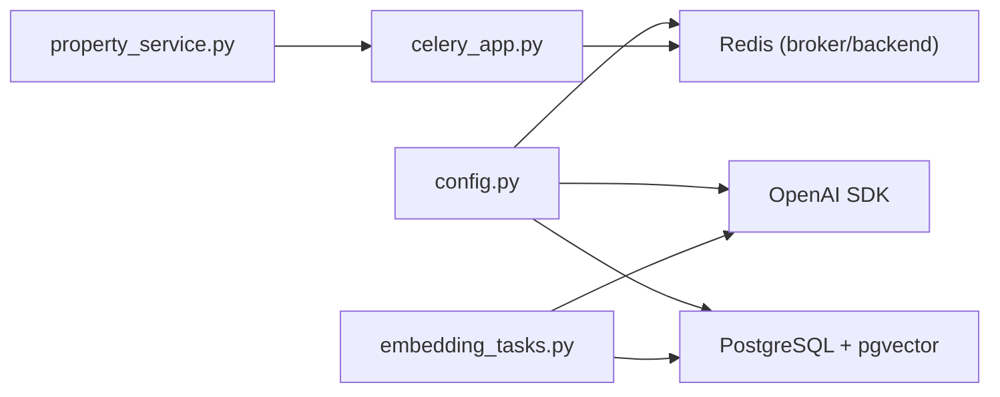

# AI Embedding Integration

<cite>
**Referenced Files in This Document**
- [property.py](file://backend/app/models/property.py)
- [embedding_job.py](file://backend/app/models/embedding_job.py)
- [embedding_service.py](file://backend/app/services/embedding_service.py)
- [embedding_tasks.py](file://backend/app/tasks/embedding_tasks.py)
- [celery_app.py](file://backend/app/celery_app.py)
- [property_service.py](file://backend/app/services/property_service.py)
- [properties.py](file://backend/app/api/v1/routes/properties.py)
- [embedding_job_service.py](file://backend/app/services/embedding_job_service.py)
- [20260620_0002_pgvector_embedding.py](file://backend/alembic/versions/20260620_0002_pgvector_embedding.py)
- [20260620_0005_embedding_jobs_and_audit_logs.py](file://backend/alembic/versions/20260620_0005_embedding_jobs_and_audit_logs.py)
- [config.py](file://backend/app/core/config.py)
- [test_embedding.py](file://backend/tests/test_embedding.py)
- [00-enable-vector.sql](file://docker/pg-init/00-enable-vector.sql)
</cite>

## Table of Contents
1. [Introduction](#introduction)
2. [Project Structure](#project-structure)
3. [Core Components](#core-components)
4. [Architecture Overview](#architecture-overview)
5. [Detailed Component Analysis](#detailed-component-analysis)
6. [Dependency Analysis](#dependency-analysis)
7. [Performance Considerations](#performance-considerations)
8. [Troubleshooting Guide](#troubleshooting-guide)
9. [Conclusion](#conclusion)

## Introduction
This document explains the AI embedding integration for the property service. It covers how embeddings are automatically generated when properties are created or updated, how Celery dispatches asynchronous tasks to compute embeddings, and how vectors are persisted in PostgreSQL using pgvector. It also documents error handling, retry behavior, performance considerations, batch reindexing, monitoring via job status, and troubleshooting guidance.

## Project Structure
The embedding feature spans models, services, tasks, API routes, migrations, configuration, and tests:
- Models define the vector column on Property and the EmbeddingJob tracking table.
- Services orchestrate text assembly and OpenAI embedding generation.
- Tasks implement Celery workers that perform async DB operations and call the embedding service.
- API routes trigger updates and search flows that leverage embeddings.
- Migrations enable pgvector and create indexes.
- Configuration provides OpenAI keys and Redis broker/backend.
- Tests validate embedding dimensionality and text composition.

**Diagram sources**
- [properties.py:1-162](file://backend/app/api/v1/routes/properties.py#L1-L162)
- [property_service.py:1-239](file://backend/app/services/property_service.py#L1-L239)
- [embedding_service.py:1-32](file://backend/app/services/embedding_service.py#L1-L32)
- [embedding_tasks.py:1-112](file://backend/app/tasks/embedding_tasks.py#L1-L112)
- [celery_app.py:1-31](file://backend/app/celery_app.py#L1-L31)
- [property.py:1-86](file://backend/app/models/property.py#L1-L86)
- [embedding_job.py:1-35](file://backend/app/models/embedding_job.py#L1-L35)
- [20260620_0002_pgvector_embedding.py:1-40](file://backend/alembic/versions/20260620_0002_pgvector_embedding.py#L1-L40)
- [20260620_0005_embedding_jobs_and_audit_logs.py:1-67](file://backend/alembic/versions/20260620_0005_embedding_jobs_and_audit_logs.py#L1-L67)
- [00-enable-vector.sql:1-3](file://docker/pg-init/00-enable-vector.sql#L1-L3)
- [config.py:1-167](file://backend/app/core/config.py#L1-L167)

**Section sources**
- [property.py:1-86](file://backend/app/models/property.py#L1-L86)
- [embedding_job.py:1-35](file://backend/app/models/embedding_job.py#L1-L35)
- [embedding_service.py:1-32](file://backend/app/services/embedding_service.py#L1-L32)
- [embedding_tasks.py:1-112](file://backend/app/tasks/embedding_tasks.py#L1-L112)
- [celery_app.py:1-31](file://backend/app/celery_app.py#L1-L31)
- [property_service.py:1-239](file://backend/app/services/property_service.py#L1-L239)
- [properties.py:1-162](file://backend/app/api/v1/routes/properties.py#L1-L162)
- [embedding_job_service.py:1-54](file://backend/app/services/embedding_job_service.py#L1-L54)
- [20260620_0002_pgvector_embedding.py:1-40](file://backend/alembic/versions/20260620_0002_pgvector_embedding.py#L1-L40)
- [20260620_0005_embedding_jobs_and_audit_logs.py:1-67](file://backend/alembic/versions/20260620_0005_embedding_jobs_and_audit_logs.py#L1-L67)
- [config.py:1-167](file://backend/app/core/config.py#L1-L167)
- [test_embedding.py:1-61](file://backend/tests/test_embedding.py#L1-L61)
- [00-enable-vector.sql:1-3](file://docker/pg-init/00-enable-vector.sql#L1-L3)

## Core Components
- Property model with a pgvector-compatible VectorColumn storing 1536-dimensional vectors.
- EmbeddingJob model tracks lifecycle states: pending, processing, completed, failed.
- EmbeddingService composes property fields into text and calls OpenAI embeddings API.
- Celery task generate_property_embedding orchestrates DB session, creates jobs, calls EmbeddingService, persists vectors, and updates job status.
- PropertyService triggers embedding tasks asynchronously on create/update.
- EmbeddingJobService exposes stats and reindex triggers.
- Migrations enable pgvector, add embedding column and IVFFlat index, and create embedding_jobs table.
- Celery app configures Redis broker/backend and routes embedding tasks to a dedicated queue.
- Config provides OPENAI_API_KEY, OPENAI_EMBEDDING_MODEL, and REDIS_URL.

**Section sources**
- [property.py:12-22](file://backend/app/models/property.py#L12-L22)
- [property.py:78-78](file://backend/app/models/property.py#L78-L78)
- [embedding_job.py:10-35](file://backend/app/models/embedding_job.py#L10-L35)
- [embedding_service.py:6-32](file://backend/app/services/embedding_service.py#L6-L32)
- [embedding_tasks.py:16-80](file://backend/app/tasks/embedding_tasks.py#L16-L80)
- [property_service.py:48-60](file://backend/app/services/property_service.py#L48-L60)
- [property_service.py:197-214](file://backend/app/services/property_service.py#L197-L214)
- [embedding_job_service.py:21-54](file://backend/app/services/embedding_job_service.py#L21-L54)
- [20260620_0002_pgvector_embedding.py:21-35](file://backend/alembic/versions/20260620_0002_pgvector_embedding.py#L21-L35)
- [20260620_0005_embedding_jobs_and_audit_logs.py:22-36](file://backend/alembic/versions/20260620_0005_embedding_jobs_and_audit_logs.py#L22-L36)
- [celery_app.py:9-30](file://backend/app/celery_app.py#L9-L30)
- [config.py:46-53](file://backend/app/core/config.py#L46-L53)
- [config.py:24-24](file://backend/app/core/config.py#L24-L24)

## Architecture Overview
End-to-end flow from property mutation to vector storage and search:

**Diagram sources**
- [properties.py:16-33](file://backend/app/api/v1/routes/properties.py#L16-L33)
- [properties.py:121-141](file://backend/app/api/v1/routes/properties.py#L121-L141)
- [property_service.py:48-60](file://backend/app/services/property_service.py#L48-L60)
- [property_service.py:197-214](file://backend/app/services/property_service.py#L197-L214)
- [property_service.py:225-239](file://backend/app/services/property_service.py#L225-L239)
- [embedding_tasks.py:16-80](file://backend/app/tasks/embedding_tasks.py#L16-L80)
- [embedding_service.py:17-32](file://backend/app/services/embedding_service.py#L17-L32)
- [config.py:46-53](file://backend/app/core/config.py#L46-L53)

## Detailed Component Analysis

### Property Model and pgvector Storage
- The Property model includes a VectorColumn mapped to pgvector’s Vector(1536) on PostgreSQL and falls back to text on other dialects.
- The migration enables the vector extension, adds the embedding column, and creates an IVFFlat index with l2 distance operators.

**Diagram sources**
- [property.py:38-86](file://backend/app/models/property.py#L38-L86)
- [embedding_job.py:17-35](file://backend/app/models/embedding_job.py#L17-L35)
- [20260620_0002_pgvector_embedding.py:21-35](file://backend/alembic/versions/20260620_0002_pgvector_embedding.py#L21-L35)
- [20260620_0005_embedding_jobs_and_audit_logs.py:22-36](file://backend/alembic/versions/20260620_0005_embedding_jobs_and_audit_logs.py#L22-L36)

**Section sources**
- [property.py:12-22](file://backend/app/models/property.py#L12-L22)
- [property.py:78-78](file://backend/app/models/property.py#L78-L78)
- [20260620_0002_pgvector_embedding.py:21-35](file://backend/alembic/versions/20260620_0002_pgvector_embedding.py#L21-L35)
- [20260620_0005_embedding_jobs_and_audit_logs.py:22-36](file://backend/alembic/versions/20260620_0005_embedding_jobs_and_audit_logs.py#L22-L36)

### Embedding Service and Text Assembly
- EmbeddingService builds a composite text string from property fields and calls OpenAI embeddings API to obtain a 1536-dimension vector.
- Tests assert the returned vector length and text composition logic.

**Diagram sources**
- [embedding_service.py:6-32](file://backend/app/services/embedding_service.py#L6-L32)
- [test_embedding.py:8-29](file://backend/tests/test_embedding.py#L8-L29)
- [test_embedding.py:32-61](file://backend/tests/test_embedding.py#L32-L61)

**Section sources**
- [embedding_service.py:6-32](file://backend/app/services/embedding_service.py#L6-L32)
- [test_embedding.py:8-29](file://backend/tests/test_embedding.py#L8-L29)
- [test_embedding.py:32-61](file://backend/tests/test_embedding.py#L32-L61)

### Celery Task Orchestration and Job Lifecycle
- generate_property_embedding is a Celery task with autoretry and backoff.
- It creates an EmbeddingJob row, transitions through processing to completed or failed, persists the vector, and logs outcomes.
- reindex_all_properties queries properties without embeddings and enqueues individual tasks per property.

**Diagram sources**
- [embedding_tasks.py:16-80](file://backend/app/tasks/embedding_tasks.py#L16-L80)
- [embedding_tasks.py:83-112](file://backend/app/tasks/embedding_tasks.py#L83-L112)
- [embedding_service.py:17-32](file://backend/app/services/embedding_service.py#L17-L32)

**Section sources**
- [embedding_tasks.py:16-80](file://backend/app/tasks/embedding_tasks.py#L16-L80)
- [embedding_tasks.py:83-112](file://backend/app/tasks/embedding_tasks.py#L83-L112)

### Automatic Triggering on Create and Update
- On create and update, PropertyService persists the property and then dispatches the embedding task asynchronously via a background thread calling Celery.delay.

**Diagram sources**
- [properties.py:16-33](file://backend/app/api/v1/routes/properties.py#L16-L33)
- [properties.py:121-141](file://backend/app/api/v1/routes/properties.py#L121-L141)
- [property_service.py:48-60](file://backend/app/services/property_service.py#L48-L60)
- [property_service.py:197-214](file://backend/app/services/property_service.py#L197-L214)
- [property_service.py:225-239](file://backend/app/services/property_service.py#L225-L239)

**Section sources**
- [property_service.py:48-60](file://backend/app/services/property_service.py#L48-L60)
- [property_service.py:197-214](file://backend/app/services/property_service.py#L197-L214)
- [property_service.py:225-239](file://backend/app/services/property_service.py#L225-L239)

### Monitoring and Reindexing
- EmbeddingJobService provides stats (total, completed, failed, pending) and can trigger reindex for all or a single property.
- Frontend AdminEmbeddings UI displays stats and buttons to trigger reindex operations.

**Diagram sources**
- [embedding_job_service.py:21-54](file://backend/app/services/embedding_job_service.py#L21-L54)
- [AdminEmbeddings.vue:1-125](file://frontend/src/views/admin/AdminEmbeddings.vue#L1-L125)

**Section sources**
- [embedding_job_service.py:21-54](file://backend/app/services/embedding_job_service.py#L21-L54)
- [AdminEmbeddings.vue:1-125](file://frontend/src/views/admin/AdminEmbeddings.vue#L1-L125)

## Dependency Analysis
Key runtime dependencies and integrations:
- OpenAI client configured via OPENAI_API_KEY and OPENAI_EMBEDDING_MODEL.
- Celery uses Redis as broker and result backend; embedding tasks route to the "embedding" queue.
- PostgreSQL requires pgvector extension and IVFFlat index for similarity search.
- Async DB sessions are used within Celery tasks to avoid blocking.

**Diagram sources**
- [config.py:24-24](file://backend/app/core/config.py#L24-L24)
- [config.py:46-53](file://backend/app/core/config.py#L46-L53)
- [celery_app.py:9-30](file://backend/app/celery_app.py#L9-L30)
- [embedding_tasks.py:1-112](file://backend/app/tasks/embedding_tasks.py#L1-L112)
- [property_service.py:225-239](file://backend/app/services/property_service.py#L225-L239)

**Section sources**
- [config.py:24-24](file://backend/app/core/config.py#L24-L24)
- [config.py:46-53](file://backend/app/core/config.py#L46-L53)
- [celery_app.py:9-30](file://backend/app/celery_app.py#L9-L30)
- [embedding_tasks.py:1-112](file://backend/app/tasks/embedding_tasks.py#L1-L112)
- [property_service.py:225-239](file://backend/app/services/property_service.py#L225-L239)

## Performance Considerations
- Vector dimensionality: 1536 dimensions require sufficient memory and CPU during embedding generation.
- Indexing: IVFFlat index with l2_ops improves ANN search performance; tune lists parameter based on dataset size.
- Concurrency: Celery workers should be scaled horizontally; ensure Redis capacity and DB connection pools are sized appropriately.
- Asynchronous dispatch: Property mutations do not block on embedding generation; tasks run in background threads to enqueue immediately.
- Batch reindexing: reindex_all_properties enqueues one task per missing embedding; consider rate limiting or batching if needed.
- Search path: When query is provided, the service computes a query vector and performs l2_distance ordering; cache non-vector results in Redis where available.

[No sources needed since this section provides general guidance]

## Troubleshooting Guide
Common issues and resolutions:
- Missing pgvector extension: Ensure the database has the vector extension enabled. Verify initialization scripts and migrations have run.
- No embeddings present: Use reindex_all_properties to enqueue tasks for properties with null embeddings.
- Failed jobs: Inspect EmbeddingJob.status and error_message; check logs for exceptions raised during OpenAI calls or DB operations.
- Retry behavior: Tasks auto-retry up to 3 times with exponential backoff; persistent failures will mark jobs as failed.
- Broker connectivity: Confirm Redis URL is correct and reachable; Celery startup retries are disabled by default.
- Environment variables: Validate OPENAI_API_KEY and OPENAI_EMBEDDING_MODEL are set; verify REDIS_URL points to a running Redis instance.
- Dimension mismatch: Ensure the VectorColumn expects 1536 dimensions consistent with the OpenAI model used.

**Section sources**
- [00-enable-vector.sql:1-3](file://docker/pg-init/00-enable-vector.sql#L1-L3)
- [20260620_0002_pgvector_embedding.py:21-35](file://backend/alembic/versions/20260620_0002_pgvector_embedding.py#L21-L35)
- [embedding_tasks.py:16-21](file://backend/app/tasks/embedding_tasks.py#L16-L21)
- [embedding_tasks.py:70-76](file://backend/app/tasks/embedding_tasks.py#L70-L76)
- [celery_app.py:20-24](file://backend/app/celery_app.py#L20-L24)
- [config.py:24-24](file://backend/app/core/config.py#L24-L24)
- [config.py:46-53](file://backend/app/core/config.py#L46-L53)
- [property.py:12-22](file://backend/app/models/property.py#L12-L22)

## Conclusion
The embedding integration leverages asynchronous Celery tasks to decouple property mutations from vector computation, ensuring responsive APIs while persisting high-quality semantic representations in PostgreSQL via pgvector. Robust job tracking, retries, and admin tools provide visibility and control. Proper configuration of OpenAI credentials, Redis, and pgvector indexing ensures reliable and performant natural language search capabilities.