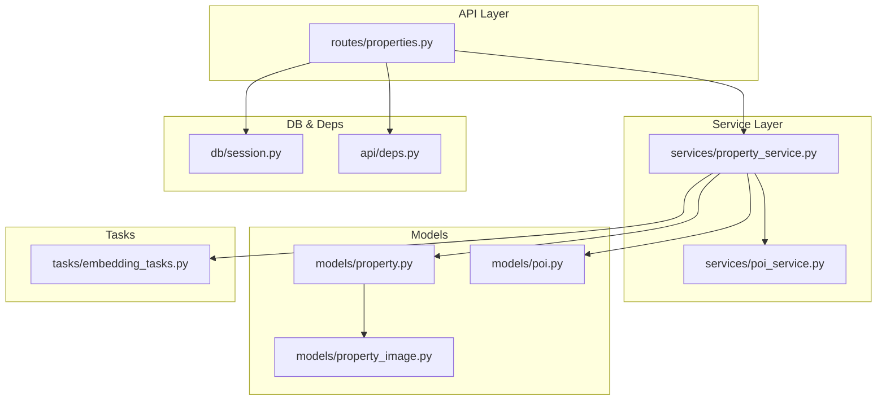
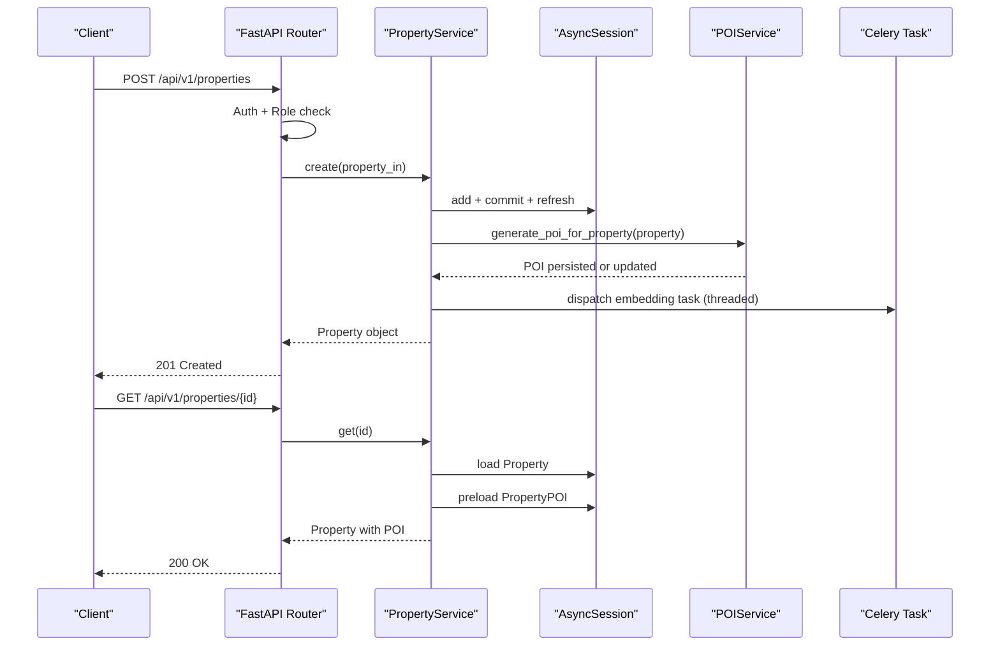
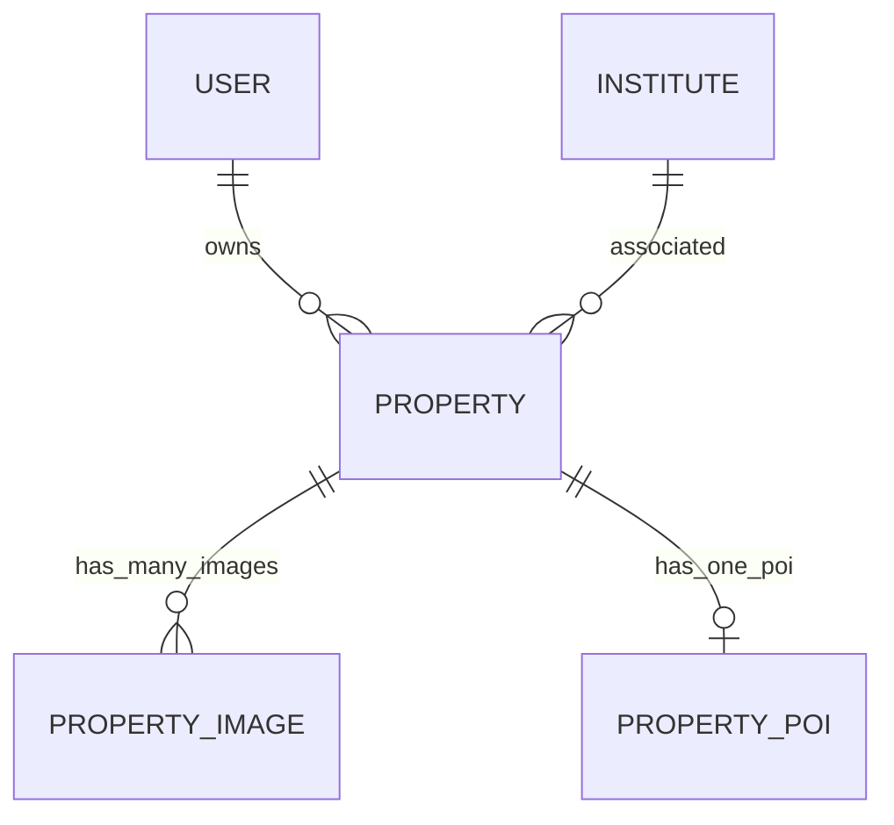

# Property CRUD Operations

<cite>
**Referenced Files in This Document**
- [properties.py](file://backend/app/api/v1/routes/properties.py)
- [property_service.py](file://backend/app/services/property_service.py)
- [property.py](file://backend/app/models/property.py)
- [poi.py](file://backend/app/models/poi.py)
- [poi_service.py](file://backend/app/services/poi_service.py)
- [embedding_tasks.py](file://backend/app/tasks/embedding_tasks.py)
- [property_image.py](file://backend/app/models/property_image.py)
- [session.py](file://backend/app/db/session.py)
- [deps.py](file://backend/app/api/deps.py)
- [test_properties.py](file://backend/tests/test_properties.py)
- [test_poi_generation.py](file://backend/tests/test_poi_generation.py)
</cite>

## Table of Contents
1. [Introduction](#introduction)
2. [Project Structure](#project-structure)
3. [Core Components](#core-components)
4. [Architecture Overview](#architecture-overview)
5. [Detailed Component Analysis](#detailed-component-analysis)
6. [Dependency Analysis](#dependency-analysis)
7. [Performance Considerations](#performance-considerations)
8. [Troubleshooting Guide](#troubleshooting-guide)
9. [Conclusion](#conclusion)

## Introduction
This document explains the Property CRUD operations implemented in the backend, focusing on:
- Create: property creation with automatic POI generation and embedding task dispatching
- Get: property retrieval with POI data preloading and relationship handling
- List: listing with filtering by district and status, pagination support, and ordering
- Update: partial updates with validation rules and automatic POI refresh
- Delete: deletion with referential integrity checks and cascade behavior

It also includes practical usage examples, error handling patterns, and transaction management notes.

## Project Structure
The Property feature spans API routes, service layer, models, schemas, tasks, and tests:
- API route handlers for create, get, list, update, delete, and search
- Service layer encapsulating business logic (create/get/list/update/delete/search)
- SQLAlchemy models defining properties, images, and POIs
- Schemas for request/response validation
- Background tasks for embeddings
- Tests validating core behaviors

**Diagram sources**
- [properties.py:1-162](file://backend/app/api/v1/routes/properties.py#L1-L162)
- [property_service.py:1-239](file://backend/app/services/property_service.py#L1-L239)
- [property.py:1-86](file://backend/app/models/property.py#L1-L86)
- [property_image.py:1-23](file://backend/app/models/property_image.py#L1-L23)
- [poi.py:1-28](file://backend/app/models/poi.py#L1-L28)
- [poi_service.py:1-311](file://backend/app/services/poi_service.py#L1-L311)
- [embedding_tasks.py:1-112](file://backend/app/tasks/embedding_tasks.py#L1-L112)
- [session.py:1-14](file://backend/app/db/session.py#L1-L14)
- [deps.py:1-58](file://backend/app/api/deps.py#L1-L58)

**Section sources**
- [properties.py:1-162](file://backend/app/api/v1/routes/properties.py#L1-L162)
- [property_service.py:1-239](file://backend/app/services/property_service.py#L1-L239)
- [property.py:1-86](file://backend/app/models/property.py#L1-L86)
- [property_image.py:1-23](file://backend/app/models/property_image.py#L1-L23)
- [poi.py:1-28](file://backend/app/models/poi.py#L1-L28)
- [poi_service.py:1-311](file://backend/app/services/poi_service.py#L1-L311)
- [embedding_tasks.py:1-112](file://backend/app/tasks/embedding_tasks.py#L1-L112)
- [session.py:1-14](file://backend/app/db/session.py#L1-L14)
- [deps.py:1-58](file://backend/app/api/deps.py#L1-L58)

## Core Components
- API Route Handlers: FastAPI endpoints for CRUD and search
- PropertyService: Business logic for create/get/list/update/delete/search
- Models: Property, PropertyImage, PropertyPOI with relationships and constraints
- Schemas: Pydantic models for input/output validation
- Tasks: Celery background job to generate vector embeddings
- Dependencies: DB session provider and auth middleware

Key responsibilities:
- Validate inputs via Pydantic schemas
- Enforce ownership and role-based access control
- Persist entities using async SQLAlchemy sessions
- Generate POI content and schedule embedding jobs asynchronously
- Provide filtered, paginated listings

**Section sources**
- [properties.py:1-162](file://backend/app/api/v1/routes/properties.py#L1-L162)
- [property_service.py:1-239](file://backend/app/services/property_service.py#L1-L239)
- [property.py:1-86](file://backend/app/models/property.py#L1-L86)
- [property_image.py:1-23](file://backend/app/models/property_image.py#L1-L23)
- [poi.py:1-28](file://backend/app/models/poi.py#L1-L28)
- [poi_service.py:1-311](file://backend/app/services/poi_service.py#L1-L311)
- [embedding_tasks.py:1-112](file://backend/app/tasks/embedding_tasks.py#L1-L112)
- [deps.py:1-58](file://backend/app/api/deps.py#L1-L58)

## Architecture Overview
The Property CRUD flow integrates API routing, service logic, ORM persistence, POI generation, and asynchronous embedding tasks.

**Diagram sources**
- [properties.py:16-33](file://backend/app/api/v1/routes/properties.py#L16-L33)
- [property_service.py:48-60](file://backend/app/services/property_service.py#L48-L60)
- [poi_service.py:123-151](file://backend/app/services/poi_service.py#L123-L151)
- [embedding_tasks.py:16-80](file://backend/app/tasks/embedding_tasks.py#L16-L80)

## Detailed Component Analysis

### Create Property
- Endpoint: POST /api/v1/properties
- Authorization: Requires landlord or admin; landlords can only create for themselves unless admin
- Input validation: Pydantic schema enforces field constraints (e.g., non-negative price, valid enums)
- Landlord existence check: Ensures landlord_id references an existing user
- Persistence: Adds Property to session, commits, and refreshes
- Side effects:
  - Automatic POI generation via POIService (upsert if exists)
  - Asynchronous embedding task dispatched in a daemon thread
- Response: Returns created PropertyRead

Practical example:
- Register/login to obtain token
- POST with title, address, district, price_monthly, and landlord_id
- Expect 201 Created with returned property details

Error handling:
- 401 Unauthorized if missing/invalid token
- 403 Forbidden if not landlord/admin or creating for another landlord
- 422 Unprocessable Entity if landlord_id does not exist
- 5xx if external services fail (POI/embedding), but operation still succeeds at API level

Transaction management:
- Single commit after adding the property
- POI upsert within same session before commit
- Embedding task is offloaded and does not affect the current transaction

**Section sources**
- [properties.py:16-33](file://backend/app/api/v1/routes/properties.py#L16-L33)
- [property_service.py:48-60](file://backend/app/services/property_service.py#L48-L60)
- [poi_service.py:123-151](file://backend/app/services/poi_service.py#L123-L151)
- [embedding_tasks.py:16-80](file://backend/app/tasks/embedding_tasks.py#L16-L80)
- [test_properties.py:22-30](file://backend/tests/test_properties.py#L22-L30)
- [test_properties.py:52-64](file://backend/tests/test_properties.py#L52-L64)

### Get Property
- Endpoint: GET /api/v1/properties/{property_id}
- Behavior:
  - Loads Property by id
  - Preloads associated POI (PropertyPOI) into the object
  - Relationship loading: images are configured with selectin eager loading
- Response: Returns PropertyRead including images and derived fields like primary image URL

Practical example:
- GET /api/v1/properties/123
- Expect 200 OK with full property details and POI if available

Error handling:
- 404 Not Found if property does not exist

Transaction management:
- Read-only operation; no explicit commit needed

**Section sources**
- [properties.py:110-118](file://backend/app/api/v1/routes/properties.py#L110-L118)
- [property_service.py:62-73](file://backend/app/services/property_service.py#L62-L73)
- [property.py:84-86](file://backend/app/models/property.py#L84-L86)
- [poi.py:12-28](file://backend/app/models/poi.py#L12-L28)

### List Properties
- Endpoint: GET /api/v1/properties
- Query parameters:
  - skip: offset for pagination (default 0)
  - limit: page size (default 20, max 100)
  - district: filter by district string
  - status: alias "status", filter by property status enum value
- Ordering: Descending by created_at
- Response: Array of PropertyRead objects

Practical example:
- GET /api/v1/properties?district=工业园区&status=available&skip=0&limit=20
- Expect 200 OK with filtered and ordered results

Error handling:
- No specific errors expected beyond standard HTTP codes

Transaction management:
- Read-only query; no commit required

**Section sources**
- [properties.py:94-107](file://backend/app/api/v1/routes/properties.py#L94-L107)
- [property_service.py:75-89](file://backend/app/services/property_service.py#L75-L89)
- [property.py:45-46](file://backend/app/models/property.py#L45-L46)

### Update Property
- Endpoint: PATCH /api/v1/properties/{property_id}
- Authorization: Requires landlord or admin; landlords can only update their own properties unless admin
- Partial updates: Only provided fields are applied (exclude_unset semantics)
- Validation: Pydantic schema validates each optional field when present
- Side effects:
  - Automatic POI refresh (force=True) to regenerate summary/categories
  - Asynchronous embedding task dispatched
- Response: Returns updated PropertyRead

Practical example:
- PATCH /api/v1/properties/123 with { "title": "Updated Title", "price_monthly": 5500 }
- Expect 200 OK with updated property

Error handling:
- 404 Not Found if property does not exist
- 403 Forbidden if unauthorized to update
- 422 Unprocessable Entity if validation fails

Transaction management:
- Commits changes and refreshes object
- POI refresh occurs within the same session before commit

**Section sources**
- [properties.py:121-141](file://backend/app/api/v1/routes/properties.py#L121-L141)
- [property_service.py:197-214](file://backend/app/services/property_service.py#L197-L214)
- [poi_service.py:123-151](file://backend/app/services/poi_service.py#L123-L151)
- [embedding_tasks.py:16-80](file://backend/app/tasks/embedding_tasks.py#L16-L80)

### Delete Property
- Endpoint: DELETE /api/v1/properties/{property_id}
- Authorization: Requires landlord or admin; landlords can only delete their own properties unless admin
- Referential integrity:
  - Foreign keys with ondelete="CASCADE" ensure related records are removed automatically:
    - PropertyPOI (unique foreign key to properties.id)
    - PropertyImage (foreign key to properties.id)
- Behavior: Deletes the property record; related records are cascaded by database constraints
- Response: 204 No Content on success

Practical example:
- DELETE /api/v1/properties/123
- Expect 204 No Content if successful

Error handling:
- 404 Not Found if property does not exist
- 403 Forbidden if unauthorized to delete

Transaction management:
- Deletes entity and commits; cascade handled by DB constraints

**Section sources**
- [properties.py:144-162](file://backend/app/api/v1/routes/properties.py#L144-L162)
- [property_service.py:216-223](file://backend/app/services/property_service.py#L216-L223)
- [poi.py:18-20](file://backend/app/models/poi.py#L18-L20)
- [property_image.py:12-14](file://backend/app/models/property_image.py#L12-L14)

### Search Properties (Bonus)
- Endpoint: GET /api/v1/properties/search
- Filters: natural language query, district, price range, bedrooms, property_type
- Pagination: limit parameter
- Vector similarity: When query is provided, uses pgvector l2_distance to rank results
- Caching: Non-vector searches cached in Redis with TTL
- Response: Array of PropertySearchResult including similarity scores and images

Practical example:
- GET /api/v1/properties/search?q=cozy+apartment+near+subway&district=工业园区&price_max=6000&limit=10
- Expect 200 OK with ranked results

**Section sources**
- [properties.py:36-91](file://backend/app/api/v1/routes/properties.py#L36-L91)
- [property_service.py:91-195](file://backend/app/services/property_service.py#L91-L195)

## Dependency Analysis
Relationships and constraints:
- Property has many PropertyImages with cascade delete-orphan
- PropertyPOI has unique foreign key to Property with cascade delete
- Property has foreign key to User (landlord) with cascade delete
- Property has optional foreign key to Institute with SET NULL on delete
- Indexes: district, status, and composite index for performance

**Diagram sources**
- [property.py:49-86](file://backend/app/models/property.py#L49-L86)
- [property_image.py:12-23](file://backend/app/models/property_image.py#L12-L23)
- [poi.py:18-28](file://backend/app/models/poi.py#L18-L28)

**Section sources**
- [property.py:49-86](file://backend/app/models/property.py#L49-L86)
- [property_image.py:12-23](file://backend/app/models/property_image.py#L12-L23)
- [poi.py:18-28](file://backend/app/models/poi.py#L18-L28)

## Performance Considerations
- Indexing: district and status columns indexed; composite index improves filtered queries
- Eager loading: images loaded with selectin to avoid N+1 queries
- Caching: Non-vector search results cached in Redis with deterministic keys and TTL
- Async I/O: Database operations use async SQLAlchemy sessions
- Offloading: Embedding generation runs in background Celery tasks to avoid blocking requests

[No sources needed since this section provides general guidance]

## Troubleshooting Guide
Common issues and resolutions:
- 401 Unauthorized: Ensure Bearer token is included and valid
- 403 Forbidden: Verify user role is landlord/admin and that you operate on your own properties
- 422 Unprocessable Entity: Check landlord_id exists and payload conforms to schema constraints
- 404 Not Found: Confirm property_id exists before update/delete
- POI generation failures: Logged warnings; fallback to mock/deterministic content; does not block API response
- Embedding task failures: Tracked in EmbeddingJob with retries; check logs and job status

Operational tips:
- Use search endpoint filters to reduce payload sizes
- Monitor Redis availability for caching; graceful degradation occurs if unavailable
- Inspect Celery worker logs for embedding job progress and errors

**Section sources**
- [deps.py:19-39](file://backend/app/api/deps.py#L19-L39)
- [property_service.py:54-60](file://backend/app/services/property_service.py#L54-L60)
- [embedding_tasks.py:40-76](file://backend/app/tasks/embedding_tasks.py#L40-L76)
- [test_properties.py:67-78](file://backend/tests/test_properties.py#L67-L78)

## Conclusion
The Property CRUD implementation follows a clean separation of concerns:
- API routes handle authorization and orchestration
- Service layer encapsulates business logic and side effects
- Models define robust relationships and constraints
- Background tasks ensure long-running operations do not block requests
- Comprehensive validation and error handling provide predictable client experiences

Adhering to these patterns ensures maintainability, scalability, and reliability across property management workflows.