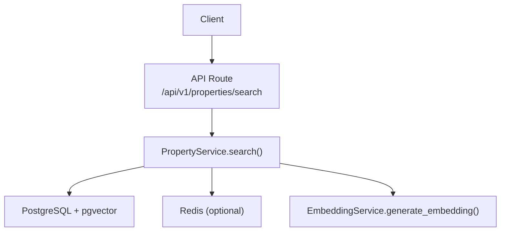
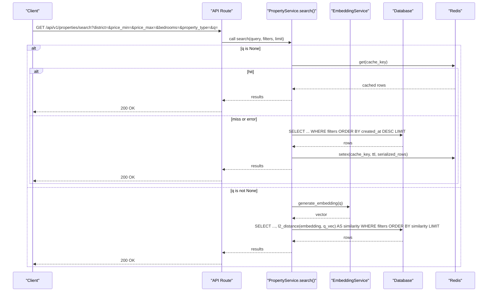
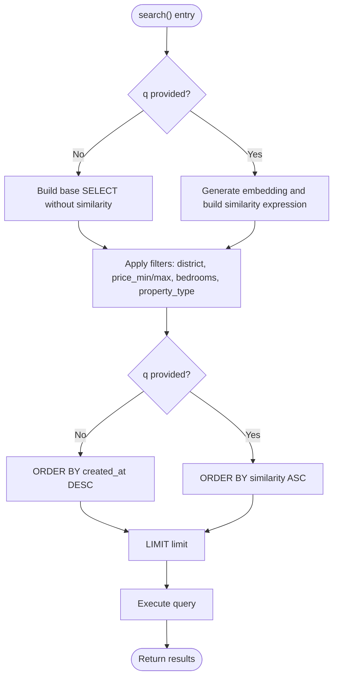
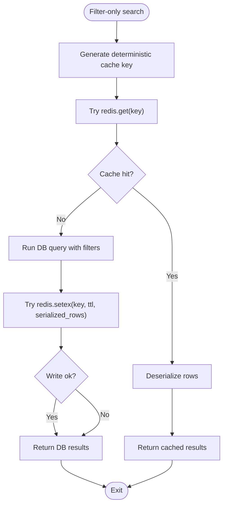
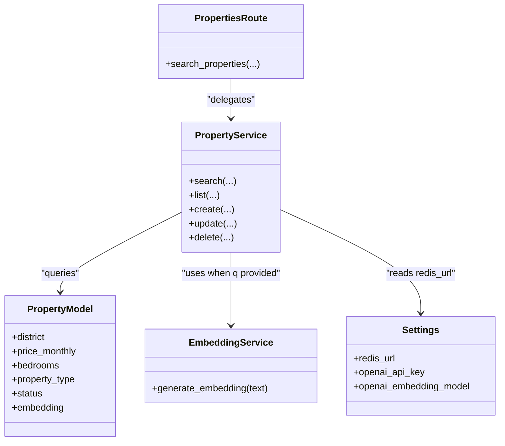

# Filtering System

<cite>
**Referenced Files in This Document**
- [properties.py](file://backend/app/api/v1/routes/properties.py)
- [property_service.py](file://backend/app/services/property_service.py)
- [property.py](file://backend/app/models/property.py)
- [property.py (schemas)](file://backend/app/schemas/property.py)
- [embedding_service.py](file://backend/app/services/embedding_service.py)
- [config.py](file://backend/app/core/config.py)
- [indexes.py](file://backend/app/db/indexes.py)
- [test_search.py](file://backend/tests/test_search.py)
</cite>

## Table of Contents
1. [Introduction](#introduction)
2. [Project Structure](#project-structure)
3. [Core Components](#core-components)
4. [Architecture Overview](#architecture-overview)
5. [Detailed Component Analysis](#detailed-component-analysis)
6. [Dependency Analysis](#dependency-analysis)
7. [Performance Considerations](#performance-considerations)
8. [Troubleshooting Guide](#troubleshooting-guide)
9. [Conclusion](#conclusion)

## Introduction
This document explains the property filtering system used by the search endpoint. It covers:
- All available filter parameters and their validation rules
- How filters are applied to both semantic (vector) and non-semantic (keyword-free) searches
- SQL WHERE clause generation and parameter precedence
- Redis caching for filter-only searches, including cache key generation, TTL, and invalidation behavior
- Examples of complex filter combinations, performance optimization techniques, and error handling when Redis is unavailable
- Default values and boundary conditions for numeric ranges

## Project Structure
The filtering logic spans the API route, service layer, data model, and optional Redis cache:
- API route defines query parameters and delegates to the service
- Service builds SQLAlchemy queries with optional vector similarity and applies filters
- Model defines fields, constraints, and indexes
- Embedding service provides vector embeddings for semantic search
- Configuration supplies Redis URL and OpenAI settings
- Tests validate filter behaviors

**Diagram sources**
- [properties.py:36-91](file://backend/app/api/v1/routes/properties.py#L36-L91)
- [property_service.py:91-195](file://backend/app/services/property_service.py#L91-L195)
- [embedding_service.py:17-28](file://backend/app/services/embedding_service.py#L17-L28)
- [config.py:24](file://backend/app/core/config.py#L24)

**Section sources**
- [properties.py:36-91](file://backend/app/api/v1/routes/properties.py#L36-L91)
- [property_service.py:91-195](file://backend/app/services/property_service.py#L91-L195)

## Core Components
- API route parameters:
  - q: natural language query (optional)
  - district: string filter
  - price_min, price_max: Decimal range (validated >= 0)
  - bedrooms: integer (validated >= 0)
  - property_type: enum value
  - limit: pagination cap (1..100)
- Service search method:
  - If q is provided: uses vector similarity ordering; still applies filters
  - If q is absent: pure filter search with deterministic ordering by created_at desc
  - Applies filters via SQLAlchemy where clauses
  - Caches non-vector results in Redis with a deterministic key and TTL
- Data model:
  - Fields include district, price_monthly, bedrooms, property_type, status, embedding
  - Constraints enforce non-negative prices and bedrooms, positive area if present
  - Indexes on district and status support common filter patterns
- Embedding service:
  - Generates embeddings using configured OpenAI model for semantic search
- Configuration:
  - Redis URL from environment
  - OpenAI keys and model names

**Section sources**
- [properties.py:36-91](file://backend/app/api/v1/routes/properties.py#L36-L91)
- [property_service.py:91-195](file://backend/app/services/property_service.py#L91-L195)
- [property.py:38-86](file://backend/app/models/property.py#L38-L86)
- [embedding_service.py:17-28](file://backend/app/services/embedding_service.py#L17-L28)
- [config.py:24](file://backend/app/core/config.py#L24)

## Architecture Overview
The search flow supports two modes:
- Semantic search (q provided): compute embedding, order by similarity, apply filters, return results
- Filter-only search (q absent): build filtered query, optionally use Redis cache, return results

**Diagram sources**
- [properties.py:36-91](file://backend/app/api/v1/routes/properties.py#L36-L91)
- [property_service.py:91-195](file://backend/app/services/property_service.py#L91-L195)
- [embedding_service.py:17-28](file://backend/app/services/embedding_service.py#L17-L28)

## Detailed Component Analysis

### API Parameters and Validation
- Query parameters:
  - q: optional string for semantic search
  - district: optional string
  - price_min, price_max: optional Decimals validated >= 0
  - bedrooms: optional int validated >= 0
  - property_type: optional enum value
  - limit: int between 1 and 100
- Behavior:
  - When q is absent, filters are applied to a deterministic list ordered by created_at desc
  - When q is present, filters are combined with vector similarity ordering

**Section sources**
- [properties.py:36-91](file://backend/app/api/v1/routes/properties.py#L36-L91)

### Filter Application and SQL Generation
- Filters are added conditionally to the SQLAlchemy select statement:
  - district: equality
  - price_min: greater-than-or-equal
  - price_max: less-than-or-equal
  - bedrooms: exact match
  - property_type: equality
- Ordering:
  - With q: order by similarity (l2_distance)
  - Without q: order by created_at desc
- Limiting:
  - Always capped by limit parameter

**Diagram sources**
- [property_service.py:134-168](file://backend/app/services/property_service.py#L134-L168)

**Section sources**
- [property_service.py:134-168](file://backend/app/services/property_service.py#L134-L168)
- [property.py:38-86](file://backend/app/models/property.py#L38-L86)

### Redis Caching for Filter-Only Searches
- Scope:
  - Only when q is absent (filter-only mode)
- Key generation:
  - Deterministic JSON serialization of filter parameters and limit, prefixed with "search:filter:"
- TTL:
  - Fixed TTL of 300 seconds
- Read path:
  - Attempt to retrieve from Redis; on success, deserialize and return immediately
- Write path:
  - After executing DB query, serialize results and store with TTL
- Error handling:
  - On any Redis error (read/write), logging occurs and execution continues without cache
- Invalidation:
  - No explicit invalidation strategy is implemented; entries expire after TTL

**Diagram sources**
- [property_service.py:102-133](file://backend/app/services/property_service.py#L102-L133)
- [property_service.py:170-194](file://backend/app/services/property_service.py#L170-L194)
- [property_service.py:25-28](file://backend/app/services/property_service.py#L25-L28)
- [config.py:24](file://backend/app/core/config.py#L24)

**Section sources**
- [property_service.py:102-133](file://backend/app/services/property_service.py#L102-L133)
- [property_service.py:170-194](file://backend/app/services/property_service.py#L170-L194)
- [property_service.py:25-28](file://backend/app/services/property_service.py#L25-L28)
- [config.py:24](file://backend/app/core/config.py#L24)

### Data Model and Constraints
- Fields relevant to filtering:
  - district (string, indexed)
  - price_monthly (Decimal, non-negative constraint)
  - bedrooms (int, non-negative constraint)
  - property_type (enum)
  - status (enum, indexed)
  - embedding (vector for semantic search)
- Indexes:
  - Composite index on district and status supports common filter patterns
- Defaults:
  - property_type defaults to apartment
  - status defaults to available

**Section sources**
- [property.py:38-86](file://backend/app/models/property.py#L38-L86)
- [indexes.py:16-48](file://backend/app/db/indexes.py#L16-L48)

### Schema Definitions
- Search result schema includes similarity field for semantic results
- Property read schema includes images and computed primary image URL

**Section sources**
- [property.py (schemas):64-79](file://backend/app/schemas/property.py#L64-L79)
- [property.py (schemas):46-61](file://backend/app/schemas/property.py#L46-L61)

### Semantic vs Non-Semantic Search
- Semantic search:
  - Requires q; generates embedding via OpenAI; orders by similarity
  - Filters still apply before ordering
- Non-semantic search:
  - No q; deterministic ordering by created_at desc
  - Uses Redis cache for repeated identical filter sets

**Section sources**
- [property_service.py:134-168](file://backend/app/services/property_service.py#L134-L168)
- [embedding_service.py:17-28](file://backend/app/services/embedding_service.py#L17-L28)

## Dependency Analysis
- API route depends on PropertyService and Pydantic schemas
- PropertyService depends on:
  - SQLAlchemy session for queries
  - Optional Redis client for caching
  - Optional EmbeddingService for semantic search
- EmbeddingService depends on OpenAI client configured via Settings
- Configuration centralizes Redis URL and OpenAI settings

**Diagram sources**
- [properties.py:36-91](file://backend/app/api/v1/routes/properties.py#L36-L91)
- [property_service.py:91-195](file://backend/app/services/property_service.py#L91-L195)
- [embedding_service.py:17-28](file://backend/app/services/embedding_service.py#L17-L28)
- [config.py:24](file://backend/app/core/config.py#L24)
- [property.py:38-86](file://backend/app/models/property.py#L38-L86)

**Section sources**
- [properties.py:36-91](file://backend/app/api/v1/routes/properties.py#L36-L91)
- [property_service.py:91-195](file://backend/app/services/property_service.py#L91-L195)
- [embedding_service.py:17-28](file://backend/app/services/embedding_service.py#L17-L28)
- [config.py:24](file://backend/app/core/config.py#L24)
- [property.py:38-86](file://backend/app/models/property.py#L38-L86)

## Performance Considerations
- Index usage:
  - district and status composite index improves filter-only queries
  - IVFFlat index on embedding vectors is created automatically when row count exceeds threshold
- Query design:
  - Filters are applied before ordering and limiting to reduce result set size
- Caching:
  - Filter-only searches benefit from Redis cache with deterministic keys and TTL
- Limits:
  - limit parameter caps results to prevent large payloads

[No sources needed since this section provides general guidance]

## Troubleshooting Guide
- Redis unavailable:
  - The service logs a debug message and proceeds without cache; no errors returned to clients
- Invalid parameters:
  - FastAPI validates types and ranges; invalid inputs return HTTP 422
- Empty results:
  - Valid when filters exclude all properties; tests assert empty lists for restrictive ranges
- Debugging:
  - Use EXPLAIN ANALYZE utilities to inspect query plans for slow filter combinations

**Section sources**
- [property_service.py:31-41](file://backend/app/services/property_service.py#L31-L41)
- [test_search.py:42-77](file://backend/tests/test_search.py#L42-L77)
- [indexes.py:91-117](file://backend/app/db/indexes.py#L91-L117)

## Conclusion
The filtering system provides robust, composable filters for district, price range, bedrooms, and property type. It supports both semantic and non-semantic search, with deterministic ordering and efficient caching for filter-only queries. Parameter validation ensures safe inputs, while graceful degradation handles Redis unavailability. Proper indexing and query construction optimize performance across common use cases.