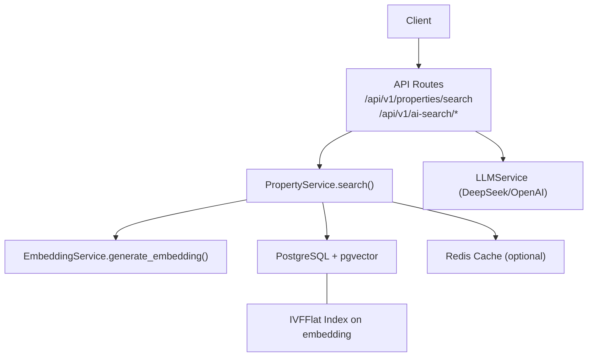
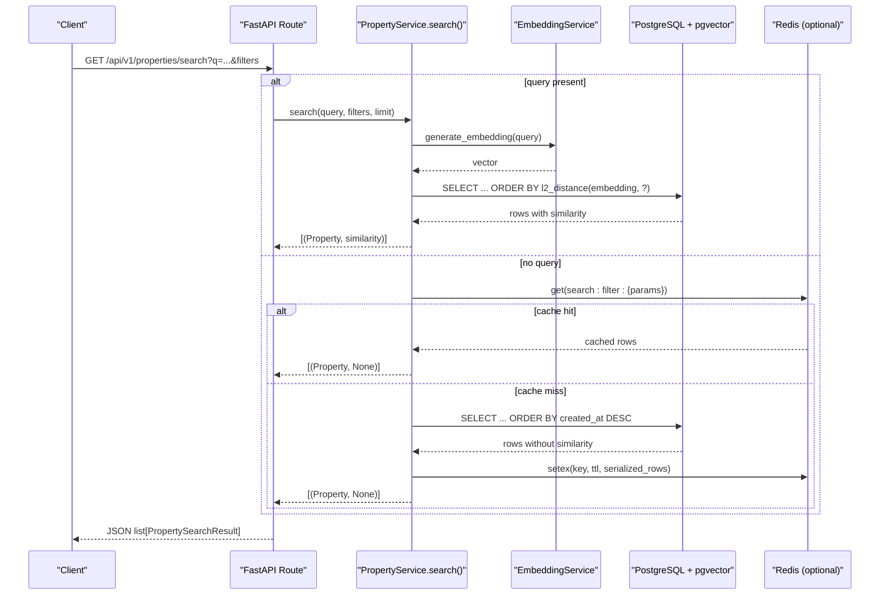
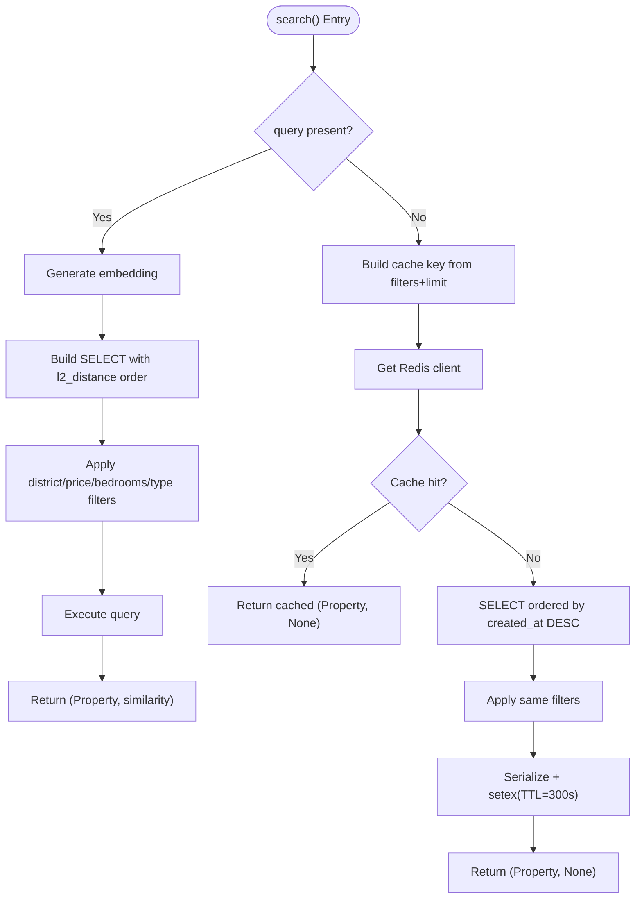
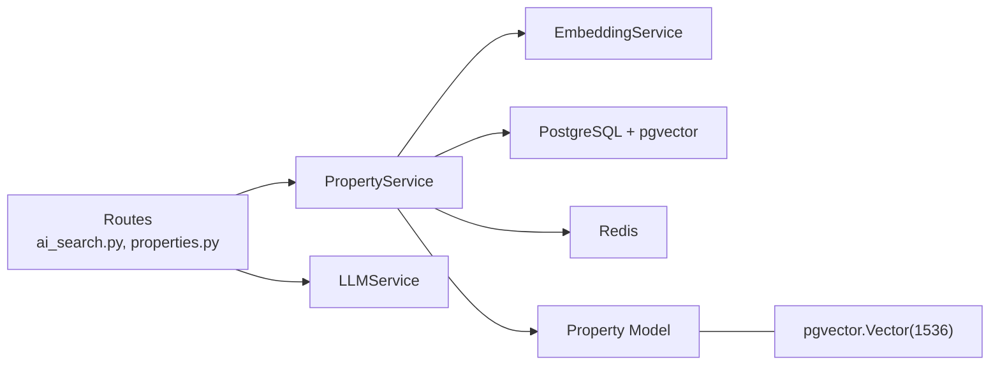
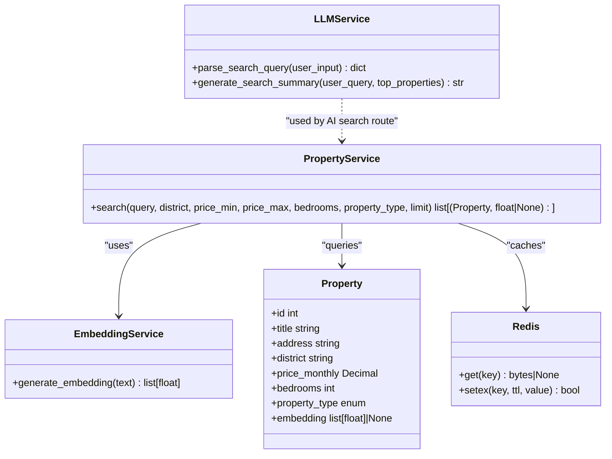

# Property Search & Filtering

<cite>
**Referenced Files in This Document**
- [ai_search.py](file://backend/app/api/v1/routes/ai_search.py)
- [property_service.py](file://backend/app/services/property_service.py)
- [embedding_service.py](file://backend/app/services/embedding_service.py)
- [llm_service.py](file://backend/app/services/llm_service.py)
- [property.py](file://backend/app/models/property.py)
- [property_routes.py](file://backend/app/api/v1/routes/properties.py)
- [ai_search_schemas.py](file://backend/app/schemas/ai_search.py)
- [property_schemas.py](file://backend/app/schemas/property.py)
- [indexes.py](file://backend/app/db/indexes.py)
- [pgvector_migration.py](file://backend/alembic/versions/20260620_0002_pgvector_embedding.py)
- [enable_vector.sql](file://docker/pg-init/00-enable-vector.sql)
- [config.py](file://backend/app/core/config.py)
- [test_search.py](file://backend/tests/test_search.py)
- [test_pgvector.py](file://backend/tests/test_pgvector.py)
</cite>

## Table of Contents
1. [Introduction](#introduction)
2. [Project Structure](#project-structure)
3. [Core Components](#core-components)
4. [Architecture Overview](#architecture-overview)
5. [Detailed Component Analysis](#detailed-component-analysis)
6. [Dependency Analysis](#dependency-analysis)
7. [Performance Considerations](#performance-considerations)
8. [Troubleshooting Guide](#troubleshooting-guide)
9. [Conclusion](#conclusion)
10. [Appendices](#appendices)

## Introduction
This document explains the property search functionality with a focus on:
- Keyword-based semantic search using OpenAI embeddings and pgvector similarity matching
- Advanced filtering by district, price range (min/max), bedrooms, and property type
- Hybrid search combining vector similarity with traditional filters
- Redis caching for non-vector searches, including cache key generation and TTL management
- Fallback mechanisms when Redis is unavailable
- Result ranking and similarity scoring behavior
- Examples of complex queries and performance optimization techniques

## Project Structure
The property search spans API routes, services, models, schemas, configuration, and tests:
- API layer exposes both structured search and AI-powered natural language search
- Service layer implements hybrid search logic, embedding generation, and Redis caching
- Model layer defines the Property entity with an embedding column backed by pgvector
- Schemas define request/response contracts
- Configuration centralizes external service settings (OpenAI, DeepSeek, Redis)
- Tests validate search behavior and pgvector integration

**Diagram sources**
- [property_routes.py:36-91](file://backend/app/api/v1/routes/properties.py#L36-L91)
- [ai_search.py:98-160](file://backend/app/api/v1/routes/ai_search.py#L98-L160)
- [property_service.py:91-195](file://backend/app/services/property_service.py#L91-L195)
- [embedding_service.py:17-32](file://backend/app/services/embedding_service.py#L17-L32)
- [indexes.py:16-40](file://backend/app/db/indexes.py#L16-L40)

**Section sources**
- [property_routes.py:36-91](file://backend/app/api/v1/routes/properties.py#L36-L91)
- [ai_search.py:98-160](file://backend/app/api/v1/routes/ai_search.py#L98-L160)
- [property_service.py:91-195](file://backend/app/services/property_service.py#L91-L195)
- [embedding_service.py:17-32](file://backend/app/services/embedding_service.py#L17-L32)
- [indexes.py:16-40](file://backend/app/db/indexes.py#L16-L40)

## Core Components
- PropertyService.search(): Implements hybrid search, optional Redis caching, and filter application. Returns tuples of (Property, similarity).
- EmbeddingService.generate_embedding(): Calls OpenAI to produce text embeddings used for vector similarity.
- LLMService: Provides natural language parsing and summary generation via DeepSeek or OpenAI fallback.
- Property model: Defines the embedding column using a custom TypeDecorator that maps to pgvector.Vector(1536) on PostgreSQL.
- API routes: Expose /api/v1/properties/search for structured/hybrid search and /api/v1/ai-search/* for natural language flows.
- Config: Centralizes Redis URL, OpenAI keys, and model names.

Key responsibilities:
- Build query with optional vector similarity ordering
- Apply deterministic filters (district, price_min, price_max, bedrooms, property_type)
- Cache non-vector results in Redis with deterministic keys and TTL
- Return similarity scores where applicable

**Section sources**
- [property_service.py:91-195](file://backend/app/services/property_service.py#L91-L195)
- [embedding_service.py:17-32](file://backend/app/services/embedding_service.py#L17-L32)
- [llm_service.py:64-209](file://backend/app/services/llm_service.py#L64-L209)
- [property.py:12-22](file://backend/app/models/property.py#L12-L22)
- [property_routes.py:36-91](file://backend/app/api/v1/routes/properties.py#L36-L91)
- [ai_search.py:98-160](file://backend/app/api/v1/routes/ai_search.py#L98-L160)
- [config.py:24-57](file://backend/app/core/config.py#L24-L57)

## Architecture Overview
The system supports two entry points:
- Structured search: GET /api/v1/properties/search with query parameters
- AI search: POST /api/v1/ai-search/parse and POST /api/v1/ai-search/search

**Diagram sources**
- [property_routes.py:36-91](file://backend/app/api/v1/routes/properties.py#L36-L91)
- [property_service.py:91-195](file://backend/app/services/property_service.py#L91-L195)
- [embedding_service.py:17-32](file://backend/app/services/embedding_service.py#L17-L32)

## Detailed Component Analysis

### PropertyService.search() — Hybrid Search and Caching
Behavior:
- If query is provided:
  - Generate embedding via EmbeddingService
  - Order by l2_distance(Property.embedding, query_vec)
  - Apply filters (district, price_min, price_max, bedrooms, property_type)
  - Return results with similarity scores
- If query is absent:
  - Attempt Redis cache lookup using deterministic key built from filters and limit
  - On cache hit, return cached results immediately
  - On cache miss, run SQL ordered by created_at DESC, apply filters, serialize results, write to Redis with TTL, then return
- Always applies filters regardless of query presence

Cache details:
- Key format: search:filter:<JSON of params sorted by keys>
- TTL: 300 seconds
- Serialization: converts Decimal fields to strings; excludes private attributes
- Graceful fallback: if Redis is unavailable or fails, proceed without caching

Ranking and similarity:
- With query: ranked by l2_distance (lower distance means higher similarity)
- Without query: ranked by newest first; similarity is null

**Diagram sources**
- [property_service.py:91-195](file://backend/app/services/property_service.py#L91-L195)

**Section sources**
- [property_service.py:91-195](file://backend/app/services/property_service.py#L91-L195)

### EmbeddingService — OpenAI Embeddings
Responsibilities:
- Initialize AsyncOpenAI client with configured model
- generate_embedding(text): returns a float array suitable for pgvector
- generate_property_embedding(property_data): builds descriptive text from title/description/address/district/type and calls generate_embedding

Integration:
- Used by PropertyService when query is present
- Requires OPENAI_API_KEY and OPENAI_EMBEDDING_MODEL in config

**Section sources**
- [embedding_service.py:17-32](file://backend/app/services/embedding_service.py#L17-L32)
- [config.py:46-57](file://backend/app/core/config.py#L46-L57)

### LLMService — Natural Language Parsing and Summary
Capabilities:
- parse_search_query(user_input): extracts structured parameters and completeness report using DeepSeek or OpenAI fallback
- generate_search_summary(user_query, top_properties): generates a friendly recommendation summary for top results

Fallback behavior:
- Prefers DeepSeek if configured; falls back to OpenAI if available
- Raises RuntimeError if neither provider is configured

Usage in AI search flow:
- ai_search route composes query parts (query + district + keywords) and calls PropertyService.search
- After retrieval, attempts to generate summary; gracefully degrades if LLM is unavailable

**Section sources**
- [llm_service.py:64-209](file://backend/app/services/llm_service.py#L64-L209)
- [ai_search.py:80-96](file://backend/app/api/v1/routes/ai_search.py#L80-L96)
- [ai_search.py:98-160](file://backend/app/api/v1/routes/ai_search.py#L98-L160)

### Property Model and pgvector Integration
Highlights:
- Custom VectorColumn maps to pgvector.Vector(1536) on PostgreSQL; otherwise uses Text for other dialects
- embedding field stores 1536-dim vectors
- Index migration creates IVFFlat index with vector_l2_ops and lists=100
- Docker init script enables vector extension

Database constraints and indexes:
- Check constraints ensure non-negative price and area, non-negative bedrooms/bathrooms
- Composite index on district and status
- IVFFlat index on embedding for approximate nearest neighbor search

**Section sources**
- [property.py:12-22](file://backend/app/models/property.py#L12-L22)
- [property.py:38-86](file://backend/app/models/property.py#L38-L86)
- [pgvector_migration.py:21-35](file://backend/alembic/versions/20260620_0002_pgvector_embedding.py#L21-L35)
- [enable_vector.sql:1-2](file://docker/pg-init/00-enable-vector.sql#L1-L2)
- [indexes.py:16-40](file://backend/app/db/indexes.py#L16-L40)

### API Endpoints

#### Structured/Hybrid Search
- Endpoint: GET /api/v1/properties/search
- Parameters: q (natural language), district, price_min, price_max, bedrooms, property_type, limit
- Behavior:
  - If q is provided, performs vector similarity search with filters
  - Otherwise, performs filtered search with Redis caching
- Response: list of PropertySearchResult with optional similarity

**Section sources**
- [property_routes.py:36-91](file://backend/app/api/v1/routes/properties.py#L36-L91)
- [property_schemas.py:64-79](file://backend/app/schemas/property.py#L64-L79)

#### AI Search
- Endpoints:
  - POST /api/v1/ai-search/parse: parses natural language into structured params and completeness report
  - POST /api/v1/ai-search/search: executes search and generates summary
- Request/Response schemas defined in ai_search_schemas

**Section sources**
- [ai_search.py:80-96](file://backend/app/api/v1/routes/ai_search.py#L80-L96)
- [ai_search.py:98-160](file://backend/app/api/v1/routes/ai_search.py#L98-L160)
- [ai_search_schemas.py:1-74](file://backend/app/schemas/ai_search.py#L1-L74)

## Dependency Analysis
High-level dependencies:
- API routes depend on PropertyService and LLMService
- PropertyService depends on EmbeddingService (when query present) and optionally Redis
- Models depend on pgvector types via custom decorator
- Configuration provides external service endpoints and credentials

**Diagram sources**
- [ai_search.py:98-160](file://backend/app/api/v1/routes/ai_search.py#L98-L160)
- [property_routes.py:36-91](file://backend/app/api/v1/routes/properties.py#L36-L91)
- [property_service.py:91-195](file://backend/app/services/property_service.py#L91-L195)
- [embedding_service.py:17-32](file://backend/app/services/embedding_service.py#L17-L32)
- [llm_service.py:64-209](file://backend/app/services/llm_service.py#L64-L209)
- [property.py:12-22](file://backend/app/models/property.py#L12-L22)

**Section sources**
- [ai_search.py:98-160](file://backend/app/api/v1/routes/ai_search.py#L98-L160)
- [property_routes.py:36-91](file://backend/app/api/v1/routes/properties.py#L36-L91)
- [property_service.py:91-195](file://backend/app/services/property_service.py#L91-L195)
- [embedding_service.py:17-32](file://backend/app/services/embedding_service.py#L17-L32)
- [llm_service.py:64-209](file://backend/app/services/llm_service.py#L64-L209)
- [property.py:12-22](file://backend/app/models/property.py#L12-L22)

## Performance Considerations
- Use IVFFlat index on embedding for large datasets; the migration sets lists=100 and the helper can adapt based on row count
- For small datasets (<1000 rows), exact scan may be preferred over IVFFlat
- Ensure pgvector extension is enabled at database startup
- Keep limit reasonable to reduce payload size and processing time
- Non-vector searches benefit from Redis caching with 300s TTL; tune TTL based on data volatility
- Avoid unnecessary joins; images are loaded separately in response mapping

**Section sources**
- [indexes.py:16-40](file://backend/app/db/indexes.py#L16-L40)
- [pgvector_migration.py:21-35](file://backend/alembic/versions/20260620_0002_pgvector_embedding.py#L21-L35)
- [enable_vector.sql:1-2](file://docker/pg-init/00-enable-vector.sql#L1-L2)
- [property_service.py:22-28](file://backend/app/services/property_service.py#L22-L28)

## Troubleshooting Guide
Common issues and resolutions:
- Redis unavailable:
  - The service logs a debug message and proceeds without caching; verify REDIS_URL and connectivity
- Missing LLM configuration:
  - LLMService raises RuntimeError if neither DeepSeek nor OpenAI keys are set; configure DEEPSEEK_API_KEY or OPENAI_API_KEY
- No embeddings found:
  - Vector search requires non-null embeddings; ensure embedding tasks have run and properties have embeddings populated
- pgvector not enabled:
  - Ensure CREATE EXTENSION IF NOT EXISTS vector has been executed; check docker/pg-init/00-enable-vector.sql and migrations
- Incorrect index usage:
  - For large tables, confirm IVFFlat index exists; use helper to create or re-create indexes

Operational checks:
- Health endpoint should remain unaffected by search failures
- Tests demonstrate public accessibility and basic filtering correctness

**Section sources**
- [property_service.py:31-41](file://backend/app/services/property_service.py#L31-L41)
- [llm_service.py:91-99](file://backend/app/services/llm_service.py#L91-L99)
- [enable_vector.sql:1-2](file://docker/pg-init/00-enable-vector.sql#L1-L2)
- [test_search.py:80-85](file://backend/tests/test_search.py#L80-L85)

## Conclusion
The property search system combines keyword-based semantic search with robust structured filtering. It leverages OpenAI embeddings and pgvector for similarity matching, while applying deterministic filters for precision. Redis caching accelerates non-vector searches with deterministic keys and TTL, and graceful fallbacks ensure reliability when external services are unavailable. Proper indexing and configuration enable scalable performance across varying dataset sizes.

## Appendices

### Example Queries
- Semantic search with filters:
  - GET /api/v1/properties/search?q=地铁附近两室&district=SIP&price_max=6000
- Pure filter search (cached):
  - GET /api/v1/properties/search?district=SIP&bedrooms=2&property_type=apartment
- Price range only:
  - GET /api/v1/properties/search?price_min=4000&price_max=6000

**Section sources**
- [test_search.py:30-38](file://backend/tests/test_search.py#L30-L38)
- [test_search.py:64-77](file://backend/tests/test_search.py#L64-L77)
- [test_search.py:110-117](file://backend/tests/test_search.py#L110-L117)
- [test_pgvector.py:47-58](file://backend/tests/test_pgvector.py#L47-L58)

### Data Flow Diagram (Code-Level)

**Diagram sources**
- [property_service.py:91-195](file://backend/app/services/property_service.py#L91-L195)
- [embedding_service.py:17-32](file://backend/app/services/embedding_service.py#L17-L32)
- [llm_service.py:64-209](file://backend/app/services/llm_service.py#L64-L209)
- [property.py:38-86](file://backend/app/models/property.py#L38-L86)