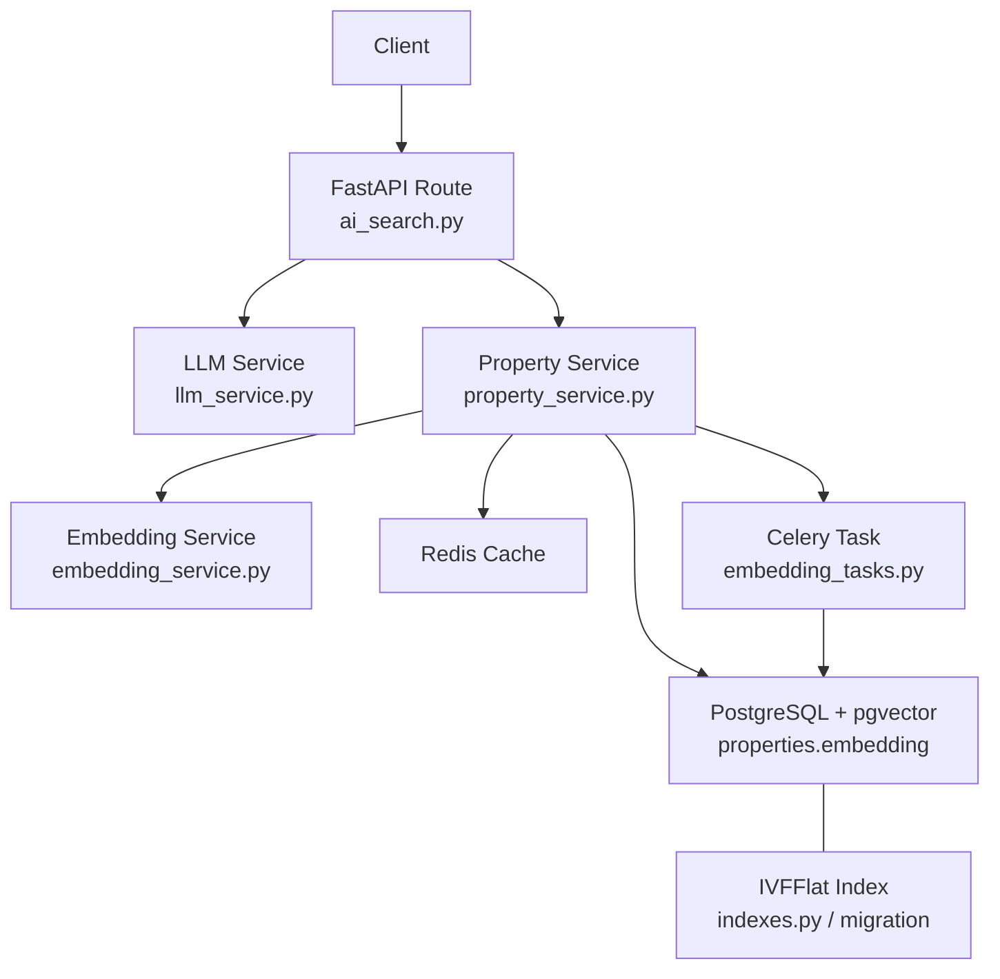
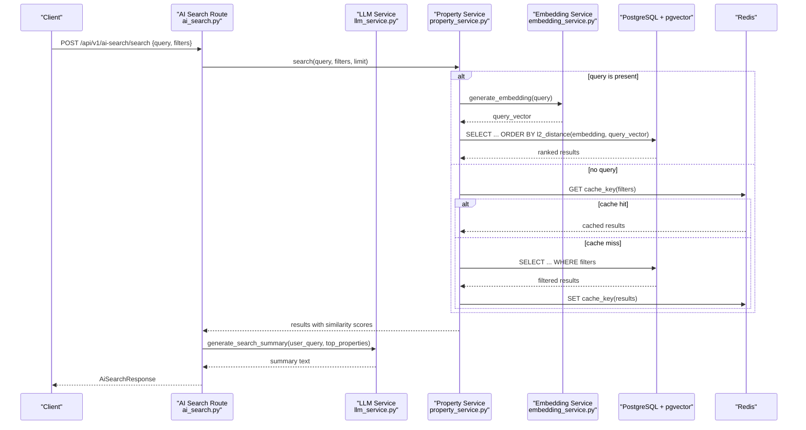
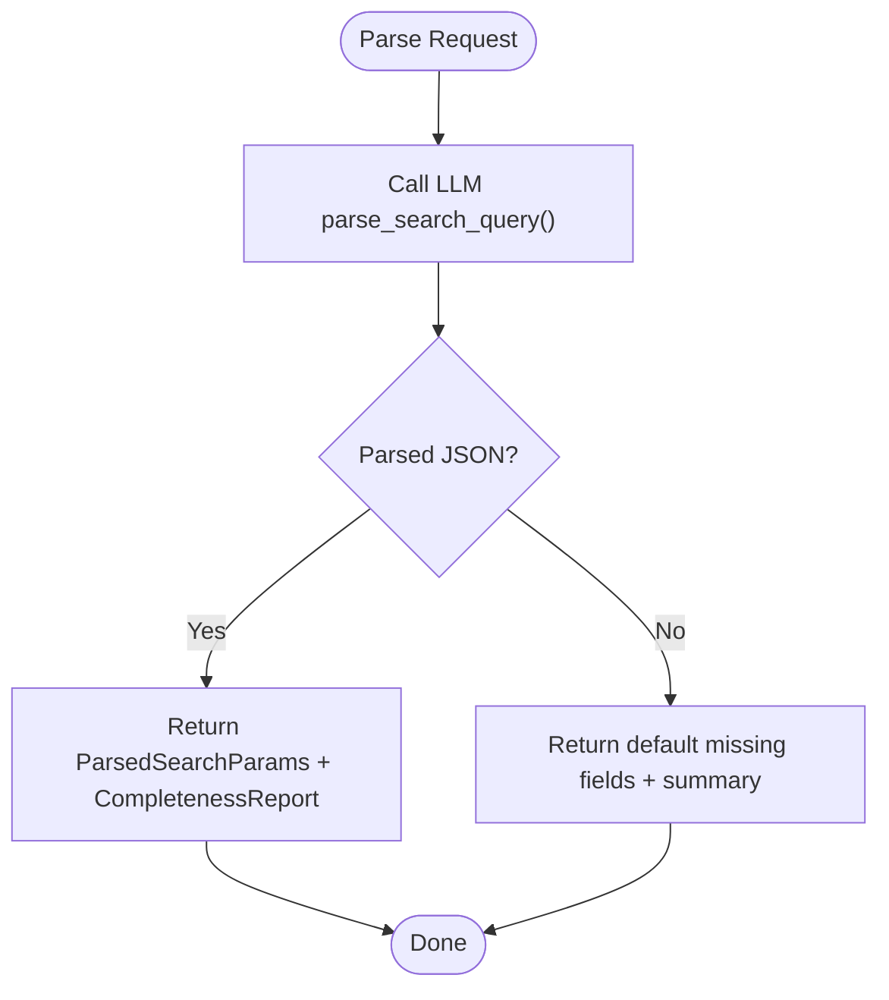
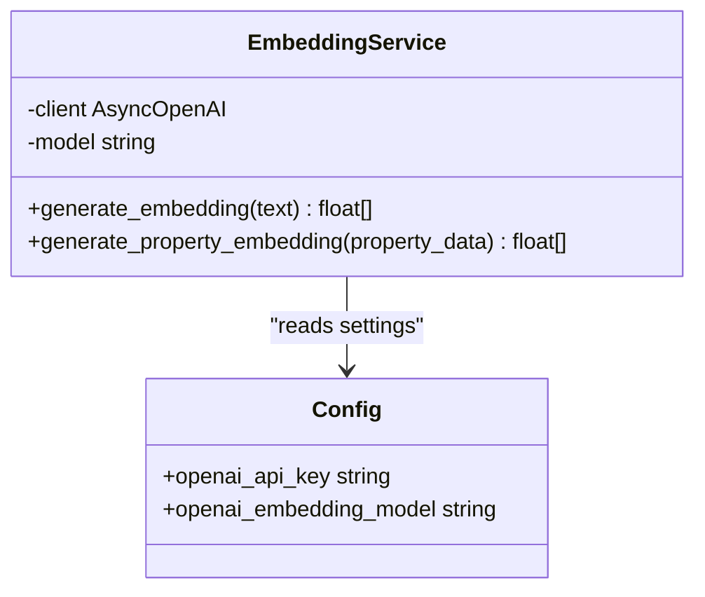
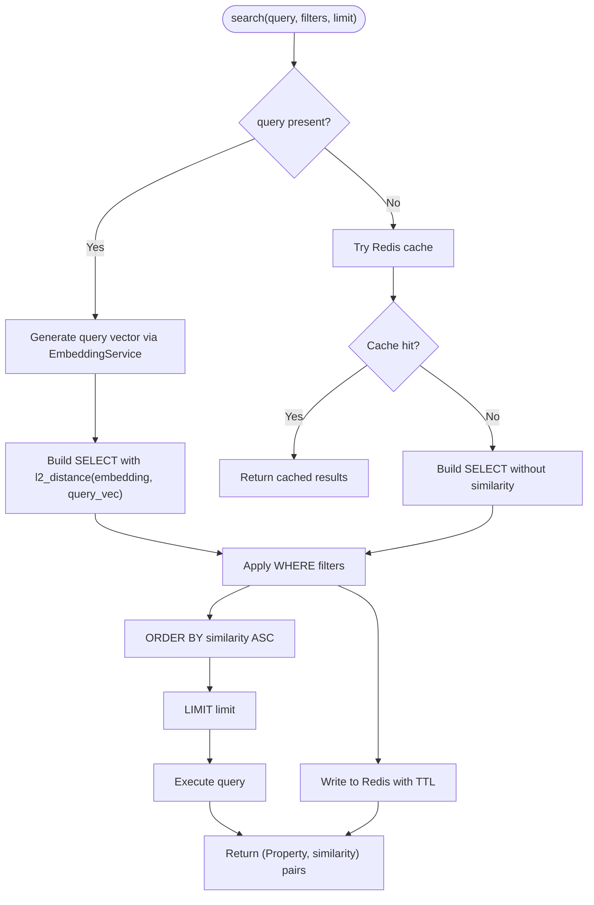
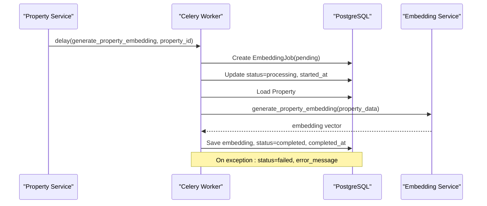
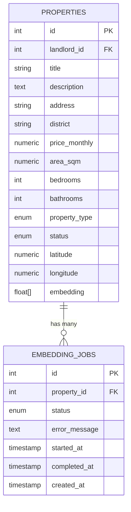
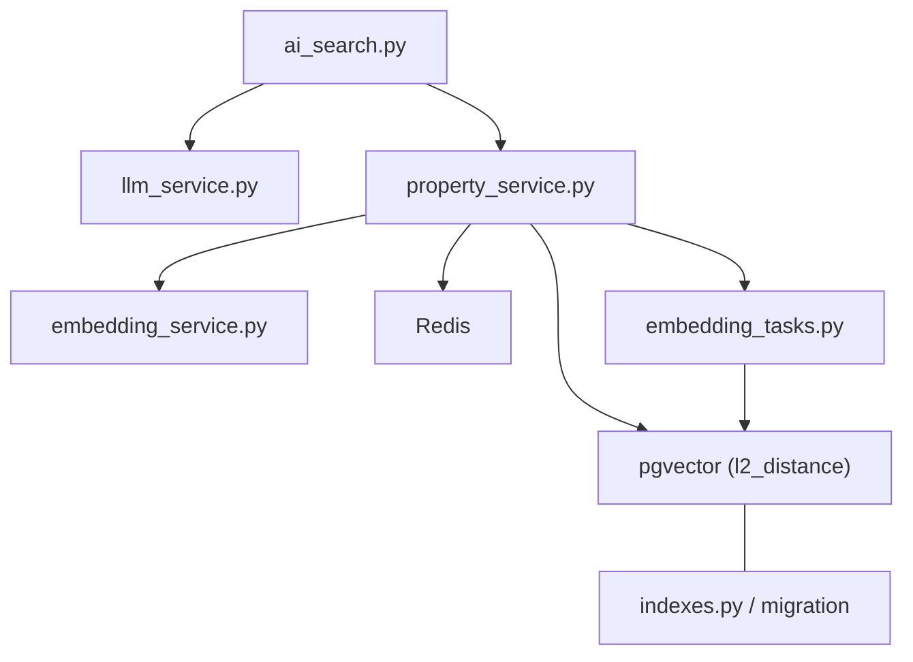

# Semantic Search

<cite>
**Referenced Files in This Document**
- [ai_search.py](file://backend/app/api/v1/routes/ai_search.py)
- [embedding_service.py](file://backend/app/services/embedding_service.py)
- [property_service.py](file://backend/app/services/property_service.py)
- [property.py](file://backend/app/models/property.py)
- [indexes.py](file://backend/app/db/indexes.py)
- [embedding_tasks.py](file://backend/app/tasks/embedding_tasks.py)
- [embedding_job.py](file://backend/app/models/embedding_job.py)
- [ai_search.py (schemas)](file://backend/app/schemas/ai_search.py)
- [llm_service.py](file://backend/app/services/llm_service.py)
- [config.py](file://backend/app/core/config.py)
- [00-enable-vector.sql](file://docker/pg-init/00-enable-vector.sql)
- [20260620_0002_pgvector_embedding.py](file://backend/alembic/versions/20260620_0002_pgvector_embedding.py)
- [20260620_0005_embedding_jobs_and_audit_logs.py](file://backend/alembic/versions/20260620_0005_embedding_jobs_and_audit_logs.py)
</cite>

## Table of Contents
1. Introduction
2. Project Structure
3. Core Components
4. Architecture Overview
5. Detailed Component Analysis
6. Dependency Analysis
7. Performance Considerations
8. Troubleshooting Guide
9. Conclusion

## Introduction
This document explains the semantic search functionality that converts natural language queries into vector embeddings using OpenAI’s embedding API and performs similarity matching against property embeddings stored in PostgreSQL with pgvector. It covers the end-to-end pipeline from text input to vector generation, database querying with WHERE clauses for filtering, result ranking by similarity scores, fallback mechanisms when embedding generation fails, query optimization techniques, and caching strategies for repeated searches.

## Project Structure
The semantic search feature spans API routes, services, models, tasks, and database configuration:
- API route exposes endpoints for parsing natural language and performing AI-assisted search.
- Embedding service calls OpenAI to generate embeddings for both user queries and property descriptions.
- Property service orchestrates search logic, including optional Redis caching and pgvector-based similarity queries.
- Models define the vector column type and job tracking for asynchronous embedding generation.
- Tasks perform background embedding generation and reindexing.
- Database indexes and migrations enable pgvector and IVFFlat indexing.

**Diagram sources**
- [ai_search.py:80-160](file://backend/app/api/v1/routes/ai_search.py#L80-L160)
- [llm_service.py:106-198](file://backend/app/services/llm_service.py#L106-L198)
- [property_service.py:91-195](file://backend/app/services/property_service.py#L91-L195)
- [embedding_service.py:17-32](file://backend/app/services/embedding_service.py#L17-L32)
- [property.py:12-22](file://backend/app/models/property.py#L12-L22)
- [indexes.py:16-48](file://backend/app/db/indexes.py#L16-L48)
- [embedding_tasks.py:16-80](file://backend/app/tasks/embedding_tasks.py#L16-L80)

**Section sources**
- [ai_search.py:80-160](file://backend/app/api/v1/routes/ai_search.py#L80-L160)
- [property_service.py:91-195](file://backend/app/services/property_service.py#L91-L195)
- [embedding_service.py:17-32](file://backend/app/services/embedding_service.py#L17-L32)
- [property.py:12-22](file://backend/app/models/property.py#L12-L22)
- [indexes.py:16-48](file://backend/app/db/indexes.py#L16-L48)
- [embedding_tasks.py:16-80](file://backend/app/tasks/embedding_tasks.py#L16-L80)

## Core Components
- Natural Language Parsing: The parse endpoint uses an LLM to extract structured parameters (district, price range, bedrooms, property type, keywords) and a completeness report.
- AI Search Endpoint: Builds a combined query string from user inputs, delegates to the property service for retrieval, and optionally generates an AI summary for top results.
- Embedding Generation: Uses OpenAI’s embeddings API to convert text into vectors; property embeddings are generated asynchronously via Celery tasks.
- Similarity Matching: Uses pgvector’s L2 distance operator to rank properties by similarity to the query vector, with additional WHERE filters applied.
- Caching: Non-vector filter-only searches are cached in Redis with deterministic keys and TTL.
- Job Tracking: Asynchronous embedding jobs are tracked with status transitions and error messages.

**Section sources**
- [ai_search.py:80-160](file://backend/app/api/v1/routes/ai_search.py#L80-L160)
- [ai_search.py (schemas):1-74](file://backend/app/schemas/ai_search.py#L1-L74)
- [llm_service.py:106-198](file://backend/app/services/llm_service.py#L106-L198)
- [embedding_service.py:17-32](file://backend/app/services/embedding_service.py#L17-L32)
- [property_service.py:91-195](file://backend/app/services/property_service.py#L91-L195)
- [embedding_tasks.py:16-80](file://backend/app/tasks/embedding_tasks.py#L16-L80)
- [embedding_job.py:17-35](file://backend/app/models/embedding_job.py#L17-L35)

## Architecture Overview
The semantic search architecture integrates FastAPI, OpenAI embeddings, PostgreSQL with pgvector, Redis caching, and Celery for background processing.

**Diagram sources**
- [ai_search.py:98-160](file://backend/app/api/v1/routes/ai_search.py#L98-L160)
- [property_service.py:91-195](file://backend/app/services/property_service.py#L91-L195)
- [embedding_service.py:23-32](file://backend/app/services/embedding_service.py#L23-L32)
- [llm_service.py:150-198](file://backend/app/services/llm_service.py#L150-L198)

## Detailed Component Analysis

### API Layer: AI Search Endpoints
- Parse Endpoint: Accepts a natural language query and returns parsed parameters plus a completeness report. Errors from LLM parsing return appropriate HTTP status codes.
- Search Endpoint: Combines query parts (user query, district, keywords), invokes the property service, maps ORM objects to response schemas, and attempts to generate an AI summary for top results with graceful fallbacks.

**Diagram sources**
- [ai_search.py:80-96](file://backend/app/api/v1/routes/ai_search.py#L80-L96)
- [llm_service.py:106-148](file://backend/app/services/llm_service.py#L106-L148)

**Section sources**
- [ai_search.py:80-160](file://backend/app/api/v1/routes/ai_search.py#L80-L160)
- [ai_search.py (schemas):1-74](file://backend/app/schemas/ai_search.py#L1-L74)
- [llm_service.py:106-198](file://backend/app/services/llm_service.py#L106-L198)

### Embedding Generation: OpenAI Integration
- EmbeddingService constructs a text representation from property fields and calls OpenAI’s embeddings.create to obtain a vector.
- Configuration provides API key and model name; defaults are provided for development.

**Diagram sources**
- [embedding_service.py:17-32](file://backend/app/services/embedding_service.py#L17-L32)
- [config.py:46-53](file://backend/app/core/config.py#L46-L53)

**Section sources**
- [embedding_service.py:17-32](file://backend/app/services/embedding_service.py#L17-L32)
- [config.py:46-53](file://backend/app/core/config.py#L46-L53)

### Vector Storage and Querying: pgvector and L2 Distance
- Property model defines a custom VectorColumn that maps to pgvector’s Vector type on PostgreSQL and falls back to text on other dialects.
- PropertyService.search builds a similarity expression using pgvector’s l2_distance and orders results accordingly. Additional WHERE clauses filter by district, price range, bedrooms, and property type.
- For non-vector searches, results are cached in Redis with deterministic keys and TTL.

**Diagram sources**
- [property_service.py:91-195](file://backend/app/services/property_service.py#L91-L195)
- [property.py:12-22](file://backend/app/models/property.py#L12-L22)

**Section sources**
- [property_service.py:91-195](file://backend/app/services/property_service.py#L91-L195)
- [property.py:12-22](file://backend/app/models/property.py#L12-L22)

### Background Embedding Jobs: Celery Tasks
- generate_property_embedding task creates an EmbeddingJob record, marks it processing, loads the property, generates its embedding, updates status to completed, or failed with error message.
- reindex_all_properties scans for properties without embeddings and enqueues tasks for each.

**Diagram sources**
- [embedding_tasks.py:16-80](file://backend/app/tasks/embedding_tasks.py#L16-L80)
- [embedding_job.py:17-35](file://backend/app/models/embedding_job.py#L17-L35)
- [property_service.py:225-239](file://backend/app/services/property_service.py#L225-L239)

**Section sources**
- [embedding_tasks.py:16-112](file://backend/app/tasks/embedding_tasks.py#L16-L112)
- [embedding_job.py:17-35](file://backend/app/models/embedding_job.py#L17-L35)
- [property_service.py:225-239](file://backend/app/services/property_service.py#L225-L239)

### Database Schema and Migrations
- Migration adds the vector extension and embedding column to properties, and creates an IVFFlat index with vector_l2_ops.
- Another migration introduces embedding_jobs table with status enum and timestamps.
- Docker init script ensures the vector extension is enabled at startup.

**Diagram sources**
- [20260620_0002_pgvector_embedding.py:21-35](file://backend/alembic/versions/20260620_0002_pgvector_embedding.py#L21-L35)
- [20260620_0005_embedding_jobs_and_audit_logs.py:22-36](file://backend/alembic/versions/20260620_0005_embedding_jobs_and_audit_logs.py#L22-L36)
- [00-enable-vector.sql:1-3](file://docker/pg-init/00-enable-vector.sql#L1-L3)

**Section sources**
- [20260620_0002_pgvector_embedding.py:21-35](file://backend/alembic/versions/20260620_0002_pgvector_embedding.py#L21-L35)
- [20260620_0005_embedding_jobs_and_audit_logs.py:22-36](file://backend/alembic/versions/20260620_0005_embedding_jobs_and_audit_logs.py#L22-L36)
- [00-enable-vector.sql:1-3](file://docker/pg-init/00-enable-vector.sql#L1-L3)

## Dependency Analysis
Key dependencies and relationships:
- API depends on LLM service for parsing and summarization, and on property service for search execution.
- Property service depends on embedding service for vector generation and on pgvector for similarity calculations.
- Background tasks depend on embedding service and manage job lifecycle.
- Database indexes optimize IVFFlat performance based on row count.

**Diagram sources**
- [ai_search.py:80-160](file://backend/app/api/v1/routes/ai_search.py#L80-L160)
- [property_service.py:91-195](file://backend/app/services/property_service.py#L91-L195)
- [embedding_service.py:17-32](file://backend/app/services/embedding_service.py#L17-L32)
- [indexes.py:16-48](file://backend/app/db/indexes.py#L16-L48)
- [embedding_tasks.py:16-80](file://backend/app/tasks/embedding_tasks.py#L16-L80)

**Section sources**
- [ai_search.py:80-160](file://backend/app/api/v1/routes/ai_search.py#L80-L160)
- [property_service.py:91-195](file://backend/app/services/property_service.py#L91-L195)
- [embedding_service.py:17-32](file://backend/app/services/embedding_service.py#L17-L32)
- [indexes.py:16-48](file://backend/app/db/indexes.py#L16-L48)
- [embedding_tasks.py:16-80](file://backend/app/tasks/embedding_tasks.py#L16-L80)

## Performance Considerations
- IVFFlat Index Tuning: The index creation utility computes lists as sqrt(row_count) for optimal recall/performance when there are enough rows; below a threshold, exact scan is preferred.
- Query Optimization: Use WHERE filters before similarity ordering to reduce candidate set size. Ensure district, status, and other high-selectivity columns have indexes.
- Caching Strategy: Non-vector searches are cached in Redis with deterministic keys and TTL to avoid repeated DB hits.
- Batch Reindexing: Use reindex_all_properties to enqueue embedding generation for all properties lacking embeddings.
- Monitoring: EXPLAIN ANALYZE utilities can be used to inspect query plans and identify bottlenecks.

[No sources needed since this section provides general guidance]

## Troubleshooting Guide
Common issues and resolutions:
- Missing LLM Keys: If neither DeepSeek nor OpenAI chat client is configured, parsing will raise an error indicating missing API keys.
- Embedding Generation Failures: Celery tasks mark jobs as failed with error messages; check logs and job records for details.
- pgvector Extension Not Enabled: Ensure the vector extension is enabled during container initialization.
- Index Not Present: Verify IVFFlat index exists and is recreated if necessary; consider adjusting lists parameter based on dataset size.
- Cache Unavailable: If Redis is not available, search proceeds without caching; verify Redis URL and connectivity.

**Section sources**
- [llm_service.py:91-99](file://backend/app/services/llm_service.py#L91-L99)
- [embedding_tasks.py:70-76](file://backend/app/tasks/embedding_tasks.py#L70-L76)
- [00-enable-vector.sql:1-3](file://docker/pg-init/00-enable-vector.sql#L1-L3)
- [indexes.py:16-48](file://backend/app/db/indexes.py#L16-L48)
- [property_service.py:31-41](file://backend/app/services/property_service.py#L31-L41)

## Conclusion
The semantic search system combines natural language parsing, OpenAI embeddings, and pgvector similarity matching to deliver intelligent property recommendations. Robust fallbacks, background job tracking, and caching ensure reliability and performance. Proper indexing and query design further optimize large-scale searches.

[No sources needed since this section summarizes without analyzing specific files]