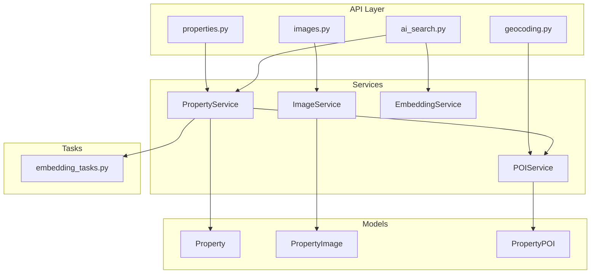
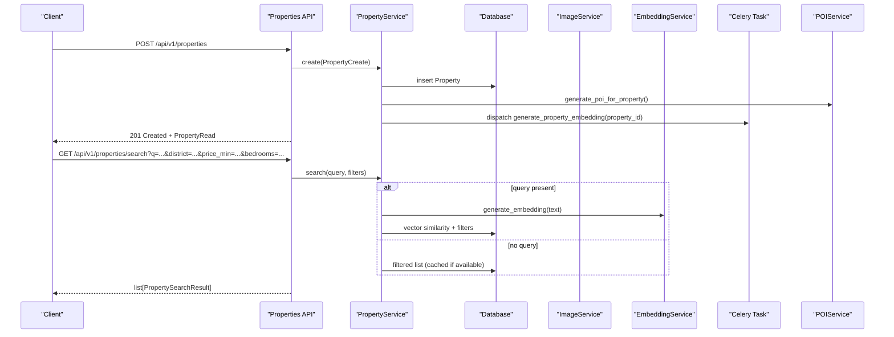
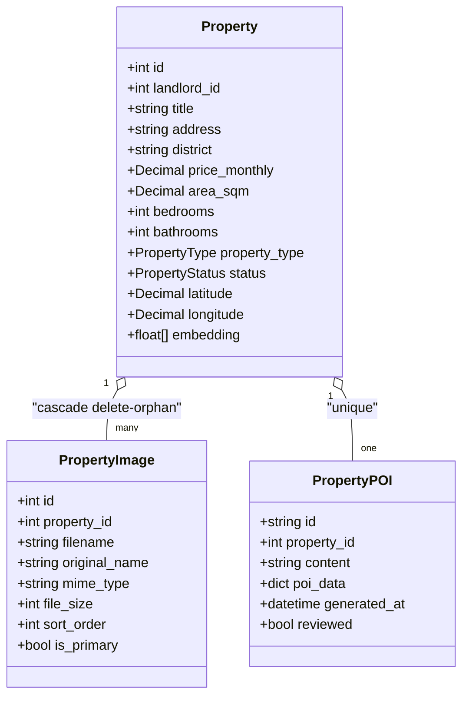
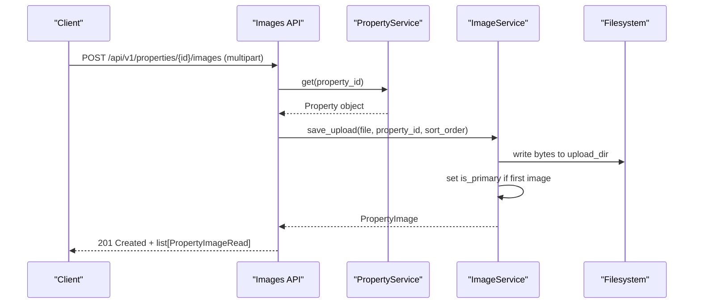
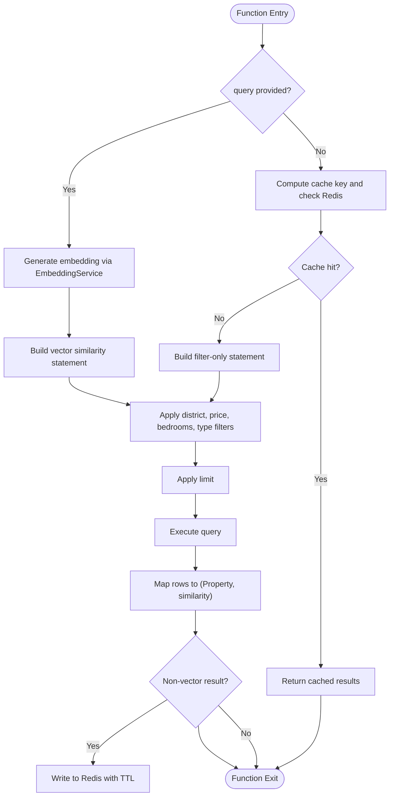
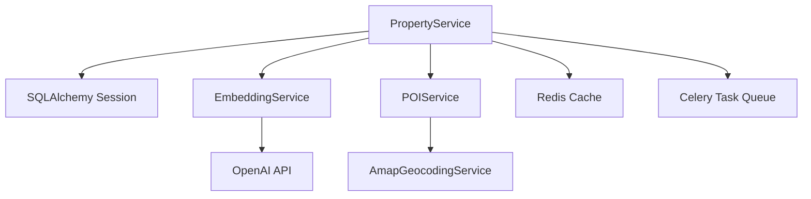

# Property Service

<cite>
**Referenced Files in This Document**
- [property_service.py](file://backend/app/services/property_service.py)
- [property.py](file://backend/app/models/property.py)
- [property_image.py](file://backend/app/models/property_image.py)
- [property.py (schemas)](file://backend/app/schemas/property.py)
- [property_image.py (schemas)](file://backend/app/schemas/property_image.py)
- [properties.py (routes)](file://backend/app/api/v1/routes/properties.py)
- [images.py (routes)](file://backend/app/api/v1/routes/images.py)
- [image_service.py](file://backend/app/services/image_service.py)
- [embedding_service.py](file://backend/app/services/embedding_service.py)
- [ai_search.py (routes)](file://backend/app/api/v1/routes/ai_search.py)
- [ai_search.py (schemas)](file://backend/app/schemas/ai_search.py)
- [embedding_tasks.py](file://backend/app/tasks/embedding_tasks.py)
- [poi_service.py](file://backend/app/services/poi_service.py)
- [poi.py](file://backend/app/models/poi.py)
- [geocoding.py (routes)](file://backend/app/api/v1/routes/geocoding.py)
- [geocoding.py (schemas)](file://backend/app/schemas/geocoding.py)
</cite>

## Table of Contents
1. [Introduction](#introduction)
2. [Project Structure](#project-structure)
3. [Core Components](#core-components)
4. [Architecture Overview](#architecture-overview)
5. [Detailed Component Analysis](#detailed-component-analysis)
6. [Dependency Analysis](#dependency-analysis)
7. [Performance Considerations](#performance-considerations)
8. [Troubleshooting Guide](#troubleshooting-guide)
9. [Conclusion](#conclusion)

## Introduction
This document explains the Property Service business logic, covering CRUD operations, image upload handling, validation and business rules, advanced search with keyword filtering and semantic vector search, geographic search via POI and geocoding, property status management, integration with AI embedding generation for semantic search, examples of complex queries, bulk operations, and performance optimization techniques.

## Project Structure
The Property Service is implemented across routes, services, models, schemas, tasks, and supporting services:
- Routes expose REST endpoints for properties and images, and an AI search endpoint.
- Services encapsulate business logic: property operations, image handling, embeddings, and POI generation.
- Models define database entities including Property, PropertyImage, and PropertyPOI.
- Schemas define request/response contracts and validation rules.
- Tasks perform asynchronous embedding generation and reindexing.
- Geocoding and POI services provide location-based enrichment and nearby amenities.

**Diagram sources**
- [properties.py (routes):1-162](file://backend/app/api/v1/routes/properties.py#L1-L162)
- [images.py (routes):1-151](file://backend/app/api/v1/routes/images.py#L1-L151)
- [ai_search.py (routes):1-160](file://backend/app/api/v1/routes/ai_search.py#L1-L160)
- [geocoding.py (routes):1-25](file://backend/app/api/v1/routes/geocoding.py#L1-L25)
- [property_service.py:1-239](file://backend/app/services/property_service.py#L1-L239)
- [image_service.py:1-95](file://backend/app/services/image_service.py#L1-L95)
- [embedding_service.py:1-32](file://backend/app/services/embedding_service.py#L1-L32)
- [poi_service.py:1-311](file://backend/app/services/poi_service.py#L1-L311)
- [property.py:1-86](file://backend/app/models/property.py#L1-L86)
- [property_image.py:1-23](file://backend/app/models/property_image.py#L1-L23)
- [poi.py:1-28](file://backend/app/models/poi.py#L1-L28)
- [embedding_tasks.py:1-112](file://backend/app/tasks/embedding_tasks.py#L1-L112)

**Section sources**
- [properties.py (routes):1-162](file://backend/app/api/v1/routes/properties.py#L1-L162)
- [images.py (routes):1-151](file://backend/app/api/v1/routes/images.py#L1-L151)
- [ai_search.py (routes):1-160](file://backend/app/api/v1/routes/ai_search.py#L1-L160)
- [property_service.py:1-239](file://backend/app/services/property_service.py#L1-L239)
- [image_service.py:1-95](file://backend/app/services/image_service.py#L1-L95)
- [embedding_service.py:1-32](file://backend/app/services/embedding_service.py#L1-L32)
- [poi_service.py:1-311](file://backend/app/services/poi_service.py#L1-L311)
- [property.py:1-86](file://backend/app/models/property.py#L1-L86)
- [property_image.py:1-23](file://backend/app/models/property_image.py#L1-L23)
- [poi.py:1-28](file://backend/app/models/poi.py#L1-L28)
- [embedding_tasks.py:1-112](file://backend/app/tasks/embedding_tasks.py#L1-L112)

## Core Components
- PropertyService: Implements create, get, list, search, update, delete; integrates POI generation and async embedding task dispatch; includes Redis-backed caching for non-vector searches.
- ImageService: Handles file uploads, primary image selection, deletion, and listing per property.
- EmbeddingService: Generates text embeddings using OpenAI API for semantic search.
- POIService: Enriches properties with nearby points-of-interest and generates summaries using external geocoding and optional LLM summarization.
- Models: Property, PropertyImage, PropertyPOI define schema, constraints, relationships, and indexes.
- Schemas: Pydantic models enforce input validation and define response structures.
- Tasks: Celery tasks generate embeddings asynchronously and support bulk reindexing.

**Section sources**
- [property_service.py:1-239](file://backend/app/services/property_service.py#L1-L239)
- [image_service.py:1-95](file://backend/app/services/image_service.py#L1-L95)
- [embedding_service.py:1-32](file://backend/app/services/embedding_service.py#L1-L32)
- [poi_service.py:1-311](file://backend/app/services/poi_service.py#L1-L311)
- [property.py:1-86](file://backend/app/models/property.py#L1-L86)
- [property_image.py:1-23](file://backend/app/models/property_image.py#L1-L23)
- [poi.py:1-28](file://backend/app/models/poi.py#L1-L28)
- [property.py (schemas):1-79](file://backend/app/schemas/property.py#L1-L79)
- [property_image.py (schemas):1-22](file://backend/app/schemas/property_image.py#L1-L22)
- [embedding_tasks.py:1-112](file://backend/app/tasks/embedding_tasks.py#L1-L112)

## Architecture Overview
The Property Service follows a layered architecture:
- API layer validates requests and delegates to services.
- Services orchestrate business logic, data access, and integrations.
- Models represent persistent entities with constraints and relationships.
- Tasks handle long-running or background work like embedding generation.

**Diagram sources**
- [properties.py (routes):16-91](file://backend/app/api/v1/routes/properties.py#L16-L91)
- [property_service.py:48-195](file://backend/app/services/property_service.py#L48-L195)
- [embedding_service.py:17-32](file://backend/app/services/embedding_service.py#L17-L32)
- [embedding_tasks.py:16-80](file://backend/app/tasks/embedding_tasks.py#L16-L80)
- [poi_service.py:123-151](file://backend/app/services/poi_service.py#L123-L151)

## Detailed Component Analysis

### Property CRUD Operations
- Create: Validates landlord ownership, persists Property, triggers POI generation, and enqueues embedding task.
- Read: Retrieves Property by ID and preloads POI when available.
- List: Supports pagination and filters by district and status.
- Update: Applies partial updates, refreshes POI, and enqueues embedding task.
- Delete: Removes Property; referential integrity enforced via foreign key cascades on related tables.

Validation and business rules:
- Input validation via Pydantic schemas ensures non-negative price, positive area, non-negative bedrooms/bathrooms, valid coordinates, and allowed enums for type/status.
- Ownership checks ensure landlords can only manage their own properties unless admin.
- Status transitions are constrained by enum values; service methods do not enforce additional workflow beyond setting status fields.

Referential integrity:
- Foreign keys cascade deletes from Property to PropertyImage and PropertyPOI.
- Deletion returns boolean success; route layer raises 404 when not found.

Examples:
- Complex queries: Combine district, price range, bedroom count, and property type filters in search.
- Bulk operations: Use list with pagination and filters; for bulk updates/deletes, iterate over paginated results and call update/delete endpoints.

**Section sources**
- [properties.py (routes):16-162](file://backend/app/api/v1/routes/properties.py#L16-L162)
- [property_service.py:48-223](file://backend/app/services/property_service.py#L48-L223)
- [property.py (schemas):11-44](file://backend/app/schemas/property.py#L11-L44)
- [property.py:38-86](file://backend/app/models/property.py#L38-L86)
- [property_image.py:8-23](file://backend/app/models/property_image.py#L8-L23)
- [poi.py:12-28](file://backend/app/models/poi.py#L12-L28)

#### Class Diagram: Property Entities

**Diagram sources**
- [property.py:38-86](file://backend/app/models/property.py#L38-L86)
- [property_image.py:8-23](file://backend/app/models/property_image.py#L8-L23)
- [poi.py:12-28](file://backend/app/models/poi.py#L12-L28)

### Image Upload Handling
- Upload: Verifies property ownership, enforces max images per property, validates MIME types and size limits, saves files to disk, records metadata, and sets primary image automatically for the first upload.
- Delete: Removes file from disk and database record; enforces ownership.
- Set Primary: Ensures only one primary image per property by unsetting others before marking selected image as primary.
- List: Returns ordered images by sort order and id.

Security and validation:
- Ownership checks prevent unauthorized modifications.
- File type and size restrictions protect storage and performance.

**Section sources**
- [images.py (routes):26-151](file://backend/app/api/v1/routes/images.py#L26-L151)
- [image_service.py:27-95](file://backend/app/services/image_service.py#L27-L95)
- [property_image.py (schemas):10-22](file://backend/app/schemas/property_image.py#L10-L22)

#### Sequence Diagram: Image Upload Flow

**Diagram sources**
- [images.py (routes):26-80](file://backend/app/api/v1/routes/images.py#L26-L80)
- [image_service.py:27-52](file://backend/app/services/image_service.py#L27-L52)

### Advanced Search Functionality
- Keyword search: When a natural language query is provided, the system generates an embedding and performs vector similarity search using pgvector.
- Filtering: District, price range, bedrooms, and property type filters are applied alongside vector search or as standalone filters.
- Caching: Non-vector filter-only searches are cached in Redis with deterministic keys and TTL.
- Results: Return tuples of Property and similarity score; route layer maps to PropertySearchResult including images and primary image URL.

Geographic search:
- Properties include latitude/longitude and district fields.
- POIService enriches properties with nearby amenities and summaries based on geocoding and optional LLM generation.
- Geocoding API resolves addresses to coordinates for POI collection.

Examples:
- Semantic search: Provide a descriptive query to retrieve semantically similar properties.
- Filtered search: Combine district, price_min/max, bedrooms, and property_type without a query for fast, cacheable results.
- Geographic enrichment: Access POI summaries and categories for each property.

**Section sources**
- [property_service.py:91-195](file://backend/app/services/property_service.py#L91-L195)
- [ai_search.py (routes):98-160](file://backend/app/api/v1/routes/ai_search.py#L98-L160)
- [ai_search.py (schemas):52-74](file://backend/app/schemas/ai_search.py#L52-L74)
- [poi_service.py:123-311](file://backend/app/services/poi_service.py#L123-L311)
- [geocoding.py (routes):9-25](file://backend/app/api/v1/routes/geocoding.py#L9-L25)
- [geocoding.py (schemas):6-19](file://backend/app/schemas/geocoding.py#L6-L19)

#### Flowchart: Search Algorithm

**Diagram sources**
- [property_service.py:91-195](file://backend/app/services/property_service.py#L91-L195)

### Property Status Management
- Enumerated statuses: available, rented, maintenance, offline.
- Default status: available.
- Workflow transitions: The service allows setting any status via update; additional business rule enforcement (e.g., preventing transitions from rented to available without contract closure) should be implemented at the service or route layer if required.

Best practices:
- Validate status changes against existing bookings/contracts before applying transitions.
- Log status changes for auditability.

**Section sources**
- [property.py:31-71](file://backend/app/models/property.py#L31-L71)
- [property.py (schemas):27-44](file://backend/app/schemas/property.py#L27-L44)
- [property_service.py:197-214](file://backend/app/services/property_service.py#L197-L214)

### Integration with AI Embedding Generation
- On create/update, the service dispatches a Celery task to generate embeddings asynchronously.
- The task creates an EmbeddingJob, marks processing/completed/failed states, calls EmbeddingService to generate vectors, and persists them to the Property.embedding column.
- Reindexing supports bulk regeneration for properties missing embeddings.

Operational notes:
- Embedding generation depends on OpenAI API configuration.
- Fallback behavior ensures service continuity even if embedding generation fails.

**Section sources**
- [property_service.py:225-239](file://backend/app/services/property_service.py#L225-L239)
- [embedding_tasks.py:16-112](file://backend/app/tasks/embedding_tasks.py#L16-L112)
- [embedding_service.py:17-32](file://backend/app/services/embedding_service.py#L17-L32)
- [property.py:78-78](file://backend/app/models/property.py#L78-L78)

### Data Validation and Business Rule Enforcement
- Schema-level validation:
  - Title/description/address/district length constraints.
  - Price non-negative, area positive, bedrooms/bathrooms non-negative.
  - Latitude/longitude bounds.
  - Allowed enums for property_type and status.
- Route-level authorization:
  - Landlord ownership checks for create/update/delete.
  - Admin override permitted.
- Service-level integrity:
  - Referential checks for landlord existence during creation.
  - Cascading deletes maintain consistency.

Recommendations:
- Add explicit business rule checks for status transitions tied to bookings/contracts.
- Introduce rate limiting and input sanitization for large payloads.

**Section sources**
- [property.py (schemas):11-44](file://backend/app/schemas/property.py#L11-L44)
- [properties.py (routes):16-162](file://backend/app/api/v1/routes/properties.py#L16-L162)
- [property_service.py:48-60](file://backend/app/services/property_service.py#L48-L60)

### Examples of Complex Queries
- Semantic search with filters: Provide a natural language query plus district, price range, bedrooms, and property type to combine vector similarity with exact filters.
- Filter-only search: Use district, price_min/max, bedrooms, and property_type without a query to leverage Redis caching for faster responses.
- Geographic enrichment: Retrieve POI summaries and nearby categories for properties to enhance search results and detail views.

**Section sources**
- [ai_search.py (routes):98-160](file://backend/app/api/v1/routes/ai_search.py#L98-L160)
- [property_service.py:91-195](file://backend/app/services/property_service.py#L91-L195)
- [poi_service.py:123-311](file://backend/app/services/poi_service.py#L123-L311)

### Bulk Operations
- Reindex all properties: A Celery task enumerates properties without embeddings and enqueues individual embedding jobs for batch processing.
- Pagination: Use list endpoints with skip/limit to process large datasets incrementally.

Caution:
- Avoid synchronous bulk updates in hot paths; prefer background tasks for heavy operations.

**Section sources**
- [embedding_tasks.py:83-112](file://backend/app/tasks/embedding_tasks.py#L83-L112)
- [properties.py (routes):94-107](file://backend/app/api/v1/routes/properties.py#L94-L107)

## Dependency Analysis
The Property Service depends on multiple components:
- Database models for persistence and constraints.
- External services for embeddings and geocoding.
- Redis for search result caching.
- Celery for background tasks.

**Diagram sources**
- [property_service.py:91-195](file://backend/app/services/property_service.py#L91-L195)
- [embedding_service.py:17-32](file://backend/app/services/embedding_service.py#L17-L32)
- [poi_service.py:123-311](file://backend/app/services/poi_service.py#L123-L311)
- [embedding_tasks.py:16-80](file://backend/app/tasks/embedding_tasks.py#L16-L80)

**Section sources**
- [property_service.py:91-195](file://backend/app/services/property_service.py#L91-L195)
- [embedding_service.py:17-32](file://backend/app/services/embedding_service.py#L17-L32)
- [poi_service.py:123-311](file://backend/app/services/poi_service.py#L123-L311)
- [embedding_tasks.py:16-80](file://backend/app/tasks/embedding_tasks.py#L16-L80)

## Performance Considerations
- Vector search: Ensure pgvector index exists on Property.embedding for efficient similarity queries.
- Caching: Leverage Redis for non-vector filter-only searches; tune TTL based on data volatility.
- Pagination: Use skip/limit to reduce payload sizes and improve throughput.
- Background tasks: Offload embedding generation and POI enrichment to avoid blocking request threads.
- File uploads: Enforce size/type limits and store files outside application memory; consider CDN for static serving.

[No sources needed since this section provides general guidance]

## Troubleshooting Guide
Common issues and resolutions:
- Embedding generation failures: Check OpenAI API configuration and network connectivity; review Celery logs for job status and error messages.
- Redis unavailable: Search falls back to uncached execution; verify Redis availability and connection settings.
- Geocoding errors: Handle service unavailability gracefully; fallback mechanisms use mock POI data.
- Ownership violations: Ensure correct user roles and landlord IDs; inspect route-level authorization checks.

**Section sources**
- [embedding_tasks.py:40-76](file://backend/app/tasks/embedding_tasks.py#L40-L76)
- [property_service.py:31-41](file://backend/app/services/property_service.py#L31-L41)
- [poi_service.py:156-195](file://backend/app/services/poi_service.py#L156-L195)
- [properties.py (routes):28-33](file://backend/app/api/v1/routes/properties.py#L28-L33)

## Conclusion
The Property Service provides robust CRUD operations, comprehensive validation, advanced search with semantic capabilities, geographic enrichment, and scalable background processing. By leveraging vector search, caching, and asynchronous tasks, it balances performance and functionality while maintaining data integrity and security. Future enhancements may include stricter status transition workflows, richer amenity data, and improved monitoring for external dependencies.