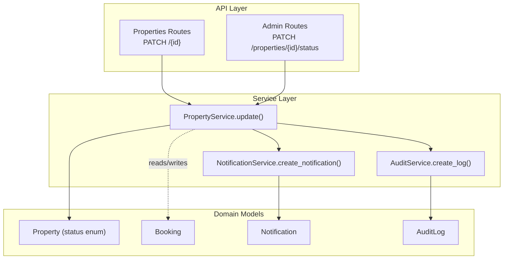
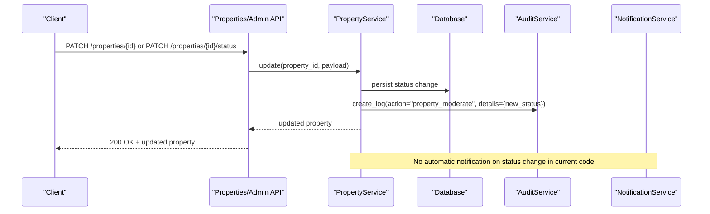
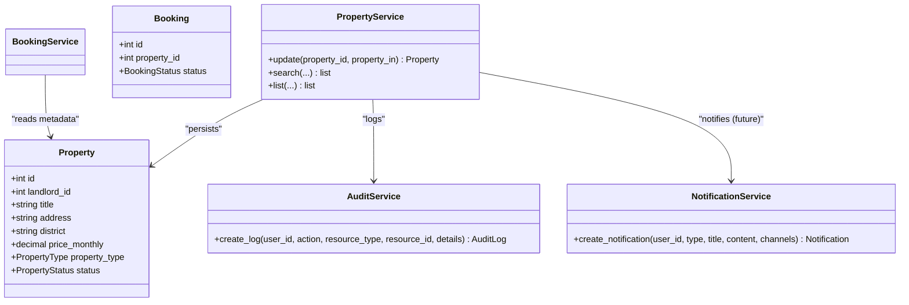

# Property Status Management

<cite>
**Referenced Files in This Document**
- [property.py](file://backend/app/models/property.py)
- [property_service.py](file://backend/app/services/property_service.py)
- [properties.py](file://backend/app/api/v1/routes/properties.py)
- [admin.py](file://backend/app/api/v1/routes/admin.py)
- [audit_log.py](file://backend/app/models/audit_log.py)
- [audit_service.py](file://backend/app/services/audit_service.py)
- [booking.py](file://backend/app/models/booking.py)
- [booking_service.py](file://backend/app/services/booking_service.py)
- [notification.py](file://backend/app/models/notification.py)
- [notification_service.py](file://backend/app/services/notification_service.py)
</cite>

## Table of Contents
1. Introduction
2. Project Structure
3. Core Components
4. Architecture Overview
5. Detailed Component Analysis
6. Dependency Analysis
7. Performance Considerations
8. Troubleshooting Guide
9. Conclusion

## Introduction
This document explains the property status management system, including:
- Available statuses and their business meanings
- Status transition workflows and validation rules
- How status affects search visibility and user interactions
- Examples of updating status via the update method
- Integration with the booking system
- Audit logging for status changes
- Notification triggers based on transitions

## Project Structure
The property status feature spans models, services, API routes, and cross-cutting concerns (audit and notifications). The key areas are:
- Data model and enum for property status
- Service layer for updates and side effects
- API endpoints for general updates and admin moderation
- Audit logging for compliance
- Notifications for stakeholder awareness
- Booking integration points

**Diagram sources**
- [properties.py](file://backend/app/api/v1/routes/properties.py)
- [admin.py](file://backend/app/api/v1/routes/admin.py)
- [property_service.py](file://backend/app/services/property_service.py)
- [audit_service.py](file://backend/app/services/audit_service.py)
- [notification_service.py](file://backend/app/services/notification_service.py)
- [property.py](file://backend/app/models/property.py)
- [audit_log.py](file://backend/app/models/audit_log.py)
- [notification.py](file://backend/app/models/notification.py)
- [booking.py](file://backend/app/models/booking.py)

**Section sources**
- [property.py](file://backend/app/models/property.py)
- [property_service.py](file://backend/app/services/property_service.py)
- [properties.py](file://backend/app/api/v1/routes/properties.py)
- [admin.py](file://backend/app/api/v1/routes/admin.py)
- [audit_log.py](file://backend/app/models/audit_log.py)
- [audit_service.py](file://backend/app/services/audit_service.py)
- [notification.py](file://backend/app/models/notification.py)
- [notification_service.py](file://backend/app/services/notification_service.py)
- [booking.py](file://backend/app/models/booking.py)

## Core Components
- PropertyStatus enum defines the allowed values: available, rented, maintenance, offline.
- Property model persists the status field with an index for efficient filtering.
- PropertyService.update applies partial updates to a property and triggers side effects (POI refresh, embedding task dispatch).
- Admin route PATCH /properties/{id}/status enforces valid status values and records audit logs.
- AuditService provides a generic mechanism to record actions with details.
- NotificationService creates persistent notifications and dispatches push channels.
- Booking model and service integrate with property lifecycle (e.g., deposit/service fee calculations use property data).

**Section sources**
- [property.py](file://backend/app/models/property.py)
- [property_service.py](file://backend/app/services/property_service.py)
- [admin.py](file://backend/app/api/v1/routes/admin.py)
- [audit_service.py](file://backend/app/services/audit_service.py)
- [notification_service.py](file://backend/app/services/notification_service.py)
- [booking.py](file://backend/app/models/booking.py)
- [booking_service.py](file://backend/app/services/booking_service.py)

## Architecture Overview
The status update flow is straightforward:
- Clients call either the general PATCH endpoint or the admin moderation endpoint.
- The service layer validates inputs, persists changes, and emits side effects.
- Audit logs capture who changed what and when.
- Notifications can be triggered by related events (e.g., bookings), while explicit status-change notifications are not currently implemented in the codebase.

**Diagram sources**
- [properties.py](file://backend/app/api/v1/routes/properties.py)
- [admin.py](file://backend/app/api/v1/routes/admin.py)
- [property_service.py](file://backend/app/services/property_service.py)
- [audit_service.py](file://backend/app/services/audit_service.py)
- [notification_service.py](file://backend/app/services/notification_service.py)

## Detailed Component Analysis

### Status Definitions and Business Meanings
- available: Property is open for viewing and booking.
- rented: Property is currently occupied; no new bookings should be accepted.
- maintenance: Property is temporarily unavailable due to maintenance; hide from public search.
- offline: Property is intentionally hidden or removed from circulation.

These semantics guide how the system filters results and whether users can initiate bookings.

**Section sources**
- [property.py](file://backend/app/models/property.py)

### Status Transition Workflow and Validation Rules
- General update path (landlord/admin): PATCH /properties/{id} accepts optional status field. The service applies any provided fields without enforcing specific transitions.
- Admin moderation path: PATCH /properties/{id}/status explicitly validates that the new status is one of the allowed values before applying it. It also writes an audit log entry.

Recommended validation rules (business policy, not enforced in code yet):
- From available:
  - To rented: allowed when a booking is approved/completed.
  - To maintenance: allowed at any time.
  - To offline: allowed at any time.
- From rented:
  - To available: allowed after checkout completion.
  - To maintenance: allowed if tenant vacates or during turnover.
  - To offline: allowed at any time.
- From maintenance:
  - To available: allowed after maintenance completes.
  - To offline: allowed at any time.
  - To rented: only if a pre-existing reservation exists and is being honored.
- From offline:
  - To available: allowed when re-listing.
  - To maintenance: allowed for planned work.
  - To rented: only if there is an active lease/booking.

Note: The current backend does not implement these transition guards; they should be added in the service layer to prevent invalid state changes.

**Section sources**
- [admin.py](file://backend/app/api/v1/routes/admin.py)
- [property_service.py](file://backend/app/services/property_service.py)

### Search Visibility and User Interactions
- Search/list endpoints do not filter by status by default. Consumers can optionally filter by status using query parameters.
- Recommended behavior:
  - Exclude maintenance and offline from public search results.
  - Include available and rented (rented may be shown but blocked for booking).
- Frontend components render properties regardless of status; consider adding UI logic to disable booking actions for non-available statuses.

**Section sources**
- [properties.py](file://backend/app/api/v1/routes/properties.py)
- [property_service.py](file://backend/app/services/property_service.py)

### Updating Status via Update Method
- Landlords/admins can update status through PATCH /properties/{id} by including the status field in the request body.
- The service updates the entity, commits, refreshes, and triggers background tasks (embedding and POI refresh).

Example usage pattern (conceptual):
- Send PATCH /properties/{id} with JSON body containing {"status": "maintenance"}.
- On success, the property’s status is persisted and side effects are dispatched.

**Section sources**
- [properties.py](file://backend/app/api/v1/routes/properties.py)
- [property_service.py](file://backend/app/services/property_service.py)

### Admin Moderation Endpoint
- Admin-only PATCH /properties/{id}/status?new_status=... validates the target status against the allowed set and then updates via the same service method.
- An audit log entry is created with action "property_moderate" and details including the new status.

**Section sources**
- [admin.py](file://backend/app/api/v1/routes/admin.py)
- [audit_service.py](file://backend/app/services/audit_service.py)

### Integration With Booking System
- Bookings reference a property and carry their own status lifecycle (pending, approved, rejected, cancelled, completed).
- When creating a booking, the service reads property metadata (deposit amount, service fee rate) to compute fees.
- Recommended integration:
  - Prevent booking creation when property.status is maintenance or offline.
  - Auto-transition property.status to rented upon booking approval/completion.
  - Revert to available upon cancellation or completion depending on business rules.

Current code does not enforce these rules automatically; add checks in the booking service and/or property update hooks.

**Section sources**
- [booking.py](file://backend/app/models/booking.py)
- [booking_service.py](file://backend/app/services/booking_service.py)

### Audit Logging for Status Changes
- Admin moderation endpoint records an audit log with:
  - action: "property_moderate"
  - resource_type: "property"
  - resource_id: property id
  - details: { "new_status": "<value>" }
- For landlord-initiated updates, consider extending the service to log similar entries.

**Section sources**
- [admin.py](file://backend/app/api/v1/routes/admin.py)
- [audit_log.py](file://backend/app/models/audit_log.py)
- [audit_service.py](file://backend/app/services/audit_service.py)

### Notification Triggers Based on Status Transitions
- Current implementation does not send notifications on property status changes.
- Existing notification flows exist for booking lifecycle events (created, approved, rejected, cancelled, completed).
- Recommendation: Add notification creation in the property update flow to inform landlords/tenants about significant status changes.

**Section sources**
- [notification.py](file://backend/app/models/notification.py)
- [notification_service.py](file://backend/app/services/notification_service.py)
- [booking_service.py](file://backend/app/services/booking_service.py)

## Dependency Analysis

**Diagram sources**
- [property.py](file://backend/app/models/property.py)
- [property_service.py](file://backend/app/services/property_service.py)
- [audit_service.py](file://backend/app/services/audit_service.py)
- [notification_service.py](file://backend/app/services/notification_service.py)
- [booking.py](file://backend/app/models/booking.py)
- [booking_service.py](file://backend/app/services/booking_service.py)

**Section sources**
- [property.py](file://backend/app/models/property.py)
- [property_service.py](file://backend/app/services/property_service.py)
- [audit_service.py](file://backend/app/services/audit_service.py)
- [notification_service.py](file://backend/app/services/notification_service.py)
- [booking.py](file://backend/app/models/booking.py)
- [booking_service.py](file://backend/app/services/booking_service.py)

## Performance Considerations
- The Property model indexes district and status to optimize filtered queries.
- Search results are cached for non-vector queries using Redis when available.
- Embedding generation is dispatched asynchronously to avoid blocking requests.

Recommendations:
- Add database-level constraints or application-level guards to enforce valid transitions.
- Introduce cache invalidation or TTL refresh when status changes to ensure consistent search results.

[No sources needed since this section provides general guidance]

## Troubleshooting Guide
Common issues and resolutions:
- Invalid status value:
  - Admin moderation endpoint rejects unknown statuses with a 400 error.
  - Ensure payloads use one of: available, rented, maintenance, offline.
- Unexpected visibility in search:
  - If maintenance/offline appear in results, add server-side filtering to exclude them by default.
- Missing audit trail:
  - Only admin moderation currently logs. Extend the general update path to log all status changes.
- Booking conflicts:
  - If tenants can book maintenance/offline properties, add preconditions in the booking service to check property.status.

**Section sources**
- [admin.py](file://backend/app/api/v1/routes/admin.py)
- [property_service.py](file://backend/app/services/property_service.py)
- [booking_service.py](file://backend/app/services/booking_service.py)

## Conclusion
The property status system is defined by a clear enum and persisted in the Property model. Updates are supported via both general and admin endpoints, with admin moderation providing explicit validation and audit logging. Search visibility is not restricted by default, so consumers should filter out non-available statuses. Integrations with booking and notifications should be strengthened to enforce business rules and keep stakeholders informed. Adding transition guards and notification triggers will improve consistency and user experience.