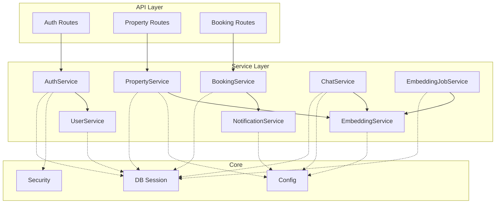
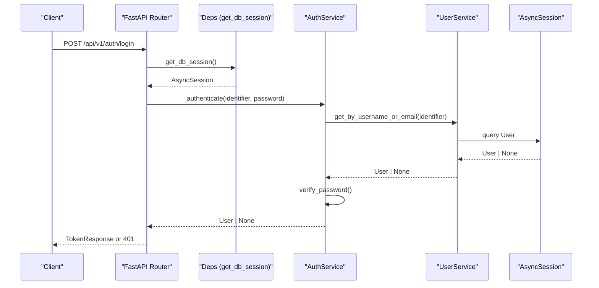
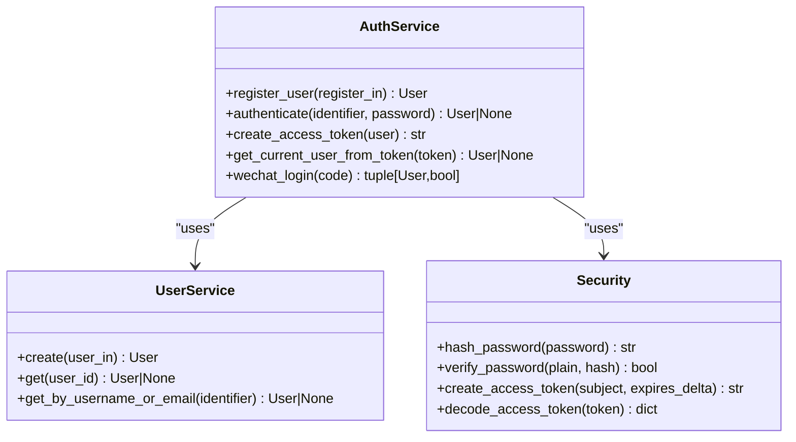
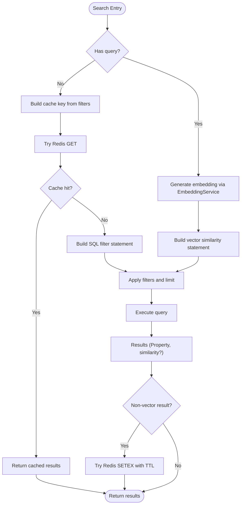
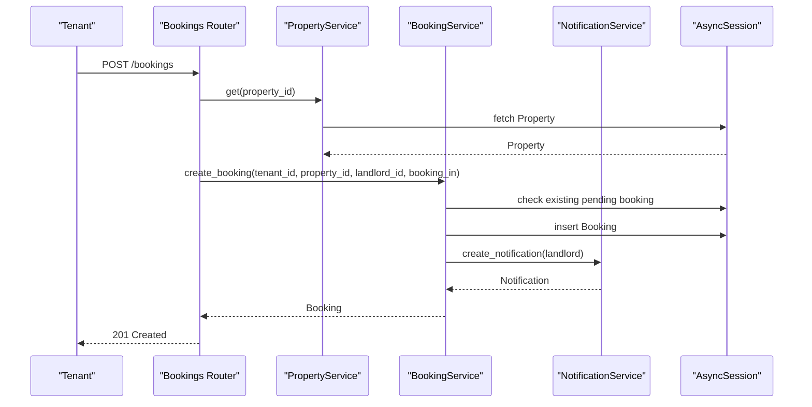
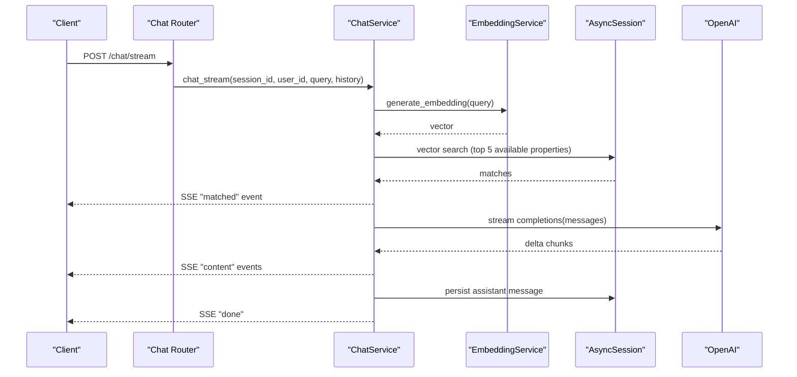
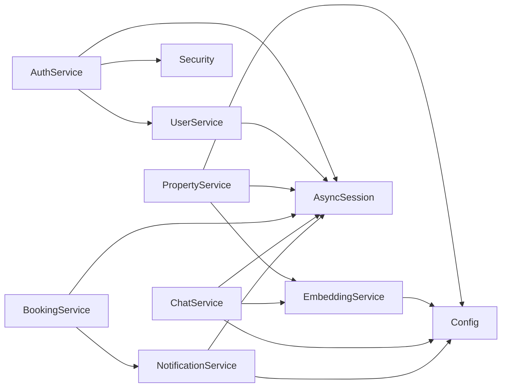

# Service Layer & Business Logic

<cite>
**Referenced Files in This Document**
- [main.py](file://backend/app/main.py)
- [deps.py](file://backend/app/api/deps.py)
- [auth.py](file://backend/app/api/v1/routes/auth.py)
- [properties.py](file://backend/app/api/v1/routes/properties.py)
- [bookings.py](file://backend/app/api/v1/routes/bookings.py)
- [session.py](file://backend/app/db/session.py)
- [config.py](file://backend/app/core/config.py)
- [security.py](file://backend/app/core/security.py)
- [__init__.py](file://backend/app/services/__init__.py)
- [auth_service.py](file://backend/app/services/auth_service.py)
- [user_service.py](file://backend/app/services/user_service.py)
- [property_service.py](file://backend/app/services/property_service.py)
- [booking_service.py](file://backend/app/services/booking_service.py)
- [embedding_service.py](file://backend/app/services/embedding_service.py)
- [chat_service.py](file://backend/app/services/chat_service.py)
- [notification_service.py](file://backend/app/services/notification_service.py)
- [embedding_job_service.py](file://backend/app/services/embedding_job_service.py)
</cite>

## Table of Contents
1. [Introduction](#introduction)
2. [Project Structure](#project-structure)
3. [Core Components](#core-components)
4. [Architecture Overview](#architecture-overview)
5. [Detailed Component Analysis](#detailed-component-analysis)
6. [Dependency Analysis](#dependency-analysis)
7. [Performance Considerations](#performance-considerations)
8. [Troubleshooting Guide](#troubleshooting-guide)
9. [Conclusion](#conclusion)

## Introduction
This document explains the service layer architecture and business logic implementation for the rental housing platform. It focuses on the service class pattern with dependency injection, method organization, transaction management, and cross-cutting concerns such as authentication, search, embeddings, notifications, and chat. It also covers error handling patterns, data validation, business rule enforcement, composition of services, asynchronous operations, external API calls, caching strategies, performance optimization, and testing approaches.

## Project Structure
The backend is organized into layers:
- API routes (FastAPI routers) handle HTTP requests, perform input validation via Pydantic schemas, enforce authorization, and delegate to services.
- Services encapsulate business logic, orchestrate domain operations, manage transactions through SQLAlchemy async sessions, and coordinate external integrations.
- Core modules provide configuration, security utilities, logging, monitoring, and database session setup.
- Models represent persistent entities; Schemas define request/response contracts.

**Diagram sources**
- [main.py:17-82](file://backend/app/main.py#L17-L82)
- [deps.py:14-58](file://backend/app/api/deps.py#L14-L58)
- [auth.py:14-94](file://backend/app/api/v1/routes/auth.py#L14-L94)
- [properties.py:16-162](file://backend/app/api/v1/routes/properties.py#L16-L162)
- [bookings.py:14-112](file://backend/app/api/v1/routes/bookings.py#L14-L112)
- [auth_service.py:14-77](file://backend/app/services/auth_service.py#L14-L77)
- [user_service.py:8-57](file://backend/app/services/user_service.py#L8-L57)
- [property_service.py:44-239](file://backend/app/services/property_service.py#L44-L239)
- [booking_service.py:11-164](file://backend/app/services/booking_service.py#L11-L164)
- [embedding_service.py:17-32](file://backend/app/services/embedding_service.py#L17-L32)
- [chat_service.py:17-302](file://backend/app/services/chat_service.py#L17-L302)
- [notification_service.py:37-164](file://backend/app/services/notification_service.py#L37-L164)
- [embedding_job_service.py:7-54](file://backend/app/services/embedding_job_service.py#L7-L54)
- [config.py:7-167](file://backend/app/core/config.py#L7-L167)
- [security.py:1-34](file://backend/app/core/security.py#L1-L34)
- [session.py:1-14](file://backend/app/db/session.py#L1-L14)

**Section sources**
- [main.py:17-82](file://backend/app/main.py#L17-L82)
- [deps.py:14-58](file://backend/app/api/deps.py#L14-L58)
- [auth.py:14-94](file://backend/app/api/v1/routes/auth.py#L14-L94)
- [properties.py:16-162](file://backend/app/api/v1/routes/properties.py#L16-L162)
- [bookings.py:14-112](file://backend/app/api/v1/routes/bookings.py#L14-L112)
- [session.py:1-14](file://backend/app/db/session.py#L1-L14)
- [config.py:7-167](file://backend/app/core/config.py#L7-L167)
- [security.py:1-34](file://backend/app/core/security.py#L1-L34)

## Core Components
- Dependency Injection: FastAPI dependencies provide an AsyncSession per request and current user resolution. Services are instantiated within route handlers or other services using the injected session.
- Transaction Management: Each service method performs explicit commit/refresh around DB writes. Long-running flows may span multiple commits where appropriate.
- Composition: Services compose other services (e.g., AuthService composes UserService; BookingService uses NotificationService).
- External Integrations: EmbeddingService calls OpenAI; ChatService streams responses from OpenAI; PropertyService optionally integrates Redis for caching and Celery tasks for embedding generation.

Key responsibilities:
- Authentication: JWT creation/verification, password hashing, WeChat login flow.
- User Management: CRUD operations and lookup by username/email.
- Property Management: CRUD, filtering, vector search with pgvector, POI generation, async embedding dispatch.
- Booking Workflow: Creation, status transitions, conflict checks, notifications.
- Embeddings: Vector generation for text and properties.
- Chat (RAG): Context retrieval via vector similarity, streaming LLM responses, message persistence.
- Notifications: Multi-channel dispatch via Celery tasks.
- Embedding Jobs: Admin triggers and stats.

**Section sources**
- [deps.py:14-58](file://backend/app/api/deps.py#L14-L58)
- [auth_service.py:14-77](file://backend/app/services/auth_service.py#L14-L77)
- [user_service.py:8-57](file://backend/app/services/user_service.py#L8-L57)
- [property_service.py:44-239](file://backend/app/services/property_service.py#L44-L239)
- [booking_service.py:11-164](file://backend/app/services/booking_service.py#L11-L164)
- [embedding_service.py:17-32](file://backend/app/services/embedding_service.py#L17-L32)
- [chat_service.py:17-302](file://backend/app/services/chat_service.py#L17-L302)
- [notification_service.py:37-164](file://backend/app/services/notification_service.py#L37-L164)
- [embedding_job_service.py:7-54](file://backend/app/services/embedding_job_service.py#L7-L54)

## Architecture Overview
The application follows a layered architecture with clear separation between HTTP endpoints and business logic. Services encapsulate domain rules and orchestrate data access and external calls. Configuration and security utilities are centralized.

**Diagram sources**
- [auth.py:37-60](file://backend/app/api/v1/routes/auth.py#L37-L60)
- [deps.py:14-30](file://backend/app/api/deps.py#L14-L30)
- [auth_service.py:29-38](file://backend/app/services/auth_service.py#L29-L38)
- [user_service.py:22-30](file://backend/app/services/user_service.py#L22-L30)
- [security.py:16-28](file://backend/app/core/security.py#L16-L28)

## Detailed Component Analysis

### Authentication Service (JWT tokens, user management)
Responsibilities:
- Register users by composing UserService and hashing passwords.
- Authenticate users by identifier and password, returning active users only.
- Create and decode JWT access tokens.
- Resolve current user from token and ensure account is active.
- WeChat login flow: exchange code for openid, find or create user, return user and flag if new.

Patterns:
- Dependency injection via AsyncSession.
- Composes UserService for persistence.
- Uses core security utilities for hashing and token operations.

Error handling:
- Invalid/expired tokens handled gracefully during decoding.
- Inactive accounts rejected.

**Diagram sources**
- [auth_service.py:14-77](file://backend/app/services/auth_service.py#L14-L77)
- [user_service.py:8-57](file://backend/app/services/user_service.py#L8-L57)
- [security.py:1-34](file://backend/app/core/security.py#L1-L34)

**Section sources**
- [auth_service.py:14-77](file://backend/app/services/auth_service.py#L14-L77)
- [user_service.py:8-57](file://backend/app/services/user_service.py#L8-L57)
- [security.py:1-34](file://backend/app/core/security.py#L1-L34)
- [auth.py:14-94](file://backend/app/api/v1/routes/auth.py#L14-L94)

### Property Service (CRUD, search, async embedding)
Responsibilities:
- Create, read, list, update, delete properties.
- Search with optional vector similarity when a natural language query is provided.
- Cache non-vector filter results in Redis with TTL.
- Dispatch async embedding tasks via Celery after create/update.
- Preload POI data when fetching a single property.

Business rules:
- Only landlords can create/update/delete their own properties (enforced at route level).
- Search filters include district, price range, bedrooms, property type.

Caching strategy:
- Deterministic cache key built from filter parameters.
- Graceful fallback when Redis is unavailable.

Async operations:
- Embedding task dispatched in a background thread calling Celery.

**Diagram sources**
- [property_service.py:91-195](file://backend/app/services/property_service.py#L91-L195)
- [embedding_service.py:17-32](file://backend/app/services/embedding_service.py#L17-L32)

**Section sources**
- [property_service.py:44-239](file://backend/app/services/property_service.py#L44-L239)
- [embedding_service.py:17-32](file://backend/app/services/embedding_service.py#L17-L32)
- [properties.py:36-91](file://backend/app/api/v1/routes/properties.py#L36-L91)

### Booking Service (workflow management, status transitions)
Responsibilities:
- Create bookings with deposit/service fee calculation based on property settings.
- Enforce uniqueness of pending bookings per tenant-property pair.
- Update booking status with corresponding notifications.
- List bookings by tenant or landlord.

Business rules:
- Prevent duplicate pending bookings.
- Landlord-only status updates; tenant-only cancellation.

Notifications:
- Unified notification creation with multi-channel dispatch via Celery tasks.

**Diagram sources**
- [bookings.py:14-41](file://backend/app/api/v1/routes/bookings.py#L14-L41)
- [booking_service.py:15-79](file://backend/app/services/booking_service.py#L15-L79)
- [notification_service.py:43-69](file://backend/app/services/notification_service.py#L43-L69)

**Section sources**
- [booking_service.py:11-164](file://backend/app/services/booking_service.py#L11-L164)
- [bookings.py:14-112](file://backend/app/api/v1/routes/bookings.py#L14-L112)
- [notification_service.py:37-164](file://backend/app/services/notification_service.py#L37-L164)

### Embedding Service (AI vector generation)
Responsibilities:
- Generate embeddings for arbitrary text and property descriptions.
- Use configured OpenAI model and API key.

Integration points:
- Used by PropertyService for search and ChatService for RAG context building.

**Section sources**
- [embedding_service.py:17-32](file://backend/app/services/embedding_service.py#L17-L32)
- [property_service.py:135-147](file://backend/app/services/property_service.py#L135-L147)
- [chat_service.py:87-142](file://backend/app/services/chat_service.py#L87-L142)

### Chat Service (RAG implementation)
Responsibilities:
- Manage chat sessions and messages.
- Build RAG context by generating query embedding and retrieving top similar properties.
- Provide both non-streaming and streaming chat endpoints.
- Persist user and assistant messages with metadata (matched properties).

Streaming behavior:
- Yields SSE-formatted chunks including matched properties first, then content deltas, then done markers.

**Diagram sources**
- [chat_service.py:227-302](file://backend/app/services/chat_service.py#L227-L302)
- [embedding_service.py:17-32](file://backend/app/services/embedding_service.py#L17-L32)

**Section sources**
- [chat_service.py:17-302](file://backend/app/services/chat_service.py#L17-L302)

### Notification Service (multi-channel dispatch)
Responsibilities:
- Persist notifications and dispatch to WeChat, SMS, and Email via Celery tasks.
- Map notification types to channel templates.
- Provide listing, marking read, and unread count APIs.

Error handling:
- Channel dispatch failures are logged but do not block DB write.

**Section sources**
- [notification_service.py:37-164](file://backend/app/services/notification_service.py#L37-L164)
- [booking_service.py:55-77](file://backend/app/services/booking_service.py#L55-L77)

### Embedding Job Service (admin reindex)
Responsibilities:
- List jobs and compute stats.
- Trigger reindex for a specific property or all properties via Celery tasks.

**Section sources**
- [embedding_job_service.py:7-54](file://backend/app/services/embedding_job_service.py#L7-L54)

## Dependency Analysis
Services depend on:
- AsyncSession for persistence.
- Core config for external service credentials.
- Security utilities for auth.
- Other services for composition.

**Diagram sources**
- [auth_service.py:14-77](file://backend/app/services/auth_service.py#L14-L77)
- [user_service.py:8-57](file://backend/app/services/user_service.py#L8-L57)
- [property_service.py:44-239](file://backend/app/services/property_service.py#L44-L239)
- [chat_service.py:17-302](file://backend/app/services/chat_service.py#L17-L302)
- [booking_service.py:11-164](file://backend/app/services/booking_service.py#L11-L164)
- [notification_service.py:37-164](file://backend/app/services/notification_service.py#L37-L164)
- [embedding_service.py:17-32](file://backend/app/services/embedding_service.py#L17-L32)
- [config.py:7-167](file://backend/app/core/config.py#L7-L167)
- [security.py:1-34](file://backend/app/core/security.py#L1-L34)
- [session.py:1-14](file://backend/app/db/session.py#L1-L14)

**Section sources**
- [__init__.py:1-26](file://backend/app/services/__init__.py#L1-L26)
- [deps.py:14-58](file://backend/app/api/deps.py#L14-L58)

## Performance Considerations
- Caching: Non-vector search results are cached in Redis with deterministic keys and TTL. Failures fall back to direct queries.
- Vector search: pgvector similarity ordering reduces post-processing cost; limit parameter controls payload size.
- Async I/O: All DB and external calls use async patterns; streaming chat avoids long blocking responses.
- Background tasks: Embedding generation is offloaded to Celery to keep request latency low.
- Connection pooling: Async engine and sessionmaker configured for efficient reuse.

Recommendations:
- Monitor Redis availability and consider local fallback caches for critical paths.
- Tune embedding batch sizes and limits for high-throughput scenarios.
- Add indexes on frequently filtered fields (district, status, price ranges).
- Implement retry/backoff for external API calls (OpenAI, WeChat, SMS, Email).

[No sources needed since this section provides general guidance]

## Troubleshooting Guide
Common issues and patterns:
- Authentication failures: Invalid/expired tokens or inactive accounts lead to 401/403 responses. Ensure correct secret keys and algorithm configuration.
- Duplicate bookings: Conflict errors indicate existing pending bookings; validate tenant-property pairs before submission.
- Missing resources: 404 responses when properties or bookings are not found; verify IDs and ownership checks.
- External service outages: Embedding and chat rely on OpenAI; notifications rely on Celery workers and third-party providers. Log warnings and degrade gracefully.
- Redis unavailability: Search caching disabled; system continues without cache.

Operational tips:
- Inspect logs for failed channel dispatches and embedding task dispatches.
- Use admin endpoints to trigger reindexing and review job stats.
- Validate environment variables for external services.

**Section sources**
- [auth_service.py:40-51](file://backend/app/services/auth_service.py#L40-L51)
- [booking_service.py:23-33](file://backend/app/services/booking_service.py#L23-L33)
- [property_service.py:113-132](file://backend/app/services/property_service.py#L113-L132)
- [notification_service.py:122-163](file://backend/app/services/notification_service.py#L122-L163)
- [embedding_job_service.py:45-53](file://backend/app/services/embedding_job_service.py#L45-L53)

## Conclusion
The service layer cleanly separates business logic from HTTP concerns, leveraging dependency injection and async patterns. Core services implement robust workflows for authentication, property management with vector search, booking lifecycle, AI-powered embeddings, and RAG-based chat. Error handling is consistent, with graceful degradation for external dependencies. Caching and background tasks improve performance and responsiveness. The design supports extensibility and maintainability across evolving features.