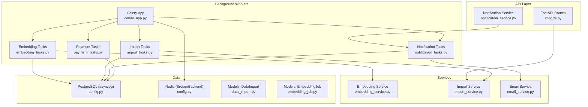
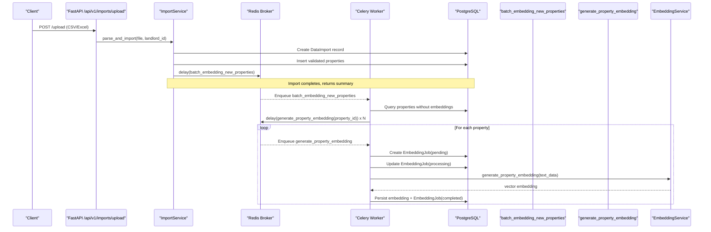
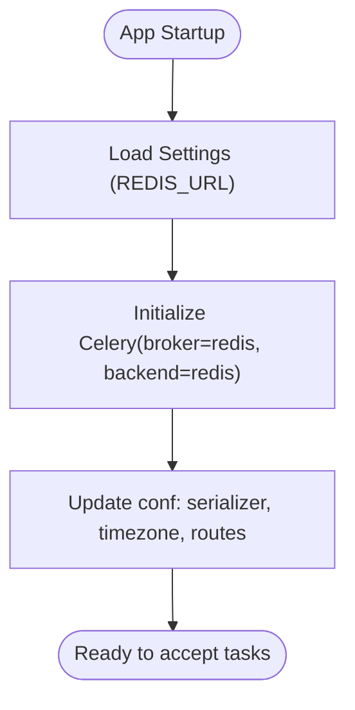
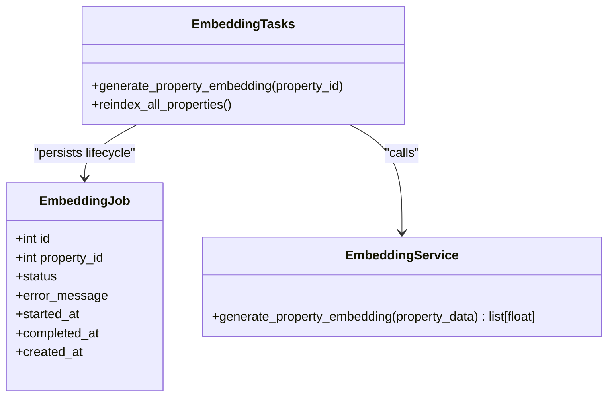
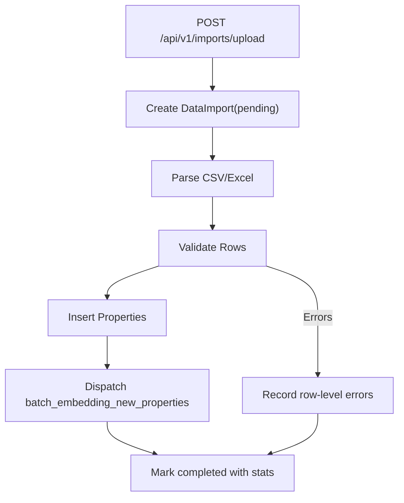
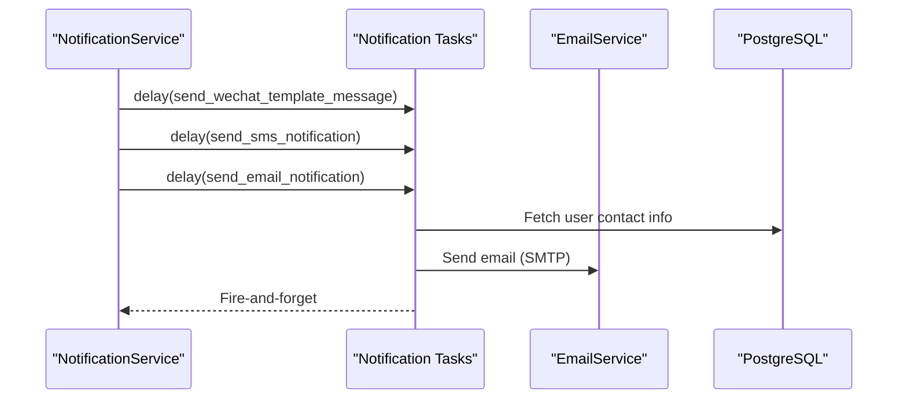
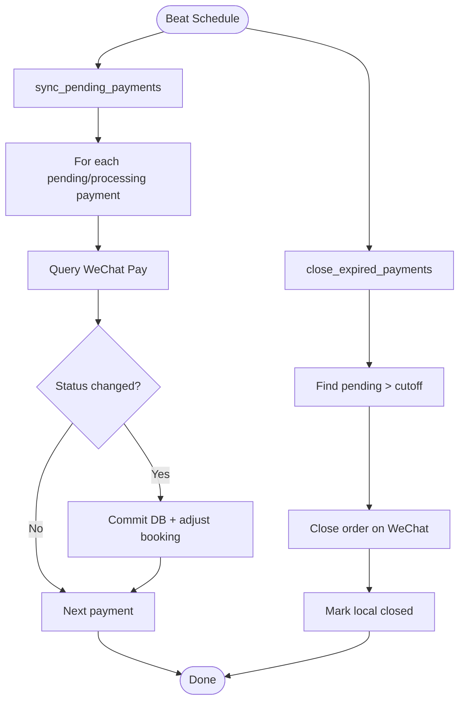
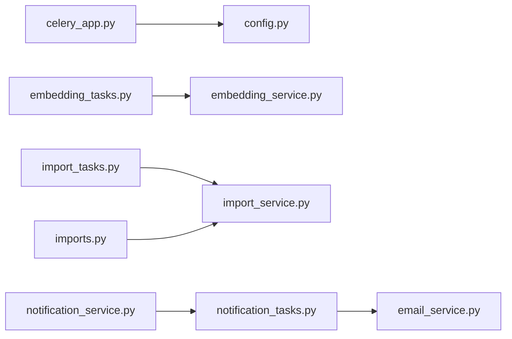

# Background Processing

<cite>
**Referenced Files in This Document**
- [celery_app.py](file://backend/app/celery_app.py)
- [embedding_tasks.py](file://backend/app/tasks/embedding_tasks.py)
- [import_tasks.py](file://backend/app/tasks/import_tasks.py)
- [notification_tasks.py](file://backend/app/tasks/notification_tasks.py)
- [payment_tasks.py](file://backend/app/tasks/payment_tasks.py)
- [config.py](file://backend/app/core/config.py)
- [embedding_service.py](file://backend/app/services/embedding_service.py)
- [import_service.py](file://backend/app/services/import_service.py)
- [data_import.py](file://backend/app/models/data_import.py)
- [embedding_job.py](file://backend/app/models/embedding_job.py)
- [imports.py](file://backend/app/api/v1/routes/imports.py)
- [notification_service.py](file://backend/app/services/notification_service.py)
- [email_service.py](file://backend/app/services/email_service.py)
</cite>

## Table of Contents
1. [Introduction](#introduction)
2. [Project Structure](#project-structure)
3. [Core Components](#core-components)
4. [Architecture Overview](#architecture-overview)
5. [Detailed Component Analysis](#detailed-component-analysis)
6. [Dependency Analysis](#dependency-analysis)
7. [Performance Considerations](#performance-considerations)
8. [Troubleshooting Guide](#troubleshooting-guide)
9. [Conclusion](#conclusion)
10. [Appendices](#appendices)

## Introduction
This document explains the background processing system built with Celery and Redis. It covers application setup, worker configuration, task routing, embedding generation for semantic search, data import workflows with progress tracking, notification dispatch (WeChat template messages, SMS, email), periodic jobs, monitoring strategies, error handling and retries, performance tuning, scaling, and practical examples for creating new tasks, chaining, and retrieving results.

## Project Structure
The background processing system is implemented under backend/app:
- Celery app and broker/backend configuration
- Task modules for embeddings, imports, notifications, and payments
- Services that perform business logic and integrate with external APIs
- Models that persist job and import progress
- API routes that trigger background work

**Diagram sources**
- [celery_app.py:1-31](file://backend/app/celery_app.py#L1-L31)
- [embedding_tasks.py:1-112](file://backend/app/tasks/embedding_tasks.py#L1-L112)
- [import_tasks.py:1-44](file://backend/app/tasks/import_tasks.py#L1-L44)
- [notification_tasks.py:1-217](file://backend/app/tasks/notification_tasks.py#L1-L217)
- [payment_tasks.py:1-241](file://backend/app/tasks/payment_tasks.py#L1-L241)
- [embedding_service.py:1-32](file://backend/app/services/embedding_service.py#L1-L32)
- [import_service.py:1-403](file://backend/app/services/import_service.py#L1-L403)
- [email_service.py:1-76](file://backend/app/services/email_service.py#L1-L76)
- [data_import.py:1-53](file://backend/app/models/data_import.py#L1-L53)
- [embedding_job.py:1-35](file://backend/app/models/embedding_job.py#L1-L35)
- [imports.py:1-194](file://backend/app/api/v1/routes/imports.py#L1-L194)
- [notification_service.py:1-164](file://backend/app/services/notification_service.py#L1-L164)
- [config.py:1-167](file://backend/app/core/config.py#L1-L167)

**Section sources**
- [celery_app.py:1-31](file://backend/app/celery_app.py#L1-L31)
- [config.py:1-167](file://backend/app/core/config.py#L1-L167)

## Core Components
- Celery Application: Configured with Redis as both message broker and result backend, JSON serialization, timezone settings, and route-based queue assignment for specific task namespaces.
- Embedding Generation: Tasks create and track EmbeddingJob records, generate property embeddings via an async OpenAI client, and update status timestamps.
- Data Import: CSV/Excel parsing, validation, deduplication, bulk insert, and asynchronous dispatch to batch embedding and POI generation.
- Notifications: Asynchronous dispatch of WeChat template messages, SMS, and emails using dedicated tasks with retry policies.
- Payments: Periodic tasks to sync pending payment statuses and close expired orders; also sends payment result notifications.

**Section sources**
- [celery_app.py:1-31](file://backend/app/celery_app.py#L1-L31)
- [embedding_tasks.py:1-112](file://backend/app/tasks/embedding_tasks.py#L1-L112)
- [import_tasks.py:1-44](file://backend/app/tasks/import_tasks.py#L1-L44)
- [notification_tasks.py:1-217](file://backend/app/tasks/notification_tasks.py#L1-L217)
- [payment_tasks.py:1-241](file://backend/app/tasks/payment_tasks.py#L1-L241)
- [embedding_service.py:1-32](file://backend/app/services/embedding_service.py#L1-L32)
- [import_service.py:1-403](file://backend/app/services/import_service.py#L1-L403)
- [data_import.py:1-53](file://backend/app/models/data_import.py#L1-L53)
- [embedding_job.py:1-35](file://backend/app/models/embedding_job.py#L1-L35)

## Architecture Overview
The system uses a producer-consumer pattern:
- Producers: FastAPI endpoints and services enqueue Celery tasks.
- Broker: Redis queues messages to workers.
- Consumers: Celery workers execute tasks, call services, and persist state to PostgreSQL.
- Results: Optional result backend (Redis) stores task outputs if requested.

**Diagram sources**
- [imports.py:39-91](file://backend/app/api/v1/routes/imports.py#L39-L91)
- [import_service.py:77-136](file://backend/app/services/import_service.py#L77-L136)
- [import_tasks.py:13-43](file://backend/app/tasks/import_tasks.py#L13-L43)
- [embedding_tasks.py:16-80](file://backend/app/tasks/embedding_tasks.py#L16-L80)
- [embedding_service.py:17-32](file://backend/app/services/embedding_service.py#L17-L32)
- [embedding_job.py:17-35](file://backend/app/models/embedding_job.py#L17-L35)

## Detailed Component Analysis

### Celery Application Setup and Configuration
- Broker and Backend: Both set to Redis URL from settings.
- Serialization: JSON for tasks and results.
- Timezone: Asia/Shanghai with UTC enabled.
- Connection behavior: Short timeouts and no startup retries.
- Routing: Namespace-based routing assigns embedding and import tasks to dedicated queues.

**Diagram sources**
- [celery_app.py:1-31](file://backend/app/celery_app.py#L1-L31)
- [config.py:24](file://backend/app/core/config.py#L24)

**Section sources**
- [celery_app.py:1-31](file://backend/app/celery_app.py#L1-L31)
- [config.py:1-167](file://backend/app/core/config.py#L1-L167)

### Embedding Generation Tasks
- generate_property_embedding: Creates an EmbeddingJob, transitions through pending -> processing -> completed/failed, persists embedding vectors, and logs errors.
- reindex_all_properties: Finds properties missing embeddings and enqueues per-property tasks.
- batch_embedding_new_properties: Similar to reindex but used after imports.

**Diagram sources**
- [embedding_tasks.py:16-111](file://backend/app/tasks/embedding_tasks.py#L16-L111)
- [embedding_service.py:17-32](file://backend/app/services/embedding_service.py#L17-L32)
- [embedding_job.py:17-35](file://backend/app/models/embedding_job.py#L17-L35)

**Section sources**
- [embedding_tasks.py:1-112](file://backend/app/tasks/embedding_tasks.py#L1-L112)
- [embedding_service.py:1-32](file://backend/app/services/embedding_service.py#L1-L32)
- [embedding_job.py:1-35](file://backend/app/models/embedding_job.py#L1-L35)

### Data Import Tasks and Progress Tracking
- ImportService parses CSV/Excel, validates rows, inserts properties, tracks success/failure counts, and optionally triggers batch embedding and POI generation.
- Import API provides upload, listing, detail retrieval, and retry of failed rows.
- Progress is persisted in DataImport model with fields for totals, successes, failures, and error logs.

**Diagram sources**
- [imports.py:39-91](file://backend/app/api/v1/routes/imports.py#L39-L91)
- [import_service.py:77-136](file://backend/app/services/import_service.py#L77-L136)
- [data_import.py:23-53](file://backend/app/models/data_import.py#L23-L53)

**Section sources**
- [imports.py:1-194](file://backend/app/api/v1/routes/imports.py#L1-L194)
- [import_service.py:1-403](file://backend/app/services/import_service.py#L1-L403)
- [data_import.py:1-53](file://backend/app/models/data_import.py#L1-L53)

### Notification Dispatch Tasks
- send_wechat_template_message: Resolves user openid, calls WeChat service, returns status.
- send_booking_confirm_message / send_booking_reminder_message: Build templates and delegate to WeChat task.
- send_sms_notification: Resolves phone number, calls SMS service.
- send_email_notification: Resolves email, calls EmailService (SMTP).
- NotificationService orchestrates channel dispatch by queuing appropriate tasks.

**Diagram sources**
- [notification_service.py:108-164](file://backend/app/services/notification_service.py#L108-L164)
- [notification_tasks.py:53-217](file://backend/app/tasks/notification_tasks.py#L53-L217)
- [email_service.py:17-76](file://backend/app/services/email_service.py#L17-L76)

**Section sources**
- [notification_tasks.py:1-217](file://backend/app/tasks/notification_tasks.py#L1-L217)
- [notification_service.py:1-164](file://backend/app/services/notification_service.py#L1-L164)
- [email_service.py:1-76](file://backend/app/services/email_service.py#L1-L76)

### Payment Periodic Jobs
- sync_pending_payments: Queries pending/processing payments, updates local state based on WeChat Pay responses, and adjusts booking deposit status.
- close_expired_payments: Marks long-pending payments closed locally and attempts to close on WeChat side.
- send_payment_result_message: Sends WeChat template messages upon payment success or failure.

**Diagram sources**
- [payment_tasks.py:80-173](file://backend/app/tasks/payment_tasks.py#L80-L173)

**Section sources**
- [payment_tasks.py:1-241](file://backend/app/tasks/payment_tasks.py#L1-L241)

## Dependency Analysis
- Celery app depends on settings for Redis URL and database URL.
- Tasks depend on services for external integrations (OpenAI, SMTP, WeChat, SMS).
- ImportService triggers background tasks asynchronously via threading to avoid blocking request/response.
- NotificationService lazily imports task functions to avoid circular dependencies at import time.

**Diagram sources**
- [celery_app.py:1-31](file://backend/app/celery_app.py#L1-L31)
- [config.py:1-167](file://backend/app/core/config.py#L1-L167)
- [embedding_tasks.py:1-112](file://backend/app/tasks/embedding_tasks.py#L1-L112)
- [embedding_service.py:1-32](file://backend/app/services/embedding_service.py#L1-L32)
- [import_tasks.py:1-44](file://backend/app/tasks/import_tasks.py#L1-L44)
- [import_service.py:1-403](file://backend/app/services/import_service.py#L1-L403)
- [notification_tasks.py:1-217](file://backend/app/tasks/notification_tasks.py#L1-L217)
- [email_service.py:1-76](file://backend/app/services/email_service.py#L1-L76)
- [notification_service.py:1-164](file://backend/app/services/notification_service.py#L1-L164)
- [imports.py:1-194](file://backend/app/api/v1/routes/imports.py#L1-L194)

**Section sources**
- [celery_app.py:1-31](file://backend/app/celery_app.py#L1-L31)
- [config.py:1-167](file://backend/app/core/config.py#L1-L167)
- [embedding_tasks.py:1-112](file://backend/app/tasks/embedding_tasks.py#L1-L112)
- [import_tasks.py:1-44](file://backend/app/tasks/import_tasks.py#L1-L44)
- [notification_tasks.py:1-217](file://backend/app/tasks/notification_tasks.py#L1-L217)
- [import_service.py:1-403](file://backend/app/services/import_service.py#L1-L403)
- [notification_service.py:1-164](file://backend/app/services/notification_service.py#L1-L164)
- [imports.py:1-194](file://backend/app/api/v1/routes/imports.py#L1-L194)

## Performance Considerations
- Queue Isolation: Route embedding and import tasks to separate queues to prevent contention.
- Concurrency: Scale workers per queue based on workload characteristics (CPU-bound vs I/O-bound).
- Async DB Access: Use async engines and sessions within tasks to reduce blocking.
- External API Limits: Respect rate limits and use exponential backoff where applicable.
- Result Backend: Avoid storing large payloads in Redis; prefer lightweight status/results and store detailed artifacts in DB.
- Batch Operations: Prefer batching where possible (e.g., batch embedding) to reduce overhead.

[No sources needed since this section provides general guidance]

## Troubleshooting Guide
- Task Failures:
  - Check task logs for exceptions; many tasks log full stack traces on failure.
  - Inspect EmbeddingJob.status and error_message for embedding task outcomes.
  - Review DataImport.error_log for row-level import issues.
- Worker Health:
  - Monitor queue lengths and worker utilization via Celery Flower or similar tools.
  - Verify Redis connectivity and broker/backend availability.
- Retries and Dead Lettering:
  - Tasks use autoretry_for=(Exception,), retry_backoff=True, and max_retries values.
  - Implement dead-letter queues by configuring Celery’s task rejection policy and routing rejected tasks to a dedicated queue.
- Database Connections:
  - Ensure async engines are disposed after use to avoid connection leaks.
- External Services:
  - Validate SMTP, SMS, and WeChat configurations; tasks skip sending when credentials are missing and return skipped status.

**Section sources**
- [embedding_tasks.py:70-76](file://backend/app/tasks/embedding_tasks.py#L70-L76)
- [import_service.py:128-136](file://backend/app/services/import_service.py#L128-L136)
- [notification_tasks.py:93-95](file://backend/app/tasks/notification_tasks.py#L93-L95)
- [email_service.py:32-34](file://backend/app/services/email_service.py#L32-L34)

## Conclusion
The background processing system leverages Celery with Redis to decouple heavy operations from request paths. Embedding generation, data imports, notifications, and payment synchronization are all executed asynchronously with robust error handling and progress tracking. Proper queue routing, worker scaling, and monitoring ensure reliability and performance.

[No sources needed since this section summarizes without analyzing specific files]

## Appendices

### Creating New Background Tasks
- Define a function decorated with @celery_app.task and configure retry/backoff parameters.
- Place it in an appropriate tasks module and ensure routing rules cover the namespace if needed.
- Call .delay() from services or routes to enqueue.

**Section sources**
- [celery_app.py:20-30](file://backend/app/celery_app.py#L20-L30)
- [embedding_tasks.py:16-21](file://backend/app/tasks/embedding_tasks.py#L16-L21)

### Task Chaining Example
- Chain multiple steps by passing the result of one task to the next using Celery chains.
- Example concept: import -> batch embedding -> POI generation -> notify completion.

[No sources needed since this section provides conceptual guidance]

### Retrieving Task Results
- Use .apply_async(...).get() or .result to fetch results when configured.
- Alternatively, poll DB models (EmbeddingJob, DataImport) for persistent status.

**Section sources**
- [embedding_job.py:17-35](file://backend/app/models/embedding_job.py#L17-L35)
- [data_import.py:23-53](file://backend/app/models/data_import.py#L23-L53)

### Monitoring Strategies
- Use Celery Flower to monitor queues, workers, and task metrics.
- Configure logging to capture task execution details and errors.
- Set up alerts for queue backlogs and repeated failures.

[No sources needed since this section provides general guidance]