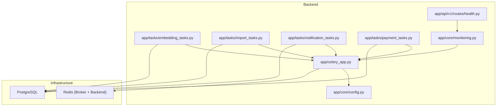
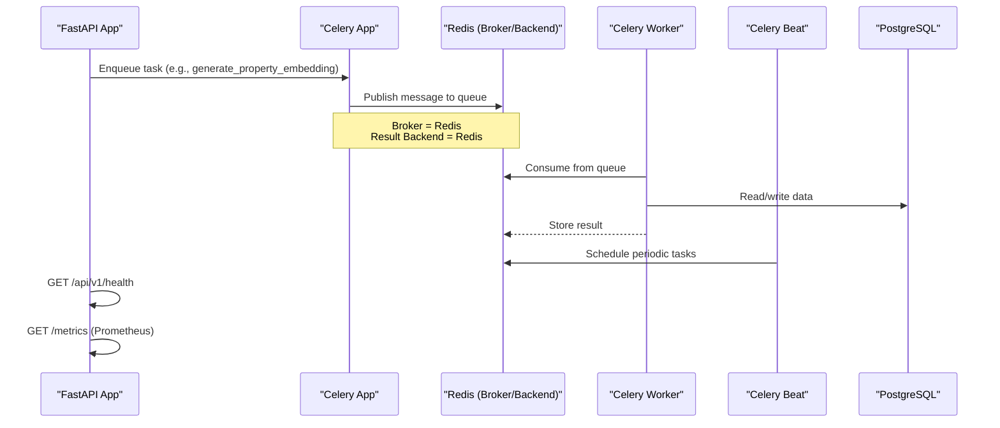
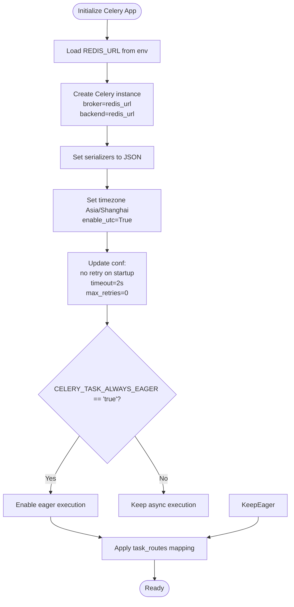
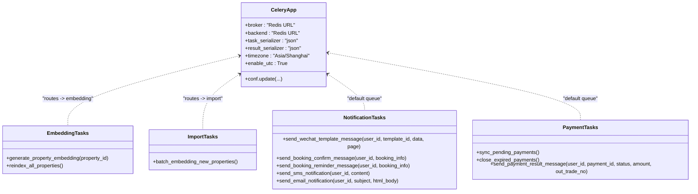
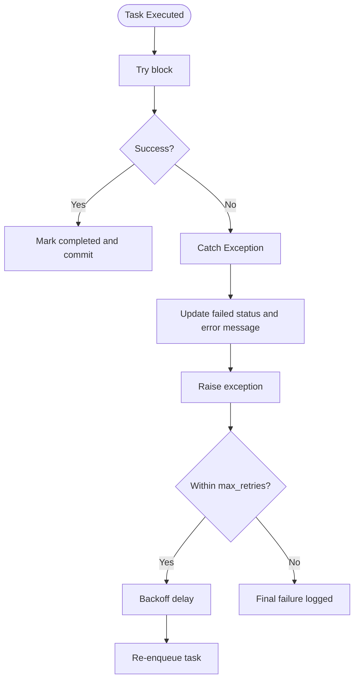
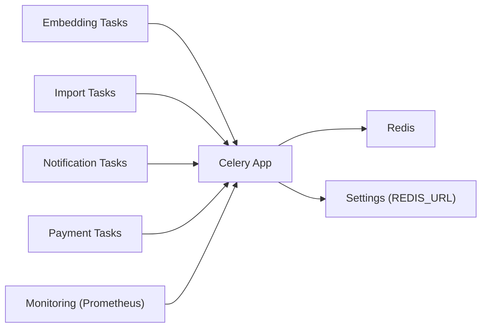

# Celery Setup & Configuration

<cite>
**Referenced Files in This Document**
- [celery_app.py](file://backend/app/celery_app.py)
- [config.py](file://backend/app/core/config.py)
- [embedding_tasks.py](file://backend/app/tasks/embedding_tasks.py)
- [import_tasks.py](file://backend/app/tasks/import_tasks.py)
- [notification_tasks.py](file://backend/app/tasks/notification_tasks.py)
- [payment_tasks.py](file://backend/app/tasks/payment_tasks.py)
- [monitoring.py](file://backend/app/core/monitoring.py)
- [docker-compose.yml](file://docker-compose.yml)
- [docker-compose.prod.yml](file://docker-compose.prod.yml)
- [health.py](file://backend/app/api/v1/routes/health.py)
- [conftest.py](file://backend/tests/conftest.py)
</cite>

## Table of Contents
1. [Introduction](#introduction)
2. [Project Structure](#project-structure)
3. [Core Components](#core-components)
4. [Architecture Overview](#architecture-overview)
5. [Detailed Component Analysis](#detailed-component-analysis)
6. [Dependency Analysis](#dependency-analysis)
7. [Performance Considerations](#performance-considerations)
8. [Troubleshooting Guide](#troubleshooting-guide)
9. [Conclusion](#conclusion)
10. [Appendices](#appendices)

## Introduction
This document explains how the application initializes and configures Celery, using Redis as both message broker and result backend. It covers connection settings, timeouts, retry policies, serialization formats, timezone and UTC behavior, environment-driven configuration for development versus production, task routing to dedicated queues, worker startup commands, process management, and health monitoring. It also provides guidance for customizing configuration across deployment environments.

## Project Structure
Celery-related code is organized under the backend package:
- Application initialization and global configuration live in a single module that creates the Celery app and updates its runtime configuration.
- Task modules define domain-specific tasks (embedding, import, notifications, payments).
- Monitoring integrates Prometheus metrics for HTTP requests and Celery tasks.
- Docker Compose files define services for Redis, the FastAPI backend, Celery workers, and Celery Beat scheduler.

**Diagram sources**
- [celery_app.py:1-31](file://backend/app/celery_app.py#L1-L31)
- [config.py:1-167](file://backend/app/core/config.py#L1-L167)
- [embedding_tasks.py:1-112](file://backend/app/tasks/embedding_tasks.py#L1-L112)
- [import_tasks.py:1-44](file://backend/app/tasks/import_tasks.py#L1-L44)
- [notification_tasks.py:1-217](file://backend/app/tasks/notification_tasks.py#L1-L217)
- [payment_tasks.py:1-241](file://backend/app/tasks/payment_tasks.py#L1-L241)
- [monitoring.py:1-227](file://backend/app/core/monitoring.py#L1-L227)
- [health.py:1-8](file://backend/app/api/v1/routes/health.py#L1-L8)

**Section sources**
- [celery_app.py:1-31](file://backend/app/celery_app.py#L1-L31)
- [config.py:1-167](file://backend/app/core/config.py#L1-L167)

## Core Components
- Celery App Initialization: The Celery application is created with Redis as both broker and result backend, JSON serialization, timezone set to Asia/Shanghai, and UTC enabled. Connection retry behavior and timeouts are configured at startup.
- Environment-Driven Settings: Redis URL is loaded from environment via a centralized settings object. Development vs production differences are controlled by environment variables.
- Task Routing: Tasks are routed to dedicated queues based on their module path patterns.
- Monitoring: Celery signal handlers collect task counts and latencies; a /metrics endpoint exposes Prometheus metrics.
- Health Check: A simple health endpoint is available for liveness checks.

Key behaviors:
- Broker and backend use the same Redis URL.
- Serialization format is JSON for tasks and results.
- Timezone is Asia/Shanghai with UTC enabled.
- Eager execution can be toggled via environment variables for local testing.
- Task routes map specific task modules to named queues.

**Section sources**
- [celery_app.py:9-30](file://backend/app/celery_app.py#L9-L30)
- [config.py:24](file://backend/app/core/config.py#L24)
- [monitoring.py:183-208](file://backend/app/core/monitoring.py#L183-L208)
- [health.py:6-8](file://backend/app/api/v1/routes/health.py#L6-L8)

## Architecture Overview
The system uses Redis as the central messaging backbone. The FastAPI application enqueues tasks into queues, while Celery workers consume them. Celery Beat schedules periodic tasks. Prometheus metrics provide observability.

**Diagram sources**
- [celery_app.py:9-30](file://backend/app/celery_app.py#L9-L30)
- [docker-compose.prod.yml:100-168](file://docker-compose.prod.yml#L100-L168)
- [monitoring.py:167-176](file://backend/app/core/monitoring.py#L167-L176)
- [health.py:6-8](file://backend/app/api/v1/routes/health.py#L6-L8)

## Detailed Component Analysis

### Celery App Initialization and Global Configuration
- Broker and Result Backend: Both point to the Redis URL provided by settings.
- Serialization: JSON is enforced for tasks and results.
- Timezone and UTC: Timezone is set to Asia/Shanghai; UTC is enabled.
- Startup Behavior:
  - No automatic broker retry on startup.
  - Short connection timeout and no retries on startup.
- Eager Execution: Controlled by environment variables CELERY_TASK_ALWAYS_EAGER and CELERY_TASK_EAGER_PROPAGATES. When true, tasks run synchronously within the caller process, useful for tests or local dev.
- Task Routing:
  - Tasks under embedding_tasks are routed to the embedding queue.
  - Tasks under import_tasks are routed to the import queue.
  - Other tasks default to the celery queue unless otherwise specified.

**Diagram sources**
- [celery_app.py:9-30](file://backend/app/celery_app.py#L9-L30)
- [config.py:24](file://backend/app/core/config.py#L24)

**Section sources**
- [celery_app.py:9-30](file://backend/app/celery_app.py#L9-L30)
- [config.py:24](file://backend/app/core/config.py#L24)

### Task Modules and Routing
- Embedding Tasks:
  - generate_property_embedding: Creates an embedding job record, calls embedding service, updates status, and logs outcomes. Uses async database access inside an event loop.
  - reindex_all_properties: Finds properties without embeddings and enqueues individual embedding tasks.
- Import Tasks:
  - batch_embedding_new_properties: Similar to reindex but imported from import_tasks; enqueues per-property embedding tasks.
- Notification Tasks:
  - send_wechat_template_message: Sends WeChat template messages asynchronously.
  - send_booking_confirm_message and send_booking_reminder_message: Convenience wrappers that enqueue template messages.
  - send_sms_notification and send_email_notification: Send SMS/email asynchronously.
- Payment Tasks:
  - sync_pending_payments: Periodic task to reconcile pending payments with payment provider.
  - close_expired_payments: Closes overdue payments locally and externally.
  - send_payment_result_message: Sends payment result notifications.

Routing rules:
- All tasks in embedding_tasks route to the embedding queue.
- All tasks in import_tasks route to the import queue.
- Other tasks (notifications, payments) default to the celery queue unless explicitly overridden.

**Diagram sources**
- [celery_app.py:26-29](file://backend/app/celery_app.py#L26-L29)
- [embedding_tasks.py:16-21](file://backend/app/tasks/embedding_tasks.py#L16-L21)
- [import_tasks.py:13-18](file://backend/app/tasks/import_tasks.py#L13-L18)
- [notification_tasks.py:53-58](file://backend/app/tasks/notification_tasks.py#L53-L58)
- [payment_tasks.py:80-85](file://backend/app/tasks/payment_tasks.py#L80-L85)

**Section sources**
- [embedding_tasks.py:16-21](file://backend/app/tasks/embedding_tasks.py#L16-L21)
- [import_tasks.py:13-18](file://backend/app/tasks/import_tasks.py#L13-L18)
- [notification_tasks.py:53-58](file://backend/app/tasks/notification_tasks.py#L53-L58)
- [payment_tasks.py:80-85](file://backend/app/tasks/payment_tasks.py#L80-L85)
- [celery_app.py:26-29](file://backend/app/celery_app.py#L26-L29)

### Retry Policies and Error Handling
- Per-task autoretry: Many tasks declare autoretry_for=(Exception,), retry_backoff=True, and max_retries values (commonly 3; some tasks use 2).
- Startup-level broker connection: No retries on startup and short timeout to fail fast during container orchestration.
- Task error handling: Tasks update job statuses and log exceptions before re-raising to trigger retries.

**Diagram sources**
- [embedding_tasks.py:70-76](file://backend/app/tasks/embedding_tasks.py#L70-L76)
- [notification_tasks.py:93-95](file://backend/app/tasks/notification_tasks.py#L93-L95)
- [payment_tasks.py:112-114](file://backend/app/tasks/payment_tasks.py#L112-L114)
- [celery_app.py:20-23](file://backend/app/celery_app.py#L20-L23)

**Section sources**
- [embedding_tasks.py:16-21](file://backend/app/tasks/embedding_tasks.py#L16-L21)
- [notification_tasks.py:53-58](file://backend/app/tasks/notification_tasks.py#L53-L58)
- [payment_tasks.py:80-85](file://backend/app/tasks/payment_tasks.py#L80-L85)
- [celery_app.py:20-23](file://backend/app/celery_app.py#L20-L23)

### Environment Variables and Deployment Modes
- REDIS_URL: Configures both broker and result backend. Defaults to a local Redis instance if not set.
- CELERY_TASK_ALWAYS_EAGER: When set to "true", tasks execute synchronously in-process. Useful for development and tests.
- CELERY_TASK_EAGER_PROPAGATES: When set to "true", exceptions raised in eager mode propagate to the caller.
- Tests: The test configuration sets eager execution and propagation flags to ensure deterministic behavior.

Environment examples:
- Development:
  - REDIS_URL points to localhost Redis.
  - CELERY_TASK_ALWAYS_EAGER=true and CELERY_TASK_EAGER_PROPAGATES=true enable synchronous execution for quick feedback.
- Production:
  - REDIS_URL points to managed Redis with authentication.
  - Eager flags unset or false to use asynchronous processing.

**Section sources**
- [config.py:24](file://backend/app/core/config.py#L24)
- [celery_app.py:24-25](file://backend/app/celery_app.py#L24-L25)
- [conftest.py:6-7](file://backend/tests/conftest.py#L6-L7)

### Worker Startup Commands and Process Management
- Docker Compose defines:
  - Redis service with persistence and memory limits.
  - Celery worker consuming multiple queues (celery, embedding, import) with concurrency control.
  - Celery Beat for scheduled tasks.
- Local development:
  - Use docker compose up to start Redis and other dependencies.
  - Run the FastAPI server separately and Celery worker with appropriate command-line options.

Example commands (as defined in production compose):
- Worker:
  - celery -A app.celery_app worker --loglevel=info --concurrency=4 --queues=celery,embedding,import
- Beat:
  - celery -A app.celery_app beat --loglevel=info

Process management recommendations:
- Use container orchestrators (Docker Compose, Kubernetes) to manage restarts and scaling.
- Monitor resource limits and adjust concurrency based on workload characteristics.

**Section sources**
- [docker-compose.yml:29-46](file://docker-compose.yml#L29-L46)
- [docker-compose.prod.yml:100-168](file://docker-compose.prod.yml#L100-L168)

### Health Monitoring and Observability
- Health Endpoint:
  - GET /api/v1/health returns a simple status response for liveness probes.
- Metrics Endpoint:
  - GET /metrics serves Prometheus metrics including request counters, latency histograms, and Celery task metrics.
- Celery Metrics:
  - Signal handlers track task count and duration via Prometheus metrics.

Operational tips:
- Integrate health checks into load balancers and orchestrators.
- Scrape /metrics with Prometheus and visualize in Grafana.

**Section sources**
- [health.py:6-8](file://backend/app/api/v1/routes/health.py#L6-L8)
- [monitoring.py:167-176](file://backend/app/core/monitoring.py#L167-L176)
- [monitoring.py:183-208](file://backend/app/core/monitoring.py#L183-L208)

## Dependency Analysis
- Celery depends on:
  - Redis for broker and result backend.
  - Database for persistent state (via SQLAlchemy async engine).
- Task modules depend on:
  - Services and models for business logic and persistence.
- Monitoring depends on:
  - Optional prometheus-client library; gracefully degrades when unavailable.

**Diagram sources**
- [celery_app.py:9-30](file://backend/app/celery_app.py#L9-L30)
- [config.py:24](file://backend/app/core/config.py#L24)
- [monitoring.py:183-208](file://backend/app/core/monitoring.py#L183-L208)

**Section sources**
- [celery_app.py:9-30](file://backend/app/celery_app.py#L9-L30)
- [config.py:24](file://backend/app/core/config.py#L24)
- [monitoring.py:183-208](file://backend/app/core/monitoring.py#L183-L208)

## Performance Considerations
- Concurrency: Adjust worker concurrency based on CPU cores and I/O characteristics. The production compose sets concurrency to 4.
- Queues: Separate long-running tasks (embedding, import) onto dedicated queues to prevent contention with short-lived tasks.
- Retries: Use backoff and bounded max_retries to avoid overwhelming external services.
- Timeouts: Short broker connection timeouts help fail fast during startup; tune based on network reliability.
- Memory Limits: Redis memory policy and limits are configured to protect against unbounded growth.

[No sources needed since this section provides general guidance]

## Troubleshooting Guide
- Redis connectivity issues:
  - Verify REDIS_URL and network reachability.
  - Check Redis healthcheck and logs.
- Eager execution confusion:
  - Ensure CELERY_TASK_ALWAYS_EAGER and CELERY_TASK_EAGER_PROPAGATES are only enabled in development/test.
- Task routing mismatches:
  - Confirm task module paths match routing rules.
  - Ensure workers subscribe to required queues.
- Health and metrics:
  - Validate /api/v1/health responds with ok.
  - Confirm /metrics is accessible and includes Celery metrics.

**Section sources**
- [docker-compose.yml:29-46](file://docker-compose.yml#L29-L46)
- [celery_app.py:24-25](file://backend/app/celery_app.py#L24-L25)
- [celery_app.py:26-29](file://backend/app/celery_app.py#L26-L29)
- [health.py:6-8](file://backend/app/api/v1/routes/health.py#L6-L8)
- [monitoring.py:167-176](file://backend/app/core/monitoring.py#L167-L176)

## Conclusion
The application’s Celery setup is concise and robust: Redis-backed broker and backend, JSON serialization, explicit timezone and UTC settings, environment-driven eager execution, and clear task routing to specialized queues. Workers and Beat are orchestrated via Docker Compose, and Prometheus metrics plus a health endpoint provide essential observability. For production, focus on tuning concurrency, queue distribution, retry/backoff strategies, and monitoring.

[No sources needed since this section summarizes without analyzing specific files]

## Appendices

### Example Environment Customization
- Development:
  - REDIS_URL=redis://localhost:6379/0
  - CELERY_TASK_ALWAYS_EAGER=true
  - CELERY_TASK_EAGER_PROPAGATES=true
- Production:
  - REDIS_URL=redis://:${REDIS_PASSWORD}@redis:6379/0
  - CELERY_TASK_ALWAYS_EAGER=false (or unset)
  - CELERY_TASK_EAGER_PROPAGATES=false (or unset)

**Section sources**
- [config.py:24](file://backend/app/core/config.py#L24)
- [docker-compose.prod.yml:77](file://docker-compose.prod.yml#L77)
- [docker-compose.prod.yml:111](file://docker-compose.prod.yml#L111)
- [conftest.py:6-7](file://backend/tests/conftest.py#L6-L7)