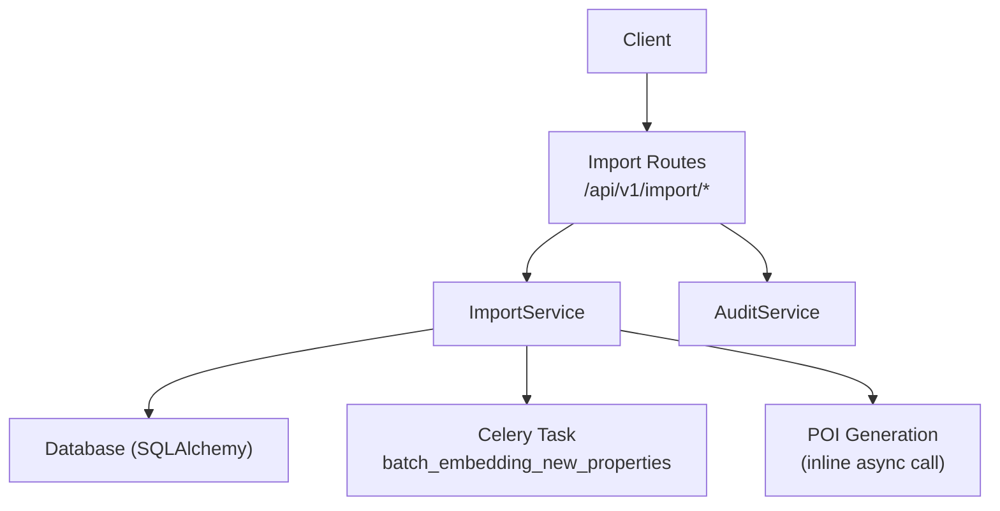
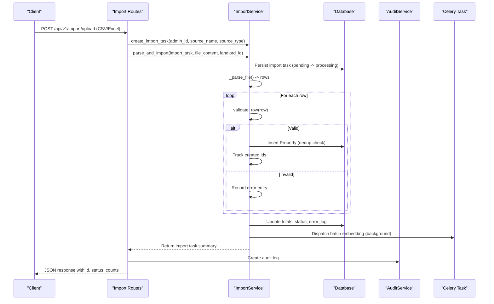
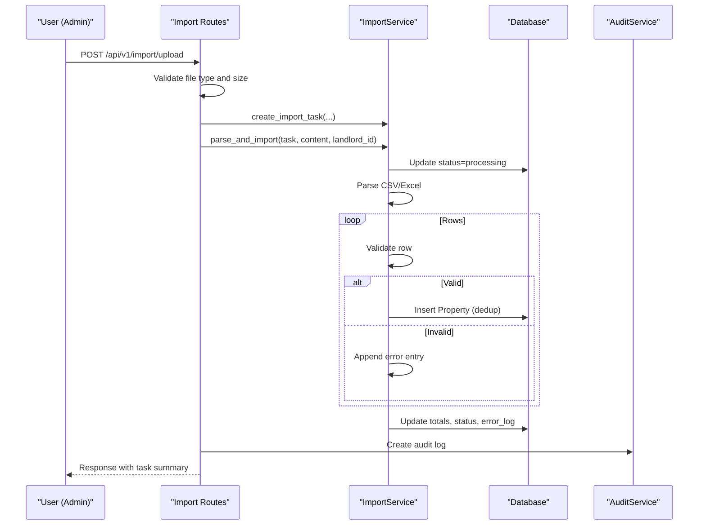
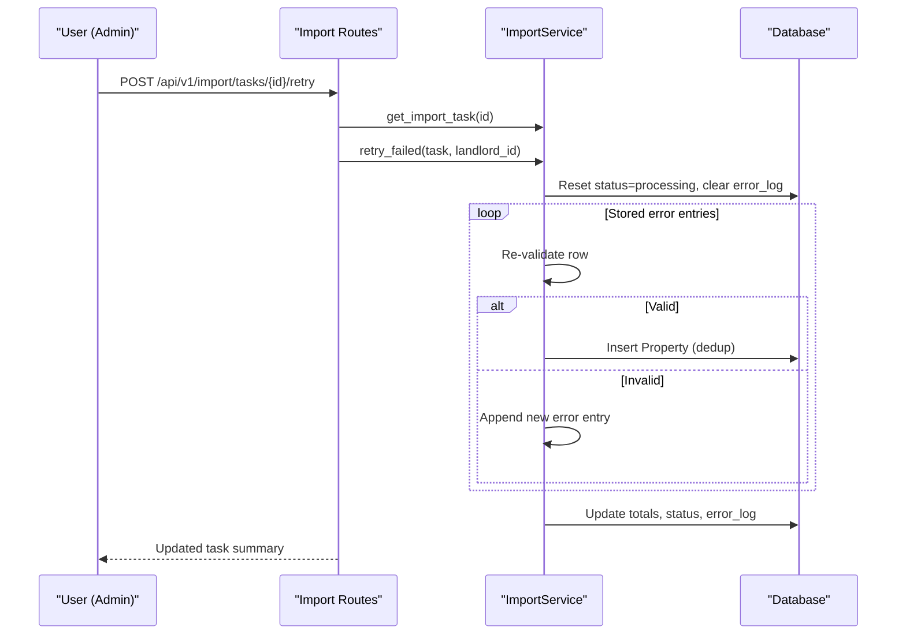
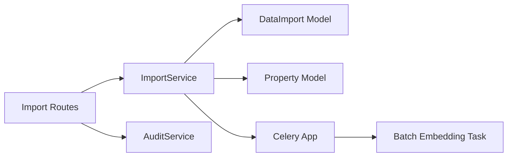

# Data Import Processing

<cite>
**Referenced Files in This Document**
- [imports.py](file://backend/app/api/v1/routes/imports.py)
- [import_service.py](file://backend/app/services/import_service.py)
- [data_import.py](file://backend/app/models/data_import.py)
- [property.py](file://backend/app/models/property.py)
- [import_tasks.py](file://backend/app/tasks/import_tasks.py)
- [celery_app.py](file://backend/app/celery_app.py)
- [audit_service.py](file://backend/app/services/audit_service.py)
- [test_import.py](file://backend/tests/test_import.py)
</cite>

## Table of Contents
1. [Introduction](#introduction)
2. [Project Structure](#project-structure)
3. [Core Components](#core-components)
4. [Architecture Overview](#architecture-overview)
5. [Detailed Component Analysis](#detailed-component-analysis)
6. [Dependency Analysis](#dependency-analysis)
7. [Performance Considerations](#performance-considerations)
8. [Troubleshooting Guide](#troubleshooting-guide)
9. [Conclusion](#conclusion)
10. [Appendices](#appendices)

## Introduction
This document explains the data import background tasks for bulk property data ingestion from CSV and Excel files. It covers file processing workflows, validation and transformation rules, field mapping, duplicate detection, progress tracking, error handling, retry mechanisms, and post-import automation (embedding and POI generation). It also documents the import job lifecycle from upload to completion with status updates and audit logging.

## Project Structure
The import feature spans API routes, a service layer, Celery tasks, models, and tests:
- API endpoints accept uploads, create import tasks, and return results.
- The service parses and validates rows, persists properties, tracks counts, and dispatches background jobs.
- Models define import task state and property schema.
- Celery tasks handle batch embedding of newly imported properties.
- Tests validate authorization, parsing, validation, duplicates, listing, detail retrieval, and retry flows.

**Diagram sources**
- [imports.py:39-91](file://backend/app/api/v1/routes/imports.py#L39-L91)
- [import_service.py:77-136](file://backend/app/services/import_service.py#L77-L136)
- [import_tasks.py:13-43](file://backend/app/tasks/import_tasks.py#L13-L43)
- [audit_service.py:11-32](file://backend/app/services/audit_service.py#L11-L32)

**Section sources**
- [imports.py:1-194](file://backend/app/api/v1/routes/imports.py#L1-L194)
- [import_service.py:1-403](file://backend/app/services/import_service.py#L1-L403)
- [data_import.py:1-53](file://backend/app/models/data_import.py#L1-L53)
- [property.py:1-86](file://backend/app/models/property.py#L1-L86)
- [import_tasks.py:1-44](file://backend/app/tasks/import_tasks.py#L1-L44)
- [celery_app.py:1-31](file://backend/app/celery_app.py#L1-L31)
- [audit_service.py:1-55](file://backend/app/services/audit_service.py#L1-L55)
- [test_import.py:1-376](file://backend/tests/test_import.py#L1-L376)

## Core Components
- Import API routes: Validate uploads, create import tasks, parse and import, list tasks, get details, retry failed records, and log audit events.
- Import service: Parse CSV/Excel, validate rows, enforce business rules, deduplicate by title+address, persist properties, track success/failure counts, update status, and dispatch background tasks.
- Import model: Tracks import task metadata, status, counts, and error logs.
- Property model: Defines validated fields, constraints, and indexes used during import.
- Celery integration: Configures queues and task routing; enqueues batch embedding for new properties.
- Audit service: Records import actions with details for compliance and traceability.

**Section sources**
- [imports.py:39-91](file://backend/app/api/v1/routes/imports.py#L39-L91)
- [import_service.py:34-136](file://backend/app/services/import_service.py#L34-L136)
- [data_import.py:10-53](file://backend/app/models/data_import.py#L10-L53)
- [property.py:24-86](file://backend/app/models/property.py#L24-L86)
- [celery_app.py:9-31](file://backend/app/celery_app.py#L9-L31)
- [audit_service.py:11-32](file://backend/app/services/audit_service.py#L11-L32)

## Architecture Overview
End-to-end flow from upload to completion:

**Diagram sources**
- [imports.py:39-91](file://backend/app/api/v1/routes/imports.py#L39-L91)
- [import_service.py:77-136](file://backend/app/services/import_service.py#L77-L136)
- [import_tasks.py:13-43](file://backend/app/tasks/import_tasks.py#L13-L43)
- [audit_service.py:11-32](file://backend/app/services/audit_service.py#L11-L32)

## Detailed Component Analysis

### Import API Routes
Responsibilities:
- Enforce admin-only access for import operations.
- Validate file type and size.
- Map file extension to source type (csv or excel).
- Create import task, process file, and respond with summary.
- Provide endpoints to list tasks, fetch task detail, and retry failed records.
- Log audit entries for import actions.

Key behaviors:
- Allowed extensions: .csv, .xlsx, .xls.
- Maximum upload size enforced at route level.
- Error responses for unauthorized, forbidden, unsupported types, and not found.

**Section sources**
- [imports.py:17-37](file://backend/app/api/v1/routes/imports.py#L17-L37)
- [imports.py:39-91](file://backend/app/api/v1/routes/imports.py#L39-L91)
- [imports.py:94-152](file://backend/app/api/v1/routes/imports.py#L94-L152)
- [imports.py:155-193](file://backend/app/api/v1/routes/imports.py#L155-L193)

### Import Service
Responsibilities:
- Create and retrieve import tasks.
- Parse CSV and Excel into normalized rows.
- Validate required and optional fields, enforce business rules.
- Deduplicate by title + address.
- Persist properties and track success/failure counts.
- Update import task status and error logs.
- Dispatch background tasks for embeddings and POI generation.

Parsing:
- CSV: UTF-8 with BOM support, header normalization (strip/lowercase), value trimming.
- Excel: Uses openpyxl; reads active sheet; normalizes headers; skips empty rows.

Validation rules:
- Required fields: title, address, district, price_monthly.
- Optional fields: description, area_sqm, bedrooms, bathrooms, property_type, latitude, longitude, status.
- Business logic:
  - Non-negative price_monthly.
  - Positive area_sqm if provided.
  - Non-negative integers for bedrooms/bathrooms.
  - Enumerated values for property_type and status must be valid.
  - Latitude range [-90, 90], longitude range [-180, 180].
  - Duplicate detection by title + address raises an error for that row.

Post-processing:
- On successful inserts, dispatch batch embedding via Celery and generate POIs per property.

Error handling:
- Row-level errors are captured with row number and message.
- Global exceptions mark the task as failed and store error log.
- Retry endpoint reprocesses only previously failed rows using stored error entries.

**Section sources**
- [import_service.py:34-136](file://backend/app/services/import_service.py#L34-L136)
- [import_service.py:187-231](file://backend/app/services/import_service.py#L187-L231)
- [import_service.py:233-323](file://backend/app/services/import_service.py#L233-L323)
- [import_service.py:325-356](file://backend/app/services/import_service.py#L325-L356)
- [import_service.py:357-402](file://backend/app/services/import_service.py#L357-L402)
- [import_service.py:138-183](file://backend/app/services/import_service.py#L138-L183)

### Import Model
Defines:
- Source type enum: csv, excel, api.
- Status enum: pending, processing, completed, failed.
- Import task fields: admin_id, source_name, source_type, status, total_records, success_records, failed_records, error_log, timestamps.

Usage:
- Created on upload, updated during processing, finalized with counts and status.
- Error log stores JSON array of row-level failures.

**Section sources**
- [data_import.py:10-53](file://backend/app/models/data_import.py#L10-L53)

### Property Model
Defines:
- Enums for property_type and property_status.
- Constraints ensuring non-negative price, positive area, non-negative rooms.
- Indexes for district/status and other query patterns.
- Fields populated by import validation and mapping.

**Section sources**
- [property.py:24-86](file://backend/app/models/property.py#L24-L86)

### Celery Integration
Configuration:
- Broker and backend use Redis URL from settings.
- Task serialization set to JSON.
- Route mapping assigns import-related tasks to dedicated queue.

Tasks:
- Batch embedding task queries properties without embeddings and enqueues individual embedding tasks.

**Section sources**
- [celery_app.py:9-31](file://backend/app/celery_app.py#L9-L31)
- [import_tasks.py:13-43](file://backend/app/tasks/import_tasks.py#L13-L43)

### Audit Logging
Records:
- User action, resource type, resource id, and details including import summary.

Integration:
- After upload completes, an audit log is created with import metrics.

**Section sources**
- [audit_service.py:11-32](file://backend/app/services/audit_service.py#L11-L32)
- [imports.py:68-80](file://backend/app/api/v1/routes/imports.py#L68-L80)

### End-to-End Sequence Diagrams

#### Upload and Process Flow

**Diagram sources**
- [imports.py:39-91](file://backend/app/api/v1/routes/imports.py#L39-L91)
- [import_service.py:77-136](file://backend/app/services/import_service.py#L77-L136)
- [audit_service.py:11-32](file://backend/app/services/audit_service.py#L11-L32)

#### Retry Failed Records Flow

**Diagram sources**
- [imports.py:155-193](file://backend/app/api/v1/routes/imports.py#L155-L193)
- [import_service.py:138-183](file://backend/app/services/import_service.py#L138-L183)

### Validation Rules and Field Mapping
- Required fields: title, address, district, price_monthly.
- Optional fields: description, area_sqm, bedrooms, bathrooms, property_type, latitude, longitude, status.
- Type conversions:
  - price_monthly: Decimal, non-negative.
  - area_sqm: Decimal, positive if present.
  - bedrooms/bathrooms: Integer, non-negative if present.
  - property_type/status: Enum values validated against allowed sets.
  - latitude/longitude: Decimal within geographic ranges if both present.
- Normalization:
  - Header names stripped and lowercased.
  - Values trimmed; empty strings handled gracefully.
- Deduplication:
  - Title + address uniqueness enforced; duplicates cause row failure.

**Section sources**
- [import_service.py:18-31](file://backend/app/services/import_service.py#L18-L31)
- [import_service.py:233-323](file://backend/app/services/import_service.py#L233-L323)
- [import_service.py:325-356](file://backend/app/services/import_service.py#L325-L356)

### Progress Tracking and Status Updates
- Status transitions:
  - pending -> processing when parse_and_import starts.
  - completed when processing finishes (even if some rows failed).
  - failed on global exceptions.
- Counts:
  - total_records set after parsing.
  - success_records incremented per valid insert.
  - failed_records incremented per validation/dedup error.
- Error log:
  - JSON array of {row, error} entries for failed rows.

**Section sources**
- [import_service.py:77-136](file://backend/app/services/import_service.py#L77-L136)
- [data_import.py:16-53](file://backend/app/models/data_import.py#L16-L53)

### Chunked Processing and Memory Optimization
Current implementation:
- Parses entire file into memory (CSV via StringIO, Excel via openpyxl read_only).
- Iterates rows sequentially and persists with flush to avoid large transaction buffers.
- No explicit chunking strategy implemented.

Recommendations for large files:
- Implement chunked reading for CSV (e.g., fixed-size batches) and commit per chunk.
- For Excel, consider streaming parsers or converting to CSV server-side before import.
- Use database transactions per chunk to limit rollback scope.
- Monitor memory usage and adjust chunk sizes accordingly.

[No sources needed since this section provides general guidance]

### Error Handling, Duplicate Detection, and Rollback
- Row-level errors:
  - Captured with row index and message; do not abort entire import.
- Duplicate detection:
  - By title + address; duplicates raise ValueError and increment failed count.
- Rollback behavior:
  - Successful inserts are flushed but not committed until end of import.
  - On global exception, status set to failed and error log recorded; no partial commits occur.
- Retry mechanism:
  - Only previously failed rows are reprocessed; successful rows remain unchanged.

**Section sources**
- [import_service.py:103-136](file://backend/app/services/import_service.py#L103-L136)
- [import_service.py:325-356](file://backend/app/services/import_service.py#L325-L356)
- [import_service.py:138-183](file://backend/app/services/import_service.py#L138-L183)

### File Formats, Encoding, and Character Set Conversion
- Supported formats:
  - CSV (.csv)
  - Excel (.xlsx, .xls)
- Encoding:
  - CSV decoding uses UTF-8 with BOM support.
- Character set conversion:
  - Headers normalized to lowercase and stripped; values trimmed.
  - Excel values converted to strings and trimmed.

**Section sources**
- [imports.py:13-36](file://backend/app/api/v1/routes/imports.py#L13-L36)
- [import_service.py:195-231](file://backend/app/services/import_service.py#L195-L231)

### Post-Import Automation
- Batch embedding:
  - Enqueued via Celery to generate embeddings for properties lacking them.
- POI generation:
  - Inline async calls iterate newly created property IDs and generate POIs.

**Section sources**
- [import_service.py:357-402](file://backend/app/services/import_service.py#L357-L402)
- [import_tasks.py:13-43](file://backend/app/tasks/import_tasks.py#L13-L43)

## Dependency Analysis
Component relationships:
- API depends on ImportService and AuditService.
- ImportService depends on DataImport and Property models, and dispatches Celery tasks.
- Celery app configures task routing and queues.
- Tests exercise API endpoints and assert expected behaviors.

**Diagram sources**
- [imports.py:39-91](file://backend/app/api/v1/routes/imports.py#L39-L91)
- [import_service.py:77-136](file://backend/app/services/import_service.py#L77-L136)
- [celery_app.py:9-31](file://backend/app/celery_app.py#L9-L31)
- [import_tasks.py:13-43](file://backend/app/tasks/import_tasks.py#L13-L43)

**Section sources**
- [imports.py:1-194](file://backend/app/api/v1/routes/imports.py#L1-L194)
- [import_service.py:1-403](file://backend/app/services/import_service.py#L1-L403)
- [celery_app.py:1-31](file://backend/app/celery_app.py#L1-L31)
- [import_tasks.py:1-44](file://backend/app/tasks/import_tasks.py#L1-L44)

## Performance Considerations
- Current approach loads entire files into memory; suitable for moderate-sized imports.
- For large datasets:
  - Introduce chunked processing and periodic commits.
  - Stream Excel parsing or pre-process to CSV.
  - Tune database connection pool and transaction boundaries.
  - Monitor Celery worker capacity for embedding and POI tasks.

[No sources needed since this section provides general guidance]

## Troubleshooting Guide
Common issues and resolutions:
- Unauthorized or forbidden:
  - Ensure request includes admin bearer token.
- Unsupported file type:
  - Use .csv, .xlsx, or .xls.
- Missing required fields:
  - Include title, address, district, price_monthly.
- Invalid numeric values:
  - Ensure price_monthly is numeric and non-negative; area_sqm positive if present; bedrooms/bathrooms non-negative integers.
- Invalid enums:
  - Use allowed property_type and status values.
- Duplicates:
  - Remove or modify rows with identical title + address.
- Large files:
  - Split into smaller chunks or convert Excel to CSV.

Monitoring and inspection:
- List tasks and filter by status.
- Fetch task detail to review error_log entries.
- Retry failed records endpoint to reprocess corrected rows.

**Section sources**
- [test_import.py:8-33](file://backend/tests/test_import.py#L8-L33)
- [test_import.py:44-78](file://backend/tests/test_import.py#L44-L78)
- [test_import.py:80-111](file://backend/tests/test_import.py#L80-L111)
- [test_import.py:113-144](file://backend/tests/test_import.py#L113-L144)
- [test_import.py:146-170](file://backend/tests/test_import.py#L146-L170)
- [test_import.py:172-211](file://backend/tests/test_import.py#L172-L211)
- [test_import.py:213-251](file://backend/tests/test_import.py#L213-L251)
- [test_import.py:253-277](file://backend/tests/test_import.py#L253-L277)
- [test_import.py:279-312](file://backend/tests/test_import.py#L279-L312)
- [test_import.py:314-339](file://backend/tests/test_import.py#L314-L339)
- [test_import.py:341-376](file://backend/tests/test_import.py#L341-L376)

## Conclusion
The import system provides a robust pipeline for bulk property ingestion from CSV and Excel files. It enforces strict validation and business rules, detects duplicates, tracks progress, and supports retry of failed rows. Background tasks automate embedding and POI generation. For very large files, adopting chunked processing and streaming will improve scalability and memory efficiency.

[No sources needed since this section summarizes without analyzing specific files]

## Appendices

### Example: Preparing Import Files
- CSV format:
  - Columns: title, address, district, price_monthly (required); optional columns include description, area_sqm, bedrooms, bathrooms, property_type, latitude, longitude, status.
  - Ensure numeric fields are valid and enums match allowed values.
- Excel format:
  - First row contains headers; subsequent rows contain data.
  - Active sheet is used; empty rows are skipped.

[No sources needed since this section provides general guidance]

### Example: Monitoring Import Progress
- List all import tasks with pagination and optional status filter.
- Retrieve detailed view of a specific task to inspect counts and error_log.
- Retry failed records to reprocess corrected rows.

**Section sources**
- [imports.py:94-152](file://backend/app/api/v1/routes/imports.py#L94-L152)
- [imports.py:155-193](file://backend/app/api/v1/routes/imports.py#L155-L193)