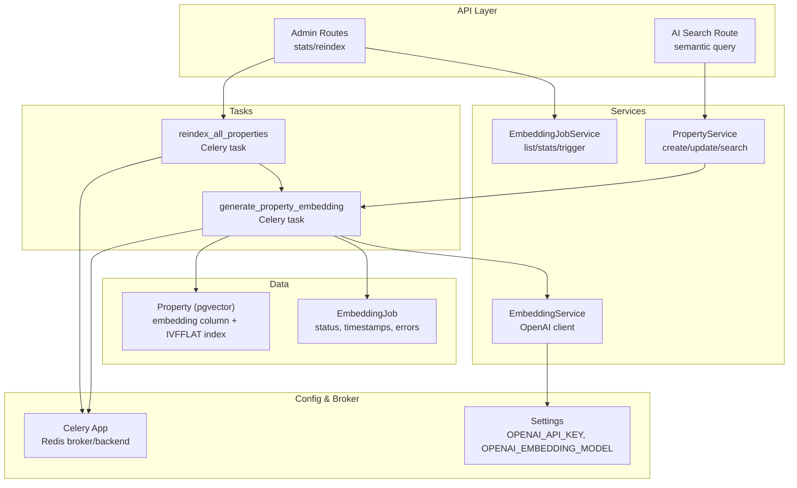
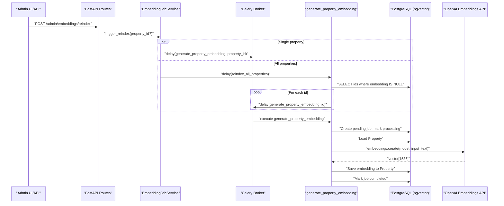
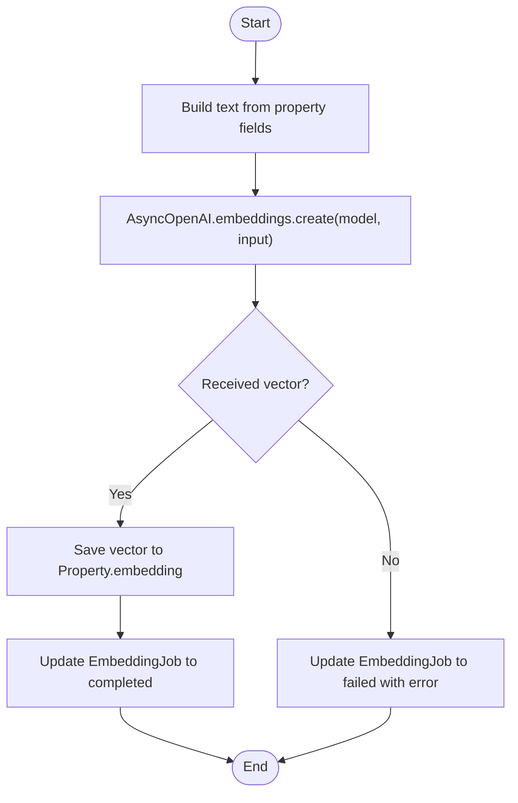
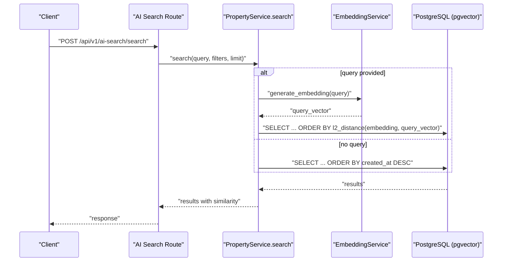
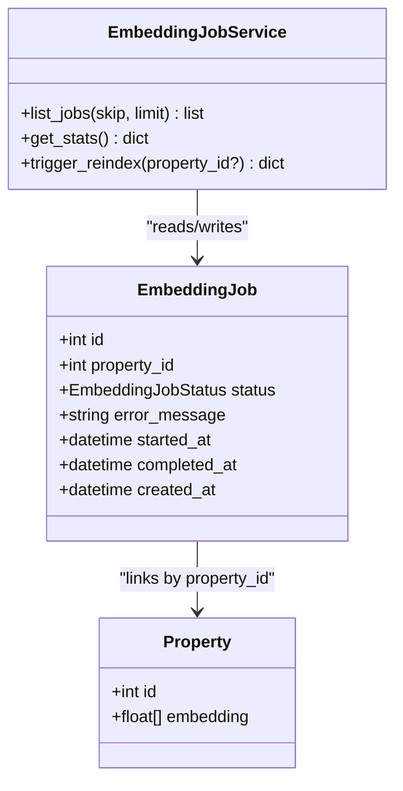
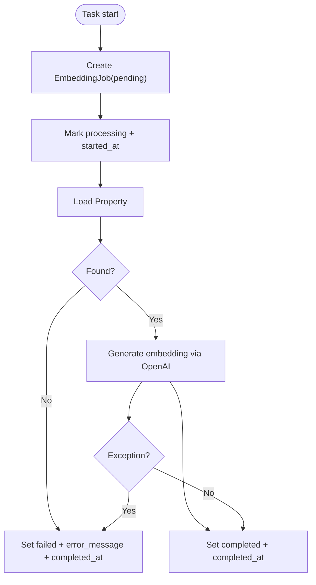
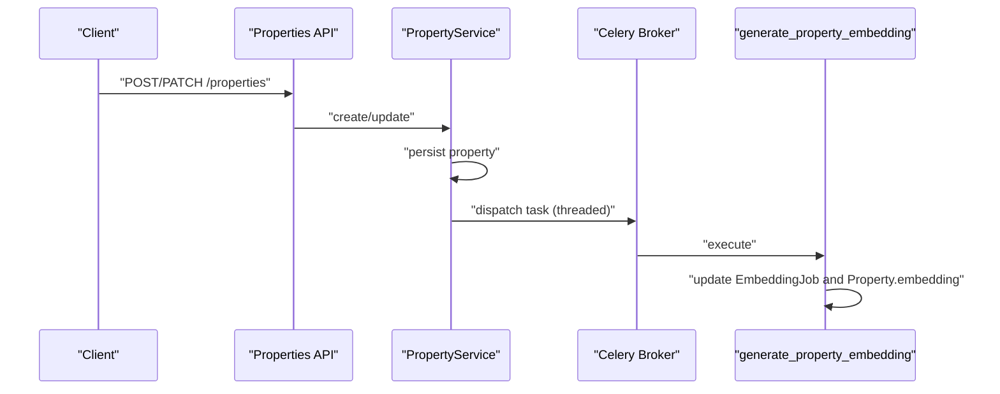
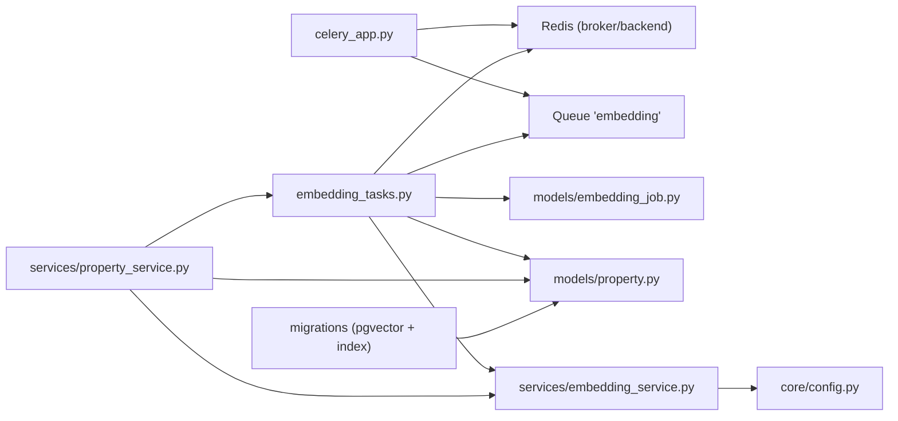

# Embedding Generation Tasks

<cite>
**Referenced Files in This Document**
- [embedding_tasks.py](file://backend/app/tasks/embedding_tasks.py)
- [embedding_service.py](file://backend/app/services/embedding_service.py)
- [embedding_job_service.py](file://backend/app/services/embedding_job_service.py)
- [embedding_job.py](file://backend/app/models/embedding_job.py)
- [property.py](file://backend/app/models/property.py)
- [property_service.py](file://backend/app/services/property_service.py)
- [celery_app.py](file://backend/app/celery_app.py)
- [config.py](file://backend/app/core/config.py)
- [20260620_0002_pgvector_embedding.py](file://backend/alembic/versions/20260620_0002_pgvector_embedding.py)
- [20260620_0005_embedding_jobs_and_audit_logs.py](file://backend/alembic/versions/20260620_0005_embedding_jobs_and_audit_logs.py)
- [ai_search.py](file://backend/app/api/v1/routes/ai_search.py)
- [test_admin.py](file://backend/tests/test_admin.py)
</cite>

## Table of Contents
1. Introduction
2. Project Structure
3. Core Components
4. Architecture Overview
5. Detailed Component Analysis
6. Dependency Analysis
7. Performance Considerations
8. Troubleshooting Guide
9. Conclusion
10. Appendices

## Introduction
This document explains the embedding generation background tasks for property descriptions and how they enable semantic search. It covers:
- The end-to-end workflow from property updates to vector embeddings stored in PostgreSQL with pgvector
- OpenAI API integration for generating 1536-dimensional vectors
- Background task orchestration via Celery, including retries and error handling
- Batch reindexing capabilities and progress tracking through job records
- Relationship between embedding jobs and property updates
- Task parameters, result storage, status monitoring, and performance considerations for large datasets

## Project Structure
The embedding feature spans models, services, tasks, migrations, and configuration:
- Models define the Property entity (with a vector column) and EmbeddingJob state machine
- Services encapsulate OpenAI embedding calls and job management
- Celery tasks perform asynchronous embedding generation and bulk reindexing
- Migrations add pgvector extension, index, and job tables
- Configuration provides OpenAI keys and model names
- Admin endpoints expose stats and reindex triggers

**Diagram sources**
- [embedding_tasks.py:16-80](file://backend/app/tasks/embedding_tasks.py#L16-L80)
- [embedding_tasks.py:83-111](file://backend/app/tasks/embedding_tasks.py#L83-L111)
- [embedding_service.py:17-32](file://backend/app/services/embedding_service.py#L17-L32)
- [embedding_job_service.py:7-54](file://backend/app/services/embedding_job_service.py#L7-L54)
- [property_service.py:48-61](file://backend/app/services/property_service.py#L48-L61)
- [property_service.py:91-195](file://backend/app/services/property_service.py#L91-L195)
- [property.py:38-86](file://backend/app/models/property.py#L38-L86)
- [embedding_job.py:17-35](file://backend/app/models/embedding_job.py#L17-L35)
- [celery_app.py:9-30](file://backend/app/celery_app.py#L9-L30)
- [config.py:46-53](file://backend/app/core/config.py#L46-L53)

**Section sources**
- [embedding_tasks.py:16-111](file://backend/app/tasks/embedding_tasks.py#L16-L111)
- [embedding_service.py:17-32](file://backend/app/services/embedding_service.py#L17-L32)
- [embedding_job_service.py:7-54](file://backend/app/services/embedding_job_service.py#L7-L54)
- [property_service.py:48-61](file://backend/app/services/property_service.py#L48-L61)
- [property_service.py:91-195](file://backend/app/services/property_service.py#L91-L195)
- [property.py:38-86](file://backend/app/models/property.py#L38-L86)
- [embedding_job.py:17-35](file://backend/app/models/embedding_job.py#L17-L35)
- [celery_app.py:9-30](file://backend/app/celery_app.py#L9-L30)
- [config.py:46-53](file://backend/app/core/config.py#L46-L53)

## Core Components
- EmbeddingService: Builds text from property fields and calls OpenAI embeddings API to produce a 1536-dim vector.
- generate_property_embedding (Celery): Creates an EmbeddingJob, marks processing, fetches Property, generates embedding, persists it, and updates job status.
- reindex_all_properties (Celery): Finds properties without embeddings and enqueues individual embedding tasks.
- EmbeddingJobService: Lists jobs and returns aggregated stats; can trigger single or full reindex.
- PropertyService: Dispatches embedding tasks on create/update and performs semantic search using pgvector l2_distance.
- Models: Property includes a VectorColumn mapped to pgvector; EmbeddingJob tracks lifecycle states and errors.
- Celery App: Configured with Redis broker/backend and routes embedding tasks to a dedicated queue.
- Settings: Provides OpenAI API key and embedding model name.

**Section sources**
- [embedding_service.py:17-32](file://backend/app/services/embedding_service.py#L17-L32)
- [embedding_tasks.py:16-80](file://backend/app/tasks/embedding_tasks.py#L16-L80)
- [embedding_tasks.py:83-111](file://backend/app/tasks/embedding_tasks.py#L83-L111)
- [embedding_job_service.py:7-54](file://backend/app/services/embedding_job_service.py#L7-L54)
- [property_service.py:48-61](file://backend/app/services/property_service.py#L48-L61)
- [property_service.py:91-195](file://backend/app/services/property_service.py#L91-L195)
- [property.py:38-86](file://backend/app/models/property.py#L38-L86)
- [embedding_job.py:17-35](file://backend/app/models/embedding_job.py#L17-L35)
- [celery_app.py:9-30](file://backend/app/celery_app.py#L9-L30)
- [config.py:46-53](file://backend/app/core/config.py#L46-L53)

## Architecture Overview
The system uses a producer-consumer pattern:
- Producers: PropertyService dispatches tasks on create/update; admin routes trigger single or full reindex.
- Consumers: Celery workers execute embedding tasks, call OpenAI, persist results, and update job status.
- Storage: PostgreSQL with pgvector stores embeddings and supports similarity search via IVFFLAT index.

**Diagram sources**
- [embedding_job_service.py:45-54](file://backend/app/services/embedding_job_service.py#L45-L54)
- [embedding_tasks.py:83-111](file://backend/app/tasks/embedding_tasks.py#L83-L111)
- [embedding_tasks.py:16-80](file://backend/app/tasks/embedding_tasks.py#L16-L80)
- [embedding_service.py:23-32](file://backend/app/services/embedding_service.py#L23-L32)
- [property.py:78](file://backend/app/models/property.py#L78)
- [20260620_0002_pgvector_embedding.py:21-35](file://backend/alembic/versions/20260620_0002_pgvector_embedding.py#L21-L35)

## Detailed Component Analysis

### Property Description Embedding Workflow
- Input: Property fields (title, description, address, district, property_type).
- Text assembly: Concatenates non-empty fields into a single string.
- Embedding call: AsyncOpenAI.embeddings.create with configured model.
- Persistence: Writes vector to Property.embedding and updates EmbeddingJob to completed.

**Diagram sources**
- [embedding_service.py:6-14](file://backend/app/services/embedding_service.py#L6-L14)
- [embedding_service.py:23-32](file://backend/app/services/embedding_service.py#L23-L32)
- [embedding_tasks.py:40-76](file://backend/app/tasks/embedding_tasks.py#L40-L76)

**Section sources**
- [embedding_service.py:6-14](file://backend/app/services/embedding_service.py#L6-L14)
- [embedding_service.py:23-32](file://backend/app/services/embedding_service.py#L23-L32)
- [embedding_tasks.py:40-76](file://backend/app/tasks/embedding_tasks.py#L40-L76)

### Semantic Search Using Vectors
- Query construction: Combines user query, district, keywords into a single text.
- Embedding query: Generates a vector for the query text.
- Similarity search: Uses pgvector l2_distance over Property.embedding with IVFFLAT index.
- Result ordering: Sorted by similarity; non-vector queries bypass vector path and use filters.

**Diagram sources**
- [ai_search.py:98-160](file://backend/app/api/v1/routes/ai_search.py#L98-L160)
- [property_service.py:91-195](file://backend/app/services/property_service.py#L91-L195)
- [embedding_service.py:23-32](file://backend/app/services/embedding_service.py#L23-L32)
- [20260620_0002_pgvector_embedding.py:27-35](file://backend/alembic/versions/20260620_0002_pgvector_embedding.py#L27-L35)

**Section sources**
- [ai_search.py:98-160](file://backend/app/api/v1/routes/ai_search.py#L98-L160)
- [property_service.py:91-195](file://backend/app/services/property_service.py#L91-L195)
- [embedding_service.py:23-32](file://backend/app/services/embedding_service.py#L23-L32)
- [20260620_0002_pgvector_embedding.py:27-35](file://backend/alembic/versions/20260620_0002_pgvector_embedding.py#L27-L35)

### Batch Reindexing and Progress Tracking
- Trigger: Admin endpoint calls EmbeddingJobService.trigger_reindex.
- Single vs all: If property_id is provided, enqueue one task; otherwise, find all properties missing embeddings and enqueue tasks per property.
- Progress: Each property has an EmbeddingJob record with status transitions (pending → processing → completed/failed), timestamps, and optional error messages.

**Diagram sources**
- [embedding_job.py:17-35](file://backend/app/models/embedding_job.py#L17-L35)
- [embedding_job_service.py:7-54](file://backend/app/services/embedding_job_service.py#L7-L54)
- [property.py:38-86](file://backend/app/models/property.py#L38-L86)

**Section sources**
- [embedding_job_service.py:45-54](file://backend/app/services/embedding_job_service.py#L45-L54)
- [embedding_tasks.py:83-111](file://backend/app/tasks/embedding_tasks.py#L83-L111)
- [embedding_job.py:17-35](file://backend/app/models/embedding_job.py#L17-L35)

### Error Handling, Rate Limiting, and Retries
- Task-level retries: Celery tasks are configured with autoretry_for=(Exception,), retry_backoff=True, max_retries=3.
- Job failure recording: On exceptions, job status is set to failed with truncated error message and completion timestamp.
- Property not found: Early exit with failed status and warning log.
- Note: No explicit OpenAI rate-limit backoff beyond Celery’s exponential backoff is implemented in the service layer.

**Diagram sources**
- [embedding_tasks.py:16-21](file://backend/app/tasks/embedding_tasks.py#L16-L21)
- [embedding_tasks.py:30-76](file://backend/app/tasks/embedding_tasks.py#L30-L76)

**Section sources**
- [embedding_tasks.py:16-21](file://backend/app/tasks/embedding_tasks.py#L16-L21)
- [embedding_tasks.py:30-76](file://backend/app/tasks/embedding_tasks.py#L30-L76)

### Relationship Between Embedding Jobs and Property Updates
- On create: PropertyService.create persists the property and asynchronously dispatches an embedding task.
- On update: PropertyService.update persists changes and asynchronously dispatches an embedding task.
- Dispatch mechanism: A daemon thread queues the task to avoid blocking the request handler.

**Diagram sources**
- [property_service.py:48-61](file://backend/app/services/property_service.py#L48-L61)
- [property_service.py:197-214](file://backend/app/services/property_service.py#L197-L214)
- [property_service.py:225-239](file://backend/app/services/property_service.py#L225-L239)
- [embedding_tasks.py:16-80](file://backend/app/tasks/embedding_tasks.py#L16-L80)

**Section sources**
- [property_service.py:48-61](file://backend/app/services/property_service.py#L48-L61)
- [property_service.py:197-214](file://backend/app/services/property_service.py#L197-L214)
- [property_service.py:225-239](file://backend/app/services/property_service.py#L225-L239)
- [embedding_tasks.py:16-80](file://backend/app/tasks/embedding_tasks.py#L16-L80)

## Dependency Analysis
Key dependencies and relationships:
- Celery app configures Redis as broker/backend and routes embedding tasks to a dedicated queue.
- EmbeddingService depends on OpenAI settings (API key and model).
- PropertyService depends on EmbeddingService for query-time embeddings and on Celery tasks for async indexing.
- Database schema relies on pgvector extension and IVFFLAT index for efficient similarity search.

**Diagram sources**
- [celery_app.py:9-30](file://backend/app/celery_app.py#L9-L30)
- [embedding_tasks.py:16-111](file://backend/app/tasks/embedding_tasks.py#L16-L111)
- [embedding_service.py:17-32](file://backend/app/services/embedding_service.py#L17-L32)
- [config.py:46-53](file://backend/app/core/config.py#L46-L53)
- [property_service.py:48-61](file://backend/app/services/property_service.py#L48-L61)
- [property.py:38-86](file://backend/app/models/property.py#L38-L86)
- [20260620_0002_pgvector_embedding.py:21-35](file://backend/alembic/versions/20260620_0002_pgvector_embedding.py#L21-L35)

**Section sources**
- [celery_app.py:9-30](file://backend/app/celery_app.py#L9-L30)
- [embedding_tasks.py:16-111](file://backend/app/tasks/embedding_tasks.py#L16-L111)
- [embedding_service.py:17-32](file://backend/app/services/embedding_service.py#L17-L32)
- [config.py:46-53](file://backend/app/core/config.py#L46-L53)
- [property_service.py:48-61](file://backend/app/services/property_service.py#L48-L61)
- [property.py:38-86](file://backend/app/models/property.py#L38-L86)
- [20260620_0002_pgvector_embedding.py:21-35](file://backend/alembic/versions/20260620_0002_pgvector_embedding.py#L21-L35)

## Performance Considerations
- Indexing: IVFFLAT index on embedding column improves similarity search performance; tune lists parameter based on dataset size.
- Batch reindexing: Enqueue per-property tasks to avoid long-running synchronous operations; monitor worker concurrency and queue depth.
- Memory usage: Avoid loading large result sets; pagination is available for job listing.
- Network latency: OpenAI calls are asynchronous; consider worker scaling and backpressure if many concurrent requests.
- Cache: Non-vector searches cache results in Redis to reduce DB load.

[No sources needed since this section provides general guidance]

## Troubleshooting Guide
Common issues and diagnostics:
- Missing embeddings: Use reindex to enqueue missing properties; check job stats for pending/failed counts.
- Failed jobs: Inspect EmbeddingJob.error_message and timestamps; verify OpenAI credentials and model availability.
- Rate limits: Celery retries with exponential backoff; if failures persist, scale workers or adjust OpenAI quotas.
- Admin stats: GET /api/v1/admin/embeddings/stats returns total, completed, failed, pending counts.

**Section sources**
- [embedding_job_service.py:21-43](file://backend/app/services/embedding_job_service.py#L21-L43)
- [test_admin.py:174-201](file://backend/tests/test_admin.py#L174-L201)
- [embedding_tasks.py:30-76](file://backend/app/tasks/embedding_tasks.py#L30-L76)

## Conclusion
The embedding pipeline integrates property data with OpenAI embeddings and pgvector-backed semantic search. Celery tasks provide resilient, observable background processing with retries and detailed job status. Admin tools allow monitoring and batch reindexing, while PropertyService ensures embeddings stay in sync with property updates.

[No sources needed since this section summarizes without analyzing specific files]

## Appendices

### Task Parameters and Behavior
- generate_property_embedding(property_id: int)
  - Creates EmbeddingJob(pending), transitions to processing, loads Property, generates embedding, saves to Property.embedding, marks completed.
  - On exception or missing property, marks failed with error details.
- reindex_all_properties() -> int
  - Finds properties with null embedding, enqueues generate_property_embedding for each, returns count.

**Section sources**
- [embedding_tasks.py:16-80](file://backend/app/tasks/embedding_tasks.py#L16-L80)
- [embedding_tasks.py:83-111](file://backend/app/tasks/embedding_tasks.py#L83-L111)

### Status Monitoring and Results Storage
- EmbeddingJob fields: id, property_id, status, error_message, started_at, completed_at, created_at.
- Stats endpoint: Returns total, completed, failed, pending counts.
- Property.embedding: Stores 1536-dim float vectors; indexed via IVFFLAT for fast similarity search.

**Section sources**
- [embedding_job.py:17-35](file://backend/app/models/embedding_job.py#L17-L35)
- [embedding_job_service.py:21-43](file://backend/app/services/embedding_job_service.py#L21-L43)
- [property.py:78](file://backend/app/models/property.py#L78)
- [20260620_0002_pgvector_embedding.py:27-35](file://backend/alembic/versions/20260620_0002_pgvector_embedding.py#L27-L35)

### Example Workflows

#### Trigger Embedding Generation Programmatically
- Single property:
  - Call admin endpoint to trigger reindex for a specific property ID.
- All properties:
  - Call admin endpoint to trigger full reindex; backend will enqueue tasks for all properties missing embeddings.

**Section sources**
- [embedding_job_service.py:45-54](file://backend/app/services/embedding_job_service.py#L45-L54)
- [test_admin.py:174-201](file://backend/tests/test_admin.py#L174-L201)

#### Monitor Task Completion
- Retrieve stats via admin endpoint to see totals and statuses.
- List recent jobs with pagination to inspect latest activity.

**Section sources**
- [embedding_job_service.py:11-43](file://backend/app/services/embedding_job_service.py#L11-L43)
- [test_admin.py:174-201](file://backend/tests/test_admin.py#L174-L201)