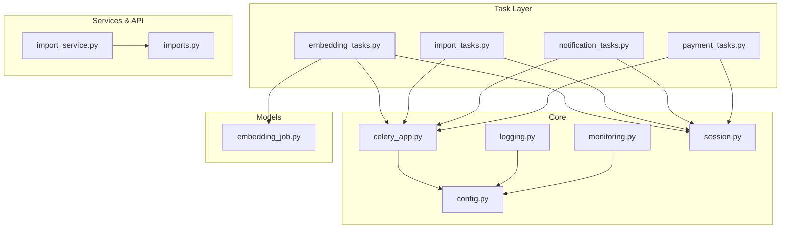
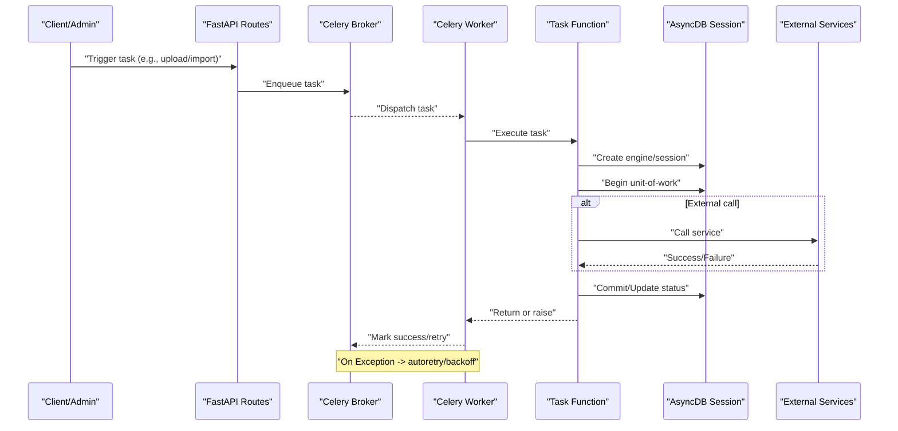
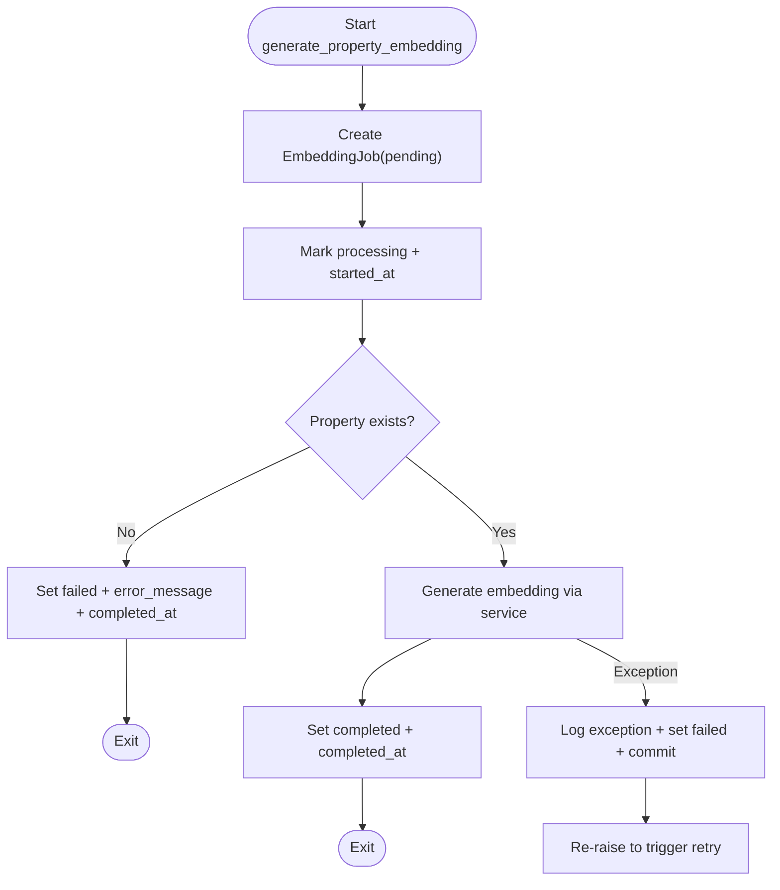
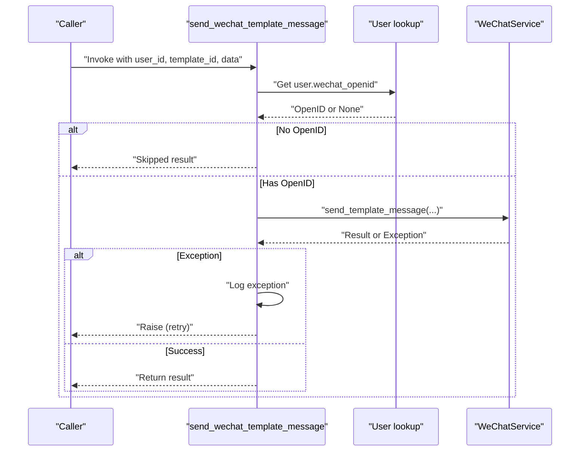
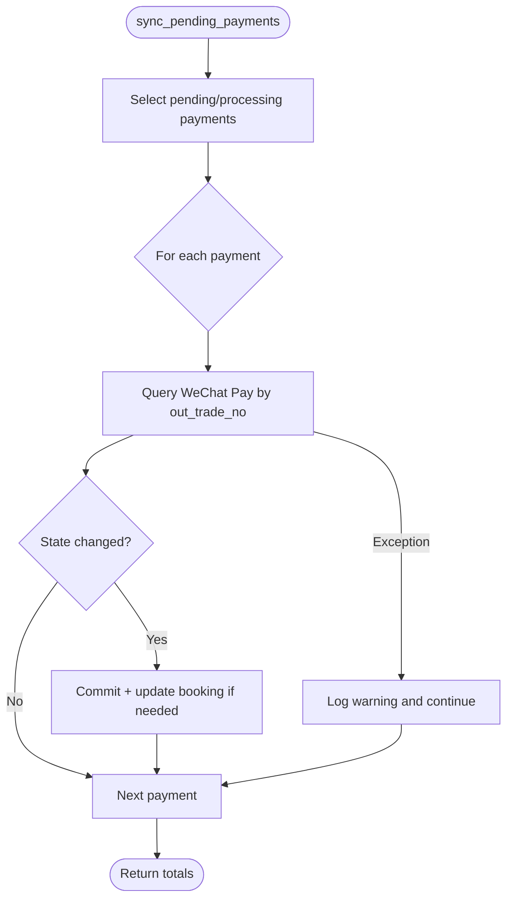
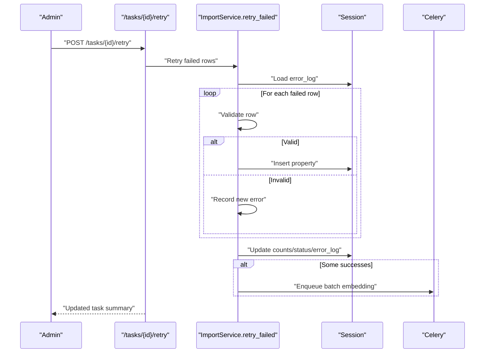
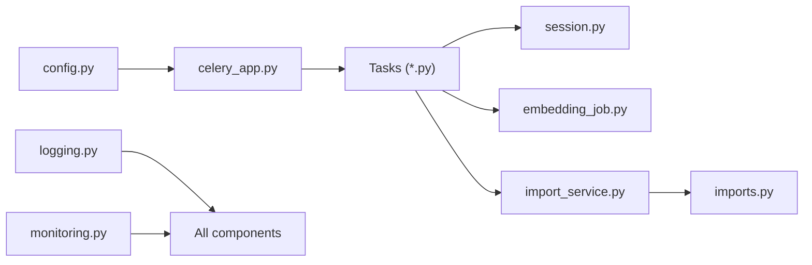

# Error Handling & Retry Logic

<cite>
**Referenced Files in This Document**
- [celery_app.py](file://backend/app/celery_app.py)
- [embedding_tasks.py](file://backend/app/tasks/embedding_tasks.py)
- [import_tasks.py](file://backend/app/tasks/import_tasks.py)
- [notification_tasks.py](file://backend/app/tasks/notification_tasks.py)
- [payment_tasks.py](file://backend/app/tasks/payment_tasks.py)
- [config.py](file://backend/app/core/config.py)
- [logging.py](file://backend/app/core/logging.py)
- [monitoring.py](file://backend/app/core/monitoring.py)
- [session.py](file://backend/app/db/session.py)
- [embedding_job.py](file://backend/app/models/embedding_job.py)
- [import_service.py](file://backend/app/services/import_service.py)
- [imports.py](file://backend/app/api/v1/routes/imports.py)
</cite>

## Table of Contents
1. [Introduction](#introduction)
2. [Project Structure](#project-structure)
3. [Core Components](#core-components)
4. [Architecture Overview](#architecture-overview)
5. [Detailed Component Analysis](#detailed-component-analysis)
6. [Dependency Analysis](#dependency-analysis)
7. [Performance Considerations](#performance-considerations)
8. [Troubleshooting Guide](#troubleshooting-guide)
9. [Conclusion](#conclusion)
10. [Appendices](#appendices)

## Introduction
This document explains how background tasks handle errors and retries across the system. It covers exception handling patterns, retry policies with exponential backoff, maximum attempts, conditional retries by error type, dead letter queue strategies for permanently failed tasks, manual intervention workflows, transaction management and data consistency guarantees, logging strategies for failures and stack traces, circuit breaker patterns for external service resilience, monitoring and alerting for failed tasks, and recovery procedures. Practical examples reference actual task implementations to guide robust error handling in custom tasks.

## Project Structure
The background processing layer is built on Celery with async database access via SQLAlchemy. Tasks are organized by domain (embeddings, imports, notifications, payments). Configuration and observability are centralized under core modules.

**Diagram sources**
- [celery_app.py:1-31](file://backend/app/celery_app.py#L1-L31)
- [embedding_tasks.py:1-112](file://backend/app/tasks/embedding_tasks.py#L1-L112)
- [import_tasks.py:1-44](file://backend/app/tasks/import_tasks.py#L1-L44)
- [notification_tasks.py:1-217](file://backend/app/tasks/notification_tasks.py#L1-L217)
- [payment_tasks.py:1-241](file://backend/app/tasks/payment_tasks.py#L1-L241)
- [config.py:1-167](file://backend/app/core/config.py#L1-L167)
- [logging.py:1-231](file://backend/app/core/logging.py#L1-L231)
- [monitoring.py:1-227](file://backend/app/core/monitoring.py#L1-L227)
- [session.py:1-14](file://backend/app/db/session.py#L1-L14)
- [embedding_job.py:1-35](file://backend/app/models/embedding_job.py#L1-L35)
- [import_service.py:1-403](file://backend/app/services/import_service.py#L1-L403)
- [imports.py:1-194](file://backend/app/api/v1/routes/imports.py#L1-L194)

**Section sources**
- [celery_app.py:1-31](file://backend/app/celery_app.py#L1-L31)
- [config.py:1-167](file://backend/app/core/config.py#L1-L167)
- [logging.py:1-231](file://backend/app/core/logging.py#L1-L231)
- [monitoring.py:1-227](file://backend/app/core/monitoring.py#L1-L227)
- [session.py:1-14](file://backend/app/db/session.py#L1-L14)

## Core Components
- Celery application configuration: broker/backend URLs, serialization, time zone, eager mode flags, and routing to queues.
- Task definitions with automatic retries and backoff.
- Async DB session creation per task execution to avoid shared state.
- Structured logging and Prometheus metrics for HTTP and Celery tasks.
- Import pipeline with row-level validation, partial success/failure tracking, and manual retry endpoint.

Key responsibilities:
- Isolate each task’s DB lifecycle and ensure commits only when consistent.
- Log exceptions with full context and propagate to Celery for retries.
- Track job states in persistent models where applicable.
- Provide admin APIs to inspect and retry import failures.

**Section sources**
- [celery_app.py:1-31](file://backend/app/celery_app.py#L1-L31)
- [embedding_tasks.py:1-112](file://backend/app/tasks/embedding_tasks.py#L1-L112)
- [import_tasks.py:1-44](file://backend/app/tasks/import_tasks.py#L1-L44)
- [notification_tasks.py:1-217](file://backend/app/tasks/notification_tasks.py#L1-L217)
- [payment_tasks.py:1-241](file://backend/app/tasks/payment_tasks.py#L1-L241)
- [logging.py:1-231](file://backend/app/core/logging.py#L1-L231)
- [monitoring.py:1-227](file://backend/app/core/monitoring.py#L1-L227)
- [session.py:1-14](file://backend/app/db/session.py#L1-L14)
- [embedding_job.py:1-35](file://backend/app/models/embedding_job.py#L1-L35)
- [import_service.py:1-403](file://backend/app/services/import_service.py#L1-L403)
- [imports.py:1-194](file://backend/app/api/v1/routes/imports.py#L1-L194)

## Architecture Overview
Background tasks are invoked from API routes or scheduled jobs. Each task sets up its own async engine and session, performs work, updates status, logs outcomes, and raises exceptions to trigger Celery retries. Observability is provided via structured logs and Prometheus metrics.

**Diagram sources**
- [celery_app.py:1-31](file://backend/app/celery_app.py#L1-L31)
- [embedding_tasks.py:1-112](file://backend/app/tasks/embedding_tasks.py#L1-L112)
- [notification_tasks.py:1-217](file://backend/app/tasks/notification_tasks.py#L1-L217)
- [payment_tasks.py:1-241](file://backend/app/tasks/payment_tasks.py#L1-L241)
- [session.py:1-14](file://backend/app/db/session.py#L1-L14)

## Detailed Component Analysis

### Embedding Generation Task
- Purpose: Generate vector embeddings for a property and persist results.
- Error handling:
  - Creates a pending job record, transitions to processing, then completed or failed.
  - On failure, records error message and timestamp, logs with exception info, and re-raises to trigger retries.
- Retry policy:
  - Automatic retry for all exceptions with exponential backoff and a max attempt limit.
- Data consistency:
  - Uses a single async session per task; commits only after consistent state changes.

**Diagram sources**
- [embedding_tasks.py:16-81](file://backend/app/tasks/embedding_tasks.py#L16-L81)
- [embedding_job.py:10-35](file://backend/app/models/embedding_job.py#L10-L35)

**Section sources**
- [embedding_tasks.py:16-81](file://backend/app/tasks/embedding_tasks.py#L16-L81)
- [embedding_job.py:10-35](file://backend/app/models/embedding_job.py#L10-L35)

### Batch Reindex and New Properties
- Purpose: Enqueue embedding generation for properties missing embeddings.
- Behavior:
  - Queries properties without embeddings, enqueues individual embedding tasks, and returns counts.
- Reliability:
  - Retries configured similarly to single-property task.

**Section sources**
- [embedding_tasks.py:83-112](file://backend/app/tasks/embedding_tasks.py#L83-L112)
- [import_tasks.py:13-44](file://backend/app/tasks/import_tasks.py#L13-L44)

### Notification Tasks (WeChat, SMS, Email)
- Purpose: Send user notifications asynchronously.
- Error handling:
  - Validates recipient identifiers before calling providers.
  - Logs warnings for skipped recipients and exceptions on provider calls.
  - Raises exceptions to trigger retries.
- Retry policy:
  - Exponential backoff with bounded max retries.

**Diagram sources**
- [notification_tasks.py:53-97](file://backend/app/tasks/notification_tasks.py#L53-L97)

**Section sources**
- [notification_tasks.py:53-97](file://backend/app/tasks/notification_tasks.py#L53-L97)
- [notification_tasks.py:136-173](file://backend/app/tasks/notification_tasks.py#L136-L173)
- [notification_tasks.py:178-217](file://backend/app/tasks/notification_tasks.py#L178-L217)

### Payment Tasks (Sync, Close Expired, Notify)
- Purpose: Sync payment statuses with WeChat Pay, close expired orders, and notify users.
- Error handling:
  - Per-payment try/except blocks log exceptions without aborting batch loops.
  - Updates booking deposit status consistently within transactions.
- Retry policy:
  - Bounded retries for sync/close tasks.
- Idempotency considerations:
  - Status checks prevent redundant updates; final states are clearly defined.

**Diagram sources**
- [payment_tasks.py:80-118](file://backend/app/tasks/payment_tasks.py#L80-L118)
- [payment_tasks.py:121-173](file://backend/app/tasks/payment_tasks.py#L121-L173)

**Section sources**
- [payment_tasks.py:27-77](file://backend/app/tasks/payment_tasks.py#L27-L77)
- [payment_tasks.py:80-118](file://backend/app/tasks/payment_tasks.py#L80-L118)
- [payment_tasks.py:121-173](file://backend/app/tasks/payment_tasks.py#L121-L173)
- [payment_tasks.py:176-241](file://backend/app/tasks/payment_tasks.py#L176-L241)

### Import Pipeline and Manual Retry
- Purpose: Ingest CSV/Excel into properties with validation and partial success reporting.
- Error handling:
  - Row-level validation captures per-row errors; bulk operation continues.
  - Stores error_log as JSON for inspection and retry.
- Manual intervention:
  - Admin endpoint to retry failed rows, re-validate, and re-insert.
  - Dispatches background tasks for embeddings and POI generation upon success.

**Diagram sources**
- [imports.py:155-193](file://backend/app/api/v1/routes/imports.py#L155-L193)
- [import_service.py:138-183](file://backend/app/services/import_service.py#L138-L183)

**Section sources**
- [import_service.py:77-136](file://backend/app/services/import_service.py#L77-L136)
- [import_service.py:138-183](file://backend/app/services/import_service.py#L138-L183)
- [imports.py:155-193](file://backend/app/api/v1/routes/imports.py#L155-L193)

## Dependency Analysis
- Celery app depends on settings for Redis and routing.
- Tasks depend on config for DB URL and services for external calls.
- Logging and monitoring are cross-cutting concerns used throughout.
- Models provide persistence for job states and import progress.

**Diagram sources**
- [config.py:1-167](file://backend/app/core/config.py#L1-L167)
- [celery_app.py:1-31](file://backend/app/celery_app.py#L1-L31)
- [session.py:1-14](file://backend/app/db/session.py#L1-L14)
- [embedding_job.py:1-35](file://backend/app/models/embedding_job.py#L1-L35)
- [import_service.py:1-403](file://backend/app/services/import_service.py#L1-L403)
- [imports.py:1-194](file://backend/app/api/v1/routes/imports.py#L1-L194)
- [logging.py:1-231](file://backend/app/core/logging.py#L1-L231)
- [monitoring.py:1-227](file://backend/app/core/monitoring.py#L1-L227)

**Section sources**
- [celery_app.py:1-31](file://backend/app/celery_app.py#L1-L31)
- [config.py:1-167](file://backend/app/core/config.py#L1-L167)
- [logging.py:1-231](file://backend/app/core/logging.py#L1-L231)
- [monitoring.py:1-227](file://backend/app/core/monitoring.py#L1-L227)

## Performance Considerations
- Use short-lived async engines per task to avoid connection leaks and contention.
- Keep retries bounded to prevent thundering herds on external services.
- Prefer batch operations where possible (e.g., enqueue multiple tasks instead of long-running loops).
- Monitor DB pool gauges and task latency histograms to detect bottlenecks.

[No sources needed since this section provides general guidance]

## Troubleshooting Guide
Common issues and remedies:
- Task repeatedly fails due to transient external errors:
  - Verify exponential backoff and max retries are appropriate for the service.
  - Inspect logs for exception details and timestamps.
- Dead-letter behavior:
  - After exhausting retries, tasks remain in failed state; persist error messages and consider moving to a dead-letter queue or marking in a dedicated table for manual review.
- Import failures:
  - Use the retry endpoint to reprocess failed rows; examine error_log for specific validation issues.
- Monitoring:
  - Check Prometheus metrics for task counts and latencies; correlate with logs using request/task IDs where available.

Operational tips:
- Ensure Redis connectivity settings are correct to avoid startup retries.
- Enable structured JSON logging in production for easier parsing and alerting.
- Add alerts on high rates of failed tasks or prolonged task durations.

**Section sources**
- [celery_app.py:20-31](file://backend/app/celery_app.py#L20-L31)
- [embedding_tasks.py:70-76](file://backend/app/tasks/embedding_tasks.py#L70-L76)
- [notification_tasks.py:93-95](file://backend/app/tasks/notification_tasks.py#L93-L95)
- [payment_tasks.py:112-114](file://backend/app/tasks/payment_tasks.py#L112-L114)
- [import_service.py:128-136](file://backend/app/services/import_service.py#L128-L136)
- [imports.py:155-193](file://backend/app/api/v1/routes/imports.py#L155-L193)
- [logging.py:77-101](file://backend/app/core/logging.py#L77-L101)
- [monitoring.py:183-208](file://backend/app/core/monitoring.py#L183-L208)

## Conclusion
The system employs clear patterns for error handling and retries in background tasks:
- Automatic retries with exponential backoff and bounded attempts.
- Persistent job state tracking for critical processes.
- Structured logging and Prometheus metrics for observability.
- Manual retry endpoints for import failures.
To further strengthen resilience, consider implementing explicit dead-letter queues, circuit breakers around external services, and automated alerting based on metrics and logs.

[No sources needed since this section summarizes without analyzing specific files]

## Appendices

### Retry Policies Summary
- Embedding tasks: autoretry for all exceptions, exponential backoff, max retries set per task.
- Notification tasks: similar policy; skip recipients lacking identifiers rather than failing hard.
- Payment tasks: lower max retries for periodic sync/close tasks; per-item error isolation.

**Section sources**
- [embedding_tasks.py:16-21](file://backend/app/tasks/embedding_tasks.py#L16-L21)
- [embedding_tasks.py:83-88](file://backend/app/tasks/embedding_tasks.py#L83-L88)
- [notification_tasks.py:53-58](file://backend/app/tasks/notification_tasks.py#L53-L58)
- [notification_tasks.py:136-141](file://backend/app/tasks/notification_tasks.py#L136-L141)
- [notification_tasks.py:178-183](file://backend/app/tasks/notification_tasks.py#L178-L183)
- [payment_tasks.py:80-85](file://backend/app/tasks/payment_tasks.py#L80-L85)
- [payment_tasks.py:121-126](file://backend/app/tasks/payment_tasks.py#L121-L126)

### Transaction Management and Consistency
- Each task creates its own async engine and session, ensuring isolation.
- Commits occur only after consistent state transitions (e.g., job status updates).
- Import service uses flush and commit strategically to maintain partial success semantics.

**Section sources**
- [embedding_tasks.py:25-78](file://backend/app/tasks/embedding_tasks.py#L25-L78)
- [payment_tasks.py:92-118](file://backend/app/tasks/payment_tasks.py#L92-L118)
- [import_service.py:325-356](file://backend/app/services/import_service.py#L325-L356)

### Logging Strategy
- Production uses structured JSON logs with optional fields like request_id and user_id.
- Exceptions include formatted tracebacks.
- Sensitive data masking utilities are available for safe logging.

**Section sources**
- [logging.py:33-54](file://backend/app/core/logging.py#L33-L54)
- [logging.py:103-121](file://backend/app/core/logging.py#L103-L121)

### Monitoring and Alerting
- Prometheus middleware tracks HTTP requests and latency.
- Celery signal handlers track task count and duration.
- DB pool gauges expose connection usage.

**Section sources**
- [monitoring.py:126-160](file://backend/app/core/monitoring.py#L126-L160)
- [monitoring.py:183-208](file://backend/app/core/monitoring.py#L183-L208)
- [monitoring.py:216-227](file://backend/app/core/monitoring.py#L216-L227)

### Circuit Breaker Patterns (Recommendation)
- Wrap external service calls (e.g., WeChat Pay, SMS, Email) with a circuit breaker that:
  - Opens after consecutive failures.
  - Halts traffic temporarily and falls back to graceful degradation (e.g., queue for later, return non-blocking responses).
  - Half-opens periodically to test recovery.
- Integrate with metrics and logs to trigger alerts when circuits open.

[No sources needed since this section provides general guidance]

### Dead Letter Queue Implementation (Recommendation)
- Persist permanently failed tasks in a dedicated table or queue with:
  - Original payload, error details, last attempt timestamp, and retry count.
- Provide admin UI/API to:
  - Inspect dead-letter entries.
  - Replay selected items after fixes.
  - Export for offline analysis.

[No sources needed since this section provides general guidance]