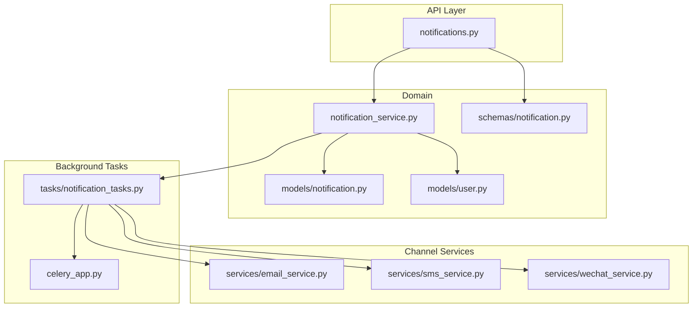
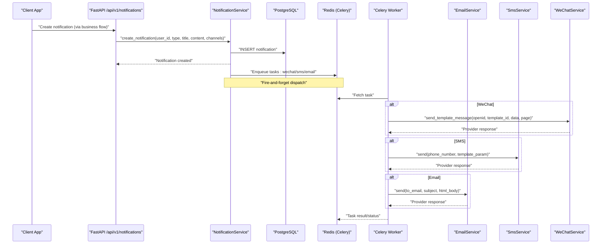
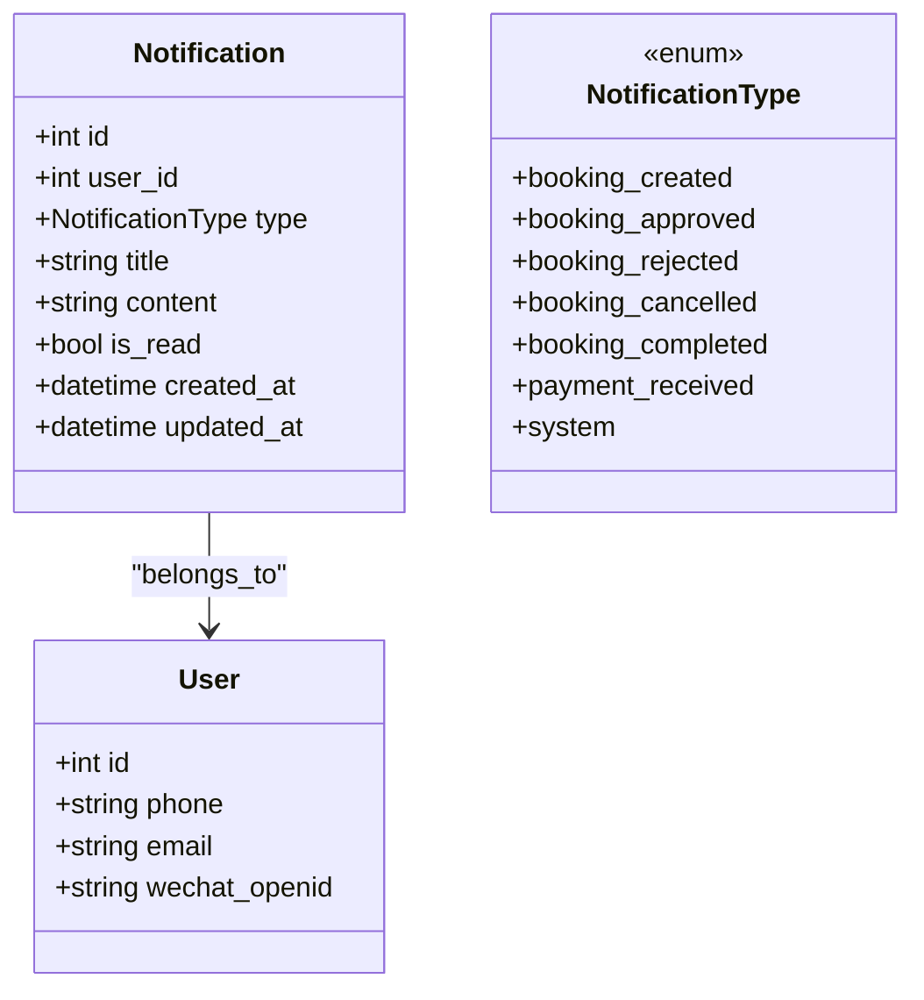
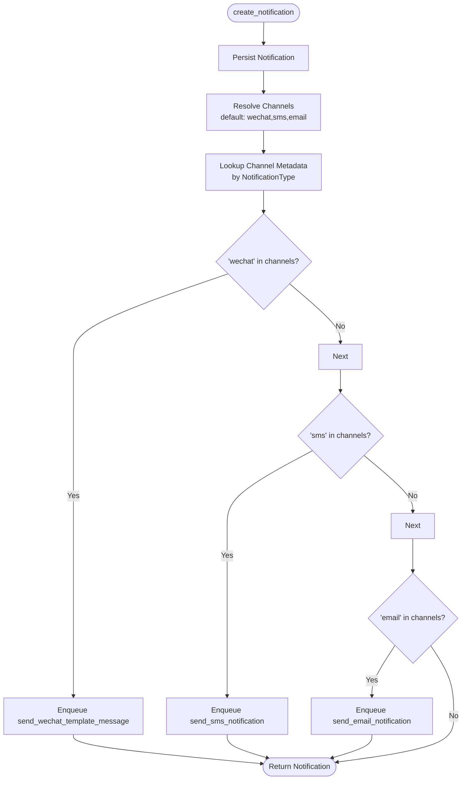
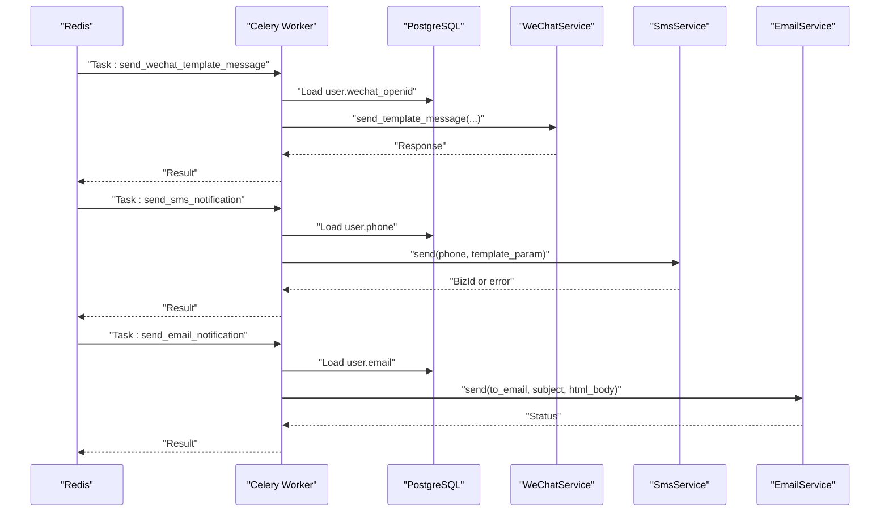
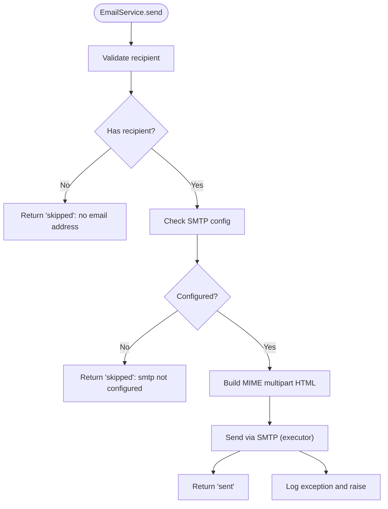
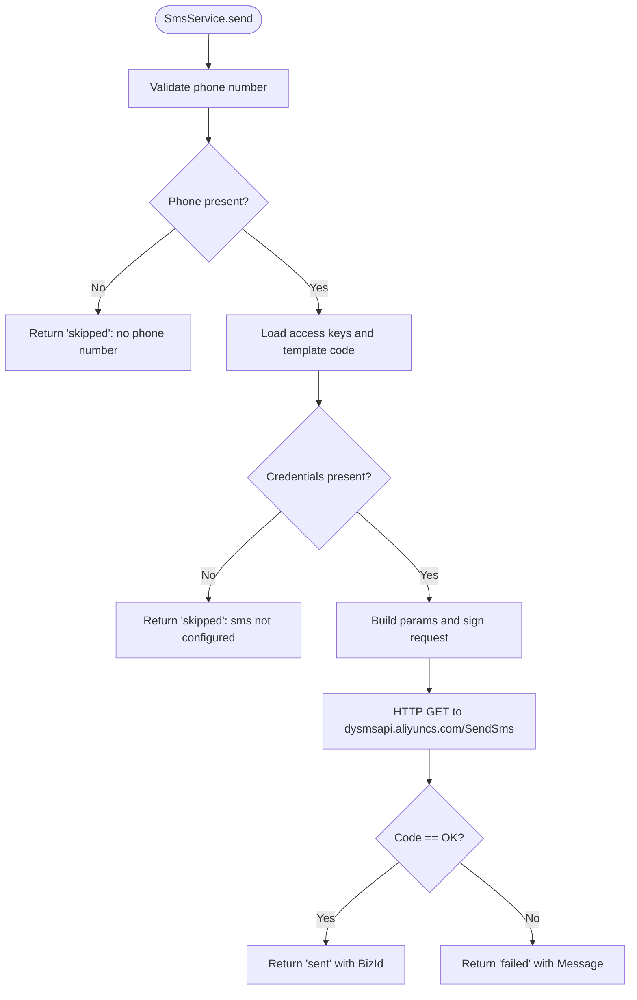
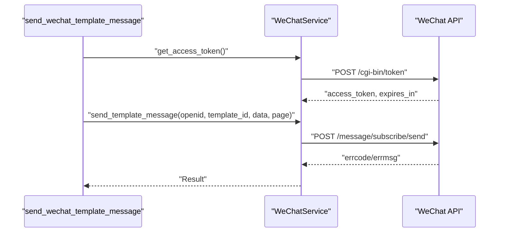
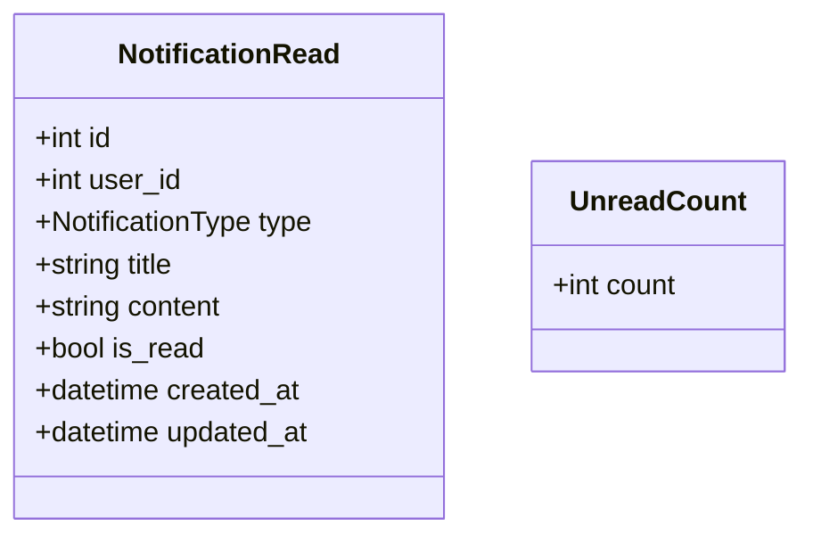
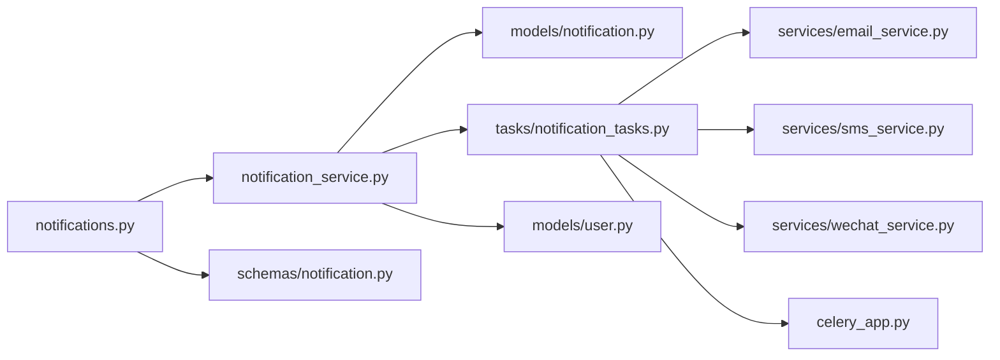

# Notification Dispatch System

<cite>
**Referenced Files in This Document**
- [notification.py](file://backend/app/models/notification.py)
- [notification_service.py](file://backend/app/services/notification_service.py)
- [notification_tasks.py](file://backend/app/tasks/notification_tasks.py)
- [email_service.py](file://backend/app/services/email_service.py)
- [sms_service.py](file://backend/app/services/sms_service.py)
- [wechat_service.py](file://backend/app/services/wechat_service.py)
- [celery_app.py](file://backend/app/celery_app.py)
- [notifications.py](file://backend/app/api/v1/routes/notifications.py)
- [notification.py](file://backend/app/schemas/notification.py)
- [config.py](file://backend/app/core/config.py)
- [user.py](file://backend/app/models/user.py)
- [test_notifications.py](file://backend/tests/test_notifications.py)
- [smoke_test_notifications.py](file://backend/tests/smoke_test_notifications.py)
</cite>

## Table of Contents
1. Introduction
2. Project Structure
3. Core Components
4. Architecture Overview
5. Detailed Component Analysis
6. Dependency Analysis
7. Performance Considerations
8. Troubleshooting Guide
9. Conclusion

## Introduction
This document explains the notification dispatch background system that delivers notifications via multiple channels: email, SMS (Alibaba Cloud), and WeChat Mini Program template messages. It covers how notifications are queued and processed asynchronously with Celery, how templates are rendered for each channel, how delivery is tracked, and how retries and error handling work. It also includes guidance on rate limiting, throttling, cost optimization, and monitoring delivery status.

## Project Structure
The notification subsystem spans models, services, tasks, API routes, schemas, configuration, and tests. The main flow is:
- Business code calls NotificationService to create a notification record and dispatch channel tasks.
- Celery workers execute tasks to send emails, SMS, or WeChat messages.
- Services encapsulate provider integrations (SMTP, Alibaba Cloud SMS, WeChat).
- Configuration centralizes credentials and runtime settings.

**Diagram sources**
- [notifications.py:1-50](file://backend/app/api/v1/routes/notifications.py#L1-L50)
- [notification_service.py:1-164](file://backend/app/services/notification_service.py#L1-L164)
- [notification.py:1-36](file://backend/app/models/notification.py#L1-L36)
- [notification.py:1-23](file://backend/app/schemas/notification.py#L1-L23)
- [user.py:1-48](file://backend/app/models/user.py#L1-L48)
- [celery_app.py:1-31](file://backend/app/celery_app.py#L1-L31)
- [notification_tasks.py:1-217](file://backend/app/tasks/notification_tasks.py#L1-L217)
- [email_service.py:1-76](file://backend/app/services/email_service.py#L1-L76)
- [sms_service.py:1-96](file://backend/app/services/sms_service.py#L1-L96)
- [wechat_service.py:1-146](file://backend/app/services/wechat_service.py#L1-L146)

**Section sources**
- [notifications.py:1-50](file://backend/app/api/v1/routes/notifications.py#L1-L50)
- [notification_service.py:1-164](file://backend/app/services/notification_service.py#L1-L164)
- [notification.py:1-36](file://backend/app/models/notification.py#L1-L36)
- [notification.py:1-23](file://backend/app/schemas/notification.py#L1-L23)
- [user.py:1-48](file://backend/app/models/user.py#L1-L48)
- [celery_app.py:1-31](file://backend/app/celery_app.py#L1-L31)
- [notification_tasks.py:1-217](file://backend/app/tasks/notification_tasks.py#L1-L217)
- [email_service.py:1-76](file://backend/app/services/email_service.py#L1-L76)
- [sms_service.py:1-96](file://backend/app/services/sms_service.py#L1-L96)
- [wechat_service.py:1-146](file://backend/app/services/wechat_service.py#L1-L146)

## Core Components
- Notification model and types: Defines persistent notification records and enumerates supported types such as booking lifecycle events and payment/system notifications.
- Notification service: Creates DB records and dispatches asynchronous tasks per channel; provides read/list/count operations.
- Celery task layer: Implements retryable tasks for WeChat, SMS, and Email delivery.
- Channel services: Encapsulate provider-specific logic (SMTP, Alibaba Cloud SMS, WeChat template messaging).
- API endpoints: Expose listing, marking read, and unread count queries for clients.
- Configuration: Centralizes SMTP, SMS, WeChat, Redis, and rate-limiting settings.

Key responsibilities:
- Persistence and queryability of notifications.
- Asynchronous, resilient delivery across channels.
- Template rendering per channel type.
- Delivery tracking via logs and provider responses.

**Section sources**
- [notification.py:1-36](file://backend/app/models/notification.py#L1-L36)
- [notification_service.py:1-164](file://backend/app/services/notification_service.py#L1-L164)
- [notification_tasks.py:1-217](file://backend/app/tasks/notification_tasks.py#L1-L217)
- [email_service.py:1-76](file://backend/app/services/email_service.py#L1-L76)
- [sms_service.py:1-96](file://backend/app/services/sms_service.py#L1-L96)
- [wechat_service.py:1-146](file://backend/app/services/wechat_service.py#L1-L146)
- [notifications.py:1-50](file://backend/app/api/v1/routes/notifications.py#L1-L50)
- [notification.py:1-23](file://backend/app/schemas/notification.py#L1-L23)
- [config.py:1-167](file://backend/app/core/config.py#L1-L167)

## Architecture Overview
The system uses an event-driven architecture where business flows enqueue channel tasks after persisting a notification. Celery workers consume tasks from Redis and invoke provider services.

**Diagram sources**
- [notifications.py:1-50](file://backend/app/api/v1/routes/notifications.py#L1-L50)
- [notification_service.py:1-164](file://backend/app/services/notification_service.py#L1-L164)
- [celery_app.py:1-31](file://backend/app/celery_app.py#L1-L31)
- [notification_tasks.py:1-217](file://backend/app/tasks/notification_tasks.py#L1-L217)
- [email_service.py:1-76](file://backend/app/services/email_service.py#L1-L76)
- [sms_service.py:1-96](file://backend/app/services/sms_service.py#L1-L96)
- [wechat_service.py:1-146](file://backend/app/services/wechat_service.py#L1-L146)

## Detailed Component Analysis

### Data Model and Types
- NotificationType enum defines supported categories including booking lifecycle and payment/system events.
- Notification model stores user association, type, title, content, read status, and timestamps.
- User model provides contact fields used by channels (phone, email, wechat_openid).

**Diagram sources**
- [notification.py:1-36](file://backend/app/models/notification.py#L1-L36)
- [user.py:1-48](file://backend/app/models/user.py#L1-L48)

**Section sources**
- [notification.py:1-36](file://backend/app/models/notification.py#L1-L36)
- [user.py:1-48](file://backend/app/models/user.py#L1-L48)

### Notification Service and Channel Dispatch
- create_notification persists the record then enqueues channel tasks.
- _dispatch_channels maps notification type to channel metadata (e.g., WeChat template IDs) and invokes Celery tasks for requested channels.
- Read/list/unread-count helpers support UI features.

**Diagram sources**
- [notification_service.py:1-164](file://backend/app/services/notification_service.py#L1-L164)

**Section sources**
- [notification_service.py:1-164](file://backend/app/services/notification_service.py#L1-L164)

### Celery Task Layer
- send_wechat_template_message: Resolves user openid, builds template payload, sends via WeChatService, returns status and message ID when available.
- send_sms_notification: Resolves user phone, trims content, sends via SmsService, returns BizId on success.
- send_email_notification: Resolves user email, sends HTML body via EmailService.
- All tasks use autoretry_for, retry_backoff, and max_retries=3.

**Diagram sources**
- [notification_tasks.py:1-217](file://backend/app/tasks/notification_tasks.py#L1-L217)
- [celery_app.py:1-31](file://backend/app/celery_app.py#L1-L31)
- [wechat_service.py:1-146](file://backend/app/services/wechat_service.py#L1-L146)
- [sms_service.py:1-96](file://backend/app/services/sms_service.py#L1-L96)
- [email_service.py:1-76](file://backend/app/services/email_service.py#L1-L76)

**Section sources**
- [notification_tasks.py:1-217](file://backend/app/tasks/notification_tasks.py#L1-L217)
- [celery_app.py:1-31](file://backend/app/celery_app.py#L1-L31)

### Email Service
- Builds MIME multipart HTML messages and sends via SMTP using configured host/port/TLS.
- Skips sending if SMTP not configured or recipient empty; logs warnings and returns skipped status.

**Diagram sources**
- [email_service.py:1-76](file://backend/app/services/email_service.py#L1-L76)

**Section sources**
- [email_service.py:1-76](file://backend/app/services/email_service.py#L1-L76)

### SMS Service (Alibaba Cloud)
- Signs requests using HMAC-SHA1 v1 signature algorithm and calls Alibaba Cloud SendSms API.
- Returns BizId on success; returns failed status with error message otherwise; skips if credentials missing or phone empty.

**Diagram sources**
- [sms_service.py:1-96](file://backend/app/services/sms_service.py#L1-L96)

**Section sources**
- [sms_service.py:1-96](file://backend/app/services/sms_service.py#L1-L96)

### WeChat Mini Program Service
- Manages access token caching and sends subscription/template messages.
- Provides jscode2session and customer service message methods.

**Diagram sources**
- [notification_tasks.py:1-217](file://backend/app/tasks/notification_tasks.py#L1-L217)
- [wechat_service.py:1-146](file://backend/app/services/wechat_service.py#L1-L146)

**Section sources**
- [wechat_service.py:1-146](file://backend/app/services/wechat_service.py#L1-L146)
- [notification_tasks.py:1-217](file://backend/app/tasks/notification_tasks.py#L1-L217)

### API Endpoints and Schemas
- List notifications, mark single/all as read, get unread count.
- Pydantic schemas define response shapes for clients.

**Diagram sources**
- [notification.py:1-23](file://backend/app/schemas/notification.py#L1-L23)

**Section sources**
- [notifications.py:1-50](file://backend/app/api/v1/routes/notifications.py#L1-L50)
- [notification.py:1-23](file://backend/app/schemas/notification.py#L1-L23)

### Configuration and Settings
- Centralized settings include database, Redis, WeChat, SMS, SMTP, and rate limiting parameters.
- Celery app uses Redis URL for broker/backend and supports eager mode for development/testing.

**Section sources**
- [config.py:1-167](file://backend/app/core/config.py#L1-L167)
- [celery_app.py:1-31](file://backend/app/celery_app.py#L1-L31)

## Dependency Analysis
High-level dependencies between components:

**Diagram sources**
- [notifications.py:1-50](file://backend/app/api/v1/routes/notifications.py#L1-L50)
- [notification_service.py:1-164](file://backend/app/services/notification_service.py#L1-L164)
- [notification.py:1-36](file://backend/app/models/notification.py#L1-L36)
- [notification_tasks.py:1-217](file://backend/app/tasks/notification_tasks.py#L1-L217)
- [email_service.py:1-76](file://backend/app/services/email_service.py#L1-L76)
- [sms_service.py:1-96](file://backend/app/services/sms_service.py#L1-L96)
- [wechat_service.py:1-146](file://backend/app/services/wechat_service.py#L1-L146)
- [celery_app.py:1-31](file://backend/app/celery_app.py#L1-L31)
- [notification.py:1-23](file://backend/app/schemas/notification.py#L1-L23)
- [user.py:1-48](file://backend/app/models/user.py#L1-L48)

**Section sources**
- [notifications.py:1-50](file://backend/app/api/v1/routes/notifications.py#L1-L50)
- [notification_service.py:1-164](file://backend/app/services/notification_service.py#L1-L164)
- [notification_tasks.py:1-217](file://backend/app/tasks/notification_tasks.py#L1-L217)
- [email_service.py:1-76](file://backend/app/services/email_service.py#L1-L76)
- [sms_service.py:1-96](file://backend/app/services/sms_service.py#L1-L96)
- [wechat_service.py:1-146](file://backend/app/services/wechat_service.py#L1-L146)
- [celery_app.py:1-31](file://backend/app/celery_app.py#L1-L31)
- [notification.py:1-23](file://backend/app/schemas/notification.py#L1-L23)
- [user.py:1-48](file://backend/app/models/user.py#L1-L48)

## Performance Considerations
- Asynchronous processing: All channel deliveries run in Celery workers, decoupling API latency from provider round-trips.
- Retry policy: Tasks use autoretry_for with exponential backoff and max_retries=3 to handle transient failures.
- Connection reuse: HTTPX async clients are used within tasks; consider connection pooling at scale.
- Database sessions: Tasks open dedicated async sessions per invocation; ensure worker concurrency aligns with DB pool size.
- Rate limiting: Global API rate limiting settings exist; apply channel-specific throttling at the service level if needed.
- Cost optimization:
  - SMS: Limit content length and avoid unnecessary retries; batch non-critical alerts.
  - Email: Prefer lightweight HTML bodies; avoid large attachments unless required.
  - WeChat: Reuse access tokens (already cached); minimize redundant template messages.

[No sources needed since this section provides general guidance]

## Troubleshooting Guide
Common issues and diagnostics:
- Missing credentials:
  - SMS: If access keys are empty, the service returns a skipped status with reason indicating not configured.
  - Email: If SMTP host/user/password are missing, the service returns skipped with reason indicating not configured.
- Missing recipient data:
  - SMS: Skips if user has no phone.
  - Email: Skips if user has no email.
  - WeChat: Skips if user has no wechat_openid.
- Provider errors:
  - SMS: Non-OK response returns failed status with provider message.
  - WeChat: Non-zero errcode raises an exception; tasks will retry per Celery policy.
  - Email: SMTP exceptions are logged and re-raised; Celery retries accordingly.
- Monitoring:
  - Inspect Celery worker logs for task results and exceptions.
  - Use provider response fields (e.g., SMS BizId, WeChat msgid) to correlate deliveries.
- Tests:
  - Unit and smoke tests verify skip behaviors and basic pipeline integration.

**Section sources**
- [sms_service.py:1-96](file://backend/app/services/sms_service.py#L1-L96)
- [email_service.py:1-76](file://backend/app/services/email_service.py#L1-L76)
- [wechat_service.py:1-146](file://backend/app/services/wechat_service.py#L1-L146)
- [notification_tasks.py:1-217](file://backend/app/tasks/notification_tasks.py#L1-L217)
- [smoke_test_notifications.py:1-179](file://backend/tests/smoke_test_notifications.py#L1-L179)
- [test_notifications.py:1-141](file://backend/tests/test_notifications.py#L1-L141)

## Conclusion
The notification dispatch system provides a robust, multi-channel delivery pipeline backed by Celery and Redis. It persists notifications, renders channel-specific templates, handles retries, and exposes simple APIs for reading and managing notifications. With centralized configuration and clear separation of concerns, it scales well and can be extended with additional channels or advanced routing and prioritization strategies.

[No sources needed since this section summarizes without analyzing specific files]