# Task Scheduling & Monitoring

<cite>
**Referenced Files in This Document**
- [celery_app.py](file://backend/app/celery_app.py)
- [main.py](file://backend/app/main.py)
- [monitoring.py](file://backend/app/core/monitoring.py)
- [logging.py](file://backend/app/core/logging.py)
- [config.py](file://backend/app/core/config.py)
- [embedding_tasks.py](file://backend/app/tasks/embedding_tasks.py)
- [import_tasks.py](file://backend/app/tasks/import_tasks.py)
- [notification_tasks.py](file://backend/app/tasks/notification_tasks.py)
- [payment_tasks.py](file://backend/app/tasks/payment_tasks.py)
- [docker-compose.yml](file://docker-compose.yml)
- [docker-compose.prod.yml](file://docker-compose.prod.yml)
- [requirements.txt](file://backend/requirements.txt)
</cite>

## Table of Contents
1. [Introduction](#introduction)
2. [Project Structure](#project-structure)
3. [Core Components](#core-components)
4. [Architecture Overview](#architecture-overview)
5. [Detailed Component Analysis](#detailed-component-analysis)
6. [Dependency Analysis](#dependency-analysis)
7. [Performance Considerations](#performance-considerations)
8. [Troubleshooting Guide](#troubleshooting-guide)
9. [Conclusion](#conclusion)
10. [Appendices](#appendices)

## Introduction
This document explains how background tasks are scheduled and monitored in the system using Celery, Redis, and Prometheus metrics. It covers:
- Periodic task scheduling with Celery Beat for recurring jobs (e.g., payment sync, cleanup).
- Task execution monitoring via Prometheus metrics exposed by the FastAPI app and Celery signals.
- Worker health monitoring, task duration tracking, and performance metrics collection.
- Structured logging and log aggregation patterns.
- Container orchestration with Docker Compose for running multiple workers and services.
- Alerting strategies for failures, crashes, and resource exhaustion.
- Scaling strategies for high-volume workloads and load balancing across workers.
- Examples to set up dashboards and configure alerts.

## Project Structure
The backend implements a FastAPI application that integrates Celery for asynchronous processing and Prometheus for observability. The production deployment uses Docker Compose to run PostgreSQL, Redis, the API server, Celery workers, and Celery Beat.

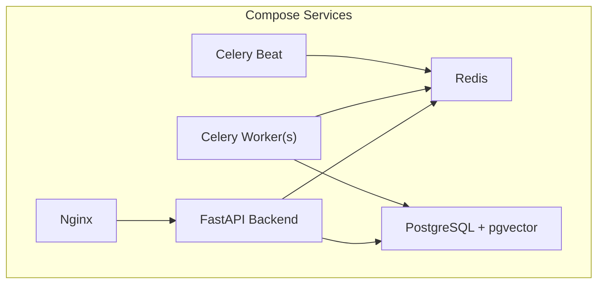

**Diagram sources**
- [docker-compose.prod.yml:66-168](file://docker-compose.prod.yml#L66-L168)
- [docker-compose.yml:9-46](file://docker-compose.yml#L9-L46)

**Section sources**
- [docker-compose.prod.yml:1-217](file://docker-compose.prod.yml#L1-L217)
- [docker-compose.yml:1-53](file://docker-compose.yml#L1-L53)

## Core Components
- Celery App: Configures broker/backend (Redis), serialization, timezone, and routing rules for specific queues.
- Metrics: Prometheus middleware for HTTP requests and Celery signal handlers for task-level metrics; /metrics endpoint exposed.
- Logging: Structured JSON logs in production, colored console logs in development; request/response logging and global exception handlers.
- Tasks: Embedding generation/reindexing, batch import, notifications (WeChat/SMS/Email), and payment operations (sync, close expired, notify).
- Orchestration: Docker Compose defines services, networking, volumes, resource limits, and logging drivers.

**Section sources**
- [celery_app.py:1-31](file://backend/app/celery_app.py#L1-L31)
- [monitoring.py:1-227](file://backend/app/core/monitoring.py#L1-L227)
- [logging.py:1-231](file://backend/app/core/logging.py#L1-L231)
- [embedding_tasks.py:1-112](file://backend/app/tasks/embedding_tasks.py#L1-L112)
- [import_tasks.py:1-44](file://backend/app/tasks/import_tasks.py#L1-L44)
- [notification_tasks.py:1-217](file://backend/app/tasks/notification_tasks.py#L1-L217)
- [payment_tasks.py:1-241](file://backend/app/tasks/payment_tasks.py#L1-L241)
- [docker-compose.prod.yml:100-168](file://docker-compose.prod.yml#L100-L168)

## Architecture Overview
The runtime architecture consists of:
- FastAPI serving HTTP APIs and exposing Prometheus metrics at /metrics.
- Celery workers consuming tasks from Redis queues (default, embedding, import).
- Celery Beat scheduling periodic tasks into Redis.
- PostgreSQL storing business data and vector embeddings.
- Nginx reverse proxying frontend and API traffic.

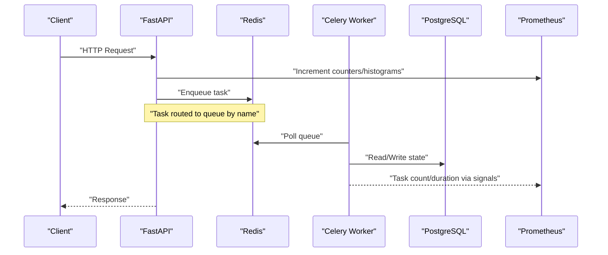

**Diagram sources**
- [main.py:41-69](file://backend/app/main.py#L41-L69)
- [monitoring.py:126-176](file://backend/app/core/monitoring.py#L126-L176)
- [celery_app.py:20-30](file://backend/app/celery_app.py#L20-L30)
- [docker-compose.prod.yml:100-168](file://docker-compose.prod.yml#L100-L168)

## Detailed Component Analysis

### Celery Application and Routing
- Broker and backend are configured to use Redis.
- Timezone is set to Asia/Shanghai with UTC enabled.
- Task routing maps specific task packages to dedicated queues (embedding, import).
- Eager mode can be toggled via environment variables for local testing.

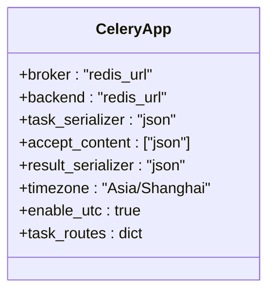

**Diagram sources**
- [celery_app.py:9-30](file://backend/app/celery_app.py#L9-L30)

**Section sources**
- [celery_app.py:1-31](file://backend/app/celery_app.py#L1-L31)
- [config.py:24](file://backend/app/core/config.py#L24)

### Prometheus Metrics and /metrics Endpoint
- HTTP middleware records total requests, latency histograms, and in-flight gauges per method and endpoint.
- Celery signal handlers record task counts and durations by task name.
- A /metrics endpoint serves Prometheus text format.

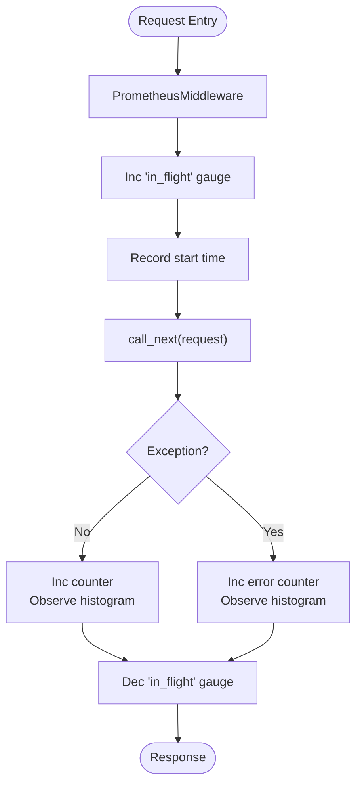

**Diagram sources**
- [monitoring.py:126-160](file://backend/app/core/monitoring.py#L126-L160)
- [monitoring.py:167-176](file://backend/app/core/monitoring.py#L167-L176)

**Section sources**
- [monitoring.py:70-176](file://backend/app/core/monitoring.py#L70-L176)
- [main.py:41-69](file://backend/app/main.py#L41-L69)

### Celery Signal Handlers for Task Metrics
- prerun stores task start times keyed by task_id.
- postrun increments task counters by status and observes latency histograms.

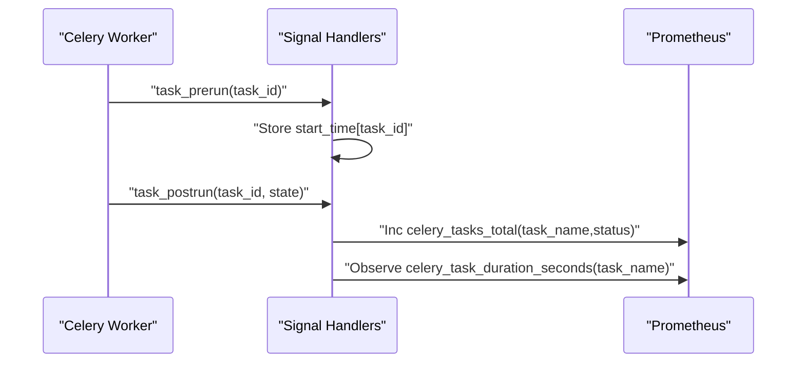

**Diagram sources**
- [monitoring.py:183-208](file://backend/app/core/monitoring.py#L183-L208)

**Section sources**
- [monitoring.py:178-208](file://backend/app/core/monitoring.py#L178-L208)

### Database Pool Metrics
- Gauges expose pool size, overflow, and checked-out connections.
- Updated asynchronously by polling engine pool stats.

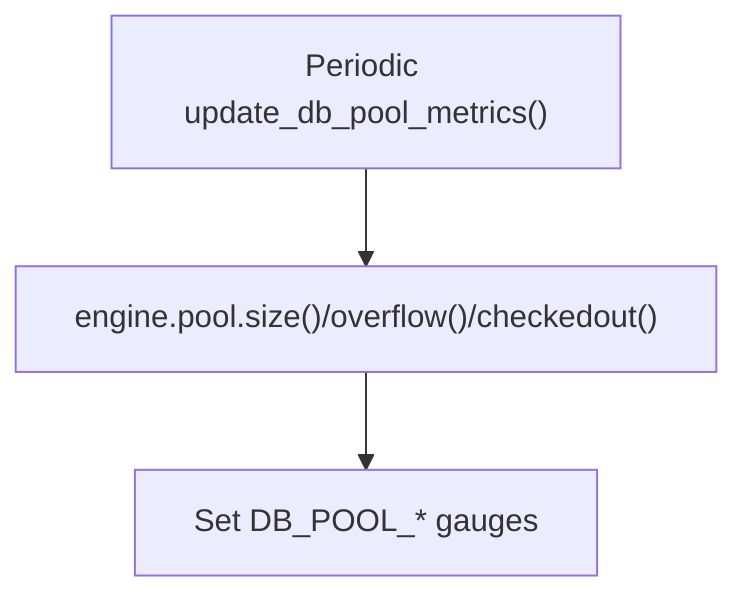

**Diagram sources**
- [monitoring.py:216-227](file://backend/app/core/monitoring.py#L216-L227)

**Section sources**
- [monitoring.py:211-227](file://backend/app/core/monitoring.py#L211-L227)

### Structured Logging and Request Tracing
- Production uses JSON formatter; development uses colored console.
- RequestLoggingMiddleware adds request_id, user_id, method, path, status_code, duration_ms.
- Global exception handlers normalize errors and log structured details.

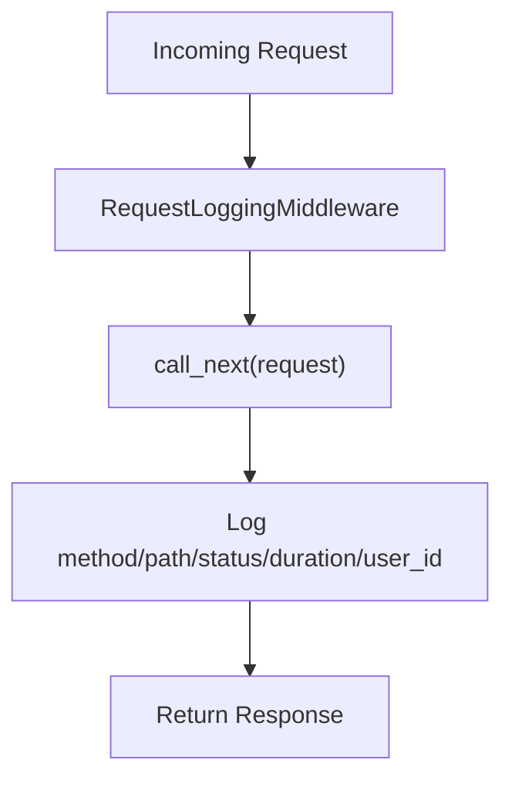

**Diagram sources**
- [logging.py:124-168](file://backend/app/core/logging.py#L124-L168)
- [logging.py:226-231](file://backend/app/core/logging.py#L226-L231)

**Section sources**
- [logging.py:33-101](file://backend/app/core/logging.py#L33-L101)
- [logging.py:124-168](file://backend/app/core/logging.py#L124-L168)
- [logging.py:170-231](file://backend/app/core/logging.py#L170-L231)

### Task Categories and Workflows

#### Embedding Generation and Reindexing
- generate_property_embedding creates an EmbeddingJob, marks processing/completed/failed states, and persists results.
- reindex_all_properties discovers properties without embeddings and enqueues individual embedding tasks.
- batch_embedding_new_properties performs similar discovery and dispatch.

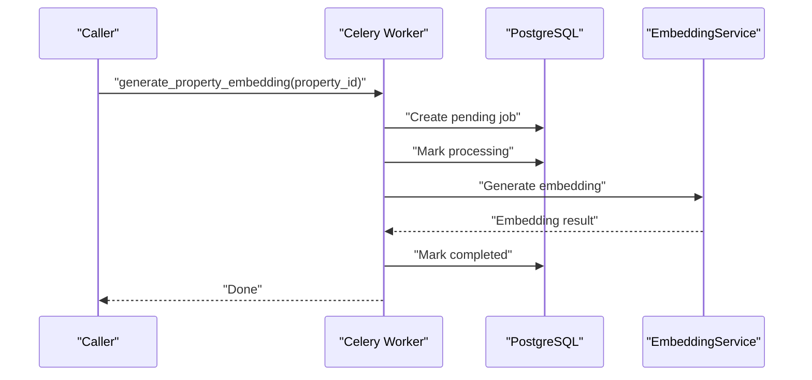

**Diagram sources**
- [embedding_tasks.py:16-81](file://backend/app/tasks/embedding_tasks.py#L16-L81)
- [embedding_tasks.py:83-112](file://backend/app/tasks/embedding_tasks.py#L83-L112)
- [import_tasks.py:13-44](file://backend/app/tasks/import_tasks.py#L13-L44)

**Section sources**
- [embedding_tasks.py:1-112](file://backend/app/tasks/embedding_tasks.py#L1-112)
- [import_tasks.py:1-44](file://backend/app/tasks/import_tasks.py#L1-44)

#### Notifications (WeChat, SMS, Email)
- send_wechat_template_message resolves user openid and sends template message.
- send_booking_confirm_message and send_booking_reminder_message build template data and delegate to WeChat task.
- send_sms_notification and send_email_notification resolve contact info and dispatch via respective services.

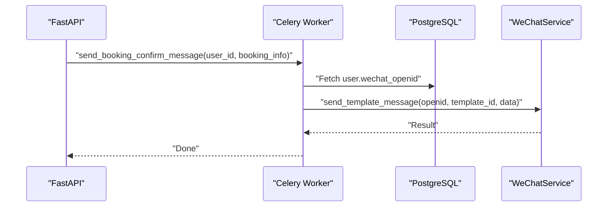

**Diagram sources**
- [notification_tasks.py:53-97](file://backend/app/tasks/notification_tasks.py#L53-L97)
- [notification_tasks.py:100-131](file://backend/app/tasks/notification_tasks.py#L100-L131)
- [notification_tasks.py:136-173](file://backend/app/tasks/notification_tasks.py#L136-L173)
- [notification_tasks.py:178-217](file://backend/app/tasks/notification_tasks.py#L178-L217)

**Section sources**
- [notification_tasks.py:1-217](file://backend/app/tasks/notification_tasks.py#L1-217)

#### Payment Operations
- sync_pending_payments queries pending/processing payments and updates statuses based on WeChat Pay responses.
- close_expired_payments closes orders older than a cutoff and updates related bookings.
- send_payment_result_message notifies users about payment success/failure via WeChat templates.

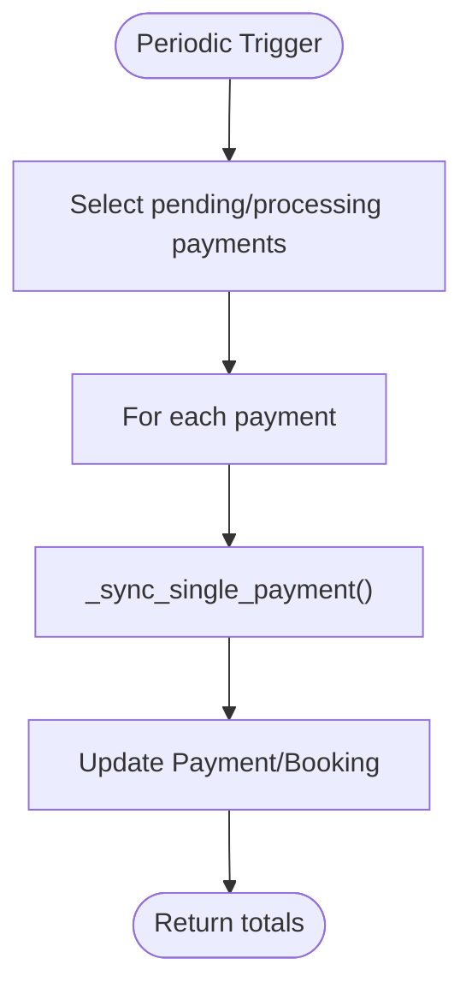

**Diagram sources**
- [payment_tasks.py:80-118](file://backend/app/tasks/payment_tasks.py#L80-L118)
- [payment_tasks.py:121-173](file://backend/app/tasks/payment_tasks.py#L121-L173)
- [payment_tasks.py:176-241](file://backend/app/tasks/payment_tasks.py#L176-L241)

**Section sources**
- [payment_tasks.py:1-241](file://backend/app/tasks/payment_tasks.py#L1-241)

### Container Orchestration with Docker Compose
- Development compose includes PostgreSQL and Redis with healthchecks and persistent volumes.
- Production compose defines:
  - PostgreSQL with memory limits and healthcheck.
  - Redis with AOF persistence, password protection, and memory policies.
  - FastAPI backend with env_file, depends_on, resource limits, and json-file logging.
  - Celery worker listening on default, embedding, and import queues with concurrency settings.
  - Celery Beat service for scheduling periodic tasks.
  - Nginx reverse proxy for frontend and API.

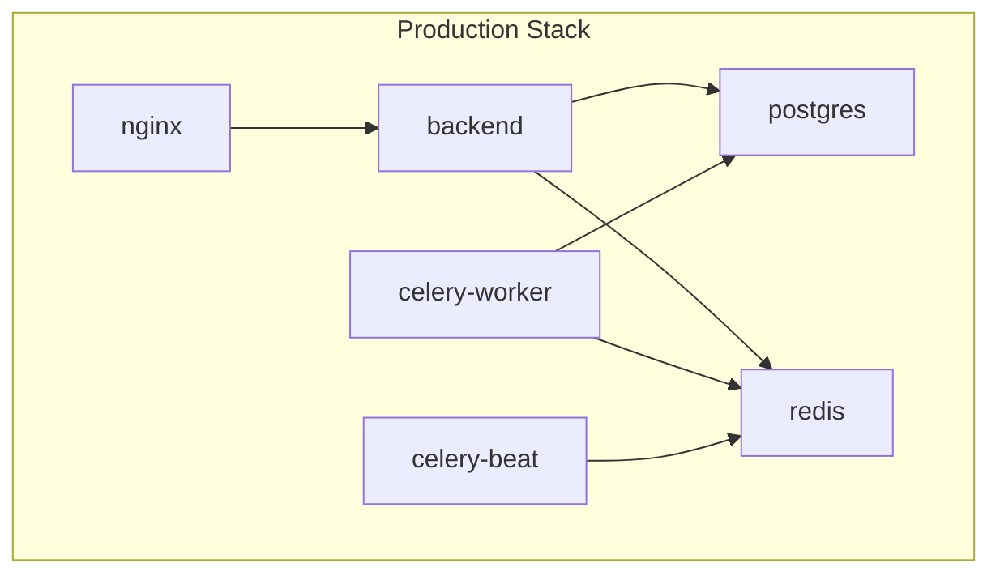

**Diagram sources**
- [docker-compose.prod.yml:10-196](file://docker-compose.prod.yml#L10-L196)

**Section sources**
- [docker-compose.yml:1-53](file://docker-compose.yml#L1-L53)
- [docker-compose.prod.yml:1-217](file://docker-compose.prod.yml#L1-L217)

## Dependency Analysis
Key dependencies include Celery, Redis, SQLAlchemy async engines, and Prometheus client. The application wires these together via configuration and startup routines.

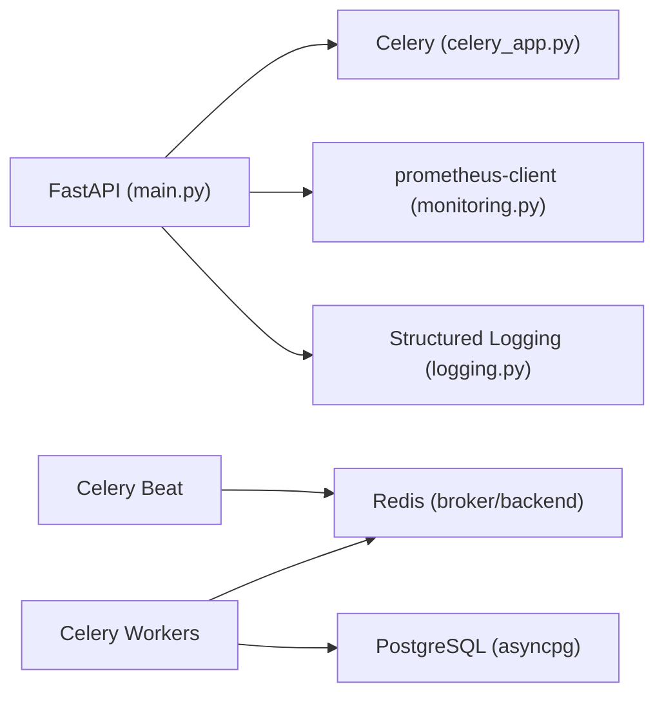

**Diagram sources**
- [requirements.txt:17-22](file://backend/requirements.txt#L17-L22)
- [main.py:41-69](file://backend/app/main.py#L41-L69)
- [celery_app.py:9-30](file://backend/app/celery_app.py#L9-L30)
- [monitoring.py:1-68](file://backend/app/core/monitoring.py#L1-68)

**Section sources**
- [requirements.txt:1-23](file://backend/requirements.txt#L1-L23)
- [main.py:1-82](file://backend/app/main.py#L1-L82)
- [celery_app.py:1-31](file://backend/app/celery_app.py#L1-L31)
- [monitoring.py:1-68](file://backend/app/core/monitoring.py#L1-L68)

## Performance Considerations
- Queue separation: Route heavy or specialized tasks to dedicated queues (embedding, import) to avoid contention.
- Concurrency tuning: Adjust worker concurrency based on CPU/memory profiles and I/O characteristics.
- Database pool sizing: Monitor DB_POOL_* gauges to ensure adequate pool capacity and detect overflow.
- Histogram buckets: Tune latency buckets for HTTP and task durations to capture tail latencies accurately.
- Memory limits: Apply container resource limits to prevent noisy neighbor issues and enable autoscaling decisions.

[No sources needed since this section provides general guidance]

## Troubleshooting Guide
- Verify metrics availability:
  - Check /metrics endpoint exposure and Prometheus scraping configuration.
- Inspect task execution:
  - Use Celery Flower dashboard to monitor active tasks, queues, and worker status.
- Review logs:
  - In production, logs are JSON-formatted and rotated by Docker logging driver; aggregate with a central logging solution.
- Common issues:
  - Redis connectivity: Ensure REDIS_URL is correct and reachable from all services.
  - Database pool saturation: Observe DB_POOL_CHECKED_OUT and DB_POOL_OVERFLOW; tune pool sizes accordingly.
  - Task retries: Tasks define autoretry_for and retry_backoff; excessive retries may indicate downstream failures.

**Section sources**
- [monitoring.py:167-176](file://backend/app/core/monitoring.py#L167-L176)
- [logging.py:77-101](file://backend/app/core/logging.py#L77-L101)
- [docker-compose.prod.yml:94-98](file://docker-compose.prod.yml#L94-L98)
- [docker-compose.prod.yml:133-137](file://docker-compose.prod.yml#L133-L137)

## Conclusion
The system leverages Celery for robust background processing, Redis as a reliable broker, and Prometheus for comprehensive observability. Structured logging and Docker Compose orchestration provide clear operational visibility and scalability. With proper alerting and scaling strategies, the platform can handle high-volume workloads reliably.

[No sources needed since this section summarizes without analyzing specific files]

## Appendices

### Example: Setting Up Monitoring Dashboards and Alerts
- Prometheus:
  - Scrape /metrics from the backend service.
  - Create Grafana dashboards for:
    - HTTP request rate and latency by endpoint.
    - Celery task counts and durations by task name.
    - Database pool utilization.
- Alerts:
  - High error rates: Increase in 5xx responses.
  - Task latency spikes: P95/P99 of celery_task_duration_seconds exceeds thresholds.
  - Worker starvation: Long queue lengths or low task throughput.
  - Resource exhaustion: DB pool overflow or container memory near limits.

[No sources needed since this section provides general guidance]