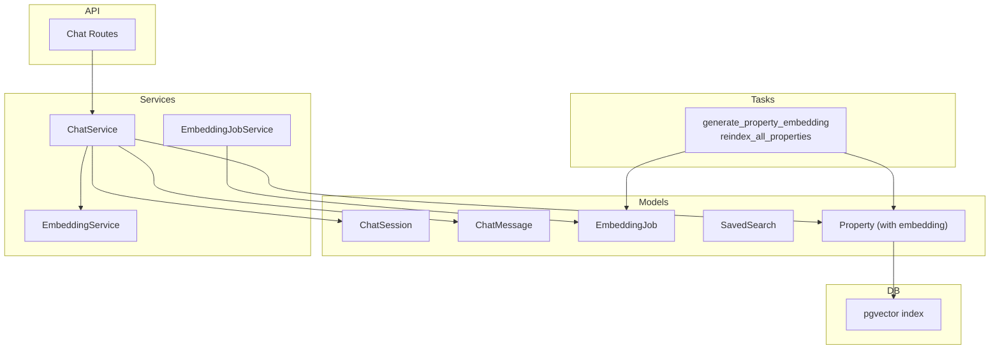
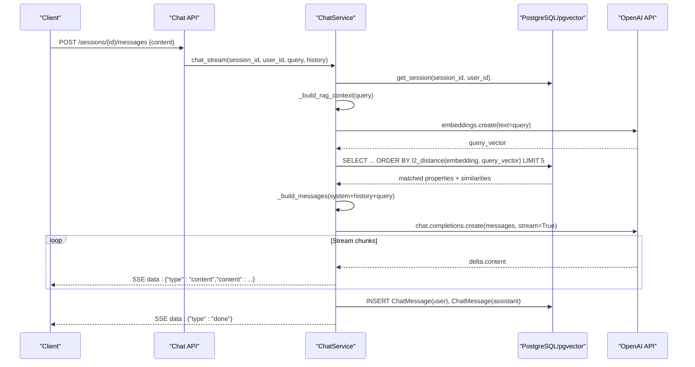
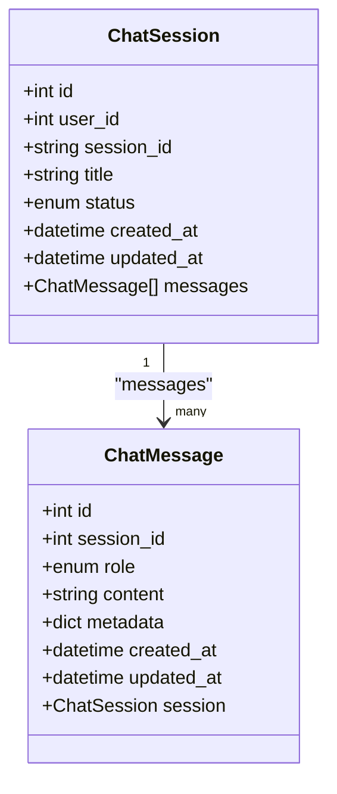
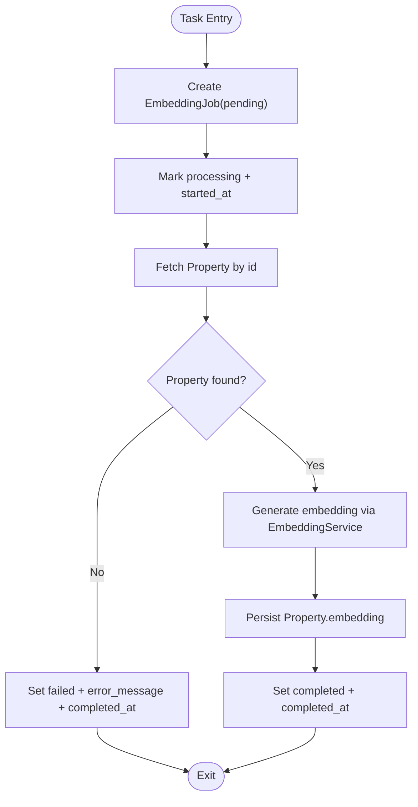
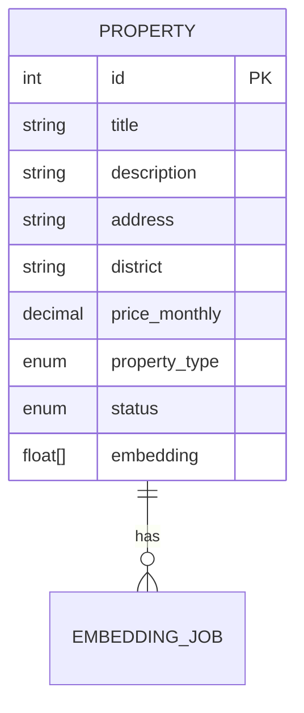
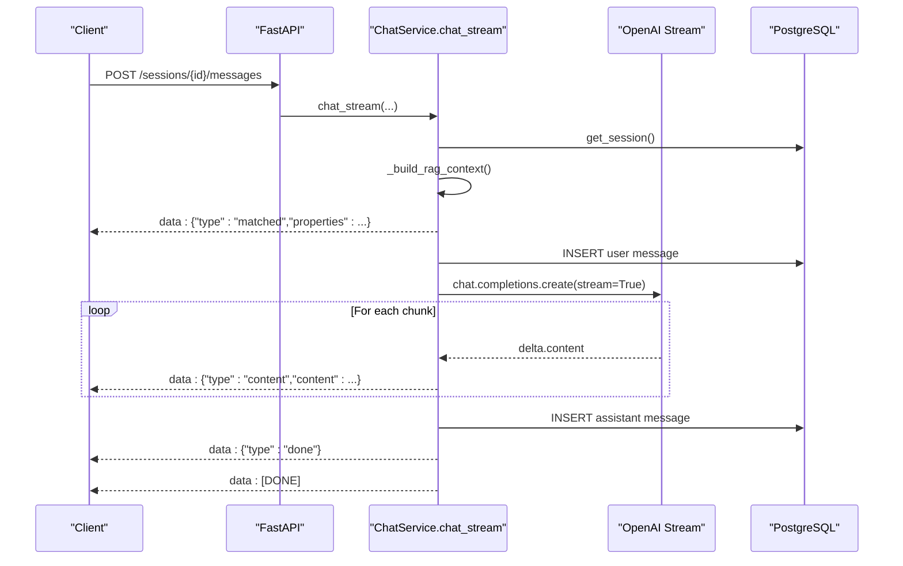
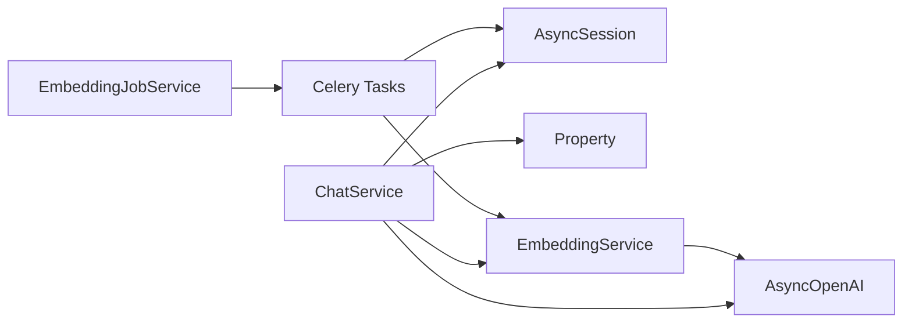

# AI & Chat Data Models

<cite>
**Referenced Files in This Document**
- [chat.py](file://backend/app/models/chat.py)
- [embedding_job.py](file://backend/app/models/embedding_job.py)
- [saved_search.py](file://backend/app/models/saved_search.py)
- [property.py](file://backend/app/models/property.py)
- [chat_service.py](file://backend/app/services/chat_service.py)
- [embedding_service.py](file://backend/app/services/embedding_service.py)
- [embedding_job_service.py](file://backend/app/services/embedding_job_service.py)
- [embedding_tasks.py](file://backend/app/tasks/embedding_tasks.py)
- [chat.py](file://backend/app/api/v1/routes/chat.py)
- [ai_search.py](file://backend/app/schemas/ai_search.py)
- [20260622_0006_chat_tables.py](file://backend/alembic/versions/20260622_0006_chat_tables.py)
- [20260620_0005_embedding_jobs_and_audit_logs.py](file://backend/alembic/versions/20260620_0005_embedding_jobs_and_audit_logs.py)
- [20260620_0002_pgvector_embedding.py](file://backend/alembic/versions/20260620_0002_pgvector_embedding.py)
</cite>

## Table of Contents
1. [Introduction](#introduction)
2. [Project Structure](#project-structure)
3. [Core Components](#core-components)
4. [Architecture Overview](#architecture-overview)
5. [Detailed Component Analysis](#detailed-component-analysis)
6. [Dependency Analysis](#dependency-analysis)
7. [Performance Considerations](#performance-considerations)
8. [Troubleshooting Guide](#troubleshooting-guide)
9. [Conclusion](#conclusion)
10. [Appendices](#appendices)

## Introduction
This document provides comprehensive data model documentation for AI and chat functionality entities, focusing on:
- ChatMessage and ChatSession models with conversation threading, message types, and streaming response support
- EmbeddingJob model for background vector embedding generation and processing status
- SavedSearch model for user search history and preference tracking
- Vector similarity storage patterns using pgvector
- Conversation context management via Retrieval-Augmented Generation (RAG)
- AI interaction analytics through metadata and job tracking
- Embedding job queue integration, progress tracking, and error recovery mechanisms
- Examples of chat session management, embedding generation workflows, and search optimization patterns

## Project Structure
The AI and chat features are implemented across models, services, tasks, API routes, and database migrations:
- Models define persistent schemas for chat sessions/messages, embedding jobs, saved searches, and property embeddings
- Services implement business logic including RAG context building, streaming chat, and job orchestration
- Tasks handle asynchronous embedding generation via Celery
- API routes expose endpoints for chat and embedding job management
- Migrations create tables, enums, indexes, and the pgvector extension

**Diagram sources**
- [chat.py:23-62](file://backend/app/models/chat.py#L23-L62)
- [embedding_job.py:17-35](file://backend/app/models/embedding_job.py#L17-L35)
- [saved_search.py:13-28](file://backend/app/models/saved_search.py#L13-L28)
- [property.py:38-86](file://backend/app/models/property.py#L38-L86)
- [chat_service.py:17-302](file://backend/app/services/chat_service.py#L17-L302)
- [embedding_job_service.py:7-54](file://backend/app/services/embedding_job_service.py#L7-L54)
- [embedding_tasks.py:16-112](file://backend/app/tasks/embedding_tasks.py#L16-L112)
- [chat.py:10-143](file://backend/app/api/v1/routes/chat.py#L10-L143)
- [20260620_0002_pgvector_embedding.py:21-35](file://backend/alembic/versions/20260620_0002_pgvector_embedding.py#L21-L35)

**Section sources**
- [chat.py:23-62](file://backend/app/models/chat.py#L23-L62)
- [embedding_job.py:17-35](file://backend/app/models/embedding_job.py#L17-L35)
- [saved_search.py:13-28](file://backend/app/models/saved_search.py#L13-L28)
- [property.py:38-86](file://backend/app/models/property.py#L38-L86)
- [chat_service.py:17-302](file://backend/app/services/chat_service.py#L17-L302)
- [embedding_job_service.py:7-54](file://backend/app/services/embedding_job_service.py#L7-L54)
- [embedding_tasks.py:16-112](file://backend/app/tasks/embedding_tasks.py#L16-L112)
- [chat.py:10-143](file://backend/app/api/v1/routes/chat.py#L10-L143)
- [20260620_0002_pgvector_embedding.py:21-35](file://backend/alembic/versions/20260620_0002_pgvector_embedding.py#L21-L35)

## Core Components
- ChatSession: Represents a user’s conversation thread with unique session_id, title, and status (active/closed). Messages cascade delete with the session.
- ChatMessage: Stores individual messages within a session, including role (user/assistant/system), content, and optional JSON metadata for analytics and matched properties.
- EmbeddingJob: Tracks background vector embedding generation per property, with lifecycle states (pending/processing/completed/failed), timestamps, and error messages.
- SavedSearch: Captures user-defined search criteria as JSON query_params, notification preferences, and last notified timestamp.
- Property.embedding: Stores a 1536-dimensional vector for semantic similarity search using pgvector.

Key responsibilities:
- ChatService orchestrates session management, RAG context building, OpenAI calls, and streaming responses.
- EmbeddingService generates embeddings from text or property data.
- EmbeddingJobService lists jobs, aggregates stats, and triggers reindexing via Celery tasks.
- Celery tasks manage job state transitions, error handling, retries, and completion logging.

**Section sources**
- [chat.py:23-62](file://backend/app/models/chat.py#L23-L62)
- [embedding_job.py:17-35](file://backend/app/models/embedding_job.py#L17-L35)
- [saved_search.py:13-28](file://backend/app/models/saved_search.py#L13-L28)
- [property.py:78-86](file://backend/app/models/property.py#L78-L86)
- [chat_service.py:17-302](file://backend/app/services/chat_service.py#L17-L302)
- [embedding_service.py:17-32](file://backend/app/services/embedding_service.py#L17-L32)
- [embedding_job_service.py:7-54](file://backend/app/services/embedding_job_service.py#L7-L54)
- [embedding_tasks.py:16-112](file://backend/app/tasks/embedding_tasks.py#L16-L112)

## Architecture Overview
The system integrates chat interactions with semantic search powered by pgvector and OpenAI embeddings. ChatService builds RAG context by embedding user queries and retrieving top similar properties. Streaming responses deliver real-time content chunks to clients. EmbeddingJobService and Celery tasks asynchronously generate and persist property embeddings.

**Diagram sources**
- [chat.py:106-130](file://backend/app/api/v1/routes/chat.py#L106-L130)
- [chat_service.py:227-302](file://backend/app/services/chat_service.py#L227-L302)
- [chat_service.py:87-143](file://backend/app/services/chat_service.py#L87-L143)
- [property.py:78-86](file://backend/app/models/property.py#L78-L86)
- [20260620_0002_pgvector_embedding.py:21-35](file://backend/alembic/versions/20260620_0002_pgvector_embedding.py#L21-L35)

## Detailed Component Analysis

### ChatSession and ChatMessage Models
- ChatSession:
  - Fields: id, user_id, session_id (unique hex), title, status (active/closed), timestamps
  - Relationships: one-to-many with ChatMessage; cascade delete-orphan
  - Indexes: id, user_id, session_id
- ChatMessage:
  - Fields: id, session_id, role (user/assistant/system), content (text), metadata (JSON), timestamps
  - Relationships: belongs to ChatSession
  - Indexes: id, session_id

Use cases:
- Threading: Each session groups related messages; ordering by created_at preserves conversation flow
- Metadata: Store analytics like matched_properties or search_params for post-hoc analysis
- Status: Track active vs closed sessions for UI and lifecycle management

**Diagram sources**
- [chat.py:23-62](file://backend/app/models/chat.py#L23-L62)
- [20260622_0006_chat_tables.py:23-53](file://backend/alembic/versions/20260622_0006_chat_tables.py#L23-L53)

**Section sources**
- [chat.py:23-62](file://backend/app/models/chat.py#L23-L62)
- [20260622_0006_chat_tables.py:23-53](file://backend/alembic/versions/20260622_0006_chat_tables.py#L23-L53)

### EmbeddingJob Model and Queue Integration
- EmbeddingJob:
  - Fields: id, property_id, status (pending/processing/completed/failed), error_message, started_at, completed_at, created_at
  - Indexes: id, property_id
- Job lifecycle:
  - pending -> processing -> completed or failed
  - Error messages captured up to 2000 characters
  - Timestamps track start and completion times

Queue integration:
- Celery task generate_property_embedding creates and updates job records
- Task retries with exponential backoff and max_retries=3
- reindex_all_properties enqueues missing embeddings

**Diagram sources**
- [embedding_tasks.py:16-80](file://backend/app/tasks/embedding_tasks.py#L16-L80)
- [embedding_job.py:17-35](file://backend/app/models/embedding_job.py#L17-L35)
- [embedding_service.py:17-32](file://backend/app/services/embedding_service.py#L17-L32)

**Section sources**
- [embedding_job.py:17-35](file://backend/app/models/embedding_job.py#L17-L35)
- [embedding_tasks.py:16-112](file://backend/app/tasks/embedding_tasks.py#L16-L112)
- [embedding_job_service.py:7-54](file://backend/app/services/embedding_job_service.py#L7-L54)

### SavedSearch Model
- SavedSearch:
  - Fields: id, user_id, name, query_params (JSON), notify_enabled (bool), last_notified_at, timestamps
  - Relationship: belongs to User
- Purpose:
  - Persist user search preferences and conditions
  - Enable notifications when new properties match saved criteria
  - Track last notification time to avoid spam

Optimization patterns:
- Use JSON query_params for flexible filters (district, price ranges, bedrooms, keywords)
- Boolean flag notify_enabled allows toggling alerts without deleting saved searches
- last_notified_at supports deduplication and throttling

**Section sources**
- [saved_search.py:13-28](file://backend/app/models/saved_search.py#L13-L28)

### Vector Similarity Storage Patterns
- Property.embedding stores a 1536-dim vector using pgvector
- IVFFlat index configured with vector_l2_ops and lists=100 for approximate nearest neighbor search
- L2 distance used for similarity ranking in RAG context builder

Storage and indexing:
- Extension vector enabled at migration time
- Custom TypeDecorator VectorColumn abstracts dialect-specific behavior
- Index creation ensures efficient similarity queries

**Diagram sources**
- [property.py:38-86](file://backend/app/models/property.py#L38-L86)
- [20260620_0002_pgvector_embedding.py:21-35](file://backend/alembic/versions/20260620_0002_pgvector_embedding.py#L21-L35)
- [embedding_job.py:17-35](file://backend/app/models/embedding_job.py#L17-L35)

**Section sources**
- [property.py:12-22](file://backend/app/models/property.py#L12-L22)
- [property.py:78-86](file://backend/app/models/property.py#L78-L86)
- [20260620_0002_pgvector_embedding.py:21-35](file://backend/alembic/versions/20260620_0002_pgvector_embedding.py#L21-L35)

### Conversation Context Management and AI Interaction Analytics
- RAG context builder:
  - Generates embedding for user query
  - Retrieves top 5 available properties ordered by L2 distance
  - Constructs context text and structured matched_properties list
- Message metadata:
  - user messages include search_params placeholder for future expansion
  - assistant messages include matched_properties for analytics and UI rendering
- System prompt:
  - Guides assistant behavior to reference specific properties and suggest adjustments if no matches

Analytics opportunities:
- Track matched_properties similarity scores
- Log assistant reply length and token usage via metadata
- Monitor session titles auto-generated from first user message

**Section sources**
- [chat_service.py:87-143](file://backend/app/services/chat_service.py#L87-L143)
- [chat_service.py:155-169](file://backend/app/services/chat_service.py#L155-L169)
- [chat_service.py:206-225](file://backend/app/services/chat_service.py#L206-L225)

### Streaming Response Support
- chat_stream yields Server-Sent Events (SSE) with typed payloads:
  - type: "matched" with properties list
  - type: "content" with incremental delta content
  - type: "done" signaling completion
- User message persisted before streaming begins
- Assistant message persisted after full reply aggregation
- Error handling yields error payload and final [DONE] marker

**Diagram sources**
- [chat.py:106-130](file://backend/app/api/v1/routes/chat.py#L106-L130)
- [chat_service.py:227-302](file://backend/app/services/chat_service.py#L227-L302)

**Section sources**
- [chat.py:106-130](file://backend/app/api/v1/routes/chat.py#L106-L130)
- [chat_service.py:227-302](file://backend/app/services/chat_service.py#L227-L302)

### Search Optimization Patterns
- ParsedSearchParams and AiSearchRequest/Response schemas define natural language parsing and structured search parameters
- Limit parameter controls result count (default 30, max 50)
- Summary field generated by AI to provide concise overview of results
- Top IDs highlight most relevant properties in summary

Integration points:
- ai_search.py schemas complement chat RAG by providing explicit search interfaces
- Combined with saved searches for recurring queries and notifications

**Section sources**
- [ai_search.py:27-74](file://backend/app/schemas/ai_search.py#L27-L74)

## Dependency Analysis
- ChatService depends on:
  - AsyncOpenAI client for embeddings and chat completions
  - SQLAlchemy async session for querying and persistence
  - Property model for vector similarity search
- EmbeddingJobService depends on:
  - Celery tasks for reindexing and single-property embedding
- EmbeddingService depends on:
  - AsyncOpenAI client for embeddings
- Celery tasks depend on:
  - Async engine/session for independent DB access
  - EmbeddingService for vector generation

Potential coupling:
- ChatService imports EmbeddingService and pgvector.distance expression inline
- Tasks import models and services directly; ensure consistent configuration across workers

Circular dependencies:
- None detected between models and services; imports are unidirectional

External integrations:
- OpenAI API for embeddings and chat completions
- PostgreSQL with pgvector extension for vector storage and similarity search

**Diagram sources**
- [chat_service.py:17-302](file://backend/app/services/chat_service.py#L17-L302)
- [embedding_service.py:17-32](file://backend/app/services/embedding_service.py#L17-L32)
- [embedding_tasks.py:16-112](file://backend/app/tasks/embedding_tasks.py#L16-L112)
- [embedding_job_service.py:7-54](file://backend/app/services/embedding_job_service.py#L7-L54)

**Section sources**
- [chat_service.py:17-302](file://backend/app/services/chat_service.py#L17-L302)
- [embedding_service.py:17-32](file://backend/app/services/embedding_service.py#L17-L32)
- [embedding_tasks.py:16-112](file://backend/app/tasks/embedding_tasks.py#L16-L112)
- [embedding_job_service.py:7-54](file://backend/app/services/embedding_job_service.py#L7-L54)

## Performance Considerations
- Vector index tuning:
  - IVFFlat lists=100 balances recall and latency; adjust based on dataset size and query volume
- Query limits:
  - RAG context retrieval limited to top 5 properties to reduce payload and LLM cost
- Streaming:
  - SSE reduces perceived latency and improves UX for long responses
- Job batching:
  - reindex_all_properties enqueues only missing embeddings to minimize redundant work
- Connection pooling:
  - Ensure async engine settings optimize concurrency for tasks and API requests

[No sources needed since this section provides general guidance]

## Troubleshooting Guide
Common issues and resolutions:
- Session not found:
  - Verify session_id and user_id; ensure session exists and is accessible by current user
- No matching properties:
  - Check Property.embedding presence and availability status; trigger reindex if vectors missing
- Embedding job failures:
  - Inspect error_message and completed_at; retry via job service or reindex endpoint
- Streaming interruptions:
  - Confirm SSE headers and server buffering disabled; check network stability and client event listeners

Operational checks:
- List embedding jobs and stats to monitor queue health
- Validate pgvector extension and index existence
- Review Celery worker logs for task errors and retries

**Section sources**
- [chat_service.py:227-302](file://backend/app/services/chat_service.py#L227-L302)
- [embedding_tasks.py:70-76](file://backend/app/tasks/embedding_tasks.py#L70-L76)
- [embedding_job_service.py:21-43](file://backend/app/services/embedding_job_service.py#L21-L43)

## Conclusion
The AI and chat data models provide a robust foundation for conversational rental assistance with semantic search capabilities. ChatSession and ChatMessage enable threaded conversations with rich metadata for analytics. EmbeddingJob tracks asynchronous vector generation with clear lifecycle states and error reporting. SavedSearch captures user preferences for proactive notifications. The integration of pgvector and OpenAI embeddings powers accurate, context-aware recommendations, while streaming responses enhance user experience. Proper indexing, job orchestration, and error handling ensure scalability and reliability.

[No sources needed since this section summarizes without analyzing specific files]

## Appendices

### Example Workflows

- Chat session management:
  - Create session, send messages, retrieve history, close/delete sessions
  - Auto-title on first message; metadata includes matched properties for analytics

- Embedding generation workflow:
  - Trigger single or bulk reindexing
  - Jobs transition through states; errors captured and logged
  - Completed jobs update Property.embedding for similarity search

- Search optimization patterns:
  - Parse natural language into structured parameters
  - Combine with saved searches for recurring queries
  - Limit results and provide summaries for clarity

[No sources needed since this section doesn't analyze specific files]