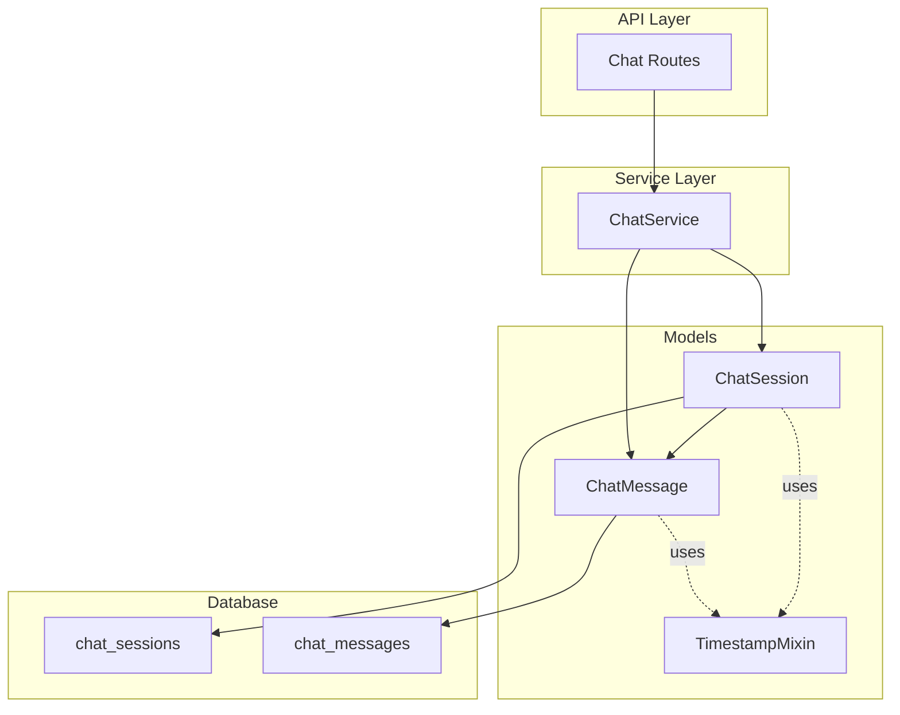
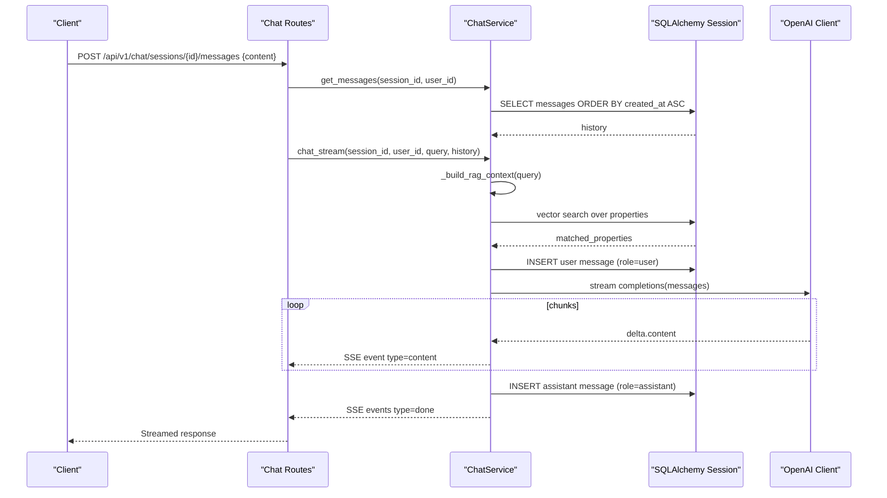
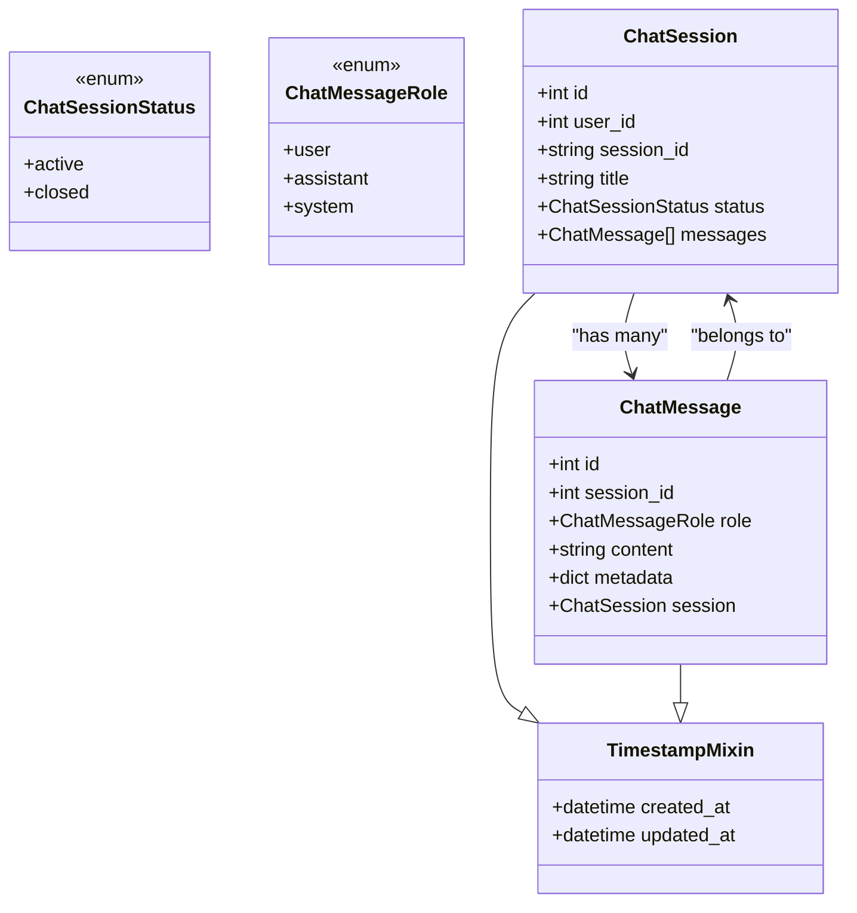
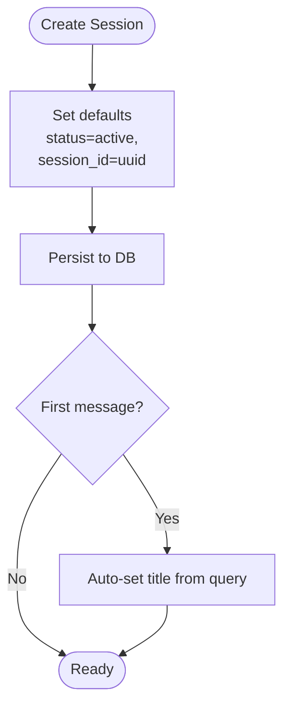
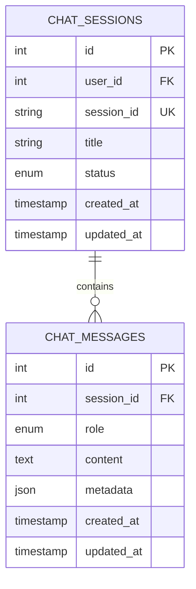
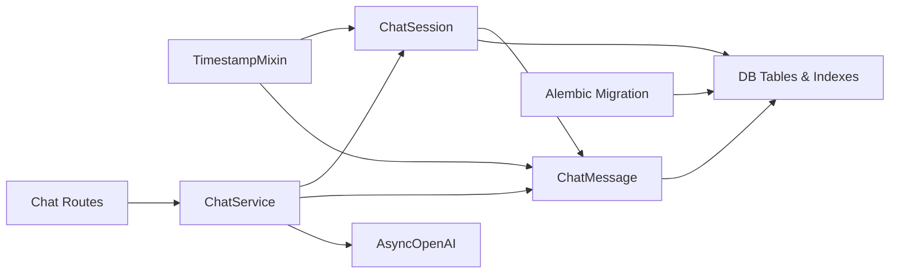

# Chat System Models

<cite>
**Referenced Files in This Document**
- [chat.py](file://backend/app/models/chat.py)
- [mixins.py](file://backend/app/models/mixins.py)
- [20260622_0006_chat_tables.py](file://backend/alembic/versions/20260622_0006_chat_tables.py)
- [chat_service.py](file://backend/app/services/chat_service.py)
- [chat.py](file://backend/app/api/v1/routes/chat.py)
- [test_chat.py](file://backend/tests/test_chat.py)
</cite>

## Table of Contents
1. [Introduction](#introduction)
2. [Project Structure](#project-structure)
3. [Core Components](#core-components)
4. [Architecture Overview](#architecture-overview)
5. [Detailed Component Analysis](#detailed-component-analysis)
6. [Dependency Analysis](#dependency-analysis)
7. [Performance Considerations](#performance-considerations)
8. [Troubleshooting Guide](#troubleshooting-guide)
9. [Conclusion](#conclusion)
10. [Appendices](#appendices)

## Introduction
This document provides comprehensive data model documentation for the chat system entities, focusing on:
- ChatSession lifecycle management and user association
- Conversation threading via ChatMessage with roles (user, assistant, system)
- Relationship between sessions and messages, including cascade deletion
- Indexing strategies for performance optimization
- JSON metadata structure used to store AI response context, streaming state, and interaction analytics
- Practical examples of session creation, message persistence, and conversation retrieval patterns

The chat system integrates with an external AI provider to generate responses and uses a RAG pipeline to enrich prompts with property search results.

## Project Structure
The chat domain spans models, services, API routes, migrations, and tests:
- Data models define tables and relationships
- Services implement business logic for sessions and messages
- API routes expose endpoints for clients
- Migrations create database schema and indexes
- Tests validate behavior and authentication requirements

**Diagram sources**
- [chat.py:23-61](file://backend/app/models/chat.py#L23-L61)
- [mixins.py:7-18](file://backend/app/models/mixins.py#L7-L18)
- [chat_service.py:17-71](file://backend/app/services/chat_service.py#L17-L71)
- [chat.py:45-143](file://backend/app/api/v1/routes/chat.py#L45-L143)
- [20260622_0006_chat_tables.py:23-53](file://backend/alembic/versions/20260622_0006_chat_tables.py#L23-L53)

**Section sources**
- [chat.py:23-61](file://backend/app/models/chat.py#L23-L61)
- [mixins.py:7-18](file://backend/app/models/mixins.py#L7-L18)
- [chat_service.py:17-71](file://backend/app/services/chat_service.py#L17-L71)
- [chat.py:45-143](file://backend/app/api/v1/routes/chat.py#L45-L143)
- [20260622_0006_chat_tables.py:23-53](file://backend/alembic/versions/20260622_0006_chat_tables.py#L23-L53)

## Core Components
- ChatSession: Represents a conversation thread owned by a user, with status tracking and optional title.
- ChatMessage: Represents a single turn in a conversation, with role, content, and optional JSON metadata.
- TimestampMixin: Adds created_at and updated_at timestamps to both models.

Key behaviors:
- Session lifecycle: active/closed states; auto-title on first message; list ordered by updated_at desc.
- Message roles: user, assistant, system; content stored as text; metadata stores AI-related context.
- Relationships: One-to-many from ChatSession to ChatMessage with cascade delete-orphan.

**Section sources**
- [chat.py:12-61](file://backend/app/models/chat.py#L12-L61)
- [mixins.py:7-18](file://backend/app/models/mixins.py#L7-L18)

## Architecture Overview
High-level flow for chat interactions:
- Client calls API routes to create/list sessions or send messages.
- Service layer manages sessions/messages and interacts with the AI provider.
- Database persists sessions and messages with appropriate indexes.

**Diagram sources**
- [chat.py:106-130](file://backend/app/api/v1/routes/chat.py#L106-L130)
- [chat_service.py:171-301](file://backend/app/services/chat_service.py#L171-L301)
- [20260622_0006_chat_tables.py:40-53](file://backend/alembic/versions/20260622_0006_chat_tables.py#L40-L53)

## Detailed Component Analysis

### Data Model Class Diagram

**Diagram sources**
- [chat.py:12-61](file://backend/app/models/chat.py#L12-L61)
- [mixins.py:7-18](file://backend/app/models/mixins.py#L7-L18)

**Section sources**
- [chat.py:23-61](file://backend/app/models/chat.py#L23-L61)
- [mixins.py:7-18](file://backend/app/models/mixins.py#L7-L18)

### ChatSession Lifecycle Management
- Creation: New sessions are created with a unique session_id and default status active. Title can be provided or set later.
- Auto-title: On first user message when title is None, it is set to a truncated version of the query.
- Listing: Sessions are listed per user, ordered by updated_at descending.
- Closing: Status transitions to closed.
- Deletion: Deletes session and cascades to messages.

**Diagram sources**
- [chat_service.py:26-36](file://backend/app/services/chat_service.py#L26-L36)
- [chat_service.py:186-189](file://backend/app/services/chat_service.py#L186-L189)

**Section sources**
- [chat_service.py:26-36](file://backend/app/services/chat_service.py#L26-L36)
- [chat_service.py:186-189](file://backend/app/services/chat_service.py#L186-L189)

### ChatMessage Roles and Content Storage
- Roles: user, assistant, system.
- Content: Stored as text; supports long-form responses.
- Metadata: Optional JSON field for AI-related context such as matched properties and search parameters.

**Section sources**
- [chat.py:45-61](file://backend/app/models/chat.py#L45-L61)

### Relationship Between Sessions and Messages
- One-to-many relationship: ChatSession.messages references multiple ChatMessage entries.
- Cascade deletion: Deleting a session removes all associated messages.
- Lazy loading: Selectin strategy used for efficient eager loading when needed.

**Diagram sources**
- [20260622_0006_chat_tables.py:23-53](file://backend/alembic/versions/20260622_0006_chat_tables.py#L23-L53)
- [chat.py:40-42](file://backend/app/models/chat.py#L40-L42)

**Section sources**
- [chat.py:40-42](file://backend/app/models/chat.py#L40-L42)
- [20260622_0006_chat_tables.py:23-53](file://backend/alembic/versions/20260622_0006_chat_tables.py#L23-L53)

### Cascade Deletion Patterns
- Foreign key constraints enforce ondelete=CASCADE for both user_id and session_id.
- ORM relationship also configured with cascade="all, delete-orphan".

**Section sources**
- [20260622_0006_chat_tables.py:34-50](file://backend/alembic/versions/20260622_0006_chat_tables.py#L34-L50)
- [chat.py:27-29](file://backend/app/models/chat.py#L27-L29)
- [chat.py:49-51](file://backend/app/models/chat.py#L49-L51)
- [chat.py:40-42](file://backend/app/models/chat.py#L40-L42)

### Indexing Strategies for Performance Optimization
Indexes defined at migration level:
- chat_sessions: id, user_id, session_id (unique)
- chat_messages: id, session_id

These support:
- Fast lookup of sessions by user
- Unique access by session_id
- Efficient retrieval of messages per session

**Section sources**
- [20260622_0006_chat_tables.py:36-53](file://backend/alembic/versions/20260622_0006_chat_tables.py#L36-L53)

### JSON Metadata Structure for AI Interactions
Metadata fields used across the service:
- User message metadata:
  - search_params: object (placeholder for query/search parameters)
- Assistant message metadata:
  - matched_properties: array of objects describing matched properties and similarity scores

Example structures (described):
- search_params: {}
- matched_properties: [
    {
      "id": number,
      "title": string,
      "district": string,
      "address": string,
      "price_monthly": number,
      "bedrooms": number,
      "bathrooms": number,
      "area_sqm": number|null,
      "property_type": string,
      "similarity": number|null
    }
  ]

Streaming state:
- Streaming events use a separate protocol (SSE) with types like "matched", "content", "done", and "error". These are not persisted in metadata but represent transient streaming state during chat_stream.

**Section sources**
- [chat_service.py:207-218](file://backend/app/services/chat_service.py#L207-L218)
- [chat_service.py:260-293](file://backend/app/services/chat_service.py#L260-L293)
- [chat_service.py:254-296](file://backend/app/services/chat_service.py#L254-L296)

### Examples of Common Operations

#### Session Creation
- Endpoint: POST /api/v1/chat/sessions
- Request body: optional title
- Response: session details including id, session_id, title, status, timestamps
- Behavior: Creates a new session with status active and unique session_id

**Section sources**
- [chat.py:47-62](file://backend/app/api/v1/routes/chat.py#L47-L62)
- [chat_service.py:26-36](file://backend/app/services/chat_service.py#L26-L36)
- [test_chat.py:22-33](file://backend/tests/test_chat.py#L22-L33)

#### Message Persistence (Streaming)
- Endpoint: POST /api/v1/chat/sessions/{session_id}/messages
- Request body: content
- Behavior:
  - Fetches existing history for the session
  - Builds RAG context and matched properties
  - Streams SSE events: matched, content chunks, done
  - Persists user and assistant messages with metadata

**Section sources**
- [chat.py:106-130](file://backend/app/api/v1/routes/chat.py#L106-L130)
- [chat_service.py:227-301](file://backend/app/services/chat_service.py#L227-L301)

#### Conversation Retrieval
- Endpoint: GET /api/v1/chat/sessions/{session_id}/messages
- Behavior: Returns messages ordered by created_at ascending

**Section sources**
- [chat.py:85-103](file://backend/app/api/v1/routes/chat.py#L85-L103)
- [chat_service.py:73-83](file://backend/app/services/chat_service.py#L73-L83)

## Dependency Analysis
- Models depend on mixins for timestamps and Base for ORM foundation.
- Service depends on models and external OpenAI client.
- API routes depend on service and SQLAlchemy async session.
- Migrations define schema and indexes matching models.

**Diagram sources**
- [mixins.py:7-18](file://backend/app/models/mixins.py#L7-L18)
- [chat.py:23-61](file://backend/app/models/chat.py#L23-L61)
- [chat_service.py:17-23](file://backend/app/services/chat_service.py#L17-L23)
- [chat.py:1-10](file://backend/app/api/v1/routes/chat.py#L1-L10)
- [20260622_0006_chat_tables.py:23-53](file://backend/alembic/versions/20260622_0006_chat_tables.py#L23-L53)

**Section sources**
- [mixins.py:7-18](file://backend/app/models/mixins.py#L7-L18)
- [chat.py:23-61](file://backend/app/models/chat.py#L23-L61)
- [chat_service.py:17-23](file://backend/app/services/chat_service.py#L17-L23)
- [chat.py:1-10](file://backend/app/api/v1/routes/chat.py#L1-L10)
- [20260622_0006_chat_tables.py:23-53](file://backend/alembic/versions/20260622_0006_chat_tables.py#L23-L53)

## Performance Considerations
- Index usage:
  - user_id index accelerates listing sessions per user.
  - session_id unique index enables fast lookups by opaque session identifier.
  - session_id index on messages optimizes retrieval of conversation threads.
- Query ordering:
  - Sessions listed by updated_at desc to show most recent conversations first.
  - Messages retrieved by created_at asc to maintain chronological order.
- Streaming:
  - SSE streaming reduces perceived latency by sending content chunks progressively.
- RAG context:
  - Vector similarity search returns top-k matches to limit payload size and improve relevance.

[No sources needed since this section provides general guidance]

## Troubleshooting Guide
Common issues and checks:
- Authentication required: All chat endpoints require a valid token; missing token yields 401.
- Session not found: If session does not exist or belongs to another user, operations return errors or empty results.
- Streaming errors: Exceptions during streaming yield error events followed by a done marker.

Operational tips:
- Verify user_id scoping in session queries to prevent cross-user access.
- Ensure proper handling of SSE headers for reliable streaming in clients.

**Section sources**
- [test_chat.py:162-174](file://backend/tests/test_chat.py#L162-L174)
- [chat_service.py:235-239](file://backend/app/services/chat_service.py#L235-L239)
- [chat_service.py:298-301](file://backend/app/services/chat_service.py#L298-L301)

## Conclusion
The chat system’s data model centers on two core entities—ChatSession and ChatMessage—with clear lifecycle management, robust relationships, and thoughtful indexing. The service layer integrates AI capabilities and RAG context, persisting rich metadata for analytics and UI enhancements. Proper authentication, cascade deletion, and streaming ensure a secure, performant, and responsive user experience.

[No sources needed since this section summarizes without analyzing specific files]

## Appendices

### API Endpoints Summary
- Create session: POST /api/v1/chat/sessions
- List sessions: GET /api/v1/chat/sessions
- Get messages: GET /api/v1/chat/sessions/{session_id}/messages
- Send message (streaming): POST /api/v1/chat/sessions/{session_id}/messages
- Delete session: DELETE /api/v1/chat/sessions/{session_id}

**Section sources**
- [chat.py:47-143](file://backend/app/api/v1/routes/chat.py#L47-L143)

### Database Schema Summary
- Tables: chat_sessions, chat_messages
- Enums: chat_session_status (active, closed), chat_message_role (user, assistant, system)
- Indexes: id, user_id, session_id (unique) on sessions; id, session_id on messages

**Section sources**
- [20260622_0006_chat_tables.py:19-53](file://backend/alembic/versions/20260622_0006_chat_tables.py#L19-L53)