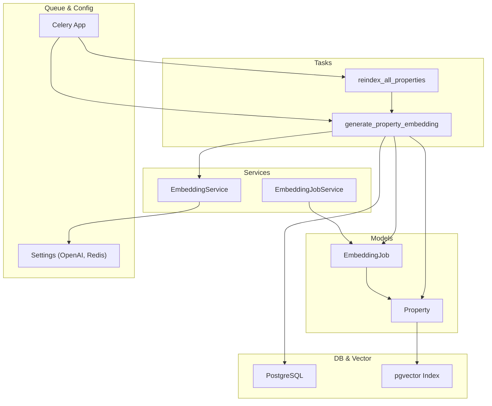
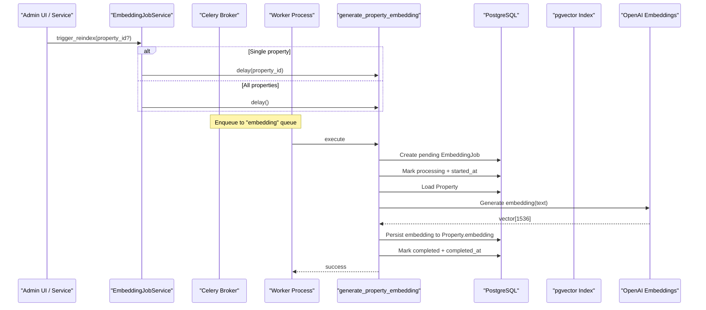
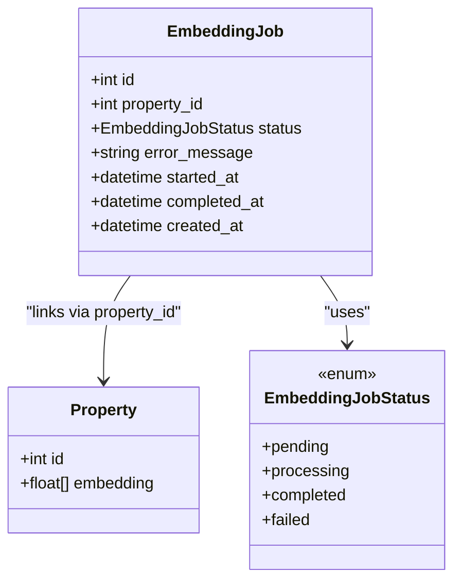
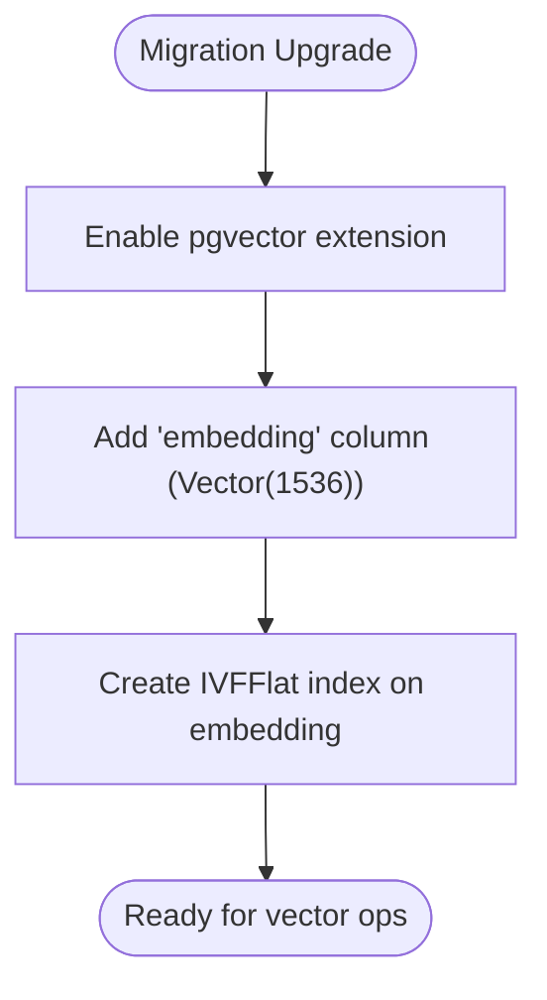
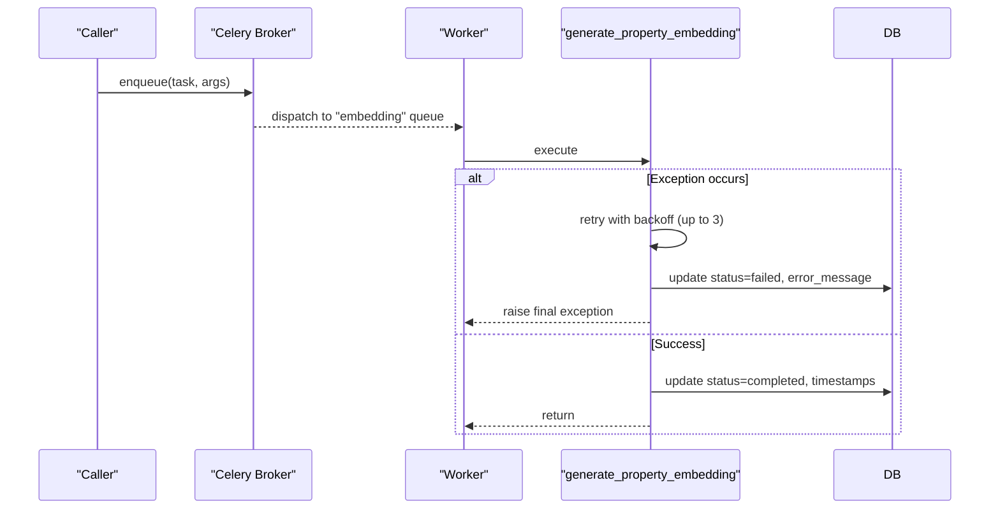
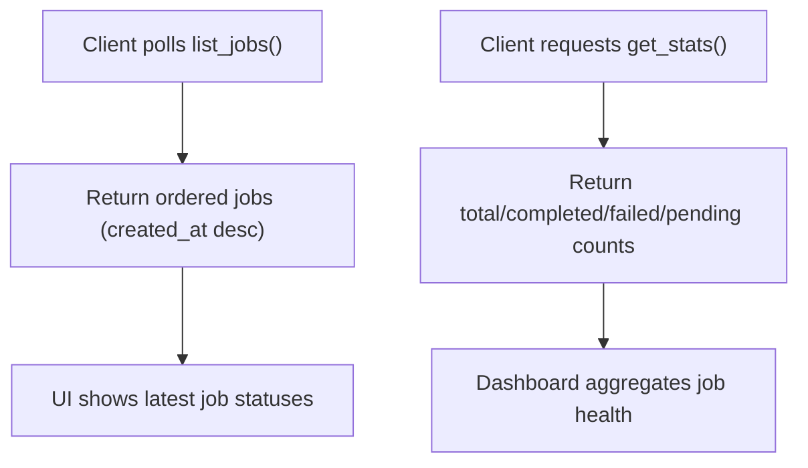
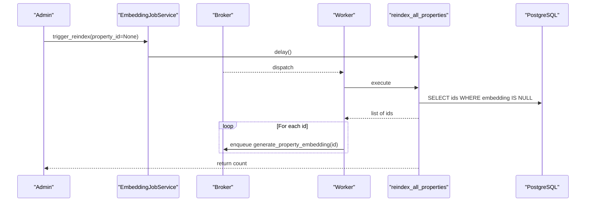
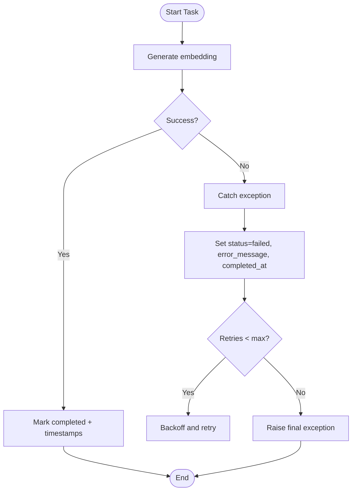
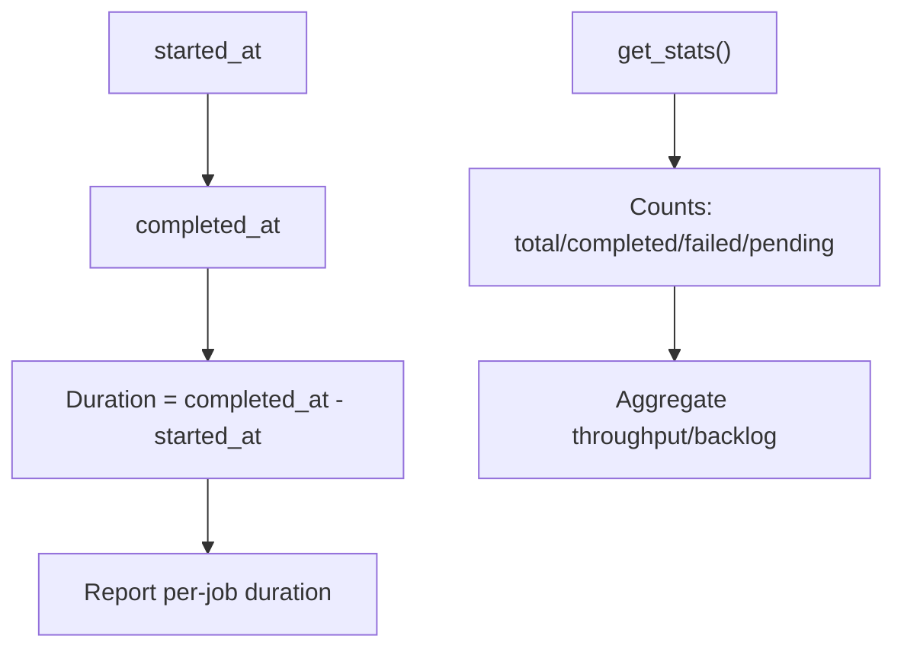
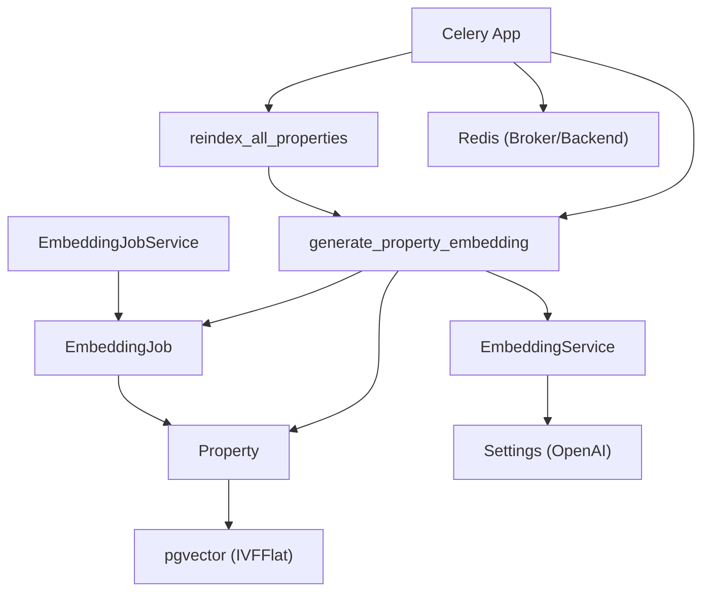

# Embedding Processing Models

<cite>
**Referenced Files in This Document**
- [embedding_job.py](file://backend/app/models/embedding_job.py)
- [property.py](file://backend/app/models/property.py)
- [embedding_tasks.py](file://backend/app/tasks/embedding_tasks.py)
- [embedding_service.py](file://backend/app/services/embedding_service.py)
- [embedding_job_service.py](file://backend/app/services/embedding_job_service.py)
- [celery_app.py](file://backend/app/celery_app.py)
- [20260620_0005_embedding_jobs_and_audit_logs.py](file://backend/alembic/versions/20260620_0005_embedding_jobs_and_audit_logs.py)
- [20260620_0002_pgvector_embedding.py](file://backend/alembic/versions/20260620_0002_pgvector_embedding.py)
- [config.py](file://backend/app/core/config.py)
- [test_embedding.py](file://backend/tests/test_embedding.py)
</cite>

## Table of Contents
1. [Introduction](#introduction)
2. [Project Structure](#project-structure)
3. [Core Components](#core-components)
4. [Architecture Overview](#architecture-overview)
5. [Detailed Component Analysis](#detailed-component-analysis)
6. [Dependency Analysis](#dependency-analysis)
7. [Performance Considerations](#performance-considerations)
8. [Troubleshooting Guide](#troubleshooting-guide)
9. [Conclusion](#conclusion)
10. [Appendices](#appendices)

## Introduction
This document provides comprehensive data model documentation for embedding processing entities, focusing on the EmbeddingJob model and its integration with property entities and vector storage. It explains job status tracking, progress monitoring, error handling, queue integration patterns, retry mechanisms, completion callbacks, and lifecycle management from creation to completion. It also includes examples of job creation, status polling, and batch processing workflows, along with performance metrics collection guidance.

## Project Structure
The embedding processing feature spans models, services, tasks, migrations, configuration, and tests:
- Data models define persistent structures for jobs and properties (including vector embeddings).
- Services encapsulate business logic for job listing, stats, and triggering reindexing.
- Celery tasks orchestrate asynchronous embedding generation and batch reindexing.
- Migrations set up database schema, including pgvector extension and indexes.
- Configuration centralizes external service settings (OpenAI embedding model, Redis broker/backend).
- Tests validate embedding dimensionality and text construction behavior.

**Diagram sources**
- [embedding_job.py:17-35](file://backend/app/models/embedding_job.py#L17-L35)
- [property.py:38-86](file://backend/app/models/property.py#L38-L86)
- [embedding_job_service.py:7-54](file://backend/app/services/embedding_job_service.py#L7-L54)
- [embedding_tasks.py:16-112](file://backend/app/tasks/embedding_tasks.py#L16-L112)
- [embedding_service.py:17-32](file://backend/app/services/embedding_service.py#L17-L32)
- [celery_app.py:9-31](file://backend/app/celery_app.py#L9-L31)
- [config.py:46-53](file://backend/app/core/config.py#L46-L53)
- [20260620_0002_pgvector_embedding.py:21-35](file://backend/alembic/versions/20260620_0002_pgvector_embedding.py#L21-L35)

**Section sources**
- [embedding_job.py:17-35](file://backend/app/models/embedding_job.py#L17-L35)
- [property.py:38-86](file://backend/app/models/property.py#L38-L86)
- [embedding_tasks.py:16-112](file://backend/app/tasks/embedding_tasks.py#L16-L112)
- [embedding_service.py:17-32](file://backend/app/services/embedding_service.py#L17-L32)
- [embedding_job_service.py:7-54](file://backend/app/services/embedding_job_service.py#L7-L54)
- [celery_app.py:9-31](file://backend/app/celery_app.py#L9-L31)
- [config.py:46-53](file://backend/app/core/config.py#L46-L53)
- [20260620_0002_pgvector_embedding.py:21-35](file://backend/alembic/versions/20260620_0002_pgvector_embedding.py#L21-L35)

## Core Components
- EmbeddingJob model: Tracks background vector embedding tasks per property with status, timestamps, and error messages.
- Property model: Holds textual fields and a vector embedding column using pgvector; used as input and target for embedding updates.
- EmbeddingJobService: Provides listing, statistics, and triggers for single or all-property reindexing via Celery tasks.
- Celery Tasks: generate_property_embedding orchestrates async DB operations, embedding generation, and job state transitions; reindex_all_properties enqueues missing embeddings.
- EmbeddingService: Wraps OpenAI Async client to produce 1536-dimensional vectors from concatenated property text.
- Celery App: Configures broker/backend (Redis), task serialization, routing to dedicated queues, and eager mode flags.
- Migrations: Enable pgvector extension, add embedding column and IVFFlat index; create embedding_jobs table and indexes.
- Settings: Provide OpenAI API key/model and Redis URL for Celery.

**Section sources**
- [embedding_job.py:17-35](file://backend/app/models/embedding_job.py#L17-L35)
- [property.py:38-86](file://backend/app/models/property.py#L38-L86)
- [embedding_job_service.py:7-54](file://backend/app/services/embedding_job_service.py#L7-L54)
- [embedding_tasks.py:16-112](file://backend/app/tasks/embedding_tasks.py#L16-L112)
- [embedding_service.py:17-32](file://backend/app/services/embedding_service.py#L17-L32)
- [celery_app.py:9-31](file://backend/app/celery_app.py#L9-L31)
- [20260620_0005_embedding_jobs_and_audit_logs.py:22-36](file://backend/alembic/versions/20260620_0005_embedding_jobs_and_audit_logs.py#L22-L36)
- [20260620_0002_pgvector_embedding.py:21-35](file://backend/alembic/versions/20260620_0002_pgvector_embedding.py#L21-L35)
- [config.py:46-53](file://backend/app/core/config.py#L46-L53)

## Architecture Overview
The system uses Celery to offload embedding generation to background workers. Jobs are persisted in the database for observability and retries. The Property entity stores the resulting vector in pgvector, enabling semantic search.

**Diagram sources**
- [embedding_job_service.py:45-54](file://backend/app/services/embedding_job_service.py#L45-L54)
- [embedding_tasks.py:16-81](file://backend/app/tasks/embedding_tasks.py#L16-L81)
- [property.py:78](file://backend/app/models/property.py#L78)
- [20260620_0002_pgvector_embedding.py:21-35](file://backend/alembic/versions/20260620_0002_pgvector_embedding.py#L21-L35)
- [celery_app.py:26-30](file://backend/app/celery_app.py#L26-L30)
- [embedding_service.py:30-32](file://backend/app/services/embedding_service.py#L30-L32)
- [config.py:46-53](file://backend/app/core/config.py#L46-L53)

## Detailed Component Analysis

### EmbeddingJob Model
- Purpose: Track each embedding generation attempt for a property with lifecycle states and metadata.
- Key attributes:
  - id: Primary key, indexed.
  - property_id: Foreign key to properties with cascade delete.
  - status: Enum {pending, processing, completed, failed}.
  - error_message: Text field capturing last failure details.
  - started_at, completed_at: Timezone-aware timestamps for duration metrics.
  - created_at: Creation time.
- Lifecycle:
  - Created as pending by the task.
  - Transitioned to processing when work begins.
  - Set to completed with timestamp upon success.
  - Set to failed with error message and timestamp on exceptions.

**Diagram sources**
- [embedding_job.py:10-35](file://backend/app/models/embedding_job.py#L10-L35)
- [property.py:78](file://backend/app/models/property.py#L78)

**Section sources**
- [embedding_job.py:10-35](file://backend/app/models/embedding_job.py#L10-L35)
- [20260620_0005_embedding_jobs_and_audit_logs.py:22-36](file://backend/alembic/versions/20260620_0005_embedding_jobs_and_audit_logs.py#L22-L36)

### Property Entity and Vector Storage Integration
- Embedding storage:
  - Column type is a custom TypeDecorator that maps to pgvector.Vector(1536) on PostgreSQL and falls back to text on other dialects.
  - Migration enables pgvector extension and creates an IVFFlat index with l2_ops and lists=100 for approximate nearest neighbor search.
- Relationship:
  - EmbeddingJob references Property via foreign key; deletion cascades.

**Diagram sources**
- [20260620_0002_pgvector_embedding.py:21-35](file://backend/alembic/versions/20260620_0002_pgvector_embedding.py#L21-L35)
- [property.py:12-22](file://backend/app/models/property.py#L12-L22)

**Section sources**
- [property.py:12-22](file://backend/app/models/property.py#L12-L22)
- [property.py:78](file://backend/app/models/property.py#L78)
- [20260620_0002_pgvector_embedding.py:21-35](file://backend/alembic/versions/20260620_0002_pgvector_embedding.py#L21-L35)

### Job Queue Integration and Retry Mechanisms
- Celery app configuration:
  - Broker and backend use Redis URL from settings.
  - Task serializer and accept content set to JSON.
  - Task routes assign embedding tasks to the "embedding" queue.
  - Eager mode toggles for testing via environment variables.
- Retry policy:
  - Both generate_property_embedding and reindex_all_properties declare autoretry_for=(Exception,), retry_backoff=True, max_retries=3.
  - On failure, tasks raise exceptions after retries; job records are updated to failed with error_message.

**Diagram sources**
- [celery_app.py:9-31](file://backend/app/celery_app.py#L9-L31)
- [embedding_tasks.py:16-21](file://backend/app/tasks/embedding_tasks.py#L16-L21)
- [embedding_tasks.py:83-88](file://backend/app/tasks/embedding_tasks.py#L83-L88)

**Section sources**
- [celery_app.py:9-31](file://backend/app/celery_app.py#L9-L31)
- [embedding_tasks.py:16-21](file://backend/app/tasks/embedding_tasks.py#L16-L21)
- [embedding_tasks.py:83-88](file://backend/app/tasks/embedding_tasks.py#L83-L88)

### Completion Callbacks and Status Polling
- Completion signaling:
  - No explicit webhook/callback mechanism is implemented; completion is recorded in the database via status and timestamps.
- Status polling:
  - Use EmbeddingJobService.list_jobs to retrieve recent jobs.
  - Use EmbeddingJobService.get_stats to obtain counts by status for dashboards.
  - For real-time updates, consider extending with WebSocket or server-sent events (not present in current codebase).

**Diagram sources**
- [embedding_job_service.py:11-43](file://backend/app/services/embedding_job_service.py#L11-L43)

**Section sources**
- [embedding_job_service.py:11-43](file://backend/app/services/embedding_job_service.py#L11-L43)

### Batch Processing Workflow
- Triggering:
  - EmbeddingJobService.trigger_reindex can enqueue a single property or all properties without embeddings.
- Reindex flow:
  - reindex_all_properties queries properties where embedding is None, then enqueues generate_property_embedding for each.
  - Returns the number of enqueued properties.

**Diagram sources**
- [embedding_job_service.py:45-54](file://backend/app/services/embedding_job_service.py#L45-L54)
- [embedding_tasks.py:83-112](file://backend/app/tasks/embedding_tasks.py#L83-L112)

**Section sources**
- [embedding_job_service.py:45-54](file://backend/app/services/embedding_job_service.py#L45-L54)
- [embedding_tasks.py:83-112](file://backend/app/tasks/embedding_tasks.py#L83-L112)

### Error Handling and Failure Recovery
- Error capture:
  - Exceptions during embedding generation are caught, recorded in error_message (truncated to 2000 chars), and job marked failed with completed_at.
- Retry:
  - Celery auto-retries up to 3 times with exponential backoff.
- Recovery strategies:
  - Inspect failed jobs via list_jobs and get_stats.
  - Re-trigger specific property via trigger_reindex(property_id).
  - For mass recovery, run reindex_all_properties again to enqueue any remaining missing embeddings.

**Diagram sources**
- [embedding_tasks.py:40-81](file://backend/app/tasks/embedding_tasks.py#L40-L81)
- [embedding_tasks.py:16-21](file://backend/app/tasks/embedding_tasks.py#L16-L21)

**Section sources**
- [embedding_tasks.py:40-81](file://backend/app/tasks/embedding_tasks.py#L40-L81)
- [embedding_tasks.py:16-21](file://backend/app/tasks/embedding_tasks.py#L16-L21)

### Performance Metrics Collection
- Duration metrics:
  - Compute elapsed time using started_at and completed_at for individual jobs.
- Throughput and backlog:
  - Use get_stats to monitor counts by status.
- Vector index performance:
  - IVFFlat index parameters (lists=100, l2_ops) influence query latency and recall; tune based on dataset size and workload.

**Diagram sources**
- [embedding_job.py:24-34](file://backend/app/models/embedding_job.py#L24-L34)
- [embedding_job_service.py:21-43](file://backend/app/services/embedding_job_service.py#L21-L43)
- [20260620_0002_pgvector_embedding.py:27-35](file://backend/alembic/versions/20260620_0002_pgvector_embedding.py#L27-L35)

**Section sources**
- [embedding_job.py:24-34](file://backend/app/models/embedding_job.py#L24-L34)
- [embedding_job_service.py:21-43](file://backend/app/services/embedding_job_service.py#L21-L43)
- [20260620_0002_pgvector_embedding.py:27-35](file://backend/alembic/versions/20260620_0002_pgvector_embedding.py#L27-L35)

## Dependency Analysis
- Model dependencies:
  - EmbeddingJob depends on Property via foreign key.
- Service dependencies:
  - EmbeddingJobService depends on SQLAlchemy session and EmbeddingJob model.
- Task dependencies:
  - generate_property_embedding depends on EmbeddingJob, Property, EmbeddingService, and Celery app.
  - reindex_all_properties depends on Property and generate_property_embedding.
- External dependencies:
  - OpenAI Async client configured via settings.
  - Redis as Celery broker/backend.
  - PostgreSQL with pgvector extension.

**Diagram sources**
- [embedding_job.py:17-35](file://backend/app/models/embedding_job.py#L17-L35)
- [property.py:78](file://backend/app/models/property.py#L78)
- [embedding_job_service.py:7-54](file://backend/app/services/embedding_job_service.py#L7-L54)
- [embedding_tasks.py:16-112](file://backend/app/tasks/embedding_tasks.py#L16-L112)
- [embedding_service.py:17-32](file://backend/app/services/embedding_service.py#L17-L32)
- [celery_app.py:9-31](file://backend/app/celery_app.py#L9-L31)
- [config.py:46-53](file://backend/app/core/config.py#L46-L53)
- [20260620_0002_pgvector_embedding.py:21-35](file://backend/alembic/versions/20260620_0002_pgvector_embedding.py#L21-L35)

**Section sources**
- [embedding_job.py:17-35](file://backend/app/models/embedding_job.py#L17-L35)
- [property.py:78](file://backend/app/models/property.py#L78)
- [embedding_job_service.py:7-54](file://backend/app/services/embedding_job_service.py#L7-L54)
- [embedding_tasks.py:16-112](file://backend/app/tasks/embedding_tasks.py#L16-L112)
- [embedding_service.py:17-32](file://backend/app/services/embedding_service.py#L17-L32)
- [celery_app.py:9-31](file://backend/app/celery_app.py#L9-L31)
- [config.py:46-53](file://backend/app/core/config.py#L46-L53)
- [20260620_0002_pgvector_embedding.py:21-35](file://backend/alembic/versions/20260620_0002_pgvector_embedding.py#L21-L35)

## Performance Considerations
- Vector indexing:
  - IVFFlat index with lists=100 balances build time and query speed; adjust lists based on cardinality and latency requirements.
- Concurrency:
  - Celery workers should be scaled according to embedding generation load; ensure Redis capacity supports concurrent tasks.
- Database connections:
  - Tasks create their own async engine/session per invocation; avoid connection leaks by disposing engines after use.
- API rate limits:
  - OpenAI embedding calls may be rate-limited; consider batching or throttling if needed.

[No sources needed since this section provides general guidance]

## Troubleshooting Guide
- Common issues:
  - Missing pgvector extension or incorrect index: verify migration execution and extension availability.
  - Empty or mismatched embedding dimensions: confirm OpenAI model returns 1536-dim vectors.
  - Stuck jobs: check status and error_message; re-trigger via trigger_reindex.
- Diagnostic steps:
  - List recent jobs and inspect statuses.
  - Retrieve stats to identify backlog or high failure rates.
  - Validate configuration values for OpenAI and Redis.
- Validation:
  - Unit tests assert embedding dimensionality and text construction behavior.

**Section sources**
- [20260620_0002_pgvector_embedding.py:21-35](file://backend/alembic/versions/20260620_0002_pgvector_embedding.py#L21-L35)
- [embedding_job_service.py:11-43](file://backend/app/services/embedding_job_service.py#L11-L43)
- [config.py:46-53](file://backend/app/core/config.py#L46-L53)
- [test_embedding.py:8-28](file://backend/tests/test_embedding.py#L8-L28)
- [test_embedding.py:32-61](file://backend/tests/test_embedding.py#L32-L61)

## Conclusion
The embedding processing subsystem centers around the EmbeddingJob model, which provides robust tracking of background vector generation tasks. Integration with Property and pgvector enables semantic search capabilities. Celery-based queueing with retry policies ensures resilience, while service methods support operational visibility through listing and statistics. Proper configuration and migration setup are essential for reliable operation.

[No sources needed since this section summarizes without analyzing specific files]

## Appendices

### Example Workflows

- Create an embedding job for a single property:
  - Call EmbeddingJobService.trigger_reindex(property_id) to enqueue generate_property_embedding.
  - Monitor via list_jobs and get_stats.

- Create embedding jobs for all properties lacking embeddings:
  - Call EmbeddingJobService.trigger_reindex() to enqueue reindex_all_properties.
  - Each missing property will be processed individually.

- Status polling:
  - Periodically call list_jobs to fetch recent jobs and display their status and errors.
  - Use get_stats to aggregate counts for dashboards.

- Completion callback pattern:
  - Implement a consumer that watches for completed jobs (e.g., via periodic polling or event-driven extensions) and triggers downstream actions such as cache invalidation or notifications.

[No sources needed since this section provides conceptual usage patterns]