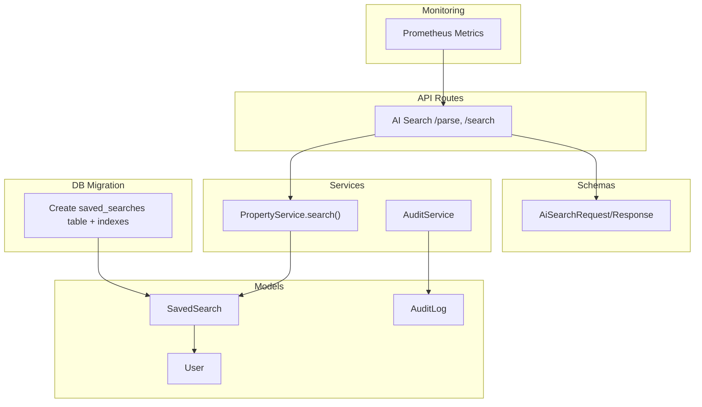
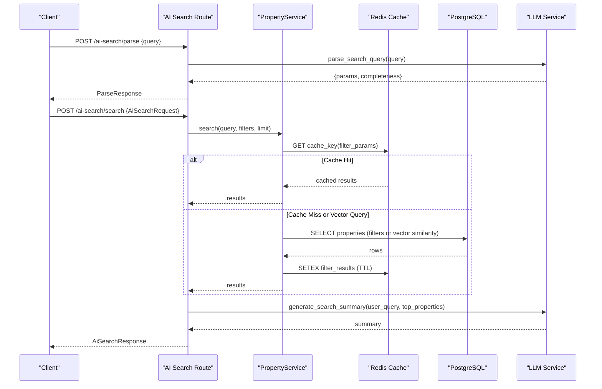
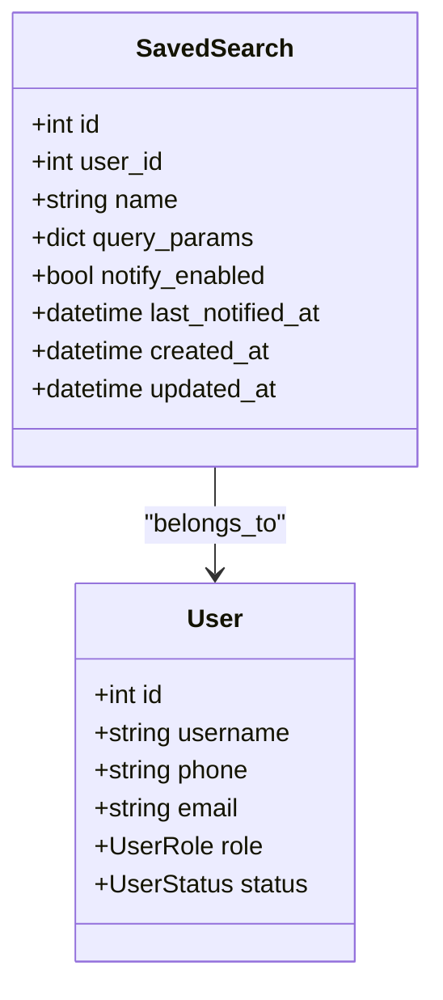
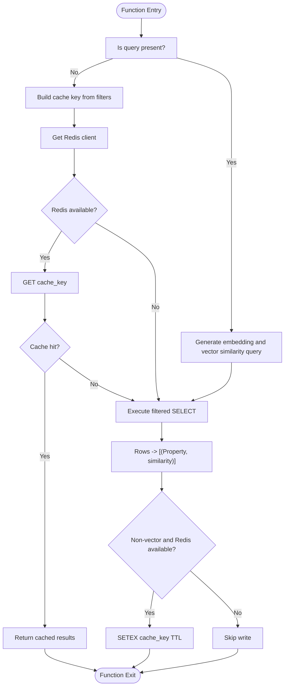
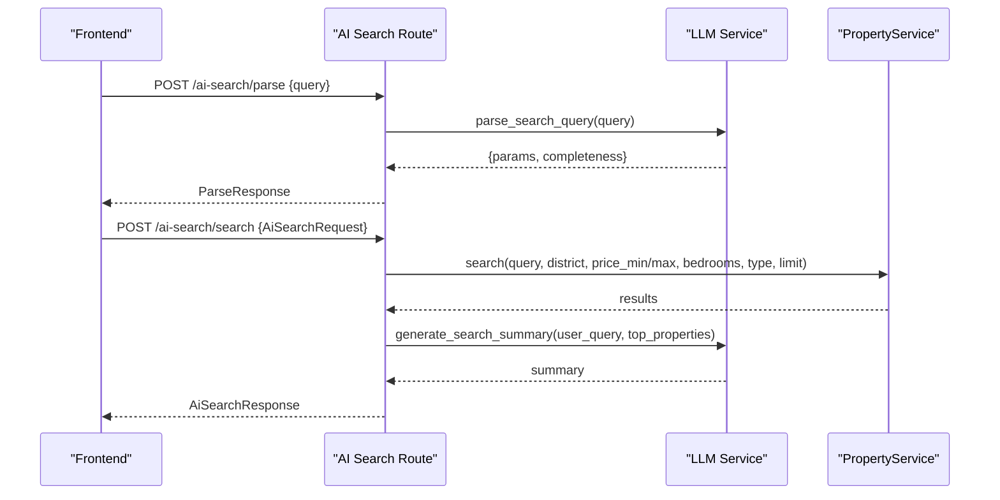
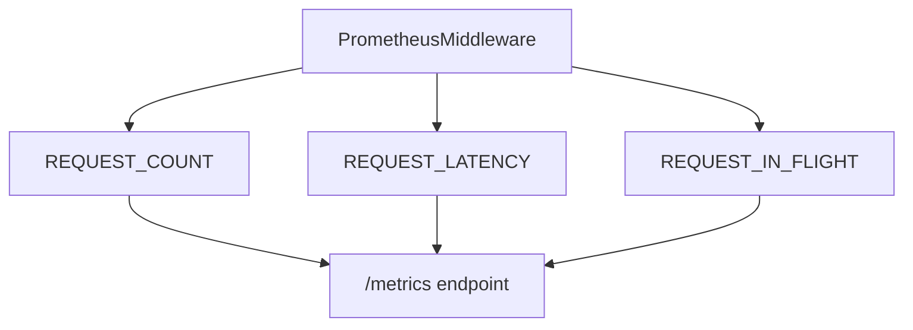
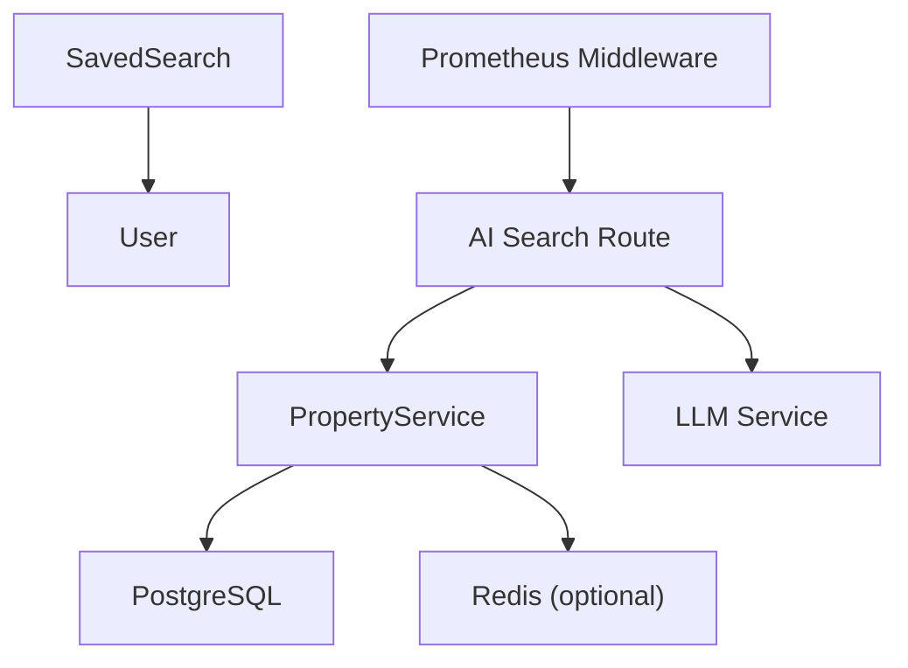

# Search Analytics Models

<cite>
**Referenced Files in This Document**
- [saved_search.py](file://backend/app/models/saved_search.py)
- [20260626_0010_institutes_v15_v2.py](file://backend/alembic/versions/20260626_0010_institutes_v15_v2.py)
- [ai_search.py](file://backend/app/api/v1/routes/ai_search.py)
- [ai_search.py](file://backend/app/schemas/ai_search.py)
- [property_service.py](file://backend/app/services/property_service.py)
- [user.py](file://backend/app/models/user.py)
- [audit_log.py](file://backend/app/models/audit_log.py)
- [audit_service.py](file://backend/app/services/audit_service.py)
- [monitoring.py](file://backend/app/core/monitoring.py)
</cite>

## Table of Contents
1. [Introduction](#introduction)
2. [Project Structure](#project-structure)
3. [Core Components](#core-components)
4. [Architecture Overview](#architecture-overview)
5. [Detailed Component Analysis](#detailed-component-analysis)
6. [Dependency Analysis](#dependency-analysis)
7. [Performance Considerations](#performance-considerations)
8. [Troubleshooting Guide](#troubleshooting-guide)
9. [Conclusion](#conclusion)
10. [Appendices](#appendices)

## Introduction
This document provides comprehensive data model documentation for search analytics and user preference tracking entities, focusing on the SavedSearch model for storing user search history, query patterns, and preference learning. It also explains search result caching mechanisms, query optimization tracking, and user behavior analytics. The integration with the AI search system is covered to support personalized recommendations and search trend analysis. Examples are provided for search history persistence, preference updates, and analytics data aggregation. Privacy considerations, data retention policies, and anonymization techniques for search analytics are included.

## Project Structure
The relevant components for search analytics and user preferences are implemented across models, services, API routes, schemas, migrations, and monitoring utilities:
- Data models define persistent structures for saved searches and audit logs.
- Services implement search logic, caching, and metrics collection.
- API routes expose endpoints for natural language parsing and AI-powered search.
- Schemas define request/response contracts for AI search.
- Migrations create database tables and indexes for saved searches.
- Monitoring captures HTTP-level metrics useful for performance and usage analytics.

**Diagram sources**
- [saved_search.py:13-27](file://backend/app/models/saved_search.py#L13-L27)
- [user.py:24-48](file://backend/app/models/user.py#L24-L48)
- [ai_search.py:80-160](file://backend/app/api/v1/routes/ai_search.py#L80-L160)
- [ai_search.py:52-74](file://backend/app/schemas/ai_search.py#L52-L74)
- [property_service.py:91-195](file://backend/app/services/property_service.py#L91-L195)
- [20260626_0010_institutes_v15_v2.py:91-105](file://backend/alembic/versions/20260626_0010_institutes_v15_v2.py#L91-L105)
- [monitoring.py:126-176](file://backend/app/core/monitoring.py#L126-L176)

**Section sources**
- [saved_search.py:13-27](file://backend/app/models/saved_search.py#L13-L27)
- [user.py:24-48](file://backend/app/models/user.py#L24-L48)
- [ai_search.py:80-160](file://backend/app/api/v1/routes/ai_search.py#L80-L160)
- [ai_search.py:52-74](file://backend/app/schemas/ai_search.py#L52-L74)
- [property_service.py:91-195](file://backend/app/services/property_service.py#L91-L195)
- [20260626_0010_institutes_v15_v2.py:91-105](file://backend/alembic/versions/20260626_0010_institutes_v15_v2.py#L91-L105)
- [monitoring.py:126-176](file://backend/app/core/monitoring.py#L126-L176)

## Core Components
- SavedSearch model: Stores user-defined search criteria (name and JSON query parameters), notification settings, and last notified timestamp. It links to the User entity via a foreign key and inherits timestamps.
- PropertyService.search(): Implements filtering and optional vector-based semantic search, with Redis-backed caching for non-vector queries.
- AI Search route: Provides parse and search endpoints that orchestrate LLM parsing, property retrieval, and summary generation.
- AuditLog and AuditService: Provide a foundation for recording user actions and details, which can be extended for search analytics.
- Prometheus monitoring: Captures HTTP request counts, latency, and in-flight requests, enabling performance analytics for search endpoints.

**Section sources**
- [saved_search.py:13-27](file://backend/app/models/saved_search.py#L13-L27)
- [property_service.py:91-195](file://backend/app/services/property_service.py#L91-L195)
- [ai_search.py:80-160](file://backend/app/api/v1/routes/ai_search.py#L80-L160)
- [audit_log.py:10-25](file://backend/app/models/audit_log.py#L10-L25)
- [audit_service.py:7-55](file://backend/app/services/audit_service.py#L7-L55)
- [monitoring.py:74-176](file://backend/app/core/monitoring.py#L74-L176)

## Architecture Overview
The AI search workflow integrates natural language parsing, structured parameter extraction, property search (with caching), and summary generation. SavedSearch persists user preferences, while monitoring and audit logs capture operational and behavioral signals.

**Diagram sources**
- [ai_search.py:80-160](file://backend/app/api/v1/routes/ai_search.py#L80-L160)
- [property_service.py:91-195](file://backend/app/services/property_service.py#L91-L195)

## Detailed Component Analysis

### SavedSearch Model
The SavedSearch model represents a tenant’s saved search configuration. It includes:
- Primary key id and user_id linking to users.
- name for human-readable label.
- query_params stored as JSON to capture flexible search filters.
- notify_enabled flag to control notifications when new properties match.
- last_notified_at timestamp for deduplication and throttling.
- TimestampMixin adds created_at and updated_at.

**Diagram sources**
- [saved_search.py:13-27](file://backend/app/models/saved_search.py#L13-L27)
- [user.py:24-48](file://backend/app/models/user.py#L24-L48)

**Section sources**
- [saved_search.py:13-27](file://backend/app/models/saved_search.py#L13-L27)
- [user.py:24-48](file://backend/app/models/user.py#L24-L48)
- [20260626_0010_institutes_v15_v2.py:91-105](file://backend/alembic/versions/20260626_0010_institutes_v15_v2.py#L91-L105)

### Search Result Caching Mechanism
PropertyService.search implements a deterministic cache key based on normalized filter parameters. For non-vector queries, it reads from Redis if available; otherwise, it executes SQL with filters and writes results back to Redis with a TTL. Vector queries bypass cache due to dynamic embeddings.

**Diagram sources**
- [property_service.py:91-195](file://backend/app/services/property_service.py#L91-L195)

**Section sources**
- [property_service.py:91-195](file://backend/app/services/property_service.py#L91-L195)

### AI Search Integration
The AI search route orchestrates two steps:
- Parse: Natural language query is sent to an LLM service to extract structured parameters and completeness report.
- Search: Uses PropertyService.search with combined query text and filters, then generates an AI summary over top results.

**Diagram sources**
- [ai_search.py:80-160](file://backend/app/api/v1/routes/ai_search.py#L80-L160)
- [ai_search.py:52-74](file://backend/app/schemas/ai_search.py#L52-L74)

**Section sources**
- [ai_search.py:80-160](file://backend/app/api/v1/routes/ai_search.py#L80-L160)
- [ai_search.py:52-74](file://backend/app/schemas/ai_search.py#L52-L74)

### Query Optimization Tracking
- Database pool metrics are exposed via Prometheus middleware, capturing request counts, latency histograms, and in-flight gauges. These metrics help track search endpoint performance and identify bottlenecks.
- PropertyService uses deterministic cache keys and TTLs to reduce repeated DB load for identical filter sets.

**Diagram sources**
- [monitoring.py:126-176](file://backend/app/core/monitoring.py#L126-L176)

**Section sources**
- [monitoring.py:74-176](file://backend/app/core/monitoring.py#L74-L176)
- [property_service.py:91-195](file://backend/app/services/property_service.py#L91-L195)

### User Behavior Analytics and Preference Learning
- SavedSearch stores explicit user preferences (filters) and supports notifications when matching properties appear.
- AuditLog and AuditService provide a mechanism to record user actions and contextual details, which can be extended to log search events (e.g., parse/search calls) for analytics.
- Aggregation examples:
  - Count saved searches per user to measure engagement.
  - Aggregate query_params fields (district, price ranges, bedrooms) across users to discover trends.
  - Use last_notified_at to compute notification effectiveness and frequency.

**Section sources**
- [saved_search.py:13-27](file://backend/app/models/saved_search.py#L13-L27)
- [audit_log.py:10-25](file://backend/app/models/audit_log.py#L10-L25)
- [audit_service.py:7-55](file://backend/app/services/audit_service.py#L7-L55)

## Dependency Analysis
- SavedSearch depends on User via foreign key and inherits timestamps.
- AI Search route depends on PropertyService and LLM service.
- PropertyService optionally depends on Redis for caching and PostgreSQL for queries.
- Monitoring middleware depends on prometheus-client if installed; otherwise no-op stubs are used.

**Diagram sources**
- [saved_search.py:13-27](file://backend/app/models/saved_search.py#L13-L27)
- [user.py:24-48](file://backend/app/models/user.py#L24-L48)
- [ai_search.py:80-160](file://backend/app/api/v1/routes/ai_search.py#L80-L160)
- [property_service.py:91-195](file://backend/app/services/property_service.py#L91-L195)
- [monitoring.py:126-176](file://backend/app/core/monitoring.py#L126-L176)

**Section sources**
- [saved_search.py:13-27](file://backend/app/models/saved_search.py#L13-L27)
- [user.py:24-48](file://backend/app/models/user.py#L24-L48)
- [ai_search.py:80-160](file://backend/app/api/v1/routes/ai_search.py#L80-L160)
- [property_service.py:91-195](file://backend/app/services/property_service.py#L91-L195)
- [monitoring.py:126-176](file://backend/app/core/monitoring.py#L126-L176)

## Performance Considerations
- Deterministic cache keys ensure consistent hits for identical filter sets.
- Non-vector queries benefit from Redis caching with a fixed TTL; vector queries bypass cache due to dynamic embeddings.
- Prometheus metrics enable observation of request latency and throughput for search endpoints.
- Indexes on saved_searches.user_id and id improve lookup performance for user-specific saved searches.

[No sources needed since this section provides general guidance]

## Troubleshooting Guide
- Redis unavailable: PropertyService gracefully falls back to direct DB queries and logs debug messages.
- LLM errors: AI Search route returns appropriate HTTP status codes (503/502) and logs exceptions.
- Monitoring disabled: If prometheus-client is not installed, metrics become no-ops and the /metrics endpoint still responds with a placeholder.

**Section sources**
- [property_service.py:31-41](file://backend/app/services/property_service.py#L31-L41)
- [ai_search.py:80-95](file://backend/app/api/v1/routes/ai_search.py#L80-L95)
- [monitoring.py:23-67](file://backend/app/core/monitoring.py#L23-L67)

## Conclusion
The SavedSearch model provides a robust foundation for storing user search preferences and supporting notification-driven discovery. Combined with AI-powered search, caching strategies, and monitoring, the system enables personalized recommendations and actionable analytics. Extending audit logging to capture search interactions will further enrich user behavior insights.

[No sources needed since this section summarizes without analyzing specific files]

## Appendices

### Example Workflows

#### Search History Persistence
- Create a SavedSearch entry with user_id, name, and query_params.
- Update notify_enabled and last_notified_at as matches occur.
- Retrieve all saved searches for a user by querying user_id index.

**Section sources**
- [saved_search.py:13-27](file://backend/app/models/saved_search.py#L13-L27)
- [20260626_0010_institutes_v15_v2.py:91-105](file://backend/alembic/versions/20260626_0010_institutes_v15_v2.py#L91-L105)

#### Preference Updates
- Modify query_params to refine filters (e.g., adjust price ranges or add keywords).
- Toggle notify_enabled to control alerting.
- Track changes via updated_at timestamp.

**Section sources**
- [saved_search.py:13-27](file://backend/app/models/saved_search.py#L13-L27)

#### Analytics Data Aggregation
- Aggregate query_params across users to identify popular districts and price bands.
- Compute counts of saved searches per user to measure engagement.
- Use last_notified_at to analyze notification cadence and effectiveness.

**Section sources**
- [saved_search.py:13-27](file://backend/app/models/saved_search.py#L13-L27)

### Privacy, Retention, and Anonymization
- Minimize PII in query_params; store only necessary filter values.
- Implement retention policies to archive or purge old SavedSearch records after defined periods.
- Anonymize analytics datasets by removing user identifiers before aggregation.
- Leverage AuditLog for security-relevant actions without retaining sensitive content.

[No sources needed since this section provides general guidance]