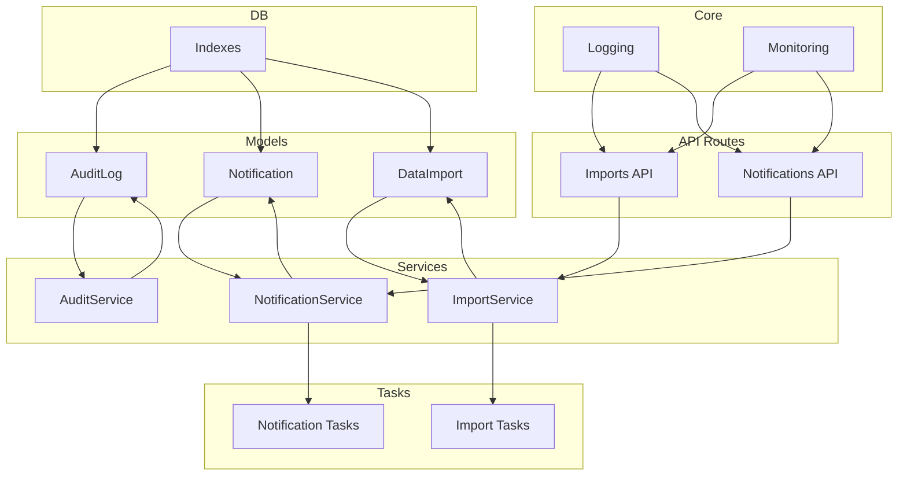
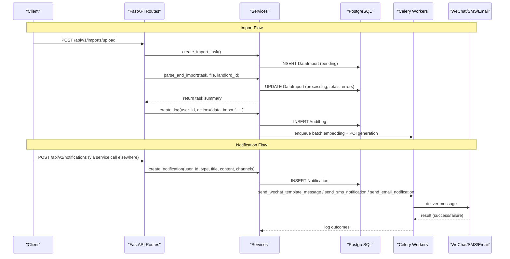
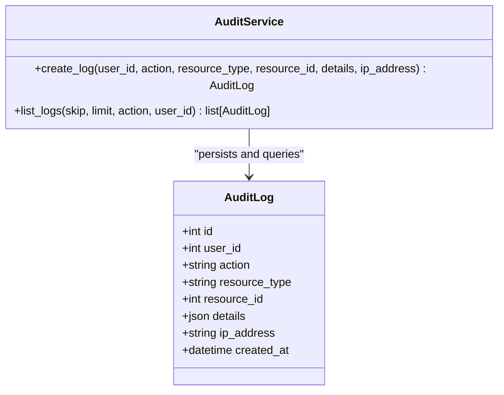
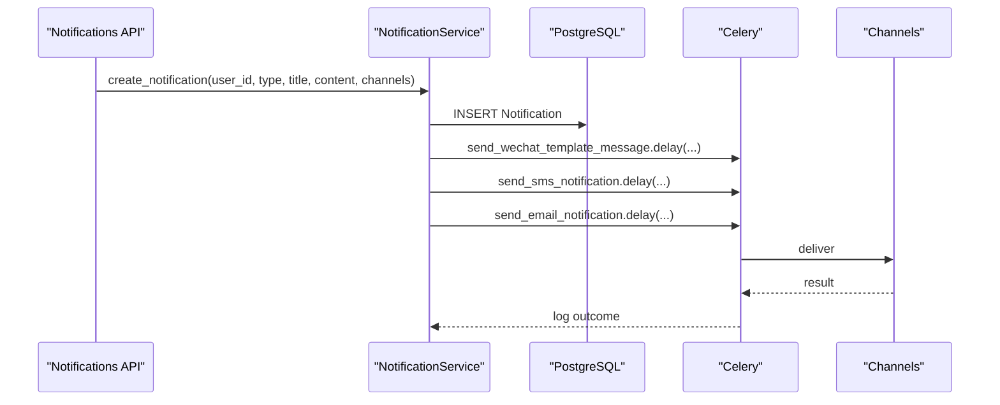
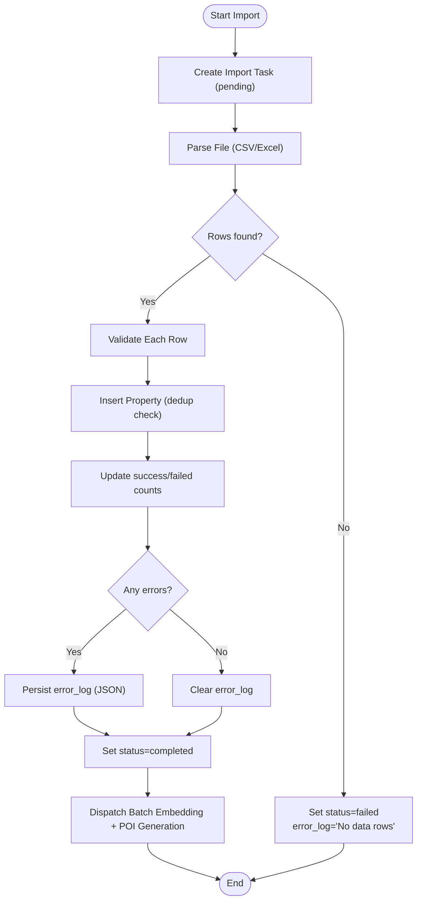
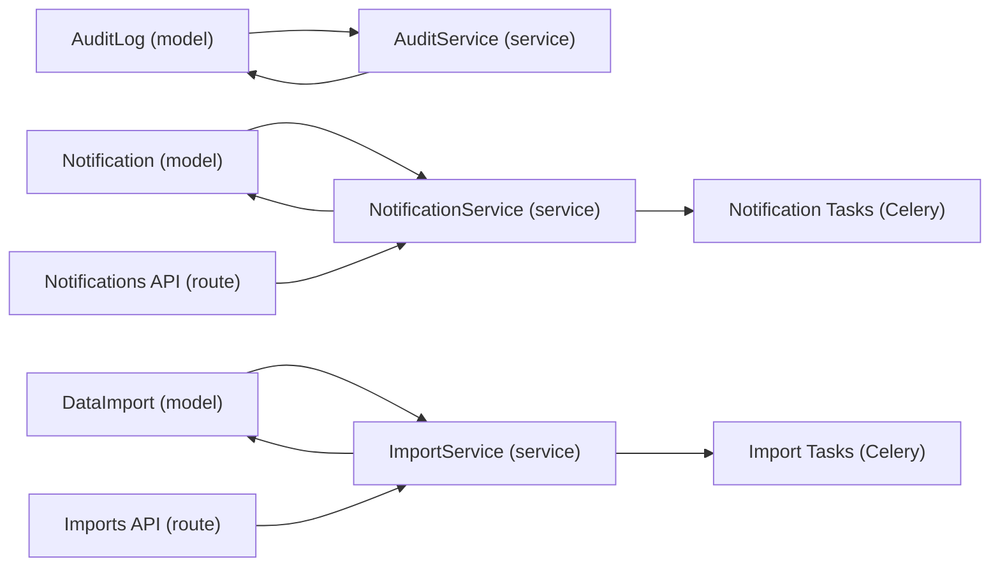

# Audit & Logging Tables

<cite>
**Referenced Files in This Document**
- [audit_log.py](file://backend/app/models/audit_log.py)
- [notification.py](file://backend/app/models/notification.py)
- [data_import.py](file://backend/app/models/data_import.py)
- [audit_service.py](file://backend/app/services/audit_service.py)
- [notification_service.py](file://backend/app/services/notification_service.py)
- [import_service.py](file://backend/app/services/import_service.py)
- [notification_tasks.py](file://backend/app/tasks/notification_tasks.py)
- [import_tasks.py](file://backend/app/tasks/import_tasks.py)
- [imports.py](file://backend/app/api/v1/routes/imports.py)
- [notifications.py](file://backend/app/api/v1/routes/notifications.py)
- [monitoring.py](file://backend/app/core/monitoring.py)
- [logging.py](file://backend/app/core/logging.py)
- [indexes.py](file://backend/app/db/indexes.py)
- [20260620_0005_embedding_jobs_and_audit_logs.py](file://backend/alembic/versions/20260620_0005_embedding_jobs_and_audit_logs.py)
</cite>

## Table of Contents
1. Introduction
2. Project Structure
3. Core Components
4. Architecture Overview
5. Detailed Component Analysis
6. Dependency Analysis
7. Performance Considerations
8. Troubleshooting Guide
9. Conclusion

## Introduction
This document provides detailed data model documentation for audit, logging, and system monitoring entities with a focus on:
- AuditLog: activity tracking including user actions, IP addresses, request details, and change snapshots.
- Notification: multi-channel notifications (email, SMS, in-app) with delivery status and retry logic.
- DataImport: bulk data operations with progress tracking and error reporting.

It also covers log retention policies, performance impact considerations, privacy compliance measures, notification delivery workflows, import job processing, and audit trail analysis patterns. Examples include audit query patterns, notification routing, and import batch processing.

## Project Structure
The relevant backend components are organized by models, services, tasks, API routes, core utilities, and database indexes. The key files for this document are located under backend/app/models, backend/app/services, backend/app/tasks, backend/app/api/v1/routes, backend/app/core, and backend/app/db.

**Diagram sources**
- [audit_log.py:10-24](file://backend/app/models/audit_log.py#L10-L24)
- [notification.py:20-35](file://backend/app/models/notification.py#L20-L35)
- [data_import.py:23-52](file://backend/app/models/data_import.py#L23-L52)
- [audit_service.py:7-54](file://backend/app/services/audit_service.py#L7-L54)
- [notification_service.py:37-164](file://backend/app/services/notification_service.py#L37-L164)
- [import_service.py:34-403](file://backend/app/services/import_service.py#L34-L403)
- [notification_tasks.py:53-217](file://backend/app/tasks/notification_tasks.py#L53-L217)
- [import_tasks.py:13-44](file://backend/app/tasks/import_tasks.py#L13-L44)
- [imports.py:39-194](file://backend/app/api/v1/routes/imports.py#L39-L194)
- [notifications.py:12-50](file://backend/app/api/v1/routes/notifications.py#L12-L50)
- [monitoring.py:126-176](file://backend/app/core/monitoring.py#L126-L176)
- [logging.py:124-168](file://backend/app/core/logging.py#L124-L168)
- [indexes.py:84-88](file://backend/app/db/indexes.py#L84-L88)

**Section sources**
- [audit_log.py:10-24](file://backend/app/models/audit_log.py#L10-L24)
- [notification.py:20-35](file://backend/app/models/notification.py#L20-L35)
- [data_import.py:23-52](file://backend/app/models/data_import.py#L23-L52)
- [audit_service.py:7-54](file://backend/app/services/audit_service.py#L7-L54)
- [notification_service.py:37-164](file://backend/app/services/notification_service.py#L37-L164)
- [import_service.py:34-403](file://backend/app/services/import_service.py#L34-L403)
- [notification_tasks.py:53-217](file://backend/app/tasks/notification_tasks.py#L53-L217)
- [import_tasks.py:13-44](file://backend/app/tasks/import_tasks.py#L13-L44)
- [imports.py:39-194](file://backend/app/api/v1/routes/imports.py#L39-L194)
- [notifications.py:12-50](file://backend/app/api/v1/routes/notifications.py#L12-L50)
- [monitoring.py:126-176](file://backend/app/core/monitoring.py#L126-L176)
- [logging.py:124-168](file://backend/app/core/logging.py#L124-L168)
- [indexes.py:84-88](file://backend/app/db/indexes.py#L84-L88)

## Core Components
This section summarizes the three primary data models and their responsibilities.

- AuditLog
  - Purpose: Record user-initiated actions and system events for auditing and compliance.
  - Key fields: id, user_id, action, resource_type, resource_id, details (JSON), ip_address, created_at.
  - Indexes: id, user_id, action, resource_type.
  - Typical usage: Write after sensitive or impactful operations; read via list_logs with filters.

- Notification
  - Purpose: Persist in-app notifications with type, title, content, and read status.
  - Key fields: id, user_id, type (enum), title, content, is_read, timestamps.
  - Relationship: user_id references users.
  - Typical usage: Create via NotificationService; mark read; list per user; count unread.

- DataImport
  - Purpose: Track bulk import jobs with source metadata, counts, and error logs.
  - Key fields: id, admin_id, source_name, source_type (csv/excel/api), status (pending/processing/completed/failed), total_records, success_records, failed_records, error_log (text JSON), created_at, updated_at.
  - Typical usage: Create task, parse and import rows, update progress, handle retries, dispatch background tasks.

**Section sources**
- [audit_log.py:10-24](file://backend/app/models/audit_log.py#L10-L24)
- [notification.py:20-35](file://backend/app/models/notification.py#L20-L35)
- [data_import.py:23-52](file://backend/app/models/data_import.py#L23-L52)

## Architecture Overview
End-to-end flows for audit logging, notifications, and imports.

**Diagram sources**
- [imports.py:39-91](file://backend/app/api/v1/routes/imports.py#L39-L91)
- [import_service.py:77-136](file://backend/app/services/import_service.py#L77-L136)
- [audit_service.py:11-32](file://backend/app/services/audit_service.py#L11-L32)
- [notification_service.py:43-69](file://backend/app/services/notification_service.py#L43-L69)
- [notification_tasks.py:53-97](file://backend/app/tasks/notification_tasks.py#L53-L97)
- [notification_tasks.py:136-173](file://backend/app/tasks/notification_tasks.py#L136-L173)
- [notification_tasks.py:178-216](file://backend/app/tasks/notification_tasks.py#L178-L216)
- [import_tasks.py:13-44](file://backend/app/tasks/import_tasks.py#L13-L44)

## Detailed Component Analysis

### AuditLog Model and AuditTrail Patterns
- Data model highlights
  - Primary key and foreign keys: id (PK), user_id (FK to users).
  - Actionable attributes: action, resource_type, resource_id.
  - Flexible payload: details (JSON) for change snapshots and contextual info.
  - Network context: ip_address for client origin.
  - Timestamps: created_at (UTC).
- Indexing and queries
  - Indexed columns: id, user_id, action, resource_type.
  - Efficient filtering by action and user_id; pagination via skip/limit.
- Service methods
  - create_log: persists an audit entry and returns it.
  - list_logs: paginated listing with optional filters.

**Diagram sources**
- [audit_log.py:10-24](file://backend/app/models/audit_log.py#L10-L24)
- [audit_service.py:7-54](file://backend/app/services/audit_service.py#L7-L54)

**Section sources**
- [audit_log.py:10-24](file://backend/app/models/audit_log.py#L10-L24)
- [audit_service.py:11-54](file://backend/app/services/audit_service.py#L11-L54)
- [20260620_0005_embedding_jobs_and_audit_logs.py:50-61](file://backend/alembic/versions/20260620_0005_embedding_jobs_and_audit_logs.py#L50-L61)

#### Audit Query Patterns
- Recent logs for a user:
  - Filter by user_id, order by created_at desc, paginate.
- Logs by action:
  - Filter by action (e.g., "data_import"), paginate.
- Combined filters:
  - user_id + action with offset/limit.

Example paths:
- [audit_service.py:34-54](file://backend/app/services/audit_service.py#L34-L54)

### Notification Model and Multi-Channel Delivery
- Data model highlights
  - Type enum: booking_created, booking_approved, booking_rejected, booking_cancelled, booking_completed, payment_received, system.
  - Fields: id, user_id, type, title, content, is_read, timestamps.
  - Relationship: user_id -> users.
- Service capabilities
  - create_notification: persist record and dispatch channels asynchronously.
  - list_by_user, mark_read, mark_all_read, get_unread_count.
- Channel dispatch
  - WeChat template messages, SMS, Email via Celery tasks.
  - Per-type channel metadata mapping for templates.
  - Retry/backoff configured at task level.

**Diagram sources**
- [notification_service.py:43-69](file://backend/app/services/notification_service.py#L43-L69)
- [notification_service.py:108-164](file://backend/app/services/notification_service.py#L108-L164)
- [notification_tasks.py:53-97](file://backend/app/tasks/notification_tasks.py#L53-L97)
- [notification_tasks.py:136-173](file://backend/app/tasks/notification_tasks.py#L136-L173)
- [notification_tasks.py:178-216](file://backend/app/tasks/notification_tasks.py#L178-L216)

**Section sources**
- [notification.py:20-35](file://backend/app/models/notification.py#L20-L35)
- [notification_service.py:37-164](file://backend/app/services/notification_service.py#L37-L164)
- [notification_tasks.py:53-217](file://backend/app/tasks/notification_tasks.py#L53-L217)
- [notifications.py:12-50](file://backend/app/api/v1/routes/notifications.py#L12-L50)

#### Notification Routing Example
- Default channels: ["wechat", "sms", "email"].
- Per-type template mapping: e.g., booking_created uses a specific WeChat template ID.
- Failure handling: warnings logged; does not block DB write.

Example paths:
- [notification_service.py:12-34](file://backend/app/services/notification_service.py#L12-L34)
- [notification_service.py:122-163](file://backend/app/services/notification_service.py#L122-L163)

### DataImport Model and Bulk Processing
- Data model highlights
  - Source metadata: source_name, source_type (csv/excel/api).
  - Progress: status (pending/processing/completed/failed), total_records, success_records, failed_records.
  - Error reporting: error_log (JSON text array of row-level errors).
  - Ownership: admin_id.
  - Timestamps: created_at, updated_at.
- Service workflow
  - create_import_task: initialize pending job.
  - parse_and_import: validate rows, insert properties, update counters, store errors, finalize status.
  - retry_failed: reprocess previously failed rows using stored error entries.
  - Post-import: dispatch batch embedding and POI generation tasks.

**Diagram sources**
- [import_service.py:77-136](file://backend/app/services/import_service.py#L77-L136)
- [import_service.py:138-183](file://backend/app/services/import_service.py#L138-L183)
- [import_service.py:357-402](file://backend/app/services/import_service.py#L357-L402)

**Section sources**
- [data_import.py:23-52](file://backend/app/models/data_import.py#L23-L52)
- [import_service.py:34-403](file://backend/app/services/import_service.py#L34-L403)
- [imports.py:39-194](file://backend/app/api/v1/routes/imports.py#L39-L194)
- [import_tasks.py:13-44](file://backend/app/tasks/import_tasks.py#L13-L44)

#### Import Batch Processing Example
- Enqueue batch embedding for new properties without embeddings.
- Generate POIs for newly imported properties.

Example paths:
- [import_tasks.py:13-44](file://backend/app/tasks/import_tasks.py#L13-L44)
- [import_service.py:369-402](file://backend/app/services/import_service.py#L369-L402)

## Dependency Analysis
Key relationships among models, services, tasks, and routes.

**Diagram sources**
- [audit_log.py:10-24](file://backend/app/models/audit_log.py#L10-L24)
- [audit_service.py:7-54](file://backend/app/services/audit_service.py#L7-L54)
- [notification.py:20-35](file://backend/app/models/notification.py#L20-L35)
- [notification_service.py:37-164](file://backend/app/services/notification_service.py#L37-L164)
- [data_import.py:23-52](file://backend/app/models/data_import.py#L23-L52)
- [import_service.py:34-403](file://backend/app/services/import_service.py#L34-L403)
- [notification_tasks.py:53-217](file://backend/app/tasks/notification_tasks.py#L53-L217)
- [import_tasks.py:13-44](file://backend/app/tasks/import_tasks.py#L13-L44)
- [imports.py:39-194](file://backend/app/api/v1/routes/imports.py#L39-L194)
- [notifications.py:12-50](file://backend/app/api/v1/routes/notifications.py#L12-L50)

**Section sources**
- [audit_log.py:10-24](file://backend/app/models/audit_log.py#L10-L24)
- [audit_service.py:7-54](file://backend/app/services/audit_service.py#L7-L54)
- [notification.py:20-35](file://backend/app/models/notification.py#L20-L35)
- [notification_service.py:37-164](file://backend/app/services/notification_service.py#L37-L164)
- [data_import.py:23-52](file://backend/app/models/data_import.py#L23-L52)
- [import_service.py:34-403](file://backend/app/services/import_service.py#L34-L403)
- [notification_tasks.py:53-217](file://backend/app/tasks/notification_tasks.py#L53-L217)
- [import_tasks.py:13-44](file://backend/app/tasks/import_tasks.py#L13-L44)
- [imports.py:39-194](file://backend/app/api/v1/routes/imports.py#L39-L194)
- [notifications.py:12-50](file://backend/app/api/v1/routes/notifications.py#L12-L50)

## Performance Considerations
- Database indexing
  - AuditLog: indexes on id, user_id, action, resource_type support efficient filtering and pagination.
  - Notifications: index on user_id supports per-user listing and unread counting.
  - DataImport: index on id and admin_id supports lookup and admin dashboards.
- Asynchronous processing
  - Notifications dispatched via Celery tasks with autoretry and backoff reduce request latency.
  - Import post-processing (embedding, POI) offloaded to background tasks.
- Metrics and observability
  - Prometheus middleware tracks HTTP metrics and Celery task metrics.
  - Structured logging captures request context and errors.

Recommendations:
- Add composite indexes if frequent combined filters emerge (e.g., user_id + action).
- Consider partitioning large tables (audit_logs) by time ranges for long-term retention.
- Tune Celery concurrency and queue isolation for high-volume channels.

**Section sources**
- [audit_log.py:13-21](file://backend/app/models/audit_log.py#L13-L21)
- [notification.py:23-33](file://backend/app/models/notification.py#L23-L33)
- [data_import.py:26-52](file://backend/app/models/data_import.py#L26-L52)
- [notification_tasks.py:53-97](file://backend/app/tasks/notification_tasks.py#L53-L97)
- [monitoring.py:126-176](file://backend/app/core/monitoring.py#L126-L176)
- [logging.py:124-168](file://backend/app/core/logging.py#L124-L168)

## Troubleshooting Guide
Common issues and diagnostics:
- Notification delivery failures
  - Check Celery worker logs for task exceptions; tasks auto-retry with backoff.
  - Verify user contact info (phone/email/wechat_openid) before dispatch.
- Import validation errors
  - Inspect error_log JSON for row-level errors; use retry endpoint to reprocess.
  - Ensure required fields present and valid types/ranges.
- Audit log gaps
  - Confirm audit calls are invoked after critical operations.
  - Use list_logs with filters to locate missing entries.

Operational tips:
- Use structured logs to correlate requests via request_id.
- Monitor Prometheus metrics for spikes in task durations or error rates.

**Section sources**
- [notification_tasks.py:53-97](file://backend/app/tasks/notification_tasks.py#L53-L97)
- [notification_tasks.py:136-173](file://backend/app/tasks/notification_tasks.py#L136-L173)
- [notification_tasks.py:178-216](file://backend/app/tasks/notification_tasks.py#L178-L216)
- [import_service.py:77-136](file://backend/app/services/import_service.py#L77-L136)
- [imports.py:155-194](file://backend/app/api/v1/routes/imports.py#L155-L194)
- [audit_service.py:34-54](file://backend/app/services/audit_service.py#L34-L54)
- [logging.py:124-168](file://backend/app/core/logging.py#L124-L168)
- [monitoring.py:126-176](file://backend/app/core/monitoring.py#L126-L176)

## Conclusion
The system implements robust audit, notification, and import capabilities:
- AuditLog provides comprehensive activity tracking with flexible details and strong indexing.
- Notification supports multi-channel delivery with asynchronous processing and retry semantics.
- DataImport enables bulk operations with granular progress and error reporting, plus background enrichment.

For production readiness, implement log retention policies, enforce privacy controls, and continuously monitor performance and reliability through metrics and structured logs.