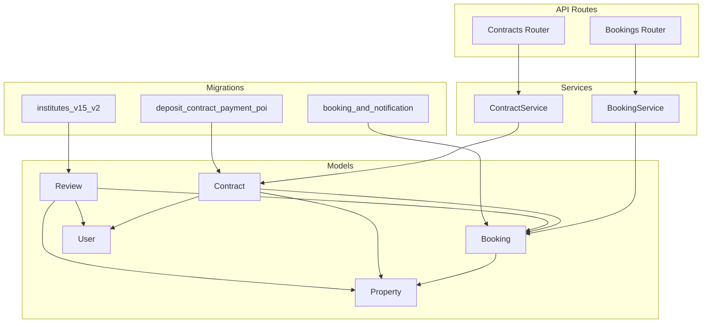
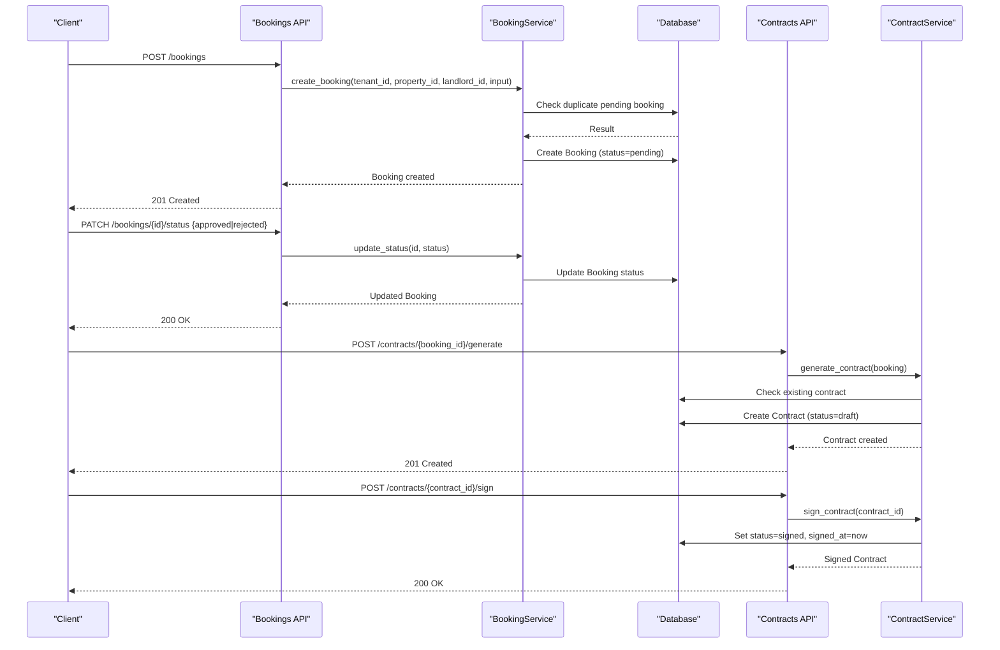
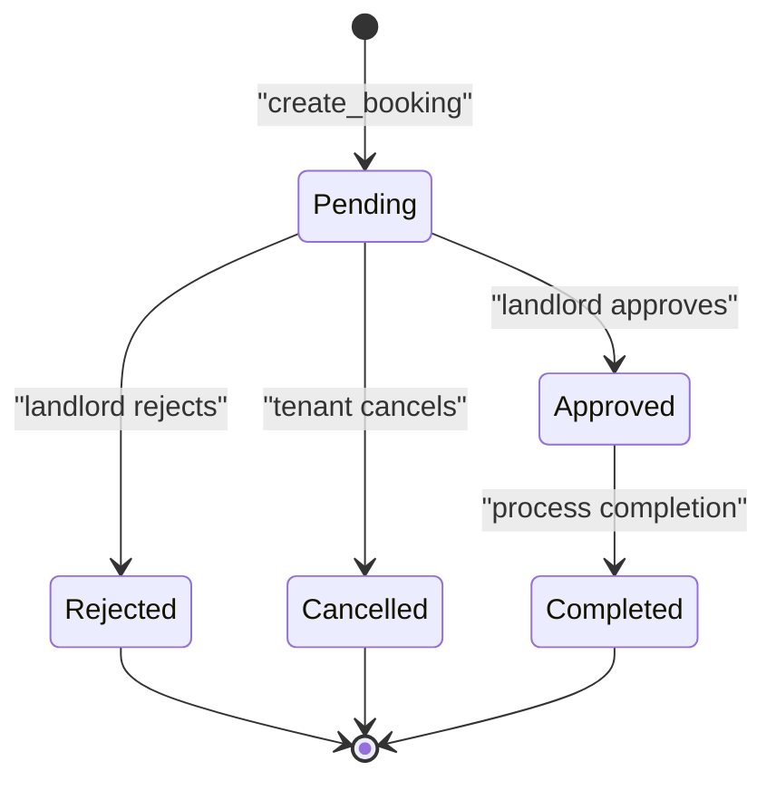
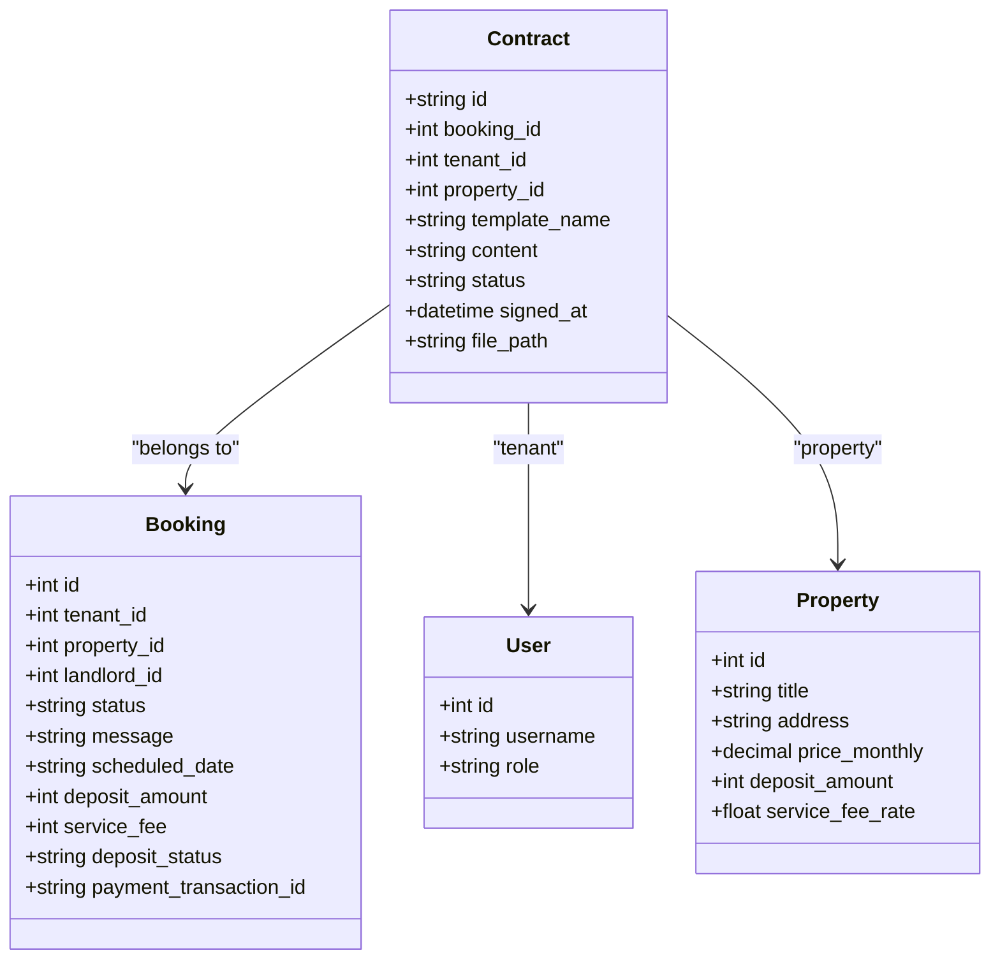
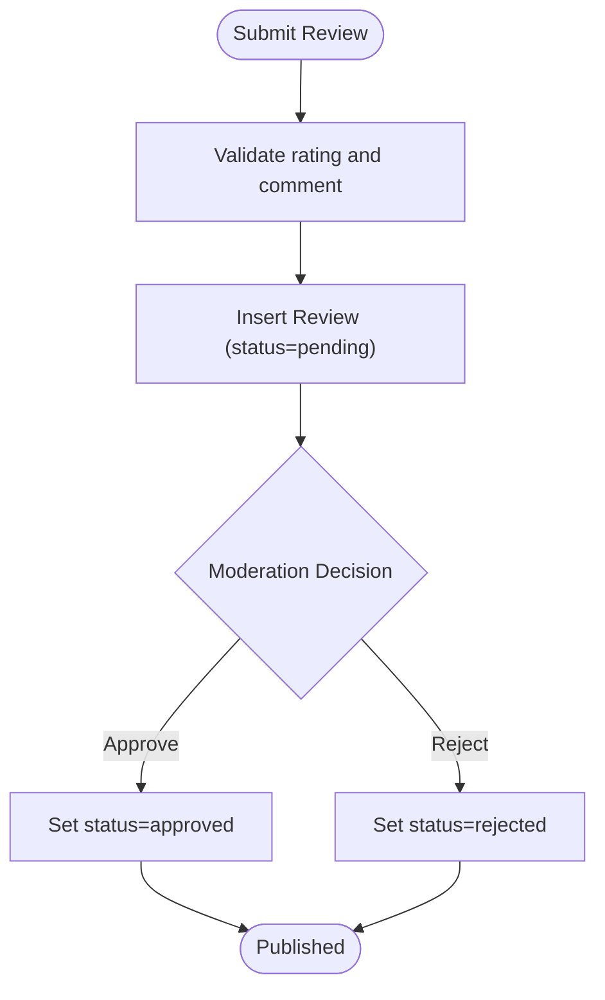
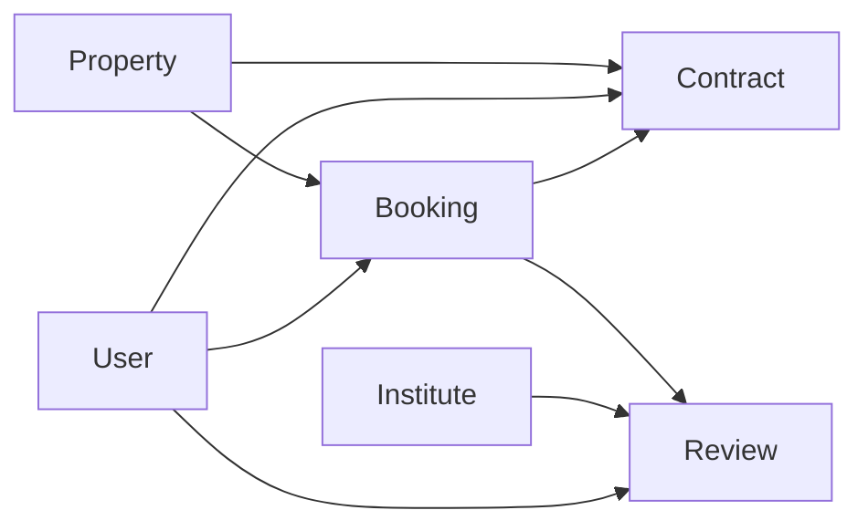

# Booking & Contract Lifecycle

<cite>
**Referenced Files in This Document**
- [booking.py](file://backend/app/models/booking.py)
- [contract.py](file://backend/app/models/contract.py)
- [review.py](file://backend/app/models/review.py)
- [user.py](file://backend/app/models/user.py)
- [property.py](file://backend/app/models/property.py)
- [booking_service.py](file://backend/app/services/booking_service.py)
- [contract_service.py](file://backend/app/services/contract_service.py)
- [bookings.py](file://backend/app/api/v1/routes/bookings.py)
- [contracts.py](file://backend/app/api/v1/routes/contracts.py)
- [20260620_0004_booking_and_notification.py](file://backend/alembic/versions/20260620_0004_booking_and_notification.py)
- [20260623_0008_deposit_contract_payment_poi.py](file://backend/alembic/versions/20260623_0008_deposit_contract_payment_poi.py)
- [20260626_0010_institutes_v15_v2.py](file://backend/alembic/versions/20260626_0010_institutes_v15_v2.py)
- [test_bookings.py](file://backend/tests/test_bookings.py)
</cite>

## Table of Contents
1. [Introduction](#introduction)
2. [Project Structure](#project-structure)
3. [Core Components](#core-components)
4. [Architecture Overview](#architecture-overview)
5. [Detailed Component Analysis](#detailed-component-analysis)
6. [Dependency Analysis](#dependency-analysis)
7. [Performance Considerations](#performance-considerations)
8. [Troubleshooting Guide](#troubleshooting-guide)
9. [Conclusion](#conclusion)

## Introduction
This document provides comprehensive data model documentation for booking and contract management entities, including the Booking, Contract, and Review models. It explains the rental workflow from booking creation through approval, contract generation and signing, and review submission. It also documents business rules such as availability checks, contract template usage, and moderation states, along with state machine patterns for lifecycle management.

## Project Structure
The relevant backend components are organized by layers:
- Models define persistent entities (Booking, Contract, Review, User, Property).
- Services encapsulate business logic (BookingService, ContractService).
- API routes expose endpoints for clients to create bookings, manage statuses, generate contracts, sign contracts, and download contract content.
- Migrations define database schema evolution for bookings, contracts, payments, and reviews.

**Diagram sources**
- [booking.py:1-47](file://backend/app/models/booking.py#L1-L47)
- [contract.py:1-37](file://backend/app/models/contract.py#L1-L37)
- [review.py:1-41](file://backend/app/models/review.py#L1-L41)
- [user.py:1-48](file://backend/app/models/user.py#L1-L48)
- [property.py:1-86](file://backend/app/models/property.py#L1-L86)
- [booking_service.py:1-164](file://backend/app/services/booking_service.py#L1-L164)
- [contract_service.py:1-96](file://backend/app/services/contract_service.py#L1-L96)
- [bookings.py:1-112](file://backend/app/api/v1/routes/bookings.py#L1-L112)
- [contracts.py:1-88](file://backend/app/api/v1/routes/contracts.py#L1-L88)
- [20260620_0004_booking_and_notification.py:1-72](file://backend/alembic/versions/20260620_0004_booking_and_notification.py#L1-L72)
- [20260623_0008_deposit_contract_payment_poi.py:1-119](file://backend/alembic/versions/20260623_0008_deposit_contract_payment_poi.py#L1-L119)
- [20260626_0010_institutes_v15_v2.py:107-130](file://backend/alembic/versions/20260626_0010_institutes_v15_v2.py#L107-L130)

**Section sources**
- [booking.py:1-47](file://backend/app/models/booking.py#L1-L47)
- [contract.py:1-37](file://backend/app/models/contract.py#L1-L37)
- [review.py:1-41](file://backend/app/models/review.py#L1-L41)
- [user.py:1-48](file://backend/app/models/user.py#L1-L48)
- [property.py:1-86](file://backend/app/models/property.py#L1-L86)
- [booking_service.py:1-164](file://backend/app/services/booking_service.py#L1-L164)
- [contract_service.py:1-96](file://backend/app/services/contract_service.py#L1-L96)
- [bookings.py:1-112](file://backend/app/api/v1/routes/bookings.py#L1-L112)
- [contracts.py:1-88](file://backend/app/api/v1/routes/contracts.py#L1-L88)
- [20260620_0004_booking_and_notification.py:1-72](file://backend/alembic/versions/20260620_0004_booking_and_notification.py#L1-L72)
- [20260623_0008_deposit_contract_payment_poi.py:1-119](file://backend/alembic/versions/20260623_0008_deposit_contract_payment_poi.py#L1-L119)
- [20260626_0010_institutes_v15_v2.py:107-130](file://backend/alembic/versions/20260626_0010_institutes_v15_v2.py#L107-L130)

## Core Components
- Booking: Represents a tenant’s request to view or reserve a property, with status transitions and deposit/payment fields.
- Contract: A digital lease document generated from a booking, with signing metadata and file storage references.
- Review: Tenant feedback and rating for an institute, with moderation states and optional linkage to a booking.

Key relationships:
- Booking links tenant, landlord, and property; includes scheduling and payment-related fields.
- Contract is uniquely tied to a booking and stores generated content and signing timestamps.
- Review optionally links to a booking and targets an institute, with moderation states.

Business rules:
- Duplicate pending bookings for the same tenant and property are prevented.
- Only landlords can approve or reject bookings; tenants can cancel their own bookings.
- Contracts are generated per booking once and cannot be duplicated.
- Reviews are moderated via pending/approved/rejected states.

**Section sources**
- [booking.py:1-47](file://backend/app/models/booking.py#L1-L47)
- [contract.py:1-37](file://backend/app/models/contract.py#L1-L37)
- [review.py:1-41](file://backend/app/models/review.py#L1-L41)
- [booking_service.py:1-164](file://backend/app/services/booking_service.py#L1-L164)
- [contract_service.py:1-96](file://backend/app/services/contract_service.py#L1-L96)
- [bookings.py:1-112](file://backend/app/api/v1/routes/bookings.py#L1-L112)
- [contracts.py:1-88](file://backend/app/api/v1/routes/contracts.py#L1-L88)

## Architecture Overview
The system follows a layered architecture:
- API layer validates requests and enforces role-based access.
- Service layer implements business rules and orchestrates operations.
- Model layer persists entities and defines relationships.
- Migration layer evolves schema over time.

**Diagram sources**
- [bookings.py:14-93](file://backend/app/api/v1/routes/bookings.py#L14-L93)
- [booking_service.py:15-142](file://backend/app/services/booking_service.py#L15-L142)
- [contracts.py:14-71](file://backend/app/api/v1/routes/contracts.py#L14-L71)
- [contract_service.py:19-96](file://backend/app/services/contract_service.py#L19-L96)

## Detailed Component Analysis

### Booking Model and Workflow
- Fields include identifiers for tenant, landlord, and property; status enum; message; scheduled_date; deposit_amount; service_fee; deposit_status; payment_transaction_id.
- Statuses: pending, approved, rejected, cancelled, completed.
- Availability check prevents duplicate pending bookings for the same tenant and property.
- Landlord-only approval/rejection; tenant-only cancellation; admin overrides where applicable.

**Diagram sources**
- [booking.py:10-35](file://backend/app/models/booking.py#L10-L35)
- [booking_service.py:15-142](file://backend/app/services/booking_service.py#L15-L142)
- [bookings.py:71-111](file://backend/app/api/v1/routes/bookings.py#L71-L111)

**Section sources**
- [booking.py:1-47](file://backend/app/models/booking.py#L1-L47)
- [booking_service.py:1-164](file://backend/app/services/booking_service.py#L1-L164)
- [bookings.py:1-112](file://backend/app/api/v1/routes/bookings.py#L1-L112)
- [20260620_0004_booking_and_notification.py:18-42](file://backend/alembic/versions/20260620_0004_booking_and_notification.py#L18-L42)
- [20260623_0008_deposit_contract_payment_poi.py:26-31](file://backend/alembic/versions/20260623_0008_deposit_contract_payment_poi.py#L26-L31)
- [test_bookings.py:6-66](file://backend/tests/test_bookings.py#L6-L66)

#### Example: Booking Creation and Approval
- Tenant creates a booking with property_id and optional message/scheduled_date.
- System checks for duplicate pending bookings and returns conflict if found.
- Landlord updates status to approved or rejected; notifications are sent accordingly.

**Section sources**
- [bookings.py:14-41](file://backend/app/api/v1/routes/bookings.py#L14-L41)
- [booking_service.py:15-79](file://backend/app/services/booking_service.py#L15-L79)
- [test_bookings.py:68-118](file://backend/tests/test_bookings.py#L68-L118)
- [test_bookings.py:120-199](file://backend/tests/test_bookings.py#L120-L199)

### Contract Model and Signing Process
- Fields include unique id, booking_id (unique), tenant_id, property_id, template_name, content, status, signed_at, file_path.
- Generation populates a standard lease template with booking and property details.
- Signing sets status to signed and records signed_at timestamp.
- Access control ensures only authorized users can generate/sign/download contracts.

**Diagram sources**
- [contract.py:12-37](file://backend/app/models/contract.py#L12-L37)
- [booking.py:18-46](file://backend/app/models/booking.py#L18-L46)
- [user.py:24-48](file://backend/app/models/user.py#L24-L48)
- [property.py:38-86](file://backend/app/models/property.py#L38-L86)

**Section sources**
- [contract.py:1-37](file://backend/app/models/contract.py#L1-L37)
- [contract_service.py:1-96](file://backend/app/services/contract_service.py#L1-L96)
- [contracts.py:1-88](file://backend/app/api/v1/routes/contracts.py#L1-L88)
- [20260623_0008_deposit_contract_payment_poi.py:32-55](file://backend/alembic/versions/20260623_0008_deposit_contract_payment_poi.py#L32-L55)

#### Example: Contract Generation and Signing
- Generate contract for an approved booking; system fills template with tenant and property info.
- Tenant signs contract; system marks it signed and records timestamp.
- Download endpoint serves contract content to authorized users.

**Section sources**
- [contract_service.py:19-78](file://backend/app/services/contract_service.py#L19-L78)
- [contract_service.py:88-96](file://backend/app/services/contract_service.py#L88-L96)
- [contracts.py:14-71](file://backend/app/api/v1/routes/contracts.py#L14-L71)
- [contracts.py:74-88](file://backend/app/api/v1/routes/contracts.py#L74-L88)

### Review Model and Moderation
- Fields include tenant_id, institute_id, optional booking_id, rating, comment, status.
- Statuses: pending, approved, rejected.
- Unique constraint on booking_id ensures one review per booking.
- Moderation workflow allows pending submissions to be approved or rejected.

**Diagram sources**
- [review.py:11-41](file://backend/app/models/review.py#L11-L41)
- [20260626_0010_institutes_v15_v2.py:107-130](file://backend/alembic/versions/20260626_0010_institutes_v15_v2.py#L107-L130)

**Section sources**
- [review.py:1-41](file://backend/app/models/review.py#L1-L41)
- [20260626_0010_institutes_v15_v2.py:107-130](file://backend/alembic/versions/20260626_0010_institutes_v15_v2.py#L107-L130)

## Dependency Analysis
- Booking depends on User (tenant, landlord) and Property; includes deposit and fee fields added via migration.
- Contract depends on Booking (unique link), User (tenant), and Property; stores generated content and signing metadata.
- Review depends on User (tenant), Institute (target), and optionally Booking (linkage); moderated via status.

**Diagram sources**
- [booking.py:18-46](file://backend/app/models/booking.py#L18-L46)
- [contract.py:12-37](file://backend/app/models/contract.py#L12-L37)
- [review.py:17-41](file://backend/app/models/review.py#L17-L41)
- [user.py:24-48](file://backend/app/models/user.py#L24-L48)
- [property.py:38-86](file://backend/app/models/property.py#L38-L86)

**Section sources**
- [booking.py:1-47](file://backend/app/models/booking.py#L1-L47)
- [contract.py:1-37](file://backend/app/models/contract.py#L1-L37)
- [review.py:1-41](file://backend/app/models/review.py#L1-L41)
- [user.py:1-48](file://backend/app/models/user.py#L1-L48)
- [property.py:1-86](file://backend/app/models/property.py#L1-L86)

## Performance Considerations
- Indexes on foreign keys and primary keys improve query performance for listings and lookups.
- Avoiding duplicate pending bookings reduces contention and unnecessary writes.
- Contract generation reads minimal required data and writes once per booking.
- Review moderation should batch updates when possible to reduce transaction overhead.

[No sources needed since this section provides general guidance]

## Troubleshooting Guide
Common issues and resolutions:
- Duplicate pending booking error: Ensure no existing pending booking exists for the same tenant and property before creating a new one.
- Unauthorized status update: Only landlords can approve/reject; tenants can cancel their own bookings. Verify user roles and ownership.
- Contract already signed: Prevent re-signing by checking current contract status before signing.
- Missing contract: Confirm that a contract has been generated for the booking before attempting to sign or download.

**Section sources**
- [booking_service.py:23-33](file://backend/app/services/booking_service.py#L23-L33)
- [bookings.py:71-93](file://backend/app/api/v1/routes/bookings.py#L71-L93)
- [contracts.py:54-71](file://backend/app/api/v1/routes/contracts.py#L54-L71)
- [contract_service.py:21-25](file://backend/app/services/contract_service.py#L21-L25)

## Conclusion
The Booking, Contract, and Review models implement a robust rental lifecycle with clear state transitions, access controls, and moderation workflows. The layered architecture separates concerns effectively, while migrations ensure schema integrity. Business rules prevent conflicts and enforce authorization, providing a reliable foundation for rental housing management.

[No sources needed since this section summarizes without analyzing specific files]