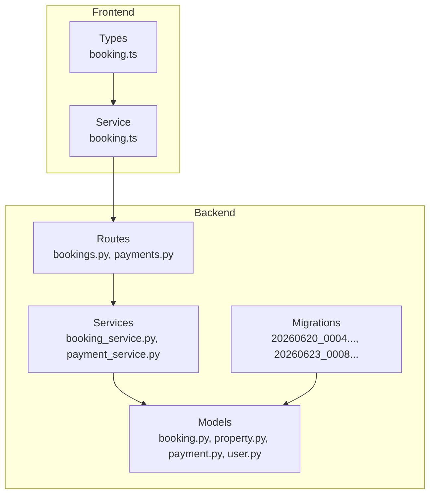
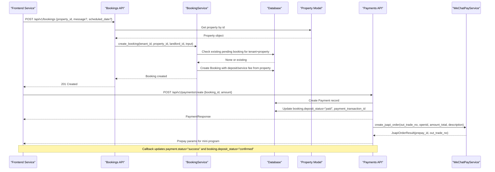
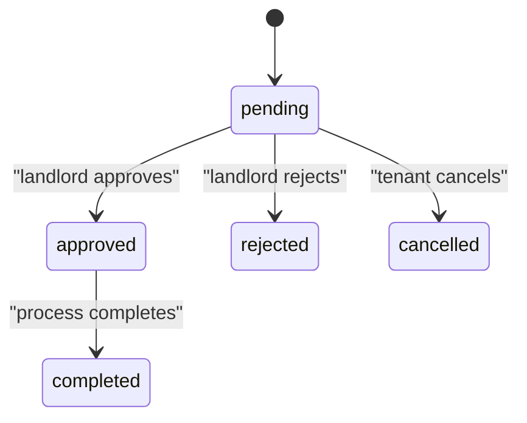
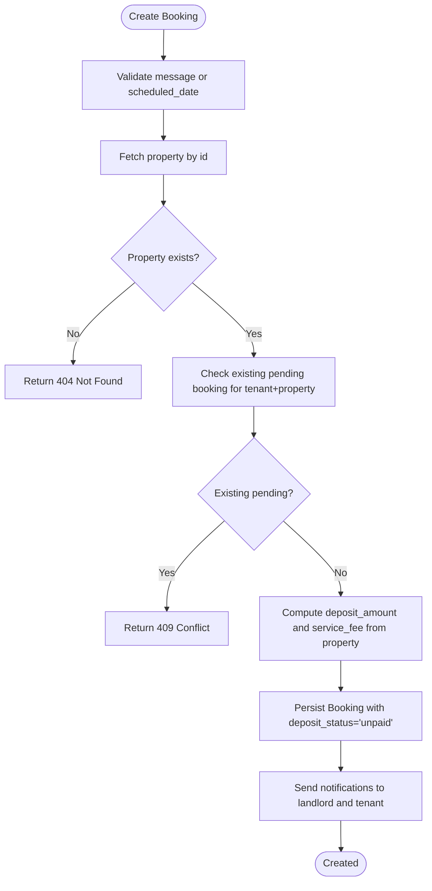
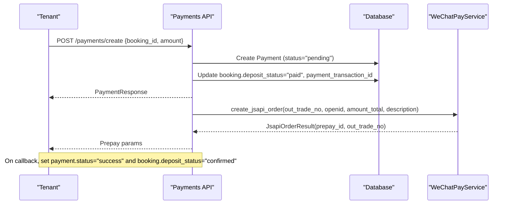
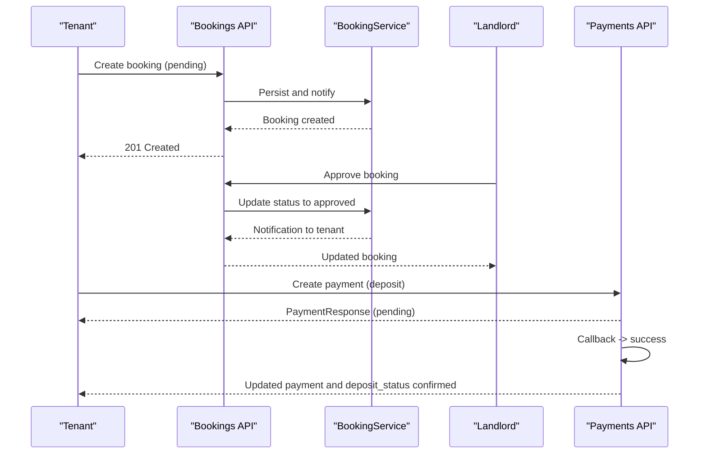
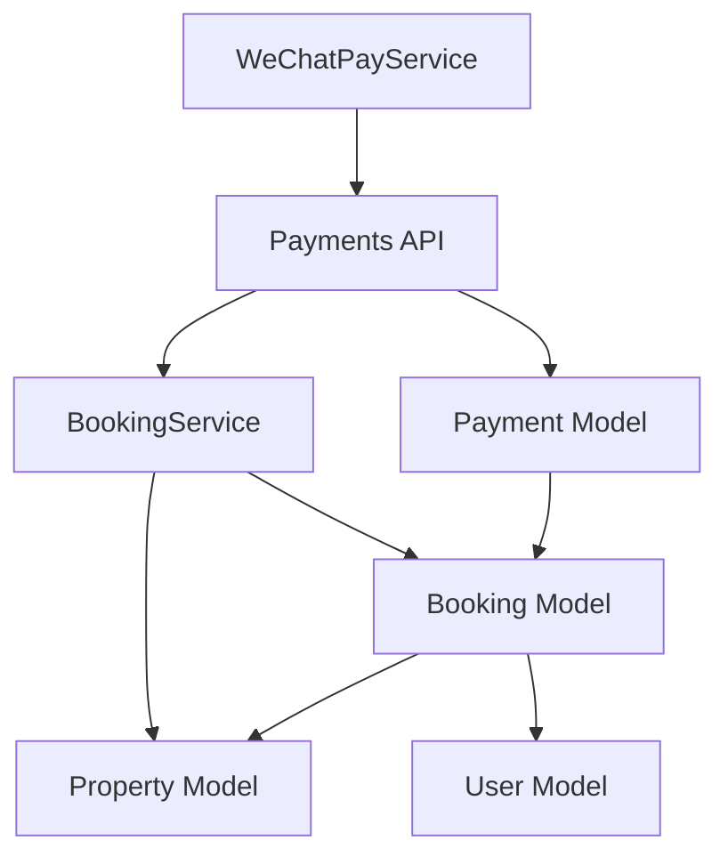

# Booking System

<cite>
**Referenced Files in This Document**
- [booking.py](file://backend/app/models/booking.py)
- [property.py](file://backend/app/models/property.py)
- [payment.py](file://backend/app/models/payment.py)
- [user.py](file://backend/app/models/user.py)
- [booking_service.py](file://backend/app/services/booking_service.py)
- [bookings.py](file://backend/app/api/v1/routes/bookings.py)
- [payments.py](file://backend/app/api/v1/routes/payments.py)
- [payment_service.py](file://backend/app/services/payment_service.py)
- [20260620_0004_booking_and_notification.py](file://backend/alembic/versions/20260620_0004_booking_and_notification.py)
- [20260623_0008_deposit_contract_payment_poi.py](file://backend/alembic/versions/20260623_0008_deposit_contract_payment_poi.py)
- [booking.ts](file://frontend/src/types/booking.ts)
- [booking.ts](file://frontend/src/services/booking.ts)
</cite>

## Table of Contents
1. [Introduction](#introduction)
2. [Project Structure](#project-structure)
3. [Core Components](#core-components)
4. [Architecture Overview](#architecture-overview)
5. [Detailed Component Analysis](#detailed-component-analysis)
6. [Dependency Analysis](#dependency-analysis)
7. [Performance Considerations](#performance-considerations)
8. [Troubleshooting Guide](#troubleshooting-guide)
9. [Conclusion](#conclusion)
10. [Appendices](#appendices)

## Introduction
This document provides comprehensive data model documentation for the Booking system, focusing on the Booking entity and its relationships with tenants, properties, and landlords. It covers the complete rental workflow including status transitions (pending, approved, rejected, cancelled, completed), booking creation, availability validation, scheduling mechanisms, approval workflows, deposit management (deposit_amount, service_fee, deposit_status), and payment transaction tracking. Business rules for conflicts, date validation, and user permissions are also explained, along with examples of the booking lifecycle and integration with property availability checks.

## Project Structure
The Booking system is implemented as part of a FastAPI backend with SQLAlchemy models, Pydantic schemas, services, and API routes. The frontend exposes types and services that call the backend endpoints.



**Diagram sources**
- [booking.py:1-47](file://backend/app/models/booking.py#L1-L47)
- [property.py:1-86](file://backend/app/models/property.py#L1-L86)
- [payment.py:1-34](file://backend/app/models/payment.py#L1-L34)
- [user.py:1-48](file://backend/app/models/user.py#L1-L48)
- [booking_service.py:1-164](file://backend/app/services/booking_service.py#L1-L164)
- [payment_service.py:1-445](file://backend/app/services/payment_service.py#L1-L445)
- [bookings.py:1-112](file://backend/app/api/v1/routes/bookings.py#L1-L112)
- [payments.py:1-85](file://backend/app/api/v1/routes/payments.py#L1-L85)
- [20260620_0004_booking_and_notification.py:1-72](file://backend/alembic/versions/20260620_0004_booking_and_notification.py#L1-L72)
- [20260623_0008_deposit_contract_payment_poi.py:1-119](file://backend/alembic/versions/20260623_0008_deposit_contract_payment_poi.py#L1-L119)
- [booking.ts:1-42](file://frontend/src/types/booking.ts#L1-L42)
- [booking.ts:1-24](file://frontend/src/services/booking.ts#L1-L24)

**Section sources**
- [booking.py:1-47](file://backend/app/models/booking.py#L1-L47)
- [property.py:1-86](file://backend/app/models/property.py#L1-L86)
- [payment.py:1-34](file://backend/app/models/payment.py#L1-L34)
- [user.py:1-48](file://backend/app/models/user.py#L1-L48)
- [booking_service.py:1-164](file://backend/app/services/booking_service.py#L1-L164)
- [payment_service.py:1-445](file://backend/app/services/payment_service.py#L1-L445)
- [bookings.py:1-112](file://backend/app/api/v1/routes/bookings.py#L1-L112)
- [payments.py:1-85](file://backend/app/api/v1/routes/payments.py#L1-L85)
- [20260620_0004_booking_and_notification.py:1-72](file://backend/alembic/versions/20260620_0004_booking_and_notification.py#L1-L72)
- [20260623_0008_deposit_contract_payment_poi.py:1-119](file://backend/alembic/versions/20260623_0008_deposit_contract_payment_poi.py#L1-L119)
- [booking.ts:1-42](file://frontend/src/types/booking.ts#L1-L42)
- [booking.ts:1-24](file://frontend/src/services/booking.ts#L1-L24)

## Core Components
- Booking model defines the core entity with tenant_id, property_id, landlord_id, status, message, scheduled_date, deposit_amount, service_fee, deposit_status, and payment_transaction_id. Relationships to User (tenant and landlord) and Property are defined.
- Property model includes deposit_amount and service_fee_rate used to compute deposit and service fee when creating bookings.
- Payment model tracks deposits and payments linked to bookings, with fields like amount, transaction_id, status, payment_method, and paid_at.
- User model defines roles (tenant, landlord, bd_manager, admin) used for authorization.
- BookingService implements business logic for creating bookings, updating statuses, listing by tenant or landlord, and notifications.
- API routes enforce permissions and orchestrate service calls.

**Section sources**
- [booking.py:1-47](file://backend/app/models/booking.py#L1-L47)
- [property.py:1-86](file://backend/app/models/property.py#L1-L86)
- [payment.py:1-34](file://backend/app/models/payment.py#L1-L34)
- [user.py:1-48](file://backend/app/models/user.py#L1-L48)
- [booking_service.py:1-164](file://backend/app/services/booking_service.py#L1-L164)
- [bookings.py:1-112](file://backend/app/api/v1/routes/bookings.py#L1-L112)

## Architecture Overview
The Booking system follows a layered architecture:
- API layer validates requests and enforces role-based access control.
- Service layer encapsulates business rules, conflict checks, and notifications.
- Data layer uses SQLAlchemy models and migrations to persist state.
- Frontend types and services mirror backend contracts and invoke endpoints.



**Diagram sources**
- [bookings.py:14-41](file://backend/app/api/v1/routes/bookings.py#L14-L41)
- [booking_service.py:15-79](file://backend/app/services/booking_service.py#L15-L79)
- [payments.py:15-45](file://backend/app/api/v1/routes/payments.py#L15-L45)
- [payment_service.py:245-292](file://backend/app/services/payment_service.py#L245-L292)

## Detailed Component Analysis

### Data Model: Booking Entity
The Booking entity represents a tenant’s request to view or reserve a property. Key attributes include:
- tenant_id: FK to users.id (tenant)
- property_id: FK to properties.id
- landlord_id: FK to users.id (landlord)
- status: Enum(pending, approved, rejected, cancelled, completed)
- message: Optional text
- scheduled_date: Optional string date/time slot
- deposit_amount: Integer; derived from property.deposit_amount if available
- service_fee: Integer; computed as int(price_monthly * service_fee_rate)
- deposit_status: String default "unpaid"; transitions to "paid"/"confirmed" after payment
- payment_transaction_id: String linking to external payment transaction

Relationships:
- tenant: User (role=tenant)
- landlord: User (role=landlord)
- property: Property (with deposit_amount, service_fee_rate, price_monthly)

```mermaid
classDiagram
class User {
+int id
+string username
+UserRole role
}
class Property {
+int id
+int landlord_id
+Decimal price_monthly
+int deposit_amount
+float service_fee_rate
}
class Booking {
+int id
+int tenant_id
+int property_id
+int landlord_id
+BookingStatus status
+string message
+string scheduled_date
+int deposit_amount
+int service_fee
+string deposit_status
+string payment_transaction_id
}
class Payment {
+string id
+int booking_id
+int user_id
+int amount
+string transaction_id
+string status
+string payment_method
+datetime paid_at
}
User ||--o{ Booking : "tenant"
User ||--o{ Booking : "landlord"
Property ||--o{ Booking : "has many"
Booking ||--o{ Payment : "has many"
```

**Diagram sources**
- [booking.py:18-46](file://backend/app/models/booking.py#L18-L46)
- [property.py:38-86](file://backend/app/models/property.py#L38-L86)
- [payment.py:11-34](file://backend/app/models/payment.py#L11-L34)
- [user.py:24-48](file://backend/app/models/user.py#L24-L48)

**Section sources**
- [booking.py:18-46](file://backend/app/models/booking.py#L18-L46)
- [property.py:38-86](file://backend/app/models/property.py#L38-L86)
- [payment.py:11-34](file://backend/app/models/payment.py#L11-L34)
- [user.py:24-48](file://backend/app/models/user.py#L24-L48)

### Status Transitions and Approval Workflow
Allowed transitions:
- pending → approved
- pending → rejected
- pending → cancelled
- approved → completed

Implementation details:
- update_status method sets new status and emits notifications based on target state.
- cancel endpoint sets status to cancelled.
- Only landlord can approve/reject; only tenant can cancel; admin can perform both actions.



**Diagram sources**
- [booking_service.py:81-142](file://backend/app/services/booking_service.py#L81-L142)
- [bookings.py:71-111](file://backend/app/api/v1/routes/bookings.py#L71-L111)

**Section sources**
- [booking_service.py:81-142](file://backend/app/services/booking_service.py#L81-L142)
- [bookings.py:71-111](file://backend/app/api/v1/routes/bookings.py#L71-L111)

### Booking Creation Process and Availability Validation
Creation flow:
- Tenant submits property_id, optional message, optional scheduled_date.
- Route validates at least one of message or scheduled_date is provided.
- Property lookup ensures existence and retrieves landlord_id.
- Service checks for existing pending booking for same tenant+property to prevent duplicates.
- Deposit and service fee are calculated from property settings.
- Booking persisted with deposit_status="unpaid".
- Notifications sent to landlord and tenant.

Availability validation:
- Duplicate pending booking prevention enforced via query on tenant_id, property_id, and status=pending.
- No explicit per-day slot conflict check is implemented in the current codebase; scheduled_date is stored as a string without uniqueness constraints.



**Diagram sources**
- [bookings.py:14-41](file://backend/app/api/v1/routes/bookings.py#L14-L41)
- [booking_service.py:15-79](file://backend/app/services/booking_service.py#L15-L79)

**Section sources**
- [bookings.py:14-41](file://backend/app/api/v1/routes/bookings.py#L14-L41)
- [booking_service.py:15-79](file://backend/app/services/booking_service.py#L15-L79)

### Scheduling Mechanisms
- scheduled_date is stored as a string field (max length 32).
- Frontend components allow selecting a date and time slot, but backend does not enforce slot-level uniqueness or conflict resolution.
- To implement robust scheduling, consider adding a separate schedule table with unique constraints on property_id and scheduled_date/slot, and validate overlaps during creation.

**Section sources**
- [booking.py:37](file://backend/app/models/booking.py#L37)
- [booking.ts:1-24](file://frontend/src/services/booking.ts#L1-L24)

### Deposit Management and Payment Tracking
Deposit fields:
- deposit_amount: integer; defaults to property.deposit_amount if set, else fallback value.
- service_fee: integer; computed as int(price_monthly * service_fee_rate).
- deposit_status: string default "unpaid".
- payment_transaction_id: string linking to external payment.

Payment flow:
- Tenant creates a payment record for the booking with amount equal to deposit_amount.
- Backend updates booking.deposit_status to "paid" and sets payment_transaction_id.
- WeChat Pay JSAPI order creation returns prepay_id and out_trade_no for mini program payment.
- Callback updates payment.status to "success" and booking.deposit_status to "confirmed".



**Diagram sources**
- [payments.py:15-45](file://backend/app/api/v1/routes/payments.py#L15-L45)
- [payment_service.py:245-292](file://backend/app/services/payment_service.py#L245-L292)

**Section sources**
- [booking_service.py:35-53](file://backend/app/services/booking_service.py#L35-L53)
- [payments.py:15-45](file://backend/app/api/v1/routes/payments.py#L15-L45)
- [payment_service.py:245-292](file://backend/app/services/payment_service.py#L245-L292)

### Business Rules
- Duplicate pending booking prevention: A tenant cannot create another pending booking for the same property.
- Date validation: At least one of message or scheduled_date must be provided; no explicit future-date enforcement in backend.
- User permissions:
  - Only tenants can create bookings and cancel their own bookings.
  - Only landlords (or admins) can approve/reject bookings.
  - Access to booking details requires ownership or admin role.
- Deposit computation: Derived from property settings; defaults applied if missing.

**Section sources**
- [bookings.py:20-41](file://backend/app/api/v1/routes/bookings.py#L20-L41)
- [bookings.py:71-111](file://backend/app/api/v1/routes/bookings.py#L71-L111)
- [booking_service.py:23-33](file://backend/app/services/booking_service.py#L23-L33)

### Examples: Booking Lifecycle
- Creation: Tenant submits request; system creates pending booking and notifies landlord.
- Approval: Landlord approves; tenant receives notification; deposit payment required.
- Payment: Tenant pays deposit; deposit_status transitions to "paid" then "confirmed" upon callback.
- Completion: After contract/signing steps (outside scope here), landlord marks booking as completed; both parties notified.



**Diagram sources**
- [bookings.py:14-41](file://backend/app/api/v1/routes/bookings.py#L14-L41)
- [booking_service.py:15-79](file://backend/app/services/booking_service.py#L15-L79)
- [payments.py:15-45](file://backend/app/api/v1/routes/payments.py#L15-L45)

## Dependency Analysis
The Booking system depends on:
- Models: Booking, Property, Payment, User
- Services: BookingService, WeChatPayService
- Routes: Bookings, Payments
- Migrations: Initial booking schema and deposit/payment columns



**Diagram sources**
- [booking.py:18-46](file://backend/app/models/booking.py#L18-L46)
- [property.py:38-86](file://backend/app/models/property.py#L38-L86)
- [payment.py:11-34](file://backend/app/models/payment.py#L11-L34)
- [user.py:24-48](file://backend/app/models/user.py#L24-L48)
- [booking_service.py:1-164](file://backend/app/services/booking_service.py#L1-L164)
- [payments.py:1-85](file://backend/app/api/v1/routes/payments.py#L1-L85)
- [payment_service.py:1-445](file://backend/app/services/payment_service.py#L1-L445)

**Section sources**
- [booking.py:18-46](file://backend/app/models/booking.py#L18-L46)
- [property.py:38-86](file://backend/app/models/property.py#L38-L86)
- [payment.py:11-34](file://backend/app/models/payment.py#L11-L34)
- [user.py:24-48](file://backend/app/models/user.py#L24-L48)
- [booking_service.py:1-164](file://backend/app/services/booking_service.py#L1-L164)
- [payments.py:1-85](file://backend/app/api/v1/routes/payments.py#L1-L85)
- [payment_service.py:1-445](file://backend/app/services/payment_service.py#L1-L445)

## Performance Considerations
- Indexes: Booking has indexes on id, tenant_id, property_id, landlord_id to optimize queries for listing and lookups.
- Avoid N+1 queries: Use eager loading where necessary (e.g., property images use selectin strategy).
- Payment callbacks should be idempotent to handle retries safely.
- Consider background tasks for notifications to reduce latency.

[No sources needed since this section provides general guidance]

## Troubleshooting Guide
Common issues:
- Duplicate pending booking: Ensure tenant does not already have a pending booking for the same property.
- Missing message or scheduled_date: At least one must be provided when creating a booking.
- Permission errors: Verify user roles; only landlords can approve/reject; only tenants can cancel.
- Payment callback failures: Validate signature and decrypt resource correctly; ensure idempotency.

**Section sources**
- [bookings.py:20-41](file://backend/app/api/v1/routes/bookings.py#L20-L41)
- [bookings.py:71-111](file://backend/app/api/v1/routes/bookings.py#L71-L111)
- [payments.py:48-69](file://backend/app/api/v1/routes/payments.py#L48-L69)

## Conclusion
The Booking system provides a structured workflow for managing rental requests, approvals, and deposit payments. The data model captures essential relationships and financial fields, while services enforce business rules and integrate with external payment systems. Enhancements such as slot-level scheduling and stricter date validations can improve robustness.

[No sources needed since this section summarizes without analyzing specific files]

## Appendices

### Database Schema Evolution
- Initial bookings table created with status enum and basic fields.
- Subsequent migration added deposit_amount, service_fee, deposit_status, payment_transaction_id to bookings; deposit_amount and service_fee_rate to properties; payments table introduced.

**Section sources**
- [20260620_0004_booking_and_notification.py:22-42](file://backend/alembic/versions/20260620_0004_booking_and_notification.py#L22-L42)
- [20260623_0008_deposit_contract_payment_poi.py:21-76](file://backend/alembic/versions/20260623_0008_deposit_contract_payment_poi.py#L21-L76)

### Frontend Type Alignment
Frontend types mirror backend schemas for consistency.

**Section sources**
- [booking.ts:1-42](file://frontend/src/types/booking.ts#L1-L42)
- [booking.ts:1-24](file://frontend/src/services/booking.ts#L1-L24)