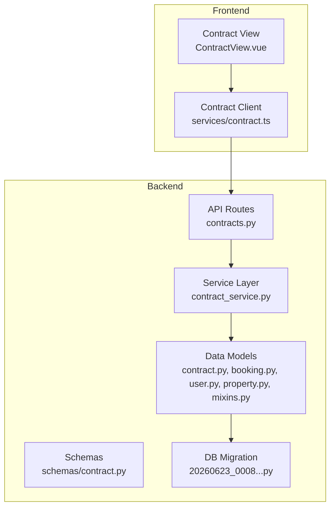
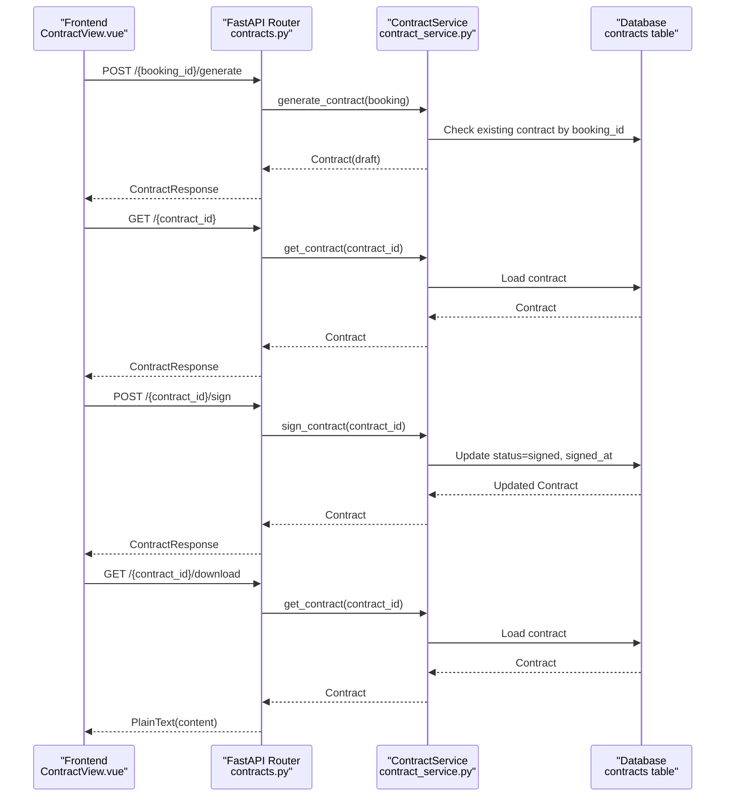
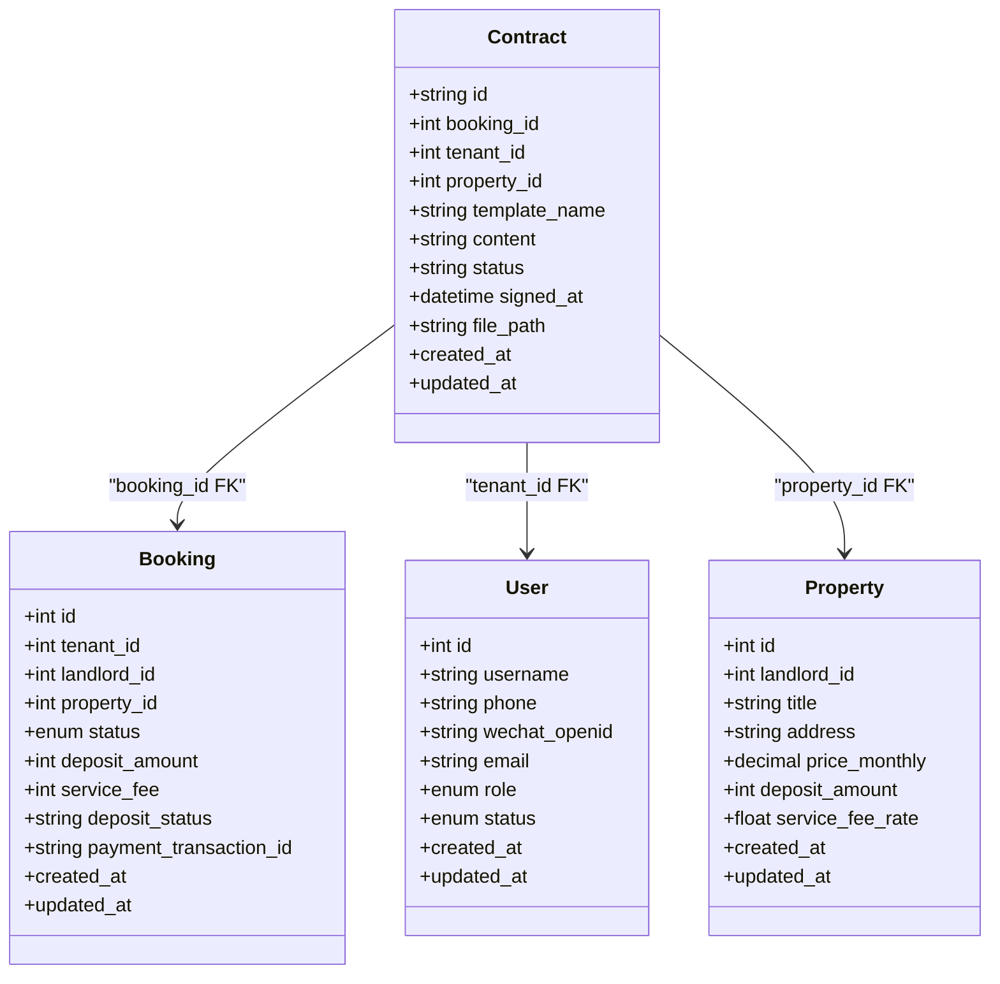
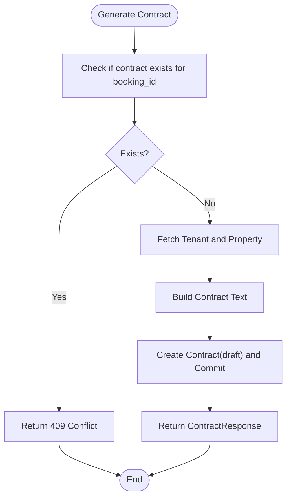
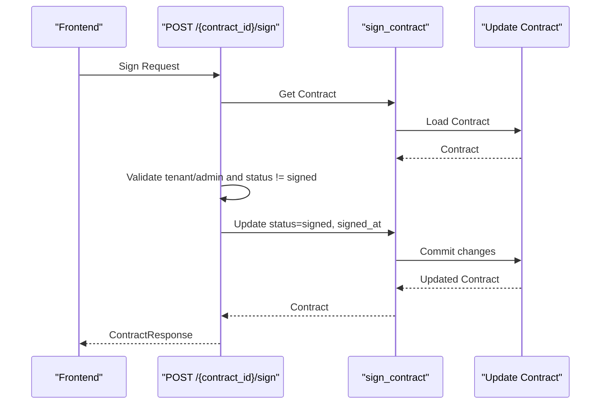
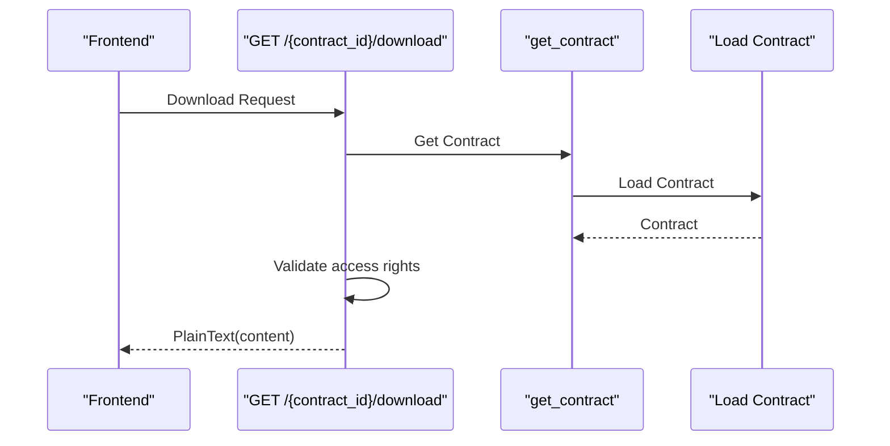
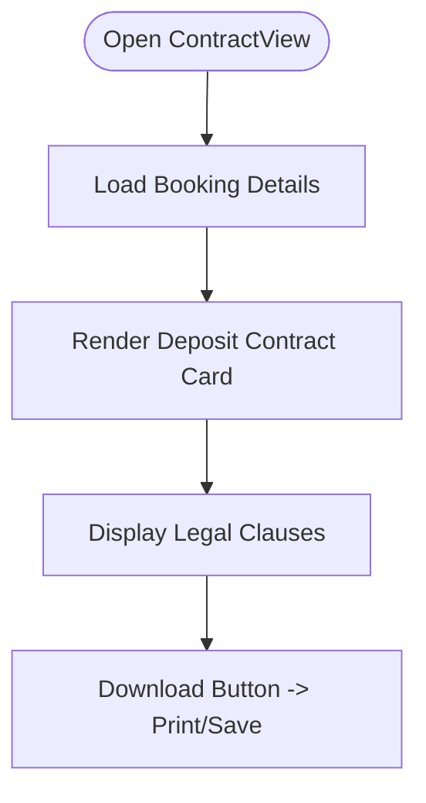
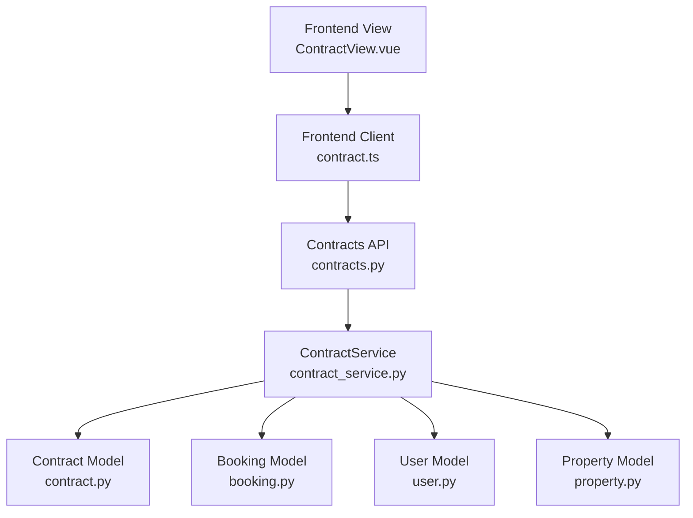

# Contract Management

<cite>
**Referenced Files in This Document**
- [contract.py](file://backend/app/models/contract.py)
- [booking.py](file://backend/app/models/booking.py)
- [user.py](file://backend/app/models/user.py)
- [property.py](file://backend/app/models/property.py)
- [mixins.py](file://backend/app/models/mixins.py)
- [contract_service.py](file://backend/app/services/contract_service.py)
- [contracts.py](file://backend/app/api/v1/routes/contracts.py)
- [contract.py](file://backend/app/schemas/contract.py)
- [20260623_0008_deposit_contract_payment_poi.py](file://backend/alembic/versions/20260623_0008_deposit_contract_payment_poi.py)
- [ContractView.vue](file://frontend/src/views/ContractView.vue)
- [contract.ts](file://frontend/src/services/contract.ts)
</cite>

## Table of Contents
1. [Introduction](#introduction)
2. [Project Structure](#project-structure)
3. [Core Components](#core-components)
4. [Architecture Overview](#architecture-overview)
5. [Detailed Component Analysis](#detailed-component-analysis)
6. [Dependency Analysis](#dependency-analysis)
7. [Performance Considerations](#performance-considerations)
8. [Troubleshooting Guide](#troubleshooting-guide)
9. [Conclusion](#conclusion)
10. [Appendices](#appendices)

## Introduction
This document provides comprehensive data model documentation for the Contract management system within a rental housing platform. It focuses on the Contract model used for digital contract generation, including signing parties, contract terms, signature handling, and legal validity tracking. It also explains the contract lifecycle from template generation to execution, outlines electronic signature support and document storage, and clarifies current capabilities and limitations around versioning, amendments, and expiration. Business rules for validation, party verification, and legal compliance are summarized based on the implemented code and frontend behavior. Finally, it includes examples of contract creation workflows, signing processes, and status management from draft to executed state.

## Project Structure
The Contract feature spans backend models, services, API routes, schemas, database migrations, and frontend views:
- Backend model defines the Contract entity and relationships with Booking, User (tenant), and Property.
- Service encapsulates business logic for generating contracts from booking data and signing them.
- API routes expose endpoints for generating, retrieving, signing, and downloading contracts.
- Schemas define request/response structures.
- Migration creates the contracts table and indexes.
- Frontend displays a deposit contract view and integrates with contract APIs.

**Diagram sources**
- [contracts.py:1-88](file://backend/app/api/v1/routes/contracts.py#L1-L88)
- [contract_service.py:1-96](file://backend/app/services/contract_service.py#L1-L96)
- [contract.py:1-37](file://backend/app/models/contract.py#L1-L37)
- [booking.py:1-47](file://backend/app/models/booking.py#L1-L47)
- [user.py:1-48](file://backend/app/models/user.py#L1-L48)
- [property.py:1-86](file://backend/app/models/property.py#L1-L86)
- [mixins.py:1-19](file://backend/app/models/mixins.py#L1-L19)
- [contract.py:1-23](file://backend/app/schemas/contract.py#L1-L23)
- [20260623_0008_deposit_contract_payment_poi.py:32-56](file://backend/alembic/versions/20260623_0008_deposit_contract_payment_poi.py#L32-L56)
- [ContractView.vue:1-222](file://frontend/src/views/ContractView.vue#L1-L222)
- [contract.ts:1-33](file://frontend/src/services/contract.ts#L1-L33)

**Section sources**
- [contract.py:1-37](file://backend/app/models/contract.py#L1-L37)
- [contract_service.py:1-96](file://backend/app/services/contract_service.py#L1-L96)
- [contracts.py:1-88](file://backend/app/api/v1/routes/contracts.py#L1-L88)
- [contract.py:1-23](file://backend/app/schemas/contract.py#L1-L23)
- [20260623_0008_deposit_contract_payment_poi.py:32-56](file://backend/alembic/versions/20260623_0008_deposit_contract_payment_poi.py#L32-L56)
- [ContractView.vue:1-222](file://frontend/src/views/ContractView.vue#L1-L222)
- [contract.ts:1-33](file://frontend/src/services/contract.ts#L1-L33)

## Core Components
- Contract Model: Represents a generated lease contract tied to a specific booking, tenant, and property. Stores content as text, tracks status, signed timestamp, and optional file path for stored documents.
- Relationships:
  - One-to-one with Booking via unique booking_id.
  - Many-to-one with User (tenant).
  - Many-to-one with Property.
- Status Lifecycle: Draft by default; transitions to Signed upon successful sign operation.
- Signing: Updates status to signed and records signed_at timestamp.
- Storage: Optional file_path field exists for storing generated PDFs or attachments; currently not populated by service methods.
- Access Control: API enforces role-based access for viewing and signing.

Key fields and behaviors:
- id: UUID primary key.
- booking_id: Unique foreign key to bookings.
- tenant_id: Foreign key to users (tenant).
- property_id: Foreign key to properties.
- template_name: Template identifier (default standard_lease).
- content: Full contract text.
- status: String enum-like values (draft, signed).
- signed_at: Timestamp when signed.
- file_path: Optional path to stored document.

**Section sources**
- [contract.py:12-37](file://backend/app/models/contract.py#L12-L37)
- [contract_service.py:19-96](file://backend/app/services/contract_service.py#L19-L96)
- [contracts.py:14-88](file://backend/app/api/v1/routes/contracts.py#L14-L88)
- [20260623_0008_deposit_contract_payment_poi.py:32-56](file://backend/alembic/versions/20260623_0008_deposit_contract_payment_poi.py#L32-L56)

## Architecture Overview
The contract workflow is driven by API calls that invoke service methods, which interact with the database through SQLAlchemy ORM. The frontend presents a deposit contract view and uses a client service to call backend endpoints.

**Diagram sources**
- [contracts.py:14-88](file://backend/app/api/v1/routes/contracts.py#L14-L88)
- [contract_service.py:19-96](file://backend/app/services/contract_service.py#L19-L96)
- [contract.py:12-37](file://backend/app/models/contract.py#L12-L37)

## Detailed Component Analysis

### Data Model Class Diagram

**Diagram sources**
- [contract.py:12-37](file://backend/app/models/contract.py#L12-L37)
- [booking.py:18-47](file://backend/app/models/booking.py#L18-L47)
- [user.py:24-48](file://backend/app/models/user.py#L24-L48)
- [property.py:38-86](file://backend/app/models/property.py#L38-L86)

**Section sources**
- [contract.py:12-37](file://backend/app/models/contract.py#L12-L37)
- [booking.py:18-47](file://backend/app/models/booking.py#L18-L47)
- [user.py:24-48](file://backend/app/models/user.py#L24-L48)
- [property.py:38-86](file://backend/app/models/property.py#L38-L86)

### Contract Generation Workflow
- Input: booking_id provided by the caller.
- Validation: Ensure no existing contract for the booking; fetch tenant and property details.
- Content Generation: Build a Chinese lease contract text using property and booking data.
- Persistence: Create Contract with status draft and save to DB.
- Output: Return ContractResponse.

**Diagram sources**
- [contract_service.py:19-78](file://backend/app/services/contract_service.py#L19-L78)
- [contracts.py:14-33](file://backend/app/api/v1/routes/contracts.py#L14-L33)

**Section sources**
- [contract_service.py:19-78](file://backend/app/services/contract_service.py#L19-L78)
- [contracts.py:14-33](file://backend/app/api/v1/routes/contracts.py#L14-L33)

### Contract Signing Process
- Input: contract_id and authenticated tenant user.
- Validation: Verify contract exists, user is tenant or admin, and contract is not already signed.
- Action: Update status to signed and set signed_at timestamp.
- Output: Return updated ContractResponse.

**Diagram sources**
- [contracts.py:54-71](file://backend/app/api/v1/routes/contracts.py#L54-L71)
- [contract_service.py:88-96](file://backend/app/services/contract_service.py#L88-L96)

**Section sources**
- [contracts.py:54-71](file://backend/app/api/v1/routes/contracts.py#L54-L71)
- [contract_service.py:88-96](file://backend/app/services/contract_service.py#L88-L96)

### Download Contract Content
- Input: contract_id and authenticated user.
- Validation: Ensure contract exists and user has access (tenant, landlord, or admin).
- Output: PlainText response containing contract.content.

**Diagram sources**
- [contracts.py:74-88](file://backend/app/api/v1/routes/contracts.py#L74-L88)
- [contract_service.py:80-86](file://backend/app/services/contract_service.py#L80-L86)

**Section sources**
- [contracts.py:74-88](file://backend/app/api/v1/routes/contracts.py#L74-L88)
- [contract_service.py:80-86](file://backend/app/services/contract_service.py#L80-L86)

### Frontend Deposit Contract View
- Displays deposit contract information derived from booking data.
- Shows clauses stating the electronic contract has equal legal effect to paper contracts and specifies dispute resolution under PRC law.
- Provides a download button that triggers browser print/save; production will call backend PDF generation.

**Diagram sources**
- [ContractView.vue:1-222](file://frontend/src/views/ContractView.vue#L1-L222)

**Section sources**
- [ContractView.vue:1-222](file://frontend/src/views/ContractView.vue#L1-L222)

## Dependency Analysis
- Contract depends on Booking, User (tenant), and Property via foreign keys.
- ContractService depends on Booking, User, and Property models to populate contract content.
- API routes depend on dependencies for authentication, session, and services.
- Frontend client service maps to backend endpoints.

**Diagram sources**
- [contracts.py:1-88](file://backend/app/api/v1/routes/contracts.py#L1-L88)
- [contract_service.py:1-96](file://backend/app/services/contract_service.py#L1-L96)
- [contract.py:1-37](file://backend/app/models/contract.py#L1-L37)
- [booking.py:1-47](file://backend/app/models/booking.py#L1-L47)
- [user.py:1-48](file://backend/app/models/user.py#L1-L48)
- [property.py:1-86](file://backend/app/models/property.py#L1-L86)
- [contract.ts:1-33](file://frontend/src/services/contract.ts#L1-L33)
- [ContractView.vue:1-222](file://frontend/src/views/ContractView.vue#L1-L222)

**Section sources**
- [contracts.py:1-88](file://backend/app/api/v1/routes/contracts.py#L1-L88)
- [contract_service.py:1-96](file://backend/app/services/contract_service.py#L1-L96)
- [contract.py:1-37](file://backend/app/models/contract.py#L1-L37)
- [booking.py:1-47](file://backend/app/models/booking.py#L1-L47)
- [user.py:1-48](file://backend/app/models/user.py#L1-L48)
- [property.py:1-86](file://backend/app/models/property.py#L1-L86)
- [contract.ts:1-33](file://frontend/src/services/contract.ts#L1-L33)
- [ContractView.vue:1-222](file://frontend/src/views/ContractView.vue#L1-L222)

## Performance Considerations
- Indexes: Database migration adds indexes on contracts.booking_id, contracts.tenant_id, contracts.property_id, and contracts.id to optimize lookups and joins.
- Unique Constraint: contracts.booking_id ensures one contract per booking, preventing duplication and reducing contention.
- Minimal Payloads: ContractResponse excludes sensitive internal fields and returns only necessary attributes.
- Asynchronous Session: Service layer uses async SQLAlchemy sessions for non-blocking I/O.

[No sources needed since this section provides general guidance]

## Troubleshooting Guide
Common issues and resolutions:
- Contract already exists for booking: Occurs when attempting to generate a second contract for the same booking. Resolve by reusing the existing contract or deleting the prior one if appropriate.
- Access denied: Viewing or downloading requires the user to be the tenant, landlord, or admin. Ensure correct authentication and roles.
- Only the tenant can sign: Signing endpoint restricts to tenant or admin. Confirm the calling user’s identity and role.
- Contract already signed: Prevents duplicate signatures. If re-signing is required, implement an amendment process (see Appendix).

Operational checks:
- Verify booking exists before generating contract.
- Confirm tenant_id matches the signed user.
- Ensure signed_at is recorded after signing.

**Section sources**
- [contracts.py:14-88](file://backend/app/api/v1/routes/contracts.py#L14-L88)
- [contract_service.py:19-96](file://backend/app/services/contract_service.py#L19-L96)

## Conclusion
The Contract management system implements a straightforward digital contract lifecycle: generate a text-based lease contract from booking data, allow the tenant to sign electronically, and provide download capability. While the model supports optional document storage via file_path, current implementations focus on text content and basic status tracking. Versioning, amendments, and expiration are not yet modeled; these should be added to support robust legal compliance and auditability.

[No sources needed since this section summarizes without analyzing specific files]

## Appendices

### Current Capabilities vs. Requirements
- Digital contract generation: Implemented via template text populated with booking and property data.
- Signing parties: Tenant identified via relationship; landlord context available through booking.
- Signature handling: Status transition to signed with timestamp; no cryptographic signature or PKI integration.
- Legal validity tracking: Basic signed_at timestamp; additional audit trails recommended.
- Lifecycle: Draft to Signed; no explicit Expiration or Amendment states.
- Electronic signature support: Functional but minimal; consider integrating e-signature providers for stronger legal standing.
- Document storage: file_path field present but unused by current service methods.

### Proposed Enhancements
- Versioning: Add version number and effective dates to support multiple versions per contract.
- Amendments: Introduce Amendment entities linked to base contracts with change logs and approval workflows.
- Expiration: Add start_date, end_date, and auto-expiration handling.
- E-signature: Integrate provider APIs to capture signer identity, IP, device info, and certificate metadata.
- Audit trail: Record all state transitions and actions with timestamps and actor IDs.
- PDF generation: Implement server-side PDF rendering and store file_path securely.

[No sources needed since this section proposes enhancements without analyzing specific files]