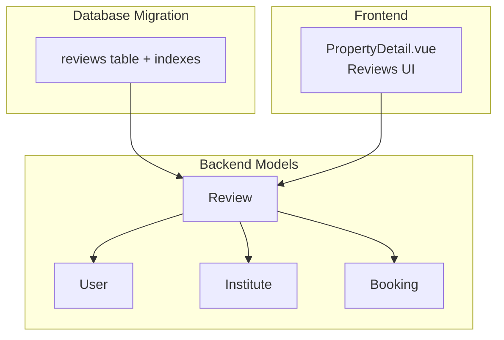
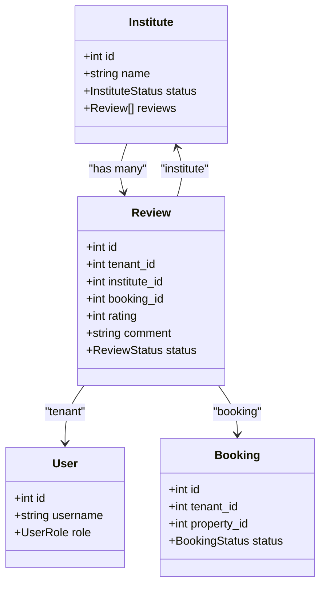
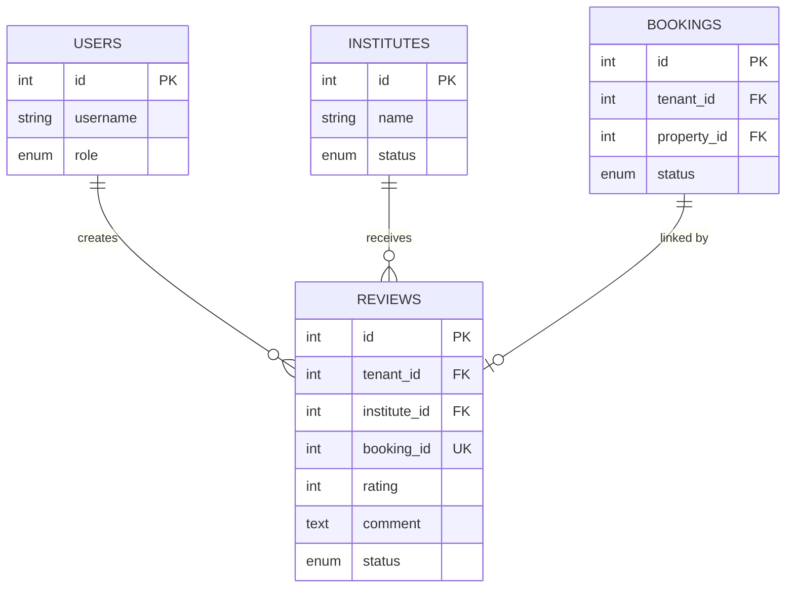
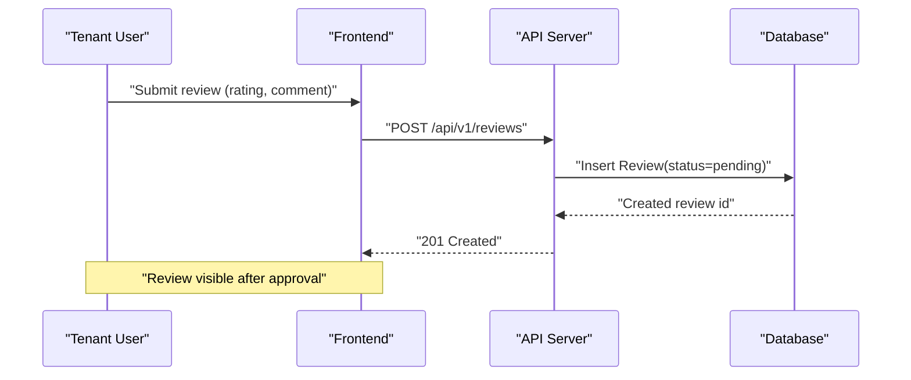
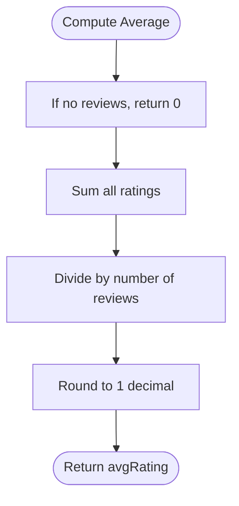
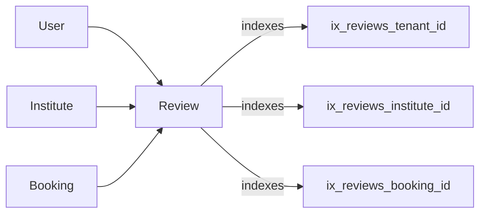

# Review System

<cite>
**Referenced Files in This Document**
- [review.py](file://backend/app/models/review.py)
- [institute.py](file://backend/app/models/institute.py)
- [booking.py](file://backend/app/models/booking.py)
- [user.py](file://backend/app/models/user.py)
- [20260626_0010_institutes_v15_v2.py](file://backend/alembic/versions/20260626_0010_institutes_v15_v2.py)
- [PropertyDetail.vue](file://frontend/src/views/PropertyDetail.vue)
</cite>

## Table of Contents
1. [Introduction](#introduction)
2. [Project Structure](#project-structure)
3. [Core Components](#core-components)
4. [Architecture Overview](#architecture-overview)
5. [Detailed Component Analysis](#detailed-component-analysis)
6. [Dependency Analysis](#dependency-analysis)
7. [Performance Considerations](#performance-considerations)
8. [Troubleshooting Guide](#troubleshooting-guide)
9. [Conclusion](#conclusion)

## Introduction
This document provides comprehensive data model documentation for the Review system, which enables tenants to provide feedback and ratings for apartment management institutions (Institutes). It covers the Review data model, relationships with Users, Institutes, and Bookings, moderation status, visibility controls, rating calculation logic, and example workflows across user roles. Where implementation details are not present in the codebase, this document clearly marks them as conceptual or pending.

## Project Structure
The Review system is primarily implemented in the backend models and database migrations, with a frontend display component that renders review summaries and lists on property detail pages.

**Diagram sources**
- [review.py:17-40](file://backend/app/models/review.py#L17-L40)
- [institute.py:16-47](file://backend/app/models/institute.py#L16-L47)
- [booking.py:18-46](file://backend/app/models/booking.py#L18-L46)
- [20260626_0010_institutes_v15_v2.py:107-130](file://backend/alembic/versions/20260626_0010_institutes_v15_v2.py#L107-L130)
- [PropertyDetail.vue:189-217](file://frontend/src/views/PropertyDetail.vue#L189-L217)

**Section sources**
- [review.py:17-40](file://backend/app/models/review.py#L17-L40)
- [institute.py:16-47](file://backend/app/models/institute.py#L16-L47)
- [booking.py:18-46](file://backend/app/models/booking.py#L18-L46)
- [20260626_0010_institutes_v15_v2.py:107-130](file://backend/alembic/versions/20260626_0010_institutes_v15_v2.py#L107-L130)
- [PropertyDetail.vue:189-217](file://frontend/src/views/PropertyDetail.vue#L189-L217)

## Core Components
- Review entity: Represents tenant feedback for an Institute, including rating score, comment text, and moderation status.
- Relationships:
  - User (tenant): The reviewer.
  - Institute: The subject of the review.
  - Booking: Optional linkage to a specific booking; unique constraint prevents duplicate reviews per booking.
- Moderation states: pending, approved, rejected.
- Frontend display: Property detail page shows average rating, star visualization, review count, and individual reviews with optional replies.

Key fields and constraints:
- id: primary key, indexed.
- tenant_id: foreign key to users.id, cascading delete, indexed.
- institute_id: foreign key to institutes.id, cascading delete, indexed.
- booking_id: foreign key to bookings.id, set null on delete, unique, indexed.
- rating: integer, required.
- comment: optional text.
- status: enum with default pending.

**Section sources**
- [review.py:17-40](file://backend/app/models/review.py#L17-L40)
- [20260626_0010_institutes_v15_v2.py:107-130](file://backend/alembic/versions/20260626_0010_institutes_v15_v2.py#L107-L130)

## Architecture Overview
The Review system centers around the Review model and its relationships to User, Institute, and Booking. The database migration defines the schema and indexes. The frontend displays aggregated ratings and review items.

**Diagram sources**
- [review.py:17-40](file://backend/app/models/review.py#L17-L40)
- [institute.py:16-47](file://backend/app/models/institute.py#L16-L47)
- [booking.py:18-46](file://backend/app/models/booking.py#L18-L46)
- [user.py:24-48](file://backend/app/models/user.py#L24-L48)

## Detailed Component Analysis

### Data Model: Review
- Purpose: Capture tenant feedback and ratings for an Institute.
- Fields:
  - id: unique identifier.
  - tenant_id: references the reviewing User.
  - institute_id: references the reviewed Institute.
  - booking_id: optional reference to a completed Booking; ensures one review per booking via unique constraint.
  - rating: integer score.
  - comment: free-form text.
  - status: moderation state (pending, approved, rejected).
- Indexes: id, tenant_id, institute_id, booking_id.
- Constraints:
  - Unique(booking_id) prevents duplicate reviews for the same booking.
  - Foreign keys enforce referential integrity with cascade behaviors.

**Diagram sources**
- [review.py:17-40](file://backend/app/models/review.py#L17-L40)
- [institute.py:16-47](file://backend/app/models/institute.py#L16-L47)
- [booking.py:18-46](file://backend/app/models/booking.py#L18-L46)
- [user.py:24-48](file://backend/app/models/user.py#L24-L48)
- [20260626_0010_institutes_v15_v2.py:107-130](file://backend/alembic/versions/20260626_0010_institutes_v15_v2.py#L107-L130)

**Section sources**
- [review.py:17-40](file://backend/app/models/review.py#L17-L40)
- [20260626_0010_institutes_v15_v2.py:107-130](file://backend/alembic/versions/20260626_0010_institutes_v15_v2.py#L107-L130)

### Submission Workflow (Conceptual)
Note: No explicit API routes or services for reviews were found in the repository. The following workflow is conceptual and intended for future implementation.

[No sources needed since this diagram shows conceptual workflow, not actual code structure]

### Rating Calculation Algorithms
- Backend: Not implemented in the provided files.
- Frontend: PropertyDetail.vue computes average rating from local review data using sum divided by count, rounded to one decimal place.

**Diagram sources**
- [PropertyDetail.vue:319-323](file://frontend/src/views/PropertyDetail.vue#L319-L323)

**Section sources**
- [PropertyDetail.vue:319-323](file://frontend/src/views/PropertyDetail.vue#L319-L323)

### Content Moderation Processes
- Status field supports pending, approved, rejected.
- Default status is pending upon creation.
- No moderation endpoints or services were found in the repository; moderation actions would be implemented as part of admin functionality.

**Section sources**
- [review.py:32-36](file://backend/app/models/review.py#L32-L36)
- [20260626_0010_institutes_v15_v2.py:116-121](file://backend/alembic/versions/20260626_0010_institutes_v15_v2.py#L116-L121)

### Visibility Controls
- Conceptual rule: Only reviews with status=approved should be displayed publicly.
- Frontend currently renders a static list and computed average; integration with backend-approved reviews is pending.

**Section sources**
- [PropertyDetail.vue:189-217](file://frontend/src/views/PropertyDetail.vue#L189-L217)

### Spam Detection and Response Mechanisms
- Not implemented in the current codebase.
- Potential future enhancements:
  - Rate limiting per tenant.
  - Duplicate detection beyond booking uniqueness (e.g., time window checks).
  - Admin moderation queue and response fields.

[No sources needed since this section provides general guidance]

### Business Rules for Eligibility, Aggregation, and Filtering
- Eligibility:
  - One review per booking enforced by unique(booking_id).
  - Reviews target an Institute; tenant must exist.
- Aggregation:
  - Backend aggregation not implemented; frontend computes average locally.
- Filtering:
  - Public listing should filter by status=approved (conceptual).

**Section sources**
- [review.py:27-29](file://backend/app/models/review.py#L27-L29)
- [PropertyDetail.vue:319-323](file://frontend/src/views/PropertyDetail.vue#L319-L323)

### Examples Across User Roles
- Tenant:
  - Create a review for an Institute linked to their Booking.
- Landlord:
  - View approved reviews for properties under their management (conceptual).
- BD Manager:
  - Manage Institutes; may view associated reviews (conceptual).
- Admin:
  - Moderate reviews (approve/reject), manage spam (conceptual).

[No sources needed since this section doesn't analyze specific files]

## Dependency Analysis
The Review model depends on User, Institute, and Booking entities. Database indexes optimize queries by tenant, institute, and booking.

**Diagram sources**
- [review.py:20-29](file://backend/app/models/review.py#L20-L29)
- [20260626_0010_institutes_v15_v2.py:127-130](file://backend/alembic/versions/20260626_0010_institutes_v15_v2.py#L127-L130)

**Section sources**
- [review.py:20-29](file://backend/app/models/review.py#L20-L29)
- [20260626_0010_institutes_v15_v2.py:127-130](file://backend/alembic/versions/20260626_0010_institutes_v15_v2.py#L127-L130)

## Performance Considerations
- Use indexes on tenant_id, institute_id, and booking_id for efficient filtering and joins.
- Avoid N+1 queries when loading reviews for an Institute; use eager loading strategies where applicable.
- For large datasets, consider pagination and server-side aggregation for average ratings.

[No sources needed since this section provides general guidance]

## Troubleshooting Guide
- Duplicate review errors:
  - Ensure booking_id uniqueness is respected; attempts to create multiple reviews for the same booking will fail due to unique constraint.
- Missing relationships:
  - Verify tenant_id and institute_id point to existing records; foreign key constraints will prevent invalid references.
- Display issues:
  - Confirm only approved reviews are rendered; check status values before displaying.

**Section sources**
- [review.py:27-29](file://backend/app/models/review.py#L27-L29)
- [20260626_0010_institutes_v15_v2.py:124-126](file://backend/alembic/versions/20260626_0010_institutes_v15_v2.py#L124-L126)

## Conclusion
The Review system’s data model is well-defined with clear relationships and moderation states. While submission and moderation APIs are not yet implemented, the schema and indexes support scalable querying and enforcement of business rules such as one review per booking. The frontend demonstrates how average ratings can be calculated and displayed. Future work should implement secure submission endpoints, moderation workflows, and server-side aggregation for performance and consistency.