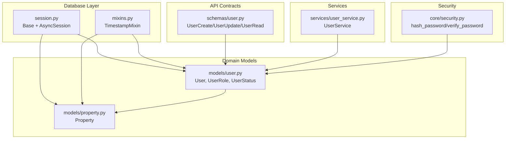
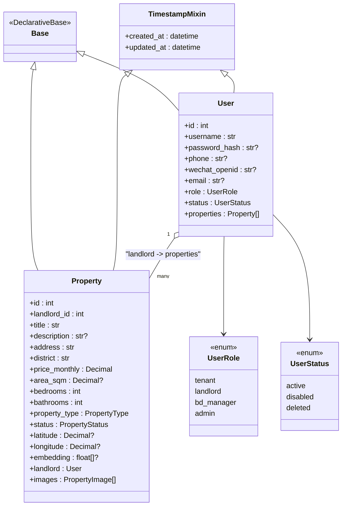
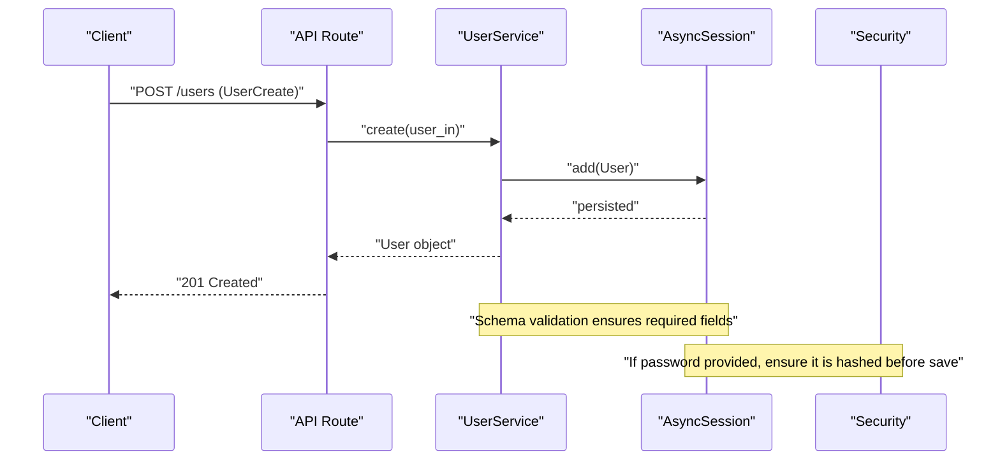
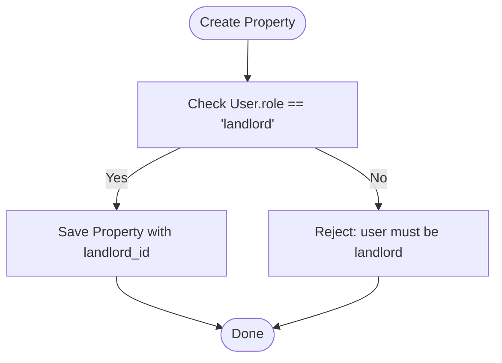
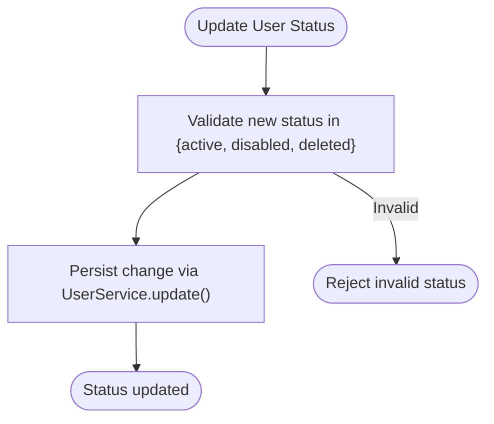
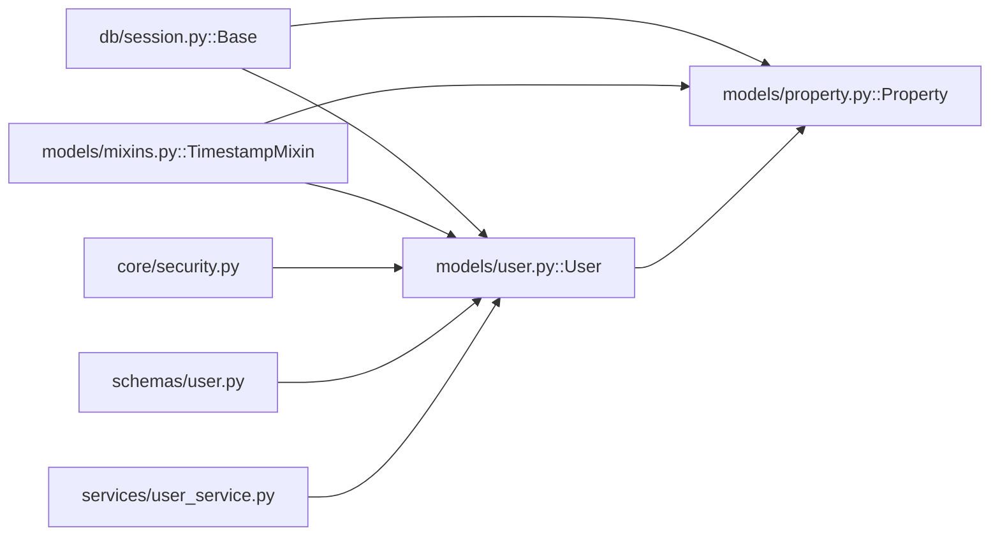

# Core Entities

<cite>
**Referenced Files in This Document**
- [user.py](file://backend/app/models/user.py)
- [mixins.py](file://backend/app/models/mixins.py)
- [base.py](file://backend/app/db/base.py)
- [session.py](file://backend/app/db/session.py)
- [property.py](file://backend/app/models/property.py)
- [20260617_0001_initial_users_properties.py](file://backend/alembic/versions/20260617_0001_initial_users_properties.py)
- [security.py](file://backend/app/core/security.py)
- [user_service.py](file://backend/app/services/user_service.py)
- [user.py (schemas)](file://backend/app/schemas/user.py)
</cite>

## Table of Contents
1. [Introduction](#introduction)
2. [Project Structure](#project-structure)
3. [Core Components](#core-components)
4. [Architecture Overview](#architecture-overview)
5. [Detailed Component Analysis](#detailed-component-analysis)
6. [Dependency Analysis](#dependency-analysis)
7. [Performance Considerations](#performance-considerations)
8. [Troubleshooting Guide](#troubleshooting-guide)
9. [Conclusion](#conclusion)
10. [Appendices](#appendices)

## Introduction
This document provides comprehensive data model documentation for the core entities in the Rental Housing Structure database, focusing on:
- The User model with multi-role support and status management
- Authentication fields including password_hash, phone, wechat_openid, and email
- The TimestampMixin base class providing created_at and updated_at
- The Base class inheritance pattern and common field definitions
- Entity relationships and constraints
- Validation rules at both ORM and schema layers
- Examples of user creation, role assignment, and status transitions
- The relationship between users and their properties as landlords

## Project Structure
The relevant code for core entities is organized under backend/app with clear separation between models, schemas, services, and database configuration.

**Diagram sources**
- [session.py:12-14](file://backend/app/db/session.py#L12-L14)
- [mixins.py:7-19](file://backend/app/models/mixins.py#L7-L19)
- [user.py:11-48](file://backend/app/models/user.py#L11-L48)
- [property.py:38-86](file://backend/app/models/property.py#L38-L86)
- [user.py (schemas):8-45](file://backend/app/schemas/user.py#L8-L45)
- [user_service.py:8-57](file://backend/app/services/user_service.py#L8-L57)
- [security.py:12-19](file://backend/app/core/security.py#L12-L19)

**Section sources**
- [session.py:1-14](file://backend/app/db/session.py#L1-L14)
- [mixins.py:1-19](file://backend/app/models/mixins.py#L1-L19)
- [user.py:1-48](file://backend/app/models/user.py#L1-L48)
- [property.py:1-86](file://backend/app/models/property.py#L1-L86)
- [user.py (schemas):1-45](file://backend/app/schemas/user.py#L1-L45)
- [user_service.py:1-57](file://backend/app/services/user_service.py#L1-L57)
- [security.py:1-34](file://backend/app/core/security.py#L1-L34)

## Core Components
- Base class: Declarative base for all ORM entities, enabling async attribute access via AsyncAttrs.
- TimestampMixin: Adds created_at and updated_at columns with server-side defaults and auto-update behavior.
- User model: Multi-role entity supporting tenant, landlord, bd_manager, admin; includes authentication and contact identifiers; manages status lifecycle.
- Property model: Represents rental listings with a foreign key to the landlord user and various business constraints.

Key responsibilities:
- Data integrity through unique indexes and check constraints
- Role-based access modeling via an enum
- Status-driven lifecycle control via an enum
- Auditability via timestamps

**Section sources**
- [session.py:12-14](file://backend/app/db/session.py#L12-L14)
- [mixins.py:7-19](file://backend/app/models/mixins.py#L7-L19)
- [user.py:24-48](file://backend/app/models/user.py#L24-L48)
- [property.py:38-86](file://backend/app/models/property.py#L38-L86)

## Architecture Overview
The data layer uses SQLAlchemy declarative mapping with async support. Models inherit from Base and optionally TimestampMixin. Relationships are defined using SQLAlchemy relationships and foreign keys. Pydantic schemas enforce API-level validation. Services orchestrate persistence operations. Security utilities handle password hashing and verification.

**Diagram sources**
- [user.py:11-48](file://backend/app/models/user.py#L11-L48)
- [property.py:38-86](file://backend/app/models/property.py#L38-L86)
- [mixins.py:7-19](file://backend/app/models/mixins.py#L7-L19)
- [session.py:12-14](file://backend/app/db/session.py#L12-L14)

## Detailed Component Analysis

### Base and TimestampMixin
- Base: Provides the declarative foundation for all models and integrates async attribute access.
- TimestampMixin: Adds created_at and updated_at with timezone-aware datetimes, server defaults, and automatic updates on write.

Constraints and behaviors:
- created_at: non-null, default set by server function
- updated_at: non-null, default set by server function, updated automatically on row changes

**Section sources**
- [session.py:12-14](file://backend/app/db/session.py#L12-L14)
- [mixins.py:7-19](file://backend/app/models/mixins.py#L7-L19)

### User Model
Fields:
- id: primary key, integer, indexed
- username: string up to 100 chars, unique, indexed, required
- password_hash: optional string up to 255 chars (used for local auth)
- phone: optional string up to 32 chars, unique, indexed
- wechat_openid: optional string up to 128 chars, unique, indexed
- email: optional string up to 255 chars, unique, indexed
- role: enum with values tenant, landlord, bd_manager, admin; default tenant; required
- status: enum with values active, disabled, deleted; default active; required
- properties: one-to-many relationship to Property (landlord owns many properties), cascade delete-orphan

Indexes and constraints:
- Unique indexes enforced at DB level for username, phone, wechat_openid, email
- Enum constraints enforced at DB level for role and status

Relationships:
- One User can be the landlord of many Properties
- Deleting a User cascades deletion of its owned Properties

Validation:
- ORM-level uniqueness and not-null constraints
- Schema-level validation via Pydantic for API inputs (see schemas below)

Examples:
- Creating a user with role landlord and status active
- Assigning a new role to an existing user
- Transitioning status from active to disabled or deleted

**Section sources**
- [user.py:11-48](file://backend/app/models/user.py#L11-L48)
- [20260617_0001_initial_users_properties.py:18-44](file://backend/alembic/versions/20260617_0001_initial_users_properties.py#L18-L44)

### Property Model
Fields:
- id: primary key, integer, indexed
- landlord_id: foreign key to users.id with CASCADE delete
- institute_id: optional foreign key to institutes.id with SET NULL
- title: required string up to 200 chars
- description: optional text
- address: required string up to 300 chars
- district: required string up to 100 chars, indexed
- price_monthly: required numeric (12,2)
- area_sqm: optional numeric (8,2)
- bedrooms: integer, default 0
- bathrooms: integer, default 0
- property_type: enum apartment/house/studio/shared; default apartment
- status: enum available/rented/maintenance/offline; default available; indexed
- latitude/longitude: optional numeric coordinates
- deposit_amount: optional integer, default 1000
- service_fee_rate: optional float, default 0.10
- embedding: vector column (PostgreSQL pgvector) stored as text fallback
- images: one-to-many relationship to PropertyImage with cascade delete-orphan

Check constraints:
- price_monthly >= 0
- area_sqm IS NULL OR area_sqm > 0
- bedrooms >= 0
- bathrooms >= 0

Indexes:
- District and status composite index
- Landlord_id index
- Status index

Relationships:
- Belongs to a landlord (User)
- Optional association to Institute
- Has many PropertyImage entries

**Section sources**
- [property.py:38-86](file://backend/app/models/property.py#L38-L86)
- [20260617_0001_initial_users_properties.py:46-75](file://backend/alembic/versions/20260617_0001_initial_users_properties.py#L46-L75)

### Enums and Lifecycle
- UserRole: tenant, landlord, bd_manager, admin
- UserStatus: active, disabled, deleted
- PropertyType: apartment, house, studio, shared
- PropertyStatus: available, rented, maintenance, offline

These enums constrain valid values at the database level and provide type safety in Python.

**Section sources**
- [user.py:11-22](file://backend/app/models/user.py#L11-L22)
- [property.py:24-36](file://backend/app/models/property.py#L24-L36)
- [20260617_0001_initial_users_properties.py:18-21](file://backend/alembic/versions/20260617_0001_initial_users_properties.py#L18-L21)

### Authentication Fields and Security
- password_hash: stores bcrypt-hashed passwords; never store plain text
- verify_password: validates a plain password against a stored hash
- hash_password: generates a secure hash for storage

Usage patterns:
- On registration or password change, hash the password before saving
- On login, verify the provided password against the stored hash

**Section sources**
- [security.py:12-19](file://backend/app/core/security.py#L12-L19)
- [user.py:28-29](file://backend/app/models/user.py#L28-L29)

### API-Level Validation (Pydantic Schemas)
- UserBase: defines common fields with length limits and email format validation
- UserCreate: allows setting password_hash during creation
- UserUpdate: supports partial updates for multiple fields including role and status
- UserProfileUpdate: restricts updateable profile fields and forbids extra fields
- UserRead: exposes id and timestamps when reading back

Notes:
- EmailStr enforces valid email format
- Field constraints mirror ORM requirements where applicable

**Section sources**
- [user.py (schemas):8-45](file://backend/app/schemas/user.py#L8-L45)

### Service Layer Operations
UserService provides:
- create: instantiate User from schema and persist
- get: fetch by id
- get_by_username_or_email: lookup by identifier
- list: paginated listing ordered by created_at desc
- update: apply partial updates from schema
- delete: remove a user

These methods operate on async sessions and return ORM objects.

**Section sources**
- [user_service.py:8-57](file://backend/app/services/user_service.py#L8-L57)

## Architecture Overview
The following sequence illustrates typical user creation and role assignment flows.

**Diagram sources**
- [user_service.py:12-17](file://backend/app/services/user_service.py#L12-L17)
- [user.py (schemas):17-19](file://backend/app/schemas/user.py#L17-L19)
- [security.py:12-13](file://backend/app/core/security.py#L12-L13)

## Detailed Component Analysis

### User Model Deep Dive
- Multi-role support:
  - tenant: standard renter
  - landlord: owner of properties
  - bd_manager: business development manager
  - admin: system administrator
- Status management:
  - active: normal operation
  - disabled: temporarily blocked
  - deleted: soft or hard removal depending on application logic
- Authentication fields:
  - password_hash: used for local authentication
  - phone/wechat_openid/email: alternative identifiers, each unique across users

Example scenarios:
- Create a landlord user with role=landlord and status=active
- Update a tenant’s role to landlord after verification
- Disable a user account by setting status=disabled
- Mark a user as deleted by setting status=deleted (if soft-delete semantics are implemented elsewhere)

**Section sources**
- [user.py:11-48](file://backend/app/models/user.py#L11-L48)
- [user.py (schemas):8-29](file://backend/app/schemas/user.py#L8-L29)

### Relationship Between Users and Properties
- A User with role=landlord can own multiple Properties
- The Property.landlord_id references User.id with CASCADE delete
- Deleting a landlord removes all associated properties unless handled otherwise

**Diagram sources**
- [property.py:49-50](file://backend/app/models/property.py#L49-L50)
- [user.py:44-47](file://backend/app/models/user.py#L44-L47)

**Section sources**
- [property.py:49-80](file://backend/app/models/property.py#L49-L80)
- [user.py:44-47](file://backend/app/models/user.py#L44-L47)

### Validation Rules and Constraints Summary
- Uniqueness:
  - username, phone, wechat_openid, email must be unique
- Not-null:
  - username, role, status are required
- Numeric checks:
  - price_monthly >= 0
  - area_sqm > 0 if present
  - bedrooms >= 0
  - bathrooms >= 0
- Length/format:
  - username <= 100
  - phone <= 32
  - wechat_openid <= 128
  - email <= 255 and valid email format (schema layer)

**Section sources**
- [user.py:27-42](file://backend/app/models/user.py#L27-L42)
- [property.py:40-46](file://backend/app/models/property.py#L40-L46)
- [20260617_0001_initial_users_properties.py:24-75](file://backend/alembic/versions/20260617_0001_initial_users_properties.py#L24-L75)
- [user.py (schemas):8-29](file://backend/app/schemas/user.py#L8-L29)

### Status Transitions Flow
A typical flow for changing a user’s status:

**Diagram sources**
- [user_service.py:37-47](file://backend/app/services/user_service.py#L37-L47)
- [user.py:18-22](file://backend/app/models/user.py#L18-L22)

**Section sources**
- [user_service.py:37-47](file://backend/app/services/user_service.py#L37-L47)
- [user.py:18-22](file://backend/app/models/user.py#L18-L22)

## Dependency Analysis
The following diagram shows how components depend on each other for core entity functionality.

**Diagram sources**
- [session.py:12-14](file://backend/app/db/session.py#L12-L14)
- [mixins.py:7-19](file://backend/app/models/mixins.py#L7-L19)
- [user.py:24-48](file://backend/app/models/user.py#L24-L48)
- [property.py:38-86](file://backend/app/models/property.py#L38-L86)
- [security.py:12-19](file://backend/app/core/security.py#L12-L19)
- [user.py (schemas):8-45](file://backend/app/schemas/user.py#L8-L45)
- [user_service.py:8-57](file://backend/app/services/user_service.py#L8-L57)

**Section sources**
- [session.py:12-14](file://backend/app/db/session.py#L12-L14)
- [mixins.py:7-19](file://backend/app/models/mixins.py#L7-L19)
- [user.py:24-48](file://backend/app/models/user.py#L24-L48)
- [property.py:38-86](file://backend/app/models/property.py#L38-L86)
- [security.py:12-19](file://backend/app/core/security.py#L12-L19)
- [user.py (schemas):8-45](file://backend/app/schemas/user.py#L8-L45)
- [user_service.py:8-57](file://backend/app/services/user_service.py#L8-L57)

## Performance Considerations
- Indexes:
  - Users: id, username, phone, wechat_openid, email
  - Properties: id, landlord_id, district, status, and composite district+status
- Use selectin loading for related images to avoid N+1 queries
- Prefer filtering by district and status together leveraging the composite index
- Avoid storing large blobs in the database; use external storage for images

[No sources needed since this section provides general guidance]

## Troubleshooting Guide
Common issues and resolutions:
- Duplicate key errors:
  - Occur when inserting duplicate username, phone, wechat_openid, or email
  - Resolution: Ensure uniqueness before insert or catch and translate to user-friendly errors
- Invalid enum values:
  - Attempting to set unsupported role or status
  - Resolution: Validate against UserRole and UserStatus enums
- Constraint violations:
  - Negative price or area values
  - Resolution: Enforce positive values at schema and DB levels
- Password-related failures:
  - Missing password_hash or mismatched hashes
  - Resolution: Always hash passwords before storage and verify correctly during login

**Section sources**
- [20260617_0001_initial_users_properties.py:24-75](file://backend/alembic/versions/20260617_0001_initial_users_properties.py#L24-L75)
- [user.py (schemas):8-29](file://backend/app/schemas/user.py#L8-L29)
- [security.py:16-19](file://backend/app/core/security.py#L16-L19)

## Conclusion
The core data model centers around a flexible User entity with robust role and status management, strong uniqueness and constraint enforcement, and clear relationships to Property entities. TimestampMixin ensures auditability, while Pydantic schemas and security utilities complement the ORM layer to deliver safe and validated APIs.

[No sources needed since this section summarizes without analyzing specific files]

## Appendices

### Example Workflows

- Create a landlord user:
  - Provide username, optional password_hash, role=landlord, status=active
  - Persist via UserService.create()
  - Reference: [user_service.py:12-17](file://backend/app/services/user_service.py#L12-L17), [user.py (schemas):17-19](file://backend/app/schemas/user.py#L17-L19)

- Assign a new role:
  - Update role field via UserService.update()
  - Reference: [user_service.py:37-47](file://backend/app/services/user_service.py#L37-L47), [user.py (schemas):21-29](file://backend/app/schemas/user.py#L21-L29)

- Transition status:
  - Set status to disabled or deleted via UserService.update()
  - Reference: [user_service.py:37-47](file://backend/app/services/user_service.py#L37-L47), [user.py:18-22](file://backend/app/models/user.py#L18-L22)

- Associate a property with a landlord:
  - Create Property with landlord_id referencing a User with role=landlord
  - Reference: [property.py:49-50](file://backend/app/models/property.py#L49-L50), [user.py:44-47](file://backend/app/models/user.py#L44-L47)