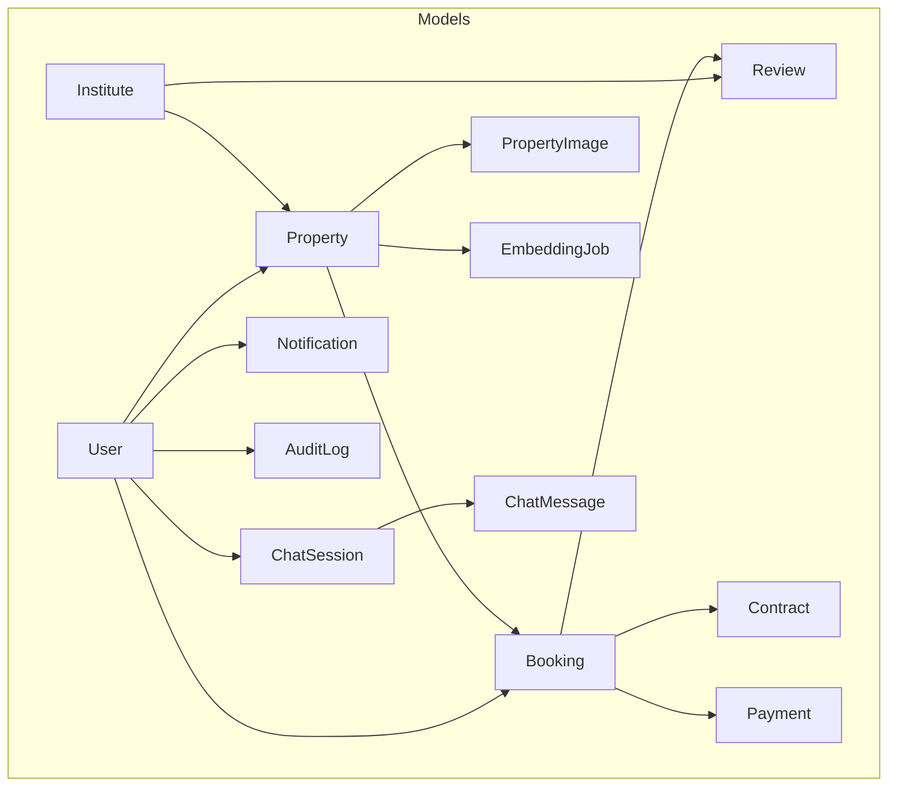
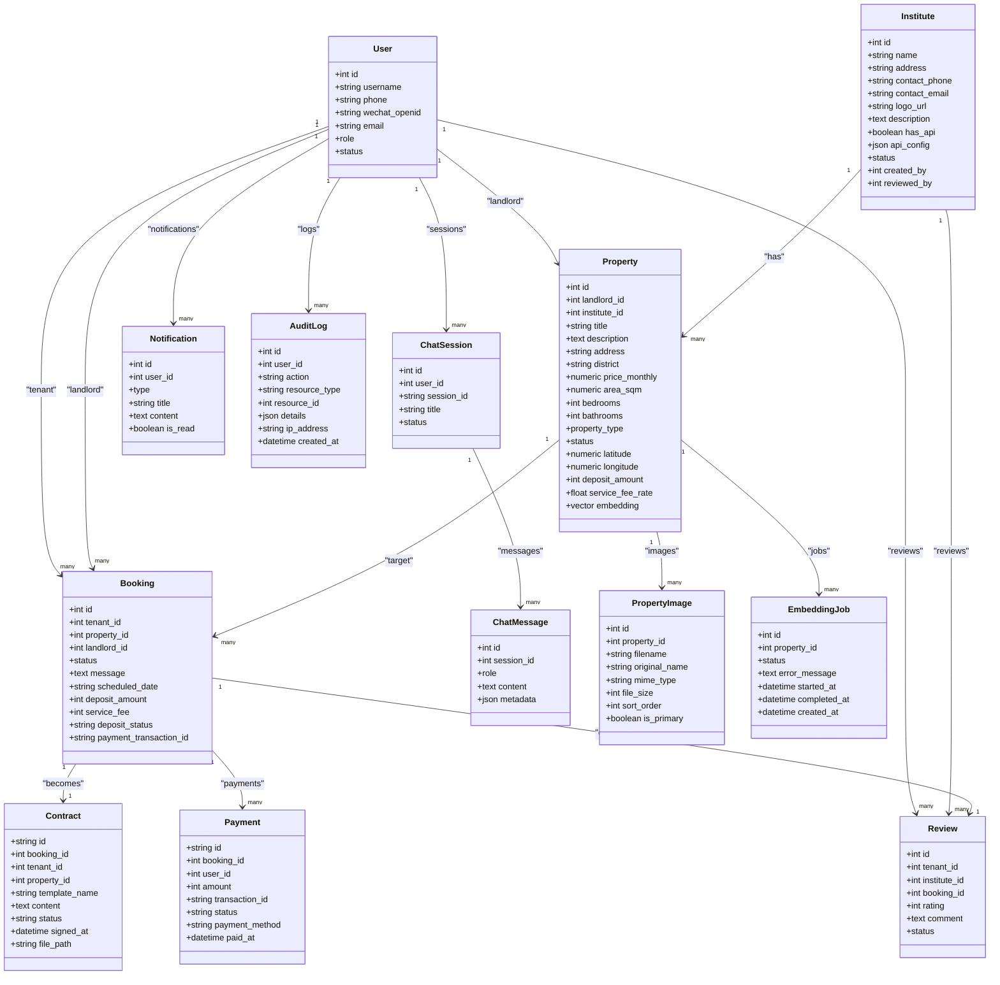
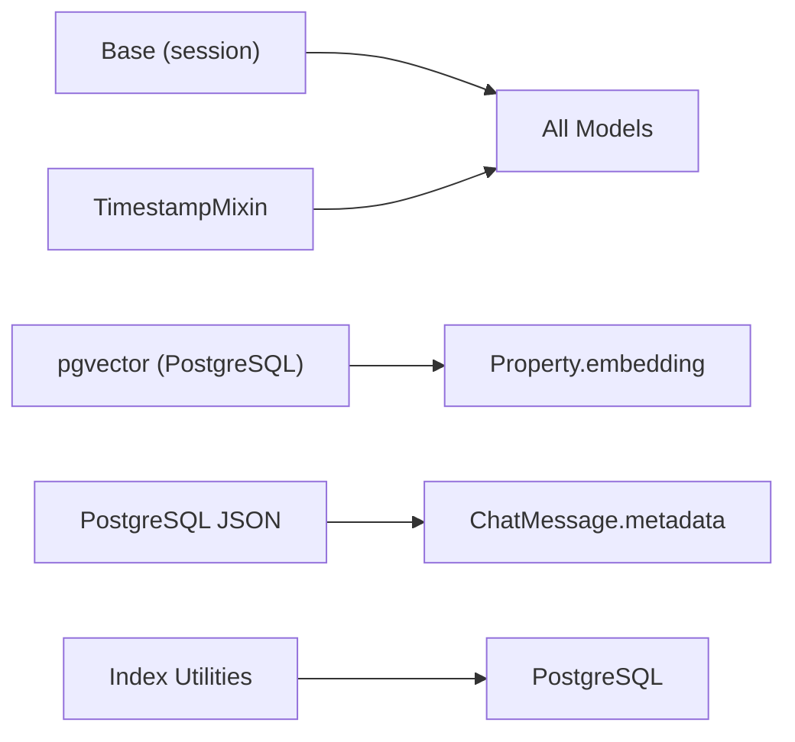

# Database Schema Design

<cite>
**Referenced Files in This Document**
- [user.py](file://backend/app/models/user.py)
- [property.py](file://backend/app/models/property.py)
- [booking.py](file://backend/app/models/booking.py)
- [contract.py](file://backend/app/models/contract.py)
- [payment.py](file://backend/app/models/payment.py)
- [chat.py](file://backend/app/models/chat.py)
- [institute.py](file://backend/app/models/institute.py)
- [property_image.py](file://backend/app/models/property_image.py)
- [notification.py](file://backend/app/models/notification.py)
- [review.py](file://backend/app/models/review.py)
- [embedding_job.py](file://backend/app/models/embedding_job.py)
- [audit_log.py](file://backend/app/models/audit_log.py)
- [mixins.py](file://backend/app/models/mixins.py)
- [indexes.py](file://backend/app/db/indexes.py)
- [base.py](file://backend/app/db/base.py)
- [00-enable-vector.sql](file://docker/pg-init/00-enable-vector.sql)
- [20260617_0001_initial_users_properties.py](file://backend/alembic/versions/20260617_0001_initial_users_properties.py)
- [20260620_0002_pgvector_embedding.py](file://backend/alembic/versions/20260620_0002_pgvector_embedding.py)
- [20260620_0003_property_images.py](file://backend/alembic/versions/20260620_0003_property_images.py)
- [20260620_0004_booking_and_notification.py](file://backend/alembic/versions/20260620_0004_booking_and_notification.py)
- [20260620_0005_embedding_jobs_and_audit_logs.py](file://backend/alembic/versions/20260620_0005_embedding_jobs_and_audit_logs.py)
- [20260622_0006_chat_tables.py](file://backend/alembic/versions/20260622_0006_chat_tables.py)
- [20260622_0007_data_import.py](file://backend/alembic/versions/20260622_0007_data_import.py)
- [20260623_0008_deposit_contract_payment_poi.py](file://backend/alembic/versions/20260623_0008_deposit_contract_payment_poi.py)
- [20260624_0009_extend_notification_type_enum.py](file://backend/alembic/versions/20260624_0009_extend_notification_type_enum.py)
- [20260626_0010_institutes_v15_v2.py](file://backend/alembic/versions/20260626_0010_institutes_v15_v2.py)
- [5ac4aa5f38f4_merge_migration_heads_after_ui_branch_.py](file://backend/alembic/versions/5ac4aa5f38f4_merge_migration_heads_after_ui_branch_.py)
</cite>

## Table of Contents
1. Introduction
2. Project Structure
3. Core Components
4. Architecture Overview
5. Detailed Component Analysis
6. Dependency Analysis
7. Performance Considerations
8. Troubleshooting Guide
9. Conclusion
10. Appendices

## Introduction
This document provides comprehensive data model documentation for the Rental Housing Structure database schema. It details entity relationships, field definitions, and data types for major models including User, Property, Booking, Contract, Payment, Chat, and supporting entities. It also documents primary/foreign keys, indexes, constraints, database-specific optimizations (including pgvector embedding columns), validation rules, referential integrity policies, data access patterns, caching strategies, query optimization techniques, lifecycle management, retention/archival rules, migration paths using Alembic, rollback procedures, security considerations, privacy requirements, access control mechanisms, sample data structures, and common query patterns.

## Project Structure
The relational schema is defined via SQLAlchemy ORM models under backend/app/models, with shared base classes and mixins under backend/app/db and backend/app/models. Indexing utilities for PostgreSQL and pgvector are provided under backend/app/db/indexes.py. The vector extension initialization script is located under docker/pg-init. Alembic migrations reside under backend/alembic/versions.



**Diagram sources**
- [user.py:24-48](file://backend/app/models/user.py#L24-L48)
- [property.py:38-86](file://backend/app/models/property.py#L38-L86)
- [booking.py:18-47](file://backend/app/models/booking.py#L18-L47)
- [contract.py:12-37](file://backend/app/models/contract.py#L12-L37)
- [payment.py:11-34](file://backend/app/models/payment.py#L11-L34)
- [chat.py:23-62](file://backend/app/models/chat.py#L23-L62)
- [institute.py:16-48](file://backend/app/models/institute.py#L16-L48)
- [property_image.py:8-23](file://backend/app/models/property_image.py#L8-23)
- [notification.py:20-36](file://backend/app/models/notification.py#L20-36)
- [review.py:17-41](file://backend/app/models/review.py#L17-41)
- [embedding_job.py:17-35](file://backend/app/models/embedding_job.py#L17-35)
- [audit_log.py:10-25](file://backend/app/models/audit_log.py#L10-25)

**Section sources**
- [base.py:1-35](file://backend/app/db/base.py#L1-35)
- [indexes.py:1-118](file://backend/app/db/indexes.py#L1-118)
- [00-enable-vector.sql](file://docker/pg-init/00-enable-vector.sql)

## Core Components
This section summarizes the core entities, their fields, types, constraints, and relationships.

- User
  - Purpose: Represents tenants, landlords, BD managers, and system administrators.
  - Key fields: id (int PK), username (string unique), password_hash (string nullable), phone (string unique), wechat_openid (string unique), email (string unique), role (enum), status (enum).
  - Relationships: owns many Properties; referenced by Bookings, Contracts, Payments, Notifications, AuditLogs, Institutes.
  - Constraints: unique on username, phone, wechat_openid, email; non-null role/status with defaults.
  - Section sources
    - [user.py:24-48](file://backend/app/models/user.py#L24-L48)

- Property
  - Purpose: Rental property listings with location, pricing, and attributes.
  - Key fields: id (int PK), landlord_id (FK to users), institute_id (FK to institutes nullable), title, description, address, district, price_monthly (numeric), area_sqm (numeric nullable), bedrooms, bathrooms, property_type (enum), status (enum), latitude/longitude (numeric), deposit_amount (int nullable), service_fee_rate (float nullable), embedding (pgvector vector(1536) via TypeDecorator).
  - Constraints: check constraints for non-negative price, positive area, non-negative bedrooms/bathrooms; composite index on district+status; FKs with ondelete cascade/set null.
  - Relationships: belongs to a Landlord (User) and Institute; has many PropertyImages; linked to Bookings, Contracts, Reviews, EmbeddingJobs.
  - Section sources
    - [property.py:12-86](file://backend/app/models/property.py#L12-L86)

- Booking
  - Purpose: Tenant’s interest or reservation for a Property, managed by Landlord.
  - Key fields: id (int PK), tenant_id (FK to users), property_id (FK to properties), landlord_id (FK to users), status (enum), message (text nullable), scheduled_date (string nullable), deposit_amount (int nullable), service_fee (int nullable), deposit_status (string default unpaid), payment_transaction_id (string nullable).
  - Relationships: links User (tenant), Property, and User (landlord); one-to-one Contract; many Payments; optional Review.
  - Section sources
    - [booking.py:18-47](file://backend/app/models/booking.py#L18-L47)

- Contract
  - Purpose: Lease contract associated with an approved Booking.
  - Key fields: id (string UUID PK), booking_id (FK to bookings unique), tenant_id (FK to users), property_id (FK to properties), template_name (string default standard_lease), content (text), status (string default draft), signed_at (datetime timezone nullable), file_path (string nullable).
  - Relationships: references Booking, User (tenant), Property.
  - Section sources
    - [contract.py:12-37](file://backend/app/models/contract.py#L12-L37)

- Payment
  - Purpose: Records payments related to Bookings (e.g., deposit/service fee).
  - Key fields: id (string UUID PK), booking_id (FK to bookings), user_id (FK to users), amount (int), transaction_id (string nullable), status (string default pending), payment_method (string default wechat_pay), paid_at (datetime timezone nullable).
  - Relationships: references Booking and User.
  - Section sources
    - [payment.py:11-34](file://backend/app/models/payment.py#L11-L34)

- Chat
  - Entities: ChatSession and ChatMessage.
  - ChatSession key fields: id (int PK), user_id (FK to users), session_id (string unique), title (string nullable), status (enum active/closed).
  - ChatMessage key fields: id (int PK), session_id (FK to chat_sessions), role (enum user/assistant/system), content (text), metadata (JSON nullable).
  - Relationships: Session belongs to a User; Messages belong to a Session.
  - Section sources
    - [chat.py:23-62](file://backend/app/models/chat.py#L23-L62)

- Supporting Entities
  - Institute: apartment management organization; fields include name, address, contact info, logo_url, description, has_api, api_config (JSON), status (enum), created_by/reviewed_by (FK to users).
  - PropertyImage: images for a Property; fields include filename (unique), original_name, mime_type, file_size, sort_order, is_primary.
  - Notification: per-user notifications with type enum, title, content, is_read.
  - Review: tenant review of Institute; fields include rating, comment, status (enum), optional unique booking_id.
  - EmbeddingJob: async job tracking for generating embeddings for Property; fields include status, error_message, timestamps.
  - AuditLog: audit trail with action, resource_type, resource_id, details (JSON), ip_address.
  - Section sources
    - [institute.py:16-48](file://backend/app/models/institute.py#L16-L48)
    - [property_image.py:8-23](file://backend/app/models/property_image.py#L8-23)
    - [notification.py:20-36](file://backend/app/models/notification.py#L20-36)
    - [review.py:17-41](file://backend/app/models/review.py#L17-41)
    - [embedding_job.py:17-35](file://backend/app/models/embedding_job.py#L17-35)
    - [audit_log.py:10-25](file://backend/app/models/audit_log.py#L10-25)

- Shared Mixins
  - TimestampMixin: adds created_at and updated_at with server defaults and auto-update behavior.
  - Section sources
    - [mixins.py:7-19](file://backend/app/models/mixins.py#L7-19)

## Architecture Overview
The schema centers around Users and Properties, with Bookings bridging tenants and landlords to properties. Contracts formalize approved bookings, while Payments record financial transactions. Chat supports messaging between users. Supporting tables manage media, reviews, notifications, audits, and AI embedding jobs.

```mermaid
erDiagram
USERS {
int id PK
string username UK
string phone UK
string wechat_openid UK
string email UK
enum role
enum status
}
INSTITUTES {
int id PK
string name
string address
string contact_phone
string contact_email
string logo_url
text description
boolean has_api
json api_config
enum status
int created_by FK
int reviewed_by FK
}
PROPERTIES {
int id PK
int landlord_id FK
int institute_id FK
string title
text description
string address
string district
numeric price_monthly
numeric area_sqm
int bedrooms
int bathrooms
enum property_type
enum status
numeric latitude
numeric longitude
int deposit_amount
float service_fee_rate
vector embedding
}
PROPERTY_IMAGES {
int id PK
int property_id FK
string filename UK
string original_name
string mime_type
int file_size
int sort_order
boolean is_primary
}
BOOKINGS {
int id PK
int tenant_id FK
int property_id FK
int landlord_id FK
enum status
text message
string scheduled_date
int deposit_amount
int service_fee
string deposit_status
string payment_transaction_id
}
CONTRACTS {
string id PK
int booking_id UK FK
int tenant_id FK
int property_id FK
string template_name
text content
string status
datetime signed_at
string file_path
}
PAYMENTS {
string id PK
int booking_id FK
int user_id FK
int amount
string transaction_id
string status
string payment_method
datetime paid_at
}
CHAT_SESSIONS {
int id PK
int user_id FK
string session_id UK
string title
enum status
}
CHAT_MESSAGES {
int id PK
int session_id FK
enum role
text content
json metadata
}
NOTIFICATIONS {
int id PK
int user_id FK
enum type
string title
text content
boolean is_read
}
REVIEWS {
int id PK
int tenant_id FK
int institute_id FK
int booking_id UK FK
int rating
text comment
enum status
}
EMBEDDING_JOBS {
int id PK
int property_id FK
enum status
text error_message
datetime started_at
datetime completed_at
datetime created_at
}
AUDIT_LOGS {
int id PK
int user_id FK
string action
string resource_type
int resource_id
json details
string ip_address
datetime created_at
}
USERS ||--o{ PROPERTIES : "owns"
INSTITUTES ||--o{ PROPERTIES : "has"
PROPERTIES ||--o{ PROPERTY_IMAGES : "has"
USERS ||--o{ BOOKINGS : "as tenant"
USERS ||--o{ BOOKINGS : "as landlord"
PROPERTIES ||--o{ BOOKINGS : "target"
BOOKINGS ||--|| CONTRACTS : "becomes"
BOOKINGS ||--o{ PAYMENTS : "has"
USERS ||--o{ CHAT_SESSIONS : "owns"
CHAT_SESSIONS ||--o{ CHAT_MESSAGES : "contains"
USERS ||--o{ NOTIFICATIONS : "receives"
USERS ||--o{ REVIEWS : "writes"
INSTITUTES ||--o{ REVIEWS : "receives"
BOOKINGS ||--|| REVIEWS : "optional"
PROPERTIES ||--o{ EMBEDDING_JOBS : "triggers"
USERS ||--o{ AUDIT_LOGS : "performed_by"
```

**Diagram sources**
- [user.py:24-48](file://backend/app/models/user.py#L24-L48)
- [institute.py:16-48](file://backend/app/models/institute.py#L16-L48)
- [property.py:38-86](file://backend/app/models/property.py#L38-L86)
- [property_image.py:8-23](file://backend/app/models/property_image.py#L8-23)
- [booking.py:18-47](file://backend/app/models/booking.py#L18-L47)
- [contract.py:12-37](file://backend/app/models/contract.py#L12-L37)
- [payment.py:11-34](file://backend/app/models/payment.py#L11-L34)
- [chat.py:23-62](file://backend/app/models/chat.py#L23-L62)
- [notification.py:20-36](file://backend/app/models/notification.py#L20-36)
- [review.py:17-41](file://backend/app/models/review.py#L17-41)
- [embedding_job.py:17-35](file://backend/app/models/embedding_job.py#L17-35)
- [audit_log.py:10-25](file://backend/app/models/audit_log.py#L10-25)

## Detailed Component Analysis

### User Model
- Primary key: id (int, indexed).
- Unique constraints: username, phone, wechat_openid, email.
- Enums: role (tenant, landlord, bd_manager, admin), status (active, disabled, deleted).
- Relationships:
  - One-to-many with Property (landlord).
  - Referenced by Booking (tenant_id and landlord_id), Contract (tenant_id), Payment (user_id), Notification (user_id), AuditLog (user_id), Institute (created_by/reviewed_by).
- Validation:
  - Non-null role/status with defaults.
  - Uniqueness enforced at DB level.
- Section sources
  - [user.py:24-48](file://backend/app/models/user.py#L24-L48)

### Property Model
- Primary key: id (int, indexed).
- Foreign keys:
  - landlord_id -> users.id (ondelete CASCADE).
  - institute_id -> institutes.id (ondelete SET NULL).
- Check constraints:
  - price_monthly >= 0.
  - area_sqm IS NULL OR area_sqm > 0.
  - bedrooms >= 0.
  - bathrooms >= 0.
- Composite index: district + status.
- Enum fields: property_type (apartment, house, studio, shared), status (available, rented, maintenance, offline).
- Numeric fields: price_monthly (Numeric(12,2)), area_sqm (Numeric(8,2)), latitude/longitude (Numeric(9,6)).
- pgvector embedding: VectorColumn maps to PostgreSQL vector(1536) when dialect is postgresql; fallback to text otherwise.
- Relationships:
  - Many-to-one with User (landlord).
  - Many-to-one with Institute.
  - One-to-many with PropertyImage.
  - Referenced by Booking, Contract, Review, EmbeddingJob.
- Section sources
  - [property.py:12-86](file://backend/app/models/property.py#L12-L86)

### Booking Model
- Primary key: id (int, indexed).
- Foreign keys:
  - tenant_id -> users.id (CASCADE).
  - property_id -> properties.id (CASCADE).
  - landlord_id -> users.id (CASCADE).
- Enum: status (pending, approved, rejected, cancelled, completed).
- Additional fields: message (text), scheduled_date (string), deposit_amount (int), service_fee (int), deposit_status (string default unpaid), payment_transaction_id (string).
- Relationships:
  - Links to User (tenant and landlord) and Property.
  - One-to-one Contract.
  - One-to-many Payments.
  - Optional one-to-one Review.
- Section sources
  - [booking.py:18-47](file://backend/app/models/booking.py#L18-L47)

### Contract Model
- Primary key: id (string UUID).
- Unique constraint: booking_id (one contract per booking).
- Foreign keys:
  - booking_id -> bookings.id (CASCADE).
  - tenant_id -> users.id (CASCADE).
  - property_id -> properties.id (CASCADE).
- Fields: template_name (default standard_lease), content (text), status (string default draft), signed_at (datetime tz), file_path (string).
- Relationships:
  - References Booking, User (tenant), Property.
- Section sources
  - [contract.py:12-37](file://backend/app/models/contract.py#L12-L37)

### Payment Model
- Primary key: id (string UUID).
- Foreign keys:
  - booking_id -> bookings.id (CASCADE).
  - user_id -> users.id (CASCADE).
- Fields: amount (int), transaction_id (string), status (string default pending), payment_method (string default wechat_pay), paid_at (datetime tz).
- Relationships:
  - References Booking and User.
- Section sources
  - [payment.py:11-34](file://backend/app/models/payment.py#L11-L34)

### Chat Models
- ChatSession
  - Primary key: id (int, indexed).
  - Unique: session_id (string).
  - Foreign key: user_id -> users.id (CASCADE).
  - Enum: status (active, closed).
- ChatMessage
  - Primary key: id (int, indexed).
  - Foreign key: session_id -> chat_sessions.id (CASCADE).
  - Enum: role (user, assistant, system).
  - JSON: metadata.
- Relationships:
  - Session belongs to User; Messages belong to Session.
- Section sources
  - [chat.py:23-62](file://backend/app/models/chat.py#L23-L62)

### Supporting Models
- Institute
  - Fields: name, address, contact_phone, contact_email, logo_url, description, has_api, api_config (JSON), status (enum), created_by/reviewed_by (FK to users).
  - Relationships: one-to-many with Property and Review.
  - Section sources
    - [institute.py:16-48](file://backend/app/models/institute.py#L16-L48)

- PropertyImage
  - Fields: filename (unique), original_name, mime_type, file_size, sort_order, is_primary.
  - FK: property_id -> properties.id (CASCADE).
  - Section sources
    - [property_image.py:8-23](file://backend/app/models/property_image.py#L8-23)

- Notification
  - Fields: type (enum), title, content (text), is_read (boolean).
  - FK: user_id -> users.id (CASCADE).
  - Section sources
    - [notification.py:20-36](file://backend/app/models/notification.py#L20-36)

- Review
  - Fields: rating (int), comment (text), status (enum), booking_id (unique, FK to bookings on delete set null).
  - FKs: tenant_id -> users.id (CASCADE), institute_id -> institutes.id (CASCADE).
  - Section sources
    - [review.py:17-41](file://backend/app/models/review.py#L17-41)

- EmbeddingJob
  - Fields: property_id (FK to properties), status (enum), error_message (text), started_at/completed_at/created_at (datetime tz).
  - Section sources
    - [embedding_job.py:17-35](file://backend/app/models/embedding_job.py#L17-35)

- AuditLog
  - Fields: user_id (FK to users on delete set null), action (string), resource_type (string), resource_id (int), details (JSON), ip_address (string), created_at (datetime tz).
  - Section sources
    - [audit_log.py:10-25](file://backend/app/models/audit_log.py#L10-25)

- TimestampMixin
  - Adds created_at and updated_at with server defaults and auto-updates.
  - Section sources
    - [mixins.py:7-19](file://backend/app/models/mixins.py#L7-19)

#### Class Diagram (Core Entities)


**Diagram sources**
- [user.py:24-48](file://backend/app/models/user.py#L24-L48)
- [property.py:38-86](file://backend/app/models/property.py#L38-L86)
- [booking.py:18-47](file://backend/app/models/booking.py#L18-L47)
- [contract.py:12-37](file://backend/app/models/contract.py#L12-L37)
- [payment.py:11-34](file://backend/app/models/payment.py#L11-L34)
- [chat.py:23-62](file://backend/app/models/chat.py#L23-L62)
- [institute.py:16-48](file://backend/app/models/institute.py#L16-L48)
- [property_image.py:8-23](file://backend/app/models/property_image.py#L8-23)
- [notification.py:20-36](file://backend/app/models/notification.py#L20-36)
- [review.py:17-41](file://backend/app/models/review.py#L17-41)
- [embedding_job.py:17-35](file://backend/app/models/embedding_job.py#L17-35)
- [audit_log.py:10-25](file://backend/app/models/audit_log.py#L10-25)

## Dependency Analysis
- Direct dependencies:
  - All models depend on Base from app.db.session and TimestampMixin for common timestamp fields.
  - Property depends on pgvector via a custom TypeDecorator that selects Vector(1536) on PostgreSQL.
  - Chat uses PostgreSQL JSON for metadata.
- Indexing and performance:
  - Custom index creation utilities provide IVFFlat indexing for embeddings and composite indexes for bookings.
- Section sources
  - [base.py:1-35](file://backend/app/db/base.py#L1-35)
  - [property.py:12-22](file://backend/app/models/property.py#L12-L22)
  - [indexes.py:16-88](file://backend/app/db/indexes.py#L16-L88)



**Diagram sources**
- [base.py:1-35](file://backend/app/db/base.py#L1-35)
- [mixins.py:7-19](file://backend/app/models/mixins.py#L7-19)
- [property.py:12-22](file://backend/app/models/property.py#L12-L22)
- [chat.py:57-59](file://backend/app/models/chat.py#L57-L59)
- [indexes.py:16-88](file://backend/app/db/indexes.py#L16-L88)

## Performance Considerations
- pgvector indexing:
  - IVFFlat index on properties.embedding with adaptive lists parameter based on sqrt(row_count).
  - If fewer than 1000 rows with embeddings, exact scan is preferred and IVFFlat index is skipped.
- Composite indexes:
  - ix_bookings_tenant_status, ix_bookings_landlord_status, ix_bookings_property_status optimize frequent queries by tenant/landlord/property and status.
- EXPLAIN ANALYZE utilities:
  - Provided to analyze execution plans for common queries.
- Section sources
  - [indexes.py:16-118](file://backend/app/db/indexes.py#L16-L118)

## Troubleshooting Guide
- Common issues:
  - Missing pgvector extension: ensure the extension is enabled during container initialization.
  - IVFFlat index not created: verify row count threshold and existing index checks.
  - Booking composite indexes missing: run index creation utility to create if absent.
- Diagnostic steps:
  - Use EXPLAIN ANALYZE helpers to inspect query plans.
  - Confirm foreign key cascades behave as expected on deletes.
- Section sources
  - [00-enable-vector.sql](file://docker/pg-init/00-enable-vector.sql)
  - [indexes.py:16-118](file://backend/app/db/indexes.py#L16-L118)

## Conclusion
The schema provides a robust foundation for rental housing operations with clear entity relationships, strong referential integrity, and performance-oriented indexing. The use of enums, check constraints, and unique constraints ensures data quality. pgvector integration enables semantic search over property descriptions. Alembic migrations support versioned evolution, and index utilities maintain performance as data grows.

## Appendices

### Data Validation Rules and Business Constraints
- Non-negative price and positive area for properties.
- Non-negative bedrooms and bathrooms.
- Default values for roles, statuses, and payment methods.
- Unique identifiers for usernames, contacts, and sessions.
- Enforced via DB-level constraints and ORM mappings.
- Section sources
  - [property.py:40-46](file://backend/app/models/property.py#L40-L46)
  - [user.py:33-42](file://backend/app/models/user.py#L33-L42)
  - [payment.py:25-30](file://backend/app/models/payment.py#L25-L30)

### Referential Integrity Policies
- On delete behaviors:
  - CASCADE for most child records (bookings, contracts, payments, images, messages).
  - SET NULL for optional associations (institute_id, reviewed_by, booking_id in review).
  - RESTRICT for institute creator to prevent deletion while referenced.
- Section sources
  - [property.py:49-51](file://backend/app/models/property.py#L49-L51)
  - [institute.py:33-38](file://backend/app/models/institute.py#L33-L38)
  - [review.py:27-29](file://backend/app/models/review.py#L27-L29)

### Data Access Patterns and Query Optimization
- Frequent filters:
  - Properties by district and status (composite index).
  - Bookings by tenant/landlord/property and status (composite indexes).
- Vector similarity search:
  - Uses pgvector with IVFFlat index for approximate nearest neighbor retrieval.
- Section sources
  - [property.py:45](file://backend/app/models/property.py#L45)
  - [indexes.py:51-82](file://backend/app/db/indexes.py#L51-L82)
  - [indexes.py:16-48](file://backend/app/db/indexes.py#L16-L48)

### Caching Strategies
- Application-level caching recommendations:
  - Cache property listings filtered by district/status.
  - Cache user profiles and institute details.
  - Cache notification counts per user.
- Note: These are general guidance; no explicit cache layer is present in the referenced files.

### Data Lifecycle Management, Retention, and Archival
- Lifecycle:
  - Users can be soft-deleted via status enum.
  - Bookings transition through states; contracts become final upon signing.
  - Payments track lifecycle with status and paid_at timestamps.
- Retention/archival:
  - No explicit archival logic in models; consider periodic archiving of old audit logs and notifications.
  - Implement background tasks to move historical data to archive tables.

### Migration Paths Using Alembic
- Migrations overview:
  - Initial users and properties.
  - pgvector embedding column addition.
  - Property images table.
  - Bookings and notifications.
  - Embedding jobs and audit logs.
  - Chat tables.
  - Data import.
  - Deposit, contract, payment, POI enhancements.
  - Notification type enum extension.
  - Institutes v15/v2 updates.
  - Merge migration heads after UI branch.
- Version management strategy:
  - Each change is a separate migration file with descriptive names.
  - Use merge migrations to reconcile divergent branches.
- Rollback procedures:
  - Use Alembic downgrade commands to revert specific versions.
  - Ensure idempotent index creation and safe DDL changes.
- Section sources
  - [20260617_0001_initial_users_properties.py](file://backend/alembic/versions/20260617_0001_initial_users_properties.py)
  - [20260620_0002_pgvector_embedding.py](file://backend/alembic/versions/20260620_0002_pgvector_embedding.py)
  - [20260620_0003_property_images.py](file://backend/alembic/versions/20260620_0003_property_images.py)
  - [20260620_0004_booking_and_notification.py](file://backend/alembic/versions/20260620_0004_booking_and_notification.py)
  - [20260620_0005_embedding_jobs_and_audit_logs.py](file://backend/alembic/versions/20260620_0005_embedding_jobs_and_audit_logs.py)
  - [20260622_0006_chat_tables.py](file://backend/alembic/versions/20260622_0006_chat_tables.py)
  - [20260622_0007_data_import.py](file://backend/alembic/versions/20260622_0007_data_import.py)
  - [20260623_0008_deposit_contract_payment_poi.py](file://backend/alembic/versions/20260623_0008_deposit_contract_payment_poi.py)
  - [20260624_0009_extend_notification_type_enum.py](file://backend/alembic/versions/20260624_0009_extend_notification_type_enum.py)
  - [20260626_0010_institutes_v15_v2.py](file://backend/alembic/versions/20260626_0010_institutes_v15_v2.py)
  - [5ac4aa5f38f4_merge_migration_heads_after_ui_branch_.py](file://backend/alembic/versions/5ac4aa5f38f4_merge_migration_heads_after_ui_branch_.py)

### Security, Privacy, and Access Control
- Security considerations:
  - Password hashes stored securely (field exists; hashing handled elsewhere).
  - Sensitive identifiers (phone, wechat_openid, email) are unique and indexed.
  - Audit logs capture actions, IPs, and details for accountability.
- Privacy requirements:
  - Minimize exposure of personal data; enforce least privilege access.
  - Anonymize or redact sensitive fields in logs where appropriate.
- Access control mechanisms:
  - Role-based access via UserRole enum.
  - Status-based controls (active/disabled/deleted).
  - FK restrictions (RESTRICT on institute creator) to prevent accidental deletions.
- Section sources
  - [user.py:27-42](file://backend/app/models/user.py#L27-L42)
  - [audit_log.py:14-24](file://backend/app/models/audit_log.py#L14-L24)
  - [institute.py:33-38](file://backend/app/models/institute.py#L33-L38)

### Sample Data Structures and Common Query Patterns
- Sample structures:
  - User: id, username, role=tenant, status=active.
  - Property: district="Changning", status="available", price_monthly=3000.
  - Booking: tenant_id, property_id, landlord_id, status="pending".
  - Contract: booking_id, status="draft", content="<lease terms>".
  - Payment: booking_id, amount=deposit, status="pending", payment_method="wechat_pay".
  - ChatSession: user_id, session_id, status="active".
  - ChatMessage: session_id, role="user", content="<message>".
- Common queries:
  - List available properties in a district ordered by newest.
  - Fetch tenant bookings filtered by status.
  - Fetch landlord bookings filtered by status.
  - Retrieve chat messages for a session.
  - Generate property embeddings and perform similarity search.
- Section sources
  - [indexes.py:102-117](file://backend/app/db/indexes.py#L102-L117)
  - [chat.py:40-62](file://backend/app/models/chat.py#L40-L62)