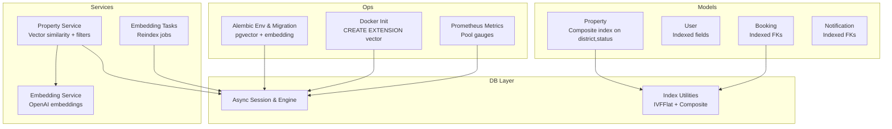
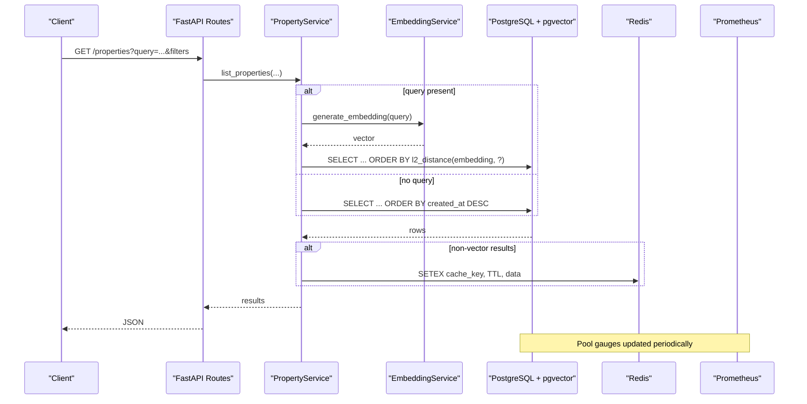
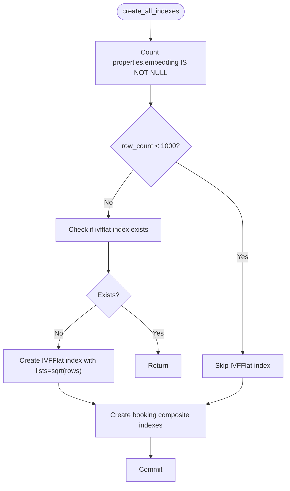
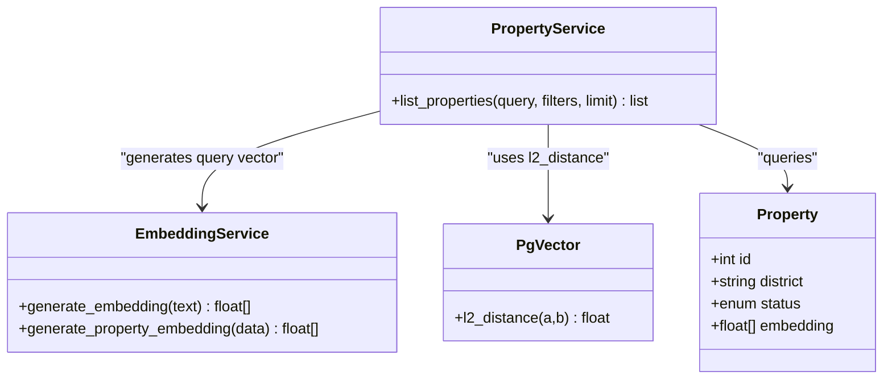
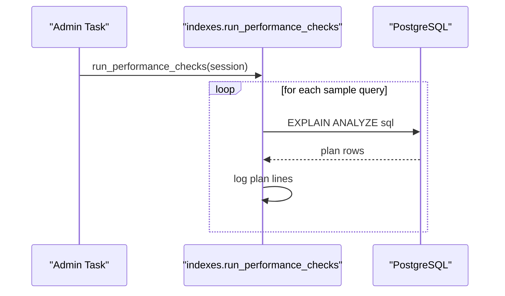
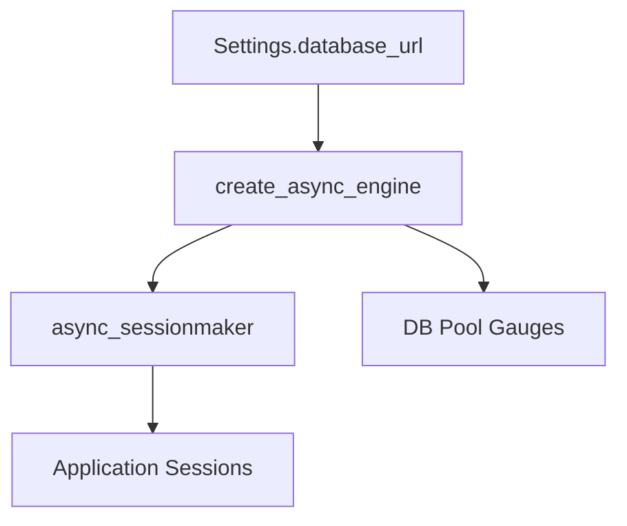
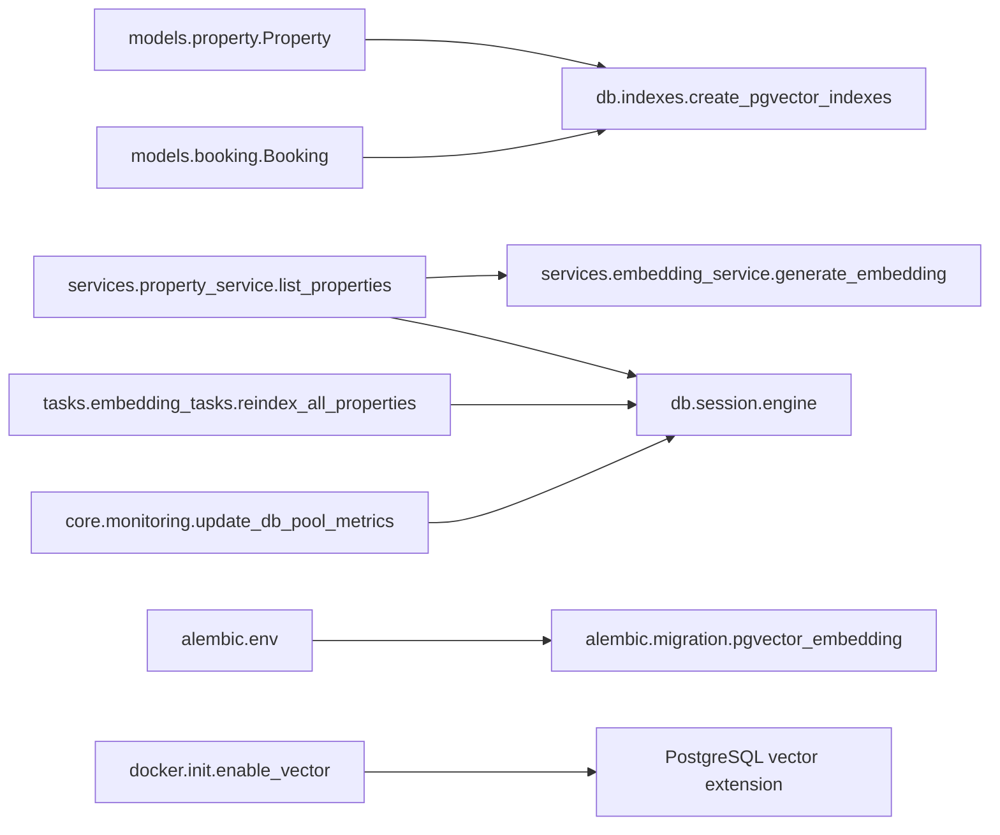

# Index Optimization & Performance Tuning

<cite>
**Referenced Files in This Document**
- [indexes.py](file://backend/app/db/indexes.py)
- [property.py](file://backend/app/models/property.py)
- [user.py](file://backend/app/models/user.py)
- [booking.py](file://backend/app/models/booking.py)
- [notification.py](file://backend/app/models/notification.py)
- [session.py](file://backend/app/db/session.py)
- [config.py](file://backend/app/core/config.py)
- [monitoring.py](file://backend/app/core/monitoring.py)
- [00-enable-vector.sql](file://docker/pg-init/00-enable-vector.sql)
- [20260620_0002_pgvector_embedding.py](file://backend/alembic/versions/20260620_0002_pgvector_embedding.py)
- [env.py](file://backend/alembic/env.py)
- [embedding_service.py](file://backend/app/services/embedding_service.py)
- [property_service.py](file://backend/app/services/property_service.py)
- [embedding_tasks.py](file://backend/app/tasks/embedding_tasks.py)
</cite>

## Table of Contents
1. Introduction
2. Project Structure
3. Core Components
4. Architecture Overview
5. Detailed Component Analysis
6. Dependency Analysis
7. Performance Considerations
8. Troubleshooting Guide
9. Conclusion
10. Appendices

## Introduction
This document provides a comprehensive guide to database index strategies and performance optimization for the PostgreSQL-backed application, with emphasis on:
- Custom indexes defined in the indexes module (composite indexes, adaptive IVFFlat for pgvector)
- pgvector extension setup and vector similarity search optimization using HNSW/IVFFlat
- Query performance monitoring, slow query identification, and execution plan analysis
- Connection pooling configuration and caching strategies
- Database-specific optimizations for PostgreSQL
- Migration best practices, schema versioning with Alembic, and rollback procedures
- Performance benchmarking examples, index selection guidelines, and capacity planning recommendations for production

## Project Structure
The relevant parts of the codebase for indexing and performance are organized as follows:
- Models define table schemas and declarative indexes
- The indexes module creates runtime indexes and runs EXPLAIN ANALYZE checks
- Alembic migrations manage schema evolution including pgvector extension and embedding column/index
- Services implement vector similarity queries and caching
- Monitoring exposes Prometheus metrics and DB pool gauges
- Docker initialization enables the pgvector extension at container start

**Diagram sources**
- [property.py:38-46](file://backend/app/models/property.py#L38-L46)
- [booking.py:18-35](file://backend/app/models/booking.py#L18-L35)
- [indexes.py:16-88](file://backend/app/db/indexes.py#L16-L88)
- [property_service.py:130-195](file://backend/app/services/property_service.py#L130-L195)
- [embedding_service.py:17-32](file://backend/app/services/embedding_service.py#L17-L32)
- [embedding_tasks.py:83-111](file://backend/app/tasks/embedding_tasks.py#L83-L111)
- [session.py:1-14](file://backend/app/db/session.py#L1-L14)
- [monitoring.py:105-126](file://backend/app/core/monitoring.py#L105-L126)
- [env.py:14-17](file://backend/alembic/env.py#L14-L17)
- [20260620_0002_pgvector_embedding.py:21-35](file://backend/alembic/versions/20260620_0002_pgvector_embedding.py#L21-L35)
- [00-enable-vector.sql:1-3](file://docker/pg-init/00-enable-vector.sql#L1-L3)

**Section sources**
- [property.py:38-46](file://backend/app/models/property.py#L38-L46)
- [booking.py:18-35](file://backend/app/models/booking.py#L18-L35)
- [indexes.py:16-88](file://backend/app/db/indexes.py#L16-L88)
- [property_service.py:130-195](file://backend/app/services/property_service.py#L130-L195)
- [embedding_service.py:17-32](file://backend/app/services/embedding_service.py#L17-L32)
- [embedding_tasks.py:83-111](file://backend/app/tasks/embedding_tasks.py#L83-L111)
- [session.py:1-14](file://backend/app/db/session.py#L1-L14)
- [monitoring.py:105-126](file://backend/app/core/monitoring.py#L105-L126)
- [env.py:14-17](file://backend/alembic/env.py#L14-L17)
- [20260620_0002_pgvector_embedding.py:21-35](file://backend/alembic/versions/20260620_0002_pgvector_embedding.py#L21-L35)
- [00-enable-vector.sql:1-3](file://docker/pg-init/00-enable-vector.sql#L1-L3)

## Core Components
- Declarative indexes on models:
  - Property includes a composite index on district and status
  - User and Notification include indexed foreign keys and unique constraints
  - Booking includes indexed foreign keys for tenant_id, landlord_id, property_id
- Runtime index creation:
  - Adaptive IVFFlat index on properties.embedding based on row count
  - Composite indexes for bookings by tenant_id/status, landlord_id/status, property_id/status
- Vector similarity search:
  - EmbeddingService generates OpenAI embeddings
  - PropertyService builds l2_distance queries and applies additional filters
- Monitoring and connection pooling:
  - Async engine and sessionmaker configured from settings
  - Prometheus middleware and DB pool gauges exposed via /metrics
- Migration and extension management:
  - Alembic migration adds vector extension, embedding column, and IVFFlat index
  - Docker init ensures vector extension is enabled

**Section sources**
- [property.py:38-46](file://backend/app/models/property.py#L38-L46)
- [user.py:24-42](file://backend/app/models/user.py#L24-L42)
- [booking.py:18-35](file://backend/app/models/booking.py#L18-L35)
- [notification.py:20-35](file://backend/app/models/notification.py#L20-L35)
- [indexes.py:16-88](file://backend/app/db/indexes.py#L16-L88)
- [embedding_service.py:17-32](file://backend/app/services/embedding_service.py#L17-L32)
- [property_service.py:130-195](file://backend/app/services/property_service.py#L130-L195)
- [session.py:1-14](file://backend/app/db/session.py#L1-L14)
- [monitoring.py:105-126](file://backend/app/core/monitoring.py#L105-L126)
- [20260620_0002_pgvector_embedding.py:21-35](file://backend/alembic/versions/20260620_0002_pgvector_embedding.py#L21-L35)
- [00-enable-vector.sql:1-3](file://docker/pg-init/00-enable-vector.sql#L1-L3)

## Architecture Overview
The system integrates model-level indexes, runtime index utilities, vector similarity search, and observability.

**Diagram sources**
- [property_service.py:130-195](file://backend/app/services/property_service.py#L130-L195)
- [embedding_service.py:17-32](file://backend/app/services/embedding_service.py#L17-L32)
- [monitoring.py:216-226](file://backend/app/core/monitoring.py#L216-L226)

## Detailed Component Analysis

### Index Strategy: Declarative and Runtime
- Declarative composite index on properties(district, status) supports filtered listing by district and status
- Runtime composite indexes on bookings(tenant_id, status), bookings(landlord_id, status), bookings(property_id, status) optimize user-centric booking lists
- Adaptive IVFFlat index on properties.embedding uses sqrt(row_count) lists when row_count >= 1000; otherwise exact scan is preferred

**Diagram sources**
- [indexes.py:16-88](file://backend/app/db/indexes.py#L16-L88)

**Section sources**
- [property.py:38-46](file://backend/app/models/property.py#L38-L46)
- [indexes.py:16-88](file://backend/app/db/indexes.py#L16-L88)

### Vector Similarity Search with pgvector
- Extension enablement:
  - Docker init script ensures CREATE EXTENSION IF NOT EXISTS vector
  - Alembic migration also creates the extension and adds embedding column and IVFFlat index
- Model integration:
  - Property.embedding is a Vector(1536) column via TypeDecorator mapping to pgvector.sqlalchemy.Vector on PostgreSQL
- Query construction:
  - PropertyService computes l2_distance between stored embedding and query embedding, orders by similarity, and applies additional filters (district, price range, bedrooms, type)
- Caching:
  - Non-vector result sets are cached in Redis with TTL to reduce DB load

**Diagram sources**
- [property.py:78-78](file://backend/app/models/property.py#L78-L78)
- [embedding_service.py:17-32](file://backend/app/services/embedding_service.py#L17-L32)
- [property_service.py:130-195](file://backend/app/services/property_service.py#L130-L195)
- [20260620_0002_pgvector_embedding.py:21-35](file://backend/alembic/versions/20260620_0002_pgvector_embedding.py#L21-L35)
- [00-enable-vector.sql:1-3](file://docker/pg-init/00-enable-vector.sql#L1-L3)

**Section sources**
- [00-enable-vector.sql:1-3](file://docker/pg-init/00-enable-vector.sql#L1-L3)
- [20260620_0002_pgvector_embedding.py:21-35](file://backend/alembic/versions/20260620_0002_pgvector_embedding.py#L21-L35)
- [property.py:78-78](file://backend/app/models/property.py#L78-L78)
- [embedding_service.py:17-32](file://backend/app/services/embedding_service.py#L17-L32)
- [property_service.py:130-195](file://backend/app/services/property_service.py#L130-L195)

### HNSW vs IVFFlat for pgvector
- Current implementation uses IVFFlat with adaptive lists parameter tuned by row count
- For high-dimensional vectors and large datasets, HNSW can provide better recall/performance trade-offs
- To adopt HNSW:
  - Add an HNSW index on properties.embedding using hnsw_ops and appropriate m/ef_construction parameters
  - Ensure ef_search is set appropriately per workload
  - Rebuild or create new index alongside existing IVFFlat and evaluate via EXPLAIN ANALYZE and A/B testing

[No sources needed since this section provides general guidance]

### Query Performance Monitoring and Slow Query Identification
- EXPLAIN ANALYZE utility:
  - indexes.check_query_performance logs full execution plans for provided SQL
  - run_performance_checks analyzes representative queries for properties and bookings
- Prometheus metrics:
  - HTTP request counts, latency histograms, and in-flight requests
  - DB pool size, overflow, and checked-out gauges updated periodically

**Diagram sources**
- [indexes.py:91-117](file://backend/app/db/indexes.py#L91-L117)
- [monitoring.py:105-126](file://backend/app/core/monitoring.py#L105-L126)

**Section sources**
- [indexes.py:91-117](file://backend/app/db/indexes.py#L91-L117)
- [monitoring.py:105-126](file://backend/app/core/monitoring.py#L105-L126)

### Connection Pooling Configuration
- Async engine and sessionmaker are created from settings.database_url
- Debug mode toggles echo for SQL logging
- Prometheus gauges expose pool.size(), pool.overflow(), pool.checkedout()

**Diagram sources**
- [session.py:1-14](file://backend/app/db/session.py#L1-L14)
- [monitoring.py:216-226](file://backend/app/core/monitoring.py#L216-L226)

**Section sources**
- [session.py:1-14](file://backend/app/db/session.py#L1-L14)
- [monitoring.py:216-226](file://backend/app/core/monitoring.py#L216-L226)

### Caching Strategies
- Redis-based caching for non-vector property listings with TTL
- Cache key generation and serialization handled in service layer
- Graceful handling of Redis failures without impacting core functionality

**Section sources**
- [property_service.py:170-195](file://backend/app/services/property_service.py#L170-L195)

### Database-Specific Optimizations for PostgreSQL
- Enable pgvector extension at startup (Docker init) and via Alembic
- Use IVFFlat with adaptive lists for vector similarity
- Composite indexes for frequent filter patterns (e.g., district+status, user+status)
- Leverage EXPLAIN ANALYZE for iterative tuning

**Section sources**
- [00-enable-vector.sql:1-3](file://docker/pg-init/00-enable-vector.sql#L1-L3)
- [20260620_0002_pgvector_embedding.py:21-35](file://backend/alembic/versions/20260620_0002_pgvector_embedding.py#L21-L35)
- [indexes.py:16-88](file://backend/app/db/indexes.py#L16-L88)

### Migration Best Practices, Schema Versioning, and Rollbacks
- Alembic env configures SQLAlchemy URL from settings.alembic_database_url and targets Base.metadata
- Migration 20260620_0002:
  - Creates vector extension
  - Adds embedding column to properties
  - Creates IVFFlat index on embedding
- Rollback procedure:
  - Downgrade drops the IVFFlat index and removes the embedding column
- Recommended practices:
  - Keep migrations idempotent where possible
  - Test downgrades in staging
  - Back up before applying schema changes in production

**Section sources**
- [env.py:14-17](file://backend/alembic/env.py#L14-L17)
- [20260620_0002_pgvector_embedding.py:21-40](file://backend/alembic/versions/20260620_0002_pgvector_embedding.py#L21-L40)

### Performance Benchmarking Examples
- Use indexes.check_query_performance to analyze representative queries
- Run indexes.run_performance_checks to evaluate common access patterns
- Compare execution plans before and after index changes
- Monitor DB pool gauges under load to detect saturation

**Section sources**
- [indexes.py:91-117](file://backend/app/db/indexes.py#L91-L117)
- [monitoring.py:105-126](file://backend/app/core/monitoring.py#L105-L126)

### Index Selection Guidelines
- Prefer composite indexes matching the most selective leading columns in WHERE clauses
- For vector similarity:
  - Use IVFFlat with lists ≈ sqrt(row_count) for moderate datasets
  - Consider HNSW for larger datasets requiring higher recall/performance
- Avoid redundant indexes that overlap with existing composites

**Section sources**
- [indexes.py:16-88](file://backend/app/db/indexes.py#L16-L88)

### Capacity Planning Recommendations
- Scale DB connections based on observed pool.size() and pool.checkedout()
- Tune pgvector index parameters (lists for IVFFlat, m/ef_construction for HNSW) according to dataset size and query latency targets
- Cache frequently accessed non-vector results to reduce DB pressure
- Monitor Prometheus metrics and set alerts for pool overflow and high latency

[No sources needed since this section provides general guidance]

## Dependency Analysis
Key dependencies among components related to indexing and performance:

**Diagram sources**
- [property.py:38-46](file://backend/app/models/property.py#L38-L46)
- [booking.py:18-35](file://backend/app/models/booking.py#L18-L35)
- [indexes.py:16-88](file://backend/app/db/indexes.py#L16-L88)
- [property_service.py:130-195](file://backend/app/services/property_service.py#L130-L195)
- [embedding_service.py:17-32](file://backend/app/services/embedding_service.py#L17-L32)
- [embedding_tasks.py:83-111](file://backend/app/tasks/embedding_tasks.py#L83-L111)
- [session.py:1-14](file://backend/app/db/session.py#L1-L14)
- [monitoring.py:216-226](file://backend/app/core/monitoring.py#L216-L226)
- [env.py:14-17](file://backend/alembic/env.py#L14-L17)
- [20260620_0002_pgvector_embedding.py:21-35](file://backend/alembic/versions/20260620_0002_pgvector_embedding.py#L21-L35)
- [00-enable-vector.sql:1-3](file://docker/pg-init/00-enable-vector.sql#L1-L3)

**Section sources**
- [property.py:38-46](file://backend/app/models/property.py#L38-L46)
- [booking.py:18-35](file://backend/app/models/booking.py#L18-L35)
- [indexes.py:16-88](file://backend/app/db/indexes.py#L16-L88)
- [property_service.py:130-195](file://backend/app/services/property_service.py#L130-L195)
- [embedding_service.py:17-32](file://backend/app/services/embedding_service.py#L17-L32)
- [embedding_tasks.py:83-111](file://backend/app/tasks/embedding_tasks.py#L83-L111)
- [session.py:1-14](file://backend/app/db/session.py#L1-L14)
- [monitoring.py:216-226](file://backend/app/core/monitoring.py#L216-L226)
- [env.py:14-17](file://backend/alembic/env.py#L14-L17)
- [20260620_0002_pgvector_embedding.py:21-35](file://backend/alembic/versions/20260620_0002_pgvector_embedding.py#L21-L35)
- [00-enable-vector.sql:1-3](file://docker/pg-init/00-enable-vector.sql#L1-L3)

## Performance Considerations
- Choose index order carefully: place the most selective columns first in composite indexes
- For vector similarity, ensure the embedding dimension matches the model used (1536)
- Use EXPLAIN ANALYZE iteratively to validate index effectiveness
- Monitor DB pool utilization and adjust pool sizes accordingly
- Cache read-heavy endpoints to reduce DB load

[No sources needed since this section provides general guidance]

## Troubleshooting Guide
- If vector similarity queries are slow:
  - Verify pgvector extension is enabled
  - Confirm IVFFlat/HNSW index exists and parameters are tuned
  - Run EXPLAIN ANALYZE on similarity queries
- If DB pool exhaustion occurs:
  - Inspect pool.size(), pool.overflow(), pool.checkedout() via Prometheus
  - Adjust pool settings and application concurrency
- If migrations fail:
  - Review Alembic env configuration and target metadata
  - Validate downgrade paths and test in staging

**Section sources**
- [indexes.py:91-117](file://backend/app/db/indexes.py#L91-L117)
- [monitoring.py:216-226](file://backend/app/core/monitoring.py#L216-L226)
- [env.py:14-17](file://backend/alembic/env.py#L14-L17)
- [20260620_0002_pgvector_embedding.py:21-40](file://backend/alembic/versions/20260620_0002_pgvector_embedding.py#L21-L40)

## Conclusion
The application employs a layered approach to indexing and performance:
- Declarative composite indexes for common filtering patterns
- Runtime index creation with adaptive IVFFlat for vector similarity
- Robust monitoring and caching to sustain performance under load
- Clear migration strategy with rollback support
Adopting HNSM for larger datasets and continuously validating with EXPLAIN ANALYZE will further improve scalability and responsiveness.

[No sources needed since this section summarizes without analyzing specific files]

## Appendices
- Example reindex workflow:
  - Trigger reindex tasks for missing embeddings
  - After embeddings populated, run create_all_indexes to ensure optimal indexes
- Reference endpoints:
  - /metrics for Prometheus scraping

**Section sources**
- [embedding_tasks.py:83-111](file://backend/app/tasks/embedding_tasks.py#L83-L111)
- [indexes.py:84-88](file://backend/app/db/indexes.py#L84-L88)
- [monitoring.py:167-176](file://backend/app/core/monitoring.py#L167-L176)