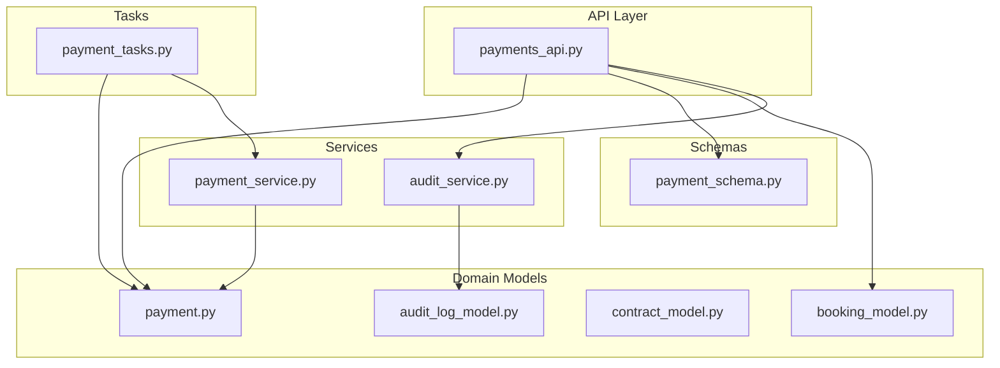
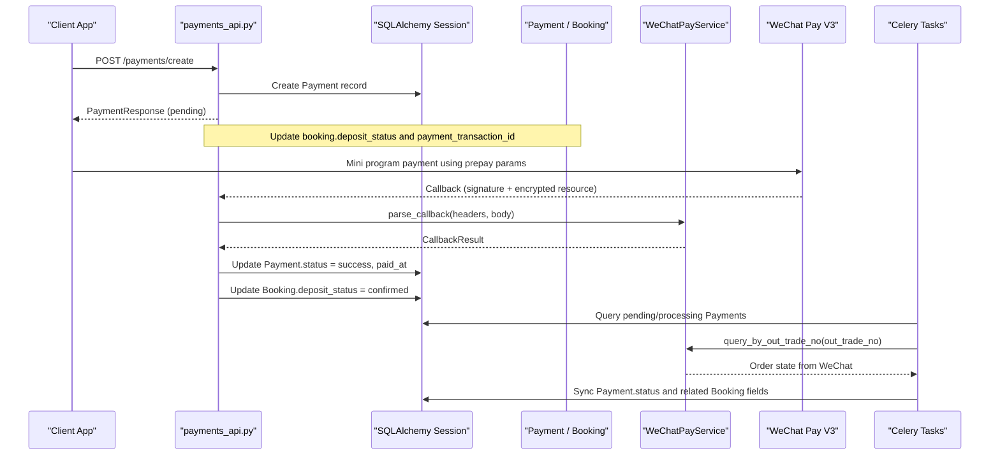
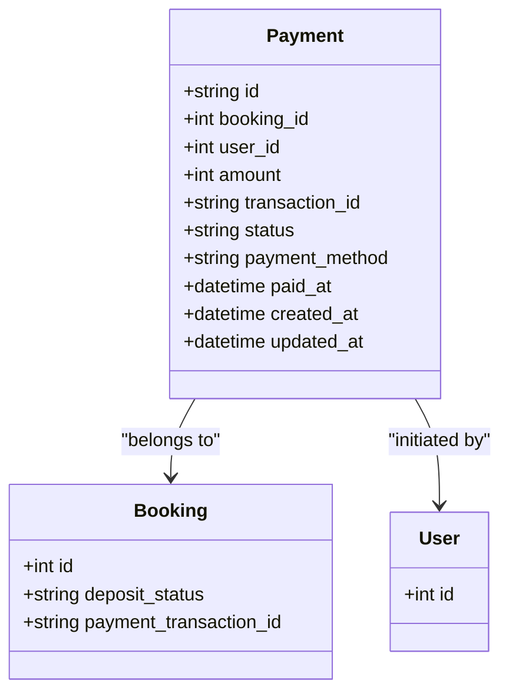
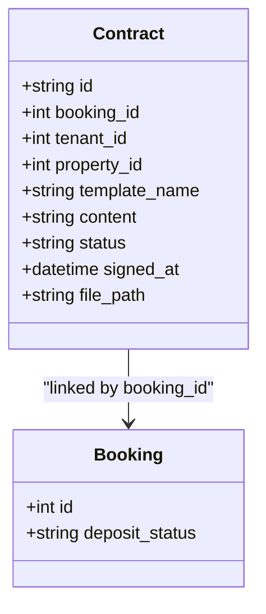
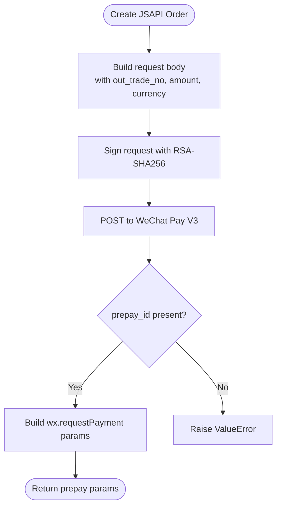
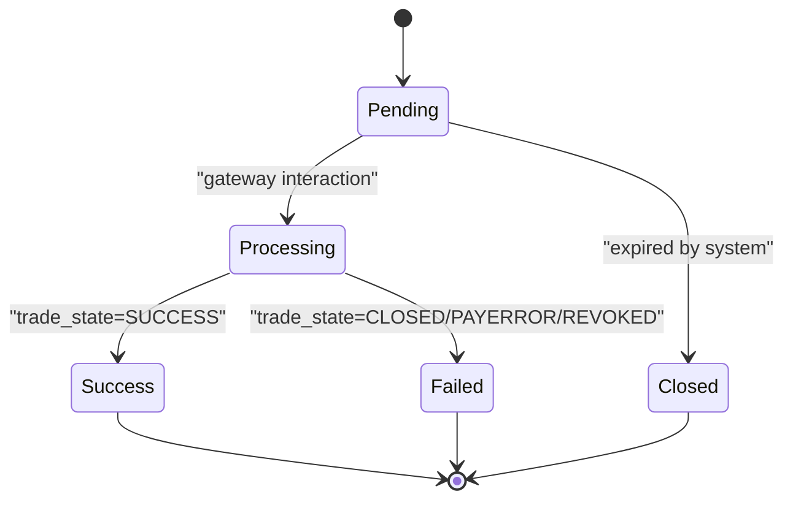
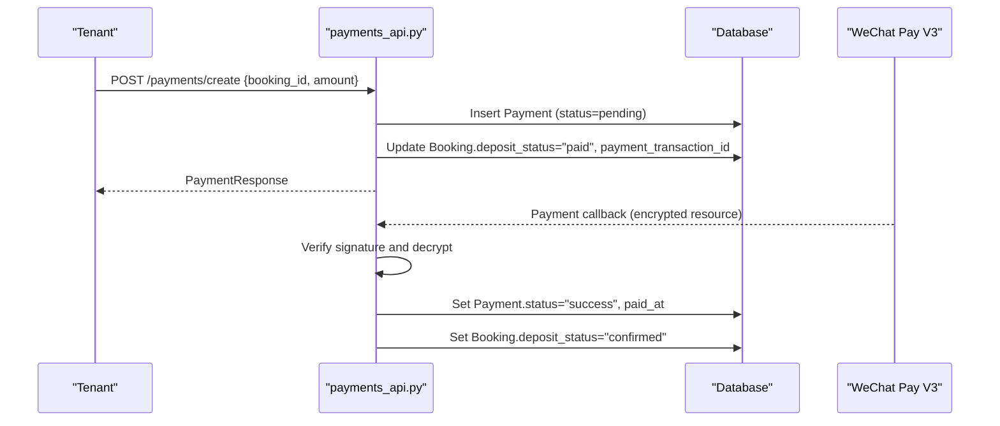
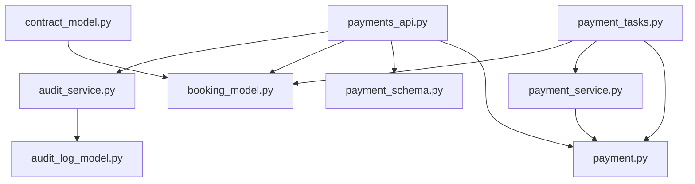

# Payment & Financial Records

<cite>
**Referenced Files in This Document**
- [payment.py](file://backend/app/models/payment.py)
- [payment_schema.py](file://backend/app/schemas/payment.py)
- [payments_api.py](file://backend/app/api/v1/routes/payments.py)
- [payment_service.py](file://backend/app/services/payment_service.py)
- [payment_tasks.py](file://backend/app/tasks/payment_tasks.py)
- [booking_model.py](file://backend/app/models/booking.py)
- [contract_model.py](file://backend/app/models/contract.py)
- [audit_log_model.py](file://backend/app/models/audit_log.py)
- [audit_service.py](file://backend/app/services/audit_service.py)
- [migration_deposit_contract_payment_poi.py](file://backend/alembic/versions/20260623_0008_deposit_contract_payment_poi.py)
</cite>

## Table of Contents
1. [Introduction](#introduction)
2. [Project Structure](#project-structure)
3. [Core Components](#core-components)
4. [Architecture Overview](#architecture-overview)
5. [Detailed Component Analysis](#detailed-component-analysis)
6. [Dependency Analysis](#dependency-analysis)
7. [Performance Considerations](#performance-considerations)
8. [Troubleshooting Guide](#troubleshooting-guide)
9. [Conclusion](#conclusion)
10. [Appendices](#appendices)

## Introduction
This document provides detailed data model documentation for payment and financial transaction entities, focusing on the Payment model and its integration with deposit agreements and refund processing. It covers transaction tracking fields (amount, currency, payment method, status, external reference IDs), payment gateway integration (WeChat Pay V3), reconciliation flows, audit trails, status workflows, error handling patterns, security requirements, PCI compliance considerations, and examples of processing flows and reporting queries.

## Project Structure
The payment system spans models, schemas, API routes, services, and background tasks:
- Data models define persistent entities and relationships.
- Schemas validate request/response payloads.
- API routes expose endpoints to create payments and handle callbacks.
- Services implement WeChat Pay V3 integration (order creation, callback parsing, refunds).
- Tasks perform reconciliation (polling), order closure, and notifications.

**Diagram sources**
- [payments_api.py:1-85](file://backend/app/api/v1/routes/payments.py#L1-L85)
- [payment.py:1-34](file://backend/app/models/payment.py#L1-L34)
- [payment_schema.py:1-23](file://backend/app/schemas/payment.py#L1-L23)
- [payment_service.py:1-445](file://backend/app/services/payment_service.py#L1-L445)
- [payment_tasks.py:1-241](file://backend/app/tasks/payment_tasks.py#L1-L241)
- [booking_model.py:1-47](file://backend/app/models/booking.py#L1-L47)
- [contract_model.py:1-37](file://backend/app/models/contract.py#L1-L37)
- [audit_log_model.py:1-24](file://backend/app/models/audit_log.py#L1-L24)
- [audit_service.py:1-54](file://backend/app/services/audit_service.py#L1-L54)

**Section sources**
- [payment.py:1-34](file://backend/app/models/payment.py#L1-L34)
- [payment_schema.py:1-23](file://backend/app/schemas/payment.py#L1-L23)
- [payments_api.py:1-85](file://backend/app/api/v1/routes/payments.py#L1-L85)
- [payment_service.py:1-445](file://backend/app/services/payment_service.py#L1-L445)
- [payment_tasks.py:1-241](file://backend/app/tasks/payment_tasks.py#L1-L241)
- [booking_model.py:1-47](file://backend/app/models/booking.py#L1-L47)
- [contract_model.py:1-37](file://backend/app/models/contract.py#L1-L37)
- [audit_log_model.py:1-24](file://backend/app/models/audit_log.py#L1-L24)
- [audit_service.py:1-54](file://backend/app/services/audit_service.py#L1-L54)

## Core Components
- Payment model: Represents a single payment record linked to a booking and user, including amount, transaction identifiers, status, payment method, and timestamps.
- DepositContract model: Captures deposit agreement details and supports refund processing workflows.
- WeChat Pay integration service: Implements JSAPI order creation, callback verification/decryption, order query, close, and refund application.
- Background tasks: Periodically sync pending payments, close expired orders, and send result messages.
- Audit logging: Records actions and details for compliance and traceability.

Key responsibilities:
- Payment lifecycle management (create, update, reconcile).
- External gateway operations (WeChat Pay V3).
- Reconciliation and idempotency via out_trade_no and transaction_id.
- Status synchronization across Payment and Booking entities.
- Secure handling of sensitive configuration and cryptographic keys.

**Section sources**
- [payment.py:1-34](file://backend/app/models/payment.py#L1-L34)
- [contract_model.py:1-37](file://backend/app/models/contract.py#L1-L37)
- [payment_service.py:1-445](file://backend/app/services/payment_service.py#L1-L445)
- [payment_tasks.py:1-241](file://backend/app/tasks/payment_tasks.py#L1-L241)
- [audit_log_model.py:1-24](file://backend/app/models/audit_log.py#L1-L24)
- [audit_service.py:1-54](file://backend/app/services/audit_service.py#L1-L54)

## Architecture Overview
The payment architecture integrates FastAPI routes, SQLAlchemy models, Pydantic schemas, WeChat Pay V3 service, Celery tasks, and audit logging.

**Diagram sources**
- [payments_api.py:15-69](file://backend/app/api/v1/routes/payments.py#L15-L69)
- [payment_service.py:245-377](file://backend/app/services/payment_service.py#L245-L377)
- [payment_tasks.py:86-118](file://backend/app/tasks/payment_tasks.py#L86-L118)
- [payment_tasks.py:121-173](file://backend/app/tasks/payment_tasks.py#L121-L173)
- [payment.py:11-34](file://backend/app/models/payment.py#L11-L34)
- [booking_model.py:18-47](file://backend/app/models/booking.py#L18-L47)

## Detailed Component Analysis

### Payment Model
- Purpose: Track individual payments associated with bookings and users.
- Key attributes:
  - Identifier: UUID primary key.
  - Relationships: booking_id, user_id.
  - Amount: integer (cents).
  - Transaction identifiers: transaction_id (external), out_trade_no (merchant order number used by tasks).
  - Status: string-based states (pending, processing, success, failed, closed).
  - Payment method: default wechat_pay.
  - Timestamps: created_at, updated_at, paid_at.
- Indexes: booking_id, user_id, id for efficient lookups.

**Diagram sources**
- [payment.py:11-34](file://backend/app/models/payment.py#L11-L34)
- [booking_model.py:18-47](file://backend/app/models/booking.py#L18-L47)

**Section sources**
- [payment.py:11-34](file://backend/app/models/payment.py#L11-L34)
- [migration_deposit_contract_payment_poi.py:57-76](file://backend/alembic/versions/20260623_0008_deposit_contract_payment_poi.py#L57-L76)

### DepositContract Model
- Purpose: Represent deposit agreements tied to bookings; supports refund processing workflows.
- Key attributes:
  - Identifier: UUID primary key.
  - Relationships: booking_id (unique), tenant_id, property_id.
  - Content and template metadata: template_name, content, file_path.
  - Lifecycle: status (draft, signed, etc.), signed_at timestamp.
- Integration points:
  - Refund requests can be initiated against contracts linked to bookings that have successful payments.
  - Contract status transitions may depend on payment confirmation.

**Diagram sources**
- [contract_model.py:12-37](file://backend/app/models/contract.py#L12-L37)
- [booking_model.py:18-47](file://backend/app/models/booking.py#L18-L47)

**Section sources**
- [contract_model.py:12-37](file://backend/app/models/contract.py#L12-L37)
- [migration_deposit_contract_payment_poi.py:33-55](file://backend/alembic/versions/20260623_0008_deposit_contract_payment_poi.py#L33-L55)

### Payment Gateway Integration (WeChat Pay V3)
- Responsibilities:
  - Create JSAPI prepay orders with merchant order numbers (out_trade_no).
  - Build mini program payment parameters (appId, timeStamp, nonceStr, package, signType, paySign).
  - Parse and verify callbacks (signature verification flow and AES-GCM decryption).
  - Query order status by out_trade_no or transaction_id.
  - Close unpaid orders.
  - Apply refunds with optional reason and notify URL.
- Security:
  - RSA-SHA256 signing for outbound requests.
  - AES-256-GCM decryption for inbound callback resources.
  - Private key loaded securely from configured path.

**Diagram sources**
- [payment_service.py:245-323](file://backend/app/services/payment_service.py#L245-L323)

**Section sources**
- [payment_service.py:127-151](file://backend/app/services/payment_service.py#L127-L151)
- [payment_service.py:187-205](file://backend/app/services/payment_service.py#L187-L205)
- [payment_service.py:245-323](file://backend/app/services/payment_service.py#L245-L323)
- [payment_service.py:325-377](file://backend/app/services/payment_service.py#L325-L377)
- [payment_service.py:379-444](file://backend/app/services/payment_service.py#L379-L444)

### Payment Status Workflows
- States:
  - pending: Initial state after creation.
  - processing: Intermediate state during gateway interaction.
  - success: Confirmed by WeChat Pay.
  - failed: Error or cancellation (CLOSED, PAYERROR, REVOKED).
  - closed: Expired and closed by system.
- Transitions:
  - Creation sets status to pending.
  - Callback updates to success and records paid_at.
  - Polling task updates based on trade_state from WeChat.
  - Expiration task closes pending payments beyond threshold.

**Diagram sources**
- [payment_tasks.py:27-77](file://backend/app/tasks/payment_tasks.py#L27-L77)
- [payment_tasks.py:121-173](file://backend/app/tasks/payment_tasks.py#L121-L173)
- [payments_api.py:48-69](file://backend/app/api/v1/routes/payments.py#L48-L69)

**Section sources**
- [payment_tasks.py:27-77](file://backend/app/tasks/payment_tasks.py#L27-L77)
- [payment_tasks.py:86-118](file://backend/app/tasks/payment_tasks.py#L86-L118)
- [payment_tasks.py:121-173](file://backend/app/tasks/payment_tasks.py#L121-L173)
- [payments_api.py:48-69](file://backend/app/api/v1/routes/payments.py#L48-L69)

### Error Handling Patterns
- Validation errors: Missing required fields raise HTTP exceptions.
- Gateway errors: Non-2xx responses raise HTTP exceptions; JSON parsing failures handled with explicit checks.
- Signature verification: Structural validation and logging; production should fetch platform certificate and verify signature.
- Decryption failures: AES-GCM decryption raises exceptions; ensure correct API v3 key and associated_data.
- Idempotency: Use out_trade_no to avoid duplicate refunds and reprocessing.

**Section sources**
- [payments_api.py:15-45](file://backend/app/api/v1/routes/payments.py#L15-L45)
- [payment_service.py:207-239](file://backend/app/services/payment_service.py#L207-L239)
- [payment_service.py:282-292](file://backend/app/services/payment_service.py#L282-L292)

### Financial Data Security Requirements and PCI Compliance
- Secrets management:
  - Merchant private key path must be protected and not committed to source control.
  - API v3 key and serial numbers stored securely via settings.
- Cryptographic practices:
  - RSA-SHA256 for request signing.
  - AES-256-GCM for callback resource decryption.
- Tokenization and minimization:
  - Avoid storing raw cardholder data; rely on gateway tokens and references.
  - Store only necessary identifiers (transaction_id, out_trade_no).
- Access controls:
  - Enforce role-based access (tenant vs admin) for payment operations.
- Audit logging:
  - Record critical actions (login, payment events) with IP addresses and details.

**Section sources**
- [payment_service.py:103-115](file://backend/app/services/payment_service.py#L103-L115)
- [payment_service.py:127-151](file://backend/app/services/payment_service.py#L127-L151)
- [payment_service.py:187-205](file://backend/app/services/payment_service.py#L187-L205)
- [audit_service.py:11-32](file://backend/app/services/audit_service.py#L11-L32)
- [audit_log_model.py:10-24](file://backend/app/models/audit_log.py#L10-L24)

### Examples of Payment Processing Flows
- Create payment:
  - Validate booking ownership and role.
  - Persist Payment with status pending and generate transaction_id.
  - Update booking.deposit_status and payment_transaction_id.
- Handle callback:
  - Verify signature and decrypt resource.
  - Update Payment.status to success and set paid_at.
  - Update booking.deposit_status to confirmed.
- Refund handling:
  - Initiate refund via apply_refund with out_trade_no and out_refund_no.
  - Monitor refund notifications and update contract/payment statuses accordingly.

**Diagram sources**
- [payments_api.py:15-45](file://backend/app/api/v1/routes/payments.py#L15-L45)
- [payments_api.py:48-69](file://backend/app/api/v1/routes/payments.py#L48-L69)
- [payment_service.py:325-377](file://backend/app/services/payment_service.py#L325-L377)

**Section sources**
- [payments_api.py:15-45](file://backend/app/api/v1/routes/payments.py#L15-L45)
- [payments_api.py:48-69](file://backend/app/api/v1/routes/payments.py#L48-L69)
- [payment_service.py:325-377](file://backend/app/services/payment_service.py#L325-L377)

### Financial Reporting Queries
- Total revenue by month:
  - Sum amounts where status is success and paid_at falls within the month.
- Outstanding deposits:
  - Count payments with status pending or processing grouped by booking.
- Refund summary:
  - Aggregate refund applications and outcomes by contract and payment.
- Reconciliation report:
  - Compare local Payment.transaction_id with WeChat transaction_id for discrepancies.

[No sources needed since this section provides general guidance]

## Dependency Analysis
The payment subsystem depends on core models, schemas, services, and tasks. The following diagram shows import and usage relationships.

**Diagram sources**
- [payments_api.py:1-85](file://backend/app/api/v1/routes/payments.py#L1-L85)
- [payment.py:1-34](file://backend/app/models/payment.py#L1-L34)
- [payment_schema.py:1-23](file://backend/app/schemas/payment.py#L1-L23)
- [payment_service.py:1-445](file://backend/app/services/payment_service.py#L1-L445)
- [payment_tasks.py:1-241](file://backend/app/tasks/payment_tasks.py#L1-L241)
- [booking_model.py:1-47](file://backend/app/models/booking.py#L1-L47)
- [contract_model.py:1-37](file://backend/app/models/contract.py#L1-L37)
- [audit_log_model.py:1-24](file://backend/app/models/audit_log.py#L1-L24)
- [audit_service.py:1-54](file://backend/app/services/audit_service.py#L1-L54)

**Section sources**
- [payments_api.py:1-85](file://backend/app/api/v1/routes/payments.py#L1-L85)
- [payment_tasks.py:1-241](file://backend/app/tasks/payment_tasks.py#L1-L241)
- [payment_service.py:1-445](file://backend/app/services/payment_service.py#L1-L445)

## Performance Considerations
- Database indexing: Ensure indexes on frequently queried fields (booking_id, user_id, status, created_at).
- Async operations: Use async clients for WeChat Pay calls to reduce latency.
- Task scheduling: Tune Celery Beat intervals for reconciliation and expiration tasks.
- Connection pooling: Configure database engine pool sizes appropriately for concurrent tasks.
- Payload size: Keep descriptions and attach fields within gateway limits to avoid retries.

[No sources needed since this section provides general guidance]

## Troubleshooting Guide
Common issues and resolutions:
- Missing private key: Ensure the configured path exists and is readable; service raises FileNotFoundError if missing.
- Callback signature mismatch: Implement full platform certificate verification; currently structural validation is performed.
- Decryption failure: Verify API v3 key and associated_data correctness; check ciphertext and nonce formats.
- Duplicate refunds: Enforce unique out_refund_no per out_trade_no; implement idempotency checks.
- Stale payment status: Increase polling frequency or adjust cutoff times for expiration tasks.

**Section sources**
- [payment_service.py:103-115](file://backend/app/services/payment_service.py#L103-L115)
- [payment_service.py:207-239](file://backend/app/services/payment_service.py#L207-L239)
- [payment_tasks.py:121-173](file://backend/app/tasks/payment_tasks.py#L121-L173)

## Conclusion
The payment and financial records system centers around a robust Payment model integrated with WeChat Pay V3, providing secure order creation, callback handling, reconciliation, and refund capabilities. Status workflows are enforced through API routes and background tasks, while audit logging ensures compliance and traceability. Adhering to security best practices and PCI considerations will strengthen the system’s resilience and trustworthiness.

[No sources needed since this section summarizes without analyzing specific files]

## Appendices

### Data Model Schema Summary
- Payment table:
  - Columns: id, booking_id, user_id, amount, transaction_id, status, payment_method, paid_at, created_at, updated_at.
  - Foreign keys: booking_id → bookings.id, user_id → users.id.
  - Indexes: ix_payments_booking_id, ix_payments_user_id, ix_payments_id.
- Contracts table:
  - Columns: id, booking_id, tenant_id, property_id, template_name, content, status, signed_at, file_path, created_at, updated_at.
  - Unique constraint: booking_id.
  - Foreign keys: booking_id → bookings.id, tenant_id → users.id, property_id → properties.id.
- Audit logs table:
  - Columns: id, user_id, action, resource_type, resource_id, details, ip_address, created_at.
  - Indexes: id, user_id, action, resource_type.

**Section sources**
- [migration_deposit_contract_payment_poi.py:33-76](file://backend/alembic/versions/20260623_0008_deposit_contract_payment_poi.py#L33-L76)
- [audit_log_model.py:10-24](file://backend/app/models/audit_log.py#L10-L24)