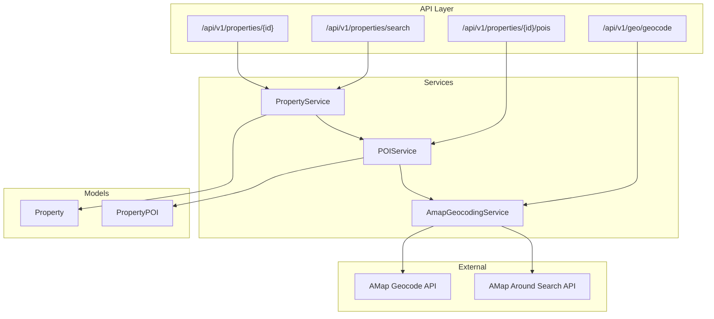
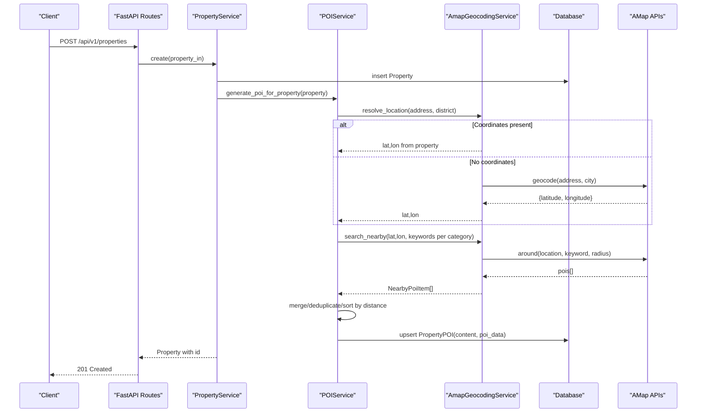
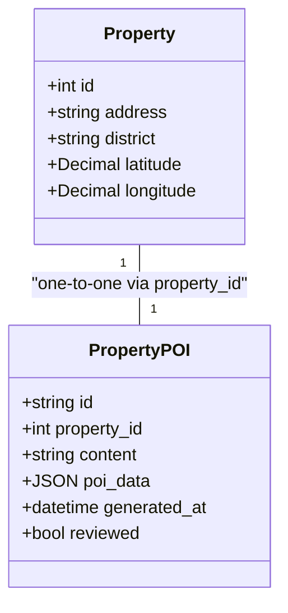
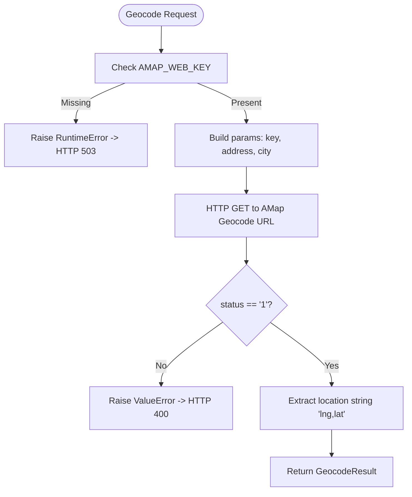
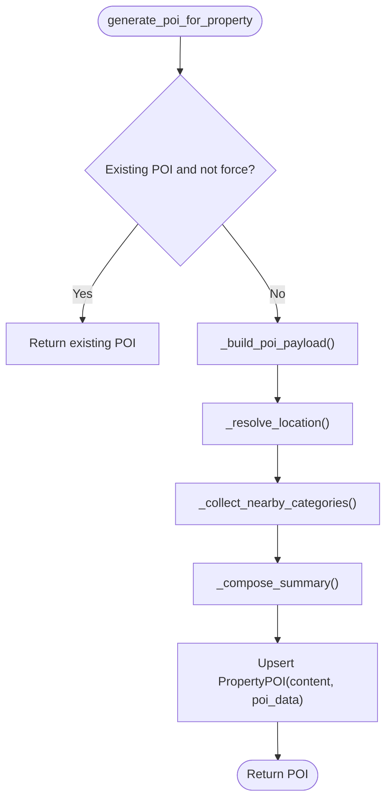
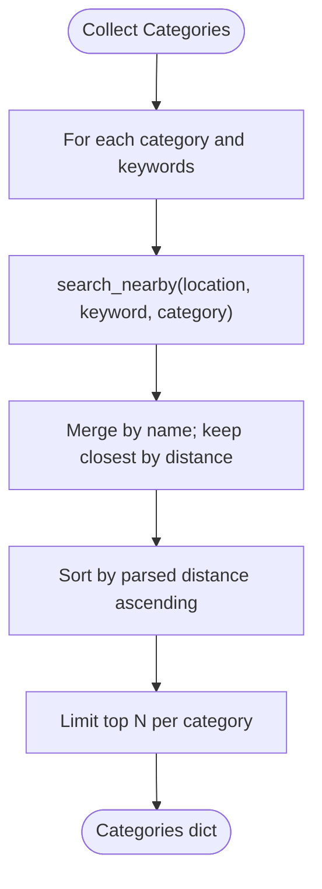
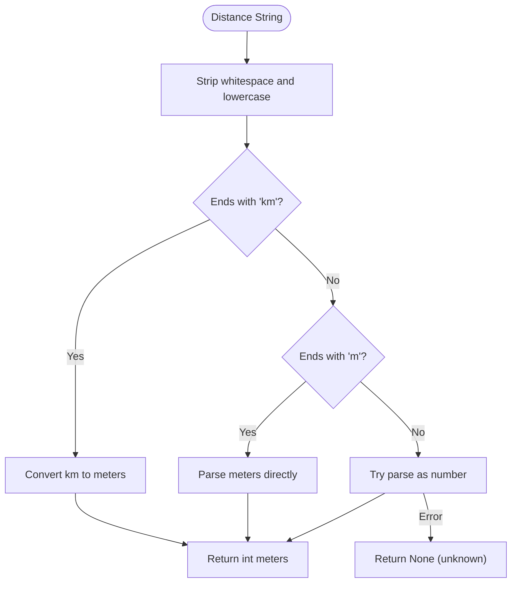
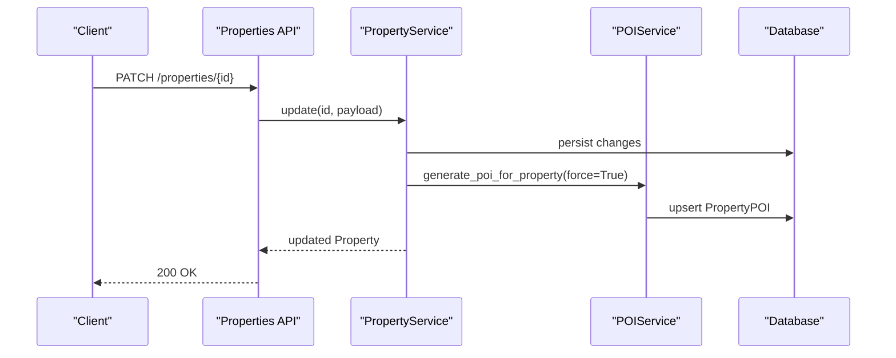
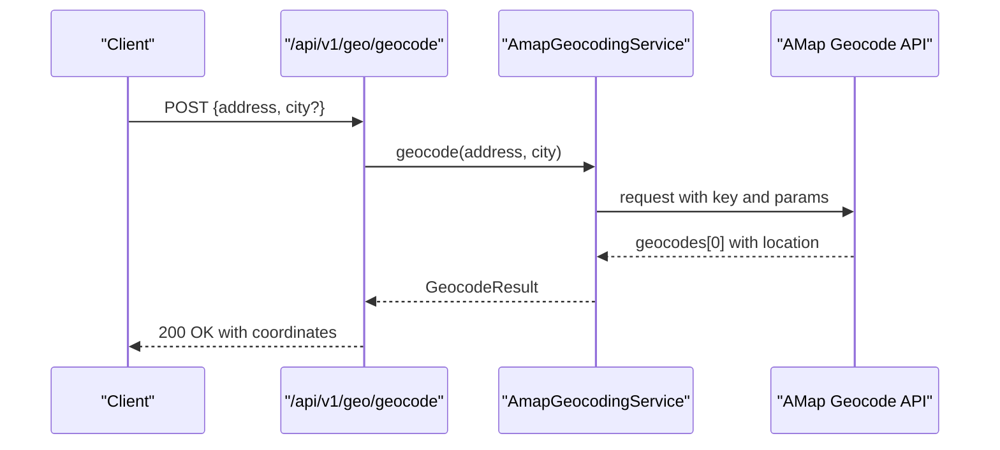
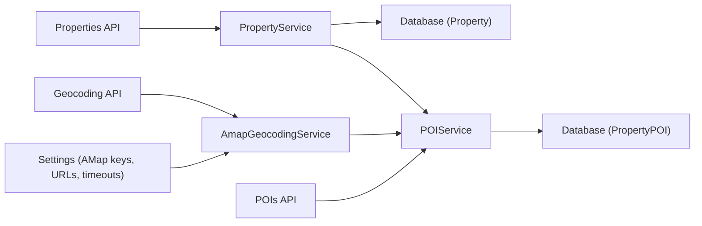

# Location & POI Services

<cite>
**Referenced Files in This Document**
- [poi.py](file://backend/app/models/poi.py)
- [property.py](file://backend/app/models/property.py)
- [poi_service.py](file://backend/app/services/poi_service.py)
- [geocoding_service.py](file://backend/app/services/geocoding_service.py)
- [pois.py](file://backend/app/api/v1/routes/pois.py)
- [geocoding.py](file://backend/app/api/v1/routes/geocoding.py)
- [config.py](file://backend/app/core/config.py)
- [20260623_0008_deposit_contract_payment_poi.py](file://backend/alembic/versions/20260623_0008_deposit_contract_payment_poi.py)
- [property_service.py](file://backend/app/services/property_service.py)
- [properties.py](file://backend/app/api/v1/routes/properties.py)
- [test_poi_generation.py](file://backend/tests/test_poi_generation.py)
</cite>

## Table of Contents
1. [Introduction](#introduction)
2. [Project Structure](#project-structure)
3. [Core Components](#core-components)
4. [Architecture Overview](#architecture-overview)
5. [Detailed Component Analysis](#detailed-component-analysis)
6. [Dependency Analysis](#dependency-analysis)
7. [Performance Considerations](#performance-considerations)
8. [Troubleshooting Guide](#troubleshooting-guide)
9. [Conclusion](#conclusion)
10. [Appendices](#appendices)

## Introduction
This document explains the data model and services for Point of Interest (POI) entities and location capabilities. It covers:
- POI categories such as transportation, medical, education, shopping, dining, and daily services
- Geographic coordinate storage on properties and address-to-coordinate resolution via AMap
- Distance parsing and sorting logic used to rank nearby facilities
- The relationship between properties and generated POIs for enriched property discovery
- Geocoding integration with AMap API for automatic location resolution
- Indexing strategies and spatial query approaches for proximity searches
- Practical examples for creating POIs, associating them with properties, and filtering properties by location-aware criteria

## Project Structure
The location and POI features are implemented across models, services, APIs, configuration, and migrations:
- Models define persistent structures for properties and their associated POIs
- Services encapsulate geocoding and POI generation workflows
- API routes expose endpoints for geocoding and POI retrieval/generation
- Configuration centralizes AMap settings and timeouts
- Migrations create database tables and indexes for POIs and properties

**Diagram sources**
- [geocoding.py:1-25](file://backend/app/api/v1/routes/geocoding.py#L1-L25)
- [pois.py:1-32](file://backend/app/api/v1/routes/pois.py#L1-L32)
- [geocoding_service.py:1-145](file://backend/app/services/geocoding_service.py#L1-L145)
- [poi_service.py:1-311](file://backend/app/services/poi_service.py#L1-L311)
- [property_service.py:1-239](file://backend/app/services/property_service.py#L1-L239)
- [property.py:1-86](file://backend/app/models/property.py#L1-L86)
- [poi.py:1-28](file://backend/app/models/poi.py#L1-L28)

**Section sources**
- [geocoding.py:1-25](file://backend/app/api/v1/routes/geocoding.py#L1-L25)
- [pois.py:1-32](file://backend/app/api/v1/routes/pois.py#L1-L32)
- [geocoding_service.py:1-145](file://backend/app/services/geocoding_service.py#L1-L145)
- [poi_service.py:1-311](file://backend/app/services/poi_service.py#L1-L311)
- [property_service.py:1-239](file://backend/app/services/property_service.py#L1-L239)
- [property.py:1-86](file://backend/app/models/property.py#L1-L86)
- [poi.py:1-28](file://backend/app/models/poi.py#L1-L28)

## Core Components
- Property model stores address, district, and optional latitude/longitude coordinates
- PropertyPOI model stores a human-readable summary and structured POI data per property
- AmapGeocodingService provides geocoding and nearby search against AMap
- POIService orchestrates POI generation using resolved coordinates and nearby search results
- PropertyService integrates POI generation into property lifecycle events (create/update)
- API routes expose geocoding and POI endpoints

Key responsibilities:
- Coordinate storage and validation on properties
- Address parsing and geocoding to obtain coordinates
- Nearby facility discovery and categorization
- Summary composition and persistence of POI records
- API exposure for clients to retrieve or trigger POI generation

**Section sources**
- [property.py:38-86](file://backend/app/models/property.py#L38-L86)
- [poi.py:12-28](file://backend/app/models/poi.py#L12-L28)
- [geocoding_service.py:38-145](file://backend/app/services/geocoding_service.py#L38-L145)
- [poi_service.py:109-311](file://backend/app/services/poi_service.py#L109-L311)
- [property_service.py:44-239](file://backend/app/services/property_service.py#L44-L239)
- [geocoding.py:1-25](file://backend/app/api/v1/routes/geocoding.py#L1-L25)
- [pois.py:1-32](file://backend/app/api/v1/routes/pois.py#L1-L32)

## Architecture Overview
The system integrates external mapping services to enrich property listings with contextual POI information.

**Diagram sources**
- [properties.py:16-33](file://backend/app/api/v1/routes/properties.py#L16-L33)
- [property_service.py:48-60](file://backend/app/services/property_service.py#L48-L60)
- [poi_service.py:123-151](file://backend/app/services/poi_service.py#L123-L151)
- [geocoding_service.py:46-85](file://backend/app/services/geocoding_service.py#L46-L85)
- [geocoding_service.py:87-145](file://backend/app/services/geocoding_service.py#L87-L145)
- [20260623_0008_deposit_contract_payment_poi.py:78-94](file://backend/alembic/versions/20260623_0008_deposit_contract_payment_poi.py#L78-L94)

## Detailed Component Analysis

### Data Model: Property and PropertyPOI
- Property includes fields for address, district, and optional latitude/longitude coordinates
- PropertyPOI is linked one-to-one with Property and stores:
  - content: human-readable summary
  - poi_data: structured JSON of categorized nearby facilities
  - generated_at: timestamp of generation
  - reviewed: flag indicating manual review status

**Diagram sources**
- [property.py:38-86](file://backend/app/models/property.py#L38-L86)
- [poi.py:12-28](file://backend/app/models/poi.py#L12-L28)
- [20260623_0008_deposit_contract_payment_poi.py:78-94](file://backend/alembic/versions/20260623_0008_deposit_contract_payment_poi.py#L78-L94)

**Section sources**
- [property.py:38-86](file://backend/app/models/property.py#L38-L86)
- [poi.py:12-28](file://backend/app/models/poi.py#L12-L28)
- [20260623_0008_deposit_contract_payment_poi.py:78-94](file://backend/alembic/versions/20260623_0008_deposit_contract_payment_poi.py#L78-L94)

### Geocoding Integration with AMap
- AmapGeocodingService wraps two primary operations:
  - geocode: converts an address to latitude/longitude
  - search_nearby: retrieves nearby points of interest by keyword and category
- Settings include keys, URLs, timeouts, radius, and page size for AMap calls
- Errors propagate as exceptions when configuration is missing or responses are invalid

**Diagram sources**
- [geocoding_service.py:46-85](file://backend/app/services/geocoding_service.py#L46-L85)
- [geocoding.py:9-25](file://backend/app/api/v1/routes/geocoding.py#L9-L25)
- [config.py:74-97](file://backend/app/core/config.py#L74-L97)

**Section sources**
- [geocoding_service.py:38-145](file://backend/app/services/geocoding_service.py#L38-L145)
- [geocoding.py:1-25](file://backend/app/api/v1/routes/geocoding.py#L1-L25)
- [config.py:74-97](file://backend/app/core/config.py#L74-L97)

### POI Generation Workflow
- POIService determines whether to use existing coordinates or geocode the address
- It queries nearby facilities across predefined categories and keywords
- Results are merged, deduplicated, sorted by distance, and limited per category
- A summary text is composed deterministically or optionally refined via LLM if configured
- The final POI record is persisted with structured poi_data and a human-readable content field

**Diagram sources**
- [poi_service.py:123-151](file://backend/app/services/poi_service.py#L123-L151)
- [poi_service.py:153-195](file://backend/app/services/poi_service.py#L153-L195)
- [poi_service.py:197-236](file://backend/app/services/poi_service.py#L197-L236)
- [poi_service.py:238-278](file://backend/app/services/poi_service.py#L238-L278)

**Section sources**
- [poi_service.py:109-311](file://backend/app/services/poi_service.py#L109-L311)

### POI Categories and Keywords
- Categories include transportation, medical, education, shopping, dining, and daily services
- Each category maps to multiple keywords used for nearby search
- The service merges results by name and keeps the closest entry per name
- Top entries per category are ordered by parsed distance and truncated

**Diagram sources**
- [poi_service.py:100-107](file://backend/app/services/poi_service.py#L100-L107)
- [poi_service.py:208-236](file://backend/app/services/poi_service.py#L208-L236)
- [geocoding_service.py:87-145](file://backend/app/services/geocoding_service.py#L87-L145)

**Section sources**
- [poi_service.py:100-107](file://backend/app/services/poi_service.py#L100-L107)
- [poi_service.py:208-236](file://backend/app/services/poi_service.py#L208-L236)
- [geocoding_service.py:87-145](file://backend/app/services/geocoding_service.py#L87-L145)

### Distance Calculation and Parsing
- Distances may be provided as meters or kilometers
- The service normalizes distances to integers in meters for consistent sorting
- Non-parseable values are treated as unknown and placed at the end of ordering

**Diagram sources**
- [poi_service.py:280-292](file://backend/app/services/poi_service.py#L280-L292)

**Section sources**
- [poi_service.py:280-292](file://backend/app/services/poi_service.py#L280-L292)

### Relationship Between Properties and Nearby POIs
- Each property can have one associated POI record
- The POI contains both narrative content and structured poi_data
- PropertyService preloads POI when fetching a single property for convenience
- Updates to property details trigger regeneration of POI content

**Diagram sources**
- [properties.py:121-141](file://backend/app/api/v1/routes/properties.py#L121-L141)
- [property_service.py:197-214](file://backend/app/services/property_service.py#L197-L214)
- [poi_service.py:123-151](file://backend/app/services/poi_service.py#L123-L151)

**Section sources**
- [properties.py:121-141](file://backend/app/api/v1/routes/properties.py#L121-L141)
- [property_service.py:197-214](file://backend/app/services/property_service.py#L197-L214)
- [poi_service.py:123-151](file://backend/app/services/poi_service.py#L123-L151)

### API Endpoints for POI and Geocoding
- Geocoding endpoint accepts address and optional city, returning coordinates and metadata
- POI endpoints allow retrieving or generating POI for a given property
- Error handling returns appropriate HTTP status codes for missing configuration or invalid requests

**Diagram sources**
- [geocoding.py:9-25](file://backend/app/api/v1/routes/geocoding.py#L9-L25)
- [geocoding_service.py:46-85](file://backend/app/services/geocoding_service.py#L46-L85)

**Section sources**
- [geocoding.py:1-25](file://backend/app/api/v1/routes/geocoding.py#L1-L25)
- [pois.py:1-32](file://backend/app/api/v1/routes/pois.py#L1-L32)
- [geocoding_service.py:38-145](file://backend/app/services/geocoding_service.py#L38-L145)

### Examples

- Create a property and automatically generate POI:
  - Use the properties creation endpoint; the service will attempt POI generation after saving the property
  - If AMap is unavailable, fallback mock data ensures POI content remains available

- Associate POI with a property:
  - POI is stored per property via a unique constraint on property_id
  - Retrieval endpoints return the POI if it exists or generate it on demand

- Location-aware property filtering:
  - Current search supports district, price range, bedrooms, and type filters
  - For proximity-based filtering, consider adding a spatial index on coordinates and querying within a radius using PostGIS or pgvector-compatible functions

**Section sources**
- [properties.py:16-33](file://backend/app/api/v1/routes/properties.py#L16-L33)
- [property_service.py:48-60](file://backend/app/services/property_service.py#L48-L60)
- [poi_service.py:123-151](file://backend/app/services/poi_service.py#L123-L151)
- [pois.py:11-20](file://backend/app/api/v1/routes/pois.py#L11-L20)

## Dependency Analysis
- POIService depends on AmapGeocodingService for location resolution and nearby search
- PropertyService triggers POI generation during property create/update
- API routes depend on services and models for request/response handling
- Configuration centralizes AMap settings and timeouts

**Diagram sources**
- [config.py:74-97](file://backend/app/core/config.py#L74-L97)
- [geocoding_service.py:38-145](file://backend/app/services/geocoding_service.py#L38-L145)
- [poi_service.py:109-311](file://backend/app/services/poi_service.py#L109-L311)
- [property_service.py:44-239](file://backend/app/services/property_service.py#L44-L239)
- [geocoding.py:1-25](file://backend/app/api/v1/routes/geocoding.py#L1-L25)
- [pois.py:1-32](file://backend/app/api/v1/routes/pois.py#L1-L32)
- [property.py:38-86](file://backend/app/models/property.py#L38-L86)
- [poi.py:12-28](file://backend/app/models/poi.py#L12-L28)

**Section sources**
- [config.py:74-97](file://backend/app/core/config.py#L74-L97)
- [geocoding_service.py:38-145](file://backend/app/services/geocoding_service.py#L38-L145)
- [poi_service.py:109-311](file://backend/app/services/poi_service.py#L109-L311)
- [property_service.py:44-239](file://backend/app/services/property_service.py#L44-L239)
- [geocoding.py:1-25](file://backend/app/api/v1/routes/geocoding.py#L1-L25)
- [pois.py:1-32](file://backend/app/api/v1/routes/pois.py#L1-L32)
- [property.py:38-86](file://backend/app/models/property.py#L38-L86)
- [poi.py:12-28](file://backend/app/models/poi.py#L12-L28)

## Performance Considerations
- AMap nearby search uses configurable radius and page size; tune these to balance coverage and latency
- Distance parsing avoids heavy computation by converting to integer meters once and sorting efficiently
- POI generation is resilient to failures; fallback mock data ensures availability
- Consider caching frequently accessed POI summaries and nearby lists to reduce repeated external calls
- For large-scale proximity queries, introduce spatial indexing (e.g., PostGIS) and leverage database-native nearest-neighbor functions

## Troubleshooting Guide
- Missing AMap key:
  - Geocoding endpoint returns HTTP 503 when AMAP_WEB_KEY is not set
- Invalid geocoding response:
  - Returns HTTP 400 when AMap status is not successful or no geocodes are returned
- Nearby search errors:
  - Service raises exceptions on non-successful responses; ensure timeout and pagination parameters are reasonable
- POI generation failures:
  - Service logs warnings and falls back to mock data; verify network connectivity and API quotas

**Section sources**
- [geocoding.py:14-23](file://backend/app/api/v1/routes/geocoding.py#L14-L23)
- [geocoding_service.py:46-85](file://backend/app/services/geocoding_service.py#L46-L85)
- [geocoding_service.py:87-145](file://backend/app/services/geocoding_service.py#L87-L145)
- [poi_service.py:164-195](file://backend/app/services/poi_service.py#L164-L195)

## Conclusion
The location and POI subsystem integrates AMap geocoding and nearby search to enrich property listings with contextual information. Properties store geographic coordinates and link to POI records containing structured facility data and summaries. The design emphasizes resilience through fallback mechanisms and clear error handling. Future enhancements can add robust spatial indexing and advanced proximity queries for more powerful location-aware filtering.

## Appendices

### Database Schema Notes
- property_pois table includes:
  - Unique constraint on property_id
  - Indexes on id and property_id
  - JSON column for poi_data
  - Timestamps and reviewed flag

**Section sources**
- [20260623_0008_deposit_contract_payment_poi.py:78-94](file://backend/alembic/versions/20260623_0008_deposit_contract_payment_poi.py#L78-L94)

### Test Coverage Highlights
- POI generation test verifies that nearby search results are integrated into poi_data and content
- Geocoding tests validate success paths and required key behavior

**Section sources**
- [test_poi_generation.py:1-53](file://backend/tests/test_poi_generation.py#L1-L53)