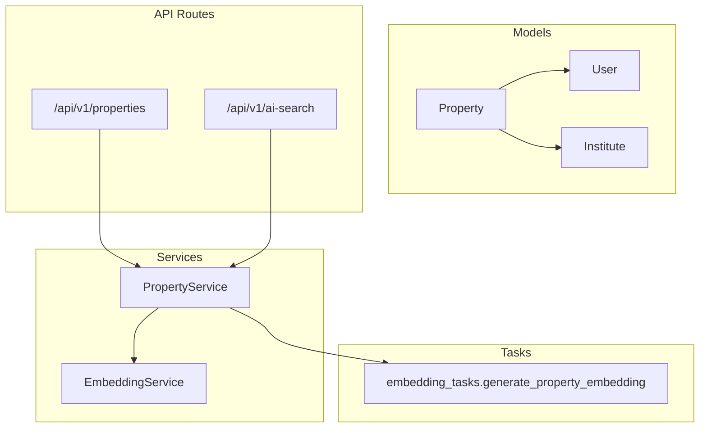
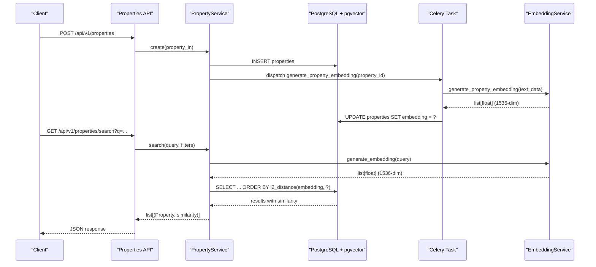
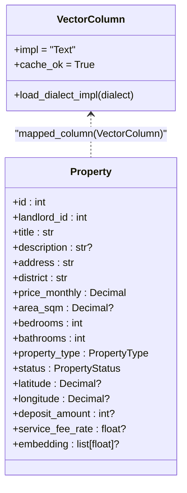
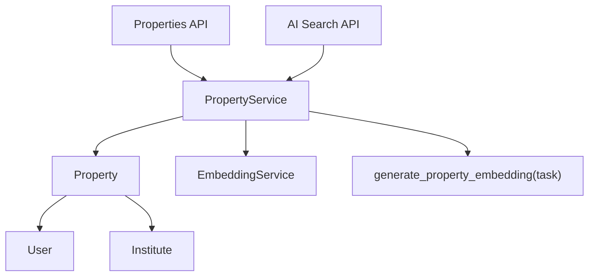

# Property Core Model

<cite>
**Referenced Files in This Document**
- [property.py](file://backend/app/models/property.py)
- [user.py](file://backend/app/models/user.py)
- [institute.py](file://backend/app/models/institute.py)
- [indexes.py](file://backend/app/db/indexes.py)
- [20260617_0001_initial_users_properties.py](file://backend/alembic/versions/20260617_0001_initial_users_properties.py)
- [20260620_0002_pgvector_embedding.py](file://backend/alembic/versions/20260620_0002_pgvector_embedding.py)
- [property_service.py](file://backend/app/services/property_service.py)
- [properties.py](file://backend/app/api/v1/routes/properties.py)
- [ai_search.py](file://backend/app/api/v1/routes/ai_search.py)
- [embedding_service.py](file://backend/app/services/embedding_service.py)
- [embedding_tasks.py](file://backend/app/tasks/embedding_tasks.py)
- [test_properties.py](file://backend/tests/test_properties.py)
- [test_pgvector.py](file://backend/tests/test_pgvector.py)
</cite>

## Table of Contents
1. Introduction
2. Project Structure
3. Core Components
4. Architecture Overview
5. Detailed Component Analysis
6. Dependency Analysis
7. Performance Considerations
8. Troubleshooting Guide
9. Conclusion

## Introduction
This document provides comprehensive data model documentation for the Property core entity. It covers all property attributes, enumerations, constraints, indexes, and relationships to User and Institute models. It also explains the pgvector embedding column implementation using a VectorColumn TypeDecorator for semantic search with 1536-dimensional vectors, and includes examples of creation, updates, and query patterns including vector similarity searches.

## Project Structure
The Property model is defined as a SQLAlchemy ORM class with:
- Enumerations for type and status
- A custom VectorColumn TypeDecorator mapping to PostgreSQL pgvector
- Database-level constraints and indexes
- Relationships to User (landlord) and Institute entities
- Integration with services and API routes for CRUD and search operations

[No sources needed since this diagram shows conceptual workflow, not actual code structure]

## Core Components
- Property model fields include identifiers, landlord and institute references, descriptive text, address and district, pricing (price_monthly, deposit_amount, service_fee_rate), spatial information (area_sqm, bedrooms, bathrooms), location coordinates (latitude, longitude), and an embedding vector for semantic search.
- PropertyType enumeration values: apartment, house, studio, shared.
- PropertyStatus enumeration values: available, rented, maintenance, offline.
- VectorColumn TypeDecorator maps to pgvector Vector(1536) on PostgreSQL; falls back to text on other databases.
- Constraints enforce non-negative price, positive area when present, and non-negative room counts.
- Indexes optimize filtering by district and status, and support fast lookups by id, landlord_id, and status.
- Foreign keys link Property.landlord_id to User.id (CASCADE delete) and Property.institute_id to Institute.id (SET NULL).

**Section sources**
- [property.py:24-36](file://backend/app/models/property.py#L24-L36)
- [property.py:38-86](file://backend/app/models/property.py#L38-L86)
- [user.py:24-48](file://backend/app/models/user.py#L24-L48)
- [institute.py:16-48](file://backend/app/models/institute.py#L16-L48)

## Architecture Overview
The Property model integrates with services and tasks to generate embeddings and perform semantic search. The flow from API to database and back involves:
- API endpoints accepting create/update/search requests
- Service layer building queries and orchestrating async tasks
- Embedding generation via external OpenAI-compatible API
- pgvector-based similarity search with IVFFlat index optimization

**Diagram sources**
- [properties.py:16-91](file://backend/app/api/v1/routes/properties.py#L16-L91)
- [property_service.py:48-195](file://backend/app/services/property_service.py#L48-L195)
- [embedding_tasks.py:16-80](file://backend/app/tasks/embedding_tasks.py#L16-L80)
- [embedding_service.py:17-32](file://backend/app/services/embedding_service.py#L17-L32)

## Detailed Component Analysis

### Property Data Model
- Primary key: id (integer, indexed)
- Landlord reference: landlord_id (FK to users.id, CASCADE delete, indexed)
- Optional institute reference: institute_id (FK to institutes.id, SET NULL, indexed)
- Title: string up to 200 characters, required
- Description: optional text
- Address: string up to 300 characters, required
- District: string up to 100 characters, required, indexed
- Price monthly: numeric(12,2), required, non-negative constraint
- Area sqm: numeric(8,2), optional, must be > 0 if provided
- Bedrooms: integer, default 0, non-negative constraint
- Bathrooms: integer, default 0, non-negative constraint
- Property type: enum(apartment, house, studio, shared), default apartment
- Status: enum(available, rented, maintenance, offline), default available, indexed
- Latitude: numeric(9,6), optional
- Longitude: numeric(9,6), optional
- Deposit amount: integer, optional, default 1000
- Service fee rate: float, optional, default 0.10
- Embedding: list[float], optional, mapped to pgvector Vector(1536) via VectorColumn

Constraints and indexes:
- Check constraints ensure price >= 0, area > 0 when present, bedrooms >= 0, bathrooms >= 0
- Composite index on (district, status)
- Additional indexes on id, landlord_id, district, status

Relationships:
- landlord: many-to-one to User (back_populates="properties")
- institute: many-to-one to Institute (back_populates="properties")
- images: one-to-many to PropertyImage (cascade delete-orphan, selectin load)

**Section sources**
- [property.py:38-86](file://backend/app/models/property.py#L38-L86)
- [20260617_0001_initial_users_properties.py:46-75](file://backend/alembic/versions/20260617_0001_initial_users_properties.py#L46-L75)

### Pgvector Embedding Column Implementation
- VectorColumn is a SQLAlchemy TypeDecorator that returns pgvector.sqlalchemy.Vector(1536) on PostgreSQL dialect and falls back to text otherwise.
- Migration adds the vector extension and creates an IVFFlat index on properties.embedding with vector_l2_ops.
- Adaptive index creation: if fewer than 1000 rows have embeddings, exact scan is preferred and IVFFlat index is skipped; otherwise lists parameter is set to sqrt(row_count).

**Diagram sources**
- [property.py:12-22](file://backend/app/models/property.py#L12-L22)
- [property.py:78](file://backend/app/models/property.py#L78)
- [20260620_0002_pgvector_embedding.py:21-35](file://backend/alembic/versions/20260620_0002_pgvector_embedding.py#L21-L35)
- [indexes.py:16-48](file://backend/app/db/indexes.py#L16-L48)

**Section sources**
- [property.py:12-22](file://backend/app/models/property.py#L12-L22)
- [20260620_0002_pgvector_embedding.py:21-35](file://backend/alembic/versions/20260620_0002_pgvector_embedding.py#L21-L35)
- [indexes.py:16-48](file://backend/app/db/indexes.py#L16-L48)

### Property Type Enumeration
- Values: apartment, house, studio, shared
- Default value: apartment

**Section sources**
- [property.py:24-28](file://backend/app/models/property.py#L24-L28)
- [20260617_0001_initial_users_properties.py:20](file://backend/alembic/versions/20260617_0001_initial_users_properties.py#L20)

### Property Status Lifecycle Management
- Values: available, rented, maintenance, offline
- Default value: available
- Indexed for efficient filtering

Lifecycle guidance:
- New listings start as available
- When booked or leased, transition to rented
- During repairs or inspections, set to maintenance
- For system maintenance or deprecation, set to offline

**Section sources**
- [property.py:31-36](file://backend/app/models/property.py#L31-L36)
- [20260617_0001_initial_users_properties.py:21](file://backend/alembic/versions/20260617_0001_initial_users_properties.py#L21)

### Database Constraints and Indexes
- Check constraints:
  - price_monthly >= 0
  - area_sqm IS NULL OR area_sqm > 0
  - bedrooms >= 0
  - bathrooms >= 0
- Indexes:
  - ix_properties_district_status composite on (district, status)
  - Single-column indexes on id, landlord_id, district, status

**Section sources**
- [property.py:40-46](file://backend/app/models/property.py#L40-L46)
- [20260617_0001_initial_users_properties.py:64-75](file://backend/alembic/versions/20260617_0001_initial_users_properties.py#L64-L75)

### Foreign Key Relationships
- Property.landlord_id -> User.id (ondelete=CASCADE)
- Property.institute_id -> Institute.id (ondelete=SET NULL)

**Section sources**
- [property.py:49-51](file://backend/app/models/property.py#L49-L51)
- [user.py:44-47](file://backend/app/models/user.py#L44-L47)
- [institute.py:42-44](file://backend/app/models/institute.py#L42-L44)

### API Endpoints and Usage Examples

#### Create Property
- Endpoint: POST /api/v1/properties
- Requires authentication and landlord role validation
- Validates landlord_id exists and user permission
- Creates Property object, persists, generates POI, and enqueues embedding task

Example usage pattern:
- Register/login to obtain token
- Send JSON payload with title, address, district, price_monthly, etc., plus landlord_id
- Receive created property details

**Section sources**
- [properties.py:16-33](file://backend/app/api/v1/routes/properties.py#L16-L33)
- [property_service.py:48-60](file://backend/app/services/property_service.py#L48-L60)
- [test_properties.py:22-34](file://backend/tests/test_properties.py#L22-L34)

#### Update Property
- Endpoint: PATCH /api/v1/properties/{property_id}
- Validates ownership or admin role
- Updates only provided fields, refreshes POI, and enqueues embedding task

Example usage pattern:
- Authenticate as landlord or admin
- Send partial update payload
- Receive updated property details

**Section sources**
- [properties.py:121-141](file://backend/app/api/v1/routes/properties.py#L121-L141)
- [property_service.py:197-214](file://backend/app/services/property_service.py#L197-L214)

#### List Properties
- Endpoint: GET /api/v1/properties
- Supports pagination (skip, limit) and filters (district, status)

Example usage pattern:
- Query with district and status filters
- Receive paginated list of properties

**Section sources**
- [properties.py:94-107](file://backend/app/api/v1/routes/properties.py#L94-L107)
- [property_service.py:75-89](file://backend/app/services/property_service.py#L75-L89)

#### Search Properties (Vector Similarity)
- Endpoint: GET /api/v1/properties/search
- Accepts natural language query q and structured filters (district, price_min, price_max, bedrooms, property_type, limit)
- If q is provided:
  - Generate embedding for query via EmbeddingService
  - Compute l2_distance between Property.embedding and query embedding
  - Order by similarity ascending (lower distance means higher similarity)
- If q is absent:
  - Return results ordered by created_at desc with null similarity
- Non-vector searches are cached in Redis when available

Example usage pattern:
- Natural language search: GET /api/v1/properties/search?q=地铁附近两室
- Combined semantic and structured search: GET /api/v1/properties/search?q=工业园区&district=工业园区&price_max=8000

**Section sources**
- [properties.py:36-91](file://backend/app/api/v1/routes/properties.py#L36-L91)
- [property_service.py:91-195](file://backend/app/services/property_service.py#L91-L195)
- [test_pgvector.py:39-57](file://backend/tests/test_pgvector.py#L39-L57)

#### AI Search Flow
- Endpoint: POST /api/v1/ai-search/search
- Parses natural language into parameters and executes unified search
- Generates summary for top results using LLM service (with graceful fallback)

**Section sources**
- [ai_search.py:98-160](file://backend/app/api/v1/routes/ai_search.py#L98-L160)

### Embedding Generation and Tasks
- On create or update, a background Celery task is dispatched to generate property embedding
- Task constructs text from title, description, address, district, and property_type
- Calls EmbeddingService to produce 1536-dimensional vector via OpenAI-compatible API
- Stores embedding in Property.embedding and tracks job status in EmbeddingJob

**Section sources**
- [property_service.py:225-239](file://backend/app/services/property_service.py#L225-L239)
- [embedding_tasks.py:16-80](file://backend/app/tasks/embedding_tasks.py#L16-L80)
- [embedding_service.py:17-32](file://backend/app/services/embedding_service.py#L17-L32)

## Dependency Analysis
- Property depends on User (landlord) and Institute (optional)
- Services depend on models and external APIs (OpenAI embeddings)
- Tasks depend on services and database sessions
- API routes depend on services and Pydantic schemas

**Diagram sources**
- [property.py:80-86](file://backend/app/models/property.py#L80-L86)
- [property_service.py:48-195](file://backend/app/services/property_service.py#L48-L195)
- [embedding_tasks.py:16-80](file://backend/app/tasks/embedding_tasks.py#L16-L80)
- [embedding_service.py:17-32](file://backend/app/services/embedding_service.py#L17-L32)
- [properties.py:16-91](file://backend/app/api/v1/routes/properties.py#L16-L91)
- [ai_search.py:98-160](file://backend/app/api/v1/routes/ai_search.py#L98-L160)

**Section sources**
- [property.py:80-86](file://backend/app/models/property.py#L80-L86)
- [property_service.py:48-195](file://backend/app/services/property_service.py#L48-L195)
- [embedding_tasks.py:16-80](file://backend/app/tasks/embedding_tasks.py#L16-L80)
- [embedding_service.py:17-32](file://backend/app/services/embedding_service.py#L17-L32)
- [properties.py:16-91](file://backend/app/api/v1/routes/properties.py#L16-L91)
- [ai_search.py:98-160](file://backend/app/api/v1/routes/ai_search.py#L98-L160)

## Performance Considerations
- Use composite index on (district, status) for common filter patterns
- IVFFlat index on embedding uses vector_l2_ops; lists parameter adapts to row count (sqrt) for optimal recall/performance
- For small datasets (<1000 rows with embeddings), exact scan is preferred to avoid index overhead
- Cache non-vector search results in Redis with TTL to reduce database load

**Section sources**
- [indexes.py:16-48](file://backend/app/db/indexes.py#L16-L48)
- [property_service.py:102-195](file://backend/app/services/property_service.py#L102-L195)

## Troubleshooting Guide
Common issues and resolutions:
- Missing pgvector extension: Ensure migration enables vector extension and creates embedding column and index
- No embeddings found: Verify embedding tasks are running and succeeded; check EmbeddingJob status
- Slow similarity search: Confirm IVFFlat index exists and lists parameter is appropriate; consider reindexing if dataset grows significantly
- Permission errors on create/update: Validate current user role and landlord ownership checks

Operational checks:
- Inspect EXPLAIN ANALYZE plans for search queries
- Monitor Redis cache hits for non-vector searches
- Review logs for failed embedding generation and retries

**Section sources**
- [20260620_0002_pgvector_embedding.py:21-35](file://backend/alembic/versions/20260620_0002_pgvector_embedding.py#L21-L35)
- [indexes.py:91-118](file://backend/app/db/indexes.py#L91-L118)
- [embedding_tasks.py:16-80](file://backend/app/tasks/embedding_tasks.py#L16-L80)
- [property_service.py:102-195](file://backend/app/services/property_service.py#L102-L195)

## Conclusion
The Property core model provides a robust foundation for rental housing management with strong typing, constraints, and performance-oriented indexing. The integration of pgvector enables powerful semantic search capabilities, while clear enumerations and lifecycle states streamline operational workflows. Proper use of indexes, caching, and background tasks ensures scalability and responsiveness across typical usage patterns.