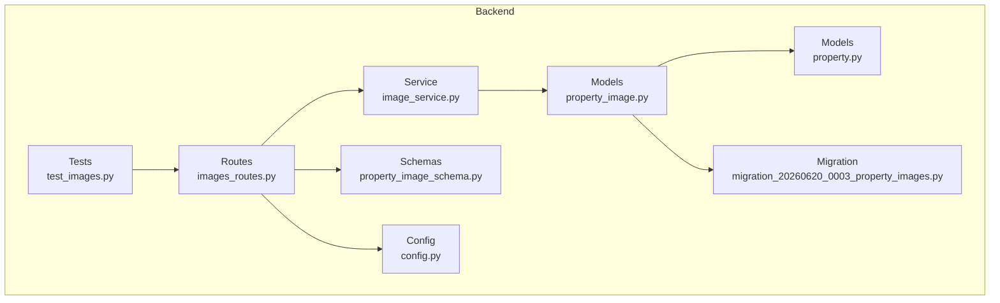
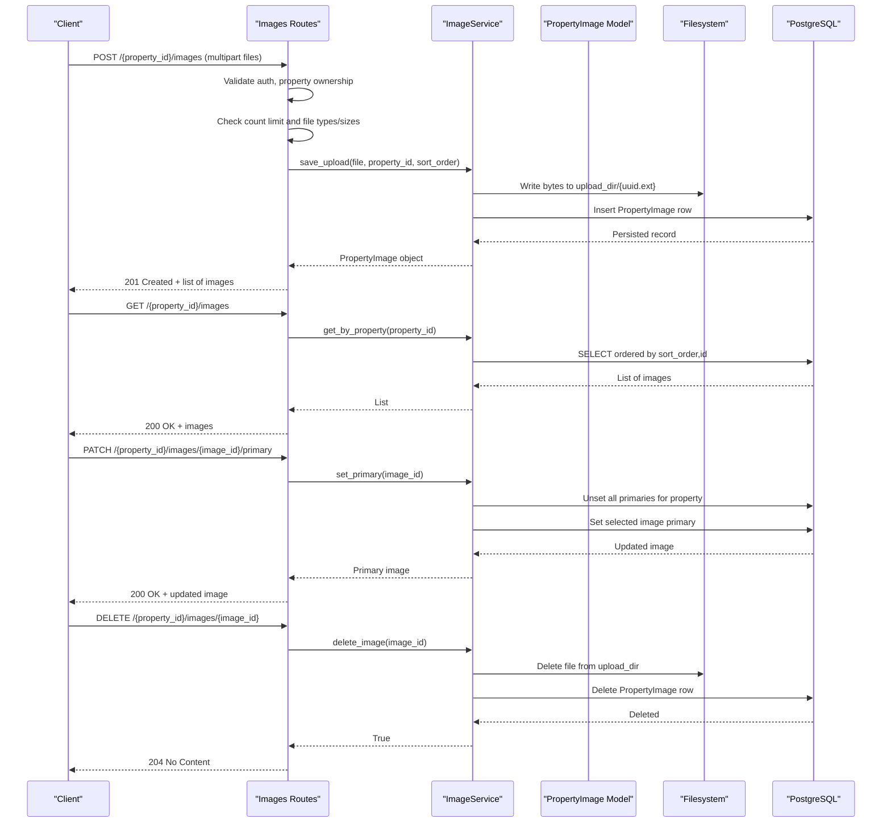
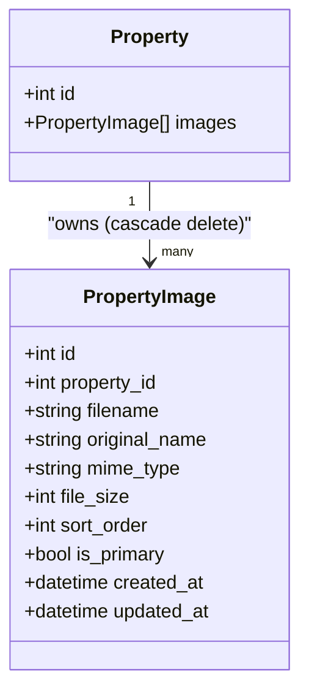
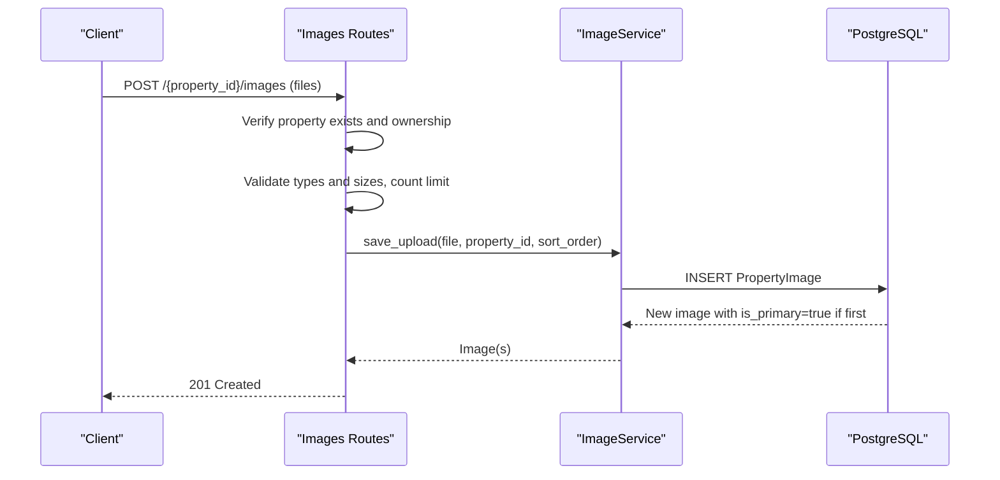
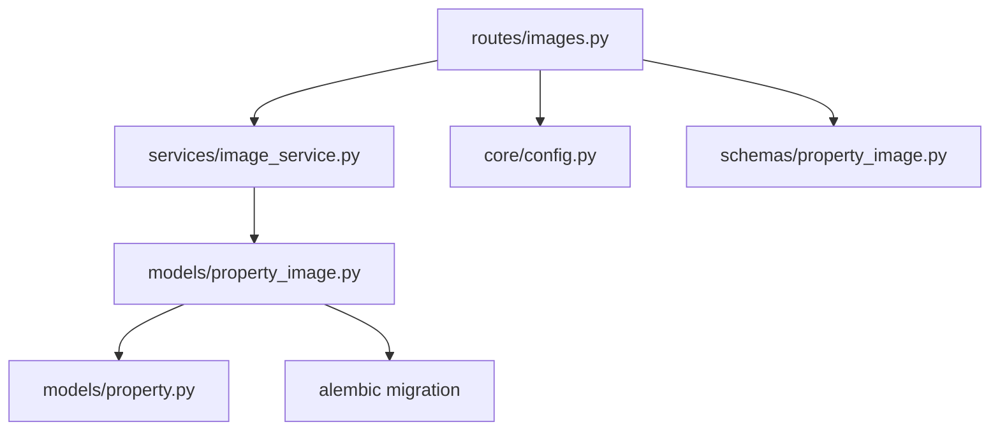

# Property Image Management

<cite>
**Referenced Files in This Document**
- [property_image.py](file://backend/app/models/property_image.py)
- [property.py](file://backend/app/models/property.py)
- [property_image_schema.py](file://backend/app/schemas/property_image.py)
- [image_service.py](file://backend/app/services/image_service.py)
- [images_routes.py](file://backend/app/api/v1/routes/images.py)
- [config.py](file://backend/app/core/config.py)
- [migration_20260620_0003_property_images.py](file://backend/alembic/versions/20260620_0003_property_images.py)
- [test_images.py](file://backend/tests/test_images.py)
</cite>

## Table of Contents
1. [Introduction](#introduction)
2. [Project Structure](#project-structure)
3. [Core Components](#core-components)
4. [Architecture Overview](#architecture-overview)
5. [Detailed Component Analysis](#detailed-component-analysis)
6. [Dependency Analysis](#dependency-analysis)
7. [Performance Considerations](#performance-considerations)
8. [Troubleshooting Guide](#troubleshooting-guide)
9. [Conclusion](#conclusion)
10. [Appendices](#appendices)

## Introduction
This document provides detailed data model documentation for the PropertyImage entity and its surrounding image management functionality. It covers metadata fields, relationships with the Property model (including foreign key constraints and cascade delete), ordering behavior, validation rules, lifecycle from upload to deletion, and example workflows for CRUD operations, bulk uploads, and reordering.

## Project Structure
The PropertyImage feature spans models, schemas, services, API routes, configuration, migrations, and tests:
- Data model: backend/app/models/property_image.py
- Relationship owner: backend/app/models/property.py
- Response schema: backend/app/schemas/property_image.py
- Business logic: backend/app/services/image_service.py
- API endpoints: backend/app/api/v1/routes/images.py
- Configuration (validation limits): backend/app/core/config.py
- Database migration: backend/alembic/versions/20260620_0003_property_images.py
- Tests: backend/tests/test_images.py

**Diagram sources**
- [property_image.py:1-23](file://backend/app/models/property_image.py#L1-L23)
- [property.py:80-86](file://backend/app/models/property.py#L80-L86)
- [property_image_schema.py:1-22](file://backend/app/schemas/property_image.py#L1-L22)
- [image_service.py:1-95](file://backend/app/services/image_service.py#L1-L95)
- [images_routes.py:1-151](file://backend/app/api/v1/routes/images.py#L1-L151)
- [config.py:99-105](file://backend/app/core/config.py#L99-L105)
- [migration_20260620_0003_property_images.py:20-42](file://backend/alembic/versions/20260620_0003_property_images.py#L20-L42)
- [test_images.py:1-249](file://backend/tests/test_images.py#L1-L249)

**Section sources**
- [property_image.py:1-23](file://backend/app/models/property_image.py#L1-L23)
- [property.py:80-86](file://backend/app/models/property.py#L80-L86)
- [property_image_schema.py:1-22](file://backend/app/schemas/property_image.py#L1-L22)
- [image_service.py:1-95](file://backend/app/services/image_service.py#L1-L95)
- [images_routes.py:1-151](file://backend/app/api/v1/routes/images.py#L1-L151)
- [config.py:99-105](file://backend/app/core/config.py#L99-L105)
- [migration_20260620_0003_property_images.py:20-42](file://backend/alembic/versions/20260620_0003_property_images.py#L20-L42)
- [test_images.py:1-249](file://backend/tests/test_images.py#L1-L249)

## Core Components
- PropertyImage model defines the database table and columns for image metadata and display order.
- Property model owns images via a one-to-many relationship with cascade delete.
- ImageService encapsulates upload, listing, primary selection, and deletion logic.
- Images API routes enforce authorization, validate inputs, and orchestrate service calls.
- Config centralizes validation settings such as allowed types, size limits, and per-property caps.
- Migration creates the property_images table with constraints and indexes.

Key responsibilities:
- Metadata persistence: filename, original_name, mime_type, file_size, sort_order, is_primary, timestamps.
- Ordering: sort_order determines sequence; first uploaded becomes primary if none exists.
- Validation: content type and size checks at route layer; unique filename constraint at DB level.
- Lifecycle: upload writes file to disk and persists metadata; delete removes both file and record; primary switching updates flags.

**Section sources**
- [property_image.py:8-23](file://backend/app/models/property_image.py#L8-L23)
- [property.py:84-86](file://backend/app/models/property.py#L84-L86)
- [image_service.py:27-95](file://backend/app/services/image_service.py#L27-L95)
- [images_routes.py:26-151](file://backend/app/api/v1/routes/images.py#L26-L151)
- [config.py:99-105](file://backend/app/core/config.py#L99-L105)
- [migration_20260620_0003_property_images.py:20-42](file://backend/alembic/versions/20260620_0003_property_images.py#L20-L42)

## Architecture Overview
The image management flow integrates FastAPI routes, business logic, ORM models, and filesystem storage.

**Diagram sources**
- [images_routes.py:26-151](file://backend/app/api/v1/routes/images.py#L26-L151)
- [image_service.py:27-95](file://backend/app/services/image_service.py#L27-L95)
- [property_image.py:8-23](file://backend/app/models/property_image.py#L8-L23)

## Detailed Component Analysis

### Data Model: PropertyImage
- Table: property_images
- Columns:
  - id: integer primary key, indexed
  - property_id: integer, foreign key to properties.id with ondelete=CASCADE, indexed
  - filename: string(255), unique, not null
  - original_name: string(255), not null
  - mime_type: string(50), not null
  - file_size: integer, not null
  - sort_order: integer, default 0, not null
  - is_primary: boolean, default false, not null
  - created_at, updated_at: timestamps (from TimestampMixin)
- Indexes: id, property_id
- Constraints: Unique filename, FK cascade delete

Relationships:
- One-to-many with Property via back_populates="images"
- Cascade delete ensures images are removed when the owning property is deleted

Display ordering:
- Images are returned ordered by sort_order ascending, then by id for stability.
- The first image for a property is automatically marked as primary if none exists.

Validation and integrity:
- Unique filename prevents collisions.
- Foreign key enforces referential integrity with cascade delete.

**Section sources**
- [property_image.py:8-23](file://backend/app/models/property_image.py#L8-L23)
- [migration_20260620_0003_property_images.py:20-42](file://backend/alembic/versions/20260620_0003_property_images.py#L20-L42)
- [property.py:84-86](file://backend/app/models/property.py#L84-L86)

#### Class Diagram

**Diagram sources**
- [property.py:84-86](file://backend/app/models/property.py#L84-L86)
- [property_image.py:8-23](file://backend/app/models/property_image.py#L8-L23)

### API Endpoints and Workflows
- Upload multiple images: POST /api/v1/properties/{property_id}/images
  - Validates landlord ownership or admin role
  - Enforces max_images_per_property and allowed_image_types
  - Rejects files exceeding max_upload_size
  - Assigns sequential sort_order based on current count
  - Sets first image as primary if none exists
- List images: GET /api/v1/properties/{property_id}/images
  - Returns images ordered by sort_order, then id
- Set primary image: PATCH /api/v1/properties/{property_id}/images/{image_id}/primary
  - Ensures only one primary per property
- Delete image: DELETE /api/v1/properties/{property_id}/images/{image_id}
  - Removes file from disk and deletes DB record

Authorization:
- Requires authenticated landlord or admin user
- Ownership check against property.landlord_id

Error handling:
- 404 if property or image not found
- 403 if unauthorized
- 400 for invalid type or size or exceeding count limit
- 204 on successful deletion

**Section sources**
- [images_routes.py:26-151](file://backend/app/api/v1/routes/images.py#L26-L151)
- [test_images.py:51-249](file://backend/tests/test_images.py#L51-L249)

#### Sequence Diagram: Upload and Primary Assignment

**Diagram sources**
- [images_routes.py:26-80](file://backend/app/api/v1/routes/images.py#L26-L80)
- [image_service.py:27-52](file://backend/app/services/image_service.py#L27-L52)

### Service Layer: ImageService
Responsibilities:
- Count existing images per property
- Save uploaded file to configured upload directory
- Create and persist PropertyImage records
- Delete image file and record
- Set primary image while unsetting others for the same property
- Retrieve images for a property in correct order

Storage management:
- Uses configurable upload_dir
- Generates safe filenames using UUID with original extension
- Writes raw bytes directly to disk

Ordering:
- sort_order assigned sequentially during upload
- Listing uses ORDER BY sort_order, id

Primary flag:
- First image becomes primary automatically
- Explicit set_primary toggles the flag and clears others

**Section sources**
- [image_service.py:13-95](file://backend/app/services/image_service.py#L13-L95)

### Schema: PropertyImageRead
Response shape includes:
- id, property_id, filename, original_name, mime_type, file_size, sort_order, is_primary, created_at

Note:
- Update timestamp is not exposed in this response schema.

**Section sources**
- [property_image_schema.py:10-22](file://backend/app/schemas/property_image.py#L10-L22)

### Configuration and Validation Rules
Settings used for image validation:
- upload_dir: path where images are stored
- max_upload_size: maximum single file size
- allowed_image_types: list of accepted MIME types
- max_images_per_property: cap on number of images per property

Validation enforcement:
- Route layer checks file.content_type against allowed_image_types
- Route layer checks file.size against max_upload_size
- Route layer checks total count against max_images_per_property
- Database enforces unique filename and FK constraints

Defaults:
- Allowed types include JPEG, PNG, WebP
- Default max upload size is 5 MB
- Default max images per property is 10

**Section sources**
- [config.py:99-105](file://backend/app/core/config.py#L99-L105)
- [images_routes.py:52-71](file://backend/app/api/v1/routes/images.py#L52-L71)

### Database Migration
- Creates property_images table with all required columns
- Adds foreign key to properties.id with ondelete=CASCADE
- Adds unique constraint on filename
- Adds indexes on id and property_id
- Provides default server values for sort_order and is_primary

**Section sources**
- [migration_20260620_0003_property_images.py:20-42](file://backend/alembic/versions/20260620_0003_property_images.py#L20-L42)

### Example Workflows

#### CRUD Operations
- Create: POST /api/v1/properties/{property_id}/images with multipart files
  - Returns list of created images including primary assignment
- Read: GET /api/v1/properties/{property_id}/images
  - Returns ordered list of images
- Update: PATCH /api/v1/properties/{property_id}/images/{image_id}/primary
  - Switches primary image
- Delete: DELETE /api/v1/properties/{property_id}/images/{image_id}
  - Removes file and DB record

**Section sources**
- [images_routes.py:26-151](file://backend/app/api/v1/routes/images.py#L26-L151)
- [test_images.py:63-207](file://backend/tests/test_images.py#L63-L207)

#### Bulk Uploads
- Send multiple files in a single request
- Each file receives a sequential sort_order starting after current count
- If no images exist, the first uploaded becomes primary

**Section sources**
- [images_routes.py:73-80](file://backend/app/api/v1/routes/images.py#L73-L80)
- [image_service.py:37-52](file://backend/app/services/image_service.py#L37-L52)

#### Reordering Workflow
- Current implementation assigns sort_order incrementally during upload
- To reorder, update sort_order values for affected images
- Use a transactional batch update to maintain consistency
- After updates, list endpoint returns images in new order

Note:
- There is no dedicated reorder endpoint; implement by updating sort_order via service or direct SQL within a transaction.

**Section sources**
- [image_service.py:87-95](file://backend/app/services/image_service.py#L87-L95)

### Image Lifecycle
- Upload:
  - Validate ownership, type, size, and count
  - Generate safe filename and write to upload_dir
  - Persist metadata and set primary if needed
- Display:
  - Retrieve images ordered by sort_order, then id
  - Frontend can use filename to construct URLs
- Primary management:
  - Ensure exactly one primary per property
- Deletion:
  - Remove file from upload_dir
  - Delete DB record
- Cleanup:
  - When property is deleted, cascade delete removes all associated images

**Section sources**
- [image_service.py:27-95](file://backend/app/services/image_service.py#L27-L95)
- [property.py:84-86](file://backend/app/models/property.py#L84-L86)

### Thumbnail Generation and Storage Management
Current implementation:
- Stores original files only
- No thumbnail generation or alternate sizes
- Serving uses original filename directly

Recommendations:
- Add thumbnail generation on upload (e.g., resize to fixed dimensions)
- Store thumbnails alongside originals under a structured directory
- Maintain metadata for variants if needed
- Serve thumbnails via separate endpoints or CDN paths

[No sources needed since this section provides general guidance]

## Dependency Analysis

**Diagram sources**
- [images_routes.py:1-151](file://backend/app/api/v1/routes/images.py#L1-L151)
- [image_service.py:1-95](file://backend/app/services/image_service.py#L1-L95)
- [property_image.py:1-23](file://backend/app/models/property_image.py#L1-L23)
- [property.py:1-86](file://backend/app/models/property.py#L1-L86)
- [property_image_schema.py:1-22](file://backend/app/schemas/property_image.py#L1-L22)
- [config.py:99-105](file://backend/app/core/config.py#L99-L105)
- [migration_20260620_0003_property_images.py:20-42](file://backend/alembic/versions/20260620_0003_property_images.py#L20-L42)

**Section sources**
- [images_routes.py:1-151](file://backend/app/api/v1/routes/images.py#L1-L151)
- [image_service.py:1-95](file://backend/app/services/image_service.py#L1-L95)
- [property_image.py:1-23](file://backend/app/models/property_image.py#L1-L23)
- [property.py:1-86](file://backend/app/models/property.py#L1-L86)
- [property_image_schema.py:1-22](file://backend/app/schemas/property_image.py#L1-L22)
- [config.py:99-105](file://backend/app/core/config.py#L99-L105)
- [migration_20260620_0003_property_images.py:20-42](file://backend/alembic/versions/20260620_0003_property_images.py#L20-L42)

## Performance Considerations
- Avoid loading entire file into memory for large uploads; stream to disk instead.
- Use background tasks for heavy processing (e.g., thumbnail generation).
- Leverage indexes on property_id and id for efficient queries.
- Consider pagination for large image sets.
- Cache frequently accessed lists if appropriate.

[No sources needed since this section provides general guidance]

## Troubleshooting Guide
Common issues and resolutions:
- Unauthorized access: Ensure bearer token belongs to landlord or admin; verify property ownership.
- Unsupported file type: Check allowed_image_types and client-side validation.
- File too large: Compare file.size with max_upload_size setting.
- Exceeding image count: Respect max_images_per_property; prompt users to remove images before uploading more.
- Missing file after deletion: Confirm filesystem permissions and upload_dir existence.
- Primary not switching: Ensure only one primary per property; clear others before setting new primary.

**Section sources**
- [images_routes.py:39-71](file://backend/app/api/v1/routes/images.py#L39-L71)
- [image_service.py:54-85](file://backend/app/services/image_service.py#L54-L85)
- [test_images.py:121-207](file://backend/tests/test_images.py#L121-L207)

## Conclusion
The PropertyImage entity provides robust metadata tracking, secure upload handling, and flexible display ordering. Relationships with Property ensure data integrity through cascade delete. While thumbnail generation is not implemented, the design allows straightforward extension. Validation and authorization are enforced at the API layer, and tests cover core behaviors. For production, consider adding streaming uploads, background processing for thumbnails, and explicit reorder endpoints.

[No sources needed since this section summarizes without analyzing specific files]

## Appendices

### Field Reference: PropertyImage
- id: integer primary key
- property_id: integer FK to properties.id (CASCADE)
- filename: string(255), unique
- original_name: string(255)
- mime_type: string(50)
- file_size: integer
- sort_order: integer, default 0
- is_primary: boolean, default false
- created_at, updated_at: timestamps

**Section sources**
- [property_image.py:8-23](file://backend/app/models/property_image.py#L8-L23)
- [migration_20260620_0003_property_images.py:20-42](file://backend/alembic/versions/20260620_0003_property_images.py#L20-L42)

### API Summary
- POST /api/v1/properties/{property_id}/images
  - Request: multipart/form-data with files array
  - Response: list of PropertyImageRead
- GET /api/v1/properties/{property_id}/images
  - Response: list of PropertyImageRead
- PATCH /api/v1/properties/{property_id}/images/{image_id}/primary
  - Response: PropertyImageRead
- DELETE /api/v1/properties/{property_id}/images/{image_id}
  - Response: 204 No Content

**Section sources**
- [images_routes.py:26-151](file://backend/app/api/v1/routes/images.py#L26-L151)
- [property_image_schema.py:10-22](file://backend/app/schemas/property_image.py#L10-L22)