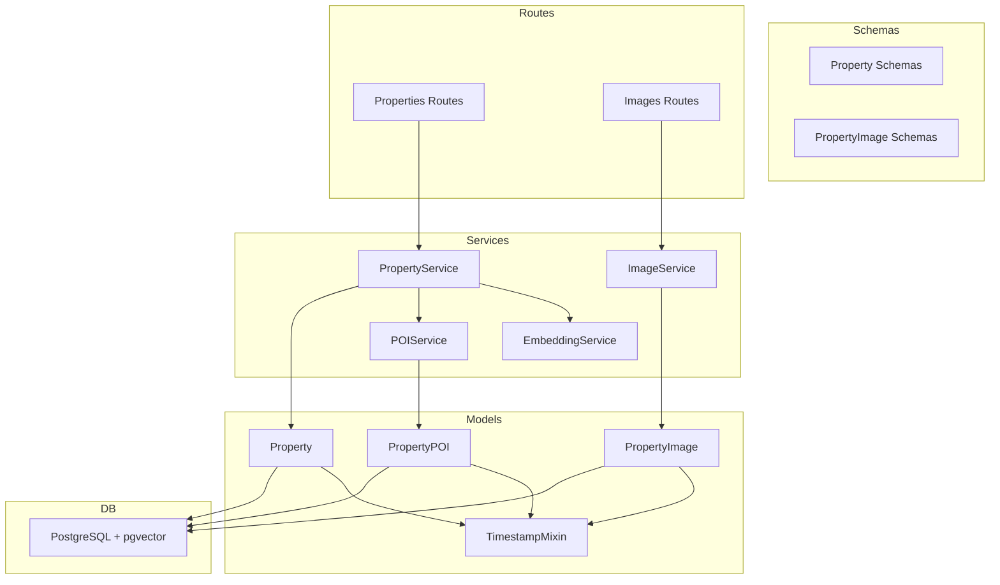
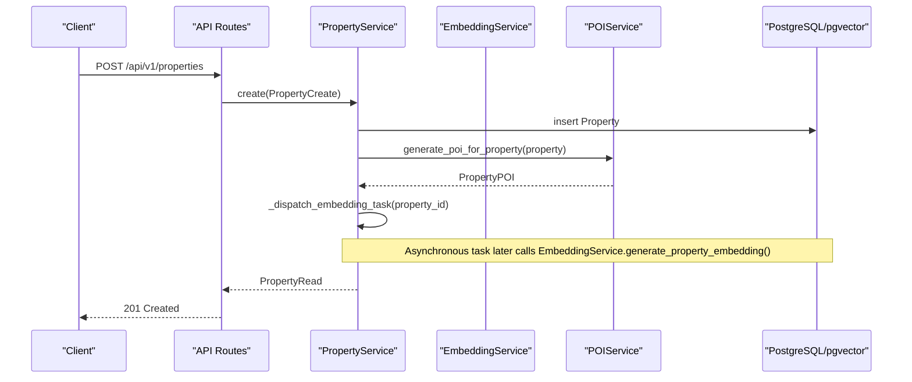
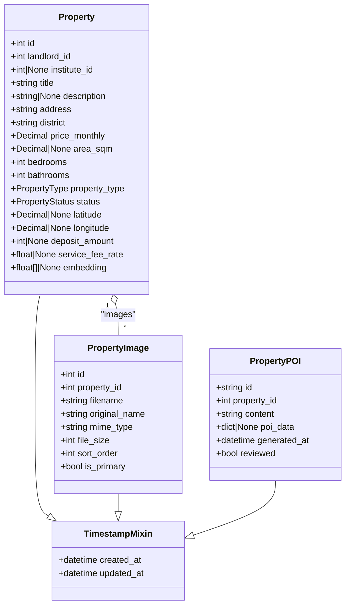
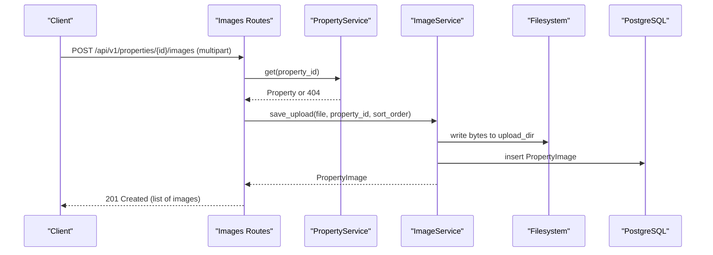
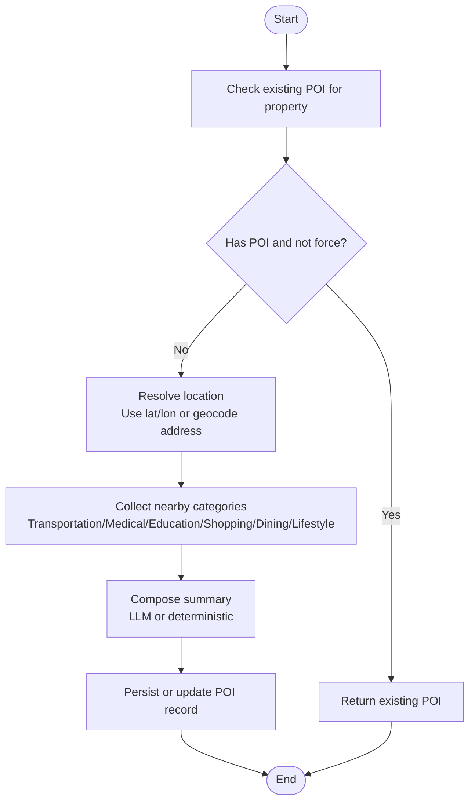
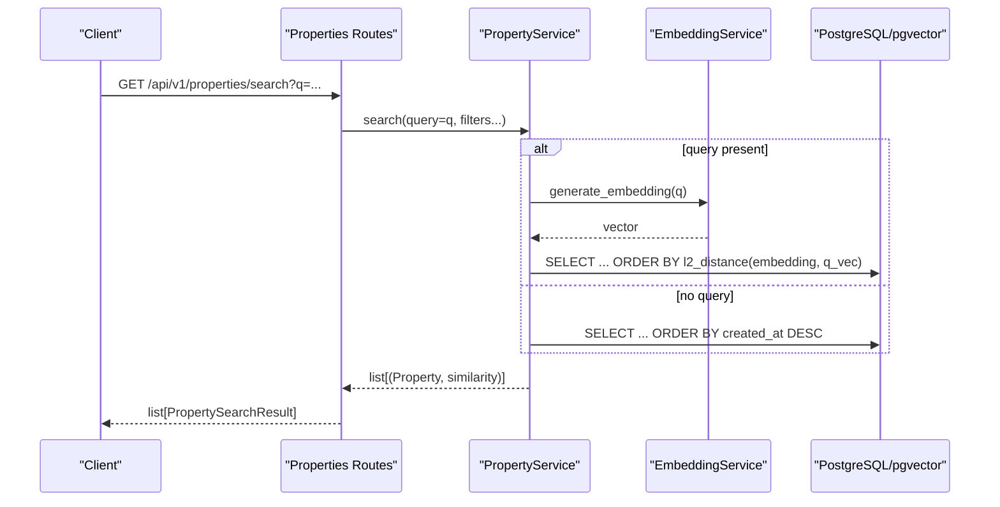
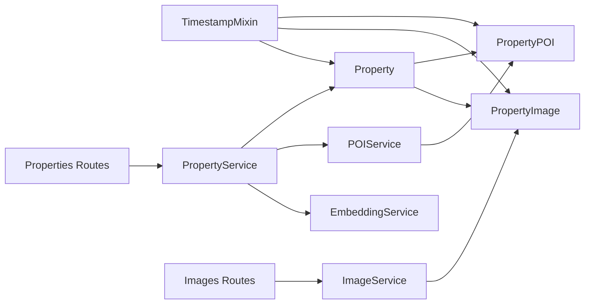

# Property Management Models

<cite>
**Referenced Files in This Document**
- [property.py](file://backend/app/models/property.py)
- [property_image.py](file://backend/app/models/property_image.py)
- [poi.py](file://backend/app/models/poi.py)
- [mixins.py](file://backend/app/models/mixins.py)
- [20260617_0001_initial_users_properties.py](file://backend/alembic/versions/20260617_0001_initial_users_properties.py)
- [20260620_0002_pgvector_embedding.py](file://backend/alembic/versions/20260620_0002_pgvector_embedding.py)
- [20260620_0003_property_images.py](file://backend/alembic/versions/20260620_0003_property_images.py)
- [20260623_0008_deposit_contract_payment_poi.py](file://backend/alembic/versions/20260623_0008_deposit_contract_payment_poi.py)
- [property.py (schemas)](file://backend/app/schemas/property.py)
- [property_image.py (schemas)](file://backend/app/schemas/property_image.py)
- [properties.py (routes)](file://backend/app/api/v1/routes/properties.py)
- [images.py (routes)](file://backend/app/api/v1/routes/images.py)
- [property_service.py](file://backend/app/services/property_service.py)
- [image_service.py](file://backend/app/services/image_service.py)
- [embedding_service.py](file://backend/app/services/embedding_service.py)
- [poi_service.py](file://backend/app/services/poi_service.py)
</cite>

## Table of Contents
1. [Introduction](#introduction)
2. [Project Structure](#project-structure)
3. [Core Components](#core-components)
4. [Architecture Overview](#architecture-overview)
5. [Detailed Component Analysis](#detailed-component-analysis)
6. [Dependency Analysis](#dependency-analysis)
7. [Performance Considerations](#performance-considerations)
8. [Troubleshooting Guide](#troubleshooting-guide)
9. [Conclusion](#conclusion)
10. [Appendices](#appendices)

## Introduction
This document provides detailed data model documentation for property management entities, focusing on the Property, PropertyImage, and POI models. It covers rental information fields, semantic search via pgvector embeddings, image upload metadata and ordering, nearby facilities generation with geographic coordinates and address parsing, location-based indexing, property status lifecycle, validation rules, and examples of CRUD operations, image uploads, and vector embedding generation.

## Project Structure
The property-related data models are implemented using SQLAlchemy ORM with PostgreSQL as the database. Migrations define schema evolution, including the addition of pgvector support and related tables. Pydantic schemas enforce input validation, while services orchestrate business logic such as embedding generation and POI creation. API routes expose endpoints for CRUD and media management.

**Diagram sources**
- [property.py:38-86](file://backend/app/models/property.py#L38-L86)
- [property_image.py:8-23](file://backend/app/models/property_image.py#L8-L23)
- [poi.py:12-28](file://backend/app/models/poi.py#L12-L28)
- [mixins.py:7-19](file://backend/app/models/mixins.py#L7-L19)
- [property.py (schemas):11-79](file://backend/app/schemas/property.py#L11-L79)
- [property_image.py (schemas):6-22](file://backend/app/schemas/property_image.py#L6-L22)
- [property_service.py:44-239](file://backend/app/services/property_service.py#L44-L239)
- [image_service.py:13-95](file://backend/app/services/image_service.py#L13-L95)
- [embedding_service.py:17-32](file://backend/app/services/embedding_service.py#L17-L32)
- [poi_service.py:109-311](file://backend/app/services/poi_service.py#L109-L311)
- [properties.py (routes):16-162](file://backend/app/api/v1/routes/properties.py#L16-L162)
- [images.py (routes):26-151](file://backend/app/api/v1/routes/images.py#L26-L151)

**Section sources**
- [property.py:38-86](file://backend/app/models/property.py#L38-L86)
- [property_image.py:8-23](file://backend/app/models/property_image.py#L8-L23)
- [poi.py:12-28](file://backend/app/models/poi.py#L12-L28)
- [mixins.py:7-19](file://backend/app/models/mixins.py#L7-L19)
- [property.py (schemas):11-79](file://backend/app/schemas/property.py#L11-L79)
- [property_image.py (schemas):6-22](file://backend/app/schemas/property_image.py#L6-L22)
- [property_service.py:44-239](file://backend/app/services/property_service.py#L44-L239)
- [image_service.py:13-95](file://backend/app/services/image_service.py#L13-L95)
- [embedding_service.py:17-32](file://backend/app/services/embedding_service.py#L17-L32)
- [poi_service.py:109-311](file://backend/app/services/poi_service.py#L109-L311)
- [properties.py (routes):16-162](file://backend/app/api/v1/routes/properties.py#L16-L162)
- [images.py (routes):26-151](file://backend/app/api/v1/routes/images.py#L26-L151)

## Core Components
- Property: Represents a rental listing with descriptive, pricing, spatial, and semantic fields. Includes constraints and indexes for performance and integrity.
- PropertyImage: Stores image metadata and ordering per property, supporting primary image selection.
- PropertyPOI: Captures generated nearby points of interest and summary content for each property.

Key characteristics:
- Validation enforced at both schema and DB levels.
- Semantic search supported via pgvector embedding column.
- Location data includes latitude/longitude and district; geocoding is performed when needed.
- Status lifecycle enumerated and indexed for efficient filtering.

**Section sources**
- [property.py:38-86](file://backend/app/models/property.py#L38-L86)
- [property_image.py:8-23](file://backend/app/models/property_image.py#L8-L23)
- [poi.py:12-28](file://backend/app/models/poi.py#L12-L28)

## Architecture Overview
The system integrates models, schemas, services, and routes to provide full CRUD, image management, semantic search, and POI generation workflows.

**Diagram sources**
- [properties.py (routes):16-33](file://backend/app/api/v1/routes/properties.py#L16-L33)
- [property_service.py:48-60](file://backend/app/services/property_service.py#L48-L60)
- [poi_service.py:123-151](file://backend/app/services/poi_service.py#L123-L151)
- [embedding_service.py:30-32](file://backend/app/services/embedding_service.py#L30-L32)

## Detailed Component Analysis

### Property Model
- Purpose: Central entity for rental listings.
- Key fields:
  - Identification and ownership: id, landlord_id, institute_id (optional).
  - Descriptive: title, description, address, district.
  - Pricing and fees: price_monthly, deposit_amount, service_fee_rate.
  - Spatial: area_sqm, bedrooms, bathrooms, latitude, longitude.
  - Classification: property_type, status.
  - Semantic search: embedding (pgvector).
- Constraints and indexes:
  - Non-negative price, positive area if provided, non-negative rooms.
  - Composite index on district and status for filtered queries.
  - Indexes on key lookup columns.
- Relationships:
  - Landlord (User), Institute (optional), images (list), POI (via service).

Validation rules:
- Schema-level: min/max lengths, numeric ranges, enum values.
- DB-level: check constraints ensure data integrity.

Status lifecycle:
- Enumerated states: available, rented, maintenance, offline.
- Default state: available.
- Indexed for efficient filtering by status and district.

Geographic coordinates and indexing:
- Latitude/longitude stored as decimal coordinates.
- District used for coarse filtering and POI generation fallback.
- Geocoding performed when coordinates are missing.

Semantic search:
- embedding column uses pgvector type with dimension 1536.
- IVFFlat index configured for approximate nearest neighbor search.
- Search flow generates query embedding and orders by distance.

CRUD examples:
- Create: POST /api/v1/properties with PropertyCreate payload.
- Read: GET /api/v1/properties/{id} returns PropertyRead with images.
- Update: PATCH /api/v1/properties/{id} with partial updates.
- Delete: DELETE /api/v1/properties/{id}.
- Search: GET /api/v1/properties/search supports natural language and filters.

**Section sources**
- [property.py:38-86](file://backend/app/models/property.py#L38-L86)
- [property.py (schemas):11-79](file://backend/app/schemas/property.py#L11-L79)
- [20260617_0001_initial_users_properties.py:46-75](file://backend/alembic/versions/20260617_0001_initial_users_properties.py#L46-L75)
- [20260620_0002_pgvector_embedding.py:21-35](file://backend/alembic/versions/20260620_0002_pgvector_embedding.py#L21-L35)
- [20260623_0008_deposit_contract_payment_poi.py:22-24](file://backend/alembic/versions/20260623_0008_deposit_contract_payment_poi.py#L22-L24)
- [property_service.py:91-195](file://backend/app/services/property_service.py#L91-L195)
- [properties.py (routes):16-162](file://backend/app/api/v1/routes/properties.py#L16-L162)

#### Class Diagram: Property and Related Entities

**Diagram sources**
- [property.py:38-86](file://backend/app/models/property.py#L38-L86)
- [property_image.py:8-23](file://backend/app/models/property_image.py#L8-L23)
- [poi.py:12-28](file://backend/app/models/poi.py#L12-L28)
- [mixins.py:7-19](file://backend/app/models/mixins.py#L7-L19)

### PropertyImage Model
- Purpose: Manage multiple images per property with metadata and ordering.
- Fields:
  - id, property_id (FK to properties).
  - filename (unique), original_name, mime_type, file_size.
  - sort_order (default 0), is_primary (default false).
  - Timestamps from mixin.
- Behavior:
  - First image uploaded becomes primary automatically.
  - Primary can be reassigned; only one primary per property.
  - Ordered retrieval by sort_order then id.

Upload workflow:
- Route validates property ownership and file types/sizes.
- Service persists file to disk and records metadata.
- Returns list of created images.

**Section sources**
- [property_image.py:8-23](file://backend/app/models/property_image.py#L8-L23)
- [property_image.py (schemas):6-22](file://backend/app/schemas/property_image.py#L6-L22)
- [20260620_0003_property_images.py:20-42](file://backend/alembic/versions/20260620_0003_property_images.py#L20-L42)
- [images.py (routes):26-80](file://backend/app/api/v1/routes/images.py#L26-L80)
- [image_service.py:27-85](file://backend/app/services/image_service.py#L27-L85)

#### Sequence Diagram: Image Upload

**Diagram sources**
- [images.py (routes):26-80](file://backend/app/api/v1/routes/images.py#L26-L80)
- [image_service.py:27-52](file://backend/app/services/image_service.py#L27-L52)

### POI (Point of Interest) Model
- Purpose: Store generated nearby facilities and contextual summaries for each property.
- Fields:
  - id (UUID), property_id (unique FK to properties).
  - content (summary text), poi_data (JSON categories).
  - generated_at (UTC timestamp), reviewed (boolean).
  - Timestamps from mixin.
- Generation process:
  - Resolves location using existing coordinates or geocodes address/district.
  - Collects nearby items across categories (transportation, medical, education, shopping, dining, lifestyle).
  - Composes summary deterministically or via LLM if configured.
  - Persists or updates POI record.

Address parsing and location-based indexing:
- Uses AMap geocoding service to obtain coordinates when missing.
- Nearby search leverages coordinates to fetch categorized POIs.
- Summary generation considers district and collected POIs.

**Section sources**
- [poi.py:12-28](file://backend/app/models/poi.py#L12-L28)
- [20260623_0008_deposit_contract_payment_poi.py:78-94](file://backend/alembic/versions/20260623_0008_deposit_contract_payment_poi.py#L78-L94)
- [poi_service.py:123-195](file://backend/app/services/poi_service.py#L123-L195)
- [property_service.py:48-60](file://backend/app/services/property_service.py#L48-L60)

#### Flowchart: POI Generation

**Diagram sources**
- [poi_service.py:123-195](file://backend/app/services/poi_service.py#L123-L195)

### Vector Embedding Column (pgvector)
- Type: Custom TypeDecorator mapping to pgvector.sqlalchemy.Vector(1536) on PostgreSQL; falls back to text on other dialects.
- Index: IVFFlat index configured with l2_ops and lists=100 for approximate nearest neighbor search.
- Usage:
  - EmbeddingService builds text from property fields and calls OpenAI embeddings API.
  - PropertyService dispatches an asynchronous task to generate and persist embeddings.
  - Search endpoint computes similarity using l2_distance and orders results accordingly.

**Section sources**
- [property.py:12-22](file://backend/app/models/property.py#L12-L22)
- [20260620_0002_pgvector_embedding.py:21-35](file://backend/alembic/versions/20260620_0002_pgvector_embedding.py#L21-L35)
- [embedding_service.py:17-32](file://backend/app/services/embedding_service.py#L17-L32)
- [property_service.py:225-239](file://backend/app/services/property_service.py#L225-L239)
- [property_service.py:91-195](file://backend/app/services/property_service.py#L91-L195)

#### Sequence Diagram: Semantic Search

**Diagram sources**
- [properties.py (routes):36-91](file://backend/app/api/v1/routes/properties.py#L36-L91)
- [property_service.py:91-195](file://backend/app/services/property_service.py#L91-L195)
- [embedding_service.py:23-28](file://backend/app/services/embedding_service.py#L23-L28)

## Dependency Analysis
- Models depend on mixins for timestamps and on Base for ORM registration.
- Services depend on models and external clients (OpenAI, AMap).
- Routes depend on services and schemas for request/response validation.
- Database migrations define schema changes and indexes.

**Diagram sources**
- [mixins.py:7-19](file://backend/app/models/mixins.py#L7-L19)
- [property.py:38-86](file://backend/app/models/property.py#L38-L86)
- [property_image.py:8-23](file://backend/app/models/property_image.py#L8-L23)
- [poi.py:12-28](file://backend/app/models/poi.py#L12-L28)
- [properties.py (routes):16-162](file://backend/app/api/v1/routes/properties.py#L16-L162)
- [images.py (routes):26-151](file://backend/app/api/v1/routes/images.py#L26-L151)
- [property_service.py:44-239](file://backend/app/services/property_service.py#L44-L239)
- [image_service.py:13-95](file://backend/app/services/image_service.py#L13-L95)
- [embedding_service.py:17-32](file://backend/app/services/embedding_service.py#L17-L32)
- [poi_service.py:109-311](file://backend/app/services/poi_service.py#L109-L311)

**Section sources**
- [mixins.py:7-19](file://backend/app/models/mixins.py#L7-L19)
- [property.py:38-86](file://backend/app/models/property.py#L38-L86)
- [property_image.py:8-23](file://backend/app/models/property_image.py#L8-L23)
- [poi.py:12-28](file://backend/app/models/poi.py#L12-L28)
- [properties.py (routes):16-162](file://backend/app/api/v1/routes/properties.py#L16-L162)
- [images.py (routes):26-151](file://backend/app/api/v1/routes/images.py#L26-L151)
- [property_service.py:44-239](file://backend/app/services/property_service.py#L44-L239)
- [image_service.py:13-95](file://backend/app/services/image_service.py#L13-L95)
- [embedding_service.py:17-32](file://backend/app/services/embedding_service.py#L17-L32)
- [poi_service.py:109-311](file://backend/app/services/poi_service.py#L109-L311)

## Performance Considerations
- Indexing:
  - Composite index on district and status improves filtered listing performance.
  - IVFFlat index on embedding enables fast approximate nearest neighbor searches.
- Caching:
  - Non-vector search results cached in Redis with TTL to reduce DB load.
- Asynchronous tasks:
  - Embedding generation dispatched asynchronously to avoid blocking requests.
- File I/O:
  - Image uploads write directly to filesystem; consider CDN or object storage for scale.

[No sources needed since this section provides general guidance]

## Troubleshooting Guide
Common issues and resolutions:
- Missing coordinates:
  - Ensure geocoding service is configured; POI generation will attempt to resolve address to coordinates.
- Embedding failures:
  - Verify OpenAI API key and model configuration; embedding tasks run asynchronously and may fail silently if client unavailable.
- Image upload errors:
  - Validate allowed file types and size limits; ensure upload directory exists and is writable.
- POI generation timeouts:
  - Fallback mechanisms use mock data per district; review logs for AMap/OpenAI errors.

**Section sources**
- [poi_service.py:153-195](file://backend/app/services/poi_service.py#L153-L195)
- [embedding_service.py:17-32](file://backend/app/services/embedding_service.py#L17-L32)
- [images.py (routes):60-71](file://backend/app/api/v1/routes/images.py#L60-L71)
- [image_service.py:27-52](file://backend/app/services/image_service.py#L27-L52)

## Conclusion
The property management data models provide a robust foundation for rental listings with rich metadata, semantic search capabilities, image management, and dynamic POI generation. The combination of schema validations, database constraints, and service-layer orchestration ensures data integrity and scalability.

[No sources needed since this section summarizes without analyzing specific files]

## Appendices

### Data Model Reference Tables

- Property
  - id: integer PK
  - landlord_id: integer FK to users
  - institute_id: integer nullable FK to institutes
  - title: string max 200
  - description: text nullable
  - address: string max 300
  - district: string max 100
  - price_monthly: numeric(12,2) >= 0
  - area_sqm: numeric(8,2) > 0 if provided
  - bedrooms: integer >= 0
  - bathrooms: integer >= 0
  - property_type: enum apartment/house/studio/shared
  - status: enum available/rented/maintenance/offline
  - latitude: numeric(9,6) nullable
  - longitude: numeric(9,6) nullable
  - deposit_amount: integer default 1000
  - service_fee_rate: float default 0.10
  - embedding: vector(1536) nullable
  - relationships: landlord, institute, images

- PropertyImage
  - id: integer PK
  - property_id: integer FK to properties
  - filename: string unique
  - original_name: string
  - mime_type: string
  - file_size: integer
  - sort_order: integer default 0
  - is_primary: boolean default false
  - timestamps: created_at, updated_at

- PropertyPOI
  - id: uuid PK
  - property_id: integer unique FK to properties
  - content: text
  - poi_data: json nullable
  - generated_at: datetime UTC
  - reviewed: boolean default false
  - timestamps: created_at, updated_at

**Section sources**
- [property.py:38-86](file://backend/app/models/property.py#L38-L86)
- [property_image.py:8-23](file://backend/app/models/property_image.py#L8-L23)
- [poi.py:12-28](file://backend/app/models/poi.py#L12-L28)
- [20260617_0001_initial_users_properties.py:46-75](file://backend/alembic/versions/20260617_0001_initial_users_properties.py#L46-L75)
- [20260620_0002_pgvector_embedding.py:21-35](file://backend/alembic/versions/20260620_0002_pgvector_embedding.py#L21-L35)
- [20260620_0003_property_images.py:20-42](file://backend/alembic/versions/20260620_0003_property_images.py#L20-L42)
- [20260623_0008_deposit_contract_payment_poi.py:78-94](file://backend/alembic/versions/20260623_0008_deposit_contract_payment_poi.py#L78-L94)