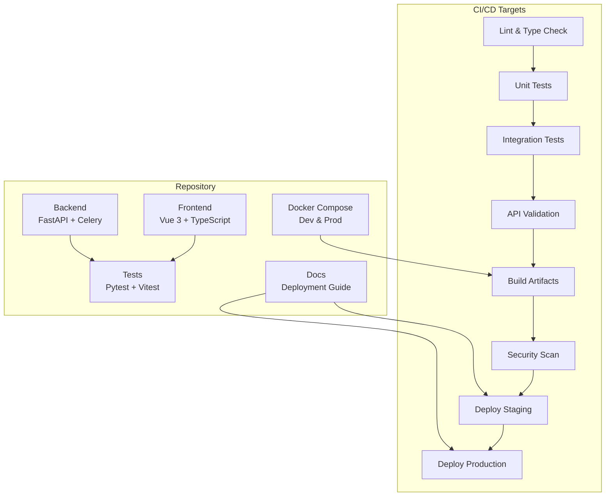
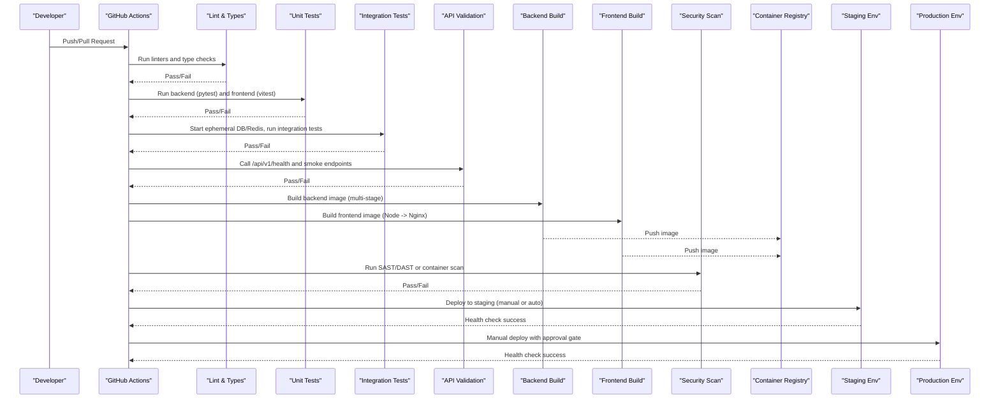
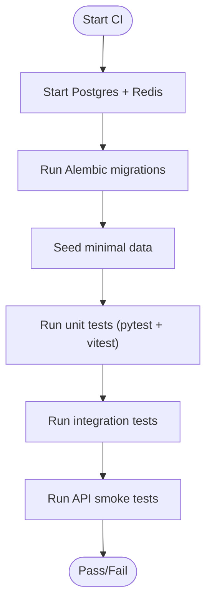
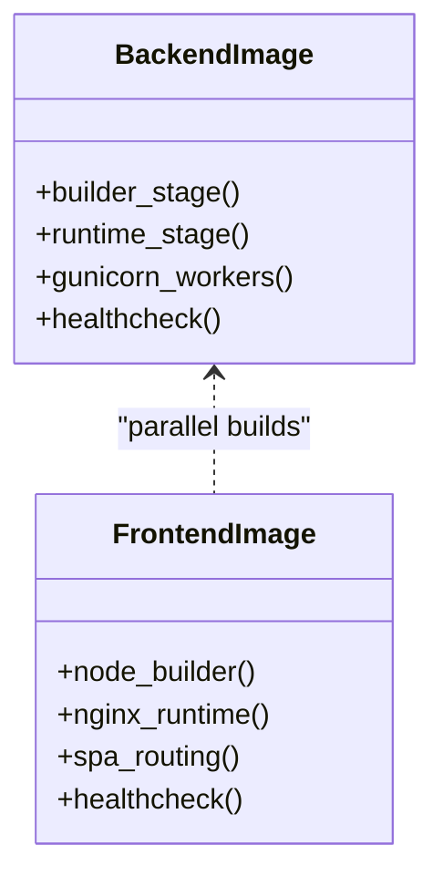
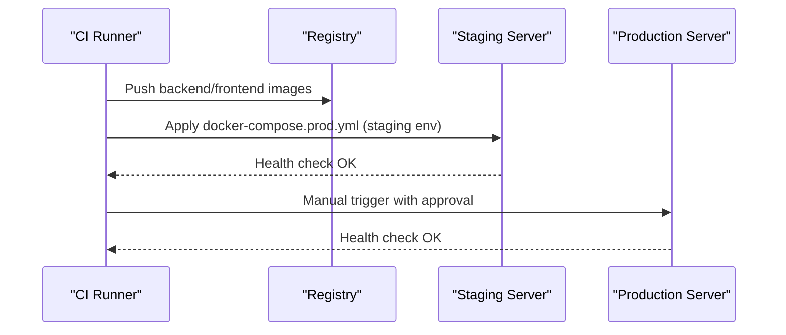
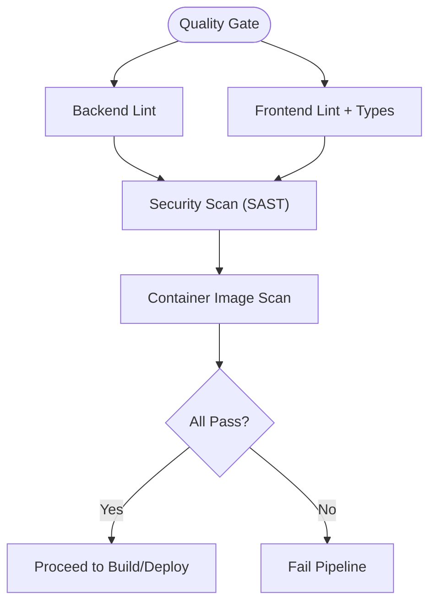
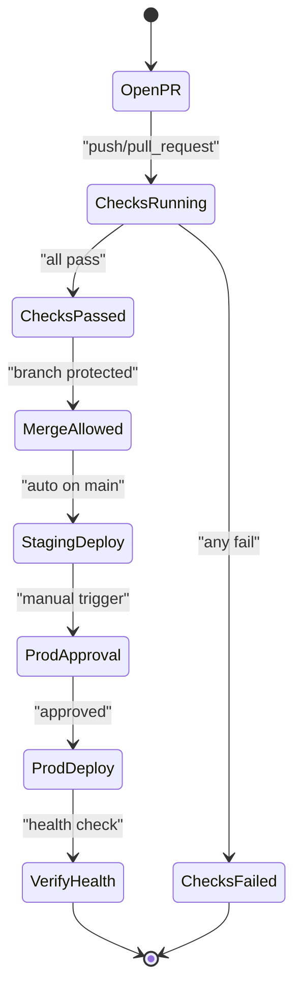
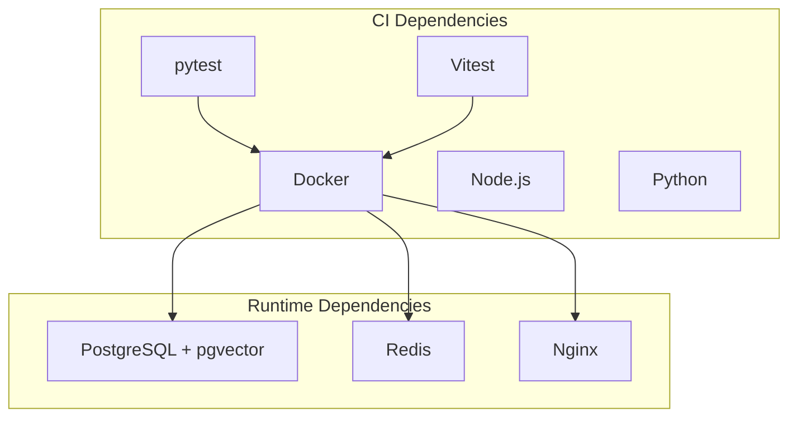
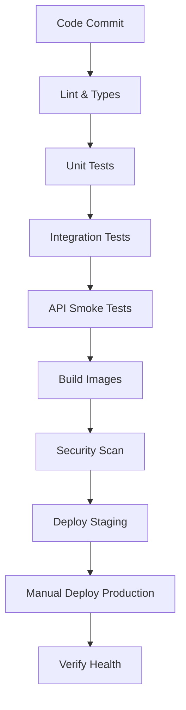

# CI/CD Pipeline Automation

<cite>
**Referenced Files in This Document**
- [README.md](file://README.md)
- [DEPLOYMENT.md](file://DEPLOYMENT.md)
- [docker-compose.yml](file://docker-compose.yml)
- [docker-compose.prod.yml](file://docker-compose.prod.yml)
- [backend/Dockerfile](file://backend/Dockerfile)
- [frontend/Dockerfile](file://frontend/Dockerfile)
- [backend/pytest.ini](file://backend/pytest.ini)
- [frontend/package.json](file://frontend/package.json)
</cite>

## Table of Contents
1. [Introduction](#introduction)
2. [Project Structure](#project-structure)
3. [Core Components](#core-components)
4. [Architecture Overview](#architecture-overview)
5. [Detailed Component Analysis](#detailed-component-analysis)
6. [Dependency Analysis](#dependency-analysis)
7. [Performance Considerations](#performance-considerations)
8. [Troubleshooting Guide](#troubleshooting-guide)
9. [Conclusion](#conclusion)
10. [Appendices](#appendices)

## Introduction
This document describes a comprehensive CI/CD pipeline automation strategy for the Rental Housing Matching System using GitHub Actions. It covers automated testing (unit, integration, and API endpoint validation), build pipelines for backend and frontend with dependency caching and parallel execution, deployment workflows with environment-specific configurations, artifact management, and deployment verification. It also includes code quality checks, linting, security scanning, manual triggers, branch protection rules, approvals, troubleshooting, logging, and performance optimization guidance.

The repository is structured as a multi-service application:
- Backend: FastAPI + PostgreSQL/pgvector + Celery + Redis
- Frontend: Vue 3 + TypeScript + Vite, served by Nginx
- Mobile: WeChat Mini Program (native)
- Infrastructure: Docker Compose for development and production

The project README indicates that CI/CD pipelines are intended under .github/workflows, but no workflow files are present in this workspace snapshot. Therefore, this document provides a complete blueprint and implementation plan aligned with the existing configuration and tooling.

[No sources needed since this section summarizes without analyzing specific files]

## Project Structure
The repository organizes services and infrastructure to support a robust CI/CD flow:
- Backend tests and configuration: pytest markers and async fixture scope
- Frontend scripts: type checking, building, and unit tests via Vitest
- Dockerfiles: multi-stage builds for both backend and frontend
- Docker Compose: development and production stacks with health checks and resource constraints

**Section sources**
- [README.md:22-62](file://README.md#L22-L62)
- [DEPLOYMENT.md:1-40](file://DEPLOYMENT.md#L1-L40)

## Core Components
- Backend test configuration:
  - Pytest settings define async fixture loop scope and markers for pgvector-dependent tests.
- Frontend test and build scripts:
  - Scripts include dev, build, preview, test, watch, and coverage commands.
- Docker images:
  - Backend uses multi-stage Python image with gunicorn + uvicorn workers and a non-root user.
  - Frontend uses Node builder and Nginx runtime with SPA routing config.
- Docker Compose:
  - Development stack defines Postgres (pgvector) and Redis with health checks.
  - Production stack defines all services, networks, volumes, resource limits, and logging.

Key implications for CI/CD:
- Use separate jobs for backend and frontend to enable parallel execution.
- Cache pip and npm dependencies to speed up builds.
- Run unit tests first, then integration tests against ephemeral databases and caches.
- Build container images and push to a registry; use artifacts for static frontend assets if needed.
- Deploy to staging on merge to main, and deploy to production via manual trigger with approval gates.

**Section sources**
- [backend/pytest.ini:1-5](file://backend/pytest.ini#L1-L5)
- [frontend/package.json:6-13](file://frontend/package.json#L6-L13)
- [backend/Dockerfile:1-61](file://backend/Dockerfile#L1-L61)
- [frontend/Dockerfile:1-29](file://frontend/Dockerfile#L1-L29)
- [docker-compose.yml:1-53](file://docker-compose.yml#L1-L53)
- [docker-compose.prod.yml:1-217](file://docker-compose.prod.yml#L1-L217)

## Architecture Overview
The CI/CD architecture integrates multiple stages across backend and frontend, culminating in staged deployments with verification and rollback strategies.

**Diagram sources**
- [backend/Dockerfile:1-61](file://backend/Dockerfile#L1-L61)
- [frontend/Dockerfile:1-29](file://frontend/Dockerfile#L1-L29)
- [docker-compose.prod.yml:66-196](file://docker-compose.prod.yml#L66-L196)
- [README.md:132-195](file://README.md#L132-L195)

## Detailed Component Analysis

### Automated Testing Workflow
- Unit tests:
  - Backend: pytest with async fixtures and pgvector marker for tests requiring real PostgreSQL.
  - Frontend: Vitest runs unit tests for components and stores.
- Integration tests:
  - Spin up ephemeral PostgreSQL (with pgvector) and Redis in CI.
  - Execute database migrations and seed data before running tests.
- API endpoint validation:
  - Smoke tests call /api/v1/health and critical routes to verify service readiness.

**Section sources**
- [backend/pytest.ini:1-5](file://backend/pytest.ini#L1-L5)
- [frontend/package.json:6-13](file://frontend/package.json#L6-L13)
- [docker-compose.yml:9-27](file://docker-compose.yml#L9-L27)
- [docker-compose.yml:29-46](file://docker-compose.yml#L29-L46)
- [README.md:132-141](file://README.md#L132-L141)

### Build Pipeline (Backend and Frontend)
- Backend build:
  - Multi-stage Dockerfile installs system deps, copies requirements, installs Python packages, and runs app with gunicorn + uvicorn workers.
  - Non-root user and health check configured.
- Frontend build:
  - Node-based builder installs dependencies and builds static assets; Nginx runtime serves SPA.
- Dependency caching:
  - Cache pip wheels and npm modules between jobs to reduce install times.
- Parallel execution:
  - Separate jobs for backend and frontend to maximize throughput.

**Diagram sources**
- [backend/Dockerfile:1-61](file://backend/Dockerfile#L1-L61)
- [frontend/Dockerfile:1-29](file://frontend/Dockerfile#L1-L29)

**Section sources**
- [backend/Dockerfile:1-61](file://backend/Dockerfile#L1-L61)
- [frontend/Dockerfile:1-29](file://frontend/Dockerfile#L1-L29)

### Deployment Workflow
- Environment-specific configurations:
  - Development: docker-compose.yml with local ports and volumes.
  - Production: docker-compose.prod.yml with env_file, networks, resource limits, and logging.
- Artifact management:
  - Container images pushed to registry; optional static frontend artifacts for CDN distribution.
- Deployment verification:
  - Health checks at /api/v1/health and Nginx root route.
  - Database migration step post-deploy.
- Staged rollout:
  - Auto-deploy to staging on main branch merge.
  - Manual deploy to production with approval gates.

**Diagram sources**
- [docker-compose.prod.yml:1-217](file://docker-compose.prod.yml#L1-L217)
- [DEPLOYMENT.md:11-39](file://DEPLOYMENT.md#L11-L39)
- [README.md:126-130](file://README.md#L126-L130)

**Section sources**
- [docker-compose.yml:1-53](file://docker-compose.yml#L1-L53)
- [docker-compose.prod.yml:1-217](file://docker-compose.prod.yml#L1-L217)
- [DEPLOYMENT.md:1-40](file://DEPLOYMENT.md#L1-L40)
- [README.md:126-130](file://README.md#L126-L130)

### Code Quality, Linting, and Security Scanning
- Linting and type checks:
  - Backend: optional ruff/flake8/pyright steps.
  - Frontend: vue-tsc and ESLint/Prettier steps.
- Security scanning:
  - Static analysis (SAST) for Python and TypeScript.
  - Container image scanning for vulnerabilities.
  - Optional DAST against staging endpoints.

[No sources needed since this section provides general guidance]

### Manual Triggers, Branch Protection, and Approvals
- Manual triggers:
  - Production deployment job gated by manual input and environment protection rules.
- Branch protection:
  - Require status checks (lint, tests, build) to pass before merging.
  - Require pull request reviews for changes to sensitive paths (e.g., docker-compose.prod.yml).
- Approvals:
  - Enforce required reviewers for production deployments.
  - Use GitHub environments with secrets and approval rules.

[No sources needed since this section provides general guidance]

## Dependency Analysis
The CI/CD pipeline depends on:
- Test runners: pytest and Vitest
- Build tools: Docker, Node, Python
- Services: PostgreSQL (pgvector), Redis
- Deployment: Docker Compose and server environment variables

**Diagram sources**
- [backend/pytest.ini:1-5](file://backend/pytest.ini#L1-L5)
- [frontend/package.json:6-13](file://frontend/package.json#L6-L13)
- [docker-compose.yml:9-27](file://docker-compose.yml#L9-L27)
- [docker-compose.yml:29-46](file://docker-compose.yml#L29-L46)
- [docker-compose.prod.yml:170-196](file://docker-compose.prod.yml#L170-L196)

**Section sources**
- [backend/pytest.ini:1-5](file://backend/pytest.ini#L1-L5)
- [frontend/package.json:6-13](file://frontend/package.json#L6-L13)
- [docker-compose.yml:1-53](file://docker-compose.yml#L1-L53)
- [docker-compose.prod.yml:1-217](file://docker-compose.prod.yml#L1-L217)

## Performance Considerations
- Dependency caching:
  - Cache pip wheels and npm modules to accelerate subsequent runs.
- Parallel jobs:
  - Run backend and frontend jobs concurrently.
- Incremental builds:
  - Leverage Docker layer caching and Node/Vite incremental compilation.
- Resource limits:
  - Use appropriate runner sizes and limit container resources in production.
- Test partitioning:
  - Split large test suites into shards to reduce total runtime.
- Artifact reuse:
  - Reuse built artifacts across jobs where possible.

[No sources needed since this section provides general guidance]

## Troubleshooting Guide
Common issues and resolutions:
- Service startup failures:
  - Inspect logs for backend, celery-worker, celery-beat, and nginx.
- Database connectivity errors:
  - Ensure health checks pass and credentials match environment variables.
- Redis connection errors:
  - Validate password and network isolation.
- Disk space exhaustion:
  - Clean unused images and containers; prune old artifacts.
- Celery task stalls:
  - Review worker logs and queue backlogs.

Operational references:
- Health endpoints:
  - Backend: /api/v1/health
  - Frontend: Nginx root route
- Logs:
  - Docker Compose logs per service
- Backups and restores:
  - PostgreSQL dump and restore procedures

**Section sources**
- [docker-compose.prod.yml:94-98](file://docker-compose.prod.yml#L94-L98)
- [docker-compose.prod.yml:133-137](file://docker-compose.prod.yml#L133-L137)
- [docker-compose.prod.yml:164-168](file://docker-compose.prod.yml#L164-L168)
- [docker-compose.prod.yml:191-195](file://docker-compose.prod.yml#L191-L195)
- [DEPLOYMENT.md:86-121](file://DEPLOYMENT.md#L86-L121)
- [README.md:126-130](file://README.md#L126-L130)

## Conclusion
This CI/CD blueprint aligns with the repository’s current structure and tooling, providing a clear path from code commit to production deployment. By implementing parallelized builds, robust testing, security scanning, and staged deployments with verification, teams can achieve reliable and fast delivery cycles. The next step is to create the actual GitHub Actions workflow files under .github/workflows and integrate them with repository settings for branch protection and environment approvals.

[No sources needed since this section summarizes without analyzing specific files]

## Appendices

### Example Pipeline Stages (Conceptual)
- Lint and type checks
- Unit tests (backend + frontend)
- Integration tests (ephemeral DB + Redis)
- API smoke tests
- Build and push images
- Security scans
- Deploy to staging
- Manual deploy to production with approval

[No sources needed since this diagram shows conceptual workflow, not actual code structure]