# Deployment & DevOps

<cite>
**Referenced Files in This Document**
- [docker-compose.yml](file://docker-compose.yml)
- [docker-compose.prod.yml](file://docker-compose.prod.yml)
- [backend/Dockerfile](file://backend/Dockerfile)
- [frontend/Dockerfile](file://frontend/Dockerfile)
- [frontend/nginx/nginx.conf](file://frontend/nginx/nginx.conf)
- [DEPLOYMENT.md](file://DEPLOYMENT.md)
- [backend/app/core/config.py](file://backend/app/core/config.py)
- [backend/app/core/monitoring.py](file://backend/app/core/monitoring.py)
- [backend/app/core/logging.py](file://backend/app/core/logging.py)
- [backend/app/api/v1/routes/health.py](file://backend/app/api/v1/routes/health.py)
</cite>

## Table of Contents
1. [Introduction](#introduction)
2. [Project Structure](#project-structure)
3. [Core Components](#core-components)
4. [Architecture Overview](#architecture-overview)
5. [Detailed Component Analysis](#detailed-component-analysis)
6. [Dependency Analysis](#dependency-analysis)
7. [Performance Considerations](#performance-considerations)
8. [Troubleshooting Guide](#troubleshooting-guide)
9. [Conclusion](#conclusion)
10. [Appendices](#appendices)

## Introduction
This document provides comprehensive deployment and DevOps guidance for the Rental Housing Structure project. It covers containerization with multi-stage builds, development environment setup using Docker Compose, production deployment with Nginx reverse proxy, SSL/HTTPS via Let’s Encrypt, database backup strategies, monitoring with Prometheus metrics, structured logging, health checks, scaling, load balancing, disaster recovery, CI/CD considerations, secrets management, environment-specific configuration, and operational checklists.

## Project Structure
The repository is organized into backend (FastAPI + Celery), frontend (Vue 3 SPA served by Nginx), and shared infrastructure definitions:
- Backend services: API server, Celery worker, Celery beat
- Data layer: PostgreSQL with pgvector extension, Redis with AOF persistence
- Edge: Nginx as reverse proxy and static asset server
- Configuration: Environment variables via .env files; settings loaded at runtime
- Monitoring: Prometheus metrics endpoint and structured JSON logs
- Health: Dedicated health endpoint used by orchestrators

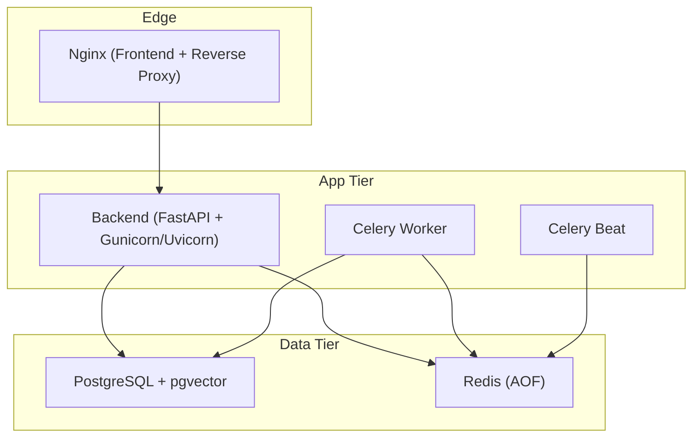

**Diagram sources**
- [docker-compose.prod.yml:66-196](file://docker-compose.prod.yml#L66-L196)
- [frontend/nginx/nginx.conf:1-89](file://frontend/nginx/nginx.conf#L1-89)

**Section sources**
- [docker-compose.yml:1-53](file://docker-compose.yml#L1-L53)
- [docker-compose.prod.yml:1-217](file://docker-compose.prod.yml#L1-L217)

## Core Components
- Container images
  - Backend: Multi-stage build to minimize image size and run as non-root user with Gunicorn + Uvicorn workers
  - Frontend: Build Vue app with Node, serve static assets via Nginx
- Orchestration
  - Development compose: Postgres, Redis, optional app services
  - Production compose: Postgres, Redis, Backend, Celery Worker, Celery Beat, Nginx with resource limits and logging rotation
- Reverse proxy
  - Nginx routes /api/* to backend, serves SPA assets, exposes /metrics internally
- Observability
  - Prometheus metrics (/metrics) and structured JSON logging
  - Health endpoint (/api/v1/health)
- Configuration
  - Pydantic Settings with env_file support and validation aliases

**Section sources**
- [backend/Dockerfile:1-61](file://backend/Dockerfile#L1-L61)
- [frontend/Dockerfile:1-29](file://frontend/Dockerfile#L1-L29)
- [docker-compose.prod.yml:66-196](file://docker-compose.prod.yml#L66-L196)
- [frontend/nginx/nginx.conf:1-89](file://frontend/nginx/nginx.conf#L1-89)
- [backend/app/core/config.py:1-167](file://backend/app/core/config.py#L1-L167)
- [backend/app/core/monitoring.py:1-227](file://backend/app/core/monitoring.py#L1-L227)
- [backend/app/core/logging.py:1-231](file://backend/app/core/logging.py#L1-L231)
- [backend/app/api/v1/routes/health.py:1-8](file://backend/app/api/v1/routes/health.py#L1-L8)

## Architecture Overview
End-to-end request flow from client to backend and data stores, including metrics and logging.

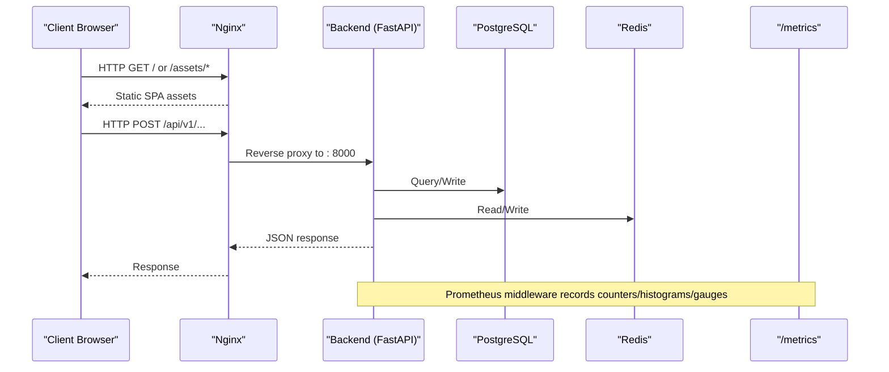

**Diagram sources**
- [frontend/nginx/nginx.conf:39-67](file://frontend/nginx/nginx.conf#L39-L67)
- [backend/app/core/monitoring.py:126-176](file://backend/app/core/monitoring.py#L126-L176)
- [docker-compose.prod.yml:66-196](file://docker-compose.prod.yml#L66-L196)

## Detailed Component Analysis

### Docker Images and Multi-Stage Builds
- Backend image
  - Builder stage installs system deps and Python packages
  - Runtime stage copies only necessary artifacts, runs as non-root, exposes port 8000, defines HEALTHCHECK
  - Entrypoint uses Gunicorn with Uvicorn workers tuned for production
- Frontend image
  - Builder stage installs dependencies and builds the Vue app
  - Runtime stage uses Nginx to serve built assets and proxy API calls

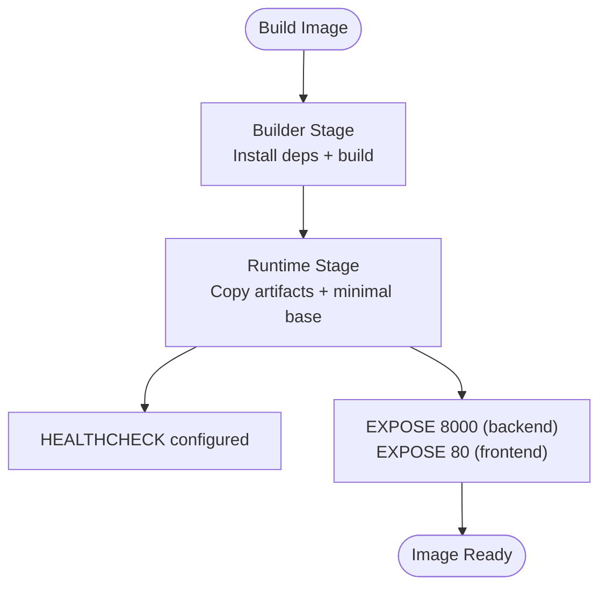

**Diagram sources**
- [backend/Dockerfile:1-61](file://backend/Dockerfile#L1-L61)
- [frontend/Dockerfile:1-29](file://frontend/Dockerfile#L1-L29)

**Section sources**
- [backend/Dockerfile:1-61](file://backend/Dockerfile#L1-L61)
- [frontend/Dockerfile:1-29](file://frontend/Dockerfile#L1-L29)

### Development Environment with Docker Compose
- Services
  - PostgreSQL with pgvector init script mounted under entrypoint directory
  - Redis with AOF enabled and memory policy
  - Healthchecks for both services
- Volumes
  - Named volumes for persistent data across restarts
- Usage
  - Start with docker compose up -d

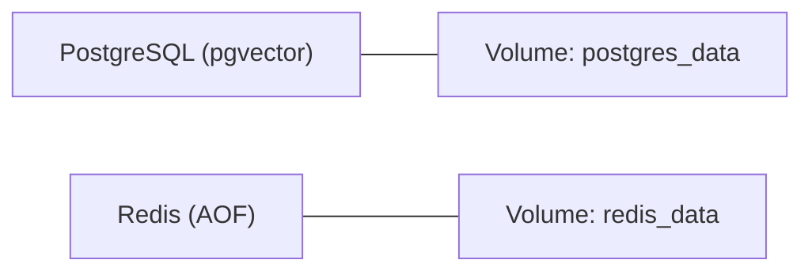

**Diagram sources**
- [docker-compose.yml:9-53](file://docker-compose.yml#L9-L53)

**Section sources**
- [docker-compose.yml:1-53](file://docker-compose.yml#L1-L53)

### Production Deployment with Docker Compose
- Services
  - PostgreSQL with resource limits and healthcheck
  - Redis with password protection and AOF
  - Backend with env_file and dependency on healthy data services
  - Celery worker and beat with concurrency and queue configuration
  - Nginx serving frontend and proxying API
- Networking
  - Three-tier isolation: frontend, backend, data networks
- Logging
  - json-file driver with max-size and max-file rotation

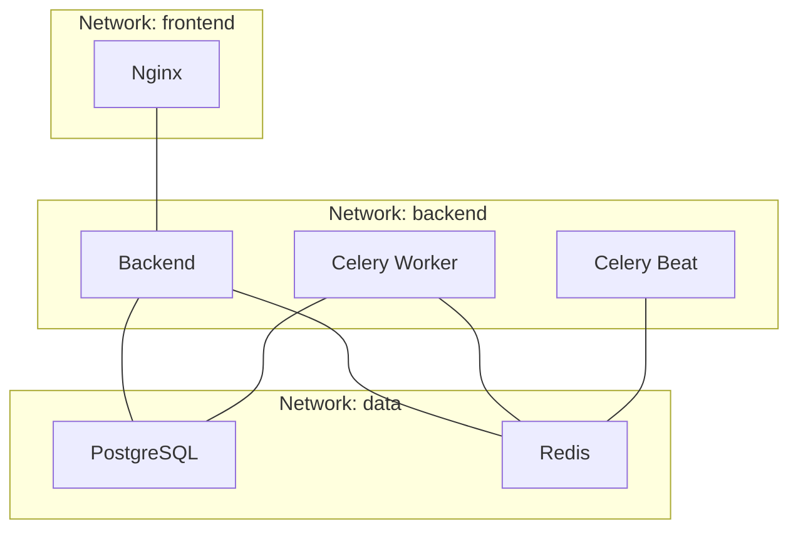

**Diagram sources**
- [docker-compose.prod.yml:9-196](file://docker-compose.prod.yml#L9-L196)

**Section sources**
- [docker-compose.prod.yml:1-217](file://docker-compose.prod.yml#L1-L217)

### Reverse Proxy and SSL/HTTPS
- Nginx configuration
  - Upstream to backend service
  - Proxies /api/* with timeouts and headers
  - Serves SPA assets with long cache and index fallback
  - Internal /metrics endpoint restricted to private networks
- SSL/HTTPS
  - Use Certbot standalone mode to obtain certificates
  - Mount certificate directories into Nginx
  - Update Nginx config to listen on 443 and redirect HTTP to HTTPS
  - Set up cron for automatic renewal and reload

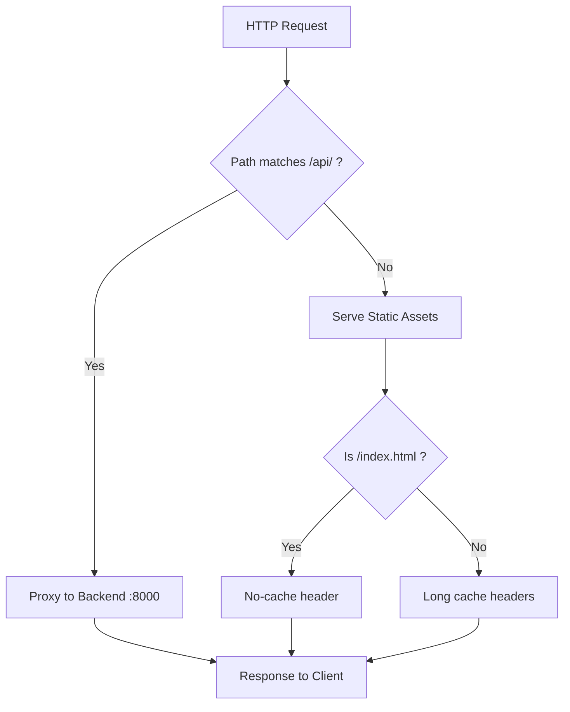

**Diagram sources**
- [frontend/nginx/nginx.conf:9-88](file://frontend/nginx/nginx.conf#L9-L88)

**Section sources**
- [frontend/nginx/nginx.conf:1-89](file://frontend/nginx/nginx.conf#L1-89)
- [DEPLOYMENT.md:41-62](file://DEPLOYMENT.md#L41-L62)

### Database Backup and Recovery
- Manual backup and restore commands are provided
- Automated backups via cron
- Restore procedure using psql

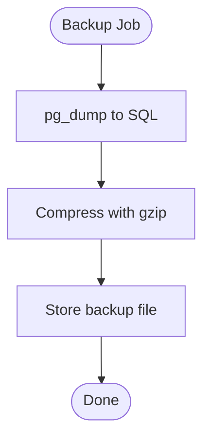

**Diagram sources**
- [DEPLOYMENT.md:71-84](file://DEPLOYMENT.md#L71-L84)

**Section sources**
- [DEPLOYMENT.md:71-84](file://DEPLOYMENT.md#L71-L84)

### Monitoring and Structured Logging
- Prometheus metrics
  - Counters, histograms, gauges for requests, latency, in-flight requests
  - Celery task counters and latencies
  - DB pool gauges
  - /metrics endpoint exposed and proxied by Nginx with IP allowlist
- Structured logging
  - JSON formatter in production, colored console in development
  - Request/response middleware capturing method, path, status, duration, user_id
  - Global exception handlers returning consistent error payloads

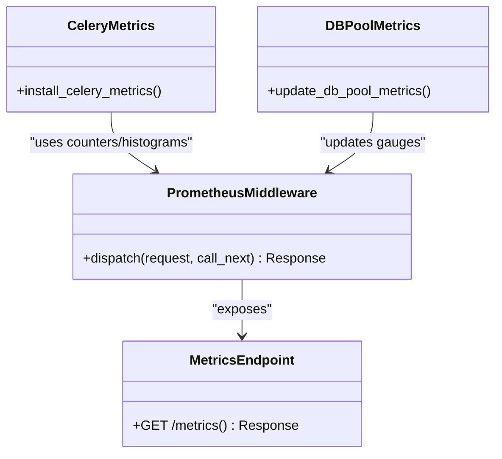

**Diagram sources**
- [backend/app/core/monitoring.py:126-227](file://backend/app/core/monitoring.py#L126-L227)
- [frontend/nginx/nginx.conf:57-67](file://frontend/nginx/nginx.conf#L57-L67)

**Section sources**
- [backend/app/core/monitoring.py:1-227](file://backend/app/core/monitoring.py#L1-L227)
- [backend/app/core/logging.py:1-231](file://backend/app/core/logging.py#L1-L231)
- [frontend/nginx/nginx.conf:57-67](file://frontend/nginx/nginx.conf#L57-L67)

### Health Check Endpoints
- Health endpoint returns a simple status payload
- Used by Docker HEALTHCHECK and orchestration probes

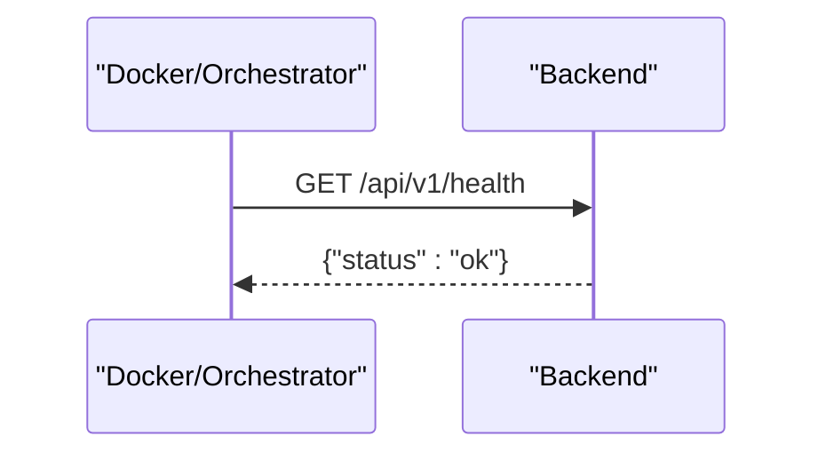

**Diagram sources**
- [backend/app/api/v1/routes/health.py:1-8](file://backend/app/api/v1/routes/health.py#L1-L8)
- [backend/Dockerfile:45-47](file://backend/Dockerfile#L45-L47)

**Section sources**
- [backend/app/api/v1/routes/health.py:1-8](file://backend/app/api/v1/routes/health.py#L1-L8)
- [backend/Dockerfile:45-47](file://backend/Dockerfile#L45-L47)

### Environment Variables and Secrets Management
- Settings model loads from .env with validation aliases
- Production uses env_file in compose and explicit environment overrides
- Best practices
  - Separate per-environment files (e.g., .env.dev, .env.prod.local)
  - Never commit secrets; use secret managers or encrypted files
  - Rotate secrets by updating env files and restarting affected services

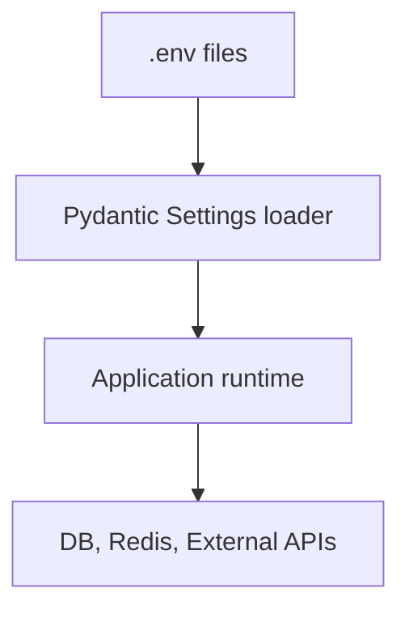

**Diagram sources**
- [backend/app/core/config.py:1-167](file://backend/app/core/config.py#L1-L167)
- [docker-compose.prod.yml:66-196](file://docker-compose.prod.yml#L66-L196)

**Section sources**
- [backend/app/core/config.py:1-167](file://backend/app/core/config.py#L1-L167)
- [docker-compose.prod.yml:66-196](file://docker-compose.prod.yml#L66-L196)

### Scaling and Load Balancing
- Horizontal scaling
  - Scale backend and celery-worker replicas via docker compose scale
- Nginx upstream
  - Single backend upstream currently; for multiple backends, add additional servers and enable round-robin
- Resource limits
  - CPU/memory reservations and limits defined per service

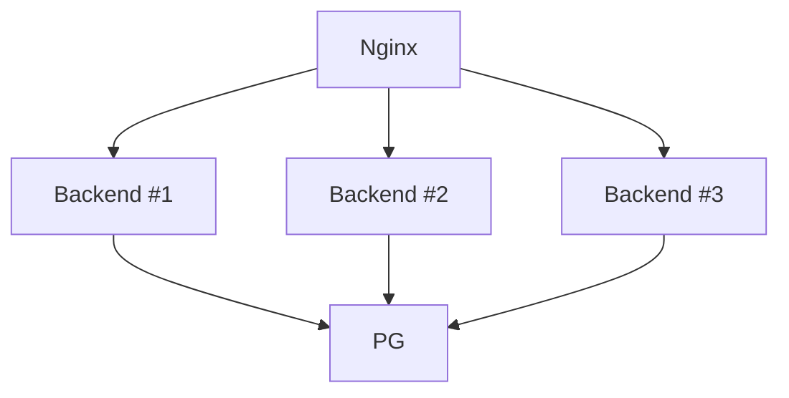

**Diagram sources**
- [DEPLOYMENT.md:101-104](file://DEPLOYMENT.md#L101-L104)
- [docker-compose.prod.yml:88-99](file://docker-compose.prod.yml#L88-L99)

**Section sources**
- [DEPLOYMENT.md:101-104](file://DEPLOYMENT.md#L101-L104)
- [docker-compose.prod.yml:88-99](file://docker-compose.prod.yml#L88-L99)

### Disaster Recovery Procedures
- Database restore from backup
- Rollback strategy
  - Keep previous image tags and rollback compose stack to prior version
  - Run migrations down if needed (use Alembic downgrade)
- RTO/RPO planning
  - Schedule frequent backups; define acceptable data loss window

[No sources needed since this section provides general guidance]

### CI/CD Pipeline Configuration
- GitHub Actions workflows are not present in the repository
- Recommended pipeline stages
  - Lint and type-check
  - Unit tests (pytest)
  - Build images (multi-stage)
  - Push to registry
  - Deploy to staging/prod via compose or platform tooling
  - Post-deploy smoke tests against /api/v1/health and /metrics

[No sources needed since this section provides general guidance]

## Dependency Analysis
Service-level dependencies and network isolation in production.

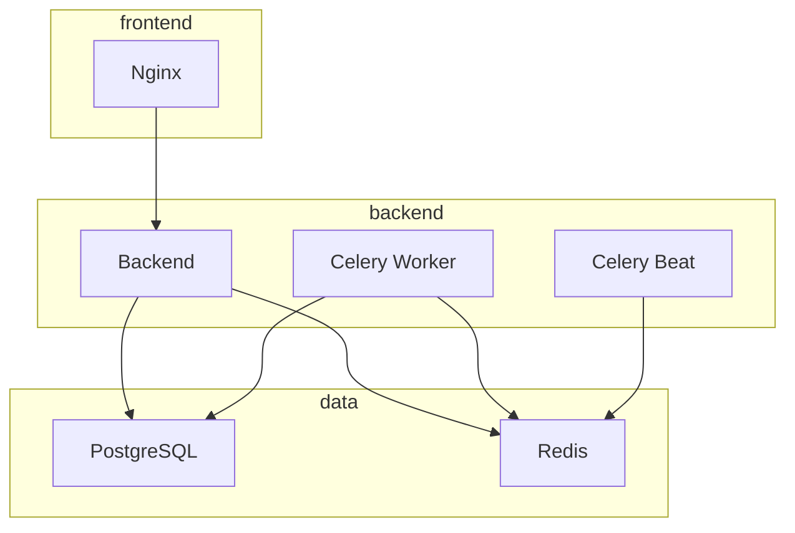

**Diagram sources**
- [docker-compose.prod.yml:9-196](file://docker-compose.prod.yml#L9-L196)

**Section sources**
- [docker-compose.prod.yml:1-217](file://docker-compose.prod.yml#L1-L217)

## Performance Considerations
- Backend
  - Tune Gunicorn workers based on CPU cores
  - Adjust Celery concurrency and queues per workload
  - Monitor DB pool usage via metrics
- Nginx
  - Enable gzip and caching for static assets
  - Increase keepalive connections to backend
- Data
  - Size Redis memory and choose eviction policy appropriate for your cache
  - Ensure Postgres has sufficient RAM and connection limits

[No sources needed since this section provides general guidance]

## Troubleshooting Guide
Common issues and commands:
- Service won’t start: inspect logs for the specific service
- DB connection errors: verify credentials and connectivity
- Redis errors: test ping with password
- Disk space low: prune unused images and containers
- Celery stuck: review worker logs and queue depth

Operational references:
- Health endpoint verification
- Metrics availability behind internal-only access
- Structured logs format for parsing

**Section sources**
- [DEPLOYMENT.md:112-121](file://DEPLOYMENT.md#L112-L121)
- [backend/app/api/v1/routes/health.py:1-8](file://backend/app/api/v1/routes/health.py#L1-L8)
- [backend/app/core/logging.py:77-101](file://backend/app/core/logging.py#L77-L101)
- [frontend/nginx/nginx.conf:57-67](file://frontend/nginx/nginx.conf#L57-L67)

## Conclusion
The project follows modern DevOps practices with containerized services, clear separation of environments, robust observability, and documented procedures for deployment, scaling, and recovery. By adhering to the guidelines here—especially around secrets management, SSL, backups, and monitoring—you can reliably operate the system across development, staging, and production.

[No sources needed since this section summarizes without analyzing specific files]

## Appendices

### Deployment Checklist
- Change all default passwords and set strong secrets
- Configure CORS origins for production domain(s)
- Enable SSL with Let’s Encrypt and configure auto-renewal
- Verify health and metrics endpoints
- Confirm log rotation and disk space policies
- Validate backups and restore process
- Review security posture (firewall, SSH hardening, fail2ban)

**Section sources**
- [DEPLOYMENT.md:122-133](file://DEPLOYMENT.md#L122-L133)

### Example Environment-Specific Configurations
- Development
  - Use docker-compose.yml with defaults and local ports
- Staging
  - Mirror production compose with staging env file and separate volumes
- Production
  - Use docker-compose.prod.yml with .env.prod.local, SSL, and resource limits

**Section sources**
- [docker-compose.yml:1-53](file://docker-compose.yml#L1-L53)
- [docker-compose.prod.yml:1-217](file://docker-compose.prod.yml#L1-L217)
- [DEPLOYMENT.md:11-39](file://DEPLOYMENT.md#L11-L39)