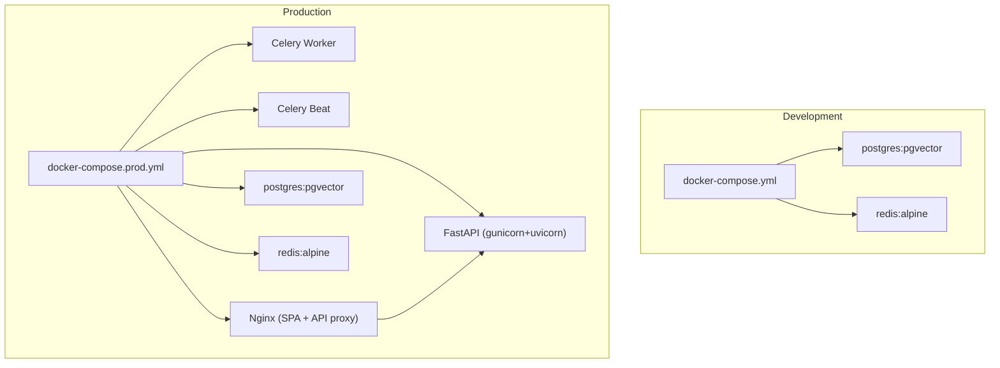
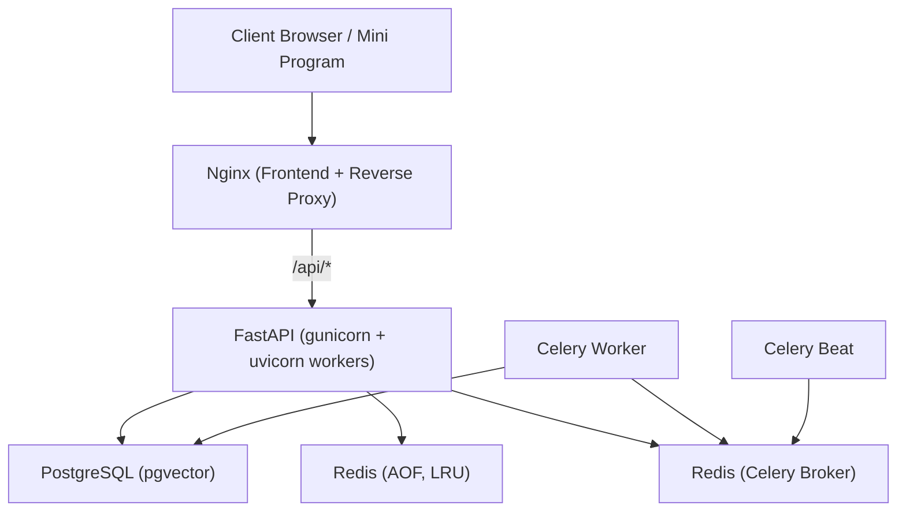
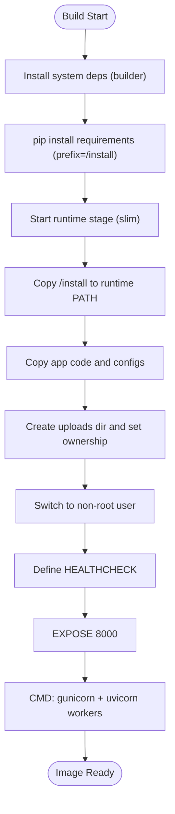
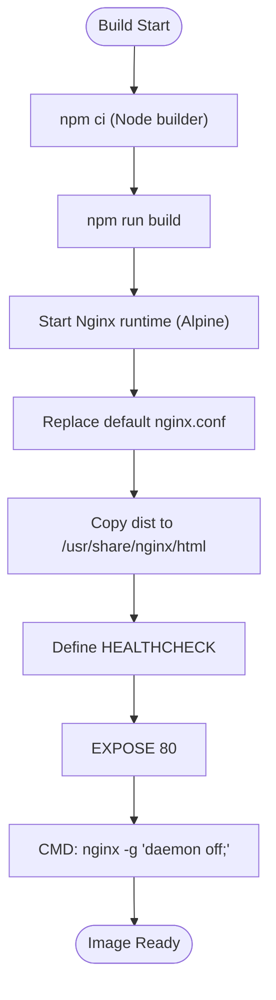
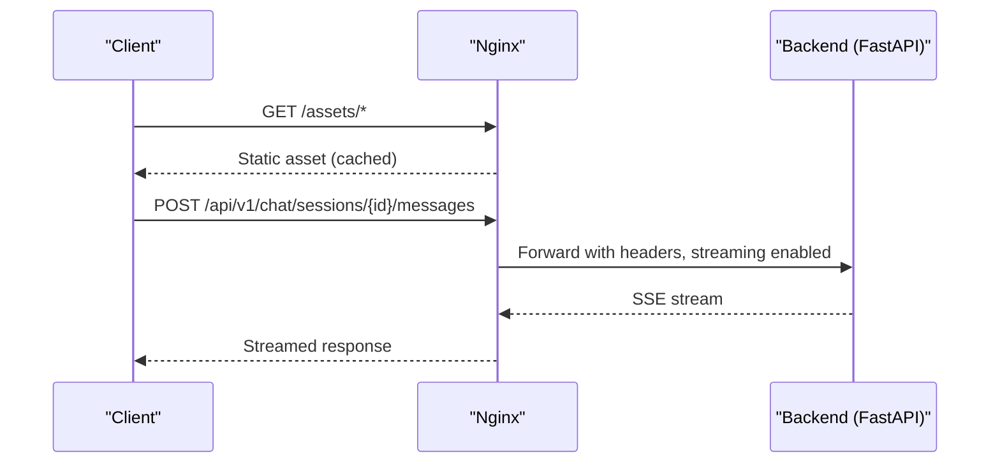
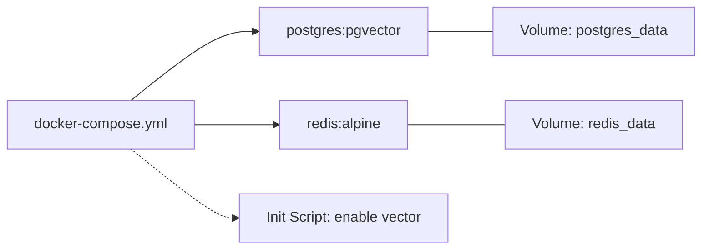
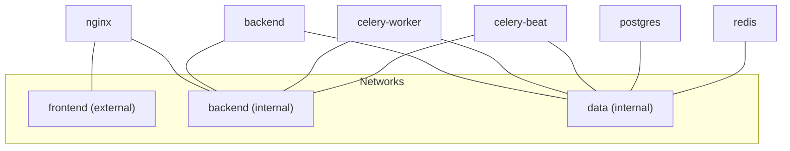
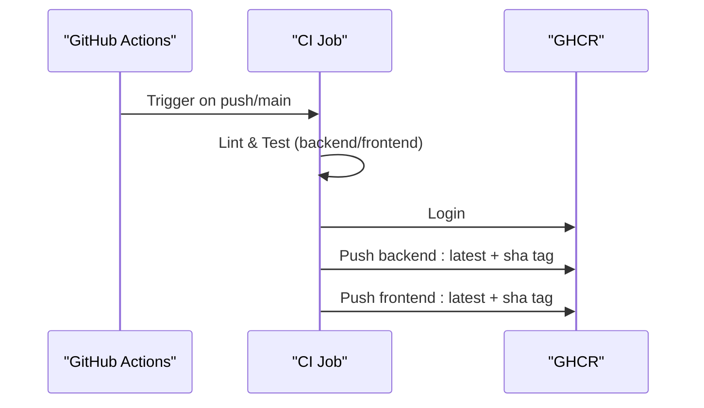
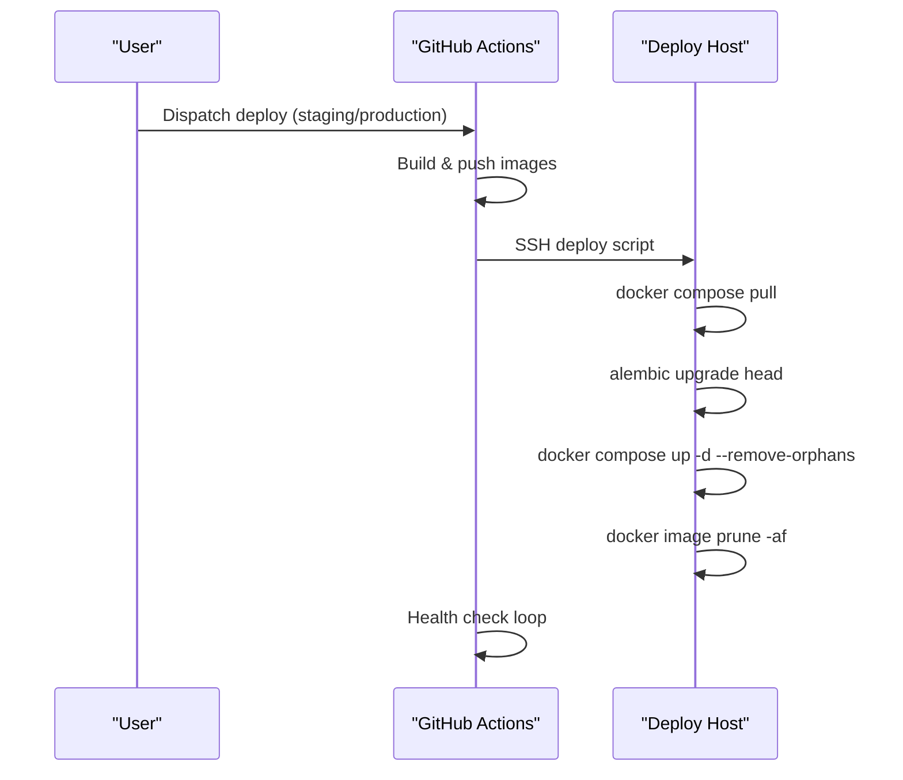
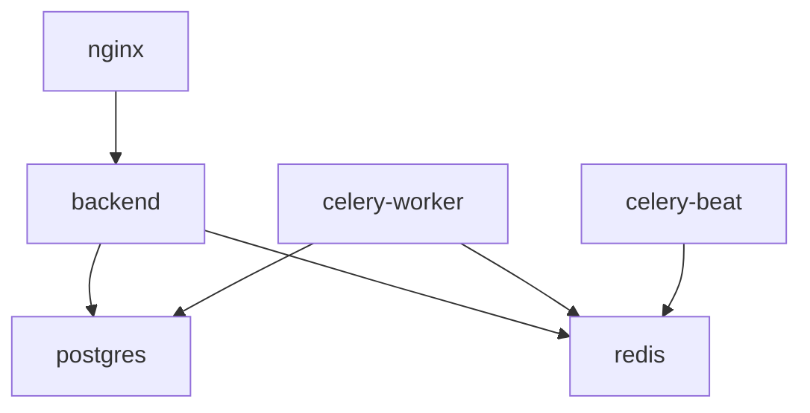

# Docker Containerization Strategy

<cite>
**Referenced Files in This Document**
- [docker-compose.yml](file://docker-compose.yml)
- [docker-compose.prod.yml](file://docker-compose.prod.yml)
- [backend/Dockerfile](file://backend/Dockerfile)
- [frontend/Dockerfile](file://frontend/Dockerfile)
- [frontend/nginx/nginx.conf](file://frontend/nginx/nginx.conf)
- [docker/pg-init/00-enable-vector.sql](file://docker/pg-init/00-enable-vector.sql)
- [DEPLOYMENT.md](file://DEPLOYMENT.md)
- [README.md](file://README.md)
- [.github/workflows/ci.yml](file://.github/workflows/ci.yml)
- [.github/workflows/deploy.yml](file://.github/workflows/deploy.yml)
</cite>

## Table of Contents
1. [Introduction](#introduction)
2. [Project Structure](#project-structure)
3. [Core Components](#core-components)
4. [Architecture Overview](#architecture-overview)
5. [Detailed Component Analysis](#detailed-component-analysis)
6. [Dependency Analysis](#dependency-analysis)
7. [Performance Considerations](#performance-considerations)
8. [Troubleshooting Guide](#troubleshooting-guide)
9. [Conclusion](#conclusion)
10. [Appendices](#appendices)

## Introduction
This document explains the Docker containerization strategy for the Rental Housing Structure project, focusing on multi-stage builds for backend and frontend, development and production orchestration with docker-compose, data persistence, health checks, service dependencies, networking, port mapping, environment variables, image building and running workflows, debugging techniques, and security best practices. It synthesizes the repository’s Dockerfiles, compose files, Nginx configuration, CI/CD pipelines, and deployment guide into a cohesive operational reference.

## Project Structure
The containerization artifacts are organized by component:
- Backend application image built from a Python multi-stage Dockerfile
- Frontend SPA built with Node and served via a minimal Nginx runtime image
- Development stack using docker-compose (PostgreSQL with pgvector, Redis)
- Production stack using docker-compose.prod.yml (Nginx reverse proxy, FastAPI, Celery worker/beat)
- CI/CD pipelines build and push images to GitHub Container Registry
- Deployment automation pulls images and performs migrations and restarts

**Diagram sources**
- [docker-compose.yml:1-53](file://docker-compose.yml#L1-L53)
- [docker-compose.prod.yml:1-217](file://docker-compose.prod.yml#L1-L217)

**Section sources**
- [README.md:22-62](file://README.md#L22-L62)
- [docker-compose.yml:1-53](file://docker-compose.yml#L1-L53)
- [docker-compose.prod.yml:1-217](file://docker-compose.prod.yml#L1-L217)

## Core Components
- Backend image: Multi-stage Python build with slim base, non-root user, gunicorn + uvicorn workers, and a health check endpoint.
- Frontend image: Multi-stage Node build producing static assets, served by a minimal Nginx runtime with optimized caching and security headers.
- Data services: PostgreSQL with pgvector extension enabled at startup; Redis with AOF persistence and memory policies.
- Orchestration: Separate compose files for development and production with explicit health checks, volumes, networks, and resource limits.
- CI/CD: Automated linting, testing, image builds, and pushes; manual deploy workflow that pulls images, runs migrations, and restarts services.

Key implementation references:
- Backend multi-stage build and runtime entrypoint
- Frontend multi-stage build and Nginx runtime
- Development compose with pgvector init script and health checks
- Production compose with three-tier network isolation, secrets via env_file, and resource constraints
- Nginx reverse proxy configuration for SPA and API routes
- CI pipeline building and pushing images to GHCR
- Deploy pipeline SSH-based rollout with migration and health checks

**Section sources**
- [backend/Dockerfile:1-61](file://backend/Dockerfile#L1-L61)
- [frontend/Dockerfile:1-29](file://frontend/Dockerfile#L1-L29)
- [frontend/nginx/nginx.conf:1-89](file://frontend/nginx/nginx.conf#L1-L89)
- [docker-compose.yml:1-53](file://docker-compose.yml#L1-L53)
- [docker-compose.prod.yml:1-217](file://docker-compose.prod.yml#L1-L217)
- [.github/workflows/ci.yml:175-210](file://.github/workflows/ci.yml#L175-L210)
- [.github/workflows/deploy.yml:49-83](file://.github/workflows/deploy.yml#L49-L83)

## Architecture Overview
The system is composed of:
- Nginx as the public-facing edge, serving the Vue SPA and proxying API requests to the backend
- FastAPI application behind gunicorn with multiple uvicorn workers
- Celery worker and beat for background tasks and scheduled jobs
- PostgreSQL with pgvector for relational data and vector similarity search
- Redis for caching, rate limiting, and task broker

**Diagram sources**
- [docker-compose.prod.yml:66-195](file://docker-compose.prod.yml#L66-L195)
- [frontend/nginx/nginx.conf:1-89](file://frontend/nginx/nginx.conf#L1-L89)

## Detailed Component Analysis

### Backend Image: Multi-Stage Build and Runtime
- Builder stage installs system dependencies and Python packages into an isolated prefix to avoid bloating the final image.
- Runtime stage uses a slim Python base, installs only required shared libraries, creates a non-root user, copies application code and installed packages, sets up writable directories, and defines a health check.
- The process is launched with gunicorn using uvicorn workers, tuned for concurrency and request lifecycle.

**Diagram sources**
- [backend/Dockerfile:1-61](file://backend/Dockerfile#L1-L61)

**Section sources**
- [backend/Dockerfile:1-61](file://backend/Dockerfile#L1-L61)

### Frontend Image: Build and Serve
- Builder stage installs Node dependencies and compiles the Vue SPA.
- Runtime stage uses a minimal Nginx Alpine image, replaces default config, serves static assets, and includes a health check.

**Diagram sources**
- [frontend/Dockerfile:1-29](file://frontend/Dockerfile#L1-L29)

**Section sources**
- [frontend/Dockerfile:1-29](file://frontend/Dockerfile#L1-L29)

### Nginx Reverse Proxy Configuration
- Serves SPA static assets with long cache for immutable assets and no-cache for index.html.
- Proxies API calls to the backend upstream with appropriate headers and timeouts.
- Enables gzip compression and security headers.
- Restricts access to internal metrics endpoint.

**Diagram sources**
- [frontend/nginx/nginx.conf:1-89](file://frontend/nginx/nginx.conf#L1-L89)

**Section sources**
- [frontend/nginx/nginx.conf:1-89](file://frontend/nginx/nginx.conf#L1-L89)

### Development Stack (docker-compose.yml)
- Services:
  - postgres: pgvector image, auto-installs vector extension via init script, exposes port 5432, persistent volume, health check.
  - redis: alpine image, AOF enabled, memory policy, persistent volume, health check.
- Volumes: Named volumes for data persistence.
- Port mapping: Host ports 5432 and 6379 exposed for local development.

**Diagram sources**
- [docker-compose.yml:1-53](file://docker-compose.yml#L1-L53)
- [docker/pg-init/00-enable-vector.sql:1-3](file://docker/pg-init/00-enable-vector.sql#L1-L3)

**Section sources**
- [docker-compose.yml:1-53](file://docker-compose.yml#L1-L53)
- [docker/pg-init/00-enable-vector.sql:1-3](file://docker/pg-init/00-enable-vector.sql#L1-L3)

### Production Stack (docker-compose.prod.yml)
- Services:
  - postgres: pgvector, env_file, named volume, health check, resource limits, internal data network.
  - redis: alpine, AOF, password via env_file, health check, resource limits, internal data network.
  - backend: FastAPI image, env_file, depends_on with health conditions, internal backend/data networks, logging rotation.
  - celery-worker: same image, command to start worker with queues, depends_on healthy, internal networks.
  - celery-beat: same image, command to start beat, depends_on healthy, internal networks.
  - nginx: frontend image, maps host port via variable, depends_on backend, connects frontend/backend networks.
- Networks: Three-tier isolation (frontend, backend, data).
- Volumes: Persistent storage for postgres and redis.

**Diagram sources**
- [docker-compose.prod.yml:1-217](file://docker-compose.prod.yml#L1-L217)

**Section sources**
- [docker-compose.prod.yml:1-217](file://docker-compose.prod.yml#L1-L217)

### CI/CD Pipeline Integration
- CI job builds and pushes backend and frontend images to GHCR after successful tests and builds.
- Uses Docker Buildx and login actions.
- Tags include latest and commit SHA.

**Diagram sources**
- [.github/workflows/ci.yml:175-210](file://.github/workflows/ci.yml#L175-L210)

**Section sources**
- [.github/workflows/ci.yml:175-210](file://.github/workflows/ci.yml#L175-L210)

### Deployment Workflow
- Manual dispatch triggers staging or production deployment.
- Builds tagged images, pushes to registry, then deploys via SSH:
  - Pulls images
  - Runs Alembic migrations
  - Starts services with --remove-orphans
  - Prunes old images
  - Performs health check loop

**Diagram sources**
- [.github/workflows/deploy.yml:49-83](file://.github/workflows/deploy.yml#L49-L83)

**Section sources**
- [.github/workflows/deploy.yml:49-83](file://.github/workflows/deploy.yml#L49-L83)

## Dependency Analysis
- Service dependencies:
  - Backend depends on healthy postgres and redis.
  - Celery worker/beat depend on healthy postgres and redis.
  - Nginx depends on backend availability.
- Network topology:
  - Frontend network allows external access to Nginx.
  - Backend and data networks are internal, isolating sensitive services.
- Volume dependencies:
  - Postgres and Redis use named volumes for persistence across restarts.

**Diagram sources**
- [docker-compose.prod.yml:66-195](file://docker-compose.prod.yml#L66-L195)

**Section sources**
- [docker-compose.prod.yml:66-195](file://docker-compose.prod.yml#L66-L195)

## Performance Considerations
- Image size optimization:
  - Multi-stage builds separate build-time tools from runtime.
  - Use slim/alpine bases and remove package manager caches.
  - Install only runtime libraries needed by the application.
- Build performance:
  - Cache dependency layers (requirements.txt/package-lock.json) to leverage Docker layer caching.
  - Use --no-cache-dir for pip and npm ci flags to speed up and reduce disk usage.
- Runtime efficiency:
  - Tune gunicorn workers based on CPU cores and workload characteristics.
  - Enable gzip compression in Nginx for text assets.
  - Configure Redis maxmemory and eviction policy to prevent OOM.
  - Apply resource limits and reservations in production compose.

[No sources needed since this section provides general guidance]

## Troubleshooting Guide
- Common commands:
  - View logs: docker compose logs -f <service>
  - Check database readiness: exec postgres pg_isready
  - Check Redis connectivity: exec redis redis-cli -a <password> ping
  - Run migrations: exec backend alembic upgrade head
  - Scale horizontally: up -d --scale backend=N --scale celery-worker=M
- Health checks:
  - Backend: HTTP GET /api/v1/health
  - Frontend: HTTP GET /
  - Database: pg_isready
  - Redis: redis-cli ping
- Networking issues:
  - Verify correct network membership for services.
  - Ensure Nginx upstream points to backend service name and port.
- Secrets and environment:
  - Confirm .env.prod is loaded via env_file.
  - Validate DATABASE_URL, REDIS_URL, AUTH_SECRET_KEY, CORS_ORIGINS.

**Section sources**
- [DEPLOYMENT.md:112-134](file://DEPLOYMENT.md#L112-L134)
- [docker-compose.prod.yml:23-28](file://docker-compose.prod.yml#L23-L28)
- [docker-compose.prod.yml:53-57](file://docker-compose.prod.yml#L53-L57)
- [backend/Dockerfile:46-47](file://backend/Dockerfile#L46-L47)
- [frontend/Dockerfile:23-24](file://frontend/Dockerfile#L23-L24)

## Conclusion
The project employs a robust containerization strategy with clear separation between development and production environments, efficient multi-stage builds, strong security posture, and automated CI/CD integration. The three-tier network model, health checks, and persistent volumes ensure reliability and maintainability. Following the documented workflows enables consistent local development, reproducible builds, and safe deployments.

[No sources needed since this section summarizes without analyzing specific files]

## Appendices

### Environment Variables and Secrets
- Development:
  - POSTGRES_DB, POSTGRES_USER, POSTGRES_PASSWORD
  - REDIS_PASSWORD (optional)
  - DATABASE_URL, ALEMBIC_DATABASE_URL, REDIS_URL, ENVIRONMENT, DEBUG
- Production:
  - Load via env_file (.env.prod)
  - Include AUTH_SECRET_KEY, OPENAI_API_KEY, CORS_ORIGINS, WECHAT_APPID/WECHAT_SECRET
- Best practices:
  - Never commit secrets; use env_file or secret managers.
  - Rotate secrets regularly and update services accordingly.

**Section sources**
- [docker-compose.yml:12-16](file://docker-compose.yml#L12-L16)
- [docker-compose.prod.yml:14-18](file://docker-compose.prod.yml#L14-L18)
- [docker-compose.prod.yml:73-80](file://docker-compose.prod.yml#L73-L80)
- [README.md:196-208](file://README.md#L196-L208)

### Building Custom Images Locally
- Backend:
  - docker build -t rental-housing-backend ./backend
- Frontend:
  - docker build -t rental-housing-frontend ./frontend
- Tagging and pushing:
  - docker tag and docker push to your registry
- Running containers locally:
  - docker run -p 8000:8000 --network dev_network rental-housing-backend
  - docker run -p 80:80 --network dev_network rental-housing-frontend

**Section sources**
- [backend/Dockerfile:1-61](file://backend/Dockerfile#L1-L61)
- [frontend/Dockerfile:1-29](file://frontend/Dockerfile#L1-L29)

### Debugging Containerized Applications
- Inspect logs:
  - docker compose logs -f backend
  - docker compose logs -f celery-worker
  - docker compose logs -f nginx
- Exec into containers:
  - docker compose exec backend bash
  - docker compose exec redis sh
- Health endpoints:
  - curl http://localhost:8000/api/v1/health
  - curl http://localhost:80/
- Network diagnostics:
  - docker network ls
  - docker inspect <container_id>

**Section sources**
- [DEPLOYMENT.md:112-134](file://DEPLOYMENT.md#L112-L134)
- [backend/Dockerfile:46-47](file://backend/Dockerfile#L46-L47)
- [frontend/Dockerfile:23-24](file://frontend/Dockerfile#L23-L24)

### Security Considerations
- Non-root users:
  - Backend image switches to a dedicated appuser before running.
- Minimal base images:
  - Python slim and Nginx Alpine minimize attack surface.
- Secret management:
  - Use env_file for production secrets; avoid hardcoding credentials.
- Network isolation:
  - Internal networks for backend and data tiers.
- Hardening:
  - Security headers in Nginx.
  - Rate limiting via Redis-backed middleware.
  - Strong JWT secrets and CORS restrictions in production.

**Section sources**
- [backend/Dockerfile:27-43](file://backend/Dockerfile#L27-L43)
- [frontend/nginx/nginx.conf:33-37](file://frontend/nginx/nginx.conf#L33-L37)
- [docker-compose.prod.yml:207-216](file://docker-compose.prod.yml#L207-L216)
- [README.md:217-228](file://README.md#L217-L228)