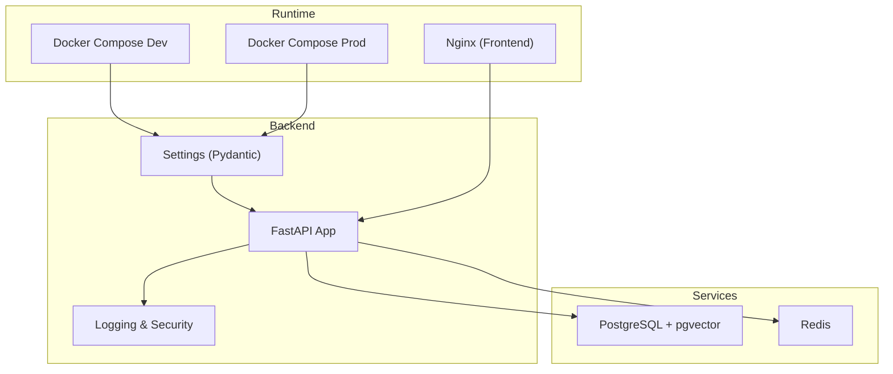
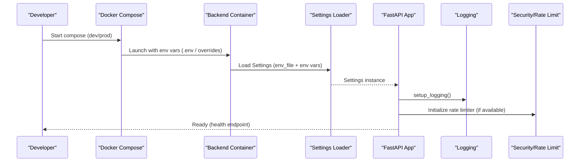
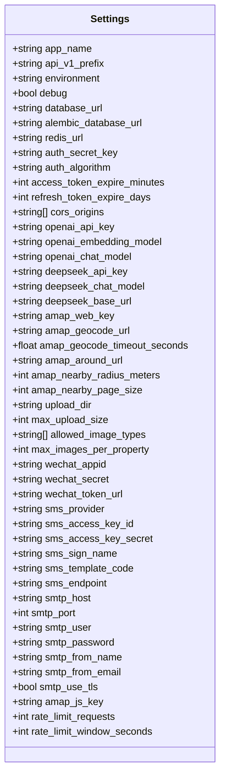
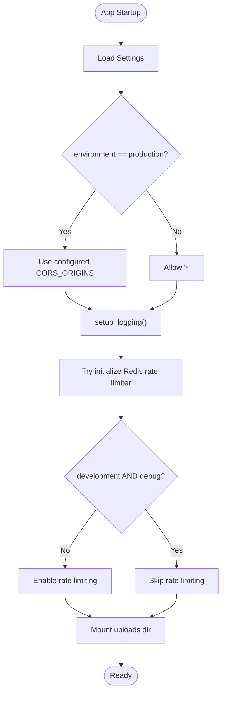
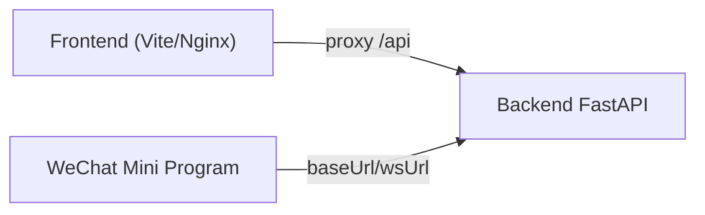
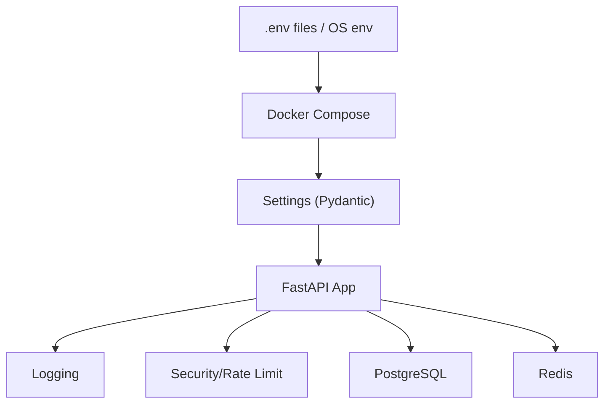

# Environment Management & Secrets

<cite>
**Referenced Files in This Document**
- [config.py](file://backend/app/core/config.py)
- [main.py](file://backend/app/main.py)
- [logging.py](file://backend/app/core/logging.py)
- [security_audit.py](file://backend/app/core/security_audit.py)
- [env.py](file://backend/alembic/env.py)
- [docker-compose.yml](file://docker-compose.yml)
- [docker-compose.prod.yml](file://docker-compose.prod.yml)
- [Dockerfile (backend)](file://backend/Dockerfile)
- [Dockerfile (frontend)](file://frontend/Dockerfile)
- [nginx.conf](file://frontend/nginx/nginx.conf)
- [vite.config.ts](file://frontend/vite.config.ts)
- [app.config.js (WeChat Mini Program)](file://wechat-miniprogram/app.config.js)
- [DEPLOYMENT.md](file://DEPLOYMENT.md)
</cite>

## Table of Contents
1. [Introduction](#introduction)
2. [Project Structure](#project-structure)
3. [Core Components](#core-components)
4. [Architecture Overview](#architecture-overview)
5. [Detailed Component Analysis](#detailed-component-analysis)
6. [Dependency Analysis](#dependency-analysis)
7. [Performance Considerations](#performance-considerations)
8. [Troubleshooting Guide](#troubleshooting-guide)
9. [Conclusion](#conclusion)
10. [Appendices](#appendices)

## Introduction
This document explains how environment variables and secrets are managed across development, staging, and production for the Rental Housing Matching System. It covers configuration loading, validation defaults, environment-specific behavior, Docker-based secret injection, and best practices for handling sensitive data. It also provides guidance on adding new configuration fields, auditing configuration changes, and synchronizing settings across team members.

## Project Structure
Environment and secrets are handled at multiple layers:
- Backend configuration is centralized in a single Pydantic Settings class with explicit env aliases and defaults.
- Docker Compose files inject environment variables into services using .env files or inline overrides.
- Frontend uses Vite dev proxy for local development and Nginx reverse proxy in production.
- WeChat Mini Program uses a simple runtime config object to switch base URLs.

**Diagram sources**
- [config.py:1-167](file://backend/app/core/config.py#L1-L167)
- [main.py:1-82](file://backend/app/main.py#L1-L82)
- [docker-compose.yml:1-53](file://docker-compose.yml#L1-L53)
- [docker-compose.prod.yml:1-217](file://docker-compose.prod.yml#L1-L217)
- [nginx.conf:1-89](file://frontend/nginx/nginx.conf#L1-L89)

**Section sources**
- [config.py:1-167](file://backend/app/core/config.py#L1-L167)
- [docker-compose.yml:1-53](file://docker-compose.yml#L1-L53)
- [docker-compose.prod.yml:1-217](file://docker-compose.prod.yml#L1-L217)
- [nginx.conf:1-89](file://frontend/nginx/nginx.conf#L1-L89)

## Core Components
- Centralized settings loader:
  - Loads from .env by default and ignores unknown keys.
  - Provides typed fields with defaults and explicit environment variable aliases.
  - Exposes a cached accessor for reuse across the app.
- Application bootstrap:
  - Reads settings to configure CORS, logging, rate limiting, metrics, and routers.
  - Behavior switches based on environment and debug flags.
- Logging and security:
  - Structured JSON logs in production; colored console logs in development.
  - Sensitive field masking in logs.
  - Rate limiting middleware that can be disabled in development/debug.
- Database migrations:
  - Alembic reads database URL from settings to ensure consistent DB connectivity across environments.

Key responsibilities:
- Configuration schema and defaults: [config.py:1-167](file://backend/app/core/config.py#L1-L167)
- App wiring and environment-driven behavior: [main.py:1-82](file://backend/app/main.py#L1-L82)
- Logging and request/response auditability: [logging.py:1-231](file://backend/app/core/logging.py#L1-L231)
- Security controls and rate limiting: [security_audit.py:1-150](file://backend/app/core/security_audit.py#L1-L150)
- Migration configuration alignment: [env.py:1-51](file://backend/alembic/env.py#L1-L51)

**Section sources**
- [config.py:1-167](file://backend/app/core/config.py#L1-L167)
- [main.py:1-82](file://backend/app/main.py#L1-L82)
- [logging.py:1-231](file://backend/app/core/logging.py#L1-L231)
- [security_audit.py:1-150](file://backend/app/core/security_audit.py#L1-L150)
- [env.py:1-51](file://backend/alembic/env.py#L1-L51)

## Architecture Overview
The system loads configuration once at startup and applies it globally. Docker Compose supplies environment variables via .env files or inline substitutions. The frontend proxies API calls during development and serves static assets in production through Nginx.

**Diagram sources**
- [docker-compose.yml:1-53](file://docker-compose.yml#L1-L53)
- [docker-compose.prod.yml:1-217](file://docker-compose.prod.yml#L1-L217)
- [config.py:1-167](file://backend/app/core/config.py#L1-L167)
- [main.py:1-82](file://backend/app/main.py#L1-L82)
- [logging.py:1-231](file://backend/app/core/logging.py#L1-L231)
- [security_audit.py:1-150](file://backend/app/core/security_audit.py#L1-L150)

## Detailed Component Analysis

### Backend Configuration Model
- Single source of truth for all backend configuration.
- Uses a typed model with defaults and explicit env aliases.
- Ignores unknown env keys to avoid startup failures when extra variables exist.
- Cached accessor ensures settings are loaded once per process.

Operational notes:
- Defaults allow local development without any .env file.
- Many third-party integrations (AI providers, maps, SMS, email) have empty defaults and are skipped if not configured.
- Environment and debug flags control strictness (e.g., CORS, logging verbosity, rate limiting).

**Diagram sources**
- [config.py:1-167](file://backend/app/core/config.py#L1-L167)

**Section sources**
- [config.py:1-167](file://backend/app/core/config.py#L1-L167)

### Application Bootstrap and Environment Switching
- Reads settings and configures:
  - CORS origins (relaxed in non-production).
  - Logging format and level (production vs development).
  - Prometheus metrics and Celery signals.
  - Rate limiting middleware (disabled in development+debug).
  - Upload directory mounting.
- Health check endpoint exposed for container orchestration.

**Diagram sources**
- [main.py:1-82](file://backend/app/main.py#L1-L82)
- [logging.py:1-231](file://backend/app/core/logging.py#L1-L231)
- [security_audit.py:1-150](file://backend/app/core/security_audit.py#L1-L150)

**Section sources**
- [main.py:1-82](file://backend/app/main.py#L1-L82)
- [logging.py:1-231](file://backend/app/core/logging.py#L1-L231)
- [security_audit.py:1-150](file://backend/app/core/security_audit.py#L1-L150)

### Logging and Sensitive Data Handling
- Production: structured JSON logs to stdout; reduced noise for internal libraries.
- Development: colored console output with request IDs.
- Sensitive field masking:
  - Recognizes common sensitive keys (password, token, etc.).
  - Applies regex patterns to mask phone numbers and emails.
- Request logging middleware captures method, path, status, duration, client IP, and user context.

Best practices:
- Never log raw secrets or tokens.
- Rely on the built-in masking to sanitize payloads before logging.

**Section sources**
- [logging.py:1-231](file://backend/app/core/logging.py#L1-L231)

### Security Controls and Rate Limiting
- Rate limiting:
  - Redis-backed sliding window per client IP and endpoint prefix.
  - Skipped in development+debug to improve developer experience.
- JWT refresh support:
  - Long-lived refresh tokens with configurable expiry.
  - Access token issuance and refresh flow validated against settings.

Operational implications:
- Ensure REDIS_URL is correct and reachable.
- Adjust RATE_LIMIT_REQUESTS and RATE_LIMIT_WINDOW_SECONDS per environment.

**Section sources**
- [security_audit.py:1-150](file://backend/app/core/security_audit.py#L1-L150)
- [config.py:1-167](file://backend/app/core/config.py#L1-L167)

### Database Migrations Alignment
- Alembic reads the migration database URL directly from settings to keep dev/staging/prod consistent.
- Ensures migrations run against the same database target as the application.

**Section sources**
- [env.py:1-51](file://backend/alembic/env.py#L1-L51)
- [config.py:1-167](file://backend/app/core/config.py#L1-L167)

### Docker and Secret Injection
- Development:
  - docker-compose.yml defines Postgres and Redis with inline defaults and optional env overrides.
  - No separate .env file required for basic local runs.
- Production:
  - docker-compose.prod.yml references an external .env.prod file via env_file and passes additional environment variables explicitly.
  - Services include resource limits, health checks, and logging rotation.
- Backend image:
  - Multi-stage build installs dependencies in builder stage and runs as non-root user.
  - Exposes port 8000 and includes a health check.
- Frontend image:
  - Builds Vue SPA with Node and serves via Nginx.
  - Proxies /api to backend service.

Secrets delivery methods used:
- .env files mounted into containers via Docker Compose.
- Inline environment substitution for service-to-service connections.

Recommendations:
- Keep .env files out of version control.
- Use platform-native secrets managers where possible (see next section).

**Section sources**
- [docker-compose.yml:1-53](file://docker-compose.yml#L1-L53)
- [docker-compose.prod.yml:1-217](file://docker-compose.prod.yml#L1-L217)
- [Dockerfile (backend):1-61](file://backend/Dockerfile#L1-L61)
- [Dockerfile (frontend):1-29](file://frontend/Dockerfile#L1-L29)
- [nginx.conf:1-89](file://frontend/nginx/nginx.conf#L1-L89)

### Frontend and Mini Program Environments
- Frontend development:
  - Vite dev server proxies /api to localhost:8000 for seamless local development.
- Frontend production:
  - Nginx serves static assets and proxies /api to backend service within the Docker network.
- WeChat Mini Program:
  - Simple runtime config object toggles between development and production base URLs.

**Diagram sources**
- [vite.config.ts:1-22](file://frontend/vite.config.ts#L1-L22)
- [nginx.conf:1-89](file://frontend/nginx/nginx.conf#L1-L89)
- [app.config.js (WeChat Mini Program):1-15](file://wechat-miniprogram/app.config.js#L1-L15)

**Section sources**
- [vite.config.ts:1-22](file://frontend/vite.config.ts#L1-L22)
- [nginx.conf:1-89](file://frontend/nginx/nginx.conf#L1-L89)
- [app.config.js (WeChat Mini Program):1-15](file://wechat-miniprogram/app.config.js#L1-L15)

## Dependency Analysis
Configuration flows from environment sources into the application:

**Diagram sources**
- [config.py:1-167](file://backend/app/core/config.py#L1-L167)
- [main.py:1-82](file://backend/app/main.py#L1-L82)
- [docker-compose.yml:1-53](file://docker-compose.yml#L1-L53)
- [docker-compose.prod.yml:1-217](file://docker-compose.prod.yml#L1-L217)

**Section sources**
- [config.py:1-167](file://backend/app/core/config.py#L1-L167)
- [main.py:1-82](file://backend/app/main.py#L1-L82)
- [docker-compose.yml:1-53](file://docker-compose.yml#L1-L53)
- [docker-compose.prod.yml:1-217](file://docker-compose.prod.yml#L1-L217)

## Performance Considerations
- Rate limiting reduces abuse but adds Redis latency; tune thresholds per environment.
- Logging overhead:
  - Production uses structured JSON with INFO level; consider sampling for high-throughput scenarios.
- Connection pools:
  - Ensure DATABASE_URL and REDIS_URL point to optimized endpoints in production.
- Static asset caching:
  - Nginx caches long-lived assets; ensure proper cache-busting for frontend builds.

[No sources needed since this section provides general guidance]

## Troubleshooting Guide
Common issues and resolutions:
- Missing or invalid secrets:
  - Verify .env files are present and correctly referenced by Docker Compose.
  - Check that required fields (e.g., AUTH_SECRET_KEY, SMTP_* credentials) are set for the target environment.
- Database connection errors:
  - Confirm POSTGRES_USER, POSTGRES_PASSWORD, POSTGRES_DB, and DATABASE_URL/ALEMBIC_DATABASE_URL match.
  - Use health checks to verify readiness before running migrations.
- Redis connectivity:
  - Ensure REDIS_URL points to the correct host/port and password (if enabled).
  - Validate Redis health via CLI inside the container.
- CORS failures:
  - In production, set CORS_ORIGINS to your actual domain(s).
- Rate limiting too aggressive:
  - Increase RATE_LIMIT_REQUESTS or RATE_LIMIT_WINDOW_SECONDS for staging/production.
- Logs missing details:
  - Confirm structured logging is active in production and that request IDs are propagated.

Operational references:
- Deployment steps and maintenance commands: [DEPLOYMENT.md:1-134](file://DEPLOYMENT.md#L1-L134)

**Section sources**
- [DEPLOYMENT.md:1-134](file://DEPLOYMENT.md#L1-L134)

## Conclusion
This project centralizes configuration in a strongly-typed settings model, leverages Docker Compose for environment-specific injection, and enforces secure defaults with clear environment switching. By following the recommended practices for secrets management, validation, and auditing, teams can maintain consistency and safety across development, staging, and production.

[No sources needed since this section summarizes without analyzing specific files]

## Appendices

### Environment Variables Reference (Selected)
- Application
  - ENVIRONMENT: development | staging | production
  - DEBUG: true | false
  - APP_NAME, API_V1_PREFIX
- Database
  - DATABASE_URL, ALEMBIC_DATABASE_URL
- Cache
  - REDIS_URL
- Authentication
  - AUTH_SECRET_KEY, AUTH_ALGORITHM, ACCESS_TOKEN_EXPIRE_MINUTES, REFRESH_TOKEN_EXPIRE_DAYS
- CORS
  - CORS_ORIGINS
- AI Providers
  - OPENAI_API_KEY, OPENAI_EMBEDDING_MODEL, OPENAI_CHAT_MODEL
  - DEEPSEEK_API_KEY, DEEPSEEK_CHAT_MODEL, DEEPSEEK_BASE_URL
- Maps
  - AMAP_WEB_KEY, AMAP_GEOCODE_URL, AMAP_GEOCODE_TIMEOUT_SECONDS
  - AMAP_AROUND_URL, AMAP_NEARBY_RADIUS_METERS, AMAP_NEARBY_PAGE_SIZE
  - AMAP_JS_KEY
- Uploads
  - UPLOAD_DIR, MAX_UPLOAD_SIZE, ALLOWED_IMAGE_TYPES, MAX_IMAGES_PER_PROPERTY
- WeChat
  - WECHAT_APPID, WECHAT_SECRET, WECHAT_TOKEN_URL
- SMS (Alibaba Cloud)
  - SMS_PROVIDER, SMS_ACCESS_KEY_ID, SMS_ACCESS_KEY_SECRET, SMS_SIGN_NAME, SMS_TEMPLATE_CODE, SMS_ENDPOINT
- Email (SMTP)
  - SMTP_HOST, SMTP_PORT, SMTP_USER, SMTP_PASSWORD, SMTP_FROM_NAME, SMTP_FROM_EMAIL, SMTP_USE_TLS
- Rate Limiting
  - RATE_LIMIT_REQUESTS, RATE_LIMIT_WINDOW_SECONDS

Notes:
- All fields are defined with defaults and explicit env aliases in the settings model.
- Empty defaults indicate optional integrations that gracefully skip when unconfigured.

**Section sources**
- [config.py:1-167](file://backend/app/core/config.py#L1-L167)

### Secrets Management Best Practices
- Local development:
  - Use a .env file excluded from version control.
  - Provide minimal secrets locally; rely on empty defaults for optional services.
- Staging/Production:
  - Store secrets in a secrets manager (e.g., platform secret stores, CI/CD vaults).
  - Inject secrets into containers via environment variables or Docker secrets.
  - Rotate secrets regularly and audit usage.
- Avoid:
  - Committing secrets to repositories.
  - Logging sensitive values; rely on built-in masking.
  - Hardcoding secrets in images or configs.

[No sources needed since this section provides general guidance]

### Adding New Environment Variables
Steps:
1. Add a new field to the settings model with a safe default and a validation alias.
2. Update documentation to reflect the new variable.
3. If required in production, add it to the production compose env_file or override list.
4. If the feature should be disabled by default, guard logic with an empty-default check.
5. Test locally with and without the variable set.

**Section sources**
- [config.py:1-167](file://backend/app/core/config.py#L1-L167)

### Environment-Specific Examples
- Development:
  - Use docker-compose.yml with inline defaults; no .env required for basic runs.
  - Vite dev server proxies /api to localhost:8000.
- Staging:
  - Create a .env.staging with real service endpoints and secrets.
  - Run with docker compose -f docker-compose.prod.yml --env-file .env.staging up -d.
- Production:
  - Maintain .env.prod (or .env.prod.local) with strong secrets.
  - Follow deployment guide for SSL, backups, and monitoring.

**Section sources**
- [docker-compose.yml:1-53](file://docker-compose.yml#L1-L53)
- [docker-compose.prod.yml:1-217](file://docker-compose.prod.yml#L1-L217)
- [DEPLOYMENT.md:1-134](file://DEPLOYMENT.md#L1-L134)
- [vite.config.ts:1-22](file://frontend/vite.config.ts#L1-L22)

### Configuration Auditing and Team Synchronization
- Audit:
  - Review OWASP checklist and logging outputs for misconfigurations.
  - Monitor rate limiting and error logs for anomalies.
- Synchronization:
  - Share a template .env.example with non-sensitive defaults.
  - Require each developer to create a local .env with only necessary secrets.
  - Document required variables and their purpose in this guide.

**Section sources**
- [security_audit.py:1-150](file://backend/app/core/security_audit.py#L1-L150)
- [logging.py:1-231](file://backend/app/core/logging.py#L1-L231)