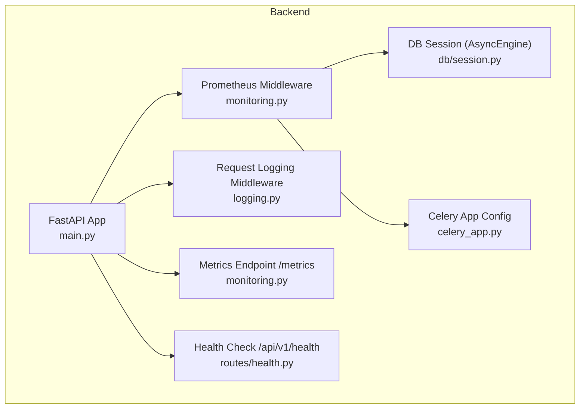
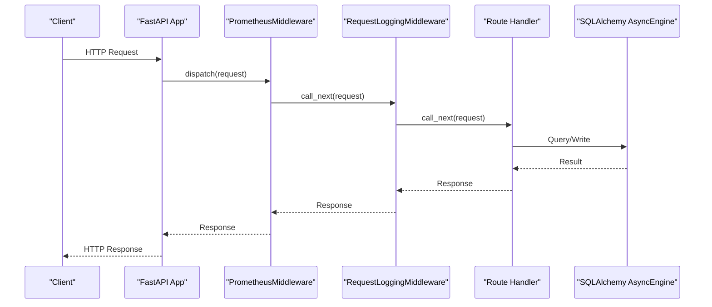
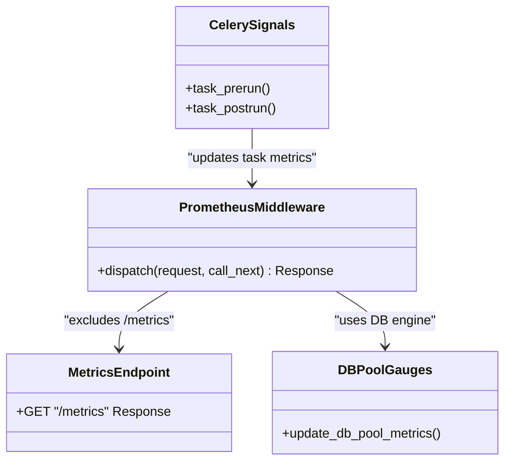
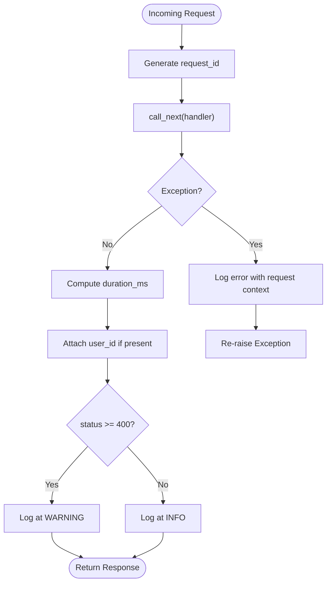
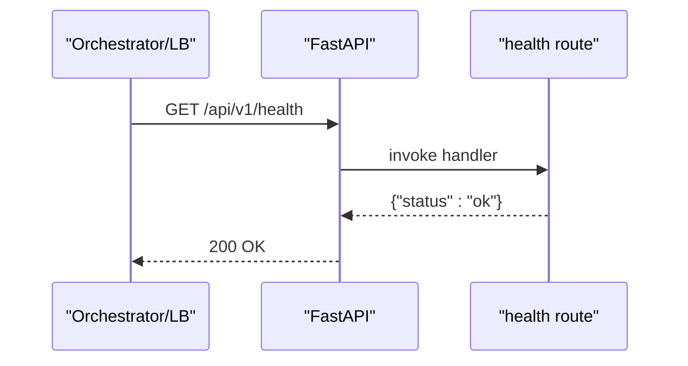
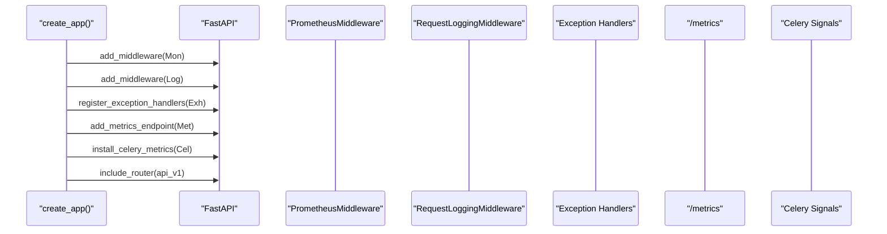
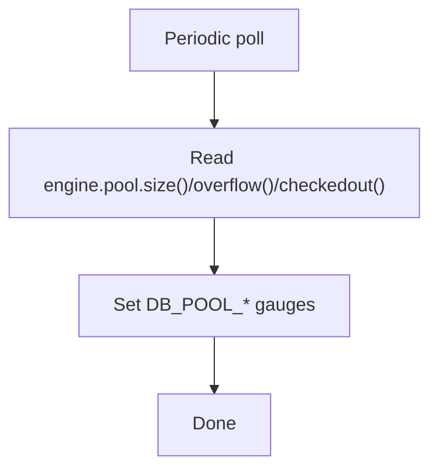
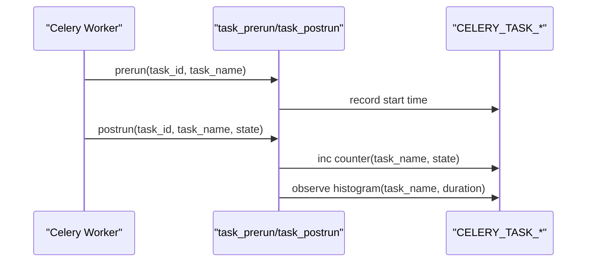
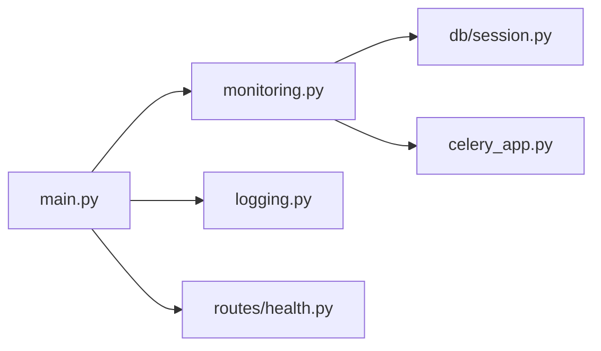

# Monitoring & Observability

<cite>
**Referenced Files in This Document**
- [backend/app/core/monitoring.py](file://backend/app/core/monitoring.py)
- [backend/app/core/logging.py](file://backend/app/core/logging.py)
- [backend/app/api/v1/routes/health.py](file://backend/app/api/v1/routes/health.py)
- [backend/app/main.py](file://backend/app/main.py)
- [backend/app/db/session.py](file://backend/app/db/session.py)
- [backend/app/celery_app.py](file://backend/app/celery_app.py)
- [docker-compose.yml](file://docker-compose.yml)
</cite>

## Table of Contents
1. [Introduction](#introduction)
2. [Project Structure](#project-structure)
3. [Core Components](#core-components)
4. [Architecture Overview](#architecture-overview)
5. [Detailed Component Analysis](#detailed-component-analysis)
6. [Dependency Analysis](#dependency-analysis)
7. [Performance Considerations](#performance-considerations)
8. [Troubleshooting Guide](#troubleshooting-guide)
9. [Conclusion](#conclusion)
10. [Appendices](#appendices)

## Introduction
This document explains the monitoring and observability setup for the Rental Housing Structure system. It covers Prometheus metrics collection, structured logging, health check endpoints, error tracking, alerting guidance, log aggregation strategies, dashboard recommendations, tracing integration options, and debugging practices for distributed components such as Celery workers and databases.

## Project Structure
Observability is implemented primarily in the backend:
- Metrics are collected via a Prometheus middleware and exposed through a /metrics endpoint.
- Structured JSON logs are emitted with request correlation IDs and sensitive data masking.
- A simple health check endpoint is provided for liveness probes.
- Database pool gauges and Celery task counters/histograms are instrumented.

**Diagram sources**
- [backend/app/main.py:1-82](file://backend/app/main.py#L1-L82)
- [backend/app/core/monitoring.py:1-227](file://backend/app/core/monitoring.py#L1-L227)
- [backend/app/core/logging.py:1-231](file://backend/app/core/logging.py#L1-L231)
- [backend/app/api/v1/routes/health.py:1-9](file://backend/app/api/v1/routes/health.py#L1-L9)
- [backend/app/db/session.py:1-14](file://backend/app/db/session.py#L1-L14)
- [backend/app/celery_app.py:1-31](file://backend/app/celery_app.py#L1-L31)

**Section sources**
- [backend/app/main.py:1-82](file://backend/app/main.py#L1-L82)
- [backend/app/core/monitoring.py:1-227](file://backend/app/core/monitoring.py#L1-L227)
- [backend/app/core/logging.py:1-231](file://backend/app/core/logging.py#L1-L231)
- [backend/app/api/v1/routes/health.py:1-9](file://backend/app/api/v1/routes/health.py#L1-L9)
- [backend/app/db/session.py:1-14](file://backend/app/db/session.py#L1-L14)
- [backend/app/celery_app.py:1-31](file://backend/app/celery_app.py#L1-L31)

## Core Components
- Prometheus metrics: HTTP request counts, latency histograms, in-flight requests, Celery task counters/histograms, and database pool gauges.
- Structured logging: JSON formatter for production, colored console for development, request/response logging with correlation IDs, and sensitive field masking.
- Health checks: Simple readiness/liveness endpoint under API v1.
- Integration points: FastAPI app wiring, DB async engine access, Celery signal hooks.

**Section sources**
- [backend/app/core/monitoring.py:70-118](file://backend/app/core/monitoring.py#L70-L118)
- [backend/app/core/logging.py:33-101](file://backend/app/core/logging.py#L33-L101)
- [backend/app/api/v1/routes/health.py:6-8](file://backend/app/api/v1/routes/health.py#L6-L8)
- [backend/app/main.py:41-70](file://backend/app/main.py#L41-L70)

## Architecture Overview
The application bootstraps observability by installing middleware and registering handlers during app creation. The flow below shows how an incoming request is observed from ingress to response.

**Diagram sources**
- [backend/app/main.py:41-70](file://backend/app/main.py#L41-L70)
- [backend/app/core/monitoring.py:126-160](file://backend/app/core/monitoring.py#L126-L160)
- [backend/app/core/logging.py:124-167](file://backend/app/core/logging.py#L124-L167)
- [backend/app/db/session.py:8-9](file://backend/app/db/session.py#L8-L9)

## Detailed Component Analysis

### Prometheus Metrics Collection
- HTTP metrics:
  - Counter for total requests labeled by method, endpoint, status_code.
  - Histogram for request duration in seconds with predefined buckets.
  - Gauge for currently in-flight requests.
- Celery metrics:
  - Counter for tasks processed labeled by task_name and status.
  - Histogram for task execution duration labeled by task_name.
- Database pool metrics:
  - Gauges for pool size, overflow, and checked-out connections.
- Metrics endpoint:
  - GET /metrics serves text format using prometheus_client’s generator.

**Diagram sources**
- [backend/app/core/monitoring.py:126-175](file://backend/app/core/monitoring.py#L126-L175)
- [backend/app/core/monitoring.py:183-208](file://backend/app/core/monitoring.py#L183-L208)
- [backend/app/core/monitoring.py:216-226](file://backend/app/core/monitoring.py#L216-L226)

**Section sources**
- [backend/app/core/monitoring.py:70-118](file://backend/app/core/monitoring.py#L70-L118)
- [backend/app/core/monitoring.py:126-175](file://backend/app/core/monitoring.py#L126-L175)
- [backend/app/core/monitoring.py:183-208](file://backend/app/core/monitoring.py#L183-L208)
- [backend/app/core/monitoring.py:216-226](file://backend/app/core/monitoring.py#L216-L226)

### Structured Logging Implementation
- Formatters:
  - Production: JSON lines with timestamp, level, logger name, message, module, function, optional exception stack, request_id, user_id, and extra fields.
  - Development: Colored console output with request_id prefix when available.
- Request logging middleware:
  - Generates a unique request_id per request.
  - Logs method, path, status code, duration_ms, client IP, and user_id when present.
  - Uses WARNING level for 4xx responses; INFO otherwise.
- Sensitive data masking:
  - Masks known sensitive keys and matches phone/email patterns.
- Global exception handlers:
  - Normalize validation errors, HTTP exceptions, and unhandled exceptions into consistent JSON error responses and log them with request context.

**Diagram sources**
- [backend/app/core/logging.py:124-167](file://backend/app/core/logging.py#L124-L167)
- [backend/app/core/logging.py:170-231](file://backend/app/core/logging.py#L170-L231)

**Section sources**
- [backend/app/core/logging.py:33-101](file://backend/app/core/logging.py#L33-L101)
- [backend/app/core/logging.py:103-122](file://backend/app/core/logging.py#L103-L122)
- [backend/app/core/logging.py:124-167](file://backend/app/core/logging.py#L124-L167)
- [backend/app/core/logging.py:170-231](file://backend/app/core/logging.py#L170-L231)

### Health Check Endpoints
- Endpoint: GET /api/v1/health returns a simple status object indicating service availability.
- Purpose: Used by orchestrators or load balancers for liveness/readiness checks.

**Diagram sources**
- [backend/app/api/v1/routes/health.py:6-8](file://backend/app/api/v1/routes/health.py#L6-L8)

**Section sources**
- [backend/app/api/v1/routes/health.py:1-9](file://backend/app/api/v1/routes/health.py#L1-L9)

### Application Bootstrapping and Wiring
- The app creates middleware stack:
  - PrometheusMiddleware for metrics.
  - Optional rate limiting middleware.
  - RequestLoggingMiddleware for structured request logs.
  - Global exception handlers registered.
  - /metrics endpoint mounted.
  - Celery metrics signals installed.
- Includes API v1 router and static uploads mount.

**Diagram sources**
- [backend/app/main.py:41-70](file://backend/app/main.py#L41-L70)

**Section sources**
- [backend/app/main.py:17-78](file://backend/app/main.py#L17-L78)

### Database Pool Monitoring
- Gauges track pool size, overflow, and checked-out connections by reading the SQLAlchemy async engine pool state.
- Intended to be polled periodically (e.g., via a background task or external scheduler).

**Diagram sources**
- [backend/app/core/monitoring.py:216-226](file://backend/app/core/monitoring.py#L216-L226)
- [backend/app/db/session.py:8-9](file://backend/app/db/session.py#L8-L9)

**Section sources**
- [backend/app/core/monitoring.py:105-118](file://backend/app/core/monitoring.py#L105-L118)
- [backend/app/core/monitoring.py:216-226](file://backend/app/core/monitoring.py#L216-L226)
- [backend/app/db/session.py:1-14](file://backend/app/db/session.py#L1-L14)

### Celery Task Metrics
- Signal-based instrumentation captures task start and completion times and statuses.
- Labels include task_name and status for counters, and task_name for histograms.

**Diagram sources**
- [backend/app/core/monitoring.py:183-208](file://backend/app/core/monitoring.py#L183-L208)
- [backend/app/celery_app.py:9-31](file://backend/app/celery_app.py#L9-L31)

**Section sources**
- [backend/app/core/monitoring.py:92-103](file://backend/app/core/monitoring.py#L92-L103)
- [backend/app/core/monitoring.py:183-208](file://backend/app/core/monitoring.py#L183-L208)
- [backend/app/celery_app.py:1-31](file://backend/app/celery_app.py#L1-L31)

## Dependency Analysis
- Prometheus metrics depend on prometheus-client being installed; otherwise, no-op stubs ensure graceful degradation.
- Logging depends on environment settings to choose formatters and levels.
- Health endpoint is independent and minimal.
- DB pool metrics depend on the async engine created in session configuration.
- Celery metrics depend on Celery signals being available.

**Diagram sources**
- [backend/app/main.py:41-70](file://backend/app/main.py#L41-L70)
- [backend/app/core/monitoring.py:1-227](file://backend/app/core/monitoring.py#L1-L227)
- [backend/app/core/logging.py:1-231](file://backend/app/core/logging.py#L1-L231)
- [backend/app/api/v1/routes/health.py:1-9](file://backend/app/api/v1/routes/health.py#L1-L9)
- [backend/app/db/session.py:1-14](file://backend/app/db/session.py#L1-L14)
- [backend/app/celery_app.py:1-31](file://backend/app/celery_app.py#L1-L31)

**Section sources**
- [backend/app/main.py:1-82](file://backend/app/main.py#L1-L82)
- [backend/app/core/monitoring.py:1-227](file://backend/app/core/monitoring.py#L1-L227)
- [backend/app/core/logging.py:1-231](file://backend/app/core/logging.py#L1-L231)
- [backend/app/api/v1/routes/health.py:1-9](file://backend/app/api/v1/routes/health.py#L1-L9)
- [backend/app/db/session.py:1-14](file://backend/app/db/session.py#L1-L14)
- [backend/app/celery_app.py:1-31](file://backend/app/celery_app.py#L1-L31)

## Performance Considerations
- Use appropriate histogram buckets for request latency and task duration to balance cardinality and resolution.
- Avoid high-cardinality labels (e.g., user IDs) on metrics; prefer logs for per-user details.
- Keep the /metrics endpoint lightweight; it should not perform heavy work.
- For DB pool gauges, consider polling intervals that match your workload to avoid overhead.
- In production, set log levels to reduce noise from third-party libraries.

[No sources needed since this section provides general guidance]

## Troubleshooting Guide
- If /metrics returns only a placeholder, verify that prometheus-client is installed and imported successfully.
- If request logs lack correlation IDs, ensure RequestLoggingMiddleware is added before other middlewares.
- If DB pool metrics are missing, confirm the async engine is initialized and accessible.
- If Celery metrics do not appear, ensure Celery is installed and metrics installation runs at startup.
- For health check failures, validate the API v1 prefix and routing configuration.

**Section sources**
- [backend/app/core/monitoring.py:23-35](file://backend/app/core/monitoring.py#L23-L35)
- [backend/app/core/logging.py:124-167](file://backend/app/core/logging.py#L124-L167)
- [backend/app/core/monitoring.py:216-226](file://backend/app/core/monitoring.py#L216-L226)
- [backend/app/core/monitoring.py:183-208](file://backend/app/core/monitoring.py#L183-L208)
- [backend/app/api/v1/routes/health.py:6-8](file://backend/app/api/v1/routes/health.py#L6-L8)

## Conclusion
The system implements a solid foundation for observability: Prometheus metrics for HTTP and Celery, structured JSON logs with correlation IDs and sensitive data masking, and a basic health check endpoint. To complete the observability pipeline, integrate Prometheus scraping, configure alerting rules, centralize logs, and optionally add distributed tracing and profiling tools.

[No sources needed since this section summarizes without analyzing specific files]

## Appendices

### Prometheus Scraping and Alerting Guidance
- Scrape target:
  - Configure Prometheus to scrape http://host:port/metrics from each backend instance.
- Example alerts (conceptual):
  - High error rate: increase in 5xx over a short window.
  - Latency SLO breaches: p95/p99 latency exceeding thresholds.
  - In-flight requests spike: indicates backpressure or slow downstreams.
  - Celery task backlog or long-running tasks: based on task duration histograms.
  - DB pool exhaustion risk: checked_out near pool size or overflow > 0.

[No sources needed since this section provides general guidance]

### Log Aggregation Strategy
- Output:
  - Backend emits JSON lines to stdout.
- Collectors:
  - Container orchestration (Docker/Kubernetes) can forward stdout to centralized systems.
- Indexing and retention:
  - Define indices by service and date.
  - Retain hot logs for shorter periods and archive cold logs for compliance.
- Correlation:
  - Use request_id across services to trace a single request.

[No sources needed since this section provides general guidance]

### Dashboard Setup Recommendations
- Key panels:
  - Request rate by endpoint and status code.
  - Request latency percentiles by endpoint.
  - In-flight requests gauge.
  - Celery task success/failure rates and durations.
  - DB pool utilization and overflow events.
- Time windows:
  - Short-term (minutes) for operational dashboards.
  - Long-term (hours/days) for trend analysis.

[No sources needed since this section provides general guidance]

### Custom Metrics Examples
- Business KPIs:
  - Property search queries, bookings created, payments processed.
- Resource usage:
  - Queue lengths, job retry counts, cache hit ratios.
- Best practices:
  - Prefer stable label sets; avoid high-cardinality values.
  - Use histograms for distributions and counters for totals.

[No sources needed since this section provides general guidance]

### Tracing Integration Options
- OpenTelemetry:
  - Instrument HTTP server and DB calls; export traces to a collector.
- Distributed context propagation:
  - Propagate trace IDs alongside request_id in headers/logs.
- Celery spans:
  - Wrap task execution with spans to visualize end-to-end flows.

[No sources needed since this section provides general guidance]

### Debugging Distributed Systems
- Use request_id to correlate logs across services.
- Inspect Celery task logs and metrics to identify bottlenecks.
- Monitor DB pool metrics to detect connection pressure.
- Reproduce issues locally with debug logging enabled.

[No sources needed since this section provides general guidance]

### Tools Integration for APM, Log Analysis, and Profiling
- APM:
  - Integrate OpenTelemetry or vendor-specific agents to capture traces and profiles.
- Log analysis:
  - Centralized log platform with JSON parsing and alerting on error spikes.
- Profiling:
  - Periodic CPU/memory profiling in staging; sample in production cautiously.

[No sources needed since this section provides general guidance]

### Environment and Runtime Notes
- Docker Compose includes Postgres and Redis with health checks suitable for local development.
- Ensure Redis is reachable for Celery and optional rate limiting features.

**Section sources**
- [docker-compose.yml:8-53](file://docker-compose.yml#L8-L53)