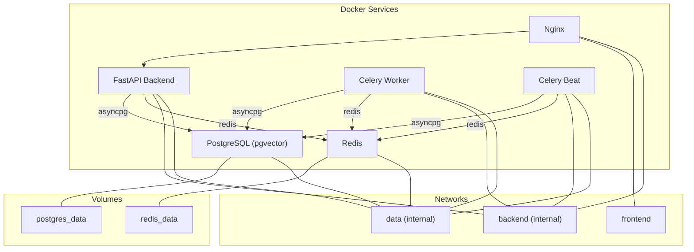
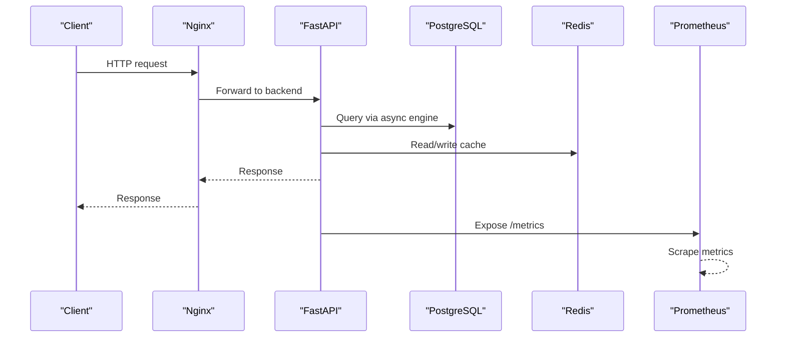
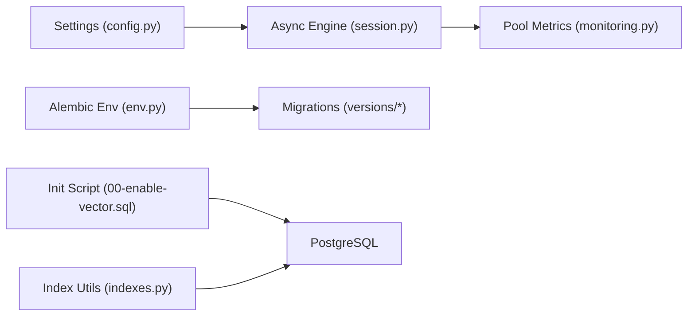

# Database Management & Backups

<cite>
**Referenced Files in This Document**
- [docker-compose.yml](file://docker-compose.yml)
- [docker-compose.prod.yml](file://docker-compose.prod.yml)
- [00-enable-vector.sql](file://docker/pg-init/00-enable-vector.sql)
- [session.py](file://backend/app/db/session.py)
- [config.py](file://backend/app/core/config.py)
- [monitoring.py](file://backend/app/core/monitoring.py)
- [indexes.py](file://backend/app/db/indexes.py)
- [env.py](file://backend/alembic/env.py)
- [20260617_0001_initial_users_properties.py](file://backend/alembic/versions/20260617_0001_initial_users_properties.py)
- [20260620_0002_pgvector_embedding.py](file://backend/alembic/versions/20260620_0002_pgvector_embedding.py)
- [DEPLOYMENT.md](file://DEPLOYMENT.md)
</cite>

## Table of Contents
1. Introduction
2. Project Structure
3. Core Components
4. Architecture Overview
5. Detailed Component Analysis
6. Dependency Analysis
7. Performance Considerations
8. Troubleshooting Guide
9. Conclusion
10. Appendices

## Introduction
This document provides production-grade guidance for database management and backups using PostgreSQL with the pgvector extension, Alembic migrations, Docker volumes, monitoring, performance tuning, security, and disaster recovery. It maps directly to the repository’s configuration, runtime setup, and operational scripts.

## Project Structure
The project deploys PostgreSQL (pgvector), Redis, a FastAPI backend, Celery workers, and Nginx via Docker Compose. The database is initialized with an init script enabling pgvector, and migrations are managed by Alembic. Monitoring exposes Prometheus metrics including database pool gauges.

**Diagram sources**
- [docker-compose.prod.yml:10-216](file://docker-compose.prod.yml#L10-L216)

**Section sources**
- [docker-compose.yml:1-53](file://docker-compose.yml#L1-L53)
- [docker-compose.prod.yml:1-217](file://docker-compose.prod.yml#L1-L217)

## Core Components
- Database engine and session: Async SQLAlchemy engine and session factory configured from environment settings.
- Migrations: Alembic env configures target metadata and uses separate URLs for runtime and migration drivers.
- pgvector initialization: Init SQL enables the vector extension at container start.
- Indexing utilities: Dynamic creation of IVFFlat indexes and composite indexes for frequent queries.
- Monitoring: Prometheus middleware and DB pool metrics exposed via /metrics.
- Deployment operations: Backup, restore, migration commands, and health checks documented in deployment guide.

**Section sources**
- [session.py:1-14](file://backend/app/db/session.py#L1-L14)
- [config.py:15-22](file://backend/app/core/config.py#L15-L22)
- [env.py:1-51](file://backend/alembic/env.py#L1-L51)
- [00-enable-vector.sql:1-3](file://docker/pg-init/00-enable-vector.sql#L1-L3)
- [indexes.py:1-118](file://backend/app/db/indexes.py#L1-L118)
- [monitoring.py:1-227](file://backend/app/core/monitoring.py#L1-L227)
- [DEPLOYMENT.md:71-120](file://DEPLOYMENT.md#L71-L120)

## Architecture Overview
Production architecture integrates application services with persistent storage and observability.

**Diagram sources**
- [docker-compose.prod.yml:66-99](file://docker-compose.prod.yml#L66-L99)
- [monitoring.py:167-176](file://backend/app/core/monitoring.py#L167-L176)

## Detailed Component Analysis

### PostgreSQL Configuration and Connection Pooling
- Image and persistence: Production uses a dedicated image with pgvector and persists data on a named volume. Health checks ensure readiness before dependents start.
- Engine and pooling: The app creates an async engine from settings; default pool sizing is controlled by SQLAlchemy defaults unless overridden via connection string parameters or engine options.
- Separate drivers: Runtime uses asyncpg; migrations use psycopg for Alembic.

Recommendations for production:
- Tune pool size and overflow based on expected concurrency and CPU/memory limits.
- Use connection timeouts and keepalive settings appropriate for cloud environments.
- Ensure SSL/TLS and password-based authentication when connecting across networks.

**Section sources**
- [docker-compose.prod.yml:10-35](file://docker-compose.prod.yml#L10-L35)
- [session.py:6-9](file://backend/app/db/session.py#L6-L9)
- [config.py:15-22](file://backend/app/core/config.py#L15-L22)

### Query Performance Tuning and Indexing
- Vector search: IVFFlat index on embeddings created dynamically based on row count; lists parameter adapts to dataset size.
- Composite indexes: Booking tables gain composite indexes for tenant/landlord/property + status patterns.
- EXPLAIN ANALYZE: Utilities run explain plans for common queries to validate performance.

Operational notes:
- Rebuild indexes after significant data changes.
- Monitor query plans and adjust lists parameter if recall/performance degrades.

**Section sources**
- [indexes.py:16-48](file://backend/app/db/indexes.py#L16-L48)
- [indexes.py:51-88](file://backend/app/db/indexes.py#L51-L88)
- [indexes.py:91-117](file://backend/app/db/indexes.py#L91-L117)

### pgvector Extension Setup
- Initialization: An entrypoint script ensures the vector extension exists.
- Migration: A migration also creates the extension and adds embedding columns and indexes.

Best practices:
- Keep extension enablement idempotent.
- Validate vector column dimensions match model outputs.

**Section sources**
- [00-enable-vector.sql:1-3](file://docker/pg-init/00-enable-vector.sql#L1-L3)
- [20260620_0002_pgvector_embedding.py:21-35](file://backend/alembic/versions/20260620_0002_pgvector_embedding.py#L21-L35)

### Automated Backup Procedures
- Manual backup: Use pg_dump within the postgres container and compress output.
- Restore: Pipe decompressed dump into psql inside the container.
- Automation: Schedule periodic backups via cron on the host or orchestration layer.
- Volume strategy: Persist data on Docker volumes; back up volumes or logical dumps depending on RPO/RTO.

Operational references:
- Commands and example cron line are provided in the deployment guide.

**Section sources**
- [DEPLOYMENT.md:71-84](file://DEPLOYMENT.md#L71-L84)
- [docker-compose.prod.yml:198-204](file://docker-compose.prod.yml#L198-L204)

### Database Migration Management with Alembic
- Environment: Alembic reads settings and sets the URL for migrations separately from runtime.
- Target metadata: Uses the ORM Base metadata to detect schema changes.
- Online/offline modes: Supports both execution paths.
- Versioned migrations: Each change is a versioned file with upgrade/downgrade functions.

Production workflow:
- Generate new revisions after model changes.
- Apply upgrades before rolling out new code.
- Test downgrades for safe rollback where possible.

**Section sources**
- [env.py:14-17](file://backend/alembic/env.py#L14-L17)
- [env.py:20-44](file://backend/alembic/env.py#L20-L44)
- [20260617_0001_initial_users_properties.py:24-93](file://backend/alembic/versions/20260617_0001_initial_users_properties.py#L24-L93)
- [20260620_0002_pgvector_embedding.py:21-40](file://backend/alembic/versions/20260620_0002_pgvector_embedding.py#L21-L40)

### Rollback Strategies and Schema Versioning
- Downgrade functions: Migrations define downgrade steps to reverse changes safely.
- Safe rollbacks: Prefer additive-only migrations in production; avoid destructive changes without tested downgrades.
- Version control: Keep migration files under version control; review diffs before applying.

**Section sources**
- [20260617_0001_initial_users_properties.py:78-93](file://backend/alembic/versions/20260617_0001_initial_users_properties.py#L78-L93)
- [20260620_0002_pgvector_embedding.py:38-40](file://backend/alembic/versions/20260620_0002_pgvector_embedding.py#L38-L40)

### Database Monitoring, Slow Query Analysis, and Maintenance
- Metrics: Prometheus middleware collects request counts, latency, and in-flight requests; DB pool gauges expose pool size, overflow, and checked-out connections.
- Endpoints: /metrics serves Prometheus text format; /api/v1/health provides service health.
- Slow query analysis: Use EXPLAIN ANALYZE utilities to inspect execution plans for hot queries.
- Maintenance: Periodically analyze and vacuum tables; rebuild indexes after bulk loads.

**Section sources**
- [monitoring.py:74-118](file://backend/app/core/monitoring.py#L74-L118)
- [monitoring.py:167-176](file://backend/app/core/monitoring.py#L167-L176)
- [indexes.py:91-117](file://backend/app/db/indexes.py#L91-L117)
- [DEPLOYMENT.md:86-91](file://DEPLOYMENT.md#L86-L91)

### Data Archival, Disk Space Management, and Disaster Recovery
- Archival: Move cold data to archive tables or external storage; update indexes accordingly.
- Disk space: Monitor volume usage; prune unused images and logs; rotate logs and backups.
- Disaster recovery: Maintain offsite backups; test restores regularly; define RPO/RTO targets.

[No sources needed since this section provides general guidance]

### Security, User Permissions, and Access Control
- Secrets: Credentials and keys are loaded from environment variables; do not hardcode secrets.
- Network isolation: Internal networks restrict direct access to data services.
- Authentication: Application-level JWT tokens and password hashing are implemented; database users should follow least privilege.
- TLS: Enable encrypted connections between services and databases in production.

**Section sources**
- [config.py:15-22](file://backend/app/core/config.py#L15-L22)
- [docker-compose.prod.yml:207-216](file://docker-compose.prod.yml#L207-L216)
- [security.py:1-34](file://backend/app/core/security.py#L1-L34)

## Dependency Analysis
Runtime dependencies include async SQLAlchemy engine, Alembic, and optional Prometheus client.

**Diagram sources**
- [config.py:15-22](file://backend/app/core/config.py#L15-L22)
- [session.py:6-9](file://backend/app/db/session.py#L6-L9)
- [monitoring.py:216-226](file://backend/app/core/monitoring.py#L216-L226)
- [env.py:14-17](file://backend/alembic/env.py#L14-L17)
- [00-enable-vector.sql:1-3](file://docker/pg-init/00-enable-vector.sql#L1-L3)
- [indexes.py:16-48](file://backend/app/db/indexes.py#L16-L48)

**Section sources**
- [config.py:15-22](file://backend/app/core/config.py#L15-L22)
- [session.py:6-9](file://backend/app/db/session.py#L6-L9)
- [monitoring.py:216-226](file://backend/app/core/monitoring.py#L216-L226)
- [env.py:14-17](file://backend/alembic/env.py#L14-L17)
- [00-enable-vector.sql:1-3](file://docker/pg-init/00-enable-vector.sql#L1-L3)
- [indexes.py:16-48](file://backend/app/db/indexes.py#L16-L48)

## Performance Considerations
- Connection pooling: Size pools according to concurrency and resource limits; monitor overflow and checked-out connections.
- Vector indexing: Adjust IVFFlat lists based on dataset growth; reindex after large inserts.
- Query planning: Regularly run EXPLAIN ANALYZE on critical paths; add composite indexes where needed.
- Resource limits: Set memory reservations and limits for containers to prevent contention.

[No sources needed since this section provides general guidance]

## Troubleshooting Guide
- Service startup issues: Inspect logs for each service.
- Database connectivity: Verify health checks and credentials.
- Redis connectivity: Confirm password and network reachability.
- Disk space: Prune unused artifacts and rotate logs.
- Celery tasks: Review worker logs for stuck tasks.

**Section sources**
- [DEPLOYMENT.md:112-120](file://DEPLOYMENT.md#L112-L120)

## Conclusion
This guide consolidates production-ready database practices aligned with the repository’s configuration and operations. By combining robust backups, careful migrations, proactive monitoring, and performance tuning, teams can maintain reliable and scalable data services.

[No sources needed since this section summarizes without analyzing specific files]

## Appendices

### Operational Commands Reference
- Backup: Logical dump via pg_dump and gzip compression.
- Restore: Stream dump into psql.
- Migrate: Run Alembic upgrade head and generate new revisions.
- Scale: Increase replicas for backend and workers.

**Section sources**
- [DEPLOYMENT.md:71-104](file://DEPLOYMENT.md#L71-L104)