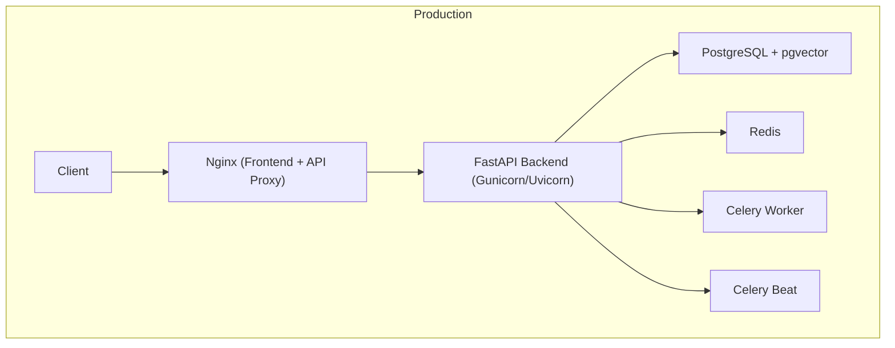
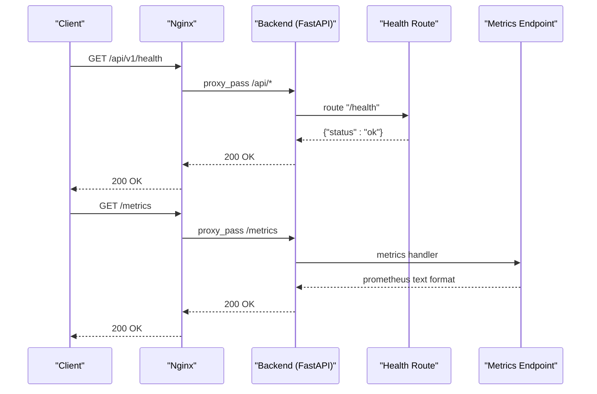
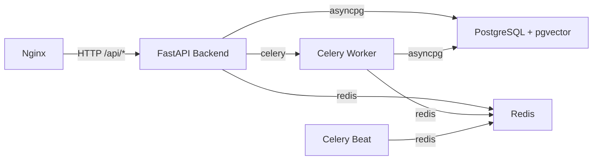
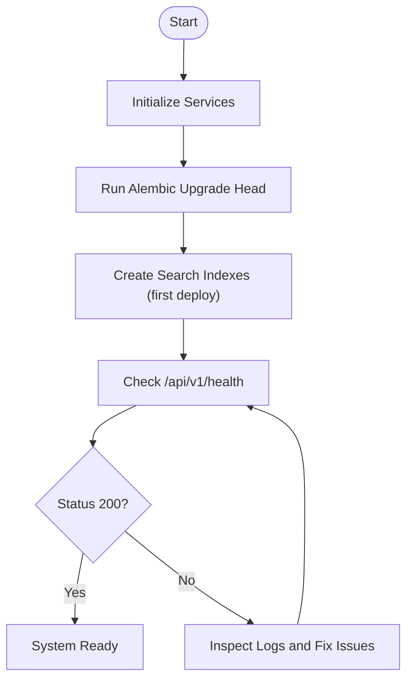
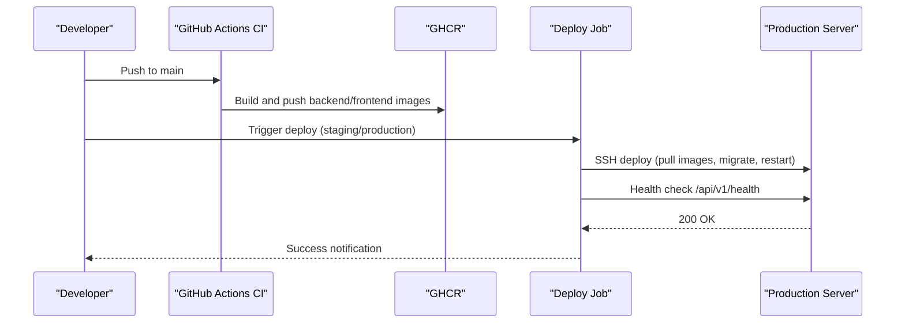

# Deployment Procedures & Rollback Strategies

<cite>
**Referenced Files in This Document**
- [DEPLOYMENT.md](file://DEPLOYMENT.md)
- [docker-compose.prod.yml](file://docker-compose.prod.yml)
- [docker-compose.yml](file://docker-compose.yml)
- [backend/Dockerfile](file://backend/Dockerfile)
- [frontend/Dockerfile](file://frontend/Dockerfile)
- [frontend/nginx/nginx.conf](file://frontend/nginx/nginx.conf)
- [backend/app/main.py](file://backend/app/main.py)
- [backend/app/api/v1/routes/health.py](file://backend/app/api/v1/routes/health.py)
- [backend/app/core/config.py](file://backend/app/core/config.py)
- [backend/app/core/monitoring.py](file://backend/app/core/monitoring.py)
- [backend/alembic.ini](file://backend/alembic.ini)
- [backend/alembic/env.py](file://backend/alembic/env.py)
- [.github/workflows/deploy.yml](file://.github/workflows/deploy.yml)
- [.github/workflows/ci.yml](file://.github/workflows/ci.yml)
</cite>

## Table of Contents
1. Introduction
2. Project Structure
3. Core Components
4. Architecture Overview
5. Detailed Component Analysis
6. Dependency Analysis
7. Performance Considerations
8. Troubleshooting Guide
9. Conclusion
10. Appendices

## Introduction
This document provides production deployment procedures and rollback strategies for the Rental Housing Matching System. It covers environment preparation, service initialization, health verification, blue-green and zero-downtime patterns, rollback procedures (including database migration rollbacks and service downgrades), validation and smoke testing, post-deployment monitoring, CI/CD integration, automated triggers, approval workflows, scaling, load balancing, and capacity planning.

## Project Structure
The system is containerized with Docker Compose for production and development. The backend is a FastAPI application served by Gunicorn/Uvicorn workers; the frontend is a Vue 3 SPA built and served by Nginx. PostgreSQL with pgvector and Redis are used as data stores. Migrations are managed via Alembic. A GitHub Actions workflow builds images and deploys to production via SSH.

**Diagram sources**
- [docker-compose.prod.yml:66-196](file://docker-compose.prod.yml#L66-L196)
- [frontend/nginx/nginx.conf:1-89](file://frontend/nginx/nginx.conf#L1-L89)
- [backend/Dockerfile:45-61](file://backend/Dockerfile#L45-L61)

**Section sources**
- [docker-compose.prod.yml:1-217](file://docker-compose.prod.yml#L1-L217)
- [docker-compose.yml:1-53](file://docker-compose.yml#L1-L53)
- [DEPLOYMENT.md:1-134](file://DEPLOYMENT.md#L1-L134)

## Core Components
- Production orchestration: docker-compose.prod.yml defines services, networks, volumes, resource limits, and health checks.
- Container images: backend/Dockerfile and frontend/Dockerfile define build/runtime stages and health checks.
- Reverse proxy: frontend/nginx/nginx.conf proxies /api/ to backend, serves static assets, and exposes internal /metrics.
- Application entrypoint: backend/app/main.py configures middleware, CORS, metrics, rate limiting, routers, and uploads.
- Health endpoint: backend/app/api/v1/routes/health.py provides a simple health check.
- Configuration: backend/app/core/config.py loads settings from environment variables.
- Monitoring: backend/app/core/monitoring.py implements Prometheus metrics and Celery task metrics.
- Database migrations: backend/alembic.ini and backend/alembic/env.py configure Alembic and connect to the configured database URL.

Key responsibilities:
- Environment preparation: set .env.prod.local with secrets and domain configuration.
- Service initialization: start containers, run migrations, create indexes on first deploy.
- Health verification: curl /api/v1/health and inspect logs/metrics.

**Section sources**
- [docker-compose.prod.yml:1-217](file://docker-compose.prod.yml#L1-L217)
- [backend/Dockerfile:1-61](file://backend/Dockerfile#L1-L61)
- [frontend/Dockerfile:1-29](file://frontend/Dockerfile#L1-L29)
- [frontend/nginx/nginx.conf:1-89](file://frontend/nginx/nginx.conf#L1-L89)
- [backend/app/main.py:1-82](file://backend/app/main.py#L1-L82)
- [backend/app/api/v1/routes/health.py:1-9](file://backend/app/api/v1/routes/health.py#L1-L9)
- [backend/app/core/config.py:1-167](file://backend/app/core/config.py#L1-L167)
- [backend/app/core/monitoring.py:1-227](file://backend/app/core/monitoring.py#L1-L227)
- [backend/alembic.ini:1-43](file://backend/alembic.ini#L1-L43)
- [backend/alembic/env.py:1-51](file://backend/alembic/env.py#L1-L51)

## Architecture Overview
End-to-end request flow through Nginx to FastAPI, including metrics and health endpoints.

**Diagram sources**
- [frontend/nginx/nginx.conf:39-67](file://frontend/nginx/nginx.conf#L39-L67)
- [backend/app/api/v1/routes/health.py:5-9](file://backend/app/api/v1/routes/health.py#L5-L9)
- [backend/app/core/monitoring.py:167-176](file://backend/app/core/monitoring.py#L167-L176)

## Detailed Component Analysis

### Production Deployment Workflow
Step-by-step procedure for initial production setup and subsequent deployments.

- Prepare environment
  - Copy .env.prod to .env.prod.local and fill real secrets, domains, and keys.
  - Ensure ports 80/443 open and DNS records point to server IP.
- Start services
  - Launch production stack using docker compose with the env file.
- Initialize database
  - Run Alembic upgrade head inside the backend container.
  - On first deploy, create search indexes using provided script.
- Verify health
  - Curl /api/v1/health and confirm 200 OK.
  - Inspect logs for each service if needed.

Operational commands and references:
- Quick start, SSL, DNS, backup/restore, maintenance, scaling, troubleshooting, security checklist.

**Section sources**
- [DEPLOYMENT.md:11-39](file://DEPLOYMENT.md#L11-L39)
- [DEPLOYMENT.md:41-63](file://DEPLOYMENT.md#L41-L63)
- [DEPLOYMENT.md:64-84](file://DEPLOYMENT.md#L64-L84)
- [DEPLOYMENT.md:86-134](file://DEPLOYMENT.md#L86-L134)

### Blue-Green Deployment Pattern
Goal: minimize downtime and risk by running two identical environments and switching traffic between them.

Recommended approach:
- Maintain two stacks: green (current) and blue (new).
- Build new images and deploy to blue without affecting green.
- Validate blue with smoke tests and health checks.
- Switch traffic at Nginx or reverse proxy level by updating upstream targets or hostnames.
- If issues arise, switch back to green immediately.

Implementation notes:
- Use separate docker-compose files or named profiles to isolate environments.
- Keep shared state (PostgreSQL, Redis) consistent across both environments.
- For zero-downtime, ensure connection draining and graceful restarts.

[No sources needed since this section describes conceptual pattern]

### Zero-Downtime Rolling Update Strategy
Goal: update services incrementally while maintaining availability.

Recommended steps:
- Pull new images for target services only.
- Run migrations before restarting services.
- Restart backend and celery-worker instances one by one.
- Monitor health and metrics during rollout.
- Roll back by redeploying previous image tag if health checks fail.

References:
- Image tagging and build/push in CI.
- Deploy workflow pulls images, runs migrations, then restarts services.

**Section sources**
- [.github/workflows/deploy.yml:49-68](file://.github/workflows/deploy.yml#L49-L68)
- [.github/workflows/ci.yml:194-210](file://.github/workflows/ci.yml#L194-L210)

### Rollback Procedures
When a deployment fails or causes issues, follow these steps to roll back safely.

Service downgrade:
- Identify the last known good image tag.
- Update docker-compose.prod.yml or deployment script to use that tag.
- Restart affected services.

Database migration rollback:
- Determine the target revision to downgrade to.
- Run alembic downgrade <revision> inside the backend container.
- Revert application code to the version compatible with the downgraded schema.
- Restart services.

Operational references:
- Migration commands and Alembic configuration.
- Health checks and logging for validation.

**Section sources**
- [DEPLOYMENT.md:93-99](file://DEPLOYMENT.md#L93-L99)
- [backend/alembic.ini:1-43](file://backend/alembic.ini#L1-L43)
- [backend/alembic/env.py:14-15](file://backend/alembic/env.py#L14-L15)

### Validation, Smoke Testing, and Post-Deployment Monitoring
Validation:
- Health endpoint: GET /api/v1/health should return 200 OK.
- Metrics endpoint: GET /metrics should return Prometheus metrics.

Smoke testing:
- Hit critical routes (e.g., authentication, property listing) after deployment.
- Verify key user flows end-to-end.

Monitoring:
- Prometheus metrics include request counts, latency, in-flight requests, Celery tasks, and DB pool gauges.
- Structured JSON logging in production.
- View logs per service via docker compose logs.

**Section sources**
- [backend/app/api/v1/routes/health.py:5-9](file://backend/app/api/v1/routes/health.py#L5-L9)
- [backend/app/core/monitoring.py:74-118](file://backend/app/core/monitoring.py#L74-L118)
- [backend/app/core/monitoring.py:167-176](file://backend/app/core/monitoring.py#L167-L176)
- [DEPLOYMENT.md:86-91](file://DEPLOYMENT.md#L86-L91)

### CI/CD Pipeline Integration
Automated build and deployment pipeline:
- CI builds backend and frontend images and pushes to GHCR with tags based on commit SHA and latest.
- Manual deployment workflow allows choosing staging or production environment.
- Deploy job pulls images on the target server, runs migrations, restarts services, prunes old images, and performs health checks.

Approval workflow:
- Use GitHub Environments with required reviewers to gate production deployments.
- Add manual approvals in the environment settings to enforce change control.

Triggers:
- CI triggers on push to main branch.
- Deploy workflow triggered manually with environment selection.

**Section sources**
- [.github/workflows/ci.yml:194-210](file://.github/workflows/ci.yml#L194-L210)
- [.github/workflows/deploy.yml:1-82](file://.github/workflows/deploy.yml#L1-L82)

### Scaling Procedures and Load Balancing
Horizontal scaling:
- Scale backend and celery-worker replicas using docker compose up --scale.
- Ensure stateless design for web processes; store session/cache in Redis.

Load balancing:
- Nginx upstream backend_api points to backend:8000; scale out by adding more backend instances behind a load balancer (e.g., external LB or Kubernetes Ingress).
- Tune keepalive connections and timeouts in Nginx config.

Capacity planning:
- Set resource limits and reservations for services in docker-compose.prod.yml.
- Monitor CPU/memory usage and adjust limits accordingly.
- Plan for increased DB connections and Redis memory as traffic grows.

**Section sources**
- [DEPLOYMENT.md:101-104](file://DEPLOYMENT.md#L101-L104)
- [docker-compose.prod.yml:29-34](file://docker-compose.prod.yml#L29-L34)
- [docker-compose.prod.yml:58-63](file://docker-compose.prod.yml#L58-L63)
- [docker-compose.prod.yml:88-93](file://docker-compose.prod.yml#L88-L93)
- [docker-compose.prod.yml:127-132](file://docker-compose.prod.yml#L127-L132)
- [frontend/nginx/nginx.conf:4-7](file://frontend/nginx/nginx.conf#L4-L7)

## Dependency Analysis
Runtime dependencies and interactions among services.

**Diagram sources**
- [docker-compose.prod.yml:66-196](file://docker-compose.prod.yml#L66-L196)
- [frontend/nginx/nginx.conf:4-7](file://frontend/nginx/nginx.conf#L4-L7)

**Section sources**
- [docker-compose.prod.yml:1-217](file://docker-compose.prod.yml#L1-L217)
- [frontend/nginx/nginx.conf:1-89](file://frontend/nginx/nginx.conf#L1-L89)

## Performance Considerations
- Use multi-stage Dockerfiles to reduce image size and improve startup time.
- Configure appropriate worker concurrency for Gunicorn and Celery based on CPU cores and workload.
- Enable gzip compression in Nginx for static assets and responses.
- Tune DB pool sizes and Redis memory policies according to observed usage.
- Monitor Prometheus metrics to identify bottlenecks and plan capacity upgrades.

[No sources needed since this section provides general guidance]

## Troubleshooting Guide
Common issues and remediation steps:
- Service won't start: inspect logs for the specific service.
- DB connection errors: verify postgres readiness and credentials.
- Redis errors: ping Redis with password and check logs.
- Disk space low: prune unused images and containers.
- Celery stuck: review worker logs and queue status.

Operational references:
- Health checks and logging configuration in Dockerfiles and compose.
- Troubleshooting table in deployment guide.

**Section sources**
- [DEPLOYMENT.md:112-121](file://DEPLOYMENT.md#L112-L121)
- [backend/Dockerfile:45-47](file://backend/Dockerfile#L45-L47)
- [frontend/Dockerfile:23-24](file://frontend/Dockerfile#L23-L24)
- [docker-compose.prod.yml:23-28](file://docker-compose.prod.yml#L23-L28)
- [docker-compose.prod.yml:53-58](file://docker-compose.prod.yml#L53-L58)

## Conclusion
This document outlines robust production deployment procedures, rollback strategies, and operational practices for the Rental Housing Matching System. By leveraging containerization, CI/CD automation, health checks, and monitoring, teams can achieve reliable releases with minimal downtime and clear rollback paths. Blue-green and rolling updates provide flexibility for zero-downtime deployments, while scaling and capacity planning ensure growth readiness.

[No sources needed since this section summarizes without analyzing specific files]

## Appendices

### Appendix A: Health Check Flow

**Diagram sources**
- [DEPLOYMENT.md:21-39](file://DEPLOYMENT.md#L21-L39)
- [backend/app/api/v1/routes/health.py:5-9](file://backend/app/api/v1/routes/health.py#L5-L9)

### Appendix B: CI/CD Sequence

**Diagram sources**
- [.github/workflows/ci.yml:194-210](file://.github/workflows/ci.yml#L194-L210)
- [.github/workflows/deploy.yml:49-82](file://.github/workflows/deploy.yml#L49-L82)