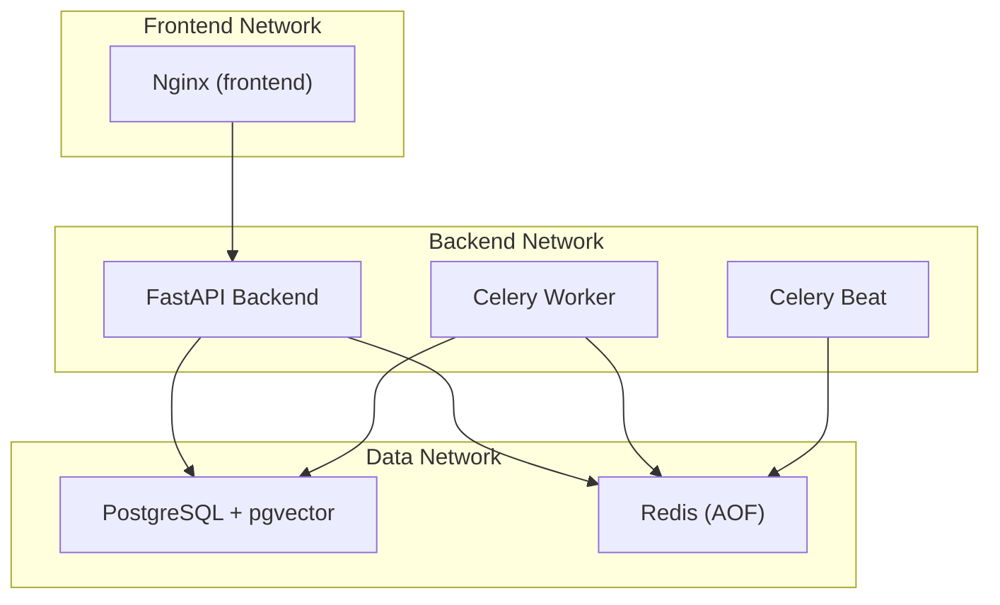
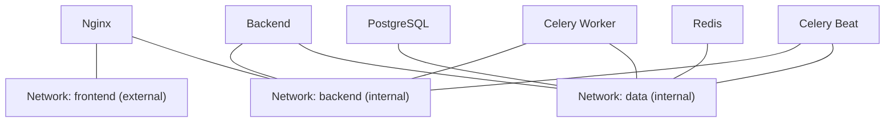
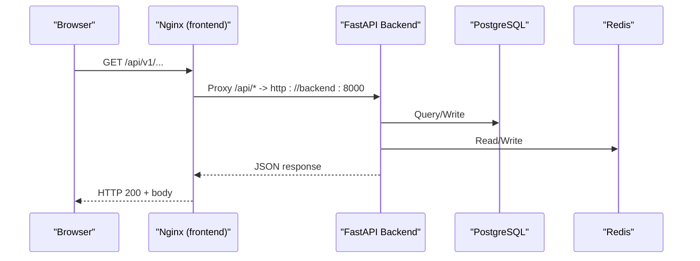
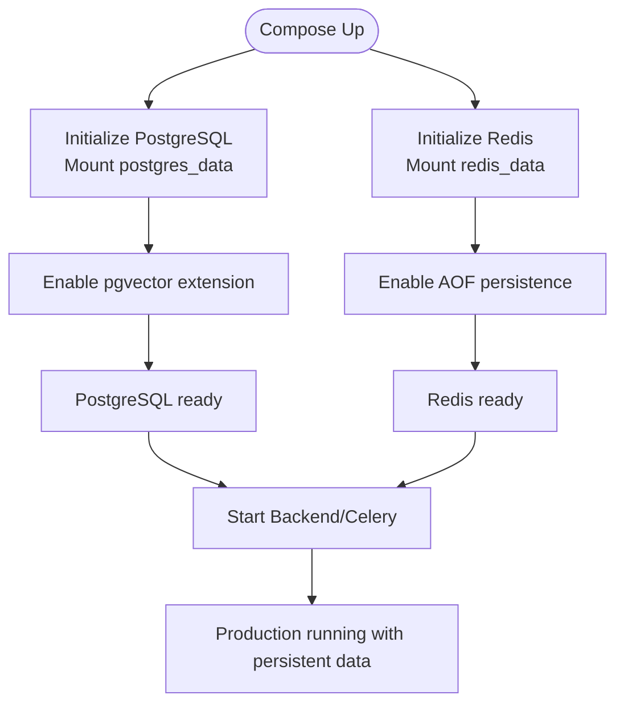
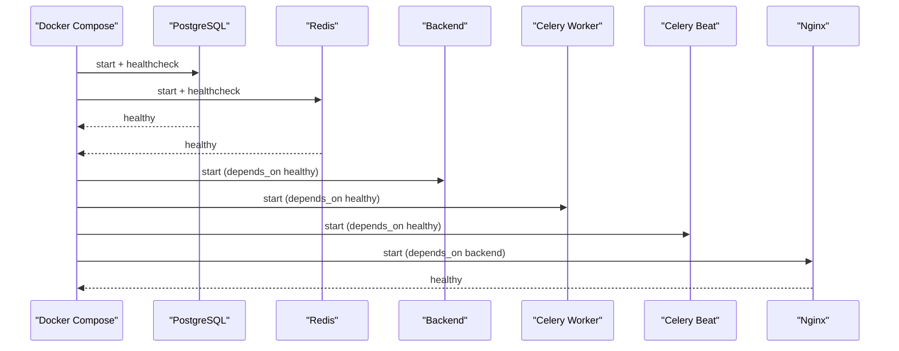
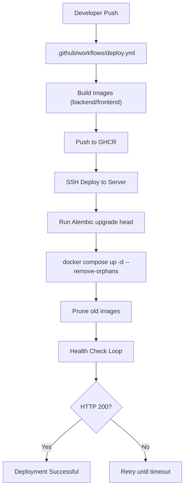
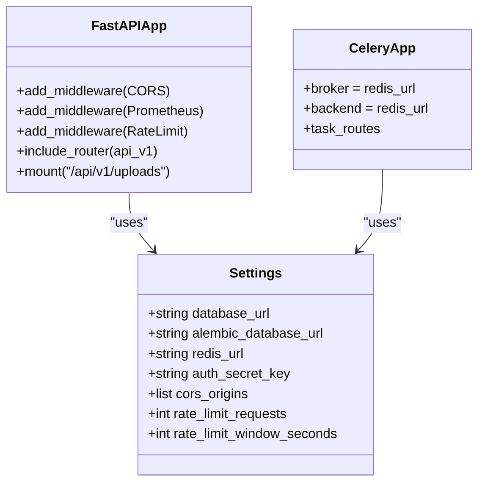
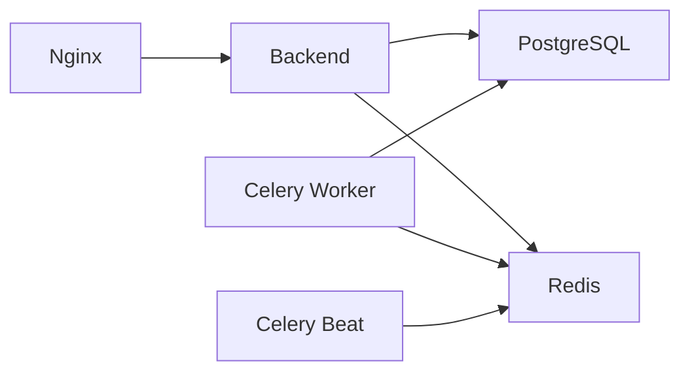

# Infrastructure Setup & Configuration

<cite>
**Referenced Files in This Document**
- [docker-compose.prod.yml](file://docker-compose.prod.yml)
- [docker-compose.yml](file://docker-compose.yml)
- [backend/Dockerfile](file://backend/Dockerfile)
- [frontend/Dockerfile](file://frontend/Dockerfile)
- [DEPLOYMENT.md](file://DEPLOYMENT.md)
- [backend/app/core/config.py](file://backend/app/core/config.py)
- [backend/app/main.py](file://backend/app/main.py)
- [backend/app/api/v1/routes/health.py](file://backend/app/api/v1/routes/health.py)
- [backend/app/celery_app.py](file://backend/app/celery_app.py)
- [frontend/nginx/nginx.conf](file://frontend/nginx/nginx.conf)
- [docker/pg-init/00-enable-vector.sql](file://docker/pg-init/00-enable-vector.sql)
- [.github/workflows/deploy.yml](file:.github/workflows/deploy.yml)
</cite>

## Table of Contents
1. Introduction
2. Project Structure
3. Core Components
4. Architecture Overview
5. Detailed Component Analysis
6. Dependency Analysis
7. Performance Considerations
8. Troubleshooting Guide
9. Conclusion

## Introduction
This document describes the production infrastructure setup and configuration for the Rental Housing Structure application. It focuses on:
- Three-tier network architecture (frontend, backend, data) for service isolation
- Resource allocation strategies with memory limits and reservations per service
- Persistent storage via Docker volumes for PostgreSQL and Redis AOF
- Service dependency management using health checks and startup ordering
- Environment variable patterns and secrets management
- Container orchestration best practices for production scalability

## Project Structure
The production stack is orchestrated by Docker Compose and includes:
- Frontend: Nginx serving a Vue 3 SPA and reverse proxying API calls to the backend
- Backend: FastAPI application with Gunicorn + Uvicorn workers
- Workers: Celery worker and beat for background tasks
- Data: PostgreSQL with pgvector extension and Redis with AOF persistence

**Diagram sources**
- [docker-compose.prod.yml:8-196](file://docker-compose.prod.yml#L8-L196)

**Section sources**
- [docker-compose.prod.yml:8-196](file://docker-compose.prod.yml#L8-L196)

## Core Components
- PostgreSQL 16 with pgvector:
  - Image: pgvector/pgvector:pg16
  - Volume: postgres_data mounted at /var/lib/postgresql/data
  - Health check: pg_isready
  - Resources: limit 1GB, reservation 256MB
- Redis 7 Alpine with AOF:
  - Image: redis:7-alpine
  - Command enables appendonly and sets maxmemory 256MB with allkeys-lru policy
  - Volume: redis_data mounted at /data
  - Health check: redis-cli ping
  - Resources: limit 256MB, reservation 64MB
- Backend (FastAPI):
  - Multi-stage Docker image built from backend/Dockerfile
  - Runs Gunicorn with Uvicorn workers
  - Depends on healthy postgres and redis
  - Resources: limit 512MB, reservation 128MB
- Celery Worker:
  - Same image as backend; runs celery worker with multiple queues
  - Depends on healthy postgres and redis
  - Resources: limit 512MB, reservation 128MB
- Celery Beat:
  - Schedules periodic tasks
  - Depends on healthy postgres and redis
- Nginx (Frontend):
  - Builds frontend Dockerfile (Node build stage + Nginx runtime)
  - Exposes port 80
  - Proxies /api/* to backend:8000
  - Resources: limit 128MB, reservation 32MB

**Section sources**
- [docker-compose.prod.yml:9-196](file://docker-compose.prod.yml#L9-L196)
- [backend/Dockerfile:1-61](file://backend/Dockerfile#L1-L61)
- [frontend/Dockerfile:1-29](file://frontend/Dockerfile#L1-L29)

## Architecture Overview
The system uses three isolated networks:
- frontend: external-facing, allows inbound traffic to Nginx
- backend: internal-only, connects Nginx, Backend, and Celery services
- data: internal-only, connects Backend/Celery to PostgreSQL and Redis

**Diagram sources**
- [docker-compose.prod.yml:206-217](file://docker-compose.prod.yml#L206-L217)

## Detailed Component Analysis

### Network Isolation and Routing
- Nginx listens on port 80 and proxies API requests to backend:8000
- Security headers and gzip compression are configured
- Metrics endpoint is restricted to private IP ranges
- SPA fallback serves index.html for client-side routing

**Diagram sources**
- [frontend/nginx/nginx.conf:1-89](file://frontend/nginx/nginx.conf#L1-L89)
- [docker-compose.prod.yml:170-196](file://docker-compose.prod.yml#L170-L196)

**Section sources**
- [frontend/nginx/nginx.conf:1-89](file://frontend/nginx/nginx.conf#L1-L89)
- [docker-compose.prod.yml:170-196](file://docker-compose.prod.yml#L170-L196)

### Resource Allocation Strategy
- PostgreSQL: memory limit 1GB, reservation 256MB
- Redis: memory limit 256MB, reservation 64MB
- Backend: memory limit 512MB, reservation 128MB
- Celery Worker: memory limit 512MB, reservation 128MB
- Nginx: memory limit 128MB, reservation 32MB

These values ensure predictable scheduling and protection against resource starvation while allowing burst capacity within limits.

**Section sources**
- [docker-compose.prod.yml:29-34](file://docker-compose.prod.yml#L29-L34)
- [docker-compose.prod.yml:58-63](file://docker-compose.prod.yml#L58-L63)
- [docker-compose.prod.yml:88-93](file://docker-compose.prod.yml#L88-L93)
- [docker-compose.prod.yml:127-132](file://docker-compose.prod.yml#L127-L132)
- [docker-compose.prod.yml:185-190](file://docker-compose.prod.yml#L185-L190)

### Persistent Storage Management
- PostgreSQL data directory:
  - Volume name: rental_postgres_data
  - Mount path: /var/lib/postgresql/data
- Redis AOF persistence:
  - Volume name: rental_redis_data
  - Mount path: /data
  - Append-only enabled with everysec fsync policy

**Diagram sources**
- [docker-compose.prod.yml:197-205](file://docker-compose.prod.yml#L197-L205)
- [docker/pg-init/00-enable-vector.sql:1-3](file://docker/pg-init/00-enable-vector.sql#L1-L3)

**Section sources**
- [docker-compose.prod.yml:197-205](file://docker-compose.prod.yml#L197-L205)
- [docker/pg-init/00-enable-vector.sql:1-3](file://docker/pg-init/00-enable-vector.sql#L1-L3)

### Service Dependencies and Startup Ordering
- Backend depends_on postgres and redis with condition: service_healthy
- Celery Worker and Beat depend on healthy postgres and redis
- Nginx depends on backend (no health condition)
- Health checks:
  - PostgreSQL: pg_isready
  - Redis: redis-cli ping
  - Backend: curl http://localhost:8000/api/v1/health
  - Nginx: wget http://localhost:80

**Diagram sources**
- [docker-compose.prod.yml:23-28](file://docker-compose.prod.yml#L23-L28)
- [docker-compose.prod.yml:53-58](file://docker-compose.prod.yml#L53-L58)
- [docker-compose.prod.yml:80-84](file://docker-compose.prod.yml#L80-L84)
- [docker-compose.prod.yml:119-123](file://docker-compose.prod.yml#L119-L123)
- [docker-compose.prod.yml:156-160](file://docker-compose.prod.yml#L156-L160)
- [docker-compose.prod.yml:180-184](file://docker-compose.prod.yml#L180-L184)
- [backend/Dockerfile:46-47](file://backend/Dockerfile#L46-L47)
- [frontend/Dockerfile:23-24](file://frontend/Dockerfile#L23-24)
- [backend/app/api/v1/routes/health.py:6-8](file://backend/app/api/v1/routes/health.py#L6-L8)

**Section sources**
- [docker-compose.prod.yml:23-28](file://docker-compose.prod.yml#L23-L28)
- [docker-compose.prod.yml:53-58](file://docker-compose.prod.yml#L53-L58)
- [docker-compose.prod.yml:80-84](file://docker-compose.prod.yml#L80-L84)
- [docker-compose.prod.yml:119-123](file://docker-compose.prod.yml#L119-L123)
- [docker-compose.prod.yml:156-160](file://docker-compose.prod.yml#L156-L160)
- [docker-compose.prod.yml:180-184](file://docker-compose.prod.yml#L180-L184)
- [backend/Dockerfile:46-47](file://backend/Dockerfile#L46-L47)
- [frontend/Dockerfile:23-24](file://frontend/Dockerfile#L23-24)
- [backend/app/api/v1/routes/health.py:6-8](file://backend/app/api/v1/routes/health.py#L6-L8)

### Environment Variables and Secrets Management
- Centralized settings via pydantic-settings:
  - DATABASE_URL, ALEMBIC_DATABASE_URL, REDIS_URL
  - AUTH_SECRET_KEY, CORS_ORIGINS, rate limiting, SMTP, SMS, WeChat keys
- Production env file usage:
  - docker-compose.prod.yml references .env.prod for service environment variables
  - Database URLs constructed from POSTGRES_USER, POSTGRES_PASSWORD, POSTGRES_DB
  - Redis URL constructed from REDIS_PASSWORD
- Best practices:
  - Use separate .env files per environment (e.g., .env.prod.local)
  - Rotate secrets by updating .env.prod.local and restarting affected services
  - Avoid committing secrets; use CI/CD secrets where applicable

**Section sources**
- [backend/app/core/config.py:15-161](file://backend/app/core/config.py#L15-L161)
- [docker-compose.prod.yml:14-18](file://docker-compose.prod.yml#L14-L18)
- [docker-compose.prod.yml:74-79](file://docker-compose.prod.yml#L74-L79)
- [DEPLOYMENT.md:106-110](file://DEPLOYMENT.md#L106-L110)

### Container Orchestration and Scaling
- Horizontal scaling:
  - Scale backend and celery-worker replicas via compose up --scale
- Logging:
  - json-file driver with rotation (max-size, max-file)
- Health checks:
  - Integrated into images and compose for readiness
- CI/CD:
  - Build/push images to GHCR
  - SSH deploy to server, run migrations, restart services, prune old images
  - Post-deploy health check loop

**Diagram sources**
- [.github/workflows/deploy.yml:42-82](file:.github/workflows/deploy.yml#L42-L82)

**Section sources**
- [DEPLOYMENT.md:101-104](file://DEPLOYMENT.md#L101-L104)
- [docker-compose.prod.yml:94-98](file://docker-compose.prod.yml#L94-L98)
- [docker-compose.prod.yml:133-137](file://docker-compose.prod.yml#L133-L137)
- [docker-compose.prod.yml:191-195](file://docker-compose.prod.yml#L191-L195)
- [.github/workflows/deploy.yml:42-82](file:.github/workflows/deploy.yml#L42-L82)

### Application Entry Points and Middleware
- Backend app creation:
  - Config loaded from environment
  - CORS middleware based on environment
  - Prometheus metrics middleware
  - Rate limiting middleware backed by Redis
  - Request logging middleware
  - Global exception handlers
  - /metrics endpoint exposed
  - Uploads static mount
- Celery app:
  - Broker/backend set to Redis URL
  - Task routes defined for embedding/import queues
  - Timezone and UTC settings

**Diagram sources**
- [backend/app/core/config.py:7-167](file://backend/app/core/config.py#L7-L167)
- [backend/app/main.py:17-81](file://backend/app/main.py#L17-L81)
- [backend/app/celery_app.py:9-30](file://backend/app/celery_app.py#L9-L30)

**Section sources**
- [backend/app/main.py:17-81](file://backend/app/main.py#L17-L81)
- [backend/app/celery_app.py:9-30](file://backend/app/celery_app.py#L9-L30)

## Dependency Analysis
- External dependencies:
  - PostgreSQL 16 with pgvector extension
  - Redis 7 with AOF persistence
- Internal dependencies:
  - Backend depends on PostgreSQL and Redis
  - Celery Worker depends on PostgreSQL and Redis
  - Celery Beat depends on Redis
  - Nginx depends on Backend

**Diagram sources**
- [docker-compose.prod.yml:80-84](file://docker-compose.prod.yml#L80-L84)
- [docker-compose.prod.yml:119-123](file://docker-compose.prod.yml#L119-L123)
- [docker-compose.prod.yml:156-160](file://docker-compose.prod.yml#L156-L160)
- [docker-compose.prod.yml:180-184](file://docker-compose.prod.yml#L180-L184)

**Section sources**
- [docker-compose.prod.yml:80-84](file://docker-compose.prod.yml#L80-L84)
- [docker-compose.prod.yml:119-123](file://docker-compose.prod.yml#L119-L123)
- [docker-compose.prod.yml:156-160](file://docker-compose.prod.yml#L156-L160)
- [docker-compose.prod.yml:180-184](file://docker-compose.prod.yml#L180-L184)

## Performance Considerations
- Memory limits and reservations:
  - Ensure sufficient host RAM to accommodate sum of reservations plus overhead
  - Tune Gunicorn workers based on CPU cores and memory limits
- I/O and persistence:
  - Use local volumes for performance; consider block storage for high-throughput workloads
  - Redis AOF everysec balances durability and performance
- Networking:
  - Keep backend and data networks internal to reduce attack surface
  - Nginx keepalive connections improve upstream performance
- Observability:
  - Prometheus metrics and structured logging aid capacity planning

[No sources needed since this section provides general guidance]

## Troubleshooting Guide
- Common commands:
  - View logs: docker compose -f docker-compose.prod.yml logs -f <service>
  - Check DB readiness: docker compose exec postgres pg_isready
  - Check Redis: docker compose exec redis redis-cli -a <password> ping
  - Disk space: docker system prune -af --filter "until=24h"
  - Celery stuck: docker compose logs celery-worker
- Deployment issues:
  - Run migrations before restart
  - Verify health endpoint after deployment
- Security checklist:
  - Change default passwords
  - Set DEBUG=false and ENVIRONMENT=production
  - Configure CORS_ORIGINS to actual domains
  - Enable SSL with Let's Encrypt
  - Restrict firewall to ports 22, 80, 443

**Section sources**
- [DEPLOYMENT.md:112-133](file://DEPLOYMENT.md#L112-L133)

## Conclusion
The production environment is designed with clear separation of concerns across three networks, strict resource controls, and robust persistence. Health checks and dependency ordering ensure reliable startup, while CI/CD automates safe deployments. Following the documented environment patterns and secrets management practices will help maintain a secure, scalable, and observable system.

[No sources needed since this section summarizes without analyzing specific files]