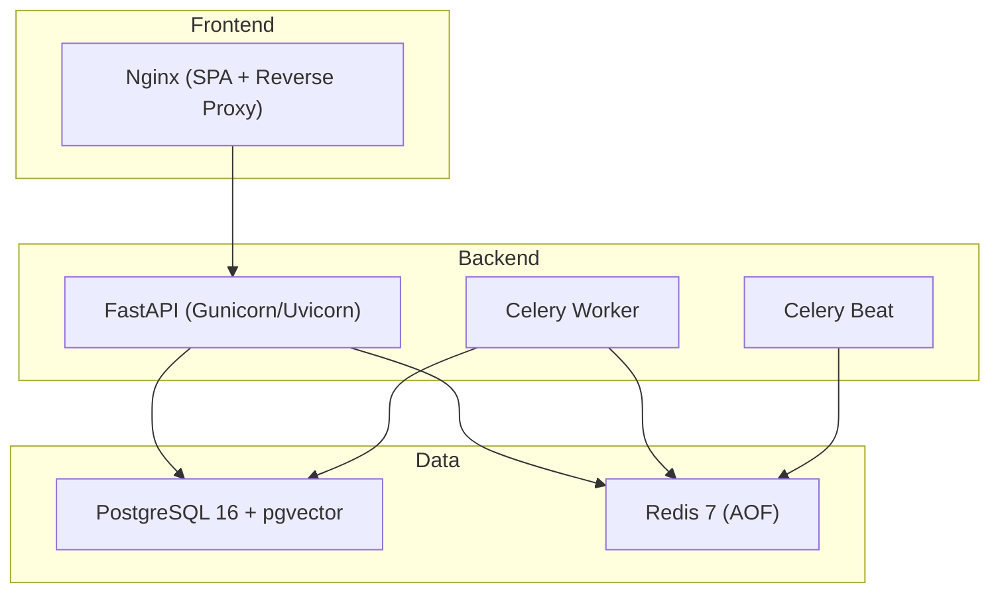
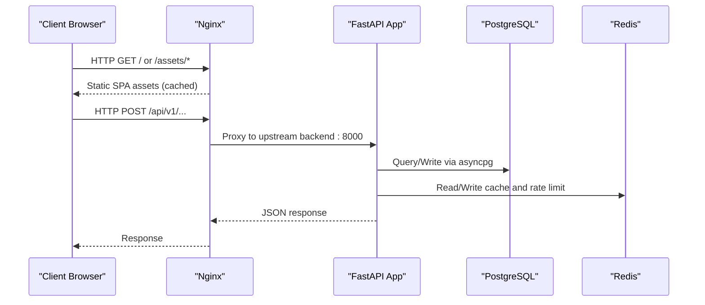
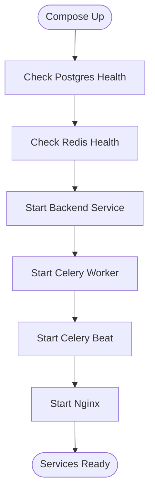
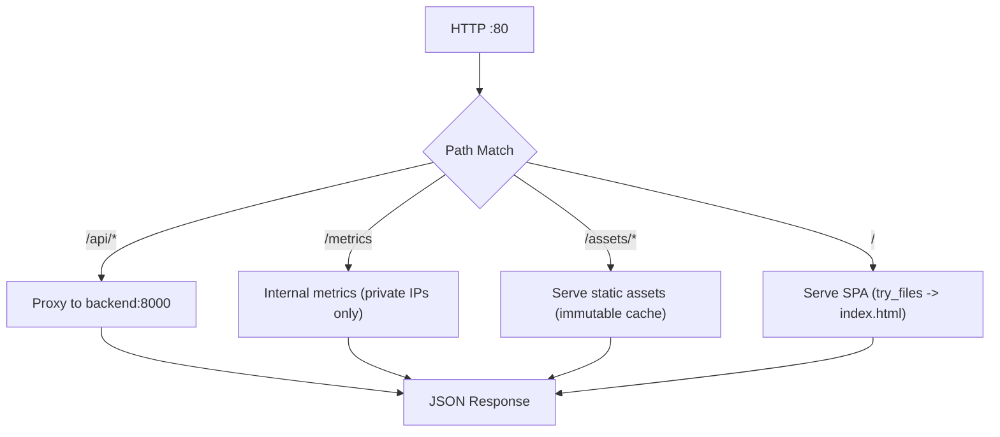
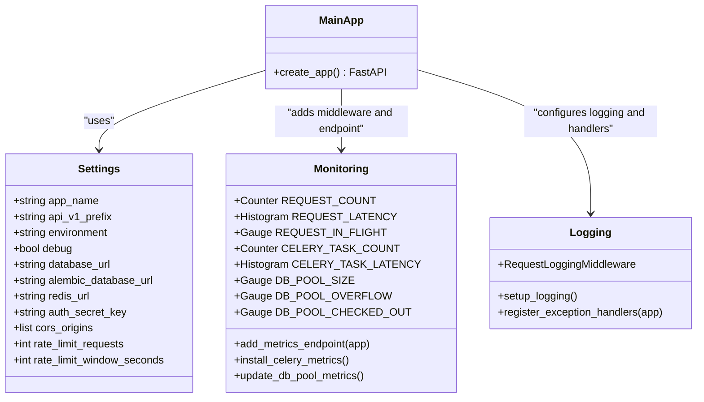
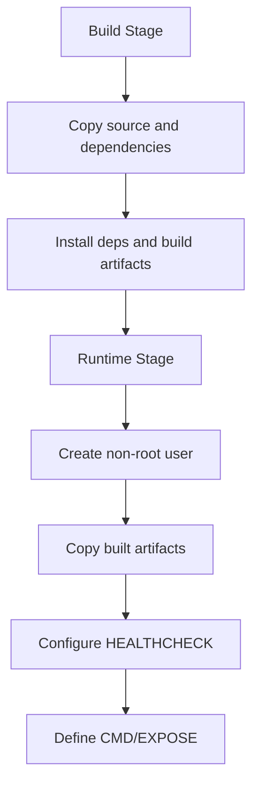
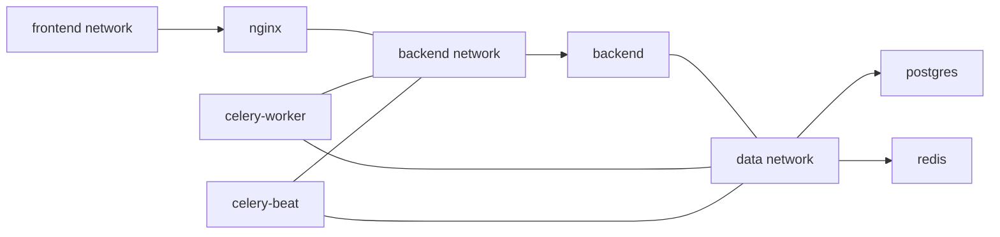

# Production Deployment Configuration

<cite>
**Referenced Files in This Document**
- [docker-compose.prod.yml](file://docker-compose.prod.yml)
- [docker-compose.yml](file://docker-compose.yml)
- [DEPLOYMENT.md](file://DEPLOYMENT.md)
- [backend/Dockerfile](file://backend/Dockerfile)
- [frontend/Dockerfile](file://frontend/Dockerfile)
- [frontend/nginx/nginx.conf](file://frontend/nginx/nginx.conf)
- [backend/app/core/config.py](file://backend/app/core/config.py)
- [backend/app/core/monitoring.py](file://backend/app/core/monitoring.py)
- [backend/app/core/logging.py](file://backend/app/core/logging.py)
- [backend/app/main.py](file://backend/app/main.py)
</cite>

## Table of Contents
1. Introduction
2. Project Structure
3. Core Components
4. Architecture Overview
5. Detailed Component Analysis
6. Dependency Analysis
7. Performance Considerations
8. Troubleshooting Guide
9. Conclusion
10. Appendices

## Introduction
This document provides a comprehensive production deployment guide for the Rental Housing Structure system. It focuses on the production Docker Compose setup, Nginx reverse proxy configuration, database backup and recovery, logging and monitoring integration, environment-specific configurations, secrets management, security hardening, step-by-step deployment procedures, rollback strategies, post-deployment verification, and cloud platform considerations with infrastructure-as-code patterns.

## Project Structure
The production stack is composed of:
- PostgreSQL 16 with pgvector for relational data and vector search
- Redis 7 with AOF persistence for caching and task queues
- FastAPI backend (Gunicorn + Uvicorn workers)
- Celery worker and beat for background tasks
- Nginx serving the Vue SPA and proxying API requests to the backend

**Diagram sources**
- [docker-compose.prod.yml:10-196](file://docker-compose.prod.yml#L10-L196)
- [backend/Dockerfile:52-60](file://backend/Dockerfile#L52-L60)
- [frontend/Dockerfile:13-28](file://frontend/Dockerfile#L13-L28)
- [frontend/nginx/nginx.conf:4-7](file://frontend/nginx/nginx.conf#L4-L7)

**Section sources**
- [docker-compose.prod.yml:1-217](file://docker-compose.prod.yml#L1-L217)
- [docker-compose.yml:1-53](file://docker-compose.yml#L1-L53)

## Core Components
- PostgreSQL service with health checks, persistent volume, and resource limits
- Redis service with AOF enabled, memory policy, password protection, and resource limits
- Backend service using Gunicorn with Uvicorn workers, structured logging, Prometheus metrics, rate limiting, CORS, and upload static files
- Celery worker and beat services connected to Redis and PostgreSQL
- Nginx service acting as reverse proxy and SPA server with gzip, security headers, and long-lived asset caching

Key runtime behaviors:
- Health checks ensure dependency readiness before starting dependent services
- Logging is structured JSON in production; request/response details are captured
- Metrics endpoint exposes Prometheus-compatible metrics
- Rate limiting middleware integrates with Redis when available

**Section sources**
- [docker-compose.prod.yml:10-196](file://docker-compose.prod.yml#L10-L196)
- [backend/Dockerfile:52-60](file://backend/Dockerfile#L52-L60)
- [backend/app/main.py:17-82](file://backend/app/main.py#L17-L82)
- [backend/app/core/logging.py:77-101](file://backend/app/core/logging.py#L77-L101)
- [backend/app/core/monitoring.py:126-176](file://backend/app/core/monitoring.py#L126-L176)

## Architecture Overview
End-to-end flow from client to backend and data stores:

**Diagram sources**
- [frontend/nginx/nginx.conf:40-55](file://frontend/nginx/nginx.conf#L40-L55)
- [backend/app/main.py:71-77](file://backend/app/main.py#L71-L77)
- [docker-compose.prod.yml:66-99](file://docker-compose.prod.yml#L66-L99)

## Detailed Component Analysis

### Production Docker Compose Services
- Postgres:
  - Image: pgvector/pg16
  - Persistent volume for data
  - Health check using pg_isready
  - Resource limits and reservations
- Redis:
  - Image: redis:7-alpine
  - AOF enabled with everysec fsync
  - Memory cap and allkeys-lru eviction
  - Password-based authentication
  - Health check using redis-cli ping
- Backend:
  - Built from backend/Dockerfile
  - Environment variables for DB, Alembic, Redis, and flags
  - Depends on healthy postgres and redis
  - Resource limits and json-file logging rotation
- Celery Worker:
  - Same image as backend
  - Runs worker with concurrency and queue definitions
  - Depends on healthy postgres and redis
  - Resource limits and logging rotation
- Celery Beat:
  - Schedules periodic tasks
  - Depends on healthy postgres and redis
  - Logging rotation configured
- Nginx:
  - Built from frontend/Dockerfile
  - Exposes port 80
  - Depends on backend
  - Resource limits and logging rotation

**Diagram sources**
- [docker-compose.prod.yml:23-28](file://docker-compose.prod.yml#L23-L28)
- [docker-compose.prod.yml:53-58](file://docker-compose.prod.yml#L53-L58)
- [docker-compose.prod.yml:80-84](file://docker-compose.prod.yml#L80-L84)
- [docker-compose.prod.yml:119-123](file://docker-compose.prod.yml#L119-L123)
- [docker-compose.prod.yml:156-160](file://docker-compose.prod.yml#L156-L160)
- [docker-compose.prod.yml:180-184](file://docker-compose.prod.yml#L180-L184)

**Section sources**
- [docker-compose.prod.yml:10-196](file://docker-compose.prod.yml#L10-L196)

### Nginx Reverse Proxy and SPA Serving
- Upstream backend points to backend:8000 with keepalive connections
- Security headers applied globally
- API proxy routes under /api/ with proper headers and timeouts
- WebSocket/SSE support for streaming endpoints
- Internal /metrics endpoint restricted to private networks
- Static assets served with long cache and immutable headers
- SPA fallback to index.html with no-cache for entry point

**Diagram sources**
- [frontend/nginx/nginx.conf:4-7](file://frontend/nginx/nginx.conf#L4-L7)
- [frontend/nginx/nginx.conf:33-37](file://frontend/nginx/nginx.conf#L33-L37)
- [frontend/nginx/nginx.conf:40-55](file://frontend/nginx/nginx.conf#L40-L55)
- [frontend/nginx/nginx.conf:58-67](file://frontend/nginx/nginx.conf#L58-L67)
- [frontend/nginx/nginx.conf:69-87](file://frontend/nginx/nginx.conf#L69-L87)

**Section sources**
- [frontend/nginx/nginx.conf:1-89](file://frontend/nginx/nginx.conf#L1-L89)

### Backend Runtime and Observability
- Application startup configures:
  - CORS based on environment
  - Prometheus middleware and /metrics endpoint
  - Optional Redis-backed rate limiting
  - Request logging middleware
  - Global exception handlers
  - Uploads directory mounted at /api/v1/uploads
- Structured JSON logging in production; colored console logs in development
- Prometheus metrics include request counts, latency, in-flight requests, Celery task counters/histograms, and DB pool gauges

**Diagram sources**
- [backend/app/core/config.py:7-167](file://backend/app/core/config.py#L7-L167)
- [backend/app/core/monitoring.py:74-176](file://backend/app/core/monitoring.py#L74-L176)
- [backend/app/core/logging.py:77-101](file://backend/app/core/logging.py#L77-L101)
- [backend/app/main.py:17-82](file://backend/app/main.py#L17-L82)

**Section sources**
- [backend/app/main.py:17-82](file://backend/app/main.py#L17-L82)
- [backend/app/core/config.py:7-167](file://backend/app/core/config.py#L7-L167)
- [backend/app/core/monitoring.py:126-176](file://backend/app/core/monitoring.py#L126-L176)
- [backend/app/core/logging.py:77-101](file://backend/app/core/logging.py#L77-L101)

### Container Images and Entrypoints
- Backend image:
  - Multi-stage build with Python slim images
  - Non-root user execution
  - Healthcheck against /api/v1/health
  - Gunicorn with Uvicorn workers, keep-alive, max-requests, and jitter
- Frontend image:
  - Node builder stage to compile Vue SPA
  - Nginx runtime serving compiled assets
  - Healthcheck against root path

**Diagram sources**
- [backend/Dockerfile:1-61](file://backend/Dockerfile#L1-L61)
- [frontend/Dockerfile:1-29](file://frontend/Dockerfile#L1-L29)

**Section sources**
- [backend/Dockerfile:1-61](file://backend/Dockerfile#L1-L61)
- [frontend/Dockerfile:1-29](file://frontend/Dockerfile#L1-L29)

## Dependency Analysis
Service-level dependencies and network isolation:
- Backend depends on healthy postgres and redis
- Celery worker and beat depend on healthy postgres and redis
- Nginx depends on backend
- Networks:
  - frontend: external-facing
  - backend: internal-only
  - data: internal-only

**Diagram sources**
- [docker-compose.prod.yml:80-84](file://docker-compose.prod.yml#L80-L84)
- [docker-compose.prod.yml:119-123](file://docker-compose.prod.yml#L119-L123)
- [docker-compose.prod.yml:156-160](file://docker-compose.prod.yml#L156-L160)
- [docker-compose.prod.yml:180-184](file://docker-compose.prod.yml#L180-L184)
- [docker-compose.prod.yml:207-216](file://docker-compose.prod.yml#L207-L216)

**Section sources**
- [docker-compose.prod.yml:80-84](file://docker-compose.prod.yml#L80-L84)
- [docker-compose.prod.yml:119-123](file://docker-compose.prod.yml#L119-L123)
- [docker-compose.prod.yml:156-160](file://docker-compose.prod.yml#L156-L160)
- [docker-compose.prod.yml:180-184](file://docker-compose.prod.yml#L180-L184)
- [docker-compose.prod.yml:207-216](file://docker-compose.prod.yml#L207-L216)

## Performance Considerations
- Database:
  - Use connection pooling parameters appropriate for workload
  - Ensure indexes exist after migrations
- Redis:
  - Tune maxmemory and eviction policy per workload
  - Enable AOF for durability
- Backend:
  - Adjust Gunicorn workers based on CPU cores
  - Set max-requests and jitter to mitigate memory leaks
- Nginx:
  - Keepalive connections to backend
  - Gzip compression for text and JS/CSS
  - Long cache for immutable assets
- Logging:
  - Rotate logs with size and file count limits
- Monitoring:
  - Collect Prometheus metrics and set up alerting thresholds

[No sources needed since this section provides general guidance]

## Troubleshooting Guide
Common issues and commands:
- Service won't start: inspect logs for the specific service
- Database connection errors: verify postgres health and credentials
- Redis errors: test connectivity and authentication
- Disk space low: prune unused Docker resources
- Celery stuck: review worker logs and queue backlog

Operational references:
- Health checks and compose usage
- Backup and restore procedures
- Scaling horizontally
- Secret rotation

**Section sources**
- [DEPLOYMENT.md:112-134](file://DEPLOYMENT.md#L112-L134)
- [DEPLOYMENT.md:71-84](file://DEPLOYMENT.md#L71-L84)
- [DEPLOYMENT.md:101-110](file://DEPLOYMENT.md#L101-L110)

## Conclusion
The production stack uses a clear separation of concerns with secure networking, robust observability, and operational tooling. By following the deployment steps, applying security hardening, and integrating monitoring and backups, the system can be reliably operated at scale.

[No sources needed since this section summarizes without analyzing specific files]

## Appendices

### Step-by-Step Deployment Procedure
- Prepare server requirements and open ports
- Clone repository and configure environment
- Start services with production compose file
- Run database migrations and create indexes
- Verify health endpoint

**Section sources**
- [DEPLOYMENT.md:5-39](file://DEPLOYMENT.md#L5-L39)

### SSL/HTTPS Termination with Let’s Encrypt
- Stop nginx, obtain certificates with certbot standalone mode
- Restart nginx
- Configure cron for automatic renewal
- Mount certificate volumes and update Nginx to serve HTTPS and redirect HTTP to HTTPS

**Section sources**
- [DEPLOYMENT.md:41-62](file://DEPLOYMENT.md#L41-L62)

### DNS Configuration
- Create A records for domain and www pointing to server IP

**Section sources**
- [DEPLOYMENT.md:64-69](file://DEPLOYMENT.md#L64-L69)

### Database Backup Strategy
- Manual backup using pg_dump piped to gzip
- Automated backup via cron job
- Restore procedure using psql

**Section sources**
- [DEPLOYMENT.md:71-84](file://DEPLOYMENT.md#L71-L84)

### Log Rotation and Monitoring Integration
- Docker json-file driver with max-size and max-file options
- Prometheus metrics exposed at /metrics
- Structured JSON logging in production

**Section sources**
- [docker-compose.prod.yml:94-98](file://docker-compose.prod.yml#L94-L98)
- [docker-compose.prod.yml:133-137](file://docker-compose.prod.yml#L133-L137)
- [docker-compose.prod.yml:164-168](file://docker-compose.prod.yml#L164-L168)
- [backend/app/core/monitoring.py:167-176](file://backend/app/core/monitoring.py#L167-L176)
- [backend/app/core/logging.py:86-101](file://backend/app/core/logging.py#L86-L101)

### Environment-Specific Configurations
- Settings loaded from .env with validation aliases
- Production toggles for debug and environment
- CORS origins tightened in production
- Rate limiting parameters configurable

**Section sources**
- [backend/app/core/config.py:7-167](file://backend/app/core/config.py#L7-L167)
- [backend/app/main.py:27-39](file://backend/app/main.py#L27-39)

### Secrets Management
- Use .env.prod.local with docker compose --env-file
- Rotate secrets by updating env file and restarting affected services
- For advanced setups, integrate Docker secrets or external vaults by mounting secret files and adjusting application settings accordingly

**Section sources**
- [DEPLOYMENT.md:106-110](file://DEPLOYMENT.md#L106-L110)

### Security Hardening Measures
- Change default passwords
- Generate strong AUTH_SECRET_KEY
- Disable DEBUG and set ENVIRONMENT=production
- Restrict CORS_ORIGINS
- Enable firewall rules for SSH, HTTP, HTTPS only
- Set up SSL with Let's Encrypt
- Disable SSH root login
- Install fail2ban for SSH protection
- Rotate secrets quarterly
- Review admin audit logs regularly

**Section sources**
- [DEPLOYMENT.md:122-134](file://DEPLOYMENT.md#L122-L134)

### Rollback Strategies
- Maintain previous image tags and revert compose image references
- Re-run migrations only if necessary; avoid downgrading schema changes
- Restore database from last known-good backup if required

[No sources needed since this section provides general guidance]

### Post-Deployment Verification Steps
- Health endpoint check
- API route access through Nginx
- Verify metrics endpoint accessibility from allowed networks
- Confirm logs are structured and rotating
- Validate background tasks processing

**Section sources**
- [DEPLOYMENT.md:37-39](file://DEPLOYMENT.md#L37-L39)
- [frontend/nginx/nginx.conf:58-67](file://frontend/nginx/nginx.conf#L58-L67)
- [backend/app/core/logging.py:86-101](file://backend/app/core/logging.py#L86-L101)

### Cloud Platform Deployment Considerations and IaC Patterns
- Container registries: push images to ECR/GCR/ACR and reference by digest
- Orchestration: migrate to Kubernetes with Deployments, Services, Ingress, and PersistentVolumeClaims
- Secrets: use Kubernetes Secrets or external vaults (e.g., HashiCorp Vault)
- Storage: use managed databases and object storage for uploads and backups
- Networking: restrict ingress to HTTPS and internal metrics
- CI/CD: automate builds, tests, image publishing, and deployments
- Observability: centralize logs and metrics with cloud-native solutions

[No sources needed since this section provides general guidance]